# 将掌控纽约科技未来的 17 位产品经理，以及他们将使用的 9 个框架|第一轮评审

> 原文：<https://review.firstround.com/17-product-managers-who-will-own-the-future-of-nyc-tech-and-the-9-frameworks-theyll-use-to-do-it>

10 月，17 名产品经理围坐在 First Round 纽约办公室的一张桌子旁，准备学习一些新东西。他们是从 800 多名申请人当中精挑细选出来参加第一轮产品项目的，这是第一次为明日之星项目经理举办的系列研讨会，注定会影响未来几年的行业发展。讲师包括最近的产品名人，从维亚康姆 SVP 产品[迈克·伯克利](https://www.linkedin.com/in/michaeltberkley/ "null")到 [Ellevest](http://www.ellevest.com "null") CPO [亚历山大·斯特里德](https://www.linkedin.com/in/alexandriastried/ "null")到 [Kit](https://kit.com/ "null") 创始人[卡米尔·赫斯特](https://www.linkedin.com/in/chearst/ "null")。但是没有人知道会发生什么。

接下来发生的事是命中注定的。我们看到，这个团体变成了每次研讨会后一起喝酒的朋友，最终成为了在职业生涯中相互追随、相互支持的亲密同事。我们还看到他们团结起来，采用老师分享的框架、练习和工具——深入研究，并立即应用到工作中。

为了提供一个了解该计划内容的窗口，我们希望与更广泛的社区分享这些重要的经验教训，并让您先睹为快，看看这 17 位卓越的产品人员是谁。我们坚信，他们将在未来五年打造定义纽约科技的产品和业务。现在就开始了解他们(以及他们将使用的顶级工具)。

# 课程

产品计划的九次会议分别针对产品领导的一个重要领域进行策划:

进入 PM 思维模式。

决定何时建造什么。

基于产品愿景制定战略。

与利益相关者沟通的最佳方式。

如何开发一个凝聚人心的产品叙事？

创建卓越的产品团队。

将自己定位为项目经理。

用数据推动决策。

利用产品技能成为创始人。

在第一轮，我们相信最好的公司通常是由非凡的产品头脑建立的。即使你现在不是项目经理，你也可以从采纳那些让有才华的项目经理成功的习惯和策略中受益。为了帮助实现这一目标，我们将展示每次会议中出现的最具战术性的精华，您可以点击上面的任何链接直接跳到本小手册的该部分。

# 1.进入 PM 思维模式

产品经理的角色有很多定义，其中最流行的是产品的首席执行官，但更多的时候感觉像是猫牧人或项目协调员。它有两重性。你需要既是一个战略专家，又是一个执行导向的多面手。很难一下子体现所有这些。为了将其归结为可管理的规模，导师[阿希姆·索德](https://www.linkedin.com/in/aseems/ "null"),[开放集体](https://opencollective.com/ "null")的联合创始人[史蒂夫·雅各布](https://www.linkedin.com/in/stevejacobs1/ "null"),**光明公司的创始人，提出了这样的指导方针:**一个好的项目经理会填补空白，让出出路。****

你的工作本质上是从当前状态(一个已定义的问题)到事物的未来状态(问题已解决)。让你成功的是战术。要构建真正伟大的东西，你必须一次又一次地这样做，每次你添加一个特性或者做出一个改变。

优先顺序变得至关重要。为了弄清楚你应该首先处理什么，雅各布斯建议计算任何给定功能或产品的重要性:

重要性=震级 x 受影响人数

在等式中，量级是对正在解决的问题有多令人沮丧/痛苦/难以忍受的一种衡量。1 级的问题可能会引起轻微的烦恼，而 3 级的问题可能会引起令人沮丧和愤怒。堆栈相应地排列你需要做什么。

对于你优先考虑的每个项目，定义当前状态和未来状态。然后列出所有你能想到的向后者靠拢的战术。当你开始采取行动时，**不断质疑你正在尝试的策略是否会比原来的问题产生更多的摩擦**。如果答案是肯定的，立即改变路线。当然，日常的产品管理还有更多的内容，但是如果你能把这几条原则内化，你就有了显著的优势。

# 2.决定何时建造什么

知道何时构建或尝试某样东西是至关重要的。在初创公司，人们很容易陷入神游状态，认为一切都同等重要和紧迫。虽然上面的重要性等式可以在高层次上有所帮助，但还有一些更具体的方法来判断您是否在正确的时间构建了正确的东西。来自[熨斗健康](http://www.flatiron.com "null")、[产品管理总监 Keith Cowing](https://www.linkedin.com/in/keithcowing/ "null") 和[产品副总裁 Geoff Calkins](https://www.linkedin.com/in/geoffcalkins/ "null") 的两位导师给出了建议，以确定项目经理应该遵循的事件的确切顺序来完成他们想要的事情:

**基于时间的风险**

当你问自己，“我们现在需要这个吗？”考虑基于时间的风险，问自己这两个具体的后续问题:

如果我们不尽快这么做，会有很大的风险吗？这是什么？这些事情发生的可能性有多大？

如果我们不在特定的时间框架内构建这个东西，我们可能会错过什么机会？

例如，可能竞争对手推出了其产品的新版本，但客户不太喜欢。这给了你一个时间窗口，如果你构建并发布了正确的东西，比如他们现在缺少的功能，就可以吸引他们到你的产品中来。

**先搭积木**

你应该经常问的另一个后续问题是“**有多少其他项目依赖于这个东西？**“例如，一家公司可能决定花一年时间进行基础设施建设，这将为他们未来在许多相关项目上取得成功做好准备。你要尽可能地为自己创造更多的机会，同时也要完成其他优先事项。

# 3.将产品愿景转化为可执行的战略

“产品愿景”是一个含糊不清的术语，不管你愿不愿意，它都会被扔进科技圈。它应该只用来指公司的北极星——他们实际上想要完成或解决的是什么？但是如果没有真正的计划来实现它，它仍然是毫无用处的。这一期产品项目由联合创始人[萨姆·金贝尔](https://www.linkedin.com/in/samgimbel/ "null")和 [Artnet](http://www.artnet.com/ "null") 首席产品官[克里斯·马利瓦特](https://www.linkedin.com/in/maliwat/ "null")讲授，探讨如何将产品愿景转化为明智、系统的行动:

明智地构建你的愿景。它应该是前瞻性的——至少是几年以后。无论你用什么样的声明来定义你正在构建的东西，确保你的团队围绕它团结一致，并且每个人都明白他们的日常工作是如何朝着它前进的。它应该有助于指导日常决策，如建造什么、运输什么和优先考虑什么。

**制定 2-3 个目标，让你朝着那个愿景前进。**这些应该是在一个或几个季度内可以实现的目标(而不是任务),它们将朝着你的北极星取得可衡量的进展——比如减少流失或打开新市场。利用从客户对话中获得的数据实现这些目标。出现了什么问题、责任和机会？围绕它们建立目标，但一次不要太多。

**在每个目标下下注。这是你进入任务的地方。嵌套在每个假设下，下一些赌注——你为实现这些目标而做出的具体假设，以及你将采取的测试这些假设的行动。结果应该尽可能量化。**分散你的风险，这样你就可以一次只接手几个高风险/高回报的项目**以及更有可能成功的项目。**

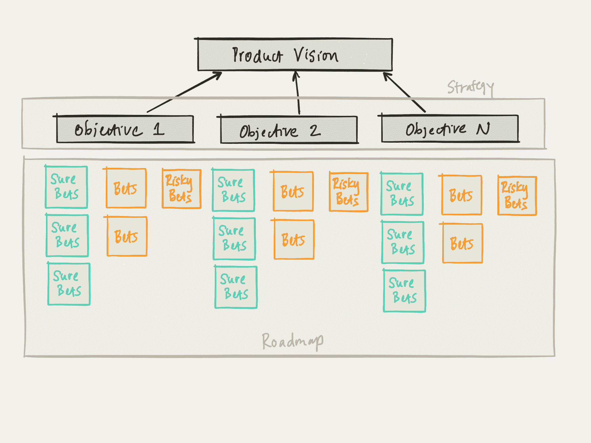

Illustration by Diana Hsieh.

按照这个模板，你最终会得到一个季度路线图，其中每个行动和每个人的工作都与公司的方向和目标紧密相连。此外，它使您能够快速测试、衡量和采用随着时间的推移将对您产生最大影响的功能。

# 4.有效的利益相关者沟通

产品经理处在许多非常不同类型的人的中间，就像电话总机一样，他们需要相应地传递信息，并用每个人都能理解的语言让每个人了解正在发生的事情。在这一环节中，讲师 [Melody Koh](https://www.linkedin.com/in/melodykoh/ "null") 、[蓝色围裙](http://www.blueapron.com "null")的前产品负责人和[elle vest](http://www.ellevest.com "null")CPO[Alexandria Stried](https://www.linkedin.com/in/alexandriastried/ "null")列出了确保与四个主要利益相关群体顺利沟通的所有注意事项和禁忌。

**第一组:高管和领导**

你的任务是让一群没有时间的人快速高效地工作。要做到这一点:

**做什么...**

每次会议前发送演示文稿、资料和其他材料。对于非常忙的人来说，在会议前打印材料，并留出前 5 分钟来回顾。

用数据验证每一个决定，表明你已经考虑了所有可能的结果。

具体说明高管希望的参与。简明扼要地列出会议期间你需要他们实时帮助做出的决定。

记笔记并结束循环。立即跟进未解决的问题和请求。

在每次会议后立即发送高级更新，包括行动项目、任务状态，使用红/黄/绿等清晰的颜色来表示哪些项目落后于计划、进展顺利、进展顺利。

**不要...**

说得太详细了。只分享重要的东西。

用坏消息给任何人一个惊喜。如果消息不好，提前 1:1 联系人们，让他们有时间思考。然后和每个人开一次会，找出解决办法。

毫无准备地出现。没有即兴表演。

忽略房间动态。你需要观察人们对信息的反应，并实时调整。在紧张局势出现时化解紧张局势。根据需要减速或加速。

**第二组:你自己的团队**

这些都是你经常见到和交谈的人。但信息仍然会从缝隙中漏出来，你必须确保每个人都在前进。

**做...**

利用有效的日常站立。这是您轻推、获取状态更新和调出未完成的行动项目的时间。

定期审查战略/路线图。每周评估是否需要改变。哪些数据推动了这些变化？

记录并发送关于关键决策和行动的笔记。这比其他任何事情都更好地保持了对齐。

促进围绕路障的对话。不要只是观察一些事情没有完成。追根究底。

经常奖励团队成员。突出和展示他们工作的影响。特别是，讲述客户痛点得到缓解的趣闻。

**不要...**

没有工程和设计就做决定。**自主决策具有破坏性的连锁反应。**而且绝不把他们当下属。

发送行动项目/请求，不要先谈论它们。不要仅仅通过生产力工具把事情分配给人们。一对一或单口相声的形式聊一聊。

忘记更新路线图或规格的变化。在与高管会面后，这一点尤为重要。与您的团队一起回顾这些变化，并解释为什么做出这些变化。

**第三组:内部和外部合作伙伴**

这可能包括内部团队，如财务和法律团队，或外部团体，如与您合作开展活动的品牌。他们有不断变化的需求，项目经理需要捕捉并快速响应。

**做...**

展示对其工作和领域的详细理解。

在正确的时间和正确的受众使用正确的形式。确保你以人们期望和喜欢的方式传达信息。甲板/白板/书面报告等。这差别很大。

利用你的队友。让工程领导和其他人参与进来，让利益相关者感觉他们是从最终来源那里听到的。

温和而持续地教育他们。伴侣有时不知道自己行为的后果。花时间用外交辞令解释一些事情——比如一个看起来相对简单的变化对工程师来说意味着更多的工作。

在工作会议之外建立关系。进行一对一的散步或喝咖啡来建立融洽的关系。

创造透明度。不要依赖别人去和所有人交流。公开分享并指出路线图，供**每个人**使用。

**不要...**

忘记谁在哪个阶段循环。列出所有预期的工作以及谁需要知道什么。给每个人充分的提醒。

让利益相关者感到被忽视。即使你无视反馈，也要跟进并解释。

忘记你比任何人都更有洞察力。利益相关者看不到你的路线图。宁可过度沟通。

允许会议不明确地结束。在每次会议结束时，陈述主要结论和行动项目。获得普遍认同。

忘记关于时间表和权衡的教育。主动提供这些信息，不要等着被询问。

**第四组:客户**

作为一名项目经理，你应该学会与客户交谈，这样他们的需求才能得到很好的体现，并对他们产生正确的影响。

**做...**

永远从用户问题开始。不要只是接受一个痛点的存在。问一问为什么，理解造成这一痛点的旅程。

把对他们来说重要的事情放在第一位。在与其他利益相关者交谈时，不断参考用户研究和对话。

将电子邮件视为产品体验的一部分。这是你给顾客留下的第一印象之一。

通过阅读用户反馈、亲自参加用户研究、跟踪销售和客户成功等方式，让自己产生共鸣。

**不要...**

将产品宣传/信息留到最后一刻。信息通常可以定义产品选择，而不是相反。**以此开始，不要以此结束。**

假设市场营销将定位产品本身。你带来了很多他们没有的背景知识。呆在房间里。

让客户对产品发布一无所知。他们是前线。相应地对待他们。

相信内部产品不需要推广。内部用户才是真正的用户。他们需要加入、接受培训并保持参与。

# 5.创建引人注目的产品信息

如果你没有一个恰当的叙述来传达这种伟大，那么你已经创造了一个美丽的产品也没有用。产品项目导师[迈克·伯克利](https://www.linkedin.com/in/michaeltberkley/ "null")和[伟大的琼斯](https://www.greatjones.co/ "null")创始人兼首席执行官[杰伊·高德朗](https://www.linkedin.com/in/jaygoldklang/ "null")接过了这个话题——解释项目经理需要(也能够)成为他们公司里最好的故事讲述者

他们建议从一个问题开始:

你想给你的用户什么超能力？

例如，亚马逊 Kindle 让普通人更容易阅读。无论我们在世界的哪个角落，iPhone 都能让我们导航到未知的地方。伟大的产品解决了人类的核心需求*和*以一种容易让人看到、感受到并深刻理解其价值的方式呈现。**这就是强有力的产品叙述如何推动人们采取行动。**

作为一名项目经理，你的工作是确保整个团队知道你试图为你的用户创造的故事。如上所述，这应该是开发过程中的第一步，而不是最后一步。Goldklang 依靠[威尔·卡林](https://wagner.nyu.edu/community/faculty/will-carlin "null")的 5 C 框架来讲述强有力的故事。然而，在应用它们之前，你的目标应该是围绕单个用户——而不是一群用户——来构思一个故事。

**语境**:建立你与之对话的用户的设置和身份。

**冲突**:你的产品试图为那个用户解决的问题。

**冲突升级:**真实地想象用户遇到这个问题是什么样子。把与痛点相关的情绪和已经尝试过但失败的解决方案画出来。真实地感受和描述挫折、失望等。

**高潮:**你的产品推出——对用户有什么改变？

**结论:**对用户生活改善的详细描述。

使用这个框架来创建一个关于你的产品的故事。在全体会议、工作会议、跨职能状态更新等场合分享。记住，无论你做什么，一旦你的故事开始，不同的版本都会出现。**要想获胜，就要精心策划一个与你的用户最接近、最个性化的故事。情感上的共鸣越多，就越会淹没相互竞争的观点。**

# 6.建立你最好的产品团队

你建立的产品团队将对你的公司产生深远的影响。你必须雇佣那些不仅有才华，而且非常适合你的特定业务的人。导师[娜塔莉·直布罗陀](https://www.linkedin.com/in/nataliegourvitch/ "null")， [Squarespace](http://www.squarespace.com "null") 的产品总监，[克里斯汀·唐尼诺](https://www.linkedin.com/in/kristen-donnino-766776/ "null")，[适应性](http://www.adaptly.com "null")的产品副总裁，分享了一个三步练习，以确保你在招聘最佳团队的过程中:

建立一个战略性的招聘计划

定义关键能力

标准化你的能力评估。

这是每个初创公司在扩大规模之前都应该做的一项工作。

**制定战略性招聘计划**，确定现有团队中的哪些人应该参与招聘流程(该职位将接触的所有相关人员)，以及每位候选人在申请和被聘用之间将采取的具体步骤。这将因公司的价值观和文化而异，但每一个战略性招聘计划都应该设计成尽可能多地提取候选人的相关信息，同时让他们熟悉他们将与之共事的人。它还应该优化只投资在最佳候选人大量的时间。

一旦你有了一个好的计划，就和面试中的每个人分享。让他们在里面戳洞，进入他们每个人将要扮演的角色的细节。

**定义一个角色的关键能力列表**将所有利益相关者召集到一个房间，让他们说出所有与优秀产品经理相关的技能和属性。一旦你有了一个健康的清单，让每个人都默默地投票选出他们认为最重要的能力。考虑把它们都写在白板上，给每个人发 3 张贴纸，贴在他们首选的旁边。当 Donnino 和 Gibralter 在产品程序类中运行这一过程时，“高情商”赢得了胜利，而“关注细节”和“数据驱动”位居第二。

你要确保你的招聘团队中的每个人都围绕相同的顶级能力，这样人们就不会仅仅根据自己的标准做出判断。在你列出了你要关注的品质清单后，作为一个团队，清晰明确地定义它们对你的意义。同一个词对不同的人有不同的意思。作为一个群体有一个单一的定义有助于确保候选人将得到公平和准确的判断。

**要创建问题和评估标准，**您可以使用非常相似的方法。再次，带领你的招聘团队进行头脑风暴和投票。**第一阶段:**对于每项能力，每个人都分享他们最喜欢面试问题，以评估候选人的特质。**第二阶段:**用贴纸进行另一轮无声投票，直到你得到最好的 3-5 个问题。例如，评估情商的前两个问题是:

给我一个你被误解的例子。你是怎么处理的？

你是如何让你的团队走出失败的？

你想出的所有问题可能都很棒，但你想集中精力，最大限度地与候选人共度时光。与你的招聘团队合作，就应该问的最佳问题达成一致，并对每个面试的候选人保持同样的问题。

不过，你还没完成。类似地，你必须决定每个问题的好的和坏的答案听起来像什么。再一次，你可以让人们集体讨论一个问题的最佳答案，然后让整个小组投票，看看哪种回答是最好的。很明显，候选人不可能一字不差地达到那个标准，但是你想知道最令人印象深刻的答案会包括或涉及什么。你希望每个面试他们的人都记住这个标准。

进行这项练习需要大量时间。您必须进行几轮投票，以得出能力、每项能力的问题以及每个问题的最佳和最差答案。听起来好像很多，但合作创建一个标准化的方法是非常值得的——随着招聘速度的加快，可以一次又一次地回收和重复使用。

# 7.将自己定位为产品领导者

每个创业 PM 都在和时间赛跑。晋升取决于你提升自己的能力，以及你的能力与公司发展的速度。讲师和产品负责人 Justin Chang 说，要做到这一点，项目经理应该把重点放在四个方面:决策、速度、协作和授权。

**决策**在某个增长点开始减速并崩溃。警告信号是厨房里厨师太多，速度变慢了。解药是 DACI 框架:

**驱动者**:负责项目的人，他推动过程并使每个人保持一致。通常，这是项目经理。

**批准人**:批准项目提案/建议的人。只能有一个审批人。一旦授予了批准权限，公司层级中甚至更高级的人员也不能否决此人的批准。

**贡献者**:在项目团队中工作、提供输入、生产工作等的人。

**知情**:了解项目和结果的人，但不直接参与，也不参加会议。

根据 Chang 的说法，这个框架对于提高士气、简化活动和减少每个人的上下文切换具有巨大的力量。

随着技术债务的积累和团队的成长，工作速度开始变慢。这会使成本增加到危险的程度。为了解决这个问题，**围绕持久问题建立持久团队**。例如，ClassPass 围绕收购、工作室体验和机器学习组织了团队。为了避免范围蔓延和最后一刻的设计变更，Chang 推荐以下**产品开发流程**:

**目标定义:**你的 DACI 框架中包括的每个人都应该走到一起，为产品提出一个单一的目标。

**产品定义**:协调项目范围和解决手头问题所需的资源。什么超出了范围，什么没有超出范围？

设计回顾:明确你想要什么样的反馈，不想要什么样的反馈。

确保每个人都有机会讨论和认同技术方法。

**去/不去:**检查你的清单，确保公司的其他部门已经为产品/项目发布做好了运营准备——例如，客户服务有足够的带宽来回答问题，等等。

协作在一定的公司规模下开始破裂。当人们的日历上排满了会议，只是想了解整个组织正在建设什么时，你就会意识到这一点。人们迷失了路线图，或者被产品发布弄得措手不及。通过以下三个步骤解放员工，促进有效协作:

让整个公司都可以访问您的产品路线图和产品文档。

与你的 DACI 团队中的每个人举行入门会议。门户会议迫使必须做出的决定继续进行。准备一份包含所有决策背景的产品文档，并以 10 分钟的默读时间开始会议。

**发送决策电子邮件**向所有可能的利益相关方传达何时做出重大决策以及在开发流程的每个阶段做出决策的原因。

**当团队变得如此庞大，以至于人们觉得他们只是在执行别人的命令时，大规模授权**就变得很重要。这可能会打击士气。当你看到人们无力地支持决策，并把失败归咎于他人时，它就会显现出来。有几种策略可以解决这个问题:

**提出选择而不是坚定的决定。**就如何解决问题、他们想要实现什么结果、用什么标准来衡量、成功看起来会是什么样，给团队成员尽可能多的选择。

**以背景分享开始里程碑会议。**在房间里走动，让每个人简要陈述他们对项目的了解、希望了解的情况以及他们最感兴趣的事情。

正如巴顿将军所说，“永远不要告诉人们如何做事；告诉他们你需要他们完成什么，让他们用他们的聪明才智给你惊喜。”

# 8.用数据推动产品开发

项目经理使用数据将利益相关者与路线图联系起来，跟踪已建项目的功效，并确定下一步要建项目的优先级。然而，不断有压力要用数据做更多的事情并更快地学习。为了确保你在这个舞台上保持专注和高效，导师们[张小迪张](https://www.linkedin.com/in/xiaodizhang/ "null")、[第一首席采购官](https://www.1stdibs.com/ "null")和 [Anthony Schrauth](https://www.linkedin.com/in/aschrauth/ "null") ，前 [Betterment](https://www.betterment.com/ "null") 首席采购官兼首席信息官，提供了一套简单的规则:

你必须收集隐含的数据。别找借口了。是的，你有其他优先考虑的事情，但是你必须找到小的方法来定量地测量你的产品的用户行为模式。如果不这样做，你将无法真正了解用户对新特性的反应。你可能会实现一些你认为很棒的东西，却看到了强烈的反对。这些可以是小实验，比如看是否有人会点击一个链接。

**不要低估显性数据的重要性。**如此多的初创公司依赖统计数据来验证他们的假设，而没有看到更大的图景。通过接受用户直接分享的定性反馈来保护自己免受这种影响。给它同等的，如果不是更多的重量。

**观察顾客的时候，一定要去找他们。**你想了解人们在自然环境中如何使用你的产品。根据他们在特定情况下如何使用产品的独特背景来设计问题。如果他们有任何变通方法，请特别注意。

**为你的问题找到合适的用户。**在 B2B 公司，产品经理经常发现自己与客户的高管们打交道。他们的反馈会与其他可能是你产品主要用户的员工不同。确定谁是与你的产品最相关的用户，并直接向他们提出问题。

**为你的表现找到一个有意义的衡量标准。当你调查你的用户对你的产品的喜欢程度时，你需要确保你衡量的东西是正确的。什么指标将表明你正以你想要的方式成功地与人相处？净推介值是一个常见的选择——衡量某人推荐你的产品的可能性。但这并不是普遍适用的。**

例如，在 Betterment，团队使用了一段时间的 NPS Score，但随后注意到它随着股票市场的起伏而波动。他们增加了一个**客户努力分数**——衡量公司是否让完成某些任务变得更容易。

# 9.从项目经理到创始人

在很多方面，产品管理是创始人理想的跳板。这是一个让你有机会深入自己的业务领域的职位，即谈判、P&L 和预测、法律、招聘和运营。但是在你进入所有这些之前，你需要确定你选择了正确的想法去工作。在产品项目的最后阶段，导师[卡米尔·赫斯特](https://www.linkedin.com/in/chearst/ "null")、 [Kit](http://www.kit.com "null") 的联合创始人兼首席执行官[和【垃圾电视】的联合创始人兼首席执行官汉娜·多诺万](https://www.linkedin.com/in/hannahdonovan/ "null")与项目经理坐在一起谈论创意选择。

你如何知道一个想法是否值得追求？他们建议根据 Marty Cagan 的四大风险来评估每一个风险:

**价值**:人们想要这个吗？当你与潜在用户交谈时，他们是否看到了你所构建的东西的价值？

**可用性:**人们能直观地理解你的解决方案或产品吗？

**可行性:**你和一个最终的团队能在现实的时间框架内，利用你实际能得到的资源，建立起你心目中的东西吗？

**生存能力**:是否有清晰的商业模式和赚钱路径？

在你开始寻找一个想法之前，确保你能勾选每个选项，并自信地向潜在投资者解释你对每个问题的答案。

# 认识纽约未来的产品领导者

上面分享的所有框架和经验现在都是下一代纽约产品领导者和创始人的工具。正如我们所说，参加产品计划的 17 位项目经理是从 800 多名候选人中挑选出来的。在我们看来，他们是纽约科技社区值得关注的人。现在他们已经彼此联系，他们是不可阻挡的。我们强烈建议现在就去了解他们。

**[亚历克斯·鲍威尔](https://www.linkedin.com/in/apowell64/ "null")** **，产品经理** **[温室](https://www.greenhouse.io/ "null")** **，**在新泽西长大(骄傲地，不管别人怎么说)。他决定在普林斯顿多呆四年，然后开始他的移民律师助理生涯——那时他以为自己要去法学院。幸运的是，温室看到了他的潜力，并聘请他为他们的支持团队。除了创始人之外，他还是第一个进入产品领域的项目经理。当他不工作时，他引用晦涩的电视节目和电影。

**[Alexander Tsu](https://www.linkedin.com/in/alexandertsu/ "null")****，****[four square](http://www.foursquare.com "null")****，**监管企业数据产品和拥有超过 12 万用户的开发者平台。他的工作是确保开发者可以利用 Foursquare 的 9300 万个位置的庞大数据库来构建令人难以置信的新产品。他在达特茅斯大学学习经济学，在芝加哥大学学习计算机科学。工作之余，他看金州勇士队比赛，喝波霸，唱跑调的卡拉 ok。

**[Ara Cho](https://www.linkedin.com/in/aracho86/ "null")** **，****[Nomad Health](https://nomadhealth.com/ "null")****，**的产品经理最近加入了这个团队，专注于建立一个连接医院和临床医生的在线招聘平台。她在 OnDeck 开发了自己的产品，帮助更多的小企业获得贷款，并扩大了公司在加拿大和澳大利亚的市场。在这个过程中，她学会了如何与国际用户打交道。她拥有伯克利的工商管理学士学位和哈佛的工商管理硕士学位。工作之外，她是一个排球迷，是 YouTube 的忠实用户，每天都利用纽约来实现她的 step 目标。

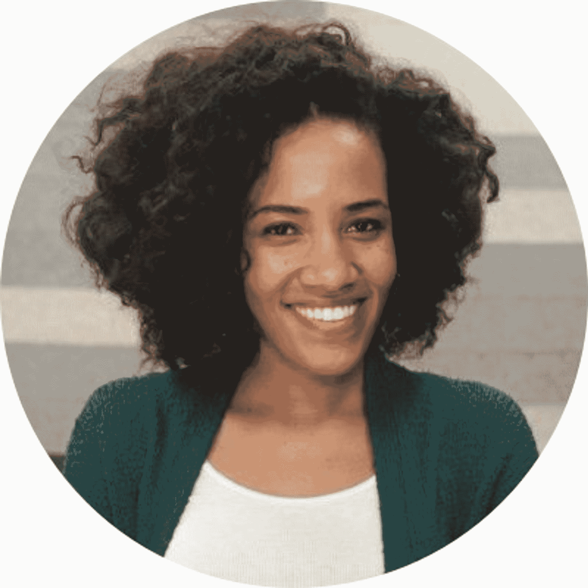

**[布兰妮·格温](https://www.linkedin.com/in/bgwynn/ "null")******[产品总监简单联系人](https://www.simplecontacts.com/ "null")** **，**专注于获取、转换和构建技术，在患者方便时直接为其提供护理。她在谷歌开始了她的职业生涯，在那里她对发现用户体验的差距和预测产品可用性缺陷产生了兴趣。后来，她以项目经理的身份加入了 SoundCloud，帮助在几个市场推出新的消费者订阅产品。Brittney 热爱产品，因为它触及业务的所有方面，从营销和工程到支持整个公司的愿景，同时解决切实的用户问题和构思下一个层次的有抱负的用户旅程。她毕业于霍华德大学，是土生土长的底特律人，热爱旅行，是纽约市黑科技女性组织的负责人。**

****

****[丹尼尔·莱菲尔德](https://www.linkedin.com/in/layfield/ "null")** **，** **[代码学院的产品经理](http://www.codecademy.com "null")** **，**将他的时间分配在产品团队和管理与政府、科技公司和非营利组织的外部合作伙伴关系上。Codecademy 正处于快速增长阶段，因此他的角色是寻找合适的商业机会和扩大组织规模的结合。在投身科技行业之前，他在管理咨询行业工作了五年，在银行业工作了两年。他离开了那个世界，创办了自己的程序化广告公司。工作之余，他为纽约橄榄球俱乐部和纽约骑士队打橄榄球。**

**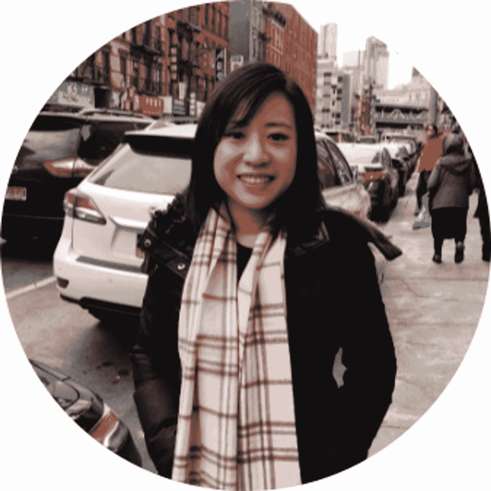**

****[Diana Hsieh、](https://www.linkedin.com/in/diana-hsieh-87070022/ "null")******[蟑螂实验室、](https://www.cockroachlabs.com/ "null")** 的产品经理喜欢 PMs 和其他部门之间自然形成的合作关系，因为她每天都能从同事那里学到一些新东西。她花大量时间与工程人员坐在一起，与一群客户交谈，并赶技术论文。在蟑螂之前，她在一家风险投资公司工作了两年，对企业软件初创公司进行尽职调查，但她的职业生涯是从投资银行家开始的。虽然她喜欢业务方面，但她希望更多地接触技术。她加入了蟑螂，这样她就可以在建设未来中发挥作用。她毕业于麻省理工学院，获得经济学学位，目前正在佐治亚理工学院攻读计算机科学硕士学位。****

****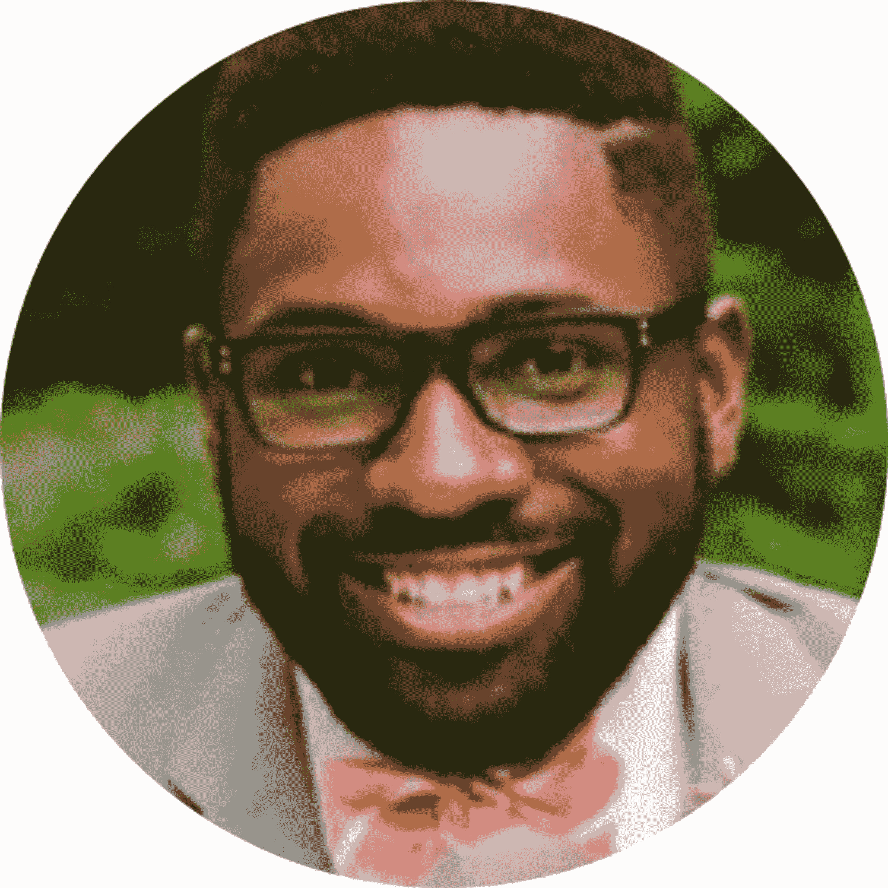****

******[唐·理查德](https://www.linkedin.com/in/doncrichard/ "null")** **，** **[威瑞森](http://www.verizon.com "null")** **，**的产品经理着迷于技术带来的机会，这些机会从根本上改变了我们学习、交流的方式，并为不幸的人创造了公平的竞争环境。他目前从事威瑞森的 Fios 电视和互联网服务，构建移动商务和平台产品。此前，他经营着一家名为 Coin Labs 的移动商务和支付咨询公司，并领导了客户通信初创公司 LiveNinja 的合作伙伴关系。他拥有佛罗里达大学的市场营销学位(在那里他还辅修了创业学)和里士满大学法学院的法学博士学位。闲暇时，他和妻子比格以及金多乐一起闲逛。****

****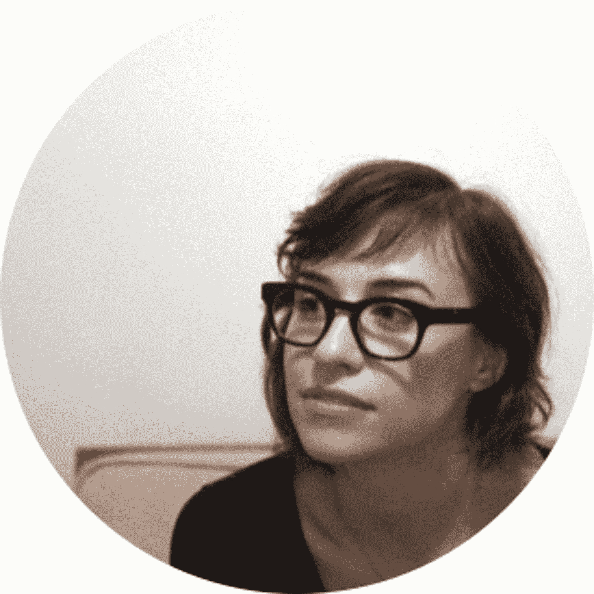****

******[Ida Fey](https://www.linkedin.com/in/ida-fey-33515572/ "null")******[产品经理 AbleTo](https://www.ableto.com/ "null")** **，**建立了将患有严重疾病或生活压力的人与临床治疗联系起来的技术。她监督患者体验，并负责产品的临床和技术方面。在从事医疗保健工作之前，她在营销咨询和软件之间辗转。她毕业于密歇根大学，获得艺术治疗和摄影 BFA。制造产品让她能够融合自己的经验，专注于技术设计对人类的影响。工作之外，她花时间逛艺术博物馆，和她的狗出去玩，旅游，通过相机镜头凝视。******

****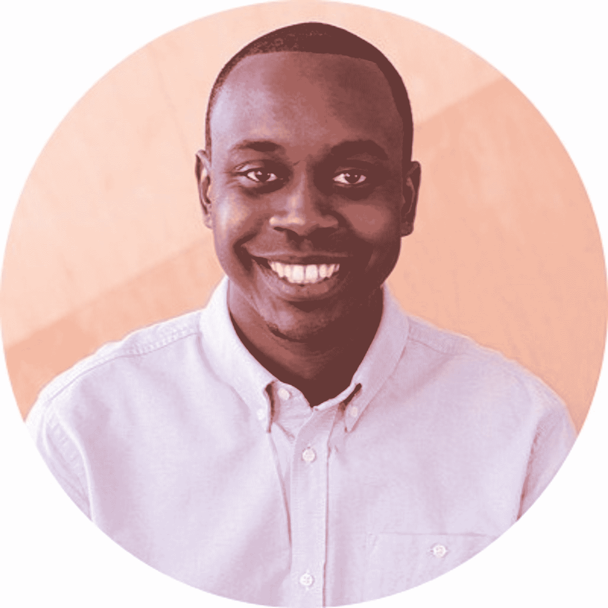****

******[Isaiah Greene](https://www.linkedin.com/in/isaiahgreene/ "null")****，****[Slack](http://www.slack.com "null")****，**是该公司的搜索、学习和智能团队成员，他的工作重点是帮助在产品之上构建一个智能层，让用户的生活更简单、更愉快、更有效率。从宾夕法尼亚大学获得计算机科学学位后，他在谷歌工作了五年——首先是软件工程师，然后是莫尔豪斯学院的客座 CS 讲师，后来是项目经理。转向产品管理让他能够结合多种爱好:利用技术、解决问题、设定愿景、探索、交流和构思来制造改善人们生活的产品。****

****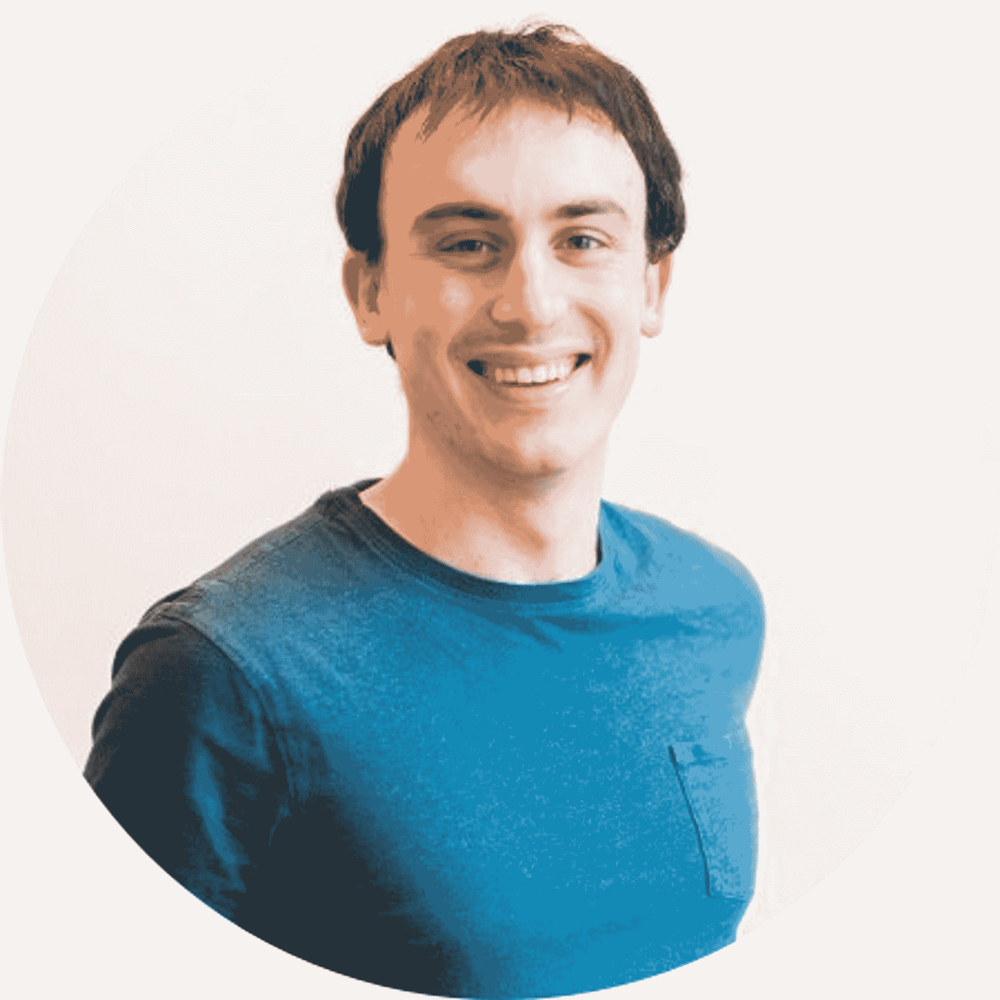****

******[雅各布·埃夫龙](https://www.linkedin.com/in/jacobeffron/ "null")** **，** **[熨斗健康](http://www.flatiron.com "null")** **，**的产品经理帮助社区肿瘤学家改善他们的运营方式。他热衷于使用技术来提高医疗保健的可及性和质量，并喜欢日复一日地身兼数职。在 Flatiron 之前，他是麦肯锡的医疗保健和经济发展顾问。在一个特别令人兴奋的移动商业模式项目后，他搬到坦桑尼亚，与一家太阳能初创公司合作，向离网家庭出售小型系统。他毕业于耶鲁大学，获得经济学和历史学学士学位。他在波士顿长大，非常喜欢蛤蜊浓汤和所有波士顿运动队。在纽约，他喜欢打篮球和唱卡拉 ok。****

********

******[吉沙雅各布](https://www.linkedin.com/in/jishasjacob/ "null")** **，产品经理****[AppNexus](http://www.appnexus.com "null")****，**专注于供应管理和库存优质产品，与工程、数据科学和设计部门紧密合作。在成为项目经理之前，她是公司服务团队的一员，首先是产品专家，然后是新客户的实施顾问，最后是解决方案工程师。从斯坦福大学毕业后，她致力于自己的创业公司“活跃的一代”(TAG)，以激励和授权学生过上更健康的生活，并入选通用电气的夏季孵化器。如今，她正在哥伦比亚大学攻读计算机科学和机器学习硕士学位，并利用业余时间撰写青少年科幻小说，讲述一所面向儿童的未来黑客学校。****

********

******Maddy Moelis，** **[前产品经理佐拉](http://www.zola.com "null")** **，**一直着迷于消费心理和与客户共情解决现实问题的力量。这让她首先了解了消费者，然后是产品管理。她目前正致力于消费者领域的一家预发布创业公司。在独立创业之前，她在多元化招聘平台 Jopwell 负责产品，在婚庆公司 Zola 担任项目经理，并在 Warby Parker 管理消费者洞察项目。她来自威彻斯特，毕业于沃顿商学院，获得市场营销学士学位，是巨人队、尼克斯队、大都会队和流浪者队的狂热粉丝。****

****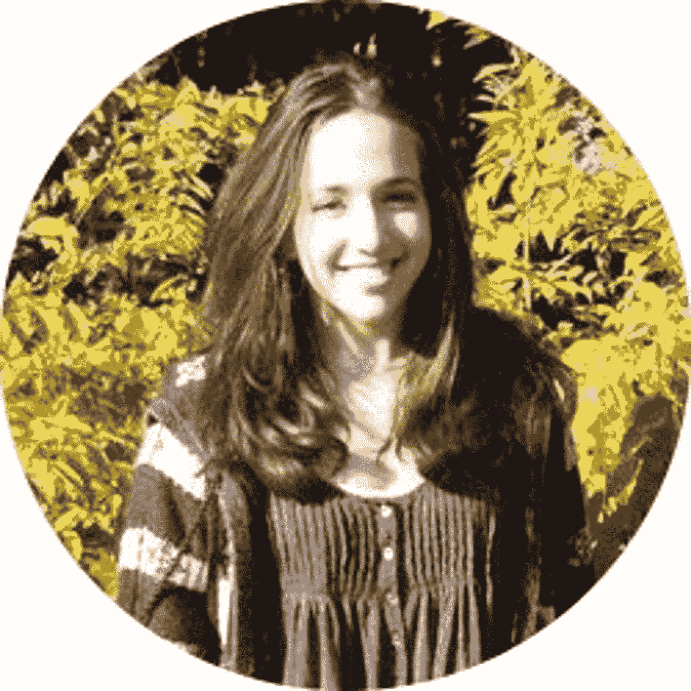****

******[马利·斯佩克特](https://www.linkedin.com/in/marleyspector/ "null")** **，****[Dropbox](http://www.dropbox.com "null")****，**在受聘三年后，她刚刚开始了在评估团队的新角色，在那里她为求职者和招聘经理制作产品。此前，她曾在摩根大通的轮岗分析师项目中任职。她在斯沃斯莫尔学院学习工程和经济学，在那里她是垒球队的投手和外场手。不工作的时候，她打拳击、打网球，喜欢在纽约和旧金山寻找很棒的寿司店。****

****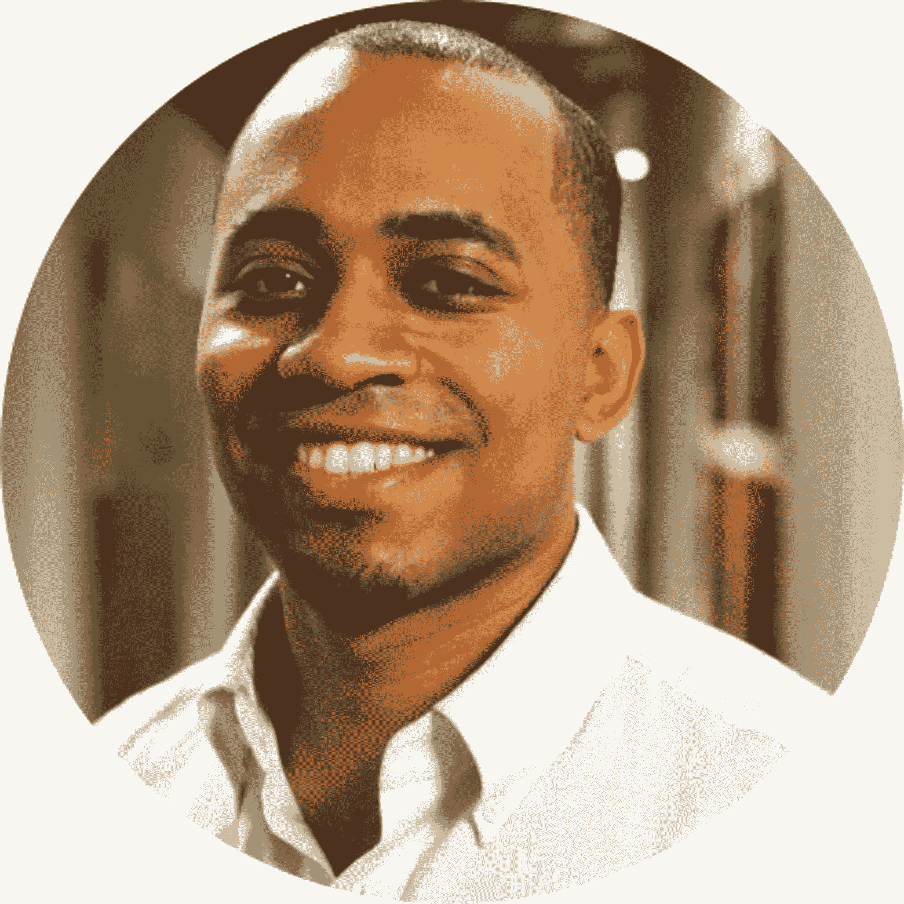****

********[产品经理 Rafael Balbi live auctioners](https://www.liveauctioneers.com/ "null")****，**帮助成千上万的卖家将他们的业务全球化，在世界各地销售独一无二的商品。目前，他专注于销售工具和优化用户渠道。在过去的两年里，他参与了广告单元、支付处理器、欺诈以及引入直播竞价的新尝试。此前，他是 Maker's Row 的第一个产品雇员，Maker ' s Row 是设计师在国内生产商品的市场。他拥有锡拉丘兹大学的经济学学士学位。他在工作之余做瑜伽、拳击和萨尔萨舞。他的长期目标是引领包容性产品的发展，让世界更加紧密。******

****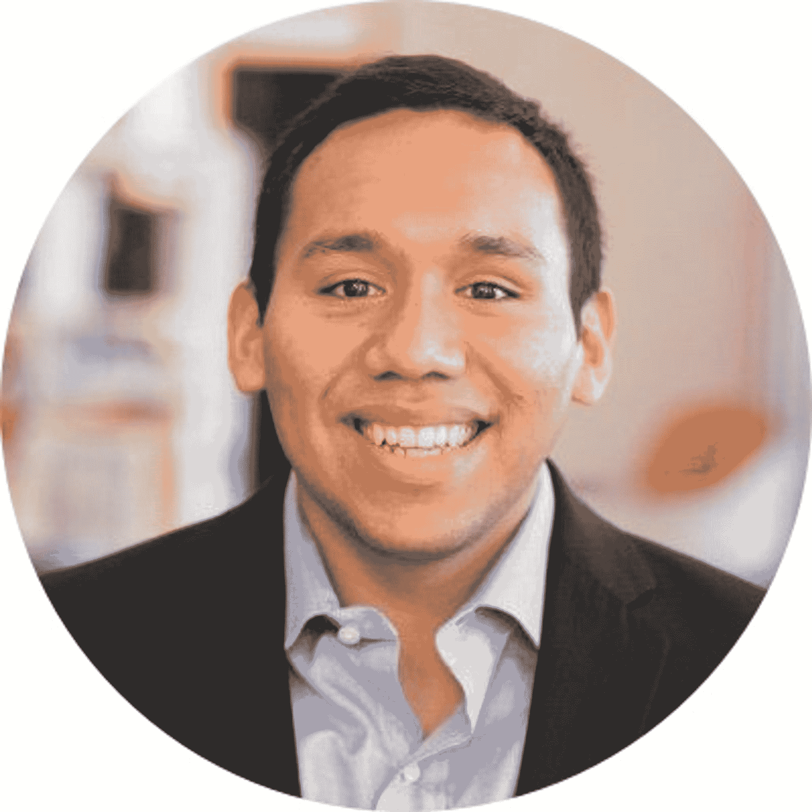****

******[Sean Echevarria](https://www.linkedin.com/in/specheva/ "null")******[沃尔玛](http://www.walmart.com "null")** **，**的产品和研究高级经理在人民体验团队工作。他专注于开发人才产品，以应对整个人才之旅——从学习和申请沃尔玛，到所有品牌和细分市场的入职和员工参与。Sean 以前是 Jet.com 大学人才体验团队的成员，他毕业于北卡罗来纳州立大学，获得了机械工程学士学位，并通过工程创业项目爱上了 tech。在办公室之外，你可以发现他通过[UX 实验室](https://www.meetup.com/The-UX-Lab-NYC/?_cookie-check=XWWVlacN6br60Oex "null")和产品实验室主持活动，前者是他共同创立的 meetup，目前在美国有 6000 名会员，后者是产品领导者为未来的产品经理举办的一系列讲座。******

****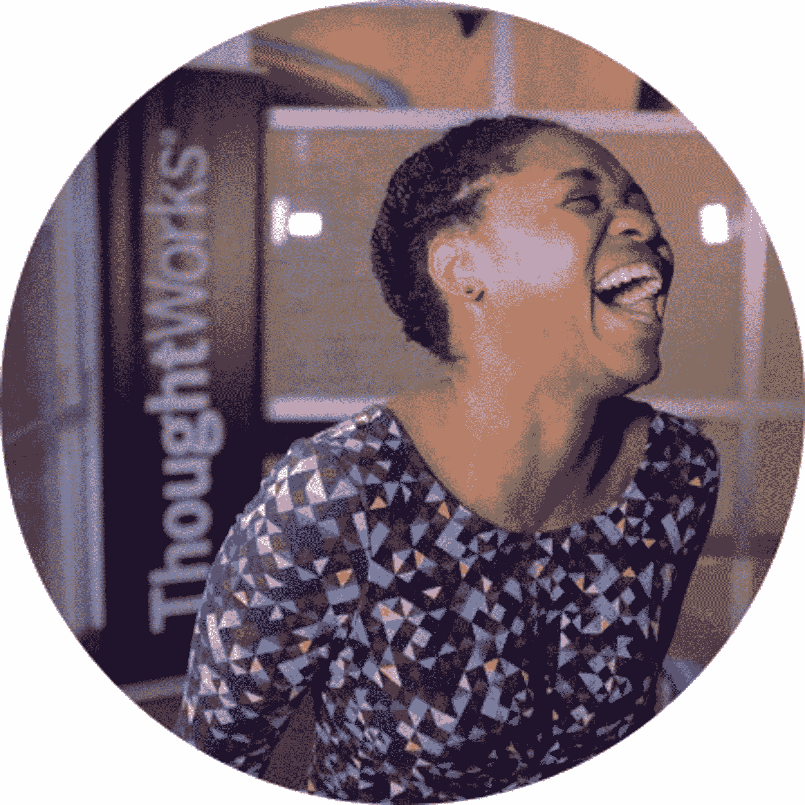****

******[维多利亚肯尼迪](https://www.linkedin.com/in/victoria-kennedy-10/ "null")** **，** **[产品经理](https://hustle.com/ "null")** **，**担任平台团队负责人。在此之前，她在著名的数字设计机构 Huge 工作，专注于消费类数字产品。在那里，她开发了 Today Show 的新应用程序，一个面向编程女孩的新学习平台，以及一个国际时尚品牌的电子商务网站。此前，她是 ThoughtWorks 的顾问，在一家游戏创业公司和一家电子商务创业公司工作过。从专业角度来说，她对民用技术最感兴趣。工作之余，她是一名舞蹈演员，主要来自西非，热爱烹饪，期待着有一天她能学会园艺。****

********

******[威利·马多克斯](https://www.linkedin.com/in/williemaddox/ "null")** **，** **[谷歌](http://www.google.com "null")** **，**致力于[谷歌课堂](https://classroom.google.com/ "null")改善学生和教师的学习体验。在此之前，他在 YouTube 和微软工作，为 Windows 和 Bing 改进基于实体的搜索。他认为产品是最适合他的，因为他不想在设计和工程之间做出选择。不工作时，他通常会在鸡尾酒会上分享他对日常生活中更好的设计/工程解决方案的看法。他还喜欢看 PBS 电视台的历史纪录片，通常会在骑自行车和绕着城市跑步时尽可能多地听音乐。****

****我们非常高兴能与这 17 位杰出的产品设计师共事。但第一轮最酷的部分是看到他们建立自己的联系，在课堂上建立彼此的想法，然后在喝饮料时聊上几个小时。我们相信社区是我们行业成功的重要组成部分，因此我们一直在寻找机会建立联系，在人们的整个职业生涯中支持和教育他们。****

*****非常感谢 Maddy Moelis、Alex Powell、Isaiah Greene、Jacob Effron、Marley Spector、Jisha Jacob、Brittney Gwynn 和 Diana Hsieh 为本文编写注释。* *[你可以在这里](https://medium.com/the-product-program "null")* *阅读上面分享的建议的更多细节。*****