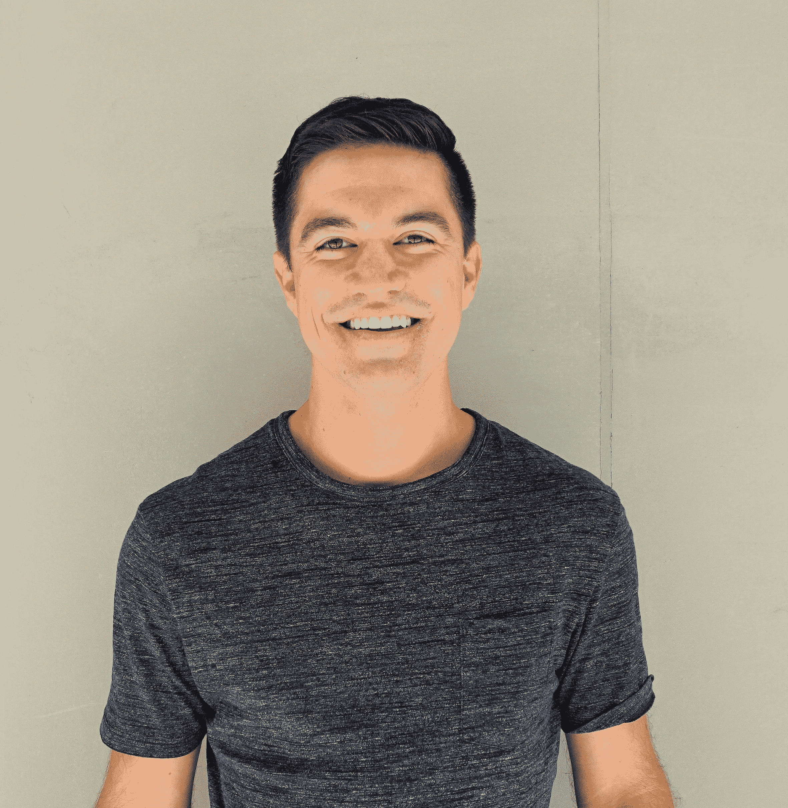

# 每个创始人都必须清除的 8 个产品障碍——这位 PM 出身的创始人分享了他的剧本|首轮评论

> 原文：<https://review.firstround.com/8-product-hurdles-every-founder-must-clear-this-pm-turned-founder-shares-his-playbooks>

## 介绍

缩小市场范围，找到合适的客户。构建产品的第一个版本。教自己如何把它推向市场。努力不要迷失在产品/市场契合的旅程中。即使你关注新的市场和产品创意，也要坚持一致的愿景。

这些只是为这位项目经理转型为创始人铺平道路的几个挑战。 **[莱恩格拉斯](https://www.linkedin.com/in/ryanglasgow/ "null")** 心知肚明。他在五家不同的初创公司担任创始产品经理，开始了他的职业生涯，包括 Vurb(后来被 Snapchat 收购)和 Weebly(后来被 Square 收购)。正是在这些角色中，他发现了一个缺口。发布周期很快，但获得高质量的研究是一项艰巨的任务——从寻找参与者的困难和在采访中被人跟踪的痛苦，到在大公司的超负荷内部研究团队中等待，并希望自己在较小的创业公司中也有一个。

因此，在 2018 年，他放弃了一系列早期项目经理的生活，开始打造他一直想要的工具。作为 **[Sprig](https://sprig.com/ "null")** (前身为 UserLeap)的创始人兼首席执行官，Glasgow 和他的团队创建了一个一体化的产品研究平台，帮助项目经理、用户研究人员和成长型营销人员开展微调查，测试概念，并进行视频采访，以更快地发现客户洞察。

作为 Sprig 的种子支持者(以及他们产品的用户——看看你是否能在我们的时事通讯中看到它的行动[),我们在第一轮已经深入了解了该产品从一个项目经理的纸上想法到 Dropbox、Adobe 和 Loom 等 500 多个客户使用的工具的历程。](https://review.firstround.com/newsletter "null")

在这次独家采访中，格拉斯哥带我们穿越了这条轨迹，解决了产品建设者在创业的每个阶段面临的棘手问题。我们首先将时钟倒回到他创办公司之前的 6 个月——那时他正在验证他的想法并评估拥挤的市场。从细分和最初的客户对话，到迭代早期产品版本和表面反馈，Glasgow 分享了他在 0 到 1 天内最依赖的策略和问题。他还概述了创始人在产品/市场匹配的旅程中往往会犯的一贯错误，深入探讨了他如何处理创始人主导的首轮融资前销售，并提供了超越最初产品的扩张建议。让我们开始吧。

# 第一个障碍:我应该建立什么？我是否选择了正确的创业想法？

对于渴望坐在创始人的椅子上转一圈的项目经理来说，第一步是[想出一个好主意](https://review.firstround.com/12-frameworks-for-finding-startup-ideas-advice-for-future-founders "null")。“我以第一任产品经理的身份加入 Weebly，因为我真的很想体验一下[的超增长阶段](https://review.firstround.com/lessons-from-coinbases-wild-ascent-four-rules-for-scaling "null")，与更大的用户群合作，之前我只在那个 0 比 1 的领域工作过。在三年时间里帮助公司从大约 40 人扩大到 300 人后，我筋疲力尽，需要休息，所以我在 2017 年离开，休假一年去旅行。目标之一是真正探索我不太了解的领域，”格拉斯哥说。

“我开始关注从可下载文件到基于云的文件的转变。当我第一次尝试 Figma 时，我突然意识到，如果可下载的设计文件现在可以完全基于云，那么这是一种值得探索的模式，”他说。“但当我开始在这个领域进行实验时，我在让公司起步时遇到了一点困难，并意识到它不起作用。”

就在这个时候，格拉斯哥看到了一本书，这本书转移了他的视角:[客户想要什么:利用结果驱动的创新来创造突破性的产品和服务](https://www.amazon.com/What-Customers-Want-Outcome-Driven-Breakthrough-ebook/dp/B000RG17R2 "null")。“安东尼·乌尔维克真正打破了通过客户希望解决的结果来思考的过程，”他说。

[cliff notes 版本](https://medium.com/envato/a-step-by-step-guide-to-using-outcome-driven-innovation-odi-for-a-new-product-ded320f49acb "null")是从你试图服务的更广阔的市场开始，收集这些目标客户认为在解决方案中很重要的所有结果——本质上是[要做的工作](https://review.firstround.com/build-products-that-solve-real-problems-with-this-lightweight-jtbd-framework "null")。有了这 20-40 个结果，让一组客户根据重要性和对他们目前使用的解决方案的满意度这两个维度来衡量他们——不满意的重要项目是您未得到充分利用的机会的最佳点。

对格拉斯哥来说，这在两个方面有影响。“第一，我意识到调查可能是多么强大——因为这本书实际上是关于使用基于调查的方法将创新的新产品推向市场，而无需编写一行代码，”他说。“但第二，它帮助我发现并更清楚地思考一个比基于云的协作更大的空间，这有助于其他公司更好地了解他们的客户。”

如果你正苦于想不出创业的点子，那就从考虑一个群体的需求开始，这个群体没有一个独特的解决方案来实现他们想要的结果。

有了一个新的具体想法，格拉斯哥与众多产品经理、研究人员和设计师谈论了产品开发团队在定性研究解决方案中寻求什么——不出所料，几个结果浮出了水面。“也许是 24 小时内送达的真知灼见。这可能就像有人为你做了调查或数据分析，因为你不知道如何做。或者是一种无需通过数据库就能接触到客户的系统化方法，”他说。“**我发现这些对这些团队来说都是非常重要的成果，但是他们对市场上现有的工具非常不满意，所以这是一个被忽视的市场**。”

随着他的航向设定，格拉斯哥向前看。“这是一系列非常雄心勃勃的成果，我知道要实现这些成果需要一些时间来构建和开发产品，”他说。

Ryan Glasgow, founder & CEO of Sprig (formerly UserLeap)

# 第二个障碍:世卫组织是我的理想客户？我如何在拥挤的市场中使我的产品与众不同？

当然，测量和产品研究领域并不是一个新的类别——事实上，这是一个看起来相当拥挤的市场。为了说服投资者，他必须点击比“我们将创造一个现代测量工具”更深的地方。

“我看到了所有的工具，并熟悉传统的调查平台，”他说。“但如果你看看他们自己的故事，你会发现许多这样的公司都是在 20 多年前成立的。这些技术真正的创新之处在于将线下调查带到了线上。在当时，这是一个非常关键的创新。但是从那以后，我们现在有了这种持续部署和开发的兴起，”Glasgow 说。

### **弄清楚为谁造:**

“当我进行市场细分并研究产品经理这一特定受众的需求时，我看到了这个未得到充分服务的市场的巨大机会——这是一个[增长非常快](https://www.productboard.com/blog/golden-age-of-product-management-trends/#:~:text=Digital%20product%20managers%20are%20one,Golden%20Age%20of%20Product%20Management.%E2%80%9D "null")的市场，”他说。这项工作的一部分还包括挖掘他自己作为重复项目经理的经历。“许多企业家会创办一家公司来解决他们自己的挑战或痛苦，这正是其中的一个故事，”他说。

“当我审视自己的经历，并与其他创始人和项目经理交谈时，我看到的是，产品经理确实对产品的成败负有主要责任。大部分研究都提供给了产品经理，让她能够做出决策。但是回想起我在 Weebly 这样的公司担任产品经理的经历，我觉得市场上没有任何解决方案可以满足我的需求。他说:“我没有一个很好的工具集或平台来真正以系统的方式与客户沟通。

### **决定去哪里玩:**

但是一个针对经前综合症的研究工具还不够有针对性。“当我进行细分时，我发现最缺乏服务的产品管理细分市场实际上是大型公司。”这也与他自己的经历有关。“当我回想起我帮助建立的前四家公司时，老实说，围绕定性数据的挑战更小，因为你几乎可以与那个规模的每个客户交谈，”他说。“但当我想起我在 Weebly 的经历时，我发现在大规模收集和理解客户方面存在着难以置信的挑战。在我离开时，我们最终拥有了 5000 万个客户。”

格拉斯哥指出，对于每隔几周运送一次的团队来说，等待这种规模的研究结果并不总是可能的——另一方面，缺乏培训和专业知识意味着他对独自进行大量研究犹豫不决，因为害怕引入偏见或得出错误的结论。

### **弄清楚他们需要什么:**

但是还有一个更具体的挑战。“当我与这些拥有用户研究团队的大规模公司交谈时，我真的明白了:产品经理正在寻找一种解决方案，使定性数据更容易获得。因为在这些大公司——我在 Weebly 经历过这种情况——用户研究数据非常有价值，但通常是以幻灯片的形式提供的，”他说。“如今，产品领域的任何人都强烈希望数据能够在一个平台或产品中交付，让他们能够真正自己探索。 [Looker 是一个很好的例子](https://review.firstround.com/the-inside-story-of-how-this-startup-turned-a-216-word-pitch-email-into-a-2-6-billion-acquisition "null")，它允许决策者探索数据，以便他们能够形成自己的结论并进行自己的分析。”

总之？"**当你想到围绕谁来生产，谁来最终做出这些决定进行细分时，我发现产品经理是决策者，他们往往没有他们正在寻找的定性数据。**因此，围绕 Sprig 的前提和假设是，服务不足的市场不仅存在于产品管理领域，而且在高速增长的大规模公司细分市场中更是如此。他说:“从第一天起，我们就开始构建一个专门满足这些市场需求的解决方案，而我在竞争研究中发现的任何东西都不是为这个特定细分市场构建的。

任何时候，当你进入许多人认为是商品化或成熟的空间时，你真的需要仔细考虑你的产品策略和市场细分，以找到那个被忽视的机会在哪里——这就是你如何打造一个高度差异化的产品，唯一适合特定的客户群。

# 第三个障碍:我如何验证我的想法？我应该如何进行早期客户对话？

有了具体的产品主题和理想的客户档案，下一个障碍是弄清楚到底要构建什么。有无穷无尽的功能组合要配置，潜在的工作要堆叠排名。作为一个从事调查和提问行业的人，格拉斯哥有条不紊、有目的地完成这项任务并不奇怪。在这里，他向我们介绍了他的[早期客户发现对话](https://discoveryassist.firstround.com/ "null")，更重要的是，他是如何在潜在客户面前度过这些宝贵时间的。

### 保持低温。

“我开始用实物模型和展示这种产品的轻量级销售栈来进行假设和设计，”他说。"**我早期学到的一条重要经验是，永远不要让你认识的人参与客户开发过程**。人们经常接触他们自己的受众来发展客户——一个极端的例子可能是[Gary Vee](https://twitter.com/garyvee "null")——但是我认为这经常会误导人。相反，我开始给 Y Combinator 公司的创始人和项目经理发邮件。我和他们没有关系，我想看看他们是否会回复我的邮件，因为如果我真的在解决他们正在经历的痛苦，他们就会花时间。我能够让他们中的几个人做出回应，和我一起开会。”

最开始，我真的很想测试和验证这是否值得，看看我不认识的人是否愿意花时间和我一起帮助共同创造和开发这个产品。

格拉斯哥指出，这对于 B2B 的努力尤为重要。“如果你要卖给这里的人，时间比金钱更有价值，因为这是公司的钱，但这是他们个人的时间。他们经常忙于许多不同的优先事项，”他说。

他分享了一个例子，一些早期的潜在客户愿意在那个时候成为设计伙伴。“例如，Hotwire 有一个项目经理，在 12 周的时间里，他每周大概花近一个小时来共同创作和提供反馈。这是一个我完全不认识的人，”格拉斯哥说。“Intuit 的 QuickBooks 团队中也有一名项目经理，他花时间对我创建的模型和卡片组提供反馈。因此，我开始证实，在高增长和大规模公司的产品管理部门，我不认识的人愿意花时间提供反馈，因为这引起了共鸣。它解决了他们生活中遇到的一个问题，因为现有的解决方案实际上已经失效了。”

### **专注于您的成果和您的细分市场。**

更具战术性的是，这些早期的会议看起来是这样的:“我有一套屏幕截图，以及我希望建立的不同结果和功能的列表。每周我们都会见面，我会展示产品方向的进展。在 Hotwire 的例子中，我们和他的团队一起做了一些演示，但是我们还处于旅程的早期，我们还没有一个安全的姿态，所以最终没有人变成客户。相反，他一直在提供反馈，说，“嘿，这真的没有引起我的共鸣，”或者“我喜欢你设计的这个功能，或者你告诉我的这个功能。”"

格拉斯哥将其带回发掘原始想法的结果驱动创新框架。“它告诉你对观众来说重要的结果，以及市场服务不足的地方。他说:“但作为一名产品经理或创始人，你必须考虑如何真正实现对观众来说重要的高满意度结果。“因此，通过与潜在 Sprig 客户合作、测试、分享以及每周向他们展示不同功能和特性的模型，我一直在迭代如何实际解决这些结果。”

你不能依靠你的客户来弄清楚要造什么。他们真的只能告诉你他们想要达到什么样的结果

他也一直专注于他的分割工作。“考虑到服务不足的市场是高增长或规模化公司。我发现只和那个市场的公司合作是非常重要的。因此，当我进行早期对话时，我实际上只与一小部分客户进行了对话，”格拉斯哥说。“例如，通过 Weebly connection，我能够开始与 Square 和其他早期客户合作，如 [Plann](https://sprig.com/customer-plann.html "null") 和 thunk able——他们的用户群每月至少有 50 万人使用他们的产品。”

# **障碍 4:我应该如何界定我的 MVP？**

随着对客户需求的深入了解，是时候进行构建了。第一步是勾勒出 MVP 中的[必备元素。](https://review.firstround.com/dont-serve-burnt-pizza-and-other-lessons-in-building-minimum-lovable-products "null")

“考虑到为高增长或大规模公司构建一个强大的平台很困难，也需要时间，我必须做的只是开发我自己无法手工完成的部分。所以 Sprig 的第一个愿景只是 SDK。这是一段代码，这些公司可以添加到他们的产品中，”格拉斯哥说。“有一个地方可以登录查看原始数据响应，但其他一切都完全由我和早期团队手动完成。因此，如果你想发起一项调查，改变一个调查问题，停止一项调查，选择该调查出现在你的产品中的什么地方——这些都是我们自己做的。我们会进入产品并更改代码，然后通过安装在客户产品中的 SDK，我们会更新所有配置，然后它会更新 SDK 以及他们产品中实际显示的内容。”

数据分析也是格拉斯哥要实现的一项重要成果。“在每周和每月的基础上，我为他们构建平台并分析数据。他说，这些早期客户让我成为他们的产品经理和研究员，并说，‘嘿，我看了 2000 份调查反馈，我已经为你分析了一切。’。

“通过所有这些手动干预和咨询方法，我能够看到什么在点击，哪里有积极的反馈，因此我们可以将我们的开发工作集中在这些领域。格拉斯哥说:“我们开始雇佣一个博士数据科学团队，引进已经大规模构建基础设施的工程师，开展定制调查，并引入动态目标。”“所有这些功能都花了至少一年时间来构建，因为它们在规模上极其复杂。”

当然，这种[不按比例做事的方法](https://review.firstround.com/How-design-thinking-transformed-Airbnb-from-failing-startup-to-billion-dollar-business "null")是高度接触的，可能会带来一些陷阱。“有些人一开始会想，‘你是军种吗？你是产品吗？但是作为一名产品经理，我知道我们可以手工制作所有的东西。这只是需要资源，”格拉斯哥说。(我们会注意到，Looker 在早期也追求类似的咨询模式。)

更重要的是，这种方法在 Sprig 的早期筹款对话中被证明是双重有用的。“在与投资者的交谈中，我们可以说，我们正在以独特的方式为这些客户提供关键的见解，我们开始真正看到这个产品的工作，但对于这样规模的公司，我们只创造了 5%或 10%的 MVP，”他说。

# 障碍 5:我如何整合反馈并快速迭代我的早期产品？

正如 Glasgow [早在 2013 年的一篇博客文章](https://medium.com/@ryanglasgow/the-startup-method-a-6-step-process-for-new-feature-development-945aae7049e "null")中所写的，关于他帮助创办的初创公司，“最困难的任务一直是拿出一个 alpha 产品，不断迭代，直到它开始获得牵引力。”事实证明，这在 2021 年仍然适用。

释放这种吸引力的关键需要——你猜对了——与客户交谈，了解他们对你迄今为止所做工作的看法。在这里，Glasgow 分享了一些建议，帮助你从与顾客的产品反馈对话中获得更多的。

### **将客户拓展电话视为与你的直接下属一对一的沟通。**

“早期的主要目标是帮助我们了解这里什么可行，什么不可行。**他说:“我把客户开发视为与直接下属的一对一对话，你只想问一些棘手的问题** **”。(或者如[点评最爱朱莉周所说的](https://review.firstround.com/managers-take-your-1-1s-to-the-next-level-with-these-6-must-reads "null")，努力让自己所有的 1:1 都觉得有点尴尬)。**

他分享了一些他常用问题的例子:

我们的产品现在有哪些优势和劣势？

有一天，我与我们最大的客户之一的产品负责人会面，在电话中我问他，“从 0 到 10，你对 Sprig 公司的满意度如何？帮助我理解我们能做些什么让你得到 10 分？”

如果我们删除了哪个功能，您不会失望？

但对格拉斯哥来说，这更多的是关于“困难”的部分，而不是固定在特定的问题上。“我觉得不一定是问超级创新的问题。他说:“其实就是深入挖掘，问一些*棘手的*问题，以确保客户真的关心你，并让你了解到你到目前为止所做工作的积极面，更重要的是，还有消极面。”。

### **通过问尖锐的问题来迅速否定想法。**

这似乎是显而易见的，但根据他的经验，许多人会回避这一点。“在我工作的第一家初创公司，我找到创始人，说我想问一个产品/市场适合度的问题。他们诚实地说他们不想知道。我对自己说，我一直在这家公司工作，我们不想问那些棘手的问题。要问那些难回答的问题，你必须向前倾。否则，你为什么在那里？你在为谁建造？如果你不愿意问这些棘手的问题，很有可能你是在浪费时间，因为如果你不愿意问的话，你很可能走错了方向。”

如果你的团队不能提出棘手的问题，那你为什么还在那里？如果你甚至不知道它是否值得你花时间，你为什么要花所有的时间在这个产品上？

客户对话中的难题也纠正了另一个普遍趋势。每个人都过于依赖自己的直觉。格拉斯哥说:“我曾与一些创始人共事，他们对打造一个产品或功能并将其推向市场有着强烈的直觉，但没有真正的用户研究过程，也没有很早就提出困难、令人不安的问题。

“我记得在一家公司，创始人对向市场推出新功能有着非常强的直觉。一个四人团队花了一年半的时间开发这个功能。而我们实际上甚至没有推出。我们推出了该功能的登录页面，我们从主页链接到该页面。没有人点击并选择使用这个功能。经过一年半的工作，我们现在离发布还有几周的时间，我们刚刚关闭了它。这很遗憾，因为有太多的方法可以让一个想法无效，比如向你希望为其提供这些功能的实际客户提出这些棘手的问题。”

对于你正在从事的任何业务、产品或新功能来说，一个很好的结果就是，你从一开始，或者尽快地，就认定它不值得你花费资源和时间。

# **障碍#6:我还没有触及产品市场/适合度——我做错了什么？**

随着产品的早期版本出现在世界上，下一个阶段是证明人们想要购买它——这是一种难以捉摸的早期牵引力，表明你真的找到了一些东西。根据格拉斯哥的经验，这是事情变得令人痛苦的地方。

“目前真正流行的一个框架是[衡量产品/市场适合度](https://review.firstround.com/how-superhuman-built-an-engine-to-find-product-market-fit "null")。他说:“我见过创始人花费数年时间构建、迭代和衡量产品/市场契合度，试图理解如何实现这一目标，但他们陷入了困境。”。“如果你退一步看看起源，是肖恩·埃利斯开创了这项调查。他是一名营销人员，希望加入那些已经拥有顾客喜爱的产品的创业公司。所以他问了这样一个问题:“如果你不能再使用这个产品，你会有多失望？”*验证*公司的产品/市场是否合适。格拉斯哥说:“我今天给创业者的建议是，使用不同的框架来发现适合市场的产品。

创始人应该认识到验证产品/市场契合度和*发现*产品/市场契合度之间的区别。

“因为作为一名创始人，如果你只是验证你的产品/市场是否合适，你可能需要 5 年、10 年、20 年的时间来测试一个假设，并衡量你的解决方案。”

正如 Glasgow 之前写的，在他看来，衡量你正在解决的问题的严重性和你的客户对解决问题的兴趣程度是很重要的——如果你愿意的话，客户/问题契合度。简而言之，它是关于不断重复你的客户档案和你正在解决的问题(正如 Glasgow 在上面的章节中所讨论的)。

“使用结果驱动的创新框架是创始人发现产品/市场契合度的一个很好的方式，尤其是在早期，”他说。“在 Sprig 的案例中，我认为，如果我能开发出一款产品，能够实现对产品经理、设计师和研究人员这些受众非常重要的一系列成果，那么在我真正开发产品之前，这就是产品/市场契合度的真正定义。”

如果你能深入了解你的客户在寻找什么，你就能发现产品/市场的契合度，而不必实际打造一个产品。

现在，随着产品的上线和运行，Glasgow 和他的团队问了一些经典的问题，以验证他们是否达到了产品/市场适合度的基准，即 40%的用户表示如果没有该产品他们会“非常失望”。“现在，我们正在 Sprig 进行[产品/市场适合度调查，以验证我们是否拥有它，好消息是我们拥有它，”他说。](https://sprig.com/templates/find-product-market-fit.html "null")

# 障碍 7:我有几个客户，但我真的需要搞清楚创始人主导的销售。我应该从哪里开始？

好吧，从严格意义上来说，这不是一个产品挑战，但对于专注于产品和技术的创始人来说，第一次计算销售额往往是一个致命的弱点。从最初的少数早期客户到可重复的微调动作，已经成为许多创业公司的丧钟。

“在 Sprig 之前，我从未在有销售人员的公司工作过。但当我发现这个高增长、大规模的市场时，我知道这需要一种销售方法，”格拉斯哥说。“我们直到 2020 年 12 月才[公开发布——在我们大约 8 个月前组建销售团队之前，我仍在会见每一位付钱给我们的客户。这种方法让我们建立了一个强大的基础，并真正发展了销售流程和我自己的销售技能，直到我们的首轮融资。”](https://www.producthunt.com/posts/userleap#comment-1208891 "null")

刚从创始人领导的销售战壕中走出来，Glasgow 分享了 Sprig 从零到超过 500 名客户的最大区别。

### **潜艇降低压力。**

“每当我不知道该如何做某件事而陷入困境时，我会立即一头扎进书本。我读了大概六七本关于 B2B 销售的书，以及网上许多关于其他创始人如何实现转变的[文章。不过真正帮助我理解如何销售的书是“](https://review.firstround.com/10-ways-you-need-to-change-how-you-think-and-talk-to-succeed-at-sales "null")[你不可能在研讨会上教一个孩子骑自行车，”Glasgow 说。](https://www.amazon.com/Cant-Teach-Ride-Bike-Seminar/dp/0967179904 "null")

“这是一本旧书，所以感觉有点过时。但对我来说，它真的有很多突破性的概念。他说:“我发现其中一个非常吸引人的原则是**确保和你一起工作的人没有压力。**

在你的每一次谈话中，你都不想让潜在客户觉得他们必须当场做出这个重大决定。

但是，创始人如何在这些客户对话中缓解压力——尤其是在早期，感觉每笔潜在交易都属于“成就你或毁灭你”的范畴？“我学到的一个诀窍是，在你与潜在买家或可能使用你产品的人的每次会议开始时，**总是让他们知道他们需要在会议结束时做出的决定**。这被称为[潜航](https://www.sandler.com/blog/introducing-new-sandler-submarine/ "null")——你正在把这个长期的、真正重大的决定，即是否对你的产品做出年度或多年承诺，分解成小决定，”Glasgow 说。

“因此，也许在与回复你邮件的潜在客户的第一次通话中，首先分享一下你是谁，然后说，‘在这次会议结束时，我想知道 X，我会问你是否愿意与我一起进行后续演示，’”他说。“这样，每个人都明白当时在一起的目标。他们不是在买东西。他们只需要做出是或否的决定。如果他们不想继续前进，拒绝完全没问题，实际上还会受到鼓励。”

使每一次销售会议都包含一个决策。你需要向潜在客户提供哪些问题和信息来帮助她做出决定？

### 完善你的战术手册。

带着这种想法，Glasgow 继续解释他那端销售过程的关键活动。

“如果您开始看到一些客户的吸引力，并且您希望加速并吸引更多的客户，那么第一步就是想办法每周获得一系列可重复的机会。对我们来说，大部分时间都被与我们部门的产品经理和用户研究人员的会议填满了，”格拉斯哥说。

“您可能想雇佣一名 SDR 来帮助开发这些销售线索。也许你想依靠你的投资者网络来帮助提供这些机会——在 Sprig 的时候，我们经常依赖第一轮团队和其他投资者的客户介绍。他说:“也许你有自己的关系网，不过，鉴于已建立的关系可能会把你引向错误的方向，这通常是不推荐的。”。

下一步是验证这些线索是否符合他的目标客户档案。“很快就能确定这些对话的资格或资格，看看 Sprig 是否能解决他们今天面临的产品或业务挑战。你想看到你卖给谁的一致性。那个 ICP 是谁？”他说。“对于我们可以帮助的产品经理或研究人员来说，他们正面临着一些挑战，如入职率下降、不断增加的订阅流失率，或者找到推动产品采用的方法，”Glasgow 说。

“然后我们通常会进入试验阶段。我甚至没有谈论定价或试图向他们出售任何东西。他说:“这实际上是让他们进行设置，并让他们将我们的 SDK 安装到他们的产品中，通常是在签署合同之前。”。“作为一名产品经理和在此之前没有销售经验的人，我真的想，‘让产品为我做销售吧。’"

Glasgow 通过一个真实的早期[客户案例](https://sprig.com/customer-codecademy.html "null")向我们展示了创始人主导的销售流程。“我在 Code Academy 获得了成长型产品经理的介绍。我和他一起做了一个演示，向他展示了产品，并谈论了他希望发现的一些领域。从那里开始，我让他在我们这里开了一个账户，”他说。“所以在第二次会议中，我为他创建了一个账户，并开始从我们的模板库中挑选我认为可以解决他当时面临的挑战的模板[，再次以咨询的方式解决问题。到第三次见面时，我让他知道了在他们的网站上安装 Sprig 的确切步骤，他们上线了，很快就能看到数据和分析。”](https://sprig.com/templates.html "null")

当然，在销售线索生成和墨迹交易之间有几个步骤。“一旦您开始找到可重复的方式来开展这些对话和最初的发现电话，就要开始制定行动手册了。**对于每一次会议，我建议开始一个谷歌文档，写下你认为销售过程现在是什么样子的提纲**。格拉斯哥说:“每次会议后，写下有效的内容，反复删除无效的部分。

“我从一种销售产品的方式开始，但在 2020 年的几乎所有时间里，我都在不断调整它，直到我们达到今天的水平。现在，剧本是如此的可重复，以至于我们正在壮大我们的销售团队，任何真正在 Sprig 的人都可以看看我去年做了什么，并复制它。”

格拉斯哥的文件是这样写的:“我们所拥有的是签订合同所需的所有会议。在每次会议中，它概述了要问的问题、要涵盖的主要主题，以及每次会议结束时需要与潜在客户一起做出的决定，以继续下一次会议。这样你就知道自己在这个过程中想要达到的位置。”

一旦你有了可重复的 ICP 和可重复的剧本，你就知道你已经准备好将你的业务扩展到下一个阶段。

# **障碍 8:我们应该如何思考下一步要做什么？**

有了产品/市场契合度和顺畅的 GTM 行动，很自然地开始展望未来——最新的特性、功能，甚至是全新的产品线，您可以引入它们来将您的公司带到众所周知的下一个水平。但是[在扩大现有产品的同时进行创新](https://review.firstround.com/how-to-craft-your-product-team-at-every-stage-from-pre-product-market-fit-to-hypergrowth "null")是一种高度平衡的行为。为了进一步混合我们的隐喻，你下的新赌注并不总是有回报的，选择一个相邻的沙盒来玩有点像重新开始创业构思过程。

在这里，格拉斯哥分享了他的建议(这是特别新鲜的，因为就在本周 Sprig [推出了新概念测试和视频面试](https://www.producthunt.com/posts/sprig-5?utm_source=badge-featured&utm_medium=badge&utm_souce=badge-sprig-5 "null")功能)。

### **依靠这个框架来寻找辅助性的——而不是无关紧要的——工作。**

“将新功能推向市场时，仍然需要与客户交谈，了解他们想要实现什么，”Glasgow 说。“一旦你有了解决问题的核心产品，最好的方法就是看看其他供应商和其他人也在使用的产品。也许你做的*和其他供应商做的*不完全一样，但你必须考虑你的公司如何能以独特和真实的方式，构建实际解决相同工作或结果的东西。”

格拉斯哥提供了一个具体的例子:“ [Figjam](https://www.figma.com/figjam/ "null") 是 Figma 的一个很好的例子——他们采用了虚拟白板的概念，并围绕它建立了一个功能。我敢肯定，他们看到他们的许多客户使用 Figma 进行高保真设计和原型制作，但在设计的构思阶段，他们使用其他供应商。有很多虚拟白板解决方案，但他们可能看到 Figma 与其他虚拟白板解决方案(如 [Miro](https://miro.com/ "null") 或[wall](https://www.mural.co/ "null"))的关联率如此之高，以至于他们可以考虑如何在设计阶段独特地解决这一构思和发现过程的结果，以便设计师不必切换工具。”

如果你正在寻找自己有前途的领域，格拉斯哥提供了这样的建议:“在客户工作流程中，通常有大约八个不同的步骤来开始和完成一项行动。你真的可以将这个框架应用到你正在开发的任何产品中，看看你今天正在解决的步骤。**看看你目前正在** ***而不是*** **解决的步骤，想想你如何能解决附属于你的核心产品**的其他工作

当你找到适合你第一个产品的产品/市场时，你就必须进入下一个增长阶段。你能为你的顾客解决的下一个工作是什么？不幸的是，我已经看到许多人犯了这样的错误，他们构建了一些与他们今天正在做的事情无关的东西。

格拉斯哥分享了他对避免这个陷阱的想法。他说:“我认为，要从单一产品扩展到多种产品，确实需要一些基本规则。

### 规则 1:看看你目前所在的类别。

“如果你不确定，看看像 [G2 Crowd 这样的公司是如何映射和定义不同类别的](https://www.g2.com/categories "null")。格拉斯哥说:“我们属于研究类别，我们的客户使用 Sprig 和其他供应商解决许多不同的工作，以解决他们可能需要建立更好的产品体验的各种定性洞察工作。

“许多公司可能在一个类别上有所建树，但随后会考虑扩展到其他类别。这通常是我认为失败的地方。他说:“如今的消费者希望真正购买能够满足一种需求的供应商。“这方面的一个例子也许是对讲机。他们从这个非常棒的聊天产品开始，但最近，他们专注于围绕指南、工具提示和演练的互动。这更多的是解决产品经理的需求，而他们的核心产品属于客户成功类别。我相信，如果他们把重点放在客户成功这一类别上，增加其他工作岗位，向高端市场进军，或许会是一条更好的道路。”

试图跨越多个类别，建立一个服务于多个买家的平台，最终却稀释了产品。当你向高端市场发展时，你需要为一个买家服务，但要继续建立一个平台，以迎合该买家更复杂的需求。

### **规则 2:重新审视你的部分，向另一个方向游去。**

“第二条规则是真正关注细分市场。所以在 Sprig，我们最早的客户大多都是高增长或大规模的公司。现在，我们真正专注于构建所有细分市场，包括小型、中型和大型市场。因此，我们实际上在许多方面都在向低端市场发展，”格拉斯哥说。

“因此，我现在关注的是我们客户在所有细分市场的不同工作和结果，”他说。“如果您处于相反的位置，作为一家以中小企业起家的公司，正在寻求向高端市场发展，那么您需要了解您的客户目前使用的功能，然后接触那些您希望在当前类别中服务的更大的买家，以了解他们的需求。这时，你会看到像 Datadog 这样的公司出现爆炸性增长，他们能够随着客户的增长而增长，现在企业是他们最大的客户群之一。”

### **规则 3:全力以赴制定战略**

格拉斯哥从这个第二产品线的吐槽中退一步，提出了一个更广泛的观点。

“对于今天的每一个创始人来说，继续发展和扩大业务并在任何市场中获胜的能力都是关键。我在这里推荐一本名为《好策略，坏策略》的书，这本书讲述了西南航空和宜家这样的例子，以及他们在 20 年甚至 30 年前是如何建立这种防御策略的。这是因为他们有一个非常周到的战略，”他说。

“如果你看看现在发生的所有资金，TechCrunch 上每天推出的所有新产品，以及低代码开发的出现，每年将新产品推向市场都变得越来越容易。一旦你看到这种牵引力，事情就会开始起飞。**这就是为什么产品战略和公司战略是目前最被低估的技能之一**。

现在把一个产品推向市场太容易了。如果你没有在竞争环境中起步，你很快就会发现自己已经身处其中。

*这篇文章是对* *[瑞安·格拉斯哥在我们的新播客《深度》中的亮相](https://review.firstround.com/podcast/episode-31 "null")* *的简要编辑如果你还没有听过我们的节目，* *[一定要来这里看看](https://review.firstround.com/podcast "null")* *。*

*封面图片由盖蒂图片社/新美乐股份公司·巴尔科尼/ EyeEm 提供。*