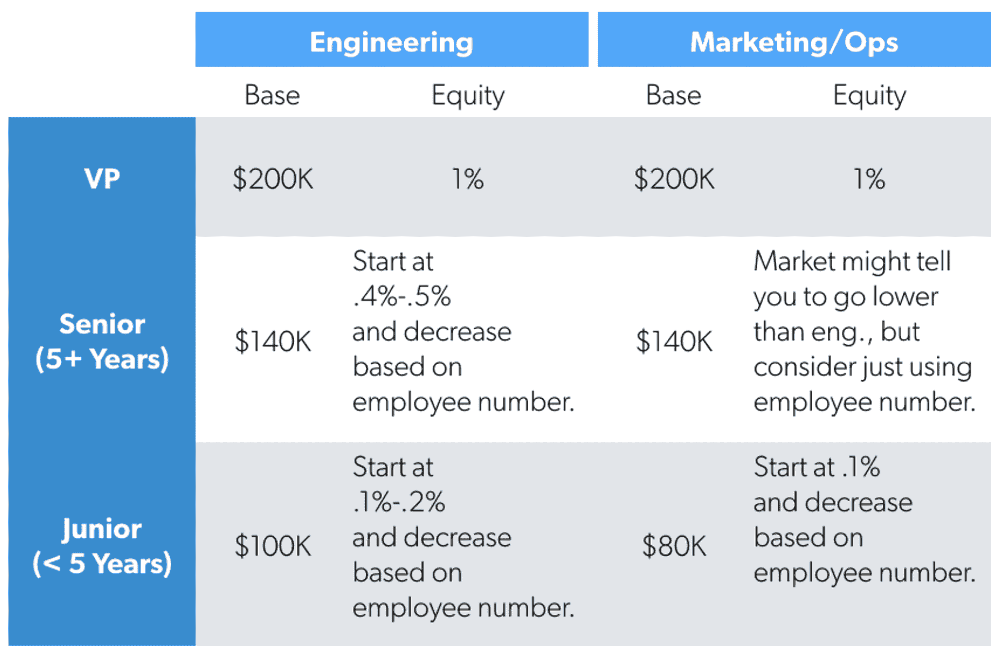
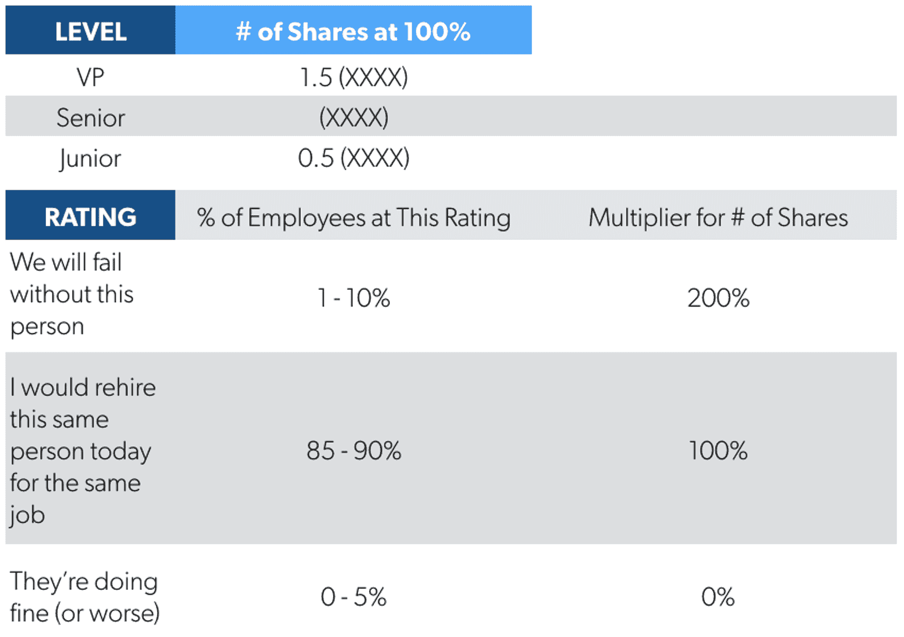

# 创业补偿的反直觉系统|第一轮回顾

> 原文：<https://review.firstround.com/A-Counterintuitive-System-for-Startup-Compensation>

当[莫莉·格拉汉姆](When%20Molly%20Graham%20joined%20Facebook,%20the%20company%20already%20had%20400%20employees,%20but%20there%20was%20no%20official%20performance%20or%20compensation%20system%20in%20place.%20There%20had%20been%20attempts,%20but%20nothing%20stuck.%20The%20result:%20Very%20little%20transparency,%20a%20lot%20of%20one-off%20compensation%20decisions,%20frustration%20and%20confusion.%20Working%20closely%20with%20Sheryl%20Sandberg%20and%20HR%20chief%20Lori%20Goler,%20Graham%20set%20out%20to%20change%20this%20by%20going%20back%20to%20the%20basics.%20%E2%80%9CIt%20gave%20us%20a%20chance%20to%20start%20from%20the%20beginning%20and%20say%20to%20everyone,%20%E2%80%98Okay,%20here%20is%20how%20salary%20works.%20Here%20is%20how%20equity%20works.%20Here%E2%80%99s%20how%20bonuses%20are%20calculated.%20We%E2%80%99re%20using%20formulas%20for%20all%20salary%20increases%20from%20now%20on.%20Here%20are%20the%20multipliers%20based%20on%20performance,%E2%80%99%E2%80%9D%20she%20says.%20%E2%80%9CPeople%20frequently%20find%20compensation%20and%20performance%20management%20overwhelming%20or%20bureaucratic,%20but%20we%20got%20such%20a%20positive%20response%20when%20we%20implemented%20this%20first%20system%20and%20explained%20it%20to%20the%20company.%20People%20were%20grateful.%20A%20system%20that%20was%20relatively%20simple,%20clearly%20communicated,%20and%20fair%20made%20a%20huge%20difference.%E2%80%9D%20Graham%20emerged%20on%20the%20other%20side%20realizing%20how%20valuable%20a%20solid,%20standardized%20compensation%20system%20can%20be.%20Today,%20as%20Head%20of%20Business%20Operations%20at%20Quip,%20she%20believes%20that%20there%20is%20a%20simple,%20scalable,%20transparent%20compensation%20system%20that%20will%20work%20for%20almost%20all%20startups.%20Here,%20she%20shares%20some%20of%20her%20golden%20rules%20for%20compensation%20and%20the%20system%20that%20she%20thinks%20strikes%20the%20fine%20balance%20between%20a%20startup%E2%80%99s%20needs%20and%20keeping%20employees%20happy.%20%20Since%20joining%20the%20start%20up%20world,%20Graham%20has%20talked%20with%20a%20lot%20of%20start%20up%20founders%20who%20struggle%20with%20compensation%20questions%20like:%20What%20do%20you%20offer%20to%20a%20new%20hire,%20particularly%20a%20senior%20leadership%20role?%20What%20if%20they%20ask%20for%20more?%20What%20do%20you%20do%20about%20one-off%20salary%20or%20equity%20increase%20requests?%20%20What%20do%20you%20do%20about%20high%20performing%20recent%20graduates?%20How%20and%20when%20should%20you%20offer%20increases%20or%20promotions?%20Should%20you%20counter%20offer%20if%20one%20of%20your%20employees%20gets%20a%20higher%20offer?%20%E2%80%9CI%20was%20lucky%20to%20learn%20from%20the%20leadership%20at%20Facebook%20and%20people%20like%20Sheryl,%20and%20now%20I%20see%20a%20lot%20of%20founders%20and%20start%20up%20CEOs%20spending%20(or%20frankly,%20wasting)%20a%20lot%20of%20time%20handling%20one-off%20compensation%20requests%20or%20new%20hire%20offers,%20and%20I%20desperately%20want%20to%20save%20them%20the%20time,%22%20she%20says.%20%22In%20my%20opinion,%20compensation%20isn%E2%80%99t%20something%20you%20should%20spend%20a%20lot%20of%20time%20on%20in%20the%20first%20couple%20years%20of%20a%20company.%20As%20a%20CEO,%20you%20should%20be%20focused%20on%20making%20your%20company%20successful,%20which%20in%20turn,%20makes%20the%20equity%20more%20valuable.%20That%20is%20what%20you%20and%20your%20employees%20should%20spend%20all%20your%20time%20on.%E2%80%9D%20Some%20Golden%20Rules%20for%20Compensation%201)%20No%20one%20is%20ever%20happy%20with%20compensation,%20and%20compensation%20has%20never%20made%20anyone%20happy.%20%E2%80%9CThis%20is%20honestly%20the%20number%20one%20trap%20that%20people%20fall%20into%20with%20compensation,%E2%80%9D%20Graham%20says.%20%E2%80%9CCompensation%20is%20never%20going%20to%20be%20the%20thing%20that%20makes%20people%20join%20or%20stay%20at%20a%20startup%20long-term%20(or%20any%20company),%20nor%20should%20it%20be.%20Compensation%20is%20not%20a%20healthy%20version%20of%20retention.%20I%20know%20it%E2%80%99s%20terrifying%20when%20someone%20has%20a%20huge%20counter%20offer,%20or%20you%E2%80%99re%20trying%20to%20recruit%20that%20senior%20leader%20from%20a%20big%20company,%20but%20you%20should%20accept%20upfront%20that%20it's%20better%20if%20they%20join%20for%20the%20people,%20buy%20into%20the%20vision,%20etc.,%20and%20have%20to%20make%20a%20hard%20decision%20on%20compensation.%20They%20will%20stay%20longer.%20Your%20goal%20should%20be%20to%20get%20compensation%20off%20the%20table%20%E2%80%94%20make%20sure%20that%20they%20can%20live%20on%20their%20salary%20and%20have%20a%20fair%20slice%20of%20equity%20%E2%80%94%20so%20employees%20don%E2%80%99t%20think%20about%20it%20except%20maybe%20once%20a%20year.%20The%20best%20way%20to%20do%20that%20is%20to%20be%20fair%20and%20transparent.%E2%80%9D%202)%20People%20always%20find%20out%20what%20everyone%20else%20is%20making.%20Never%20build%20a%20compensation%20system%20that%20assumes%20people%20won%E2%80%99t%20know%20what%20their%20peers%20and%20teammates%20are%20making.%20They%20always%20find%20out%20%E2%80%9CAsk%20anyone%20who%20has%20managed%20a%20team%20of%20over%2010%20people%20%E2%80%94%20everyone%20finds%20out%20eventually,%20and%20the%20problem%20is%20that%20feelings%20about%20compensation%20are%20relative%20not%20absolute,%E2%80%9D%20says%20Graham.%20%E2%80%9CYou%20might%20be%20living%20really%20well.%20You%20might%20be%20in%20the%20wealthiest%201%,%20but%20if%20there%E2%80%99s%20someone%20sitting%20next%20to%20you%20who%20makes%20twice%20as%20much,%20you%E2%80%99re%20going%20to%20feel%20insulted.%20It%E2%80%99s%20just%20a%20fact.%20So%20take%20that%20into%20account%20when%20you%E2%80%99re%20creating%20your%20plan.%20You%20need%20to%20be%20able%20to%20explain%20(and%20defend)%20everything%20through%20a%20logical%20set%20of%20guidelines.%E2%80%9D%20If%20you're%20leading%20a%20small,%20early-stage%20company,%20Graham%20recommends%20being%20as%20transparent%20about%20what%20people%20are%20making%20as%20possible.%20This%20will%20put%20out%20fires%20before%20they%20start,%20establish%20an%20honest%20environment,%20and%20serve%20as%20a%20nice%20forcing%20function%20for%20you:%20Subscribe%20to%20get%20fresh%20insights%20in%20your%20inbox.%20Join%20Us%20%E2%80%9CYou%20can't%20be%20transparent%20if%20you're%20not%20paying%20fair,%20and%20if%20you%20are,%20there's%20no%20reason%20to%20not%20be%20transparent.%E2%80%9D%20%20It%20gets%20harder%20to%20be%20transparent%20as%20a%20company%20grows,%20so%20take%20advantage%20of%20the%20moment%20while%20you%E2%80%99re%20small.%20Go%20that%20extra%20mile%20to%20bake%20this%20principle%20into%20your%20culture,%20even%20if%20you%20know%20you%20may%20have%20to%20ease%20away%20from%20it%20as%20you%20grow.%20Your%20most%20valuable%20employees%20will%20remember%20it,%20and%20it%20will%20help%20both%20recruiting%20and%20retention.%203)%20Create%20a%20system%20that%20revisits%20compensation%20only%201-2x%20a%20year.%20Startup%20CEOs%20have%20so%20much%20going%20on%20that%20they%20shouldn%E2%80%99t%20burden%20themselves%20adjusting%20people%E2%80%99s%20pay%20on%20an%20ongoing%20basis.%20This%20is%20the%20logic%20behind%20annual%20compensation%20evaluations.%20The%20single%20most%20important%20thing%20any%20employee%20can%20do%20is%20add%20value%20to%20the%20company,%20which%20will%20add%20value%20to%20the%20equity.%20This%20should%20be%20the%20prevailing%20message%20around%20compensation.%20%E2%80%9CTalking%20about%20compensation%20more%20than%20once%20a%20year%20is%20a%20waste%20of%20time%20for%20everybody%20when%20you%E2%80%99re%20small,%E2%80%9D%20says%20Graham.%20%E2%80%9CIf%20you%20have%20a%20squeaky%20wheel%20on%20the%20team,%20you%20should%20have%20a%20frank,%20transparent%20conversation%20with%20them,%20and%20if%20they%20can%E2%80%99t%20get%20on%20board,%20maybe%20they%20shouldn%E2%80%99t%20be%20there.%20Build%20a%20system%20so%20you%20have%20a%20set%20time%20period%20to%20worry%20about%20this,%20communicate%20that%20system%20so%20people%20know%20when%20to%20talk%20to%20you%20about%20it,%20and%20you%E2%80%99re%20done.%E2%80%9D%204)%20On%20the%20spectrum%20between%20formulaic%20and%20discretionary%20compensation,%20be%20as%20formulaic%20as%20you%20can.%20%E2%80%9CIt's%20really,%20really%20hard%20to%20predict%20the%20long-term%20at%20a%20startup,%E2%80%9D%20says%20Graham.%20%E2%80%9CIf%20you%20start%20using%20discretion%20too%20early%20about%20new%20hires%20or%20new%20performers,%20you%E2%80%99re%20going%20to%20set%20yourself%20up%20for%20long-term%20problems%20you%20can%E2%80%99t%20anticipate.%E2%80%9D%20What%20if%20someone%20who%20is%20a%20high%20performer%20at%2010%20people%20isn%E2%80%99t%20quite%20as%20good%20at%2050%20people?%20%20What%20happens%20when%20you%20need%20to%20split%20someone%E2%80%99s%20job%20in%203%20years?%20%20What%20if%20you%20can%E2%80%99t%20offer%20quite%20as%20much%20base%20salary%20at%20one%20point%20than%20you%20can%20at%20another?%20%20Molly%20Graham%20is%20currently%20the%20head%20of%20business%20operations%20at%20Quip.%20She%20joined%20the%20company%20after%20becoming%20Facebook's%20director%20of%20mobile,%20and%20helping%20to%20define%20the%20company's%20culture.%20Before%20that,%20she%20managed%20global%20communications%20and%20public%20affairs%20for%20Google.%20%E2%80%9CYou%20can't%20predict%20people's%20performance%20and%20the%20state%20of%20the%20business%20in%20a%20year.%20It's%20a%20good%20idea%20to%20be%20conservative.%E2%80%9D%20%20%E2%80%9CThe%20name%20of%20the%20game%20is%20expectation%20setting.%20From%20the%20moment%20you%20really%20start%20getting%20serious%20about%20a%20candidate%20all%20the%20way%20through%20you%20managing%20them%20for%20years,%20you%20want%20to%20have%20one%20process%20and%20a%20very%20consistent%20message,%E2%80%9D%20says%20Graham.%20%E2%80%9COne%20of%20the%20worst%20things%20you%20can%20do%20with%20compensation%20is%20change%20your%20message.%E2%80%9D%20At%20Quip,%20every%20hiring%20manager%20sits%20down%20with%20their%20prospective%20candidates%20to%20explain%20how%20the%20company%20manages%20salary%20and%20equity.%20Everyone%20gets%20the%20same%20talk.%20%E2%80%9CWe%20tell%20them,%20%E2%80%98Everything%20we%20do%20is%20formulaic,%E2%80%99%E2%80%9D%20she%20says.%20%E2%80%9CWe%20explain%20how%20everyone%20in%20the%20company%20that%20has%20a%20certain%20amount%20of%20experience%20gets%20paid%20exactly%20the%20same,%20we%20explain%20that%20we%20don%E2%80%99t%20negotiate%20and%20see%20how%20they%20react.%E2%80%9D%20The%20System%20%E2%80%9CBefore%20you%20ever%20give%20anyone%20numbers,%20you%20need%20to%20have%20a%20conversation%20about%20how%20your%20company%20thinks%20about%20compensation%20%E2%80%94%20salary,%20equity%20and%20how%20they%E2%80%99re%20managed,%E2%80%9D%20says%20Graham.%20%E2%80%9CDon%E2%80%99t%20jump%20to%20the%20numbers,%20first%20explain%20the%20framework.%20That%20will%20start%20things%20off%20on%20the%20right%20foot.%E2%80%9D%20The%20earlier%20a%20startup%20can%20put%20a%20plan%20in%20place%20to%20manage%20compensation%20conversations%20and%20questions,%20the%20fewer%20problems%20they%E2%80%99ll%20have%20in%20this%20area%20going%20forward.%20With%20this%20in%20mind,%20Graham%20says%20there%20are%20three%20places%20where%20a%20company%20needs%20to%20focus%20on%20compensation%20and%20have%20specific%20ideas%20about%20how%20to%20handle%20it.%20When%20You%20Hire%20Someone%20Startups%20have%20a%20particularly%20hard%20time%20towing%20the%20line%20at%20this%20part%20of%20the%20process.%20%E2%80%9CFounders%20don%E2%80%99t%20want%20to%20draw%20hard%20lines%20because%20they%20feel%20this%20need%20to%20do%20anything%20to%20get%20talented%20people%20in%20the%20door,%20but%20they%E2%80%99ll%20end%20up%20paying%20for%20that%20decision%20later,%E2%80%9D%20says%20Graham.%20It%E2%80%99s%20not%20unusual%20for%20a%20young%20company%20to%20hire%20someone%20for%20twice%20what%20they're%20paying%20other%20people%20in%20a%20similar%20role%20because%20they%20don%E2%80%99t%20want%20to%20lose%20the%20hire.%20But%20this%20impulse%20can%20lead%20to%20damaging%20imbalances,%20widespread%20unhappiness%20on%20the%20team,%20and%20overblown%20expectations%20for%20the%20individual.%20%E2%80%9CMost%20startups%20overpay%20for%20talent%20because%20they%20undervalue%20their%20own%20equity%20%E2%80%94%20so%20the%20candidate%20will%20too,%E2%80%9D%20says%20Graham.%20%E2%80%9CYou%20have%20to%20remember%20that%20when%20people%20are%20joining%20your%20company,%20they're%20making%20a%20bet%20on%20its%20future%20and%20the%20value%20they%20will%20add%20to%20its%20future.%20Sometimes%20you%20need%20to%20remind%20them%20they%20are%20making%20a%20bet,%20and%20that%20it%E2%80%99s%20the%20kind%20of%20bet%20you%20have%20to%20make%20if%20you%20want%20to%20join%20a%2010-person%20company.%E2%80%9D%20To%20change%20a%20candidate%E2%80%99s%20perception%20of%20your%20equity%20offering,%20supply%20them%20with%20the%20numbers%20and%20enough%20information%20so%20they%20can%20estimate%20the%20low,%20medium%20and%20high%20outcomes%20based%20on%20public%20equivalents.%20%E2%80%9CYou%20should%20not%20lose%20candidates%20because%20another%20startup%20at%20a%20similar%20stage%20is%20paying%20them%20more%20cash.%E2%80%9D%20%20Equity%20will%20always%20be%20a%20crap%20shoot%20when%20it%20comes%20to%20market%20rates.%200.1%%20of%20your%20company%20is%20probably%20not%20equal%20to%200.1%%20of%20another%20company,%20so%20you%20need%20to%20help%20every%20candidate%20understand%20the%20potential%20value%20of%20the%20equity%20you%E2%80%99re%20offering%20them%20without%20making%20promises.%20%E2%80%9CNo%20matter%20how%20smart%20the%20people%20who%20walk%20in%20the%20door,%20many%20won%E2%80%99t%20understand%20how%20to%20value%20their%20equity.%E2%80%9D%20For%20this%20reason,%20one%20of%20the%20best%20things%20a%20founder%20can%20do%20really%20early%20on%20%E2%80%94%20either%20in%20writing%20or%20a%20speech%20at%20an%20all-hands%20meeting%20%E2%80%94%20is%20to%20educate%20everyone%20about%20what%20they%E2%80%99re%20looking%20at.%20%E2%80%9CYou%20can%20say,%20%E2%80%98You%20have%2015,000%20shares,%E2%80%99%20but%20that%E2%80%99s%20pretty%20meaningless.%20Even%200.1%%20is%20meaningless.%20You%20should%20also%20give%20them%20the%20most%20recent%20valuation%20of%20the%20company,%20the%20number%20of%20outstanding%20shares%20and%20the%20basis%20point.%E2%80%9D%20They%20can%20do%20the%20math%20from%20there,%20and%20you%20should%20encourage%20them%20to%20think%20both%20about%20the%20best%20and%20the%20worst%20case%20scenarios%20so%20they%20truly%20evaluate%20the%20risk%20they're%20taking%20and%20the%20possible%20reward.%20First%20and%20foremost,%20any%20new%20hire%20should%20be%20looking%20at%20what%20their%20equity%20will%20be%20worth%20in%202%20to%2010%20years,%20not%20what%20it%E2%80%99s%20worth%20today.%20%E2%80%9CAt%20Facebook%20we%20literally%20put%20together%20a%20guide%20to%20understanding%20your%20equity%20when%20we%20made%20offers,%E2%80%9D%20Graham%20says.%20%E2%80%9CIt%20was%20simple%20to%20do%20and%20made%20people%20feel%20more%20comfortable%20with%20the%20offers%20we%20were%20making.%E2%80%9D%20One%20of%20the%20best%20things%20you%20can%20do%20with%20new%20hires%20is%20not%20negotiate.%E2%80%9CNegotiation%20on%20salary%20and%20equity%20can%20reward%20the%20wrong%20kind%20of%20people%20and%20the%20wrong%20kind%20of%20behavior,%E2%80%9D%20says%20Graham.%20%E2%80%9CIf%20you%20negotiate,%20you're%20primarily%20rewarding%20people%20who%20are%20good%20at%20negotiating.%E2%80%9D%20This%20is%20probably%20not%20the%20skill%20set%20you%E2%80%99re%20focusing%20on%20hiring%20at%20an%20early-stage%20startup,%20and%20talented%20engineers%20are%20often%20not%20the%20strongest%20negotiators.%20This%20can%20be%20hard%20when%20you%20start%20hiring%20business-oriented%20people%20because%20they're%20hard-wired%20to%20negotiate,%20but%20you%20should%20hold%20firm.%20%E2%80%9CAt%20Quip,%20we%20just%20say,%20%E2%80%98Look,%20we%20base%20equity%20on%20your%20employee%20number%20and%20it%E2%80%99s%20a%20formula.%20We%20can%20talk%20about%20the%20numbers%20as%20much%20as%20you%20want,%20but%20we%20don%E2%80%99t%20negotiate%20on%20either%20salary%20or%20equity.%E2%80%99%20We%E2%80%99ve%20generally%20gotten%20a%20very%20positive%20response,%E2%80%9D%20she%20says.%20Quip%20has%20also%20let%20candidates%20walk%20out%20the%20door%20because%20they%20weren%E2%80%99t%20comfortable%20with%20salary.%20%E2%80%9CWe%20know%20we%20pay%20competitively%20and%20sustainably%20(we%20have%20multiple%20people%20with%20families,%20etc.),%20and%20we%20want%20people%20to%20join%20because%20they%20love%20the%20product%20and%20the%20team.%20We%20also%20want%20to%20hire%20people%20who%20care%20about%20the%20company%E2%80%99s%20burn%20rate%20and%20know%20that%20salaries%20are%20the%20biggest%20part%20of%20that%20for%20most%20companies.%20These%20are%20hard%20conversations%20to%20have,%20but%20they%20set%20up%20a%20much%20better%20system%20and%20a%20much%20happier%20team%20over%20time.%E2%80%9D%20So%20what%20should%20you%20do?%20One%20of%20the%20simplest%20ways%20to%20find%20a%20fair%20base%20salary%20for%20someone%20is%20to%20create%20three%20different%20levels%20%E2%80%94%20that%20way%20you%20leave%20room%20for%20people%20to%20grow%20%E2%80%94%20and%20pay%20everyone%20at%20the%20same%20level%20the%20same%20amount.%20That%20makes%20leveling%20your%20people%20the%20only%20discretionary%20part%20of%20the%20system.%20%E2%80%9CMake%20salary%20and%20equity%20as%20formulaic%20as%20possible%20so%20it's%20easy%20to%20explain%20to%20folks%20you're%20trying%20to%20hire.%E2%80%9D%20%20For%20equity,%20you%20also%20have%20to%20figure%20out%20the%20starting%20place%20that's%20right%20for%20your%20company,%20but%20employee%20number%20is%20an%20easy%20proxy%20for%20the%20amount%20of%20risk%20people%20took%20when%20joining.%20That%20way%20you%20can%20decrease%20the%20percentage%20of%20equity%20you%20give%20out%20by%20a%20set%20amount%20for%20each%20employee%20that%20joins.%20Graham%20recommends%20comparing%20this%20percentage%20to%20market%20rates%20to%20make%20sure%20you%20don%E2%80%99t%20fall%20behind%20%E2%80%94%20but%20do%20keep%20in%20mind%20that%20equity%20is%20not%20equivalent%20between%20companies.%20Using%20this%20system,%20Graham%20provides%20an%20example%20that%20should%20work%20for%20a%20post-Series%20A%20company:%20%20%20Notably,%20she%20proposes%20keeping%20salaries%20the%20same%20for%20senior%20executives%20working%20in%20engineering%20and%20marketing/operations.%20This%20goes%20back%20to%20the%20desire%20for%20fairness,%20that%20salary%20information%20is%20never%20opaque,%20and%20the%20need%20to%20generate%20a%20feeling%20that%20everyone%20is%20working%20together%20to%20make%20the%20company%20a%20success.%20%E2%80%9CRemember%20that%20if%20you%20value%20the%20business%20side%20of%20your%20company%20differently%20from%20the%20engineering%20side,%20you%20are%20sending%20a%20cultural%20message.%20That%20doesn%E2%80%99t%20mean%20it%E2%80%99s%20wrong,%20it%E2%80%99s%20just%20good%20to%20be%20conscious%20of.%E2%80%9D%20Annual%20Milestones%20&%20Performance%20Reviews%20Graham%20suggests%20reviewing%20compensation%20on%20a%20formal%20basis%20once%20a%20year%20for%20the%20following%20reasons:%20It%20enables%20you%20to%20defer%20all%20compensation%20conversations%20to%20just%20this%20one%20time.%20It%20allows%20you%20to%20do%20the%20research%20to%20ensure%20that%20all%20salaries%20are%20still%20even%20with%20the%20market.%20It%20gives%20you%20all%20the%20data%20you%20need%20to%20decide%20whether%20to%20offer%20high%20performers%20more%20salary%20or%20equity.%20While%20Graham%20recommends%20scheduling%20compensation%20reviews%20in%20December%20or%20January%20to%20help%20people%20reflect%20on%20the%20year%20before%20and%20look%20forward%20to%20the%20year%20ahead,%20she%20says%20startups%20should%20do%20whatever%20is%20right%20for%20their%20business.%20There%20might%20be%20different%20seasonality%20that%20dictates%20when%20this%20should%20happen%20%E2%80%94%20ideally%20when%20people%20and%20managers%20have%20the%20time%20and%20energy%20to%20be%20thoughtful%20about%20their%20peers.%20Every%20new%20hire%20should%20be%20informed%20that%20compensation%20reviews%20only%20happen%20once%20a%20year.%20There%20should%20be%20no%20exceptions.%20%E2%80%9CThe%20moment%20you%20break%20this%20system%20%E2%80%94%20even%20if%20someone%20has%20a%20higher%20offer%20from%20another%20company%20%E2%80%94%20you%20undermine%20yourself%20and%20teach%20people%20that%20all%20they%20need%20to%20do%20to%20get%20more%20money%20or%20stock%20is%20to%20ask%20for%20it%20or%20get%20another%20offer.%20Don%E2%80%99t%20do%20it.%E2%80%9D%20When%20you%20do%20evaluate%20compensation,%20get%20the%20market%20data%20ahead%20of%20time%20from%20your%20lead%20VC%20firm.%20You%20want%20to%20make%20sure%20you%E2%80%99re%20still%20competitive,%20and%20if%20you%20discover%20you%E2%80%99re%20lagging,%20consider%20a%20blanket%20increase%20across%20the%20board.%20In%20addition%20to%20providing%20competitive%20salaries%20for%20the%20market,%20you%20should%20explain%20what%20that%20means%20to%20your%20employees.%20%E2%80%9CWhat%20is%20market%20when%20it%20comes%20to%20compensation,%20and%20how%20is%20it%20defined?%20What%20does%20it%20actually%20mean?%E2%80%9D%20Don%E2%80%99t%20leave%20people%20wondering%20where%20you%20got%20your%20data%20set%20or%20how%20credible%20you%E2%80%99re%20being%20on%20this%20issue.%20%E2%80%9CNo%20one%20should%20join%20a%20startup%20for%20the%20cash,%20but%20you%20also%20want%20people%20to%20be%20able%20to%20live%20well.%E2%80%9D%20%20Performance%20reviews%20shouldn%E2%80%99t%20be%20confused%20with%20management%20reviews.Graham%20has%20seen%20situations%20emerge%20where%20real%20feedback%20is%20only%20provided%20to%20employees%20around%20annual%20performance%20evaluations.%20%E2%80%9CAt%20startups%20it%E2%80%99s%20particularly%20important%20to%20have%20a%20completely%20different%20framework%20for%20when%20you%20tell%20people%20how%20they're%20doing,%20tell%20them%20how%20to%20improve,%20and%20give%20them%20advice%20for%20managing%20their%20performance,%E2%80%9D%20says%20Graham.%20%E2%80%9CPersonally,%20I%20do%20weekly%20one-on-ones%20with%20my%20team%20and%20quarterly%20dinners%20with%20each%20person.%20I%20use%20these%20meetings%20to%20manage%20performance%20on%20an%20ongoing%20basis.%20You%20don%E2%80%99t%20want%20people%20to%20confuse%20receiving%20feedback%20with%20how%20much%20they're%20going%20to%20get%20paid.%E2%80%9D%20When%20you%20don%E2%80%99t%20commit%20to%20regular%20check-ins,%20it%20can%20take%20way%20too%20long%20to%20spot%20poor%20performance%20and%20fire%20the%20people%20you%20need%20to%20cut%20from%20the%20team.%20It%20can%20also%20prolong%20the%20time%20it%20takes%20to%20bring%20people%20into%20new%20roles%20if%20someone%20is%20stretched%20and%20close%20to%20burnout.%20%E2%80%9COne%20of%20the%20biggest%20mistakes%20a%20founder%20can%20make%20is%20to%20link%20compensation%20and%20performance%20management.%20They%20should%20be%20treated%20and%20communicated%20separately%20at%20every%20opportunity.%E2%80%9D%20Startups%20should%20avoid%20performance-based%20increases%20for%20the%20first%20couple%20years%20an%20employee%20is%20with%20the%20company.%20As%20an%20early%20employee,%20most%20of%20the%20value%20people%20should%20be%20getting%20is%20the%20increase%20in%20the%20value%20of%20their%20equity%20as%20the%20company%20grows.%20Giving%20people%20performance%20bumps%20will%20get%20complicated%20and%20potentially%20unfair%20fast.%20As%20Graham%20puts%20it,%20everyone%E2%80%99s%20energy%20should%20be%20going%20to%20equity%20for%20a%20while%20%E2%80%94%20nobody%20should%20be%20getting%20raises%20before%20a%20Series%20B%20is%20raised%20unless%20it%E2%80%99s%20about%20getting%20them%20up%20to%20market%20rate.%20%E2%80%9CIf%20people%20are%20working%20head%20down%20to%20increase%20the%20overall%20value%20of%20the%20company,%20that%20increases%20everyone%E2%80%99s%20reward,%20and%20that%20should%20be%20a%20good%20incentive.%E2%80%9D%20But,%20the%20logic%20follows,%20if%20an%20increase%20is%20absolutely%20necessary,%20it%20should%20come%20in%20the%20form%20of%20equity%20%E2%80%94%20not%20base%20salary.%20%E2%80%9CWhen%20you%E2%80%99re%20thinking%20about%20increases,%20it's%20not%20always%20correct%20to%20say%20that%20someone%20senior%20inherently%20creates%20more%20value%20than%20someone%20junior,%E2%80%9D%20says%20Graham.%20%E2%80%9CModel%20it%20both%20ways%20and%20decide%20what%20is%20right%20for%20you.%E2%80%9D%20If%20you%20decide%20to%20do%20equity%20increases,%20she%20suggests%20that%20startups%20determine%20a%20number%20of%20shares%20they%20want%20to%20pay%20out%20to%20everyone%20based%20on%20the%20current%20pool%20and%20valuation.%20%E2%80%9CIn%20addition%20to%20the%20pool,%20you%20should%20decide%20on%20a%20number%20of%20performance%20ratings%20%E2%80%94%20usually%203%20ratings%20is%20sufficient%20for%20a%20small%20company.%E2%80%9D%20The%20management%20team%20should%20then%20look%20at%20the%20entire%20employee%20base%20and%20assign%20a%20performance%20rating%20to%20each%20employee.%20This%20evaluation%20should%20take%20both%20their%20teamwork%20and%20individual%20work%20into%20account.%20%E2%80%9CDebate%20and%20discuss%20individuals%20and%20the%20whole%20team.%20If%20the%20company%20isn%E2%80%99t%20doing%20well,%20the%20employee%20performance%20ratings%20should%20reflect%20that.%20This%20is%20a%20good%20time%20to%20be%20honest%20and%20reflective.%E2%80%9D%20Make%20your%20top%20rating%20special.%20Only%20put%20a%20small%20percentage%20of%20people%20in%20that%20bracket%20%E2%80%94%20like%201%20to%202%20people%20if%20you%E2%80%99re%20at%2030%20or%20less%20employees,%20or%201%20to%205%20if%20you%E2%80%99re%20at%2050%20or%20less,%E2%80%9D%20says%20Graham.%20%E2%80%9CAnyone%20who%20goes%20through%20this%20process%20and%20it%E2%80%99s%20clear%20that%20they%E2%80%99re%20%E2%80%98just%20doing%20okay%E2%80%99%20should%20be%20on%20the%20path%20to%20getting%20fired%20%E2%80%94%20particularly%20if%20you%E2%80%99re%20in%20a%20phase%20where%20you%E2%80%99re%20scaling%20fast.%20It%20sounds%20harsh,%20but%20it%E2%80%99s%20usually%20right%20for%20the%20business.%E2%80%9D%20To%20give%20startups%20a%20framework%20to%20approach%20performance-based%20increases,%20Graham%20has%20created%20the%20following%20framework:%20%20Exceptions%20to%20the%20Rule%20Once%20in%20a%20blue%20moon,%20a%20hire%20will%20come%20along,%20or%20an%20existing%20employee%20will%20start%20killing%20it,%20and%20you%E2%80%99ll%20want%20to%20break%20away%20from%20existing%20salary%20bands%20and%20formulas.%20This%20needs%20to%20trigger%20a%20very%20deep%20conversation%20and%20consideration.%20%E2%80%9CGenerally%20speaking,%20exceptions%20are%20a%20horrible%20idea%20because%20everyone%20wants%20to%20be%20the%20exception%20%E2%80%94%20and%20remember,%20people%20will%20find%20out,%E2%80%9D%20says%20Graham.%20%E2%80%9CIt%20reduces%20fairness%20and%20usually%20won%E2%80%99t%20actually%20make%20the%20person%20who%20is%20the%20exception%20as%20happy%20as%20you%20want%20them%20to%20be.%E2%80%9D%20Given%20these%20repercussions,%20compensation%20should%20never%20be%20your%20first%20answer%20in%20this%20type%20of%20situation.%20You%20should%20first%20try%20to%20think%20of%20other%20ways%20to%20reward%20people%20or%20make%20them%20feel%20special.%20If%20you%20are%20dead%20set%20on%20going%20this%20route,%20however,%20there%20are%20a%20couple%20solutions%20to%20consider:%201)%20%E2%80%9CTry%20to%20make%20exceptions%20fit%20into%20the%20system,%E2%80%9D%20Graham%20says.%20%E2%80%9CFor%20example,%20put%20the%20person%20at%20a%20higher%20level%20than%20their%20experience%20dictates%20%E2%80%94%20compensate%20a%20senior%20person%20like%20a%20VP,%20or%20a%20junior%20person%20like%20a%20senior%20person.%E2%80%9D%202)%20Make%20a%20HUGE%20deal%20out%20of%20the%20exception%20to%20the%20person%20in%20question%20(not%20to%20everyone%20else).%20They%20need%20to%20know%20that%20you%20broke%20your%20system%20for%20them%20and%20that%20it%E2%80%99s%20a%20very,%20very%20rare%20occurrence.%20This%20communicates%20both%20that%20they%20are%20indeed%20special,%20but%20also%20that%20it%20won%E2%80%99t%20happen%20again.%20%E2%80%9CBeware%20of%20shooting%20stars%20%E2%80%94%20junior%20people%20who%20turn%20into%20top%20performers.%E2%80%9D%20%20These%20employees%20should%20be%20rewarded%20for%20their%20hard%20work,%20but%20that%20doesn%E2%80%99t%20mean%20you%20should%20ignore%20areas%20where%20they%20could%20develop%20more.%20%E2%80%9CJunior%20people%20who%20are%20extraordinary%20often%20don%E2%80%99t%20get%20enough%20constructive%20feedback,%20and%20they%20end%20up%20with%20huge%20weak%20spots,%E2%80%9D%20says%20Graham.%20%E2%80%9CIf%20people%20are%20always%20told%20they're%20the%20best%20of%20the%20best%20of%20the%20best,%20and%20you%20reward%20them%20over%20and%20over%20again,%20they%E2%80%99ll%20begin%20to%20expect%20it.%20It%20will%20become%20the%20new%20normal.%20They%20will%20end%20up%20leaving%20the%20company%20sooner%20than%20you%20want%20them%20to%20because%20they%20can%E2%80%99t%20continue%20on%20the%20trajectory%20you%E2%80%99ve%20set%20up%20for%20them%20forever.%E2%80%9D%20To%20prevent%20this%20situation,%20she%20suggests%20founders%20and%20managers%20create%20guidelines%20for%20themselves%20so%20they%20check%20whether%20they%20are%20%E2%80%9Cover-rewarding%E2%80%9D%20certain%20employees.%20You%20might%20have%20to%20restrain%20yourself,%20but%20it%20will%20be%20better%20for%20the%20people%20themselves%20and%20the%20company%20in%20the%20long%20run.%20%E2%80%9CIt%E2%80%99s%20hard%20to%20catch%20the%20long-term%20problem%20before%20it%E2%80%99s%20too%20late%20unless%20you%20plan%20for%20it%20upfront.%E2%80%9D%20The%20one%20core%20exception%20to%20all%20of%20these%20rules%20(and%20it%E2%80%99s%20a%20big%20one)%20is%20how%20to%20compensate%20sales%20staff.%20This%20is%20a%20different%20animal%20altogether%20because%20you%20have%20to%20build%20in%20incentives%20that%20impact%20base%20salaries%20and%20equity.%20Here,%20Graham%20recommends%20Jason%20Lemkin%E2%80%99s%20plan%20for%20setting%20initial%20sales%20compensation%20numbers.%20The%20basics%20of%20this%20approach%20include:%20Offering%20competitive%20base%20salary:%20The%20catch%20is%20that%20the%20salesperson%20needs%20to%20bring%20in%20the%20revenue%20to%20cover%20it%20and%20their%20benefits%20before%20they%20can%20receive%20any%20bonus,%20including%20commission.%20Paying%202x%20as%20much%20in%20commission:%20If%20reps%20do%20pay%20their%20base%20back%20first%20and%2080%+%20of%20reps%20hit%20their%20numbers,%20you%20can%20afford%20to%20pay%20out%2020-22%%20in%20commission%20instead%20of%20the%20standard%2010-11%.%20This%20makes%20hitting%20goals%20all%20the%20more%20compelling.%20Paying%20more%20for%20cash%20upfront%20deals:%20Some%20deals%20will%20come%20in%20the%20form%20of%20cash%20and%20some%20won%E2%80%99t.%20To%20motivate%20reps%20toward%20the%20former,%20pay%20out%20more%20for%20cash%20upfront%20deals%20and%20less%20for%20the%20rest.%20This%20makes%20pulling%20in%20cash%20top%20of%20mind%20for%20everyone.%20Paying%20upon%20receipt%20of%20cash,%20not%20contract%20signing:%20This%20helps%20align%20everyone%E2%80%99s%20interests%20because%20you%E2%80%99re%20offering%20to%20pay%20a%20pretty%20hefty%20sum%20for%20high%20performance%20while%20also%20instilling%20the%20value%20of%20keeping%20the%20company%20healthy%20first.%20Reps%20might%20hate%20the%20cash-first%20approach,%20but%20they%E2%80%99ll%20appreciate%20why%20you%E2%80%99re%20doing%20it.%20For%20more%20from%20Lemkin,%20click%20here.%20For%20all%20technical,%20marketing,%20operations%20and%20other%20roles,%20Graham%20says%20her%20system%20will%20create%20the%20same%20effect:%20Keeping%20people%20connected%20to%20the%20success%20of%20the%20overall%20company%20without%20worrying%20about%20whether%20they're%20being%20fairly%20compensated.%20%20TO%20SCALE%20GRAHAM'S%20PLAN:%20Keep%20adding%20more%20levels%20as%20you%20increase%20headcount%20and%20people%20climb%20the%20ladder%20of%20performance%20over%20years%20at%20your%20company.%20Add%20more%20rating%20categories%20so%20you%20can%20get%20more%20nuanced%20and%20precise%20about%20performance-based%20increases.%20Make%20sure%20you%20always%20adjust%20to%20the%20market%20once%20a%20year%20so%20that%20you%20know%20for%20sure%20that%20what%20you%E2%80%99re%20offering%20is%20fair,%20and%20that%20your%20employees%20are%20set%20up%20for%20success%20in%20their%20lives%20outside%20the%20office.%20Don%E2%80%99t%20make%20exceptions%20unless%20you%20absolutely%20have%20to.%20The%20more%20exceptions%20you%20make,%20the%20greater%20the%20disparity%20will%20get%20as%20time%20passes%20and%20the%20company%20grows.%20Consider%20adding%20a%20discretionary%20equity%20pool%20once%20the%20company%20gets%20bigger%20so%20managers%20have%20a%20tool%20to%20manage%20high%20performers%20and%20exceptions. "null")加入[脸书](https://www.facebook.com/ "null")时，公司已经有 400 名员工，但是还没有正式的绩效或薪酬体系。曾经有过尝试，但没有成功。结果是:透明度极低，大量一次性薪酬决定，令人沮丧和困惑。格雷厄姆与[雪莉·桑德伯格](http://en.wikipedia.org/wiki/Sheryl_Sandberg "null")和人力资源总监洛里·戈勒密切合作，着手从根本上改变这种状况。

“这给了我们一个从头开始的机会，可以对每个人说，‘好吧，这就是工资的运作方式。以下是衡平法的工作原理。以下是奖金的计算方法。从现在起，我们对所有加薪都使用公式。这是基于绩效的乘数，”她说。“人们经常发现薪酬和绩效管理令人不知所措或官僚主义，但当我们实施第一个系统并向公司解释时，我们得到了如此积极的回应。人们很感激。一个相对简单、沟通清晰、公平的系统带来了巨大的变化。”

格雷厄姆站在了另一边，意识到一个稳固、标准化的薪酬体系有多么重要。如今，作为 Quip 的业务运营主管，她认为有一种简单、可扩展、透明的薪酬体系，几乎适用于所有初创公司。在这里，她分享了一些关于薪酬的黄金法则，以及她认为在初创公司的需求和让员工开心之间取得了微妙平衡的制度。

**自从加入创业世界以来，格雷厄姆已经和许多为薪酬问题而苦恼的创业者谈过话，比如:**

你能给新员工提供什么，尤其是高层领导的职位？如果他们要求更多呢？

对于一次性加薪或股权增加的请求，你会怎么做？

你如何对待表现优异的应届毕业生？

你应该如何以及何时提供加薪或促销？

如果你的一名员工得到了更高的报价，你应该还价吗？

“我很幸运地从脸书的领导层和谢丽尔这样的人身上学到了东西，现在我看到许多创始人和初创公司的首席执行官花费(或者坦率地说，浪费)大量时间来处理一次性的薪酬请求或新员工邀请，我非常想为他们节省时间，”她说。“在我看来，在一家公司的最初几年，你不应该在薪酬上花太多时间。作为首席执行官，你应该专注于让你的公司成功，这反过来会让股票更有价值。这是你和你的员工应该花所有时间去做的事情。”

# 薪酬的一些黄金法则

没有人会因为薪酬而快乐，薪酬也不会让任何人快乐。格雷厄姆说:“老实说，这是人们在薪酬方面落入的头号陷阱。“薪酬永远不会成为让人们长期加入或留在初创公司(或任何公司)的因素，也不应该成为。薪酬不是一种健康的挽留方式。我知道，当有人开出巨额还价时，或者你试图从一家大公司招聘高层领导时，这很可怕，但你应该提前接受这样的事实:如果他们为人民而加入，接受愿景，等等，会更好。，不得不在补偿上做出艰难的决定。他们会呆得更久。你的目标应该是把薪酬拿到桌面上——确保他们可以靠自己的薪水生活，并拥有公平的股权——这样员工就不会去想它，除非每年一次。做到这一点的最佳方式是公平和透明。”

**人们总是能知道别人在做什么。**永远不要建立一个假设人们不知道他们的同事和队友在挣多少钱的薪酬体系。他们总是会发现的。

“问问任何管理过 10 人以上团队的人——每个人最终都会发现，问题是对薪酬的感觉是相对的，而不是绝对的，”格雷厄姆说。“你可能会过得很好。你可能是最富有的 1%，但是如果坐在你旁边的人收入是你的两倍，你会觉得受到了侮辱。这只是事实。所以当你制定计划的时候要考虑到这一点。你需要能够通过一套符合逻辑的指导方针来解释(并捍卫)一切。”

格雷厄姆建议，如果你领导的是一家小型初创公司，那么人们的收入应该尽可能透明。这将在火灾开始前就扑灭它，建立一个诚实的环境，并为你提供一个很好的强迫功能:

如果你不公平支付，你就不可能透明，如果你公平支付，也没有理由不透明。

**3)建立一个每年只调整 1-2 次薪酬的系统。初创公司的首席执行官有太多事情要做，他们不应该不断调整员工的薪酬。这是年度薪酬评估背后的逻辑。任何员工能做的最重要的一件事就是为公司增加价值，这将增加股权的价值。这应该是围绕薪酬的主流信息。**

随着公司的成长，变得透明越来越难，所以趁你还小的时候好好利用这一刻。多做一点，将这个原则融入你的文化中，即使你知道随着你的成长，你可能不得不放弃它。你最有价值的员工会记住它，这将有助于招聘和保留。

“当你还小的时候，一年不止一次地谈论薪酬对每个人来说都是浪费时间，”格雷厄姆说。“如果你在团队中有一个吱吱作响的轮子，你应该与他们进行坦率、透明的对话，如果他们不能加入，也许他们就不应该在那里。建立一个系统，让你有一个固定的时间段来担心这个问题，沟通这个系统，让人们知道什么时候和你谈论这个问题，你就完成了。”

在公式化薪酬和自由裁量薪酬之间，尽可能公式化。格雷厄姆说:“预测一家初创公司的长期前景真的非常非常困难。“如果你过早地开始对新员工或新员工使用判断力，你将为自己带来无法预料的长期问题。”

如果一个在 10 个人面前表现出色的人在 50 个人面前表现不佳怎么办？

3 年内需要拆分某人的工作会怎样？

如果你在某一点上不能提供和在另一点上一样多的基本工资，那该怎么办？

你无法预测一年中人们的表现和企业的状态。保守一点是个好主意。

“这个游戏的名字叫期望设定。格雷厄姆说:“从你真正开始认真对待一名候选人的那一刻起，一直到你多年来对他们的管理，你都希望有一个过程和一个非常一致的信息。**“对于薪酬，你能做的最糟糕的事情之一就是改变你的信息。”**

在 Quip，每位招聘经理都会和他们的潜在候选人坐下来，解释公司是如何管理薪资和股权的。每个人都得到同样的评价。“我们告诉他们，‘我们做的一切都是公式化的，’”她说。“我们解释说，公司里有一定经验的每个人的薪酬都是一样的，我们解释说，我们不会谈判，而是看他们的反应。”

# 该系统

对于一个年轻的公司来说，以两倍于相似职位的工资雇佣一个人并不罕见，因为他们不想失去这份工作。但是这种冲动会导致破坏性的不平衡，团队中普遍的不愉快，以及对个人过高的期望。

格雷厄姆说:“在你给任何人数字之前，你需要就你的公司如何看待薪酬——工资、股权以及它们的管理方式——进行一次对话。“不要跳到数字上，先解释框架。这将是一个良好的开端。”

# 当你雇佣某人时

在这个过程的这一部分，初创公司尤其难以把握时机。格雷厄姆说:“创始人不想划定严格的界限，因为他们觉得有必要尽一切努力让有才华的人进来，但他们最终会为这个决定付出代价。”。

创业公司越早制定计划来管理薪酬对话和问题，他们在这方面遇到的问题就越少。考虑到这一点，格雷厄姆表示，一家公司需要在三个方面关注薪酬，并对如何处理薪酬有具体的想法。

Graham 说:“大多数初创公司会为人才支付过高的薪酬，因为他们低估了自己的股权价值，所以应聘者也会如此。”。“你必须记住，当人们加入你的公司时，他们是在押注公司的未来，以及他们将为公司未来增加的价值。有时候，你需要提醒他们，他们在打一个赌，如果你想加入一家 10 人公司，就必须打这样的赌。”

要改变候选人对你的股票发行的看法，向他们提供数字和足够的信息，这样他们就可以根据公开发行的股票来估计低、中、高三种结果。

你不应该因为处于类似阶段的另一家初创公司支付给他们更多现金而失去候选人。

“在脸书，当我们提出收购要约时，我们真的会整理出一份理解你股权的指南，”Graham 说。“这很容易做到，让人们对我们提供的服务感到更舒服。”

“无论进门的人有多聪明，许多人都不会明白如何评估自己的股权。”出于这个原因，一个创始人在早期能做的最好的事情之一——无论是写作还是在全体会议上的演讲——就是教育每个人他们在看什么。“你可以说，‘你有 15000 股’，但这毫无意义。哪怕是 0.1%都没有意义。你还应该给他们公司最近的估值、流通股数量和基点。”他们可以从这里开始计算，你应该鼓励他们考虑最好和最坏的情况，这样他们才能真正评估他们所冒的风险和可能的回报。首先，任何新员工都应该着眼于他们的股权在 2 到 10 年后的价值，而不是现在的价值。

当涉及到市场利率时，股票永远是一个废物。你公司的 0.1%可能不等于另一家公司的 0.1%，所以你需要帮助每一位候选人理解你提供给他们的股票的潜在价值，而不需要做出承诺。

对新员工来说，你能做的最好的事情之一就是不要谈判。格雷厄姆说:“关于薪酬和公平的谈判可能会奖励错误的人和错误的行为。"如果你谈判，你主要是在奖励擅长谈判的人."这可能不是你在初创公司招聘时重点考虑的技能，有才华的工程师通常不是最强的谈判者。

当你开始雇佣以商业为导向的人时，这可能会很难，因为他们天生就会谈判，但你应该坚持。“在 Quip，我们只是说，‘看，我们根据你的员工数量来计算股权，这是一个公式。你想谈多少我们就谈多少，但我们不会就薪资或股权进行谈判。我们普遍得到了非常积极的回应，”她说。

Quip 还让求职者离开，因为他们对薪水不满意。“我们知道我们支付的薪酬具有竞争力和可持续性(我们有很多成家立业的人，等等。)，我们希望人们加入，因为他们热爱产品和团队。我们还想雇佣那些关心公司烧钱率的人，他们知道薪水是大多数公司烧钱的最大部分。这些对话很难进行，但随着时间的推移，它们建立了一个更好的系统和一个更快乐的团队。”

**那么你应该怎么做呢？**为某人找到一个公平的基本工资的最简单的方法之一是创造三个不同的级别——这样你就给人们留下了发展的空间——并给同一级别的每个人支付相同的工资。这使得平衡你的人成为系统中唯一可自由决定的部分。

让工资和股权尽可能公式化，这样很容易向你想雇佣的人解释。

对于股权，你还必须找出适合你公司的起点，但员工数量是人们加入时所冒风险大小的一个简单代表。这样，你就可以为每个加入的员工减少一定数量的股份。格雷厄姆建议将这一百分比与市场利率进行比较，以确保你不会落后——但请记住，公司之间的股权并不相等。

# 利用这个系统，Graham 提供了一个适用于后首轮融资公司的例子:

# 年度里程碑和绩效评估

值得注意的是，她提议保持工程和营销/运营领域的高管薪酬不变。这又回到了对公平的渴望，工资信息永远不会不透明，以及产生一种感觉的需要，即每个人都在共同努力使公司取得成功。“请记住，如果你对公司业务和工程的重视程度不同，你就传达了一种文化信息。这并不意味着它是错的，意识到这一点是好的。”

Graham 建议每年正式审查一次薪酬，理由如下:

它使你能够将所有的薪酬对话推迟到这一次。

它允许你做调查，以确保所有的工资仍然与市场持平。

它为你提供了所有你需要的数据，来决定是给高绩效员工提供更多的薪水还是股权。

虽然格雷厄姆建议将薪酬评估安排在 12 月或 1 月，以帮助人们反思过去的一年并展望未来的一年，但她表示，初创公司应该做任何对其业务有利的事情。可能会有不同的季节性来决定这种情况何时发生——理想情况下，当人们和经理有时间和精力为他们的同事考虑时。

每位新员工都应该被告知，薪酬评估每年只进行一次。不应该有例外。“一旦你打破了这个系统——即使有人从另一家公司得到了更高的报价——你就破坏了你自己，并告诉人们，他们要获得更多的钱或股票所需要做的就是提出要求或得到另一个报价。不要做。”

当你评估薪酬时，提前从你的风投公司那里获取市场数据。你想确保自己仍有竞争力，如果你发现自己落后了，考虑全面加薪。

除了为市场提供有竞争力的薪酬，你还应该向你的员工解释这意味着什么。“谈到薪酬，什么是市场，它是如何定义的？它实际上意味着什么？”不要让人们怀疑你的数据集是从哪里来的，或者你在这个问题上的可信度有多高。

没有人应该为了现金而加入创业公司，但你也希望人们能够过得好。

绩效评估不应与管理评估混淆。 Graham 已经看到了只有在年度绩效评估时才会向员工提供真实反馈的情况。格雷厄姆说:“在初创公司，当你告诉人们他们做得如何，告诉他们如何改进，并给他们管理业绩的建议时，有一个完全不同的框架尤为重要。”“就我个人而言，我每周与我的团队进行一对一的交流，每季度与每个人共进晚餐。我利用这些会议来持续管理绩效。你不希望人们把收到反馈和他们将获得多少报酬混为一谈。”

当你不承诺定期检查时，发现表现不佳和解雇你需要从团队中裁掉的人会花很长时间。如果有人过度劳累，接近筋疲力尽，这也会延长让人们进入新角色的时间。“创始人可能犯的最大错误之一是将薪酬与绩效管理挂钩。应该抓住一切机会分别对待和沟通。”

初创公司应该避免在员工加入公司的头几年根据绩效加薪。作为一名早期员工，人们应该获得的大部分价值是随着公司的发展他们的股权价值的增加。提高员工的绩效会很快变得复杂，而且可能不公平。

但是，按照逻辑，如果加薪是绝对必要的，它应该以股权的形式出现，而不是基本工资。

正如格雷厄姆所说，每个人的精力都应该放在股票上一段时间——在 B 轮融资之前，没有人应该得到加薪，除非是为了让他们达到市场水平。“如果人们埋头工作以增加公司的整体价值，那么每个人的回报都会增加，这应该是一个很好的激励。”

“当你考虑加薪时，说资历高的人天生比资历低的人创造更多价值并不总是正确的，”格雷厄姆说。"两种方式都要建模，然后决定哪一种适合你."

如果你决定增加股本，她建议初创公司根据当前的资金池和估值，确定他们希望支付给每个人的股份数量。“除了人才库之外，你还应该确定一些绩效评级——通常 3 个评级对于小公司来说就足够了。”然后，管理团队应该查看整个员工群，并为每个员工分配一个绩效评级。这种评估应该考虑到他们的团队合作和个人工作。

“辩论和讨论个人和整个团队。如果公司表现不佳，员工绩效评定应该反映出来。这是一个诚实和反思的好时机。”让您的最高评分与众不同。格雷厄姆说:“只把一小部分人归入这一类——比如，如果你的员工人数在 30 人或以下，就把 1 至 2 人归入这一类；如果你的员工人数在 50 人或以下，就把 1 至 5 人归入这一类。任何经历过这个过程的人，很明显他们“做得还不错”,都应该走上被解雇的道路——尤其是如果你正处于快速扩张的阶段。这听起来有些苛刻，但通常对企业来说是正确的。"

为了给创业公司一个框架来实现基于绩效的增长，格雷厄姆创建了以下框架:

“一般来说，例外是一个可怕的想法，因为每个人都想成为例外——记住，人们会发现的，”格雷厄姆说。“这降低了公平性，通常不会让例外的人像你希望的那样快乐。”

考虑到这些影响，在这种情况下，补偿永远不应该是你的第一选择。你应该首先试着想出其他方法来奖励人们，或者让他们觉得自己很特别。

然而，如果你执意要走这条路，有几个解决方案可以考虑:

格雷厄姆说:“试着让例外适应系统。“例如，把这个人放在比他们的经验更高的层次上——给高级人员如副总裁，或者给低级人员如高级人员的报酬。”

这些员工的辛勤工作应该得到奖励，但这并不意味着你应该忽视他们可以发展的领域。格雷厄姆说:“非凡的初级员工往往得不到足够的建设性反馈，他们最终会有巨大的弱点。”。“如果人们总是被告知他们是精英中的精英，你一遍又一遍地奖励他们，他们就会开始期待这种奖励。这将成为新的常态。他们最终会比你希望的更早离开公司，因为他们无法永远按照你为他们设定的轨迹前进。”

谨防流星——变成顶尖高手的低级人才。

对问题中的人(而不是其他人)来说，把这个例外看得很重要。他们需要知道你为他们破坏了你的系统，这是非常非常罕见的事情。这既传达了他们确实很特别，也传达了这种情况不会再发生。

为了防止这种情况，她建议创始人和经理为自己制定指导方针，这样他们就可以检查自己是否“过度奖励”了某些员工。你可能不得不克制自己，但从长远来看，这对员工本身和公司都有好处。“除非你提前做好计划，否则很难及时发现长期问题。”

所有这些规则的一个核心例外(而且是一个很大的例外)是如何补偿销售人员。这是完全不同的动物，因为你必须建立影响基本工资和公平的激励机制。在这里，格雷厄姆推荐[杰森·莱姆金设定初始销售薪酬数字的计划。](http://saastr.com/2013/06/21/a-framework-and-some-ideas-for-your-first-sales-comp-plan/ "null")这种方法的基础包括:

提供有竞争力的基本工资:关键是销售人员需要带来足够的收入来支付基本工资和福利，然后才能获得包括佣金在内的奖金。

支付两倍的佣金:如果销售代表首先支付他们的基本工资，并且 80%以上的销售代表达到他们的目标，你可以支付 20-22%的佣金，而不是标准的 10-11%。这使得达成目标变得更加引人注目。

为现金交易支付更多:有些交易会以现金的形式出现，有些不会。为了激励销售代表选择前者，预付现金的交易要多付钱，剩下的要少付钱。这使得赚钱成为每个人的头等大事。

收到现金后支付，而不是签订合同:这有助于协调每个人的利益，因为你愿意为高绩效支付一大笔钱，同时也灌输了首先保持公司健康的价值观。销售代表可能讨厌现金优先的方法，但是他们会理解你为什么这么做。

[更多来自莱姆金的信息，点击这里](http://www.saastr.com/2013/06/21/a-framework-and-some-ideas-for-your-first-sales-comp-plan/ "null")。格雷厄姆表示，对于所有技术、营销、运营和其他职位，她的系统将产生同样的效果:让人们与整个公司的成功保持联系，而不用担心他们是否得到了公平的补偿。

# 要扩展格雷厄姆的计划:

随着员工人数的增加和员工在公司业绩阶梯上的攀升，不断增加更多的级别。

添加更多评分类别，以便您可以更细致、更准确地了解基于绩效的加薪。

确保你每年都适应市场一次，这样你就能确定你提供的东西是公平的，你的员工在办公室之外的生活中也会成功。

除非万不得已，否则不要破例。你创造的例外越多，久而久之的差距就越大，公司也就越壮大。

随着员工人数的增加和员工在公司业绩阶梯上的攀升，不断增加更多的级别。