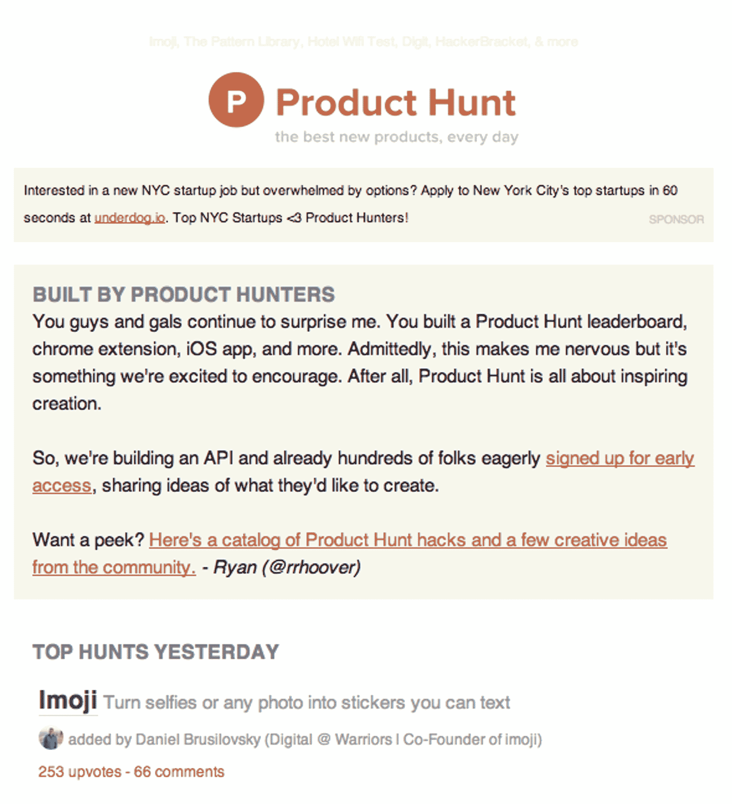

# 产品搜寻无处不在——这就是它的由来|第一轮回顾

> 原文：<https://review.firstround.com/Product-Hunt-is-Everywhere-This-is-How-It-Got-There>

2013 年初，[产品猎奇](http://www.producthunt.com/ "null")还不存在。它的创始人[瑞安·胡佛](http://ryanhoover.me/ "null")，是游戏公司 PlayHaven 的产品总监，也是一个活跃的博客写手，吸引了一批忠诚而谦逊的追随者。他不可能预料到将要发生的事情。自 2013 年 11 月启动以来，产品搜索经历了快速增长。在媒体和有影响力的人中，这已经成为一个众所周知的数量。该公司[宣布，它是 Y Combinator 目前的创业新星](http://techcrunch.com/2014/07/17/product-hunt-the-popular-tech-product-discovery-site-is-in-current-y-combinator-batch/ "null")的一部分。突然间，胡佛发现自己是一个拥有强大观众的时尚引领者。

产品搜寻现在是*发现技术领域“下一件大事”的*地方。每天，它都会整理出一份人们尚未听说过的顶级产品和初创公司的名单，并让越来越多的精选成员投票、评论和讨论。结果是一份全行业人们应该关注的每日十大清单。创始人把它作为一个发射台，投资者把它作为一个猎场，许多其他人只是为了了解情况。

产品搜索可能是作为一个实验性的附带项目开始的，但在许多方面，它的崛起是敏锐地制造出来的。在这次独家采访中，胡佛分享了初创公司可以用来早期吸引注意力并在此基础上取得成功的策略。

**阐明市场中的明显差距。**

当胡佛意识到他花了多少时间与朋友谈论新的技术产品和小工具时，寻找产品的想法浮出水面。很多人会问他对 [TechCrunch](http://techcrunch.com/ "null") 、[黑客新闻](https://news.ycombinator.com/ "null")、 [Reddit](http://www.reddit.com/ "null") 和 [Twitter](https://twitter.com/ "null") 上的新事物有什么看法。似乎有很多地方可以找到这类信息——太多的地方。“没有一个平台不可知的目的地，”他说。

他开始考虑这类平台的潜在竞争对手。“我看了看类似于 [Kickstarter](https://www.kickstarter.com/ "null") 这样的网站，但那个网站仅限于运行众筹活动的产品，其他网站还有其他限制。我想要某种形式的策展——一种找到创业社区会感兴趣的所有酷的新事物的方式。没有一个地方可以进行这种类型的对话。”

最初，产品搜寻是由它不是什么来决定的。它不是更广泛的技术社区的一部分。这并不太专业。它不太消费。它没有被评论淹没，也没有分散在多个网站。这是一个清晰、简单的列表，人们可以随意浏览或深入挖掘。这是一个许多人可能会忽略的利基市场。但是胡佛能够解释为什么这个利基市场对那些想要在一个地方获得所有他们需要的信息的忙碌的人有吸引力。

**从电子邮件开始。**

有了这个解释，胡佛开始测试其他人是否会接受这种类型的资源。他选择电子邮件来进行这项测试，部分原因是因为它易于执行(感谢链接共享工具 Linkydink)，但也因为它有迅速滚雪球的潜力。

“我创建了这个名为产品搜索的合作列表，并邀请了几十个我认识的人加入，”胡佛说。“他们在创业公司工作，或者只是我认识的人。我没有大力推销它，但人们似乎很快就喜欢上了它。很快，我有了几百个订户，人们开始来找我，告诉我他们多么喜欢每天收到电子邮件。那时我想，好吧，也许这里还有其他东西。”

电子邮件让胡佛的最初追随者能够将产品搜索消息转发给其他潜在订户，并通过最具共鸣的沟通形式创建一个网络。不管设计得多好，人们对收件箱的关注要比社交媒体或其他营销活动多得多(尤其是当电子邮件来自他们认识的人时)。麦肯锡最近的一项 T4 研究宣称，电子邮件在获取客户方面的效率是脸书和推特总和的 40 倍。因此，如果你在衡量对你的创业公司的兴趣，电子邮件给了你观察有机增长的机会，让你可以轻松地尝试一些小的调整，并从零开始建立一个受众群体。

“尽管这封邮件非常简单，但它让我确信人们关心这些内容，”胡佛说。当他最终决定建立网站时，电子邮件列表成了最重要的资产和跳板，可以推动流量，让人们一次又一次地回来。随着产品搜索的势头越来越大，它继续膨胀，成为新粉丝和营销机会的持续来源。

今天，电子邮件列表超过 43，000 名订户。“这听起来可能不是很大，但我们认为这是非常密集的，因为我们接触的人是创始人、企业家和风投——每次电子邮件发出都会产生影响，因为这个生态系统是如此有影响力。”

**这里有一个例子摘录:**

**给人一种新习惯。**

当今年早些时候推出产品搜索网站时，胡佛和他的合作创始人所做的最明智的决定之一是将产品列表“分天”。每天都有新的产品提交、投票和评论。过去的日子可以被看作是无限滚动的产品时间胶囊——合并成投票最多的前 10 项商品。你可以看到人们上周、三个月前喜欢什么，等等。但是要想知道今天人们喜欢什么，你必须回到这个网站。

“将服务按日细分至关重要——我们正在为人们建立这种日常习惯，”胡佛说。“通过对我们正在做的事情进行时间限制，我们将寻找产品定义为人们每天留出时间来做的事情。”随着网站吸引了越来越多的访问者，这就是他观察到的使用模式。就像人们回到喜欢的博客或他们在 Twitter 上关注的人一样，他们会看到产品搜索上发生了什么——这是胡佛和他的团队一开始就能够建立的心态。

“这有助于你浏览前几天的内容而不会感到不知所措，”胡佛说。“你可以带着这种完成感离开——你来了，你看到了，你知道了你需要知道的一切，并且可以离开。对于其他订阅源，内容似乎会永远持续下去，你可能会感到筋疲力尽，或者觉得永远也看不完，所以你甚至不会开始。”

电子邮件也有助于强化寻找产品的习惯。订户每天都会收到一封电子邮件，总结前一天的热门产品，并分享关于该网站的任何其他相关信息。例如，胡佛已经能够推出一个播客系列，吸引像 Reddit 的亚历克西斯·奥哈尼安、凯文·罗斯和罗伯特·斯考伯这样的大人物——并通过电子邮件有效地吸引了人们的目光和耳朵。

“产品开发者犯的一个错误是他们太害怕去打扰他们的用户。”

“他们不发邮件。他们不会发送推送通知，”胡佛谈到许多创始人和创客时说。“最终，如果用户喜欢你的产品，他们会希望得到提醒。这就是我们如何让那些可能只去过一两次的人把它变成一种仪式。我们提示了他们。电子邮件是让人们重新参与进来的最佳方式。”到目前为止，产品搜索团队看到的打开率和点击率远远高于行业平均水平。

是什么让这封每日邮件如此具有粘性？**胡佛有两个理论:**

**一致性:**电子邮件每天在同一时间发出(太平洋时间上午 7:30)，并且将始终包含同一部分信息:前一天的前五种产品。“人们知道他们会得到什么，我们创造了一种他们可以期待的期望。这成了他们早晨例行公事的一部分。如果它在不同的时间或意想不到的日子出现，我不认为它会成为习惯。”

**一件新鲜事:**在每封电子邮件的顶部，产品搜索包括一个简短的原创编辑部分，可能会推广一个新的播客，链接到一个特定类别的产品集合，或发布一则公告(如其在 YC 的内容)。“它旨在与众不同，出人意料，我认为这是人们开放它的主要原因之一，尤其是我们的铁杆粉丝，他们不太在乎前五名。他们仍然想知道什么是新的，这推动了行动。”

“在意想不到的地方加上一点点意外的发现。”

不要偏离你的首要目标。

Product Hunt 非常独特的一点是，它没有为用户提供一系列在社交渠道上分享内容的选项。你可以选择在推特上发布一个新产品，差不多就是这样——即使这样也是网站的基础，因为用户使用他们的推特身份登录。选择是有限的。作为访问者，你可以点击查看产品，如果登录，你可以投票或评论。

“这真的是故意的，因为我们想让人们专注于他们来看的内容，”胡佛说。"**我们用来判断我们工作是否出色的核心指标是有多少人实际点击和访问了产品页面**。这就是我们如何知道人们会继续在我们所做的事情中发现价值，以及在此之后的一切——流量、参与度等。”

这又回到了一个问题，是什么让一些东西可以共享。在大多数情况下，人们希望在网站上分享或“搜寻”一种产品，以显得聪明、精明、有联系。他们希望通过评论在其他有影响力的人中建立知识可信度和观点。

“让人们更容易分享，然后因为分享而感到有回报，这符合我们的最佳利益，”胡佛说。“我们不想用一堆其他功能来妨碍这一点，我们也不想牺牲内容本身，给人们太多点击或做其他事情的机会。”

如果有什么不同的话，Product Hunt 计划利用它的一个社交整合来更努力地实现吸引产品眼球的目标。“一个例子是，如果你在 Twitter 上关注某人，当那个人对某个产品发表评论或发布某个产品时，你会收到通知。它利用了你对你所关注的人的尊重，让我们通过电子邮件或其他方式向你展示的产品与你更加相关。”

激励你的影响者。

产品搜索迅速发展的原因之一是，它的许多用户都有倾听他们意见的社区。特别是，胡佛发现让网站上产品背后的制造商或创始人参与对话尤其有价值。用户喜欢听到不同功能背后的基本原理，并享受与他们直接讨论的机会。这是一个难得的机会。

对于创始人来说，这也是一个同样难得的机会，他们可以使用产品搜索来倾听人们对他们所做的东西的看法，他们可以做些什么不同的事情，以及他们如何获得更多用户。推广和展示这种能力有助于胡佛吸引和激励更多有影响力的人谈论产品搜索并与他们的追随者分享。最近，该网站在产品列表旁边添加了一个绿色的“M”徽章，以表明制造商已经参与了评论(它也出现在他们的名字旁边)。你可以看到这有多受欢迎:

“早期，我花了很多时间通过电子邮件、在 Twitter 上进行人工推广，使之个性化，”胡佛说。“为早期用户提供良好的体验一直是重中之重。即使现在事情已经有所发展，我还是试图保持那种语气，就像我在给朋友发电子邮件，谈论一些新的令人兴奋的事情，我合理地认为他们应该检查一下。只有在非常罕见的情况下，我才会亲自发送大量关于产品搜索的电子邮件。”

他通过不断监控网站上的评论线索，对个人做出深思熟虑的回应，祝贺他们提出有益的见解，并鼓励他们参与对话，来补充这种沟通。这耗费了他几个小时的时间，但却产生了很大的影响。

“我会特意找一些与特定产品相关的人。比如，如果一个产品专注于基于专业知识联系人们，我会评论和标记一些我认识的正在工作或从事类似项目的其他人，请他们参与进来。这会让对话对每个人都更有用、更生动。”

“你要让人们不仅觉得自己与众不同，而且喜欢他们是你成功的一部分。”

为了让网站的影响者更多地参与产品搜索，他给了他们机会来真正塑造网站的外观、感觉和功能。他使用 [Invision](http://www.invisionapp.com/ "null") 来分享产品搜索的网络和 iOS 应用程序版本的模型，并要求他最有影响力的追随者提供他们对从标语到页面结构到导航的一切的意见。

“我们从一开始就这样做了，通过电子邮件分享模型，甚至在产品建立之前，只是一次性地收集反馈，”胡佛说。“很明显，提供反馈的人确实感觉对我们投入了更多。人们真的很喜欢在这件事情上有发言权的感觉，我们真的听取了他们的意见，根据他们的反馈修改了设计。”

这个策略成功的关键是及时地根据用户反馈交付一些东西。胡佛和他的朋友内森·巴肖一起在为期四天的周末建造了第一个站点。尽管开始时有些问题，但花时间给出意见的影响者有能力立即处理一些事情。据胡佛称，这巩固了许多人对该网站的忠诚。

“了解社区中的人以及他们在做什么大有帮助。”

激励影响者的第三个因素实际上发生在线下。自今年年初以来，Product Hunt 的创建者一直在举办早午餐、欢乐时光和其他活动，邀请参与该网站和其他社区的较小群体的人。“我们做过公众活动，任何人都可以来，然后是一些私人活动，”胡佛说。“最近，我们在纽约与 25 名长期寻找产品的人共进了早午餐。”

人们参加这些活动，提前知道他们可能会遇到其他人，这些人可能是有价值的网络联系人。它们为那些已经提交产品和评论的人提供了另一个接触点，让他们真正了解彼此，并可能在其他方面专业地互相帮助。

“如果你觉得你已经建立了一个真实的关系，你会更加热爱一个产品或一个社区。”

越多拥有大网络的人喜欢这个产品，他们就会吸引越多的人加入，产品搜寻就会越快。胡佛已经看到了这种涟漪效应的发生，并希望通过举办黑客马拉松来最大限度地发挥这种效应，并让志同道合的影响者更容易找到并相互联系。

最近，他向产品搜索社区的一些更积极的成员发出邀请，这些成员将授予人们评论和投票的特权。邀请的工作方式要求这些人向他们的被邀请者发推文。鉴于他们比一般人拥有更多的追随者，他们不仅邀请了一些人，还激发了更多人对产品搜索的兴趣，并有可能成为会员。

**限制准入，逐步扩大。**

自从该网站上线以来，只有一定数量的人能够使用它的所有功能，而且许多人都是胡佛亲自挑选的。这培养了一种独特的感觉，激励有影响力的人对加入网站更加兴奋。但这不是唯一的理由。

“限制可以提交产品的人数对我们来说至关重要，这样网站就不会被成百上千的随机提交所淹没——这对每个人来说都是糟糕的用户体验，”胡佛说。“我们需要确保不会让一群自我推销者或营销人员出于错误的原因发布信息。通过将规模保持在可控范围内，我们可以更好地进行调节，这让我们有更多时间了解事情是如何运作的，以及人们对我们的期望是什么。”

有人说，对于初创公司来说，探索不可扩展的想法很重要。产品搜寻证明了完全限制规模有时是有益的。它可以给你一个机会，把更多关于你的网站、产品或体验的东西放在石头上。它可以给你一个沙箱，在向更广泛的观众开放之前，在那里玩更安全。也许最重要的是，它可以在一开始就提升内容的质量，这样你就可以给每个访问网站的人留下很好的第一印象。

胡佛知道，他们将不可避免地需要增长，以适应新的用户。当这种情况发生时，他希望实施黑客新闻和 Reddit 使用的一些更复杂的策略，以确保最佳内容浮出水面。“我们完全希望采取措施来防止垃圾邮件，并使用排名算法来管理监管。”

“当我们打开防洪闸门时，我们希望确保我们已经做好了准备。”

“大多数初创公司都需要考虑自己的文化——不仅仅是内部文化，还有用户文化。如果我们在一夜之间向 50，000 名新用户开放产品搜索，文化将发生巨大转变。即使这不是一种不好的文化，只是一种不同的文化，也会有冲突。我们希望更好地保护我们现在拥有的良好氛围。”

网站上更多的人也会要求发布更多的产品，这不一定是件好事。“你必须思考——在我的网站上，交互的主要对象是什么？在我们的案例中，是单个产品，一切都围绕着它们。如果没有足够的产品来讨论，那么我们的社区就会失败。你必须确保你的观众和内容之间的平衡。现在我们做到了，我们希望它能以适当的势头继续增长。”

这种势头的一部分也是为了确保人们在平台上有积极的体验。这么多创始人和制造商愿意参与的一个原因是，他们知道他们会在产品搜索上找到一个受人尊敬的、高素质的社区。“许多人对产品搜索的第一次体验是在网站上看到自己的产品，这对他们来说是非常好的首次用户体验，”胡佛说。“这不仅是免费曝光，而且他们得到了很多关注，有时结果是成千上万的访问。创始人们在博客上描述了这一经历，并对此赞不绝口。他们立即成为社区的一部分，并且对其他展示产品的创始人产生共鸣。这是一种良性循环。”

限制围绕你的服务或产品的社区规模听起来可能违反直觉，但它确实有很多好处。一旦你吸引了能为你带来更多用户的合适的人，你就要确保他们有积极的体验——而做到这一点的最佳方式往往是更有意识地参与到塑造互动中来。

不要等到你的产品有了受众才开始行动。

“在你拥有一个产品甚至一家公司之前，建立一个观众群是非常重要的，”胡佛说。“建造这样的东西，最难的事情之一就是获得关注。”

“即使你有一个很棒的产品，如果你没有受众，那也没关系。”

“很多人说他们想创办一家初创公司，但他们不知道自己想做什么。你绝对不能强求。但是，如果你知道这一点，当你在等待正确的想法或正确的时刻时，你可以考虑建立一个社区。”

在胡佛的案例中，在产品搜索突然出现之前，他经营了他的博客将近两年。他写了一系列与产品设计、营销和产品管理等领域的初创公司相关的主题。他还帮助尼尔·埃亚尔写了他的书《上瘾:如何打造形成习惯的产品》。他围绕这个博客建立的粉丝群帮助他建立了第一个接触到产品搜索的团队，这在一开始就产生了巨大的影响。

“人们说他们不知道如何吸引观众，但归根结底是为人们提供某种价值。能给什么建议？你知道哪些大多数人不知道的事？胡佛说:“如果你开始把它放在那里，你就可以建立声誉和人脉，这将有助于你今后的上市——人们会关心你要说什么。“如果我没有写博客，也没有活跃在 Twitter 上，我想 Product Hunt 可能需要更长的时间才能成为现在的样子。所以我的建议是早点开始。如果你希望人们最终听你的，你必须随着时间的推移建立信任。”