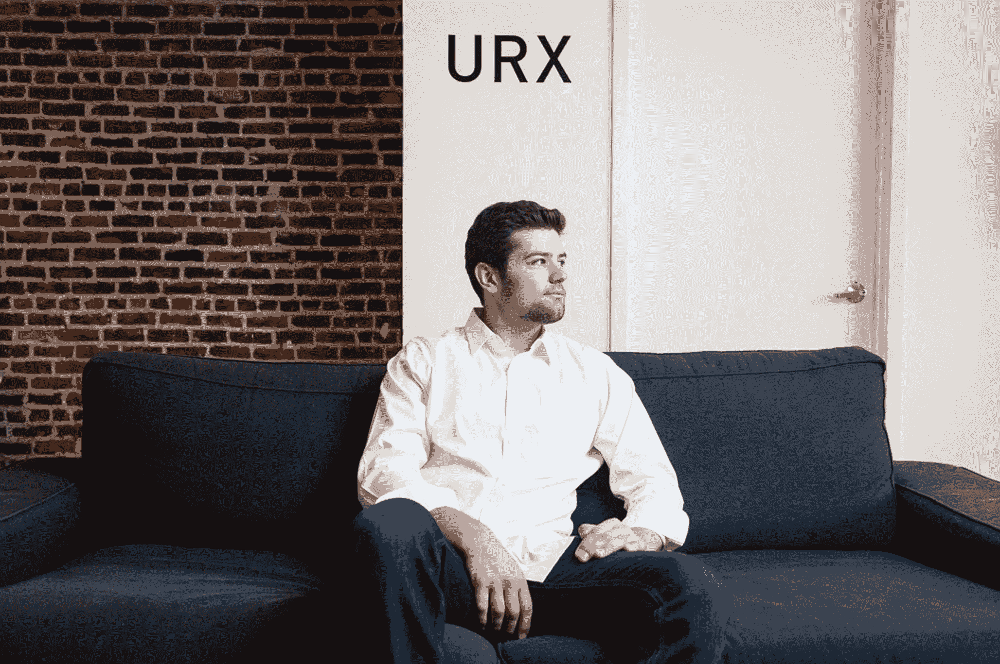
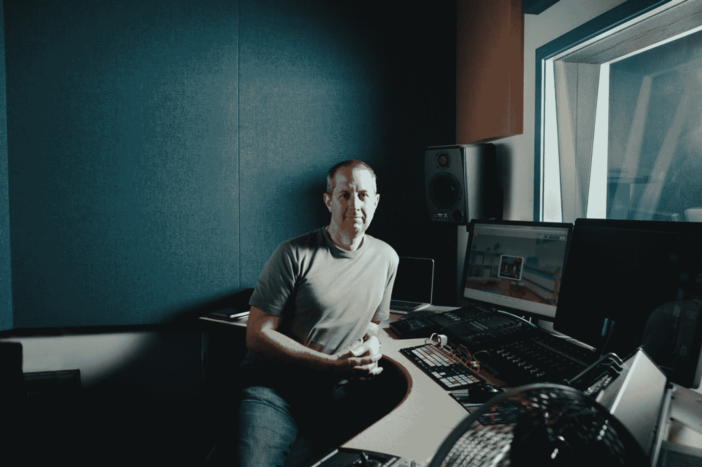

# 2014 年给创业者的 30 条最佳建议|第一轮回顾

> 原文：<https://review.firstround.com/The-30-Best-Pieces-of-Advice-for-Entrepreneurs-in-2014>

去年早些时候，我发现自己坐在[脸书](https://www.facebook.com/ "null")的自助餐厅里[Caryn maroney](https://www.facebook.com/caryn.marooney "null")的对面，谈论着初创公司如何引起注意。是什么样的不可言喻的品质将成功的媒体宠儿与那些再也没有人联系的公司区分开来？这是一个很大的问题，马龙尼——现在是脸书科技通讯的负责人，也是 OutCast 机构的前任创始人——有很好的答案。她已经从事这项工作有一段时间了，受到媒体的关注，使得数十家初创公司脱颖而出(包括最终的巨头，如 [Salesforce](http://www.salesforce.com/ "null") )。与她交谈时，我突然意识到这种情况是多么特别，她的建议是多么有价值——基于真实的经历、成功、失败和教训。

在过去的一年里，我有幸与近 100 位像 Marooney 这样的人交谈过，他们都是各自领域的佼佼者——从招聘设计师到建立技术团队，再到提高员工的幸福感。他们掌握着如何从零开始建立创业公司的拼图，在这里，在[评论](http://www.firstround.com/review "null")中，我们为不断增长的观众组装它们。

我们采访了像 Pandora CTO [Tom Conrad](http://about.me/tconrad "null") 、Spotify 首席设计师 [Tobias van Schneider](http://www.vanschneider.com/ "null") 、Twitter 工程副总裁 [Chris Fry](https://twitter.com/chfry "null") 、首席执行官和创始人这样的人——他们每个人都分享了他们的经验，心中都有一个目标:**建立尽可能强大的企业家社区**。以下是我们今年发布的 30 条最深刻、最有帮助的建议的综述。我们迫不及待地想在 2015 年为您带来更多。

[1。选择必须](http://www.firstround.com/article/What-to-Do-at-the-Crossroads-of-Should-and-Must "null")。

Elle Luna 在成功的巅峰辞去了她梦寐以求的工作。她在 [Dropbox](https://www.dropbox.com/ "null") 收购[邮箱](http://www.mailboxapp.com/ "null")之前离开了它，因为她想创造艺术。第二年，这位天才设计师在[优步](https://www.uber.com/ "null")的移动应用程序和[媒体](https://medium.com/ "null")的背后作画，去了巴厘岛，并启动了她自己的纺织企业 [The Bulan Project](http://bulanproject.com/bulan/ "null") 。最重要的是，她提出了一个适用于所有人的教训:“人生有两条路:应该和必须。我们一次又一次来到这个十字路口。每一次，我们都可以选择，”卢娜说。“‘应该’是别人希望我们如何在这个世界上出现——我们应该如何思考，我们应该说什么，我们应该或不应该做什么。**必须与众不同**。当我们与最真实、最真实的自己独处时，我们就是我们，我们相信什么，我们做什么。”必须的困难之处？这是每天的练习，也是反复出现的选择。好消息是什么？你一次又一次地来到这些十字路口，你总是要做出选择。下面是露娜是如何做到的。

[2。保持愚蠢。](http://firstround.com/article/spotifys-design-lead-on-why-side-projects-should-be-stupid "null")

Tobias van Schneider 的生活就像一个大项目。如今，他在纽约为 [Spotify](https://www.spotify.com/us/ "null") 设计和制造新产品，但他不可能预测到自己 15 岁辍学，或者被多所艺术学校拒绝。他的事业源于几个实验性的副业项目。但是，为了让这类项目真正成功，范·施耐德说，**你必须让自己变得愚蠢**。“副业项目成功的唯一途径是，如果人们允许自己想得简单，改变想法，失败——基本上，不要太认真，”他说。当你让事情变得宽松时，你会尝试新事物而不害怕失败，你会抛弃对结构和成长的痴迷，你会更加信任自己，你会创造一种充满激情的文化。以下是公司如何帮助他们的员工保持愚蠢从而更有创造力的方法。

人最大的旁门左道就是自己和事业。

[3。20-40-60 法则。](http://firstround.com/article/8-Rare-Gems-from-Heidi-Roizen-on-Building-a-Fulfilling-Life-and-Career "null")

在作为企业家、高管和投资者的职业生涯中，[海蒂·罗伊森](http://www.heidiroizen.com/ "null")[学到了几条构建充实生活和职业生涯的经验](http://firstround.com/article/8-Rare-Gems-from-Heidi-Roizen-on-Building-a-Fulfilling-Life-and-Career "null"):道德的重要性，尊重你的直觉，等等。但她学到的最解放和激励人心的原则之一是:“20 岁时，你总是担心别人对你的看法。40 岁的时候，你醒来说，‘我再也不在乎别人怎么想了。’到了 60 岁，你会意识到根本没人在想你，”她说。真相？**“没有人从一开始就想到你。你的老板没有考虑到你。你的同龄人没有想到你。你需要考虑你自己。"**你需要成为自己的拥护者**。意识到没有人会像你想自己那样想你，节省时间，开始工作吧。**

[4。要扩展一个团队，一次又一次地打破你的模式。](http://firstround.com/article/Hyper-Growth-Done-Right-Lessons-From-the-Man-Who-Scaled-Engineering-at-Dropbox-and-Facebook "null")

当 [Aditya Agarwal](https://www.crunchbase.com/person/aditya-agarwal "null") 在 [Dropbox](https://www.dropbox.com/ "null") 起步时，该公司有 30 名工程师为 5000 万用户构建。现在，他领导着一个 200 多人的团队来保护超过 3 亿用户的数据。在这个过程中，他成为了扩展技术团队的专家。他说，关键是不断发展(并雇佣懂得如何发展的人)。你需要一个能快速学习、适应变化、能随机应变的团队。如果人们不知道如何做某事，让他们学习。这就是 Dropbox 如何从 3 到 4 名工程师定期为 iOS 代码库做出贡献发展到超过 30 名的原因。“如果你做的事情是对的，总会有一些东西会坏掉。最重要的是，告诉每个人，一点点混乱没关系，”阿加瓦尔说。

Agarwal at Dropbox HQ.

[5。不要被少数人的声音分散了注意力。](http://firstround.com/article/What-to-Learn-from-the-Man-Who-Managed-Reddits-Community-of-Millions "null")

作为 Reddit 的第一任社区经理，[埃里克·马丁](https://www.linkedin.com/in/erikmartin "null")管理着一个现在每月为超过 1 亿的独立访问者提供 55 亿页面的网站，而他是用一个非常小的团队做到这一点的。他说，知道在哪里投入时间变得至关重要，而做到这一点的最佳方式之一是停止在一小群吵闹、愤怒的用户身上浪费时间和精力。这是几乎每个消费者创业公司都会面临的问题，它会让你偏离正轨。“当事情变糟时，人们会更频繁地表达自己，”马丁说。“但你有更多的人是你定期服务的对象。”[为了确保你将这个大社区引向正确的方向](http://firstround.com/article/What-to-Learn-from-the-Man-Who-Managed-Reddits-Community-of-Millions "null")，他建议在所有沟通中保持友好和礼貌，识别你得到的反馈的模式，并在你这样做时做出回应。表达同理心，以表明真实的人类正在努力解决用户或客户的问题。

[6。运行肋骨测试](http://firstround.com/article/The-Best-PR-Advice-Youve-Never-Heard-from-Facebooks-Head-of-Tech-Communications "null")。

作为脸书的技术交流主管(在此之前是 OutCast agency 的联合创始人)， [Caryn Marooney](https://www.facebook.com/caryn.marooney "null") 已经为几十种产品发布了大量新闻。“要让记者报道你的产品，你必须让他们相信你在做的事情很重要，”她说。看看你的新闻是否通过了**肋骨测试**(你的故事会不会“粘住他们的肋骨”？).在这种情况下，肋骨代表相关，不可避免，可信和简单。**相关:**你的公司是在为真实的人解决真实的痛点吗？为什么你的解决方案值得关注？**不可避免的**:如果你参与的任何趋势或运动看起来都不会最终实现，那么你将会逆风而行。可信:你必须让人们相信你的公司是能够实现这一目标的人——你将是那个把球带到终点线的人。**简单的**:“把你的信息拿下来，编辑一下，”Marooney 说。“抓住它的本质。你希望人们记住的一句台词是什么？你只能得到一个。”

变得可信不仅仅是让人们相信你能赢，而是让他们相信他们希望你赢。

[7。通过看你欣赏的产品来发现伟大的人才。](http://firstround.com/article/An-Inside-Look-at-Facebooks-Method-for-Hiring-Designers "null")

Julie Zhou22 岁开始在脸书工作，并与该组织一起成长，指导产品设计。这个角色最重要的部分之一是引进世界上最好的设计人才。她做的第一件事就是在脸书之外寻找她和她的团队喜欢的产品。她建议从你的整个团队中寻找喜爱的应用程序和产品的清单——不仅仅是那些商业上成功的应用程序和产品，甚至是那些具有伟大事物本质的小应用程序或想法，选择那些展示你想要构建的相同技能和交互的应用程序和产品。“阅读产品上带有你喜欢的元素的小字——比如一个特别有效的 UX，或者一个创新的功能，或者一个非常精致、做得很好的导航系统，然后在谷歌、LinkedIn 和 AngelList 上搜索，直到你找到它们背后的人，”周说。这样做之后，关键是不要太害羞而不敢伸出手。人们喜欢收到粉丝的来信，不管他们做什么工作。这与设计之外的功能领域相关。如果你喜欢一家公司推销自己或销售产品的方式，那么你自然也想把这些技能带进自己的圈子。

[8。借信任打造值得信赖的产品。](http://www.firstround.com/article/Urbansitter-Lynn-Perkins "null")

[urban sitter](https://www.urbansitter.com/ "null")的首席执行官林恩·帕金斯，对于如何将信任融入科技产品有很多想法。但资源有限的初创公司可以做到这一点的最简单方法之一是从其他来源借用信任的形象。为了让父母更放心地在网上雇佣保姆，该公司利用他们的社交图，突出那些认识或被他们已经认识的人雇佣的儿童保育专业人员。珀金斯说:“当人们看到他们所属或尊敬的群体中的其他父母使用了保姆时，这是令人信服的信息。”该网站还显示了坐者与已知的、可信任的当地组织的联系，如心肺复苏术培训中心和育儿组织。需要建立用户信任的初创公司应该寻找潜在的合作伙伴和社交网络机会来建立自己的可信度。

Perkins in the lobby of Urbansitter's building

Perkins in the lobby of Urbansitter's building

[9。用正确的方式说不。](http://firstround.com/article/70-of-Time-Could-Be-Used-Better-How-the-Best-CEOs-Get-the-Most-Out-of-Every-Day "null")

普通的科技公司 CEO 一年工作 300 天，每天工作 14 个小时。然而，第一轮合伙人比尔·特伦查德说，大多数人将三分之二的时间花在电子邮件和会议上，这意味着他们 70%的时间都处于次优状态。为了找出如何扭转这种局面，[他与业内一些最有效率的首席执行官进行了交谈，并听取了他们的建议。反复出现的一件事是需要划定严格的界限。随着你的公司变得越来越突出，你只会得到更多的东西。越来越多的人通过 LinkedIn、电子邮件、联系邀请、去喝咖啡、寻求帮助。他说，这是被纸划伤的死亡。但是说不很难。这就是为什么特伦查德实施了一个“**无模板**系统来帮助他打破新闻。这里有一个例子:](http://firstround.com/article/70-of-Time-Could-Be-Used-Better-How-the-Best-CEOs-Get-the-Most-Out-of-Every-Day "null")

*嗨比尔，*

很高兴接到你的电话。我希望一切都好。幸运的是，我的公司正在起步，我面临着实现一些宏伟目标的巨大压力。我参加了很多社交活动，但不幸的是，我现在无法建立联系。

*最好，*

*乔希*

有了这个工具，特伦查德节省了不可估量的时间和焦虑。他表示:最重要的是，你关上了进一步沟通的大门。以如实解释情况的方式做得很好，但不要让事情没有结果。

[10。提高你的酒吧雇佣人数](http://www.firstround.com/article/Mechanize-Your-Hiring-Process-to-Make-Better-Decisions "null")。

作为[亚马逊红移](http://aws.amazon.com/redshift/ "null")和[亚马逊极光](http://aws.amazon.com/rds/aurora/ "null")的总经理，[阿努拉格·古普塔](https://www.linkedin.com/pub/anurag-gupta/0/332/853 "null")负责不断提升公司的技术人才。为此，他有意提高每个新员工的标准。古普塔建议指派已经在你公司的人担任酒吧老板。让他们参与到每一次招聘对话和每一轮面试中。授权他们决定某人是否比现有人才有所进步。“选择标准高、判断力强的人，”古普塔说。“告诉他们，他们的工作是确保有人在你公司的那个职位上超过 50%。”至关重要的是，提高门槛的人不要像招聘经理那样迫切需要填补一个职位。他们应该来自招聘团队之外，但对该职位有足够的了解来判断人才。你不希望他们受到时机的影响；你希望他们专注于性能。

[11。修补漏斗中的漏洞。](http://www.firstround.com/article/This-Woman-Has-Landed-Millions-of-Mobile-Downloads-Heres-How-She-Does-It "null")

Tamara Steffens 曾为 Path、Color 等公司负责业务开发，最近又被微软收购 [Acompli](https://www.acompli.com/ "null") 。通过这样做，她变得专注于通过所有渠道获取用户——包括他们从转化漏斗中掉出的地方。她指出了创业公司应该格外注意的两个漏洞。首先是**第一天**。在下载应用的同一天，你会失去多少用户？如果你的产品令人困惑或害怕，普通用户很可能会关掉它，然后马上扔掉它。解决办法:如果用户在看到你的应用程序之前就停止使用它，仔细看看你的注册过程。如果你正在失去花时间注册的用户，那么你需要仔细检查你的欢迎流程。**第二个漏桶是 6 周标记**。六周后，有多少用户仍然在积极使用你的应用？如果你失去了很多，你的产品可能会失去它的实用性或新颖性。**解决办法**:专心倾听你的客户想要从你的产品中得到什么，并尽可能快地重复这个反馈。

假设在新用户决定使用或删除你的应用之前，你有 90 秒的时间与他们交流。

[12。尊重别人的时间。](http://www.firstround.com/article/This-is-Why-People-Leave-Your-Company "null")

Carly Guthrie 在为精英餐饮集团和科技创业公司管理人力资源多年后，面临了一些最具挑战性的人力资源问题。在那段时间里，她看到许多有才华的人厌倦了，离开了他们本可以做得很好的公司。人们逃离的主要原因之一是因为他们觉得自己没有时间。“一个真正优秀的 CEO 会考虑大局，意识到人们在工作之外还有自己的生活。格思里说:“这是防止人们产生想去其他地方的感觉的最佳方法。她看到公司要求周五下午晚些时候的快乐时光和周一早些时候的员工会议，这是在冒险。“从周五下午 5 点到周一上午 9 点应该是人们自己的时间，而不是公司的时间，”她说。周末工作与否应该是人们的选择。当你提供这种程度的自由时，你就可以更合理地说，“剩下的时间我要向你要太阳和星星。”

[13。为早期成功确定你的定位。](http://firstround.com/article/positioning-your-startup-is-vital-heres-how-to-do-it-right "null")

当 Arielle Jackson 开始围绕[封面](https://www.coverscreen.com/ "null")(Android 应用程序很快被 [Twitter](https://twitter.com/ "null") 抢购一空)制定营销和传播计划时，她带来了来自谷歌的经验，她在谷歌管理 Gmail、Docs、Calendar 等产品的营销。和 [Square](https://squareup.com/ "null") ，在那里她领导了新硬件产品的上市计划。在所有这些例子中，发展稳固的市场定位是至关重要的。Jackson 说:“你需要在用户的心目中定位你的产品。“这需要考虑你的潜在用户，评估产品的优势和劣势，并考虑你的竞争对手。市场上有如此多的产品，人们都很忙。你必须知道你是谁。”她提供了一个相当简单的公式，结合了所有这些标准:

针对(目标客户)

谁(需求或机会陈述)，

(产品名称)是一个(产品类别)

That(主要优势陈述)。

不像(竞争对手)

(产品名称)(主要区别陈述)。

# 示例:

对于万维网用户

喜欢书的人，

亚马逊是一家零售书商

它提供了对超过 110 万本书的即时访问。

与传统的图书零售商不同，

亚马逊提供了非凡的便利、低廉的价格和全面的选择。

Jackson at First Round.

[14。创造一个“流动”的环境](http://firstround.com/article/Heres-Why-Founders-Should-Care-about-Happiness "null")

在游戏和软件行业爬了 24 年的公司阶梯后， [Scott Crabtree](http://www.happybrainscience.com/ "null") 决定投身于通过增加快乐来提高员工生产力的事业。今天，他是[快乐脑科学](http://www.happybrainscience.com/ "null")的创始人，这是一个展示支撑工作满意度的数据的组织。他的重要观察:**当人们进入高效能的“心流”状态时，他们能完成最多的工作**。为了让人们建立心流，他建议构建目标，使其具体、可衡量、可实现、相关且有时限( **SMART** )，确保这些目标有意义(人们在个人、情感层面上与他们联系在一起)，并使目标与人们的优势相一致——不仅仅是他们擅长什么，而是他们天生喜欢什么。克拉布特里说，如果你作为管理者能够做到这一点，同时帮助人们减少一心多用，你就走上了鼓励健康、快乐的生产力的道路。

[15。过程是由一个信息比你少的人告诉你该做什么。](http://firstround.com/article/process-is-being-told-what-to-do-by-someone-who-has-less-information-than-you "null")

[Peter Deng](https://www.linkedin.com/in/peterxdeng "null") 在脸书的早期，流程和结构受到限制，每个人都专注于快速行动和突破。这一经历让他非常注意什么时候需要过程，什么时候过程只是碍事。现在，作为 Instagram 的产品总监，他想出了一个方法来确保协议不会失控。这包括通过取消不再有用的定期会议来清理你的石板，理解所有的结构和会议都应该有一个截止日期，禁止在某些日子和时间开会以释放人们的时间表，并不断地重新审视和修订任何可以被称为政策的东西，以确保遗留需求不会成为根深蒂固的瓶颈。

16。从一开始就投入营销。

许多初创公司——尤其是那些技术含量很高的公司——资源匮乏，在产品成型之前不会优先考虑或投资营销。 [Robbie Mitchell](https://www.linkedin.com/in/robbiemitchell "null") ，教育创业公司 [Knewton](http://www.knewton.com/ "null") 的营销和传播主管，对此深表异议。他认为营销和产品应该同步发展。他看到了将 Knewton 的营销团队作为自己的内部机构运营的巨大好处，该团队由致力于营销目标的工程师、设计师和产品经理组成。“你怎么知道你在制造人们想要的东西，除非你先试着卖给他们？”米切尔说。“您需要尽快验证产品与市场的契合度，而唯一的方法就是在构建技术时找出价值主张。”

即使你的产品能做很多，你还是需要告诉人们它是如何融入他们的生活的。

[17。在你的招聘过程中注入火箭燃料。](http://firstround.com/article/Mine-Your-Network-for-Early-Stage-Hiring-Gold "null")

传统的推荐招聘看起来是这样的:你的员工大概知道你有什么职位空缺，他们大概知道他们网络中谁可能是合适的人选，当他们不做实际工作时，他们大概会考虑这个问题。但是这个淡化的系统仍然产生了一些惊人的招聘。为什么不启动它呢？作为人才发现初创公司 [TalentBin](https://www.talentbin.com/ "null") (被 Monster 收购)的联合创始人，这是[彼得·卡赞吉](https://www.linkedin.com/pub/peter-kazanjy/31/291/44a "null")的拿手好戏。关键是让某人的全职工作成为 **1)** 主动挖掘员工网络， **2)** 从员工那里提取关于他们网络的声誉信息， **3)** 对浮出水面的潜在候选人进行有规模的拓展。[以下是他的指导，教你公司的每个人如何在他们的人际网络中为你的公司找到最优秀的人才。](http://firstround.com/article/Mine-Your-Network-for-Early-Stage-Hiring-Gold "null")

18.[在内部通信中断之前修复它。](http://firstround.com/article/How-Fast-Growing-Startups-Can-Fix-Internal-Communication-Before-It-Breaks "null")

去年年初， [URX](http://urx.com/ "null") 是一家相对不知名的初创公司——一个拥有非常技术性产品的小团队。这种情况在今年春天发生了变化，当时该公司宣布了 1200 万美元的首轮融资。自那以来，该公司已发展到近 30 名员工，正处于突破性增长的边缘。但是真正让首席执行官[约翰·米利诺维奇](https://www.linkedin.com/in/jmilinovich "null")夜不能寐的是确保公司的内部沟通是按比例设计的。为了先发制人解决这个问题，他建立了几个弹性沟通渠道:**反向办公时间**，每周一次，人们可以提出任何问题、担忧或难题，并被邀请提出争议；由团队成员向整个公司发布的技术讲座，这样人们可以在学习他们每天所做的事情的同时向他们的同事学习；以及对米利诺维奇本人 1:1 的坚定承诺。“我最重要的工作是成为一个反馈环——我们的产品和市场之间的反馈环，以及团队的反馈环，”Milinovich 说。“这就是我们如何建立正确的文化，让我们尽可能快地到达目的地。”随着团队的扩大，一对一可能会变成每月一次或每季度一次，但作为首席执行官，他们仍将是他的首要任务。

Milinovich at URX.

[19。要想赢得销售，就要像买家一样思考。](http://firstround.com/article/The-39-Best-Pieces-of-Sales-Advice-Youll-Hear-This-Year "null")

在食品配送初创公司 [Seamless](http://www.seamless.com/ "null") 的早期，销售团队举步维艰。他们的策略根本不起作用，合作伙伴销售和服务副总裁 [Wiley Cerilli](https://www.linkedin.com/in/wcerilli "null") (现在是首轮风险投资合伙人)知道他们需要重新思考他们的方法。他们有什么好处呢？他们与使用该平台定期订购食品的大公司有许多预先形成的关系。“当你带着卖家的心态进去时，你会说‘嘿，如果你签了无缝就好了。他说:“对你来说，这太棒了，因为所有这些事情……，”“当你带着买家的心态进入时，你会说，‘你好，我们为高盛管理食品订购，我们正在考虑将你的餐厅加入我们的系统。“我们有些问题要问你，不如我们开个会吧，”“你必须包装你的资产，让你的服务成为你的客户想要购买的东西。

20。给予严厉的爱。

"严厉的爱是你最快建立信任的方式."这是 [Kim Scott](https://www.linkedin.com/pub/kim-malone-scott/1/403/255 "null") 在 20 多年的管理经验中学到的东西，包括领导自己的创业公司和为 Dropbox 和 Twitter 等公司提供咨询。你能做的最糟糕的事情是给人们不经常的、不清楚的反馈，因为你担心伤害他们的感情。为了给人们需要的反馈，让他们变得更好，你不能在乎他们是否喜欢你。“给出反馈是非常情绪化的。有时候你会被吼。有时你会流泪。斯科特说:“这是非常非常艰难的对话。"不要试图阻止或控制别人的感受。"她的建议是:直接说出来。**批评有半衰期，你等待发泄的时间越长，情况就越糟糕。奖励那些对你诚实的人，给他们树立一个好榜样。不要轻易表扬——只有在准确和真心的时候才表扬。**

[21。打造体验，而不仅仅是产品。](http://firstround.com/article/hardware-adam-macbeth "null")

有一个原因[53](http://www.fiftythree.com/ "null")的[铅笔](http://www.fiftythree.com/pencil "null")被认为是近年来最漂亮和最具革命性的硬件之一。硬件专家亚当·麦克白(Adam MacBeth)说:“整个体验是为了自然地适应人们的工作方式。”他的工作帮助塑造了 iPod 和 Jawbone 的腕带。“确定对用户来说最具挑战性或最难解决的问题。确定您有机会在用户的旅程中为他们增加最大价值的地方。硬件和软件之间的集成需要在这些点上最紧密。”麦克白说:**最好的硬件产品依靠软件来创造令人敬畏的端到端体验。任何硬件的努力都需要多学科的配合，软件应该起带头作用。**

最好的新想法存在于现实世界和软件之间。

[22。通过支持远程工作，雇佣最优秀、最聪明的员工。](http://firstround.com/article/Heres-Why-Youre-Not-Hiring-the-Best-and-the-Brightest "null")

[话语](http://www.discourse.org/ "null")与[栈交换](http://stackexchange.com/ "null")创始人[杰夫·阿特伍德](http://blog.codinghorror.com/ "null")看到了根本性的脱节。每个创业公司的创始人都被建议雇佣最好的人才。但是如果他们受限于一个地理区域，他们真的只能雇佣最优秀的人才。这就是他将远程工作作为公司核心的原因。“仅仅因为有人每天准时出现并不意味着他们在工作。他说:“这是一门生意，不是高中体育课——没有人应该因为完美的出勤而获得及格分数。”。那么，你如何确保人们在工作呢？**独家判断输出**:一个员工实现了多少功能？他们修复了多少个 bug？他们与客户进行了多少次对话？代码快了多少？“让人们能够留下他们做过的有用的事情的记录。不是‘待办事项’清单，而是‘已完成’清单。”

23.[早解决难的事情。](http://firstround.com/article/Facebook-VP-of-Engineering-on-Solving-Hard-Things-Early "null")

人们很容易陷入小型、处于构建阶段的初创公司的诱人陷阱:管理 20 个人很容易。共同的使命、小数目和创业磨砺让人们专注于几乎任何结构，包括根本没有结构。脸书前工程副总裁科里·翁德雷卡说:“管理是第一件困难的事情，很容易尽早做好。三个想法可以帮助小团队将管理钉在门外: **1)** 围绕你的公司成功所需的优势建立管理和组织结构；认识到你所选择的结构中固有的弱点，并做好计划；3)在每个人都非常了解对方的情况下，围绕沟通和决策建立良好的习惯。缺乏成功的管理和组织结构在增长模式中变得明显。Ondrejka 说，不要等到需要世界级的经理和激进的重组来解决信息流不畅或生产力问题。

[24。让你的筹款活动令人难忘。](http://www.firstround.com/article/Tell-Stories-Like-This-to-Take-Your-Fundraising-Pitch-from-Mediocre-to-Memorable "null")

你不能只是一遍又一遍地练习一分钟、十分钟或一小时的推销。你必须考虑阅读一个房间会是什么样子，阅读投资者的肢体语言，吸收当时的真相并做出相应的调整，[玩具公司](http://www.toytalk.com/ "null")的创始人兼首席执行官[柳文欢·雅各布](https://www.linkedin.com/in/orenjacob "null")(也是皮克斯的资深首席技术官)说。他说:“在一个获得你热情但对你公司的实际技术、财务或商业细节知之甚少的人面前练习。”“开始推销，告诉他们，在第 2 张幻灯片上，他们必须打断并问一个与第 12 张幻灯片相关的问题。让他们不断问你一些顺序混乱的问题，这样你就可以练习将对话从你想要和需要表达的不同观点转移开来。”

一场投球就是一场现场表演。你必须非常了解它，以至于它看起来是自发的。

Jacob in ToyTalk's sound studio.

作为第一轮的合伙人，Phin Barnes 已经为 20 多家初创公司提供了建议，并发现了一个共同的问题:公司没有从他们的建议关系中获得足够的回报。这很大程度上与他们出于错误的原因选择人有关。巴恩斯说:“我建议你找一个顾问，就像你找一个联合创始人一样——一个能弥补你已知弱点的人。”。**为了确保你得到你需要的，面试未来的顾问**。询问他们如何浏览一些示例场景。在过去，他们作为顾问是如何做得最好的？他们是在如何帮助你的公司的背景下谈论他们的经历，还是仅仅谈论过去的情况？他们有相关的领域知识吗？你需要所有这些问题的答案来找到正确的关系。

25.[为你选择合适的顾问](http://firstround.com/article/Get-the-Most-Out-of-Your-Startups-Advisors-with-These-7-Tactics "null")。

作为第一轮的合伙人，Phin Barnes 已经为 20 多家初创公司提供了建议，并发现了一个共同的问题:公司没有从他们的建议关系中获得足够的回报。这很大程度上与他们出于错误的原因选择人有关。巴恩斯说:“我建议你找一个顾问，就像你找一个联合创始人一样——一个能弥补你已知弱点的人。”。为了确保你得到你需要的，面试未来的顾问。询问他们如何浏览一些示例场景。在过去，他们作为顾问是如何做得最好的？他们是在如何帮助你的公司的背景下谈论他们的经历，还是仅仅谈论过去的情况？他们有相关的领域知识吗？你需要所有这些问题的答案来找到正确的关系。

26.[通过保持团队团结来建立稳定性](http://firstround.com/article/Twitter-Engineering-SVP-Chris-Fry-on-the-Power-of-Stable-Teams "null")。Twitter 前工程副总裁[克里斯·弗莱](https://www.linkedin.com/in/chrislfry "null")说:“你希望团队不仅能很好地合作，还能互相学习。”。为了达到这种程度的相互信任和流动，他建议团队在一起至少六个月，最好是一年或更长时间。建立和尊重团队的神圣性会给你带来几个好处。它们成为自我修复和自我纠正的有机体。当一个稳定的团队遇到故障或错过目标时，它会重组，知道如何进行严格的事后分析，并为未来进行调整。

27.[约束自己分清主次](http://firstround.com/article/This-Product-Prioritization-System-Nabbed-Pandora-More-Than-70-Million-Active-Monthly-Users-with-Just-40-Engineers "null")。

在其开发的早期，Pandora 有数百个它想要构建的功能，而工程马力却极其有限。但是，凭借 40 名工程师的骨干团队，它能够为每月 7000 万用户开发产品。为了做到这一点，该公司在首席技术官汤姆·康拉德的领导下，应用了一个基于约束的严格的季度优先排序系统。在收集了整个公司的想法后——根据规定，任何提交的想法都必须是“极其愚蠢”的，否则公司不会采纳，领导团队会将它们张贴在幻灯片上，挂在墙上，并通过用贴有不同金额的便利贴“购买”它们来投票。关键是每个人只能得到一定数量的“美元”来购买功能。经过几轮讨论和辩论后，他们会定期拿出 20 个功能在一个季度内完成——在剪辑室的地板上留下 60 多个“基本”想法。“每一天，我们都必须做最重要的工作，我们不能犯大错误，”康拉德说。这个优先级系统将这种需求变成了现实。

28.[谈到薪酬，尽可能公式化。](http://firstround.com/article/A-Counterintuitive-System-for-Startup-Compensation "null")

Molly Graham 加入脸书时，公司已经有 400 名员工，但还没有正式的绩效或薪酬体系。在定义一个适合公司的系统时，她了解到标准化是多么重要。“在一家初创公司，预测长期前景真的非常非常困难，”格雷厄姆说。“如果你过早地开始对新员工或新员工使用判断力，你将为自己带来无法预料的长期问题。”如今，作为[的业务运营主管，她强调了同样的观点。“我们解释说，公司里有一定经验的每个人的薪酬都是一样的，我们解释说，我们不会谈判，而是看他们的反应。”这将帮助你避免创业公司最常犯的一个错误:因为低估自己的股权而支付过高。**你只想雇佣那些对你的公司足够信任，以至于薪酬不是他们首要考虑的事情的人。**](https://quip.com/ "null")

29.[过关(测试)](http://firstround.com/article/This-Advice-From-IDEOs-Nicole-Kahn-Will-Transform-the-Way-You-Give-Presentations "null")。

作为 IDEO 的长期项目负责人，Nicole Kahn 经常向客户展示关于产品、解决方案和想法的幻灯片——她的大部分成功来自于讲述一个精彩的故事。这似乎与她(和许多其他人)经常遇到的无聊、乏味和无效的演示背道而驰。她的第一条建议是，通过使用她所谓的“酒吧测试”来验证你有一个好故事可讲。“当然，酒吧是友好的社交场所，但当你在酒吧时，一些真正重要的事情会发生，”卡恩说。你使用非常直接的语言。你要确保你所说的是有趣的和吸引人的。你没有引用大量的数据。你不要使用过度的公司语言——除了引号。”考虑到这一点，她鼓励主持人在正式确定任何事情之前，把他们的故事想法告诉那些不知道你在说什么的人。观察他们。留意他们何时俯身、移开视线或伸手拿手机。花 15 分钟找出能引起共鸣的地方，并把它作为你演讲的框架。

30.利用你的情绪能量完成更多工作。

你在任何特定时刻的感受——兴奋、焦虑、绝望等。高管教练[卡蒂亚·韦里森](http://www.kvacoaching.com/ "null")说——支配你一半以上的行为和决策。为了帮助她的客户最大限度地利用他们的时间，她让他们连续三天跟踪他们一天中的感受。目标不是让客户总是对自己和他们的工作感觉良好。每个人都会有情绪低落的时候。创业是一个巨大的过山车。相反，我们的目标是为客户提供他们需要的工具和语言，让他们从绝望的深渊中振作起来，重新获得充满活力的生产力。当你画出一天中不同时间的感觉时，你就有能力选择不同的活动。扭转你的情绪就像回忆珍贵的记忆或庆祝一个小小的胜利一样简单。你必须从理解你的触发器和模式开始，你可以从那里优化。

如果说身体能量是你的汽车，那么情绪能量就是你油箱里有多少汽油。

照片中最上面的人:(从右起)海蒂·罗伊森，艾尔·卢娜，阿迪蒂亚·阿加瓦尔，埃里克·马丁，卡林·马龙尼，比尔·特伦查德，汤姆·康拉德，朱莉·周，托拜厄斯·范·施耐德，莫莉·格雷厄姆。Paul Granese 的插图。