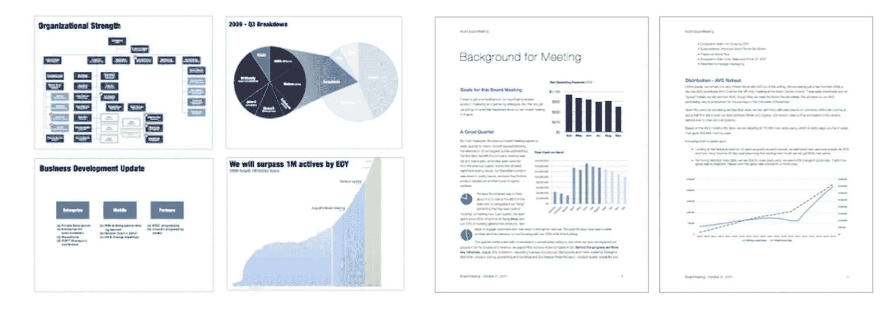

# 让董事会会议不那么糟糕的秘密|第一轮回顾

> 原文：<https://review.firstround.com/The-Secret-to-Making-Board-Meetings-Suck-Less>

“当我还是一个年轻的企业家时，董事会会议是我一生中最糟糕的日子，”杰夫·邦福特(Jeff bon forte)说，他是一位经验丰富的公司创始人，刚刚将他最新的 **[Xobni](http://address.yahoo.com/xobni "null")** 卖给了雅虎。“董事会会议是首席执行官最不安全的时候。基本上，这是一群既能评判你，又能根据这种评判解雇你的人。”

他有过不少糟糕的经历。在他的第一家公司 iDrive，他发现自己每个季度都站在房间前，汗流浃背，努力完成精心准备的幻灯片。“当时一团糟，”他说。“他们只是坐在那里，告诉我我有多么不足，我需要引进一个更资深或更聪明的人。然后我突然想到。我不需要这个。我不需要人们连续四个小时攻击我。我需要能帮助我的人。”

从那以后，这种理念的转变塑造了邦福特处理董事会成员和会议的方式。他的新战略的核心是:你作为 CEO 的成功取决于你的董事会尽最大努力帮助你——所以让他们发挥作用吧。当然，这说起来容易做起来难。

# 为什么董事会很糟糕

为了在他的板上翻转脚本，Bonforte 首先需要找出问题。为什么董事会会议如此令人伤脑筋，最终又如此无用？一群如此聪明、成就非凡的人在同一个房间里呆了几个小时后，怎么可能毫无进展呢？这让他很困惑，所以他开始记录他的痛点:

董事会议漫长、累人，而且难以集中注意力。

当你不得不谈论某些事情，比如钱是怎么花掉的时候，准确地捕捉你公司的故事几乎是不可能的。

你不能总是让你想要的人进入你的董事会。有时候你可以选择，但大多数时候一两个成员不会是你的首选，你对此无能为力。

太多的董事会太大，太多的董事会成员邀请观察员和一般的追随者——所有这些人都想附和一些听起来聪明的事情。

如果你在会议室前面展示一副牌，你就是在要求被评判和挑剔。这就像你又一次推销你的公司，只不过这次是卖给那些能把它从你手中夺走的人。

但不一定要这样。仔细想想，这些问题都有一个合乎逻辑的答案。它从一个关键的学习开始:

“每个企业家都忘记了董事会是为他们工作的，”邦福特说。“他们在会议中被打得落花流水，然后带着更多的工作离开。他们觉得他们必须证明他们的远见，而不是证明房间里的每个人都应该一起努力解决问题。作为首席执行官，你觉得带球过线是你的工作，但这也是董事会的工作。”

# 这在实践中是什么样子的？

在被揍了几次之后，邦福特知道事情必须有所改变。“我不停地问其他首席执行官，‘你们是怎么开董事会的？我知道我可能听起来像个白痴，但你如何让这些事情不那么痛苦？最后，我遇到了几个有一些疯狂想法的人。"

其中一位是来自[水闸](http://www.floodgate.com/ "null")的[迈克·梅普斯](http://www.floodgate.com/mikemaples.html "null")，他告诉邦福特，董事会实际上只需要考虑四件事:

自从我们上次见面以来，市场发生了变化吗？如果是的话，它对我们的影响是积极的还是消极的？

队伍变了吗？是好是坏？

我们在市场中的地位改变了吗？

我们做了我们说过要做的事了吗？

“这才是董事会应该关心的，迈克告诉我。而不是产品应该在这里还是在那里有一个按钮。处理好宏观经济和团队发展就行了。”

接着，在线教科书初创公司 Chegg 的首席执行官丹·罗森斯威格(Dan Rosensweig)插话提出了一些革命性的建议。邦福特说:“是他教会了我如何人为地让董事会变小，给董事会成员提供行动项目并没有什么不妥。”

突然间，董事会会议不再是关于判断。它们是关于生产力的。“如果你认为你的董事会成员在为你工作，就没有理由撒谎或捏造事实来证明你的能力，”他说。“如果你做了那些事情，你的董事会就不能有效地帮助你。”这也减轻了他的负担。

“我过去常常站在那里，想象我董事会里的所有风投都在想，他们为什么要进行这项投资。但是，在这一点上，这太糟糕了。他们已经在游戏中了。也许我并不是他们想象中的 CEO。从来没有首席执行官是这样的。他们可能总是认为公司应该比实际情况更好。不过没关系。我们在一起，我们可以做伟大的事情，所以让我们做吧。”

在卖掉 Xobni 之前，Bonforte 的董事会会议进行得非常顺利。第一步？“每当有待办事项出现时，我总是第一个看着我的董事会成员说，‘凯文，你为什么不处理这件事？’当然，他会说‘哦，好吧，当然了。’因为他还能说什么？如果你没有提出不合理的要求，而且他们是董事会成员，他们就应该帮忙。"

最终，事实证明，董事会成员喜欢带着任务离开。“他们都喜欢看到退出，然后说，‘我们在那个团队里真的很努力。’这可能很难，但这些都是以前努力工作过的人，他们喜欢完成事情。"

在 Xobni，Bonforte 并不羞于向董事会施压。“在某些关键时刻，我会建议每天打电话。显然，每个人的日程表都很乱，所以这意味着每天早上 7 点就要打电话。”这与他职业生涯早期管理董事会的方式大相径庭，当时他只看到了一个方向的工作分配:从董事会到首席执行官。“一旦我意识到董事会是来提供帮助而不仅仅是评判的，我就变得更善于请求和获得帮助。我发现，董事会为 Xobni 工作越努力，它在各个层面的运作就越好。”

事先做好跑腿工作。不要吝啬。根据 Bonforte 的说法，如果你想顺利召开董事会，你需要:

提前 30 到 45 分钟与每位董事会成员单独会面，这样你就知道他们将如何投票，他们对议程的想法，并打破任何潜在的问题或惊喜。“我甚至会说，‘我们会谈谈这件事。这是我的大问题。这就是我认为我们应该站出来的地方。“你觉得怎么样，”"

将全面的材料、数据和更新汇编成一个包，并至少提前四天分发给你的董事会成员。告诉他们做好准备。(稍后将详细介绍这一点。)

如果你的董事会太大，把它分成几个较小的委员会，你可以提前两到四周单独开会或召开电话会议。然后他们可以来展示他们一直在做的东西。

"[Nirav Tolia](https://www.linkedin.com/in/niravtolia "null")【Nextdoor.com[公司现任首席执行官](http://firstround.com/article/nextdoor.com "null")】教我在董事会开会前准备晚餐或午餐，并邀请我的一些主要领导参加。这让我能够按时参加随后的会议，也让我的董事会有机会在会议本身的高压环境之外结识关键人物。”

对于实际的会议，他建议预算三个小时，但只有 90 分钟的内容，包括 45 分钟深入探讨一个实际上需要董事会帮助解决的问题。不要做甲板——每个人都应该带着他们的背包——不要站在房间的前面。像其他人一样坐在餐桌旁。

风投们习惯于被介绍给别人，这样他们才能做出判断。你可能觉得站着能让你掌控一切，但事实恰恰相反。

另一个主要问题是谁应该在房间里。用邦福特的话说:“如果你有董事会投票权，你就可以坐在桌子旁边。如果你是一名观察员，你甚至不应该在这里，除非你在合同上必须这样做。”在 Xobni 工作到一半时，他设法禁止观察员参加董事会会议。你想减少房间里声音的数量。“也许你达成了一项协议，观察员只参加一半的会议，但实际上，这不应该是一次委员会讨论。如果你不在乎其他人怎么想，那就只允许那些需要的人在那里。”

当你遵循这种格式时，你很有可能早点结束——没有什么比早点结束更好的了。“如果你做得对，他们以前吃过饭，你进行了一次很好的富有成效的谈话，产生了具体的行动项目，每个人都感到与时俱进，他们得到了放松的三个小时，无论如何他们都被要求这样做，”他说。“每当你迟到时，总是首席执行官们的错。你介绍了太多信息，每个人离开时都觉得什么都没有解决。”

# 纸板包装的艺术

Bonforte 没有给出一个开场白，而是简单地提到了板包，尽可能快速地翻阅。“我不谈数据，它们就摆在他们面前。我刚开始。仪表板上有什么问题吗？没有吗？好吧。在助学金上？好吧。让我们批准这些项目。财务方面有什么问题吗？好极了。现在，我想强调一些我们引以为豪的事情，以及一些我们感到紧张并应该讨论的事情。”这就是全部情况。

当他建议让这些包变得全面时，他是认真的。他不再把枯燥的、装订在一起的幻灯片式的图表放在一起，而是以杂志的形式回顾了公司上个季度的发展，现在最大的问题是什么，以及他对未来的大目标是什么。他甚至抄袭了《财富》和《福布斯》的设计，并在顶级贡献者或新员工身上添加了聚光灯特征。基本上，没有借口不读它们。

邦福特说:“幻灯片太模糊，董事会难以消化，他们最终只会根据自己的解读提出问题。”。“把所有的事情都写下来，他们就不会因为误解或欺骗而逃脱惩罚。我会像记者一样写公司的季度状况，概述我们正在进行的事情的重点，我非常乐观的事情，我担心的事情，等等。”

他甚至在自己的报告上撒满了复活节彩蛋，以确保报告被阅读过。“我会在里面放一点东西，比如说，‘如果你看到这个，你就知道在会议的这一部分向我眨眼’，或者‘如果你不问我这个，我就知道你没看到。’“对他来说，如果你没有阅读包装，你甚至不应该来参加会议，更不用说贡献了。

“有时候，如果有人问我某件事，而我显然没有做功课，我会说，‘哦，是的，那在板包里。’这是董事会成员可能遇到的最糟糕的事情——意识到所有的同事都为会议做了准备，而他们却没有。"

不用说，把这些电路板组装在一起要花很多时间。这并不意味着它们很长——总是最多五页。正是这五页让邦福特夜不能寐。他通常从 20 个开始，然后减少。但是组装最终产品有多种用途。他不仅为他的董事会成员(最终是整个公司)创建了一个充满数据的好读物，还让他专注于真正重要的事情以及如何明智地利用时间。

“这是一个伟大的强迫功能，”邦福特说。“我会和我的管理团队一起回顾，他们可能会说，你对产品说得太多了，或者你应该重新措辞，或者这部分甚至不是真的。在这个过程中，我会学到很多东西。”

Jeff Bonforte's board materials before (left) and after (right)

# 板子到底有什么用处

首先，这是他们不擅长的。

虽然 Bonforte 的董事会文件通常包括产品路线图——他也花时间来证明该公司在该领域的发展轨迹——但他警告说，不要在会议期间迷失在产品功能的杂草中。

“对某些人来说，说‘嘿，让我们做一个快速的产品评论’是很容易的，然后就变成了一个多小时的人们想看的功能等等，”他说。“这就是我刚才直截了当地说的，我不希望董事会利用这段时间进行产品评估，因为你们大多数人对产品一无所知。如果他们真的了解该产品，并希望成为这一过程的一部分，当合适的人在房间里时，他们会被邀请参加正式的审查。”

董事会议不是直接向首席执行官请求产品功能的合适时机。

相反，如果你在深入谈论产品，只需关注你决定采取某些方向的原因。无论你引入一项功能是为了创收、增加参与度还是促进增长，董事会只需要知道这些。邦福特从一次特别惨痛的经历中学到了这个教训。

在之前的一家初创公司，他的一名董事会成员经常向他反馈产品的缺点——在这种情况下，人们认为它太难用了。当邦福特问他们是否同意这一评估时，他们说同意。“鉴于你从未登录过这项服务，这似乎很难让人相信，”他回答道。董事会成员感到羞愧。“我可能太粗鲁了，但我知道这个人没有使用该产品，我和我的工程师对这种路过式的批评感到沮丧。说一个产品太难使用，尤其是在 1999 年的在线存储服务，是一个很容易做出的评论。但对于一名董事会成员来说，不花时间尝试就直接向团队批评产品是不可原谅的。

在董事会的产品专业知识可能不全面的地方，他们在业务发展和招聘方面可能非常足智多谋。事实上，Bonforte 建议将你的 45 分钟深度潜水留给那些你知道董事会成员的关系和经验可能会派上用场的领域。

“例如，你可以谈论如何与给定的合作伙伴达成最佳交易。你告诉房间里的每个人这是一个挑战，你需要他们的意见。这是你希望人们提出想法的地方，尤其是如果他们在之前的创业公司有类似的经历。”

这也是将一个较大的董事会拆分成较小的委员会的策略发挥作用的地方。例如，在 Xobni，Bonforte 成立了一个运营委员会，专门处理 M&A 和融资问题。在会议期间，他可以依靠这个小组，让相关数据唾手可得，让讨论进行下去。在董事会之外，这个团队在最终的雅虎出售中也发挥了重要作用。“他们努力工作，我基本上建立了一个由强大的倡导者组成的小型委员会，可以影响其他选民。”

在这里，Bonforte 提出了一个关键点:你不必穿着特氟隆西装出现。在你真正需要帮助的时候，你可能会很脆弱。“你必须愿意说，听着，我不知道构建这笔交易的最佳方式。“一定有比我现在做的更好的方法，”他说。“你可以坦诚地承认自己在某些领域不够理想。这些人见过很多东西，一般都很能干。”

理想情况下，深潜会给滑板带来更多的工作机会。

许多潜在的雇员会因为有一个他们在新闻中读到的风投而受到很大的影响，打电话给他们，问他们是否会考虑为你工作。你可以告诉你的董事会你需要的人才，并指派他们去为你争取。

谈到筹集资金，邦福特说，他有很多过去的董事会成员只是祝他好运。他对年轻企业家的建议是:“那不行。否定...运气不好。告诉他们，在第一轮讨论中，如果董事会不做介绍，你将不会与任何人见面。提醒他们补充一句，“这是我投资组合中最好的公司。”"

他说，不要止步于此。告诉他们你将跟踪每个成员的介绍数量。这就是你开会的方式。最终，你和帮助你获得融资的风投都会为朝着一个共同的目标努力而感到自豪。整个董事会都会因此更加尊重你。

在你可能永远想不到的一次性情况下，会员也可能是难以置信的资产。在一个案例中，邦福特解雇了一个心怀不满、威胁要起诉的人。“我董事会的一名成员很聪明地说，‘杰夫，你太难处理这件事了，因为你太投入了。我要从这里接手。我不会告诉你任何关于它的事情。回去工作吧。"

# 验尸

董事会会议只有在推动事情向前发展时才有用。为此，他们的结果需要对整个公司透明。Bonforte 非常重视透明度——原因有几个。首先，让你的员工了解可能影响他们命运的因素是一种最佳实践。其次，它把可能想参加董事会会议的人挡在了门外。

他表示:“人们总是认为，他们希望接触董事会，因为这看起来很酷，或者能提升他们的地位，但最终只会让他们感到紧张。”。“所以，拿起你的董事会资料，清除掉期权信息，然后立即发给公司。如果人们想要的是权力，他们认为权力来自数据访问，那么让所有人都可以使用所有数据，这样数据就不是唯一的。”