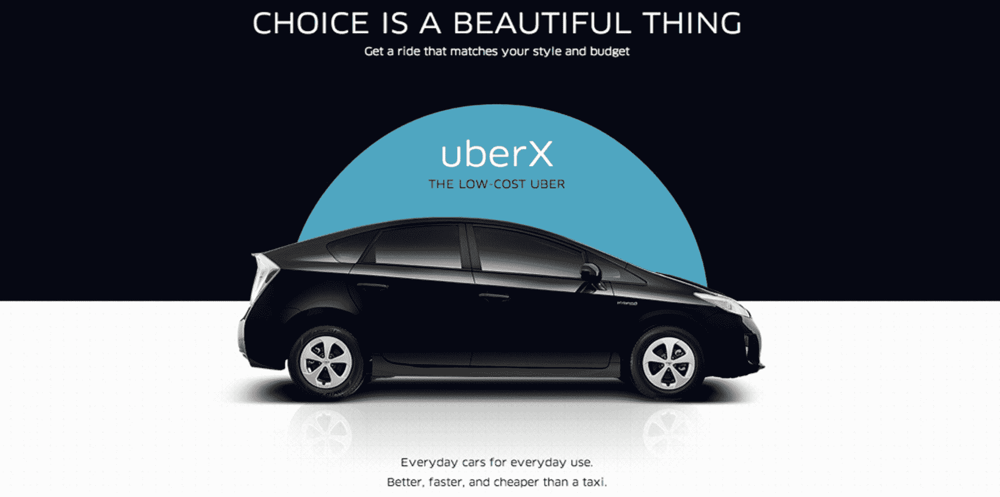

# 创业故事的七宗罪|第一轮回顾

> 原文：<https://review.firstround.com/The-Seven-Deadly-Sins-of-Startup-Storytelling>

*本文由* *[安迪·史密斯](http://andysmith.brandyourself.com/ "null")* *撰写，作者、企业家和顾问，专注于心理学、社交媒体和营销的交叉领域，帮助品牌讲述伟大的故事。*

所以你叫了辆出租车，但是没人来。暴躁的调度员只会说“他 15 分钟后到”你 15 分钟后回电话，他现在说，“司机在路上了。现在任何一分钟。”点击。天冷了，天快黑了，你已经迟到了。如果有一个应用程序可以让你利用闲置的出租车和汽车，带你去你想去的地方，也许还有点风格，这不是很好吗？优步背后的传奇灵感也是如此，这个故事现在被浓缩在一句口号中:“每个人的私人司机”

说到说服，公司传统上求助于左脑——逻辑、定价、规格。然而，情感被证明是更好的营销工具。《驱动力》一书的作者丹尼尔·平克写道，“右脑优势是竞争优势的新来源。”诉诸右脑可以通过将想法和情绪结合起来而进行更深入的交流。最好的方法是:讲一个故事。

也就是说，你讲述公司故事的方式(也应该)与你在派对上讲述故事的方式截然不同。虽然同样的成功技巧也适用，但商业故事经常失败或引起不必要的火灾，尤其是在初创企业领域。你总是看到它。但以我的经验来看，你无法教会一家公司如何讲述它的故事——就像你无法教会一个人拥有某种个性一样。相反，我会告诉你一些大忌。

**1。讲述，而不是展示。讲故事最基本的准则之一是“展示，不要说”——这是有道理的。不要对你的观众说话，告诉他们做什么或感觉什么，而是分享故事，让故事自然地展开，你的观众自己得出他们自己的结论。人们不只是吸收事实和信息。他们积极倾听故事，并实时做出自己的推断。**

当你分享一个故事时，要让你的听众想象故事的背景，描绘主角，并真切地感受他或她所面临的冲突。描述正在发生的事情，就好像事情正在你面前展开。正如马克·吐温所说:

别说老太太尖叫了。带她上来，让她尖叫。

*实践中的效果*:进入你网站上的“关于我们”部分。主要是文字吗？这些信息是纯粹的数据还是你用故事、个性甚至幽默来说明你是谁？

另外，清点一下你用来分享公司故事的工具。做得好，视频是对讲述之毒最强有力的解毒剂。它丰富的视觉和内脏刺激感官的能力，可以快速传达复杂的想法，或强调微妙但重要的差异。

一个重要的例子是 [FiftyThree](http://www.fiftythree.com/ "null") ，一个数字绘图工具的创造者，它与市场上的其他手写笔有很大的不同，特别是它融入了模拟工具的最佳元素。这款名为 [Pencil](http://www.fiftythree.com/pencil "null") 的产品定位为更好的手写笔，独特之处在于它结合了[手掌拒绝](http://9to5mac.com/2013/12/02/paper-by-fiftythree-app-updated-w-palm-rejection-erase-blend-for-new-pencil-stylus-shipping-this-week/ "null")。但是，该公司没有浪费时间解释这个术语，或者 Pencil 有多么优越，而是发布了一个精美的无旁白视频，展示了艺术家实际上用 Pencil 进行创作，并展示了其功能的直观质量。

**2。术语太多。**我们都读过无数的新闻稿，看过充斥着诸如协同、平台、范例等无意义词汇的演讲。它们到底是什么意思？我们轻松地嘲笑亚历克·鲍德温的浮夸人物《30 Rock 上的杰克》,因为他发明了 pos-mens(正面提及)和上行收入流动态等概念，但对于我们行业之外的大多数人来说，我们可能听起来同样迟钝。在众多对史蒂夫·乔布斯的赞誉中，他对简单的强调名列前茅。你必须认识到，是你和你的产品需要适合你的客户，而不是相反。

在[他著名的](https://www.youtube.com/watch?v=YcneYcl23MU "null")思考不同运动的介绍中，乔布斯告诉他的听众，“对我来说，营销是关于价值观的。这是一个非常复杂的世界，这是一个非常嘈杂的世界，我们不会有机会让人们记住很多关于我们的事情——没有一家公司是这样的。所以我们必须非常清楚我们想让他们了解我们什么。”

用专业术语、首字母缩略词和多余的词语来填充一个故事是失去你的听众的最好方法。希波克拉底(医学博士称他为“宣誓者”)写道:“语言的主要优点是清晰明了，没有什么比使用不熟悉的词语更能减损它。”

*在实践中:*在乔布斯的领导下，苹果采用了一种极其简单、人性化的沟通模式。如今，像 [Square](https://squareup.com/ "null") (“在旅途中销售”))、 [Venmo](https://venmo.com/ "null") (“进行和共享支付。”)，以及 [Evernote](https://evernote.com/ "null") (“记住一切。”)使重要的、通常是复杂的功能变得可访问。他们通过为客户填写空白来做到这一点:“我真的想 _ _ _ _ _ _ _ _ _”然后他们做了。

**3。太没有人情味了**。不管你的组织是销售剃须刀、构建云基础设施还是设计医疗设备，人类仍然在推动这一行动。个性化你故事的主角。让她看起来足够真实，这样观众就会对她接下来发生的事情产生兴趣(并想知道)。

人们和其他人联系在一起，所以要确保你的故事聚焦于现实生活中的人物。

[地铁](http://www.subway.com/subwayroot/default.aspx "null")出了名的借机把一个真实的故事变成了纯金。大学生 Jared Fogle 展示了你可以通过地铁三明治减肥一吨。比宣传一系列更健康的新三明治选择更有说服力的是，这是一个真实生活中的故事，一个地铁顾客可以与之联系的人。他用他们的产品过上了更好的生活。他最初在一份校园报纸上发表，随后被当地的赛百味特许经营公司，然后是赛百味的芝加哥广告公司视为一笔资产。贾里德成为了该品牌谦逊但魅力十足的代言人。贾里德的故事作为赛百味的主要宣传活动进行了 10 年——在此期间，销售额翻了一番。

实践中:还有什么比云中的硬盘更私人的呢？几乎任何事，对吗？但俗话说，关键在于你如何使用它。当 [Dropbox](https://www.dropbox.com/home "null") 达到一个大客户里程碑时，他们通过[推出一个网站来庆祝，感谢他们的客户，同时鼓励他们分享 Dropbox 让他们做了什么](https://dropbox100m.com/ "null")。有些人写并保存小说，有些人与远方的祖父母分享婴儿照片，还有些人丢失并找回了他们的荣誉论文——这一切都要感谢 Dropbox。不断滚动的页面充满了客户图像和文本提交，为公司带来了一个全新的层面，最重要的是，它让客户可以相互分享他们最关心的事情。

**4。从头开始。**除非你正在讲述如何安全降落飞机或如何正确组装宜家书架的故事，否则不要急于从头开始。时间顺序远不如让你的故事沿着一条有趣的弧线发展重要。幸运的是，你需要用来吸引人的东西往往不会在早期出现。事件需要在情感上一个接一个地发生，而不是按顺序发生。为了真正影响人们，你的故事应该描述越来越多的风险和越来越多的后果，直到最后不可避免的结论——但不一定是观众期望的那个。

当你想到你想要讲述的故事的元素时，把它们想象成模块，首先在便利贴上捕捉它们，然后把它们混合起来。这个简单的练习会打破你把东西按顺序摆放的压抑习惯。现在，拿着便利贴，像电影制作人一样思考。打开真相时刻。让人感受到。调动感官。然后回到过去，细细品味对比。即使人们知道你的故事是如何结束的——通常是你要求他们购买的产品——你也可以在你如何到达那里的旅程中注入生命，你的其他客户是如何发现你的，以及为什么它有所不同。

在实践中: [美国银行在最近的肖像活动中选择翻转年表](http://www.adweek.com/news/advertising-branding/ad-day-bank-america-148502 "null")。从一对老夫妇一起拍照开始，我们开始追溯这对夫妇的大家庭成立和拍照，通过重大的，往往是具有挑战性的事件追溯到过去。孙子孙女们消失了，成年人变成了孩子，而我们却被留在了起点:一对年轻夫妇坐在沙发上，他们的整个人生都在前面。这种效果令人着迷。一则可能令人生厌、过于伤感的广告被提升了视觉趣味，这是创意和熟悉度的罕见结合，抓住了注意力，温暖了心灵。

**5。缺乏冲突。公司里总会出问题，尤其是初创公司。但是，通过讲述一个关于责任、道歉和补救的故事，搞砸了的事情也提供了展示自己的机会。消费者不仅对乐于道歉的品牌更加忠诚，对不承认错误的品牌的抵制也代价高昂。**

引人入胜的故事并不是通向成功的直线。想象一下，如果洛奇赢了每一场比赛…没有人会看。是怀疑和担忧让我们参与进来。专注于你的主角的问题或实现目标的障碍。是什么阻碍了他？

通过加入脆弱或怀疑的瞬间，你创造了共鸣，并赋予故事真实性。

Lululemon 错过了一个道歉的大好机会，因为它运送了一批，嗯，非常薄的瑜伽裤。当创始人 Chip Wilson 暗示他的[顾客的肥胖大腿是问题的原因](http://nymag.com/thecut/2013/12/sad-lululemon-founder-steps-down.html "null")时，这一失礼行为变得更加糟糕。接二连三的侮辱使得公司最终的道歉被置若罔闻。这一事件导致了公司灾难性的季度亏损和威尔逊的辞职。

*在实践中:*虽然有人指责她反应迟钝，但[玛丽莎·梅耶尔抓住了这个机会，将雅虎的品牌人性化](http://www.slate.com/blogs/future_tense/2013/12/16/marissa_mayer_s_yahoo_mail_apology_we_are_very_sorry_for_outage.html "null")并展示了领导力，同时为上个月大范围的电子邮件中断做出了明确、真诚的道歉。她同情人们和停电造成的问题，并承担责任而不找借口。她甚至对问题本身提出了任何人都可以认同的见解:“不幸的是，停机比一开始看起来要复杂得多……”听到这几句话，大多数人都会想到类似的事情发生在他们身上的时候。共情就是从这里开始的。只有这样你才能康复。

**6。捏造。你的故事需要真实可信。华盛顿的一家大型癌症中心曾询问一位名叫奥德丽的顾客，她碰巧是一名三项全能运动员，他们是否可以在癌症宣传活动中使用她的照片。当公共汽车和杂志广告推出时，让奥黛丽(以及她庞大的朋友、家人和同行运动员网络)大吃一惊的是，她被定位为癌症幸存者。如果特色图片是一位真正的癌症幸存者，这场运动会有多强大？对于每一个认识奥黛丽(或听过她的故事)的人来说，这个著名的机构现在已经永远失去了它的信誉。人们希望听到真实的故事并为之感动。**

一个假故事招致强烈反对。

让故事成为你文化的一部分——更重要的是，成为你文化的一部分。在这里，全体会议可能至关重要。故事通常是讲述一家公司如何运作、人们做得好的地方以及他们可以做得更好的地方的最佳方式。当领导者以透明、诚实和谦逊的方式做到这一点时，他们会让员工对自己的工作感觉良好——即使事情并不尽如人意。

实践:用故事的形式捕捉好的或坏的瞬间，可以将你的员工和你的公司真正联系起来，并增加他们对工作的投入。考虑用故事开始员工会议，而不是进度报告。有几种方法可以做到这一点。当你在房间里走动时，请每个人简要谈论自上次会议以来发生在他们身上的最奇怪的事情，或者一个最令人惊讶的客户故事。有人以新的方式使用你的产品吗？仇恨者变成了信仰者吗？

**7。专有的。那些对自己的公司故事以及谁能讲述公司故事有所束缚的公司正在错过一个充满机遇的世界。他们这样做的时候，社交媒体让联系和分享变得前所未有的容易。员工和顾客讲述的故事是不可思议的，有时是无价的资产。认识到来自内部和外部来源的故事的价值，设计收集它们的方法，让你的客户、倡导者和员工也成为故事讲述者。**

这里的最佳策略是创建一个内部“故事银行”，或故事数据库，员工甚至客户可以在这里编写和提交带有标题的故事。然后，这些故事可以通过关键字进行标记，这样人们在寻找特定的轶事或例子时就可以很容易地找到它们。这也使得浏览客户故事的员工很容易联系到作者。

耐克、苹果和易贝都利用故事作为众包创意的工具——尤其是他们的消费者真正热衷的东西。这样，他们给员工语言和主动性来讲述有意义的个人故事，并以故事的形式放大和传播品牌计划。

实践中:康卡斯特在推特[上开创了最早的有效活动之一，当时它推出了@ComcastCares](castcares "null") 。Twitter 曾经是康卡斯特仇恨的温床，现在却成了他们打造品牌和赢得客户服务的巨大平台。康卡斯特写了一本书，讲述人们如何在社交媒体上讲述负面的客户故事(大谈特谈糟糕的有线电视服务，有线电视工作人员在沙发上睡觉的照片，等等)。)可以被吸收并转化为真实而有力的证明。

一开始，康卡斯特只是在 Twitter 上搜索关于该公司的信息，确认投诉，并在平台上公开处理个人投诉。员工介绍自己的名字(不是匿名的康卡斯特客户服务组织)，并把道歉和真诚的帮助结合起来。康卡斯特很快发现，当一个通情达理的人试图在公共论坛上帮助他们时，即使是最愤怒的人也会停止愤怒。在此基础上，它通过承认自己的负面形象，并明显努力扭转这种形象，建立了自己的战略。

另一方面，摩根大通跳过了这些关键步骤，艰难地发现，当他们[在 Twitter 上推出#AskJPM](https://twitter.com/search?q=%23AskJPM&src=typd "null") 时，他们告诉自己(并希望观众复述)的美好故事并没有火起来。他们错误地判断了媒体和时机，这个他们认为会展示明智的金融建议的标签激起了自最初的占领华尔街抗议以来从未有过的公愤。该公司很快关闭了这项活动，但#AskJPM 作为一个社交媒体笑话和警示故事而存在。**随着内容营销日益成为常态，战术性讲故事肯定会成为一门科学。但是过度简化也有危险。让好故事成功的是使人类成为人类的不可预测的、创造性的、非直觉的品质。突破性的成功不会来自于一步一步指南或操作方法的死记硬背。然而，设计你的策略来避免上面的七宗罪，你就能很好地塑造你自己的声音。**

兜了一圈，回到优步，你可以看到如何使用简洁的文字来传达一个真实的信息，不仅提出了一个问题，而且用不到 30 个词提出了一个有吸引力的解决方案。故事不一定要很长才算伟大。最好的公司倾向于让顾客成为他们的主角。

*作者* *[安迪·史密斯](http://andysmith.brandyourself.com/ "null")* *是一位企业家和创业顾问，他在杜比、英特尔和宝丽来建立了成功的团队，专注于如何执行吸引客户并使其盈利的战略。他也是《蜻蜓效应》的作者，该书被《纽约客》描述为“第一本解释社交媒体、营销和心理学交汇处发生的事情的书”*