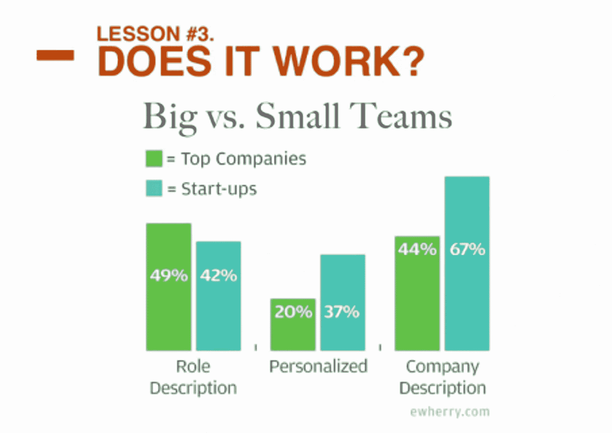

# 382 招聘人员如何追求一个假想工程师的内幕|首轮点评

> 原文：<https://review.firstround.com/The-inside-story-of-how-382-recruiters-pursued-an-imaginary-engineer>

2012 年秋天，在[读到](http://www.ewherry.com/2012/06/the-recruiter-honeypot/ "null") Elaine Wherry 如何建立招聘人员蜜罐后，我们知道我们必须邀请她参加第一轮的 CTO 峰会，告诉我们所有的内幕——所以开始吧。

2010 年， [Meebo](http://www.meebo.com/ "null") 发现自己处于举足轻重的地位:该公司第一次向投资者承诺，它将产生可观的收入。随着团队在每个季度的基础上集思广益，他们很快意识到他们的 web JavaScript 团队应该在 Q1 增加一倍。但是他们面临着一个巨大的障碍。JavaScript ninjas 是唯一一种能够解决本土的、以性能为导向的框架问题的工程师。Wherry 尝试了许多游击方法，但底线仍然是世界上只有非常有限的人拥有必要的技能，大约一半的人已经在谷歌这样的公司工作。

长话短说，Wherry 继续创造了一个虚假的人物，皮特伦敦，他的简历实际上是基于 Wherry 自己的经历。凭借一个[单页网站](http://www.petelondon.com/ "null")和一个 [WordPress 博客](http://www.petelondon.com/blog/ "null")以及一些 JavaScript 参考资料，皮特·伦敦在网络上活了过来。

“皮特·伦敦”项目启动近三年后，皮特收到了来自 172 个组织的 382 名招聘人员的 530 封电子邮件。他得到了 7 台 iPads、1 台 Xbox、1 台 MacBook Air、5 个 1000 美元的推荐现金奖励，随后是 2 个 10000 美元的推荐现金奖励、8 杯咖啡、7 次电话和 6 次午餐邀请。

这是皮特·伦敦的故事和在招聘中吸取的教训。

# 去打游击

几个星期以来，互联网显示皮特·伦敦的虚假简介很少有人喜欢，不是因为他很难找到，也不是因为他的“SEO 很弱”，因为成千上万的垃圾邮件发送者能够找到他的电子邮件地址。但是当 Wherry 在 LinkedIn 上发布了他的个人资料后，流量激增。当时，Meebo 通过这种方式只发现了 5%的工程人才，所以看到如此多的活动令人惊讶。

LinkedIn 是一个过度捕捞的池塘——专注于互联网的其他领域，寻找尚未被外来邀请淹没的优秀候选人。尝试“游击式招聘”——也就是说，从“JavaScript Bingo”到谷歌广告，再到布尔搜索、GitHub、博客评论、学生报纸、Twitter 关键词、meetups、斯坦福 CS 课程、演讲活动等等。它们本质上是产生人才的现成机制，在发现和雇佣优秀人才方面非常有效。

# 重身幽灵！

起初，Wherry 给潜在的 JavaScript 爱好者写了一些冷冰冰的电子邮件，认为她是在与亚马逊、脸书和其他“巨型”科技公司竞争。她认为，强调“惊人的、独特的”创业经历是吸引人们加入的最有吸引力的方式。但皮特·伦敦的实验证明这种方法是错误的:事实上，高达 85%的入站电子邮件来自初创公司——其中大多数人说了完全相同的话(“我们是一家聪明、优秀的文化初创公司，来加入我们”)。

找到一种真正让自己与众不同的方法，确保自己脱颖而出——不是从亚马逊、Facebooks 和谷歌中脱颖而出，而是从所有其他网络初创公司中脱颖而出。

# “管用吗？”

不可避免的是，在初创企业的背景下，当你想要扩大规模时，你将不得不雇佣外部招聘人员。好消息是:它们可以工作。

上面的图表暗示了这些数据——如果你把大公司和小公司的外部招聘人员分开，你会发现小公司的外部招聘人员实际上做得非常好。所以在你能雇佣到自己的招聘团队之前，请放心。

# 非常非常小心

那种认为你得到的帮助越多越好的心态(也就是说，更多的外部招聘者意味着更多的成功)是很危险的。考虑一下，当你邀请外部招聘人员进入你的公司时，你与他们分享了关于你公司的私密细节:组织结构图、财务数据等等。这就把你的公司放在了第一位，特别是你公司内部有什么专长。因此，当他们最终去另一家公司招聘时，你的初创公司可能是他们的下一个目标。

五月一个下午的 2 点 20 分，当皮特·伦敦收到一封招聘人员的电子邮件，要求他考虑一些潜在的工作选择时，Wherry 亲眼目睹了这一点。仅仅 15 分钟后，工程经理 Wherry 就收到了同一个人发来的电子邮件，表示愿意帮助她发现优秀的人才。这位外部招聘人员左右为难:字面意思是，“嘿，皮特，从 Meebo 出来，”然后对工程经理说，“嘿，让我帮你找到优秀的人才。”

每当你与外部招聘人员合作时，确保在合同中明确规定“禁止挖人”的规则，并且非常具体地说明你与哪些外部招聘人员合作。

# 该穿帽衫了

上图不言自明:从 2010 年到 2012 年，旧金山的招聘活动增加了大约 10 倍。

不管你现在在哪里，不管你是刚刚开始确定自己的位置，还是你已经是一家老牌公司，你的旧金山战略都应该清晰地制定出来。

# 建立你的骑兵和击败经理

当你和你的内部或外部招聘人员一起工作时，有这样一个概念，因为他们是招聘人员，他们应该是你的骑兵。他们应该是来拯救世界的人，让你回去花时间做工程和你角色的其他部分。但如果你看看 Wherry 的数据经理，他们在所有招聘活动中一直处于前 40%的位置——比受雇做这些事情的人更好。

最后，如果你想让招聘人员做得更好，确保他们包含三分之二的个性化内容。

确保你以一个专业的介绍开始，这意味着把个性化放在前面:与其坚持平淡的开场白，不如尝试一些具体的东西。

“Pete，鉴于你丰富的前端开发经验，特别是在 JavaScript 方面，我向你伸出援手。您独特的前端和后端知识和经验的结合确实引起了我们现任开发经理的注意。”

典型的开场白如“你的简介给我留下了深刻的印象”、“很抱歉收到这封邮件”和“你好，我的名字是”，并不能真正帮助你脱颖而出，因此是无效的(63%的皮特的邮件看起来非常相似)。

如果你觉得非常懒，有一个方法可以让你的邮件变得更好，那就是看看这个。在你的招聘人员写完初稿后，取出第一句话。就是这样。由此产生的电子邮件通常要好得多。

# 跟进，不要发垃圾邮件

发送给“Pete”的大多数电子邮件来自某个组织，或者来自他之前听说过的招聘人员。但是只有 12%的人承认这是一个后续。

确保你的联系人知道这是你第二次联系，这一点很重要，因为这有助于保持对话历史。作为个人，我们与一个特定的人相处的时间越长，我们感受到的关系就越牢固。

当你对某人说，“嘿，我想看看你是否对这个角色感兴趣，”然后你又对那个人说，“嘿，我想看看你是否对这个新角色感兴趣。我真的对你印象深刻，”这暗示了被忽视的历史，候选人不值得他们浪费时间。这种推广立刻变得不那么真诚，并被解释为垃圾邮件。

# 你，你的，你的

在来自 300 多名招聘人员的数百封电子邮件中，只有五封脱颖而出。然而，事实证明，它们都有相同的线索:使用第二人称。

而不是说，“嗨，我是招聘人员。我们这里有一些很棒的位置。打电话给我，”这更像是“据我所知，你是一个 JavaScript 专家。这会让你的职业生涯更多地转向新媒体内容，我很想更多地了解你和你的兴趣。”

# 不要做我做过的事

Wherry 最初陷入这种困境的原因是因为很难找到这些 JavaScript 专家。一言以蔽之，不要这样！

除了找到好的招聘人员、采用正确的招聘技巧之外，战胜招聘危机还需要雇佣更多的经理，尤其是能帮忙招聘的经理。他们在以非传统方式接触人们方面的网络和专业知识将是有益的，而不是以非系统的方式吸引个人贡献者。

# 最后一条经验法则

解决招聘危机很像任何其他工程问题:你分解流程的每一部分，然后说，“在我们的漏斗中，我们在哪里失去了人？”

一个好的经验法则是仔细检查。一般来说，你的招聘人员应该会从 cold outreach 得到 12%到 20%的回复率。这只是一个很好的经验法则，所以要仔细检查。