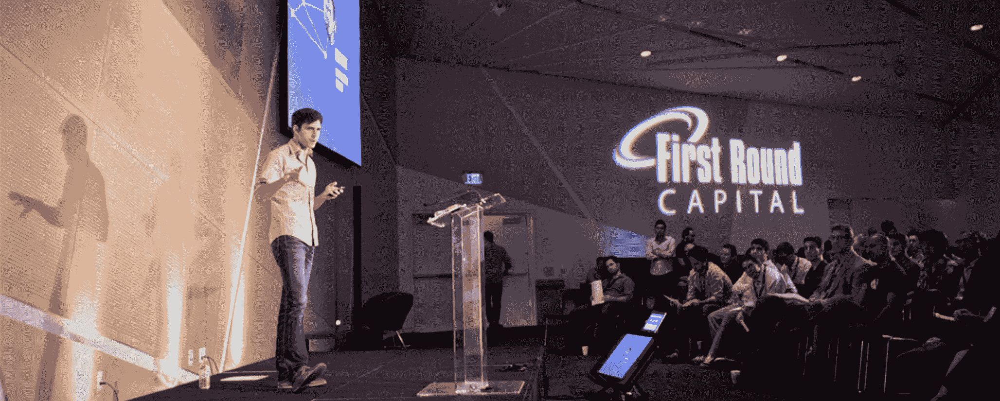

# 为什么 Yammer 认为传统的工程组织结构已经死亡|第一轮回顾

> 原文：<https://review.firstround.com/Why-Yammer-believes-the-traditional-engineering-organizational-structure-is-dead>

[Yammer](https://www.yammer.com/ "null") 的工程副总裁克里斯·盖尔认为，大规模快速建设的关键在于小团队。他探索了工程学中组织设计的复杂性，并解释了如何在成长过程中做出有意识的决策，以确保你不会失去作为一家初创公司的独特之处。在一天结束时，作为 CTO，您的工作是考虑如何组织和优化工程。

**小团队运船速度更快**

在早期，Yammer 团队采用了非常低调的方法。通过更多地关注产品本身，他们没有真正考虑在建立一个更大的组织的背景下招聘。随着公司的持续扩张，他们意识到由于更大的管理费用，每个新工程师的边际生产率增长会随着时间的推移而下降。

与此同时，世界其他地方也意识到 Yammer 正在做大事。初创公司到处模仿他们的产品，甚至大公司也推出产品与他们的产品直接竞争。Yammer 强烈认为，这个领域只能有一个主导者，如果他们不够灵活，就不会是他们。现代 web 应用程序需要敏捷，需要改变。

Yammer 采用了小团队的方法，以便更快地发货。但这不仅仅意味着将你的公司组织成小团队。如果这些团队在任何方面被限制将代码发布到产品中，那么他们就是无用的。他们需要在更大的组织之外自由地完成工作。

**小团队专业化**

在 Yammer 的早期，当团队第一次推出一个特性时，他们通过专业化的方式将它分配给三个工程师。它并不是非常严格，所以如果有大量的 Rails 工作，Gale 仍然会帮忙，即使 Rails 不是他的主要优势。你的目标应该是创建风格相似的小组，这些小组是小型的、专业化的，但不是严格封闭的，因为不同的问题需要不同的专业知识(你应该有不同的经验)。

**串行流程&大型科技公司**

虽然这种方法在三名工程师身上非常有效，但随着 Yammer 团队的发展，他们转向了一种更传统的工程组织设计模型，在这种模型中，每个人都被功能性专业知识所分割。于是就有了后端团队，前端团队，移动团队等。到 2010 年底，该公司从事功能开发的工程师从 3 名增加到大约 30 名。但是他们快了十倍吗？号码

根据阿姆达尔的并行计算定律，在并行计算中使用多个处理器的程序的加速受到程序的顺序部分所需时间的限制。例如，如果您有一个计算(只能并行化一半)，您可以投入 100 个处理器，但速度只会提高一倍。如果你再投入 100 个处理器，你只能得到接近 2 倍的速度。你在计算的串行部分花费了固定的时间。

人们错误地认为软件工程是按照规范编写代码，但事实并非如此。您做出的工程决策也很重要——没有人会带着这种想法建立工程组织。

如果你想象一个典型的中型到大型工程组织，你可能有一个前端团队，一个后端团队，和一个潜在的“中间件”团队。这些团队拥有自己的代码库，每个团队都有一个专属的经理，这些经理向某个老板汇报。关键是组织通常与代码的架构相匹配。

到了工作的时候，高层的经理们必须在他们可以解散和委派工作之前决定要建立什么。然后你会有这样的问题，“后端团队要做什么？”以及“它如何与前端团队对接？”

最终，如果你以上面描述的方式分解工作，高层管理者必须划分任务，然后委派他们，你就做错了。想想吧。如果实际执行代码的人发现了规范中的错误，他或她必须一路向上提出更改，然后必须向下过滤。这是一个阻塞过程，会使产品开发停止。与此同时，组织中不同部门的其他工程师会将此视为变动，因为他们没有与提出变更的工程师密切合作。他们不会理解修订背后的基本原理。

在 Yammer，他们说去他妈的。

**管理层不应做出工程决策**

人们总是告诉你要雇佣比你更好更聪明的人。如果你接受他们的建议，那么你难道不应该相信这些人会做出通常由你做出的决定吗？最终，作为工程领导者，你的工作是建立和培育一个组织。你从编码到专注于组织的转变可能比你想象的要快。

我认为你不应该开发一个产品。我认为你应该建立一个生产产品的组织。

小心不要只相信经理的工程决策。事实上，您应该将这些任务一路下放给个人贡献者。如果当你超过 30 到 40 岁时，只有经理在做决定，那应该是一个危险信号。

**那么，考虑到这一点，你实际上如何构建功能呢？**

当 Yammer 构建特性时，他们的目标是改进三个核心指标中的一个:

病毒式

约会

货币铸造

在更基本的层面上，Yammer 的目标是构建吸引、保留和销售给客户的功能。虽然您的核心指标可能不一样，但您肯定应该从几个关键目标开始，并在整个组织内进行沟通。否则，你不能让公司的每个人都做出好的决策。

在传统组织中，项目经理会提出一个想法，并为其编写一份规范。这是 Yammer 的一种误称。与其为需要构建的内容建立一个严格的规范，不如将一个规范视为一个跨职能团队充分充实它的起点。如果有太多的文字或者已经开了太多的处方，要小心。您应该希望参与其中的工程师理解特性中的决策，以便他们能够以最高效和最有效的方式实现代码。

**两大&十大法则**

Yammer 最大的经验法则是两到十个人，两到十周——这意味着他们一般不做更大或更复杂的项目。项目的复杂性和最后的总结集成阶段之间存在非线性关系。如果超过十周，总结阶段的时间比例就会变得不成比例。

如果你采用二至十原则，它也会迫使你经常放松，测试你的假设，不要在错误上过度投资。这是一种精益创业的心态，如果你打算尝试这样做，你必须在你的组织中将其整理成文。

你必须培养一种紧迫感。通常，非常长的项目会导致工程师失去对最终目标的跟踪。想想徒步旅行吧。你开始感觉很新鲜，你对即将到来的徒步旅行非常兴奋，你走得很快。当你取得进步时，你的身体开始疲劳，你看不到你从哪里开始，也看不到你要去哪里。如果你到了那一步，强迫自己继续前进需要很大的意志力。不幸的是，许多组织将工程师的大部分工作放在了中间阶段。

但是，在接近终点的时候，你可以开始看到你的路的尽头，你会变得兴奋。你迈出的每一步都清楚地向目标靠近。让你的工程师保持这种状态是很重要的，在这种状态下，他们可以测量进度并直观地看到进度。这是保持紧迫感和士气的唯一方法。

**代码所有权**

小心创造代码所有权——以这样一种方式设计你的组织，让人们拥有代码库会产生很多你想要避免的不正当的动机。在 Yammer，组织被分成不同的专业领域。最终，工程师真的很聪明，自我激励，如果你让他们与你的业务目标保持一致，他们会做出惊人的事情(甚至是自发的)。

**确定一个真正工作的团队是什么样子的**

在 Yammer 围绕一个特性组建产品团队之前，他们会更详细地检查一个规范。具体来说，他们尝试并估计进入给定特性所需的工作量。

**以产品 x 为例。**这是一个虚构的功能，它提供了一种在注册流程中邀请朋友的方式，从而增加了病毒式传播。在这个特殊的例子中，公平地说，它的前端很重，所以你可能需要两个 UI 人员。由于您可能需要更改一些注册流程，您需要 Rails 团队中的某个人来编写这些新端点的代码。

一旦您的产品团队就项目的优先级达成一致，剩下的工作就是等待工程师(在本例中是两个前端和一个 Rails 人员)腾出时间。在 Yammer，他们实际上有一个称为“大白板”的大物理白板，上面覆盖着一层网格。一面是董事会列出的项目；在另一个页面上，有一个所有从事特性工作的工程师的列表。有一个明显的物理限制，一个工程师一次只能被分配到一个项目。大板也有助于提供优先权的透明度。每一个工程开发资源都被考虑在内，在任何时候，首席执行官都可以走过去说，“哦，所以*这个*就是工程正在做的事情。”

如果你能够保证完全专注于一个项目，这将大大加快你公司的发展速度。虽然每个人都知道上下文切换有多昂贵，但令人吃惊的是，没有人将它作为一种约束构建到他们的组织中。全神贯注，你建造一件东西，运输它，然后就能转移到其他东西上。

**但是谁来修复这些漏洞呢？**

每个人都在开发特性，谁有时间处理 bug 挤压？在 Yammer，他们只是建立了更多的跨职能团队来处理这一职责。他们从 Rails 团队、前端团队、移动团队等中抽调一些人。然后说，“你的工作是处理所有进来的 bug，并按照我们的清单工作。”这是一个临时的工作(就像所有面向项目的团队一样)，人们在其中轮换。这种组织结构使他们能够以一种不妨碍功能工程的方式处理支持。

它也没有创造出第二类工程师。与简单地告诉一群初级工程师去修复一堆错误相反，他们也让高级人员参与进来。这是非常有意的:当您修复 bug 时，您希望人们能够修复问题的根源，而不仅仅是为了一张离开的罚单。如果有必要，高级人员应该感到被授权重构代码。

这个系统也在构建特性的人和修复 bug 的人之间建立了一个反馈回路。当人们看到错误的频率和类型时，它有助于通知关于产品工程前进的决策。