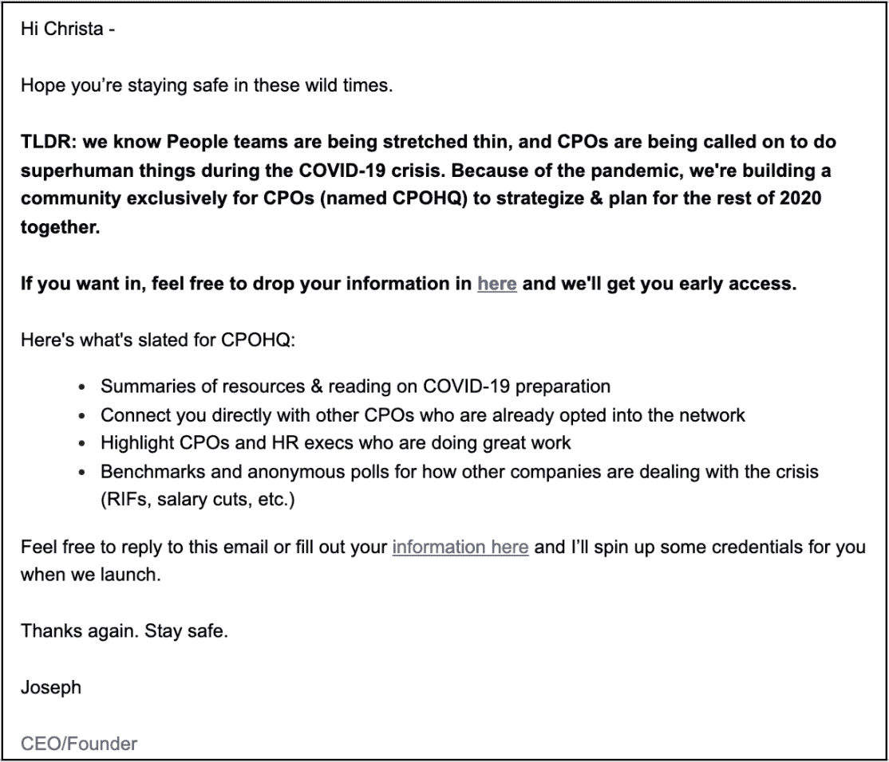
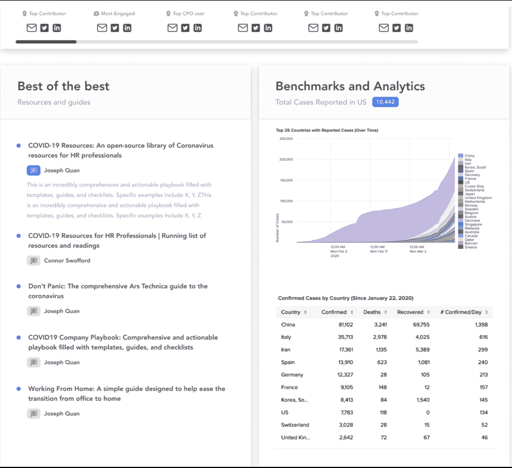

# 创始人的一步一步指南，让你的第一个 1000 社区成员|第一轮审查

> 原文：<https://review.firstround.com/a-founders-step-by-step-guide-to-getting-your-first-1000-community-members>

## 介绍

寻求牵引力是每个创始人的困扰，尤其是在早期。和他之前的许多初创公司创始人一样，创始人&首席执行官 **[约瑟夫·全](https://www.linkedin.com/in/josephquan/ "null")** 在寻找产品/市场契合度时遇到了困难。他之前的公司专注于人力资源分析，刚刚经历了一次完整的团队重建，失去了几个关键客户，现在只剩下六个月的时间了。然后，最重要的是，2020 年 3 月到了。“突然间，没有人再对人物分析感兴趣了。潜在客户不在乎，客户也不在乎——他们只是想知道如何应对 COVID 的生存威胁。他们需要为裁员做准备吗？我们正在进入一场持续多年的衰退吗？”全说。

随着对该产品的销售兴趣直线下降和跑道收缩，全全力以赴，将整个公司转向他现在称之为护城河的社区。围绕社区还有很多误解，尤其是在公司创建的早期阶段。这是一个模糊的概念，有各种不同的实现，从运行一系列事件到启动一个 Slack 组，再到在你的站点中构建一个评论区。大多数创始人认为社区是在找到产品/市场契合点后，作为一种事后想法而加入的东西。

作为创始人的早期，全也有许多同样的疑虑。但随着 Knoetic 在 2020 年 3 月陷入困境，他决定尝试一种不同的方法，并建立了一个旨在帮助首席人事官应对 COVID 危机的社区。这是一个成员非常少的简单服务:只有 25 名人力资源主管聚集在一起，分享关于[疫情响应](https://review.firstround.com/the-founders-field-guide-for-navigating-this-crisis-advice-from-recession-era-leaders-investors-and-ceos-currently-at-the-helm "null")的最佳资源，转移到[远程工作](https://review.firstround.com/struggling-to-thrive-as-a-large-team-working-remotely-this-exec-has-the-field-guide-you-need "null")，以及他们的公司在 2020 年将面临的所有其他新兴挑战。

“在我建立社区之前，作为一名企业家，我的视野非常狭窄。我曾想过建立一个只给你数据和数字的分析工具。但这只是等式的一半。首席人事官需要的不仅仅是自己公司的数据和指标，他们还需要知道公司外部发生了什么。我们行业的顶尖公司都在做什么？最佳实践是什么？谁为此建立了最好的剧本？这些问题只能通过召集专家来回答。这就是社区发挥作用的地方，”他说。

在接下来的 12 个月里，这个想法的核心演变成了[全球最大的超高速增长的首席人事官网络](https://www.knoetic.com/cpohq "null")(现在称为 CPOHQ)，成员包括来自 Roblox、Glossier 和 Figma 等公司的 1000 多名高管。Quan 将社区的魔力归功于单枪匹马帮助 Knoetic 取得胜利，包括在不到两周的时间内筹集了 A 轮资金，将 100 多名首席人事官带到了他们的 cap table 上，解锁了他的团队应该建立什么功能的实时脉冲，并在 2021 年期间将他们的业务增长了 400%以上。

社区从你召集的人开始重塑你的创业——而不是你脑海中想象的产品原型。

在这次独家采访中，全提出了社区必须由明确的文化原则驱动，以及为什么值得早期投资以拉近与客户的距离，而不是一旦达到规模就尝试的东西。他还把两者之间的点连接起来，“嘿，也许我们可以试试这个社区？”为高管层的创业领袖经营一个热门社区。在这一过程中，他概述了获得首批 1，000 名社区成员的分步指南，包括验证想法、与客户一起制定路线图以及衡量成功与否。他还指出了每一步可能会让你偏离方向的一些坑洼。最后，他概述了他的剧本，使用社区增压你的筹款，销售和产品倡议。让我们开始吧。

# **第一步:运行一些廉价的测试，做你的“社区发现”，并建立一个楔子。**

## 1A:进行最便宜的测试:电子邮件活动。

2020 年 3 月，全最完美的 Knoetic 计划被颠覆，他设计了一个快速测试来验证几个不同的想法。“我们安排了几个针对 CHROs 的出站电子邮件活动，宣传我们正在考虑建立的不同想法:一个帮助分析裁员影响的工具，一个远程工作效率套件，以及一个针对 CPO 和 CHROs 的专属社区。我们还没有造出任何东西，但我们知道我们可以在一个月内造出任何东西，”全说。“我们的想法只是为了证实我们对新方向的需求。事实证明，宣传我们社区理念的电子邮件活动获得了比我一生中写过的任何电子邮件都高的参与度。大约 40%的 C-Level 高管回复了我们的邮件。很明显，我们有了一个赢家。”

An example email

但要建立一个有持久力的社区，全需要挖掘市场中缺失的东西。在五天的冲刺中，他采访了十多位首席人事官，询问他们已经加入了哪些网络，他们喜欢哪些网络，以及 Knoetic 如何才能建立一个真正与众不同的社区。“我知道已经有很多人力资源社区了，为什么他们没能服务好这些 CPO 受众呢？通过进行社区发现，我能够为我们发掘出一些核心优势，”他说。“尽管听起来很简单，但通过坚持这些原则，我们能够在 CHROs 和 CPO 方面与其他现有网络拉开距离。”

很多时候，当创始人创建一个产品或社区时，他们不确定谁会被这个想法吸引。这是一个错误——要非常具体地说明你在为谁工作。

凭借在发现过程中获得的深刻见解，Quan 区分社区的指导原则变成了:

定义你的社区适合谁，更重要的是，不适合谁。“我们从第一天开始就说，每个公司只有一个人/人力资源主管，我们永远不会改变。不幸的是，许多社区未能坚持这一原则——你从一个专门面向 C 级高管的社区开始，他们倾吐心声，分享他们最个人化的挑战。一年后，所有的直线经理都会问一些不那么战略性的问题。不久，你会遇到一群新员工，他们会问一些入门级的问题，比如“我如何安装一个新的人力资源系统？”或者“我如何写工作申请？””全说随着时间的推移，你最终会失去这个让你的社区与众不同的灼热灰烬，因为你的原始成员不再相信这是一个他们可以与其他高管进行战略性、诚实对话的地方。我们非常严格地规定了谁可以进来，以及我们不得不友好地拒绝谁。这种对会员标准的严格关注可能会对您的会员资格设置上限，但为了获得更高质量的对话，这种权衡是值得的。"

**让会员轻松找到他们需要的见解。**“我在我的社区发现中注意到，无数首席人事官提到他们对现有网络的‘知识管理’感到多么沮丧。他们不断看到同样的问题被一遍又一遍地问，这阻碍了他们分享自己的智慧——他们知道自己的答案会在几天后再次丢失。这进而打击了现有 CHRO 社区的参与度。我们从第一天开始就知道，Knoetic 需要过度投资于构建技术基础设施，以使搜索、内容标记和索引变得极其简单。我们还需要雇用一个编辑、社区和审核团队，几乎就像一个看门人一样，手动向社区成员提供最好的内容，”Quan 说。

**在一个独立的应用程序上下大赌注，而不是一个 Slack 或电子邮件组。**“我们的队伍分成了两个阵营。一些人想从创建一个 Slack 或 email 群开始，理由是他们加入这个群的摩擦很小。我反思了我加入几十个 Slack 小组的经历——他们*容易加入，但同样容易忘记。我的直觉告诉我，我们想要一种更有粘性的产品，”全说。“我也不希望第三方应用阻碍我们开发定制功能的长期目标。我们讨论了利弊，决定创建一个独立的体验**，**从一开始就为我们的社区构建一个完整的 webapp。要让人们养成使用应用程序的全新习惯，举证的负担要高得多。但只要我们抓住了价值定位，社区成员就能证明加入新应用的摩擦是合理的。”*

加入一个松弛社区的摩擦低，但遗忘一个松弛社区的摩擦也低。我们希望建立登录新应用程序的肌肉记忆，一个独特的网址，并致力于创建一个社区来证明这一新习惯。

**这一步要避免的错误:**“在你社区努力的早期，你必须让创始人参与进来。试图从第一天就外包社区是一个大错误。你需要创始人的认同和热情，才能打造出经得起时间考验的东西，”全说。

# 第二步:打造一个斗志昂扬的 MVP，并赢得建造更多 MVP 的权利。

在客户发现阶段投下了巨大的信任票，并明确了如何与现有社区区分开来，Knoetic 团队[进入了 hyperdrive，以建立一个 MVP](https://review.firstround.com/dont-serve-burnt-pizza-and-other-lessons-in-building-minimum-lovable-products "null") 。“对于回复我们最初的广告邮件并表示对社区感兴趣的每个人，我们都将他们列入了等候名单。许多公司进入等待名单模式，一年后才推出产品，但我们没有这种奢侈。我们在一个周末就完成了产品的第一个版本，”全说。

Joseph Quan, Founder & CEO, Knoetic

## **子步骤 2A:手动填充 MVP 中的空白。**

他将工程团队转移到专注于建设社区的地方，尽管他有一个宏伟的长期愿景(如算法推荐、现场活动和社交连接)，但全承认，该产品的第一个版本还有很多不足之处。“这是一个非常糟糕的 MVP。你甚至没有能力和其他成员交流。它只是一个静态的单页资源。他说:“我亲自整理了关于 COVID 的对首席采购官有帮助的最佳资源，并把它们发布在论坛页面上。“在最初的几个月，它是关于创造一个真正有价值的单人游戏体验。你可以进入这个“社区”,找到由我和其他成员编辑的最及时的大流行相关资源。它有几百篇文章，一个跟踪 COVID 案例的仪表板，以及我们能找到的所有法律指南。它非常好斗。”

An early version of the CPOHQ community homepage.

当你从零开始构建一个社区的时候，你并不需要所有的部分。你只需要提供足够的价值来赢得进入下一步的权利。

这种单人游戏方式吸引了最初的 50 名左右的每周用户，这些用户是从最初的电子邮件活动中注册的人和推荐其他首席采购官的成员的组合。Knoetic 团队部署了一些策略来保持这些早期用户参与和登录社区。“我们每天都用新文章手动更新内容。Quan 说:“我们希望这里成为一个中心，让我们养成在我们的 CPO 社区花 5-10 分钟获取 COVID 新闻的习惯，而不是去 CNN 或其他任何地方获取新闻。

## **子步骤 2B:打造一列炒作列车。**

他还用定期的电子邮件提醒来推动登录。“我们每周会发送 2-3 封电子邮件，提醒人们有新的内容更新或新成员加入社区。我们一直在积聚动力。我们总是想引起这样的反应，‘哦，哇，又一个杰出的首席采购官加入了。他们必须在这个社区看到一些东西，否则 Credit Karma 的领导不会在这里。它有助于建立这种势头，信誉和欲望的持续滚雪球，”全说。

**这一步要避免的错误:**“确认需求，快速建立你的 MVP，但要知道建立一个持久的社区需要时间。耐心点。一个社区和一个市场有同样的冷启动问题；我们的思维模式是将我们的社区视为一个思想、问题和答案的市场。请记住，从冷启动到在社区中获得牵引力需要 3 个多月的时间。如果你期望一夜之间就有结果，你会太容易放弃。这必须是一个长期的承诺，”他说。

# **第三步:敲定你的入职计划，确定你的超级用户，并扩大规模。**

虽然这个社区本身很简单，但早期的[入职体验是高度接触的](https://review.firstround.com/between-sales-and-product:-building-out-self-serve-and-customer-experience-at-notion-and-dropbox "null")。“我亲自加入了第一批 50 名成员。他说:“我们会在一个电话上聊上 30 分钟，我会向他们介绍社区中的每一项功能，以及如何使用它们。

## 子步骤 3A:建立一个持续学习的引擎。

Quan 还利用这个机会深入社区成员，着眼于产品的后续版本。“我带着好奇心打了每一个入职电话，”他说。“‘你最喜欢的特征是什么，你会剪下什么？在 1-10 分的范围内，你会给我们打几分？什么能让我们得到 10 分？让你每天都回到这个社区的一个特征是什么？让我们想象一年后，这个网络以失败告终，你认为它失败的原因是什么？"

作为一个例子，Quan 一再听到社区成员希望能够列出他们的首要任务，这样他们就可以根据这些目标获得提醒和个性化的内容推荐。这个“优先级”特性在 Knoetic 路线图中名列前茅。

An example of CPO Priorities feature in CPOHQ.

他还密切关注他认为最有可能成为超级用户的成员。“这是关于找到那 10 个只相信愿景的人。任何初创公司都是如此——你试图找到前 10 个测试客户或设计合作伙伴。社区也不例外，”全说。“在我们的入职电话中，我会解释我们的愿景:建立一流的 CHRO/首席人力资源官网络，开发现有最大的关于如何运营战略性人力资源职能的行动手册汇编，等等。当时我们只有几十个成员，这似乎有些牵强。但我找到了那些真正认同这一宏伟愿景并希望成为其中一员的人。最终，许多社区成员甚至成为了公司的投资者。”

## **子步骤 3B:用内容播种社区，激活你的超级用户。**

为了给社区一个启动，他拉出了一些众所周知的跳线电缆。“在成功之前，我们不得不稍加伪装。我会 ping 我们认为是超级用户的 CPO，让他们发布我找到的文章或资源——甚至为他们起草帖子，让他们的生活更轻松。当你最终接触到十几个一遍又一遍发帖的积极参与的成员时，实际上最终会有机地刺激社区其他人的行为。然后你就不用再督促别人了——这只会成为一种根深蒂固的习惯，”他说。

虽然如今社区的发展已经超出了 Quan 的能力范围，无法接纳每一个新成员，但 CPOHQ 仍然保持着个人风格。“我们现在已经建立了以产品为导向的入职培训，在这里您有一个引导式的走查和一个清单，上面列有我们希望您在第一周完成的不同行动，例如提出您的第一个问题、回答您的第一次投票或分享您的第一部行动手册。最重要的是，我们仍然在社区团队中有人手动操作每个人，所以我们从第一天起就与新成员联系并提供白手套礼宾服务。这对我们的成功至关重要，”全说。

这也是入职流程的一部分吗？“甚至在我们建立社区之前，我就写下了我所设想的我们要实践的所有原则。他说:“每一个加入这个社区的人都必须签署一封信，承诺遵守这些原则——保密、慷慨分享你的知识，并成为一个终身学习者。

CPOHQ Founding Principles

Joseph Quan's letter to the CPOHQ community.

**这一步要避免的错误:**“你不能为所有人做一个社区，否则你最终会为任何人做。Quan 说:“我们非常坚持对谁能进入社区和谁不能进入社区设置非常高的标准，这对我们的长期成功至关重要。“要明确的是，我分享的剧本是为了建立一个由一个领域的 1000 到 10000 名世界顶级从业者组成的专属社区。它不适合为广度进行优化的平台，比如 [Reddit](https://review.firstround.com/What-to-Learn-from-the-Man-Who-Managed-Reddits-Community-of-Millions "null") 或 Quora。”

# **第四步:超越你的 MVP，进行实验。**

## 子步骤 4A:继续运送！

即使有了 CPOHQ 公认的最基本的单人模式社区，该团队还是设法建立了一个至少每周登录 40-50 次的用户群。社区路线图的第 3-9 个月致力于建立过多的社交功能——从类似 LinkedIn 的 feed 到群体投票，再到成员可以提交和分享他们每个月找到的最佳文章的共享“图书馆”。

一旦一个社区达到一定的规模，通常会期望新的特性得到有机的发展。但是建立社交功能意味着团队需要从他们早期的剧本中抽出一页来加强这种新的行为。“这是一场艰苦的战斗，”全承认。“我需要给所有这些首席采购官发电子邮件，鼓励他们在社区中提出问题。然后，在某一点上，有东西点击了，我不再需要让人们张贴问题——他们会自动这样做。”

但是另一个问题出现了。“我们有很多问题，但没有人回答。所以我不得不手动催促用户回答他们同伴的问题。经过几个月的磨砺，问答行为才在社区中根深蒂固。现在，每周都有几十个问题从人们的头脑中有机地流出来，甚至有更多的答案在社区中流动，”全说。为了确保持续的参与，他的团队部署了一系列工具，包括发送自动通知、共享精选的顶级内容摘要，以及雇佣专门的“社区成功经理”。"

你在社区中加入的每一个新动作，都需要大量的跑腿工作、推动和提示才能让你的社区成员效仿。

CPOHQ 团队还利用他们的社区成员来帮助制定下一步的路线图。“在构建社区的第一年，我们每周都会与我们的成员举行一次反馈会议。来自这些会议的反馈之一就是主题讨论的想法。他说:“有机会和 10 个左右的其他首席采购官在一个较小的小组里坐下来，讨论一个小时，比如说，你最棘手的 DEI 挑战或最棘手的薪酬问题，然后集体讨论解决方案。

因此，该团队开始尝试小型圆桌会议:“我会在电话中安排一名记录员，我们会召集顶尖的首席采购官或首席风险官，集体讨论他们重返办公室的时间表、他们的薪酬哲学、他们的分析策略，或者任何他们想到的东西。这些会议创造了大量的智力资本。我们将笔记浓缩成剧本，与社区中的每个人分享。“这个小小的创意已经成为 CPOHQ 社区的一个巨大的价值主张，并演变成更大的事件，”Quan 说。

但就像任何早期产品一样，这并不意味着这个阶段的每个实验都会取得令人振奋的成功。“会员们一直要求我们进行基于兴趣的分组。因此，与每个人分享问题和资源的这种宏观反馈不同，你应该有一个多元化、COVID、B2B SaaS、高速增长等主题部分。这是因为它把讨论从主要来源转移到了更小的群体。当时，这个社区还不够大，不足以支持这些小群体——我应该听从自己的直觉，我们还没有准备好，而不是仅仅因为人们的要求就建立它，”全说。

但是仅仅因为一个实验失败了一次，并不意味着它不值得继续下去。“MBA 项目在这方面做得非常好，你有一个 1000 人的班级，然后你被分成更小的小组。通过这样做，你能够保持和扩大亲密关系，同时也扩大了关系网。因此，我们的群组实验在 200 名成员时没有意义，但现在我们已经超过了 1000 名成员，我有兴趣再次尝试，”他说。

## 子步骤 4C:考虑怎样才能创造“七星”体验。

全还借用了 Airbnb 创始人布莱恩·切斯基(Brian Chesky)的一个框架。在采访中，切斯基经常谈到七星体验的概念。Quan 说:“如今，五星级只是您的客户期望的底线，它是关于寻找那些机会来推动客户体验超越这些基线期望。

那么，从社区而非度假租赁的角度来看，这是什么样的呢？“我们希望从您加入社区的那一刻起，就为您创造个性化的礼宾体验。我认为我们做的一件非常特别的事情是，我们确保向社区提出的每一个问题都能在至少 24 小时内得到答复，”他说。原因如下:“如果你向社区提出一个棘手的问题，却没有得到任何回应，那种经历会一直伴随着你——这很尴尬。因此，如果我们的社区成员都不附和，我们团队的一名成员将花一个小时在互联网上搜索，为该成员的问题编写一份行动手册。无论发生什么，我们需要每个加入的人都感到受欢迎。”

但这里要提醒一句——不要只看会员来告诉你创造七星体验的机会。“通常情况下，社区成员只是期望最低限度，他们真的不擅长告诉你七星是什么样子。这必须是创始人或团队驱动的——你是那些考虑社区 24/7 的人，考虑你可以拉的不同杠杆来惊喜和愉悦，”全说。

在这一步要避免的错误。“测试很重要，但是考虑到确保功能采用所需的努力，以及您将从社区成员那里获得的建议数量，您需要考虑如何执行。开发一个框架来区分特性的优先级和测试过程，而不是试图为每个人做所有的事情。此外，我们对社区的许多核心赌注来自我自己对我们前进方向的北极星&愿景——而不是来自探索电话。这是一种微妙的平衡，就像产品制造一样。”

# **第五步:衡量重要的事情，支持你的团队。**

就像您可能创建的任何产品一样，密切关注指标是至关重要的——注意您是在正确的时间跟踪正确的基准。“您所处的每个阶段都有一套不同的指标，您是处于验证、增长还是参与阶段？”全说。以下是他跟踪的 CPOHQ 每个阶段的一些指标:

**验证阶段:**“这是关于跟踪人们是否被你的想法所吸引。邮件打开率和邮件回复率是多少？申请率是多少？激活率是多少——人们在创建账户后还会登录吗？”他跟踪的漏斗指标包括:

电子邮件活动打开率:人们打开电子邮件是在为你的社区产品做广告吗？

**电子邮件活动响应/选择加入率**:有多少人书面表示有兴趣加入？全给这些人发了一份申请表。

**社区申请率**:实际填写申请的有多少？

**社区接受率**:“当你在建立一个更具排他性的社区时，这一点很重要，就像我们在 CPOHQ 所做的那样。我们正在跟踪申请的数量和质量，因为我们希望确保我们对谁将为社区对话做出贡献具有战略意义，而不是盲目接受任何人的申请，”Quan 说。

**激活率/第一周登录数**:一旦获准加入社区，有多少人是第一次登录呢？

**成长阶段:**“很明显，成长阶段就是成长。你真正看到的是我们每月增加 50，100，200 名会员吗？因此，我们跟踪的指标是有意最小化的。”它们可以归结为两个关键绩效指标:

**妈妈成长**:全给自己定了一个月增长 10%的目标，但你自己的目标将取决于你的社区目标。

**WAU 占总用户的百分比**:“除了跟踪每月的增长，我们还想确保当我们增加新成员时，每周活跃用户不会急剧减少。当你处于增长阶段时，如果每周活跃用户下降 5%，你不会想太多。但如果它开始下降 15%或更多，你就得开始密切关注，”全说。

**参与阶段:**“在建立这个社区之初，我们假设这将是至少每周一次的积极习惯。如果我们成功地完成了建立一个知识和学习社区的使命，那么成员们应该至少每周参与一次。但是我们最近开始更关心日常活跃用户，因为我们已经赢得了深入他们日常工作流程的权利。你是如何继续为你最热情的成员服务的？”

**周活跃用户**

**日活跃用户**

**DAU/WAU 比率**

**创造的知识:**“我们跟踪提出的问题、回答的问题以及其他应用内活动的数量，并将它们组合成一个衡量社区中产生的所有知识的单一指标，”全说。

## **子步骤 5B:精心打造团队。**

从人员配置的角度来看，由于在轮换过程中资源紧张，Quan 在头六个月担任了社区的实际负责人，然后将大部分份额移交给他的办公室主任。直到创建 CPOHQ 近一年后，他才开始第一次专门的社区招聘。Quan 说:“我本可以提前在社区招聘，而不是将其移交给我的办公室主任，但我没有钱，所以这更多的是一种必要性，而不是结构性需求。”。

对于拥有一个一直在默默运转的社区的其他创始人，以下是他对支撑你的资源的建议:“当你考虑建立你的社区团队时，想想要做的工作。对于 CPOHQ 来说，JTBD 包括内容创建和管理，促进成员之间的社交连接，以及一般的社区运营和分析，”Quan 说。“花时间概述您所在社区的 JTBD，以及这些如何与团队中的现有成员保持一致，这将更清楚地说明任何差距。”

**这一阶段要避免的错误**:“科技公司有一些著名的基准来决定用户是否会发现产品的价值。对脸书来说，是接近你的前 10 个朋友。在 Twitter 上，它关注了 7 个账户。仅仅跟踪社区成员的数量是不够的——你必须找到自己的衡量标准，这是长期保持的最佳指标，无论是下载资源还是询问他们的第一个问题，等等。第一印象对你所在社区的未来至关重要。”

# **第六步:收获回报，利用社区为公司增压。**

在花了一年半的时间不懈地建设社区后，Quan 回到了他的根本——构建分析软件。“随着 COVID 的强度稳定下来，很明显，CPOHQ 社区仍然是我们公司产品的重要组成部分，但它变得更加自立，”他说。

有了社区成员提供的关于构建什么的灵感源泉，他意识到他想要构建一个他称之为“全脑产品”的东西。“在我们的产品中，大脑的左半球是分析引擎。这使您能够做出冷静、数据驱动的决策。它的工作原理是将数百万个数据点合成为度量标准和对团队的洞察力。但最终，这些人的问题的答案不能仅仅归结为一页纸上的一串数字。解决人际问题需要情商、远见卓识和他人的智慧。这就是我们产品右半球的用武之地，”全说。

“右脑就是社群，CPOHQ。这是讨论，这是头脑风暴，这是想法分享，这是来自世界上最聪明的首席人事官的数千个想法的融合。我们开始考虑构建分析和数据工具，现在我们却意外地为首席人事官构建了第二个大脑。这就更有价值了。“社区改变了我们的一切，因为它已经融入了公司和我们产品的 DNA，”他说。

考虑到这一点，以下是 CPOHQ 社区如何推动 Knoetic 成为一家公司。

“当我们开始为 Knoetic 筹集资金时，我们的 CPOHQ 社区中有数百名 CPO。Quan 说:“我怎么强调这对于的筹款活动来说都不为过。“我们的 A 轮主要投资者来自我们社区成员的热情介绍。几十名社区成员进行了令人难以置信的反向沟通，加速了我们的融资。”

一旦你在房间里(或变焦)进行推销，你就有一大堆数据可以依靠。“展示成百上千的人正在加入一个你从头开始建立的社区，这比一个人拿着一些客户报价和一个右上的假设图表更有说服力。你突然创造了一大批积极的推荐人，他们参与了你的建设，投资者可以去和他们交谈。“这是一个不可思议的工具，大多数创始人的武器库中都没有，”全说。

如果你后来选择了创业路线，你来自社区的证明点会让你的筹款之路更加顺畅。

Quan 和 Knoetic 团队没有在地下室开发分析产品，而是直接了解首席人事官们最关心的问题。“当客户和潜在客户与你坐下来谈的时候，他们并不总是能够清楚地说出他们想要什么。或者，正如“妈妈测试”告诉我们的，你经常没有问正确的问题。“但当你能够促进同事之间的有机对话时，你可以发现不断重复出现的模式。在 CPOHQ 社区和我们的现场活动中，人们深入探讨对其业务至关重要的各种主题，包括薪酬理念和重返工作岗位。如果没有这个社区，我们就无法深入了解潜在分析客户的需求。”

成功的企业总是那些最接近客户的企业。以客户为中心意味着深入理解他们的问题——不仅仅是他们如何与你的产品互动。这些是社区提供的重要见解。

## **子步骤 6C:加速销售。**

获得客户是每个初创公司创始人不懈的努力，尤其是在开发产品的早期阶段。但说服潜在客户刷卡购买一项相对未经证实的服务通常是一场艰苦的战斗。对于全和 Knoetic 团队来说，这个社区是一个可以依靠的无价证据。“当我们推出 Knoetic 的分析产品时，我们不能宣传我们有 500 名客户，但我们可以宣传我们在社区中有 500 名领先的首席采购官，这为我们正在销售的实际分析产品创造了一种光环效应，尽管他们当时仍然非常独特。这创造了很多可信度，”全说。“最重要的是，因为如此多的首席人事官每天都在使用 Knoetic 的社区，他们开始浏览我们的网站和应用程序，引导他们有机地发现分析产品。他们会直接联系我们，询问如何购买我们的 SaaS 产品。”

为了结束我们，全向亚当格兰特借钱。“作为创始人，我的个人哲学是，建立一家持久公司的最佳方式是首先为你周围的每个人创造不可思议的价值。我不相信交易式的，针锋相对的关系。我相信你把许多善意和价值无偿地奉献给了这个世界，它会以不可预测的、偶然的方式回报给你。是我以前的教授(也是天使投资人！)亚当·格兰特说教。对我来说，社区是我以非交易方式为他人创造大量价值的一种简单方式。他说:“我希望每个会员都能感觉到，他们正在享受一年支付 1 万美元的专属会员资格，而且完全免费。

“通过建立 CPOHQ 社区，我们与世界上一些我最喜欢的首席人事官建立了令人难以置信的关系。但更令人满意的是看到这些人彼此建立关系——从获得更大的角色，到就一些最棘手的挑战交换想法，到慷慨地开放自己的剧本供他人学习。这就是我们社区的全部，”全说。