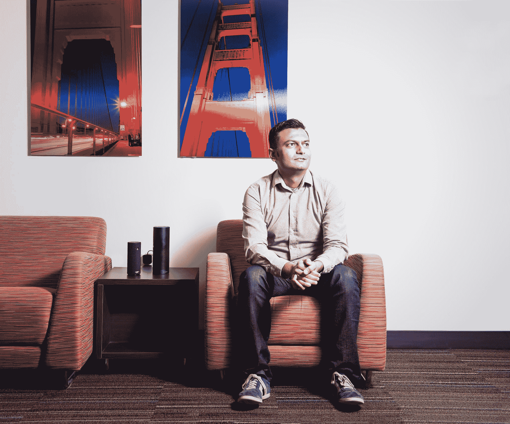

# 亚马逊让产品更无缝的摩擦扼杀策略|首轮评论

> 原文：<https://review.firstround.com/amazons-friction-killing-tactics-to-make-products-more-seamless>

金坦·布拉姆巴特 10 岁生日的前一天，他熬夜到很晚，兴奋不已，所以他可以打开他的礼物。撕开一个包装后，他欣喜若狂地发现里面有一辆鲜红色的遥控玩具车。Brahmbhatt 把汽车放在地板上。他脸上带着微笑，慢慢向前移动操纵杆。

赛车不动了。

事实证明，这个玩具没有电池，家里也没有。在那个时候，没有办法得到他们。在 Brahmbhatt 住的地方，没有商店营业到很晚。泄气失望之余，他上床睡觉了。

这是 Brahmbhatt 最早与他所谓的摩擦——任何妨碍客户和任务的东西——发生冲突。换句话说，它是阻止用户尝试或使用产品或服务的任何障碍。自从赛车旋转失败后，Brahmbhatt 建立了一个基于消除技术摩擦的职业生涯，通常是以非常创新的方式。在亚马逊，他帮助开发和定义了[亚马逊音乐](http://amazon.com/unlimited "null")订阅服务和 [Alexa](https://en.wikipedia.org/wiki/Amazon_Alexa "null") 音乐背后的产品战略，该公司智能扬声器 [Echo](https://en.wikipedia.org/wiki/Amazon_Echo "null") 背后的语音识别技术。他之前还负责该公司的“IMDb 无处不在”项目，该项目制作了“X 射线”功能，可以自动提示观众在任何给定场景中的演员姓名。在此之前，他在微软帮助开发了 Skype for Business。

在这次独家采访中，Brahmbhatt 将带我们了解如何通过监控顾客购买产品过程中的各个步骤来发现和预测摩擦点。他分享了产品体验的三个阶段，客户在这三个阶段最容易产生摩擦。Brahmbhatt 还介绍了减少摩擦的策略，或者，如果不可避免，如何掩盖摩擦。

# 定义摩擦

摩擦可以以多种方式表现出来，从过于复杂的注册程序到难以导航的菜单。根据 Brahmbhatt 的说法，有三种类型的摩擦:

**因不熟悉而产生摩擦。**当客户不知道如何使用你的产品时，他们第一次使用你的产品的经历自然会产生摩擦。这是推出新产品时要克服的最大障碍之一。

**设计摩擦。**有时候，你不得不有意在产品中制造摩擦。如果你的产品有一个学习曲线，你必须深思熟虑地设计这种体验。

**因与人类行为不一致而产生的摩擦。**这就是设计会反咬你一口的地方。放置不当的应用程序控件，未能预测消费者将如何使用产品，以及设计不当的导航工具都会导致这种情况。

虽然前两种类型的摩擦更容易预测和控制，但第三类包括无意或意外出现的情况。“当我们在 Alexa 上推出音乐服务时，我大吃一惊。顾客试图以我们从未想象过的方式寻找音乐。Brahmbhatt 说:“我们已经为人们提出特定的歌曲请求做好了准备。“但新专辑的问题在于，人们不一定知道每首歌的名字。客户问 Alexa 的语音命令比我们预期的更具对话性。“播放阿黛尔的最新单曲”或“播放阿黛尔的新专辑”。或者是新航的《吊灯》，他们会要求歌词是“新航演奏一二三”。"

随着产品线或音乐服务的发展，可能会出现更多的摩擦点。“顾客在要了一首 U2 的歌曲后会说‘跳过’——Alexa 会提示乐队的最新曲子，而听众真正想听的是 20 世纪 80 年代的音乐。我们没有抓住解决客户意图的要点。Brahmbhatt 说:“在顾客获得他们想要的音乐的能力方面，有太多的内在冲突。“我们的目标实际上是预测客户心中的摩擦点，如果不能，那么就迅速找到并缓解它们。这并不容易。你必须研究失败点——对我们来说，失败点是没有满足客户要求的数量，或者跳过的歌曲数量。”

尽管尽了最大努力来预测和解决摩擦，但要知道，有时候你没有发现摩擦点，对客户来说已经太晚了。在 Brahmbhatt 从事数字医疗记录项目 Securamed 的早期，一位早期用户去墨西哥度假，发现自己需要医疗护理。不幸的是，Securamed 只用英语存储记录，而她的西班牙语医生无法使用这些记录。这是一个无意识摩擦的例子——这在新产品中很常见。该团队后来增加了多语言功能，随着 SARS 在亚洲的爆发，该产品的使用量不断攀升。

在打造产品的时候，你总是在移除、添加或者掩盖摩擦。

# 摩擦隐藏的地方

那么，如何在摩擦出现之前抓住它呢？第一，知道去哪里找。这就是了解客户历程的切入点。你可能想在细节上多下功夫，但是对于任何产品来说，客户如何与你公司的产品互动都有三个阶段:

**第一次接触前**:这是最容易发现的。“在你产品生命的最开始，顾客甚至不知道它的存在。你的目标是让他们从不知情转变为感兴趣。Brahmbhatt 说:“你可以做任何事情来消除阻碍你的理想客户知道你存在的摩擦。“您可以通过查看您的细分市场份额和其他领先指标来衡量认知度，如新闻和社交媒体提及率。当媒体报道你的行业时，他们提到你的产品或服务了吗？看看网络和应用商店的流量，安装，评论的数量以及评论的质量和情绪。与您的营销团队合作改进这些指标。”

**报名+一个“过渡”任务。**一旦有人意识到你的产品，更多潜在的摩擦就会出现。“随着用户在你的产品之旅中前进，他们从感兴趣变成了顾客，或者至少是尝试过一次的人。你希望他们注册，然后执行一项有意义的任务，”Brahmbhatt 说。创业公司往往依赖于他们的注册人数，但如果客户不以某种有意义的、可衡量的方式参与进来，他们就不太可能再回来。例如，如果它是一个医疗保健应用程序，可能目标是让用户注册并预约他们的第一个医生预约。这项任务设定了对未来合作的期望。”

**如何选择你的“过渡”任务**:“你不希望它太复杂。关注你希望顾客重复的行为。”布拉姆巴特说。“选择有助于用户反复重复任务的动作。就医疗保健应用而言，它是预约或向医生提问。在银行业，这是第一次登录查看你的余额。在音乐方面，就是播放第一首歌——这样你就可以获得下一首歌的建议。”

**第一次喜悦的时刻。现在人们已经订婚了，这是你给他们留下深刻印象的机会。“在这里，你可以把一个人从偶尔的用户变成狂热的顾客。为了增加快乐因素，在你的数据中寻找违反直觉的模式。寻找你期望成功的失败用例。“有了 Alexa，我们发现顾客在听音乐时变得更加随意，”Brahmbhatt 说。现在人们已经订婚了，这是你给他们留下深刻印象的机会。我们让它播放受他们最近听的音乐启发的音乐。或者在 12 月，它会根据上下文播放节日音乐。当 Alexa 响应这些随意的语音命令并播放客户喜欢的音乐时，他们很高兴，更有可能回来再次使用它。"**

冷漠对新产品产生最高的摩擦。

# 启动三个监听站

没有人会反对一个人应该倾听顾客意见的建议。但何时何地可能更难确定，因为最终你是在试图截取展示人类行为的关键时刻。一旦你这么做了，你的目标就是顺应它或者改变它。“首先我要说的是，改变人类的行为是非常困难的。除非绝对必要，否则我尽量避免在第一天就改变行为。这可能是一个渐进的过程，需要几天甚至几个月，取决于行为的类型，”Brahmbhatt 说。“不过，这是可行的。你必须观察现有的人类行为，并将你的产品与之对应。”

根据 Brahmbhatt 的说法，有三种类型的监听站:

**自然栖息地。**想自然频道。有无数的工具可以让产品团队在应用程序中监控客户，但不要忽视进入现场。这意味着邀请你去办公室、零售店或客厅——这都取决于你的目标客户。“跟踪你的顾客。这种方法成本低廉，对于小型初创企业来说非常容易实现。你真的不需要观察 1000 个人——五个人左右就够了，”Brahmbhatt 说。“在研究过程中，我们会观察人们如何读书，或者家人如何听音乐。我们会看到顾客把一首歌倒回几秒钟来听特定的歌词，或者用 x 光跳到特定的场景来看阿尔弗雷德·希区柯克的客串。这些趋势曾经对我们来说是违反直觉的。当你的客户使用你的产品时，观察他们会让你看到你的产品在他们生活中所扮演的角色，这是一个信息宝库。”

**提及和评论**。反馈可以明确表达，如应用评论、社交媒体提及和客户电子邮件，但也可以是你从数据中梳理出来的东西。“检查您的使用指标，挖掘非典型趋势。特别注意高频率的动作和重复出现的模式。你可能会发现人们被你应用程序的某个部分所吸引，或者是某些产品的重复购买者，”Brahmbhatt 说。“在我们研究如何让顾客通过语音购物时，我们意识到有些顾客可能需要看一张图片或阅读详细的描述才能做出最终决定。我们发现，如果顾客以前购买过一个产品，他对再次购买的焦虑就会大大降低。现在，如果我让 Alexa 去买卫生纸，她会问我要不要上次买的那种 36 包的 Cottonelle。我只需要说是，产品就出现在我家门口。”

**行业标准。**找到客户对现有产品和服务的期望。“那个沙洲是目前阻力最小的路径。可能是搜索栏总是在最上面，或者菜单在左边——这就是你的客户的肌肉记忆会被吸引的地方。当然，你也想了解整个行业的大趋势，这样你才能提供有竞争力的服务，”Brahmbhatt 说。“摩擦在新产品的推出中起着举足轻重的作用。顾客必须感觉到你的产品价值非常高，相应的尝试努力必须非常低。除了让你的客户试用你的产品，下一个最好的选择就是什么都不做。”

总是把你的听众迁移到阻力最小的路径上。

# 消除摩擦的三个步骤

把摩擦想象成让你的用户到达她想去的地方的最简单的方式。“这是我们作为人类被训练要做的——走最简单的路线。减少摩擦就是创造一条阻力最小的路径，”Brahmbhatt 说。“但这并不意味着你总是在改变客户行为。你正在从中分裂出来。为此，问问自己:你能创造的最接近现有行为的途径是什么？你如何让用户以更有效的方式完成任务，但这仍然与她现有的行为相匹配？”

以下是 Brahmbhatt 推荐的减少产品摩擦的步骤:

**减轻焦虑。**两个因素导致焦虑:**决策和损失**。当音乐开始从实体 CD 转移到数字 CD 时，亚马逊音乐团队面临着这两种情况。“顾客们在选择是买 CD 还是黑胶唱片，还是买 mp3 的问题上倍感压力。它在听音乐的过程中产生了认知开销和摩擦。人们无法决定，不得不增加焦虑，”Brahmbhatt 说。“还有对失去的恐惧。自 1998 年以来，我们的一些客户购买了价值数百美元的 CD。他们应该在向数字化迁移的过程中失去它吗？他们可以撕掉 CD，但那会花费很多时间和精力。因此，我们推出了 AutoRip，自动向顾客提供他们购买的 CD 和黑胶唱片的 MP3 版本。客户非常激动，我们通过一次产品发布消除了两个焦虑的原因——决策和损失。”

**去掉可以避免的步骤。**在设计你的产品时，问问自己是否需要客户做决定。“列出客户为完成产品中的一项任务而需要做出的所有决定。然后挨个提问。例如，在一个医疗保健应用程序中，由于你的家庭地址已经在那里，该应用程序可以根据与你的位置的接近程度自动选择一家诊所。Brahmbhatt 说:“这消除了选择过程中的摩擦和焦虑。“当设置音乐播放器时，客户可以选择高达 256 千字节每秒(kbps)的流比特率(衡量音频质量的一种方法)。我们问自己两个问题——第一，客户是否绝对需要做出这个决定，或者我们是否可以为用户预先选择。为了降低认知负荷，我们称之为“高”，而不是 256 kbps。我们提供了易于理解的选项——低、中、高，然后添加了预先选择的“自动”选项作为客户，您不需要担心做出这个决定。已经为你处理好了。"

另一种可以避免的方法是问自己这些问题，按照这个顺序:

在客户和完成一项任务之间有多少次决策？

这些决定都是绝对必要的吗？

如果是，您能否通过预先选择一个选项来为客户做出决定？

如果没有，并且客户绝对需要做出决定，那么您如何简化决策过程呢？

如果有多个决策，你能把它们合并成一个决策吗？你能先向客户展示最重要的决定吗？

一旦做出决定，你如何保存它，这样你就不必在将来再次询问顾客？

**减轻上下文切换。**当客户必须离开你的应用程序或网站来完成一项任务时，经常会发生上下文切换。**这是你的客户会放弃你的产品的点。**“要解决这一问题，就要创造顾客不必转换情境的点。例如， [Buffer](https://buffer.com "null") 和 [Pocket](https://getpocket.com/ "null") 都有 Chrome 扩展，可以让你在网络浏览器上操作它们的服务，而且做得很漂亮。看看一些最成功的应用程序。Brahmbhatt 说:“无论你在早期版本的应用中导航到哪里，Foursquare 上的签到按钮总是很明显。“允许顾客在主要任务(在 Foursquare 中是签到)和次要任务(浏览餐馆)之间轻松切换。在 Kindle 的早期，我们注意到一些客户会离开书本在字典中查找单词，因此团队将该功能内置到 Kindle 应用程序中。类似地，顾客也会从电影中寻找 IMDb 的演员。我们通过允许他们在亚马逊视频上观看电影或电视节目时轻松找到屏幕上的演员来解决这个问题。每当用户在观看视频时点击暂停，我们就自动在屏幕上显示演员的名字，而不是教客户一个新的用户界面操作。”

有时无法避免上下文切换。“如果你非做不可，那就优雅地做。当客户在电脑上听音乐和在家听 Echo 之间切换时，我们可以轻松回忆起最近播放的歌曲。Brahmbhatt 说:“Audible 还可以与 Kindle 无缝同步，这样你就可以从你离开有声读物的同一个地方继续阅读电子书。"**围绕上下文切换的两个首要问题是连续性和回忆。**客户希望能够回忆起他们之前做过的事情——他们看过的一部电影，听过的一首歌。他们还希望保持连续性，因此让客户从中断的地方重新开始至关重要。”

Kintan Brahmbhatt

# 如何掩盖摩擦

在某些情况下，摩擦是不可避免的。“如果没有办法避免，那就掩盖它。当我们推出 AutoRip 时，该应用程序需要几秒钟时间来加载过去购买了数千首歌曲的客户的大量音乐收藏。Brahmbhatt 说:“当它加载时，我们没有显示一个简单的进度条或微调按钮，而是用一条有用的欢迎信息来问候客户，解释服务，从而掩盖了暂停的瞬间。

摩擦可以通过设计来增加，以产生后来的好处。“对于订阅服务，通过要求将信用卡存档来预先解决摩擦通常是有效的，因此在试用结束时不需要额外的步骤来订阅。Airbnb 上的主机验证或提交条款和条件是客户旅程中设计引入摩擦的其他例子。一点小摩擦也能带来使用率和忠诚度的提升。Brahmbhatt 说:“例如，在一个广播电台对一首歌曲进行投票的顾客会对他们帮助策划的电台更感兴趣。“如果他们已经做了一些工作来告知他们的体验，这增加了重复使用的可能性。顾客觉得他们参与了他们喜欢的东西的制作。当你有意增加摩擦力时，选择正确的地方是很重要的。**确定最常重复的行动，并让新客户执行这些行动的第一次迭代**。播放列表创建就是一个例子。通过在音乐应用上投入一些精力来创建播放列表的客户最终会更频繁地使用该应用。”

添加摩擦创造主人翁感——小心翼翼。目标不是让用户去做一项任务，而是以最令人满意的方式去做。

# 努力建设一个更加和谐的世界

摩擦会成为顾客和你的产品之间的强大威慑。它通常是由于对人类行为缺乏了解或不一致而引入的。开始通过绘制摩擦的三个阶段来对抗它:第一次接触之前，注册过程——在此期间你希望客户完成一项任务——和第一次高兴的时刻。然后设立监听站，观察你的客户，从数据中挖掘出违反直觉的见解，发现哪里出现了摩擦。最后，通过减少客户焦虑、减少可避免的步骤和防止上下文切换来减少摩擦。

“顾客对你的产品的体验应该是流畅的、无缝的。从客户开始，逆向工作。仔细倾听和观察你的顾客。找到路上的坑坑洼洼。他们在哪里慢下来或被绊倒？”布拉姆巴特问道。“为你的客户开拓阻力最小的道路。始终坚持什么能消除过程中的摩擦——不稳定的产品通常是那些被忽略的产品。这需要努力，但是值得。这并不总是像你想象的那么难。有时候，你的产品和快乐时刻之间的唯一障碍就是一对电池。”

*摄影由* *[邦妮雷伊米尔斯](http://www.bonnieraemillsphoto.com "null")* *。*