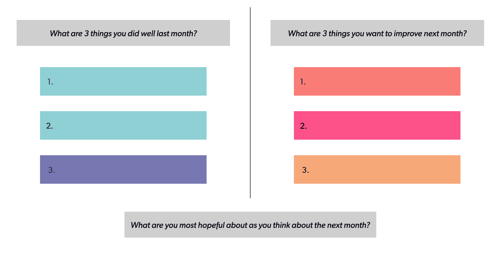
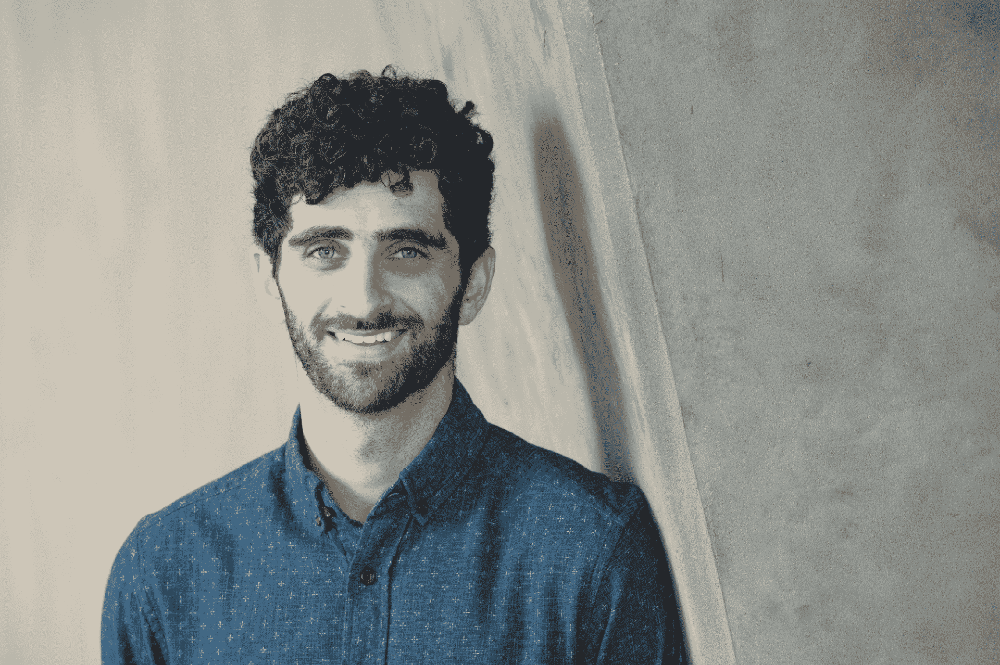
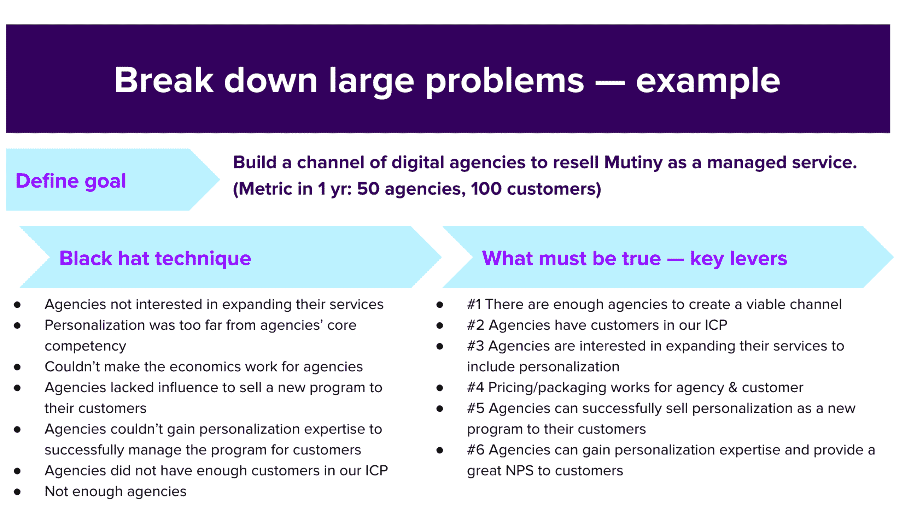

# 更好的会议创造更好的日子——与您的团队一起尝试的 20 个战术想法|第一轮回顾

> 原文：<https://review.firstround.com/better-meetings-make-for-better-days-20-tactical-ideas-to-try-out-with-your-team>

## 介绍

“随着向远程工作的转变，你日常的大部分人际互动都是通过 Slack、电子邮件、谷歌文档和 Zoom 会议进行的。因此，对于许多员工来说，他们一天中唯一面对面的人际互动很可能是通过开会。如果那个会议是好的，那么他们的一天就是好的。如果那次会议很糟糕，那么他们的一天就很糟糕。”

自从今年早些时候 **[哈希科尔](https://www.hashicorp.com/ "null")****[凯文·菲什纳](https://www.linkedin.com/in/kevinfishner/ "null")** 在我们的播客中提到这一点，我们就一直在思考这个问题。即使一些人正在返回物理工作空间，这种情绪仍然比以往任何时候都更加强烈。无论是面对面还是视频会议，都很难夸大会议对员工在初创公司的日常体验的影响——然而最近，我们中的许多人似乎开了更多糟糕的会议，从而积累了更多糟糕的日子。

无论是 Twitter 上关于连续不断的变焦会议的无休止的讽刺，还是“这可能是一封电子邮件”这样的老生常谈的俏皮话，你都很难找到工作日中承受更多笑话、抱怨和普遍不满的另一个组成部分。([sales force 的 Bret Taylor 举了一个很有价值的例子。)](https://twitter.com/btaylor/status/1420076603967631361?s=20 "null")

为了帮助你在不消耗精力或浪费时间的情况下更有效地召开团队会议这一难以实现的目标上取得更多进展，我们梳理了我们的档案，重新展示了我们采访过的一些最聪明的领导者的最佳实践。

他们的一些建议提供了令人难以置信的关于调整团队会议议程或插入新问题的实际指导；其他人则专注于重塑你自己的观点，这样你就能以新的眼光看待这些会议。几个小花絮集中在如何让现有的会议更有效，或者，谢天谢地，重新访问并一起删除它们。(但公平的警告是，有一两个人建议增加新类型的会议，以达到有针对性的目的。)

跨越团队场外、站立和与您的直接下属的 1 对 1，以及更具体的领域，如产品审查和董事会会议，每条建议都是因为其专注于帮助您以更多的精力和意图参加定期会议而被选中的。无论你是在寻找新的想法来重振一个已经过时的会议，还是希望以正确的方式开始一个新的循环会议，这份战术提示综述已经涵盖了你。让我们开始吧。

# **反思你如何与他人和自己联系:**

“每当有人告诉我会议很有挑战性时，我不会问为什么，而是会问之前发生了什么。领导力教练 **[卡蒂亚·韦里森](http://www.kvaleadership.com/about.html "null")** **说:“通常这才是真正的答案。**“也许他们看到了一些令人沮丧的数据，或者打了一个粗略的电话。人们从一个会议走到另一个会议，没有想到一个会议会影响他们在另一个会议上的表现或反应。我们给自己零过渡时间，结果就是情感转移。”

如果你对阻止这种溢出效应感兴趣，那就有意把这个包袱放在一边。“我告诉我的客户，想象他们提着行李箱，把它们放下，”她说。另一个策略？通过访问记忆，让你的大脑进入一个更积极的心态，让自己回到事情进展顺利的时候，那时你不会感到焦虑或过度劳累。

回到你引以为豪的时刻——无论是你做的东西还是进展顺利的项目——都会带来心理上的转变。韦里森说，特别是考虑到我们倾向于关注消极方面，庆祝和重温最近的成就是我们重新连接大脑以保持清晰的最佳工具之一。

我们删除我们的胜利如此容易。难怪我们看不到未来的可能性。

Minaa B, licensed psychotherapist and mental health advocate

互相检查已经成为我们疫情日常生活的重要组成部分。这就是为什么治疗师和心理健康倡导者杰西米纳·阿奇博尔德(Jessmina Archbold )的这个建议一直伴随着我们:

“我喜欢在我的工作室进行心理健康检查，问这些问题:‘从 1 到 10，1 是最低，10 是最好，你今天感觉如何？你可以向谁寻求帮助？“你需要什么来感受支持，”我让人们先问自己这个问题，然后让他们向另一个人提出同样的问题，”她说。

对阿奇博尔德来说，这不仅仅是为了彼此——这也是关于界限，她认为这是自我照顾的核心。“关键是倾听并创造空间，而不是提出建议并试图解决他们的问题。在你作为经理的一对一谈话中，你可能会问你的直接下属他们做得怎么样。如果他们的“数量”很少，或者他们的反应似乎很温和，就问:“我能支持你吗？”在进入解决方案模式之前。这给了他们权力和空间去要求他们所需要的东西，而不需要太多的试探或把自己定位成救世主。"

大多数人不会坦诚自己的感受，因为他们会得到不请自来的建议或侵扰性的问题——你可以尝试用你创造的文化和你采取的微观行动来阻止团队中的这种循环。

哗变[的联合创始人兼首席执行官 Jaleh Rezaei](https://www.linkedin.com/in/jalehr/ "null") 是推动团队快速前进的专家——她的[加速营销组织](https://review.firstround.com/your-marketing-org-is-slow-heres-a-framework-to-move-faster "null")的框架是必读的。但她也提倡放慢脚步来建立信任，并有目的地提升你的领导力。

这就是为什么她建议每月与直接下属召开一次一对一的会议，以达到一个特定的目的:让每个团队成员反思上个月进展顺利的三件事，以及他们希望下个月有所不同的三件事。然后 Rezaei 分享了她自己的 3x3。“我们在创业公司的大部分时间都被放大了。“每月反思是我们缩小视野的时候，”她说。

我们最喜欢的花絮是她如何以轻松的语气结束对话:**当你想到下个月的时候，你最有希望的是什么？**点击这里[获取 Rezaei 的模板](https://docs.google.com/document/d/1X1EM39j_dda2I6sDZdiK9DwJwdE_hlJ3apFpdGszT_o/edit# "null")以便在下次会议中试用。

# **通过** **尝试新事物来改变现状:**

去年，当开始计划 Sitka 的第一次远程异地时，首席执行官[凯尔西·梅勒德](https://www.linkedin.com/in/kelsey-mellard/ "null")有几个目标，从增加同理心的团队建设练习到让所有人都在同一页上的战略会议。“另一个目标是检查我们现有的惯例，一起创造新的仪式。我想保留一些空间，让我们能够保持现状，相互思考，相互感激，”梅勒德说。

Mike Wang, Head of New Ventures & Learning Experience at Arizona State University

这就是为什么她寻求王建亚**[的帮助，一个熟练的设计师和高度有意体验的推动者，来精心制作一个更有影响力的异地。“作为人类，我们都渴望联系——感受被看到、被听到和被理解——但往往没有鼓励这些行为的有意空间，”他说。](https://www.intentdesign.org/ "null")**

梅勒德和王在 Sitka 的场外议程项目中创建了这样一个空间:“周五早上，我们都打开 Zoom，播放一些背景音乐，然后花 90 分钟做一个练习:**写一行关于公司其他人的内容，以及我们喜欢与他们一起工作的事情**，”梅勒德说。然后，Mike 收集了所有这些笔记，并在一封电子邮件中集中发给每个人。因此，每个人都可以打开一封电子邮件，里面有来自同事的一系列令人惊叹的感谢之词。老实说，我真的不知道会有什么样的反响，但它让人们潸然泪下。”

王对此表示赞同。“关键在于试图让人们以一种他们甚至可能不会在正常专业环境中出现的方式出现，更不用说在 Zoom 上了。但是因为我们是在快速射击中完成的——你只有大约一分钟的时间为每个人写东西——这感觉像是一项你可以完成并成功完成的任务。在我们后来得到的反馈中，许多人说这是他们在异地的持久收获，他们想更好地表达对他人的感谢。这是一个令人难以置信的高潮。”

编者按:第一轮运营团队在团队会议上尝试了这种练习的轻量级版本，我们*高度*推荐它。这是我们的版本。在会议还剩 15 分钟的时候，我们向我们的 15 人团队发送了一个打印链接，并带有以下提示:*对于每个与会者，写一两行文字来回答以下问题:你钦佩这个人的什么地方？这个人最近做了什么让你欣赏的事？为什么要感激把这个人算作队友？答案匿名。所有人都到场后，会议负责人会收集每个人的发言，并在私人电子邮件中分享。*

近来，远程会议文化受到了很多关注，但 **[梁美琪](https://www.linkedin.com/in/maggieleung1/ "null")** 发现了一个经常被忽视的小缺口:远程团队的经理往往会错过提升那些优秀或突出最佳实践范例的人的机会。

NerdWallet 前内容副总裁、Andreessen Horowitz 现任执行编辑说:“不仅仅是有人做得很好，而是对他们如何做的解释，这在远程团队中经常缺失。”。

如果你只是叫出这些人的名字，而没有要求他们与你的团队分享他们的方法、解决问题的技巧、挑战和失败，你就把钱留在了桌子上。

Leung 举了一个来自 NerdWallet 的具体例子，他提到了一个名为“好看是什么样的”的双月活动。这可能需要增加一个新的会议，但这个简短的故事证明了它的价值:“我们看到不一致的方法正在产生不必要的工作和磨损。因此，我们团队中的一位贡献者提议制作一个决策树，以帮助他的团队和其他人更快、更一致地做出决策，”她说。

“他通过获取我们团队中其他几个人的意见和支持来担任四分卫。完成后，他将它推广到我们整个 80 人的团队。因此，我们展示了他的成就，让他向我们的团队介绍他是如何思考这个问题的，努力获得不同的观点，然后启动这个项目。我们明确告诉团队成员，这是我们重视的一种举措。”

当 SoundCloud 团队人数达到几十人时，很容易让人觉得你是其中一员。“然而，随着你的成长，你会失去一些与你并不直接相关的东西的联系。大卫·诺尔 说:“我认为这是初创公司非常常见的阶段。

人们开始感受到这种分离焦虑——这种感觉是，如果他们不在一个房间里，他们在那里是不被允许或不受欢迎的。

进入客串——一种抵消这种爬行感的方法。以下是诺尔几年前对我们的描述:任何 SoundCloud 的员工都可以预约时间参加另一个团队的会议或异地会议，就像亚历克·鲍德温可能会在汤姆·克鲁斯的电影中出现几分钟一样，他说。唯一的要求？“你必须带至少一条关于你自己团队的有趣信息来参加会议，然后你必须带一些相关的信息回来与你的团队分享。”

然而，人们不必被特别邀请去客串。他们可以要求与团队进行面对面的交流，这将让他们记住一个适合邀请客人的会议。在某一点上，这种透明的做法甚至扩展到了高管团队会议。“我说服我们的首席执行官允许在他们的季度异地会议上客串——这是他们每年的旗舰会议，”他说。“这真的很了不起，因为国外的领导层总是会产生一定程度的好奇、焦虑和不确定性，不知道会产生什么结果，也不知道他们实际上在谈论什么。”

工作原理是这样的:高级经理提名他们认为会做得很好的人，他们不仅善于观察，而且积极参与。从 30 名被提名者中，他们随机选择了三个人来客串(每个人参加半天的 1.5 天异地活动)。事后，这些员工写了一篇关于他们经历的内部博文。

# **继续前进，避开这些减速带:**

Dr. Emily Anhalt, co-founder of Coa

并不是所有的会议都一帆风顺——有时[冲突会公开爆发](https://review.firstround.com/our-6-must-reads-for-cutting-through-conflict-and-tough-conversations "null")，导致看似难以解决的紧张交流。当你和你的联合创始人或高层领导在一次会议上无法就一个关键决策达成一致时， **[Coa](https://joincoa.com/about "null")** 的 **[艾米丽·安哈尔特博士](https://www.dremilyanhalt.com/about "null")** 提供了一个实用的指针:再次争论，但要转换立场。以下是它的作用:

这种实践放松了对“正确”的执着。

帮助你更好地理解他人的观点。

揭示了新的观点，这可能会使最佳选择更加清晰。

好奇心的核心是理解你通过自己经历的特定镜头来看世界。通过让别人分享他们的观点，你收集了更多的数据点，并对事实有了更准确的看法。

产品评审是项目经理展示团队工作并赢得高管面见时间的地方——这往往是一把双刃剑，First Round 自己的 **[Todd Jackson](https://firstround.com/person/todd-jackson/#mystory "null")** 说(他在谷歌工作期间是 Gmail 的项目经理，在脸书是 News Feed 的项目经理)。

“通常，你会马上被打断，你需要愿意与任何人进行开放式辩论。这是很多好问题或想法产生的地方，”杰克逊几年前在评论中分享道。但是区分什么是领导真正关心的，什么是次要的或随意的想法是一项需要实践的技能。

他的建议？让你自己被大的想法所干扰，但是不要太多。他说:“如果他们给出了你不同意的或者听起来很随意的具体建议，一定要努力理解要求的精神。“有时你可能会强烈反对细节，但你确实同意高层次的目标。”

但如果这些偏离开始融合成具体的决策，杰克逊建议将创始人钉在黄铜钉上。“直接问他们:‘那就这么决定了吗？’”他说然后明确你的下一步行动:“我们会跟进这一点，然后再回来找你。”。“这有助于确保利益相关方感受到自己的声音。

尽量避免“应声虫”的冲动并深思熟虑也很重要。“通常如果一个创始人在会议中提出一个全新的想法，所有人都会点头。因此，你过于草率地同意了，后来你意识到这里面有大问题，或者它并不像当时看起来那样具有高影响力，”杰克逊说。

你不能留下任何误解的机会，甚至不能让一个人带着不同的结论离开会议。

“你还记得上一次你在开会时，有人说‘我们要在离开房间前做出决定吗？’那种感觉有多棒？你不是刚想抱抱那个人吗？“我们衷心赞同 **[新贵](https://www.upstart.com/ "null")** 的 **[戴夫·吉鲁阿德](https://www.linkedin.com/in/davegirouard/ "null")** 的观点，他的第一篇经典文章《[速度是一种习惯](https://review.firstround.com/speed-as-a-habit "null")》就如何成为自己公司的英雄提出了很多建议。(如果你还没有读过，或者已经过了重读的时间，我们建议你打开一个新标签，尽快把它从列表中划掉。)

“制定和重新制定决策的过程浪费了公司大量的时间，”他继续说道。这里有一个特定的减速带，它经常会让初创公司慢下来:“我总是对会议上产生的许多没有指定截止日期的计划和行动项目感到震惊。即使指定了日期，它们也常常是基于对任务需要多长时间的不成熟的直觉。Girouard 说:“完工日期和时间遵循部落的日出日落观念，通常‘明天’是默认答案。“我见过太多的人从不质疑什么时候会有东西送来，并认为它会立即发生。这种情况很少发生。我也看到过想法漂浮在空中，因为它们从未在时间中被锚定。”

从一开始就决定何时做出决定是一个深刻而强大的变化，它将加速一切。

为了抵消这种倾向，在你的下一次会议中挑战“当”。“并不是说所有的事情都需要现在完成，但是对于你的关键路径上的项目，挑战截止日期总是有用的。只需要问一个最简单的问题:“为什么不能早点完成？”他说:“有条不紊地、可靠地、习惯性地问这个问题，会对你的组织的速度产生深远的影响。”。

# **更好地产生想法和获取知识:**

HashiCorp Chief of Staff, Kevin Fishner

Kevin Fishner 说，在 HashiCorp 的高管办公室之外，有一些结构可以让集体讨论公司目标的过程更加有效。“哈佛商业评论有几项关于头脑风暴的研究表明，当你把人们聚集在一起，让他们把贴纸贴在墙上或白板上时，效果并不好。因此，我们给高管们两周时间，让他们写下他们认为来年的三个重点应该是什么，”他说。

然后，每位高管在会上有五分钟的时间讨论他们的建议。然后我们把所有的建议放在一个列表中——通常有很多重叠，所以我们最终有大约 15 个。然后，每位高管对五项计划进行排名，五项是最重要的，一项是最不重要的，然后我们从那里进行排序。”

这是这种方法奏效的原因:“首先，允许每个人独立思考目标意味着他们不会陷入集体思考。第二，当没有那么迫切需要当场提出想法时，人们通常会更有想法。最后，每位领导人都有平等的发言时间和机会让别人听到他们的声音。”

**[亚当·格兰特](https://review.firstround.com/what-your-startup-can-learn-from-astronauts-the-daily-show-and-the-coach-of-the-boston-celtics "null")** [同意](https://review.firstround.com/what-your-startup-can-learn-from-astronauts-the-daily-show-and-the-coach-of-the-boston-celtics "null")的观点，认为[脑力劳动](https://www.mindtools.com/pages/article/newCT_86.htm "null")是最好的，并指出[证据表明，集体头脑风暴产生的想法比同一批人单独工作时更少、更差](https://www.linkedin.com/pulse/daily-shows-secret-creativity-adam-grant/ "null")。

“如果你知道小组对自我问题或地位等级感到紧张，你应该匿名收集想法，”组织心理学家和沃顿教授说。“这是关于利用团队的力量进行想法选择，人们实际上在集体中更好，但让个人首先发挥创造力。”

个人非常善于产生想法。团队擅长利用群体的智慧来选择想法。

我们都参加过这个会议:团队正在考虑一个新的大项目。兴奋情绪高涨，创意源源不断，想法以令人眩晕的速度涌现。“在这个阶段，每个人都会立即问，‘我们如何让这一切发生？’但现在，你正走向坑洼，”哗变的 Jaleh Rezaei 警告说。她说，当谈到你的论文时，有些事情你是对的，而有些事情你可能没有说到点子上。

为了发现未来隐藏的陷阱，Rezaei 依靠“黑帽”技术，通过问一个有针对性的棘手问题来启动新的计划:“**让我们假设一年后我们没有实现目标。哪里出了问题？**”

“这个问题产生了一个微妙的转变，从非常乐观的心态到触发团队解决问题的神经元。它为他们指明了努力阐明我们尚不了解的事物的方向，”雷扎伊说。“这里的目的是，你要列出实现长期目标所隐含的 5 到 10 个主要假设。”

但这不仅仅是停留在消极上。“下一步是将消极的陈述转化为积极的陈述，并重新组织它们，以包含使项目成功的关键杠杆。这些是你的核心假设，要想实现你的长期目标，这些假设必须成立。”在下一次动员会上尝试这种幻灯片形式:

在创办 defy.vc 的时候，Brian Rothenberg 在 SkillSlate 的董事会上依靠了一个聪明的策略。不是提供上个月的指标和里程碑的状态报告摘要，而是将重点放在这个月的学习上。“开始问这样的问题，‘你能从这些见解中应用什么，它们又引出了什么额外的问题？’”罗森伯格说。

这种策略延续到了他在 TaskRabbit 和 Eventbrite 的日子。“像许多其他创业公司一样，我们处在一个周期中，我们会发布一些时髦的新功能，并几乎希望更快的增长，”Rothenberg 说。虽然对特性进行了大量的思考，但假设和度量标准有时是模糊的——并且长期影响并不总是得到具体的监控。

“历史上，一个团队会发布一个新功能，我们会为它的发布欢呼，然后这个团队会立即转移到一个新项目，”他说。“在问‘我们学到了什么？’这样的问题之前，人们会进入下一个项目。或者‘我们达到预期的效果了吗？’甚至是‘我们到底该不该保留这个特征？’"

不要只问“我们做了什么？”通过询问“我们学到了什么？”来记录你的进步被问题而不是成就所驱动，开启了未来的影响和进一步的学习。

事后总结会议是初创企业的一个重要组成部分，是总结经验教训和摆脱指责的关键。但是 **Twilio** 的 **[Jeff Lawson](https://www.linkedin.com/in/jeffiel/ "null")** 也提倡用不同的方式使用这些肌肉——当事情进展顺利的时候。

“通常事后分析这个词是用来描述分析不顺利的事情，但当事情进展顺利时，我们也会进行事后分析，”他说。“通过这种方式，你可以不断增强分析结果的能力，并询问将你带到那里的所有输入是什么，当一切都在你脑海中清晰可见时，努力做到最好，以学习和获取知识。”

例如，在 Signal (Twilio 的年度客户活动)之后，团队会克服疲惫感，以满足和捕捉电话“起作用的，不起作用的”“每个人都很容易说，‘好吧，我下周休假。我们只是拼命工作。但两周后，如果我们回来做尸检，他们会忘记很多东西，”劳森说。

# **通过提升认可凝聚团队精神&包容:**

Jaleh Rezaei, co-founder and CEO of Mutiny

我们都听说过定期提供实时反馈的重要性，尤其是当涉及到给团队成员以激励和强化正确行为的积极评论时。但是，由于连续的会议排得满满的，很难抽出时间来发送这些鼓励的短信。相反，试着把你下一次视频通话的时间作为提供积极反馈的机会。

《兵变》的 Jaleh Rezaei 建议依靠 Slack(或者微软团队)来快速获得积极性。“当我看到我真的喜欢的东西时，我通常会给那个人发一条简短的发自内心的信息，比如，‘看到你在会议上大放异彩，我太不可思议了。“干得好，”她说。

**脸书**新产品试验的产品负责人[苏尼塔·莫汉蒂](https://www.linkedin.com/in/sunita-mohanty/ "null")已经看到了一种更喧闹的方法，尽管:“敲鼓——字面上的意思。她说:“我的一个朋友喜欢用道具让她的团队充满激情，就像当她对别人说的话感到兴奋时会摇动的铃鼓一样。

每一个人的长处都是通向全明星团队的超能力。找机会认识到每个人的超能力闪耀的具体方式，并鼓励团队练习分享对彼此的感激。

**Brex****[Edwin Chau](https://www.linkedin.com/in/edwinchau/ "null")**说，更进一步，确保将这种反馈传达给更高层的人在高层领导的议程中有自己的位置。“我的经理(首席技术官)在每周与他的直接下属开会时，会让我们每个人分享我们团队成员最近完成的一些令人惊叹的事情。他说:“这些团队成员可能比我的经理低 4 级以上。

如果你打算借用这一策略，后续步骤至关重要:“然后，我的经理会向所有被提到认可他们成就的人发送一封简短但极具影响力的电子邮件。人们通常会感到惊讶的是，隔了很多层的人对自己的工作有如此高的能见度，并意识到自己的贡献。”

“外向的人，那些在团队中呆的时间最长的人，以及主导身份群体的成员，他们的观点通常比其他人更容易被听到。“领导者需要注意这些动态，从女性和有色人种如何经常被忽视，到偏远、新加入团队的人、英语学习者或更内向的人如何发现很难说出来，”Coa 的情绪健康负责人瓦内塔·桑德胡(前 LifeLabs)说。

确保每个人都有一席之地是不够的——包容性的领导人要确保每个人都有发言时间。

以下是她列出的更多战术建议:

**将思考融入会议时间**。“那可以简单到说，‘在我们都回答之前，让我们都记下我们的想法。’这对那些用非母语工作的人，对内向的人，对那些神经有分歧的人和许多其他群体来说都是很好的。"

**靠** **礼题。**养成习惯，在会议结束时问一些问题，比如“我们还没有收到谁的来信？”以及“我们没有考虑的另外两个观点是什么？”

**返回中断状态。**虽然防止正在进行的谈话(尤其是虚拟会议)被打断可能会适得其反，但领导者可以做的一件事是跟踪完成情况。“如果有人被说服了，回去对他们说，‘嘿，你想结束你的想法吗？’或者“在我们继续之前，我想听听他们的其他观点。"

Massella Dukuly, Learning & Development Lead at LifeLabs.

“作为领导者，我们倾向于问一些非常宽泛的反馈问题，比如‘事情怎么样？’LifeLabs 的学习和发展主管 Massella Dukuly 说:“你需要非常非常具体。

她提出更具体的反馈的策略是 LifeLabs 团队所说的扩展问题。“举个简单的例子:‘从 1 到 10，你认为我在促成这次会面方面做得如何？杜库里说:“大多数时候，你通常会听到七八个，因为他们不愿意说任何超出这个范围的话。

这就是神奇的第二个问题的由来。“怎样才能把分数提高一分呢？然后，也许我会听到类似这样的话，“你本可以更多地呼吁人们接纳其他声音。”这很重要，原因有二。第一，给人们更大的安全感，让他们能够表达自己，增加参与度和承诺。第二，它还为我们提供了微观步骤，我们可以据此建立信任并提高包容性。“要考虑的其他后续问题:

什么能让你从 8 分变成 7 分？

10 分看起来怎么样？1 怎么样？

是什么让成绩不差？

**[Fidji Simo](https://www.linkedin.com/in/fidjisimo/ "null")** 最近[登上 Instacart](https://fortune.com/2021/07/08/fidji-simo-ceo-instacart-leaving-facebook-female-executives/?utm_source=email&utm_medium=newsletter&utm_campaign=broadsheet&utm_content=2021070913pm&tpcc=nlbroadsheet "null") 的榜首，但回到她在脸书担任产品副总裁的时候，她分享了她令人难以置信的故意[剧本，以找到工作中的焦点](https://review.firstround.com/how-facebooks-vp-of-product-finds-focus-and-creates-conditions-for-intentional-work "null")。当我们重读它时，她的一个微习惯引起了我们的注意:

Simo 说:“我查看了一周内的大型会议，对于每一次会议，我都制定了一个清晰的议程，列出了我个人和团队在会议中想要实现的目标。“这样，当我在一周内参加一个又一个会议时，就不会那么不和谐，因为我已经知道我的目标是什么。”

在会议开始前明确这一点——实际上是她想带着什么离开的清单——并了解她的个人优先事项，确保她的整个团队的行动和优先事项保持一致。

有心是领导的终极气节。它是清楚地陈述你的价值观和意图，然后把你的钱用在你所说的地方。

鉴于她在 Gusto、Patreon 和 Asana 等公司董事会工作的丰富经验， **[安妮·莱蒙迪](https://www.linkedin.com/in/anneraimondi/ "null")** 有很多关于如何让这些令人恐惧的会议更加有效的想法。对于那些权衡预读材料和面对面会议议程的创始人来说，莱蒙迪提供了一些建议:“从上市前公司的角度来看，如果你在董事会上花很多时间做更新和宣读，你可能没有充分利用这段时间。她说:“你应该深入研究那些最混乱的决定。

至于如何制作一份让人感觉不那么乏味的预读材料，首席执行官们在这些会议细节中融入个人风格，这给莱蒙迪留下了深刻印象。“我和许多首席执行官合作过，他们会在董事会前写一封董事会信，这只是从他们的角度来叙述。她说:“有些人比其他人长，但这几乎就像是甲板上的画外音——他们心里在想什么。”。

最好的董事会信函包括首席执行官在过去一个季度中最自豪和兴奋的事情，但最重要的是，是什么让首席执行官夜不能寐。“董事会知道这一点尤其重要。阻止他们睡好觉的最关键的问题是什么？”她说。“然后，是的，你仍然得到甲板和预读，但它让你知道我们真正需要花时间的地方。”

# **取消你不需要参加的会议:**

空白页和闪烁的光标的紧张感是我们盯着待办事项清单时最大的障碍之一。这一点在收件箱爆满的情况下尤为明显。这就是为什么 **[托马斯·巴雷托](https://www.linkedin.com/in/tomasrb/ "null")** 建议在回应中丢下一句话，以迅速重新获得对请求及其所有者的控制。

" [Charles Duhigg](http://charlesduhigg.com/ "null") 谈到回复他不想参加的会议的邀请。Box 前副总裁、现任 **[Okay](https://www.okayhq.com/ "null")** 联合创始人说，他开始回答说‘我只能坚持 15 分钟’。”他立刻控制住了自己。当然，他最终会充实或解释他的反应。但他会有一个立足点。这一页将不再是空白的，浏览他的收件箱也不会那么麻烦。”

NerdWallet CEO and founder, Tim Chen

有时候最有效的会议是没有发生的会议。对于那些认真致力于让会议变得不那么糟糕的创始人和高级领导人，NerdWallet 的 **[陈永正](https://www.linkedin.com/in/tim-chen-1722b9/ "null")** 从自己的经历中分享了[这个教训:取消首席执行官最喜欢的会议。](https://review.firstround.com/nerdwallets-ceo-on-navigating-the-shift-from-first-time-founder-to-seasoned-exec "null")

“每个人都讨厌的会议是大型会议，这种会议只对会议所有者有用。这个人往往就是 CEO。会议通常包括在房间里走来走去并给出状态更新。会议主持人对此感觉很好，但其他人都翻着白眼，无聊到流泪，想着“这怎么可能是一封电子邮件。”这样的会议我开了很长时间，”陈承认道。

“有一天，我在读一本关于会议的书，书中描述了这种现象，我当时就想，‘哦，我的上帝。这完全是我的会议。所以，我拔掉了插头。不要浪费任何人的时间。找到你信任的人，直接问他们:你从中得到什么了吗，还是应该完全取消？"

CEO 们，干掉你们最有用的会议。这可能是你最喜欢的，但也可能是其他人最害怕的。

*图片由 Getty Images / Emilija Manevska 提供。*