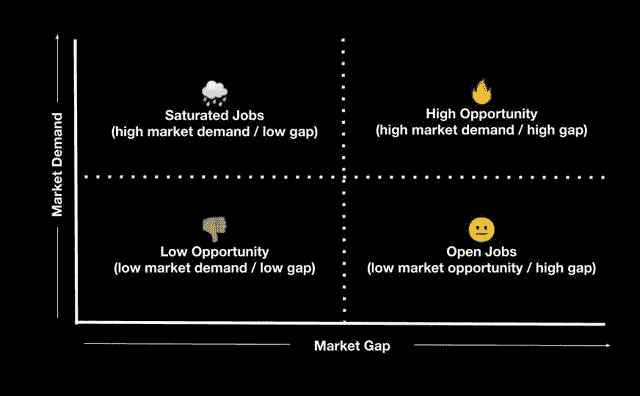

# 使用这个轻量级 JTBD 框架构建解决实际问题的产品|第一轮评审

> 原文：<https://review.firstround.com/build-products-that-solve-real-problems-with-this-lightweight-jtbd-framework>

*本文由* *[苏尼塔·莫汉蒂](https://www.linkedin.com/in/sunita-mohanty/ "https://www.linkedin.com/in/sunita-mohanty/")* *撰写，她是脸书新产品试验项目的产品负责人。她为初创公司、非营利组织和全球上市公司开发产品，最近在 Oculus、脸书核心增长公司领导产品团队，并担任 Lumosity 的产品总监。她也是创业顾问、天使投资人、首轮* *[天使轨迹社区](https://angeltrack.firstround.com/meet-the-angels?423c33ac_page=2 "https://angeltrack.firstround.com/meet-the-angels?423c33ac_page=2")* *成员。*

作为脸书[新产品实验](https://npe.fb.com/ "https://npe.fb.com/")的一部分，我领导产品团队，我们专注于模糊的“0 到 1”构建阶段，在这个阶段，想法未经验证，产品处于最初期阶段。我的工作是为我的团队将一个大的、颠覆性的愿景的复杂未知提炼为清晰的、可操作的步骤，并增加我们在每一步找到产品市场契合度的机会。这种在追求构建有价值产品的具体步骤的同时进行大幅度调整的关注是我之前经历的直接结果——我已经感受到了构建未能直接解决明确问题的产品所带来的痛苦。

斯坦福大学研究生毕业后，我发现自己正处于第一次创业的中期:一家失败的 K-12 分析公司。我们的使命是用有趣的技术来改善破碎的教育系统。但我们陷入了决策圈，无法成功执行或建立牵引力。回过头来看，很容易诊断出我们很难专注于首先解决哪个问题，因为我们没有足够好地理解我们观众的实际问题——我们只是假设我们理解了。

现在，在我作为天使投资人和顾问的工作中，我看到团队碰到了同样的砖墙。当我帮助他们区分早期产品和上市工作的优先级时，我经常发现自己也在给出同样的建议:**做好工作，确保你正在开发一个人们会真正发现有价值的产品**。这需要对用户、他们的希望和他们的动机有难以置信的深刻理解，而不是走未经测试的假设的捷径。

许多企业家可能凭直觉做到这一点，但许多其他人未能培养对用户的深切同情，这最终可能导致为任何特定市场制造错误的产品。如果你不提前投入工作，你就有可能在产品与市场的契合度上走错路，直到你面临难以维系的客户数量或高用户流失率时，你才可能发现这一点。

关于如何避免这个陷阱和更好地进行早期客户开发，有一系列的理论，但在我的咨询角色和日常工作中，我已经开始依赖一个框架: **JTBD** **(待完成的工作)**。

我第一次读到[克莱顿·克里斯滕森](https://hbr.org/2016/09/know-your-customers-jobs-to-be-done "https://hbr.org/2016/09/know-your-customers-jobs-to-be-done")的《JTBD》时，还是在斯坦福大学的研究生院，但并没有真正理解。几年后在脸书再次偶然发现它，我发现在我们建立 Oculus social features、脸书预防性健康以及最近的 [Tuned](https://npe.fb.com/2020/09/24/updating-tuned-app-for-couples-to-stay-connected/ "https://npe.fb.com/2020/09/24/updating-tuned-app-for-couples-to-stay-connected/") 时，使用这个框架的一个版本有巨大的价值。

JTBD 绝不是一种新的思维方式。但一开始可能会让人感到困惑，因为它充斥着企业战略术语，而且已经被重新发明了很多次。在谷歌上快速搜索一下，就会发现一大堆令人困惑的术语，这些术语来自于关于“工作即进度”和“工作即活动”的争论，或者是地图和层级的可视化。我还发现，JTBD 有点咨询风格，似乎不太受愿景驱动，这可能会让许多产品驱动型创始人感到不快。

Sunita Mohanty, a Product Lead in Facebook's New Product Experimentation group.

如果你想深入了解“要做的工作”理论以及其他人是如何应用它的，我建议你通读一下克里斯滕森研究所的这本入门书、哈佛商业评论的这篇文章、艾伦·克莱门特对两种不同解释的概述和内部沟通指南。但是，如果你正在寻找一种更轻量级的、更容易被创业产品团队使用的东西，请继续阅读我的简化 JTBD 方法。

在这篇文章中，我将详细介绍 Instagram 和脸书的产品负责人使用的这个框架版本，以及我作为天使投资人和早期团队顾问的身份。我将带你浏览我的[模板](https://docs.google.com/document/d/1NmKemkMOJh4DVLmTMhVUgLjG9i0_-5mqsEdCQcYH6wI/edit?usp=sharing "null")，从其他公司获得灵感的例子，以及从早期构思到发布和完善整个过程的建议。除了概述使用框架而不是仅仅依靠直觉的情况，我还将分享一些策略和模板，用于整合一套清晰的产品开发原则，这些原则可以为您的价值道具、prd 和走向市场策略提供信息，以便精确执行。

# 为什么你不能即兴发挥:使用框架来理解你的客户

你是否发现在你刚开始的时候，你的团队无法就你的产品最重要的事情达成一致？或者你努力工作，把一些让你兴奋的东西推向市场，但是你没有得到用户的支持？创始人、早期团队，甚至后期产品组织都会一次又一次地遇到这些问题。底线是你可以非常容易地构建一些东西，但是为了增加你创造一些解决真正问题的机会，你需要在你的方法上更加严谨。

任何人都可以制造产品。不是每个人都能制造出解决实际问题的产品，并使产品符合市场需求。

更具体地说，我看到早期和后期产品团队遇到的三个常见问题表明框架可能是有用的:

**1。你过于依赖自己的视觉。你没有真正倾听你的用户，你只是在做你认为人们想要的东西。这是确认偏见在起作用——人类倾向于挑选与我们先前存在的信念一致的信息，而忽略不一致的信息。如果你还没有走出来，深刻理解你在为谁建设，他们经历了什么问题，你就更有可能碰到这个问题。另一种变化发生在将基于研究的实践转化为消费者体验时(在健康和教育产品中很常见)——仅仅因为某样东西被证明是健康的或导致良好的结果，并不能确保人们会有尝试它的动机。**

**2。你比你的用户更关注技术挑战的刺激。**通常，工程和设计团队可能会对某个特定的项目感到兴奋，因为这是一个新的挑战。但是仅仅因为它是新的和有趣的，并不意味着人们会真的使用它。这往往是硬件团队更常见的陷阱之一，他们的产品出错的成本特别高。

**3。你无法清晰地表达你的价值主张，团队中的每个人都以不同的方式看待它。**我们都经历过这种情况——产品部门将价值视为 X，营销部门将价值视为 Y，工程部门将价值视为 z。当您对用户面临的问题没有共同的感同身受时，就会发生这种情况。这使得推动一致性并关注什么功能最重要或如何使产品功能与走向市场的需求保持一致变得很困难。

直觉和信念在构建早期产品的过程中极其重要，但与倾听用户的意见相结合可以增加你正确的几率。

## 进入“要做的工作”框架:它是什么以及它如何挖掘客户的需求

无论你是一个在大公司创新的产品经理，还是在一家初创公司建立一个全新的早期产品，JTBD 框架都可以为你的受众创造更好的、非显而易见的洞察力。最终，这个框架的核心价值是它提供了一种方法来收集对你的用户是谁，他们的动机和希望是什么的理解。作为创始人或产品负责人，你需要决定如何将这一点转化为对你的产品最重要的东西——将伟大的直觉与伟大的信息收集结合起来，以更好地投资资源。

虽然 JTBD 已经在制造实物产品的行业中使用了 30 年，但它在软件构建领域相对较新。“要做的工作”理论以理解客户行为和做出选择的基本原理为中心。

这个想法是，创新者通过解决消费者的斗争和满足他们未被满足的愿望而获胜。哈佛商学院营销教授西奥多·莱维特是这样解释的:“人们不想买四分之一英寸的钻头。他们想要一个四分之一英寸的洞！”当描述他现在经典的[奶昔例子](https://www.youtube.com/watch?v=Stc0beAxavY "https://www.youtube.com/watch?v=Stc0beAxavY")时，克莱顿·克里斯滕森[这样总结](https://www.christenseninstitute.org/jobs-to-be-done/ "https://www.christenseninstitute.org/jobs-to-be-done/"):

“人们不是简单地购买产品或服务，而是‘雇佣’他们在特定的情况下取得进步。”

在这个理论中，人们试图完成某些“工作”，他们反过来“雇佣”特定的产品或服务来帮助他们完成。如果产品或服务不能充分完成工作，他们可能会“解雇”它。

# 打造更好的产品始于良好的 JTBD 宣言——这是您的路线图

“要做的工作”陈述简明地描述了特定产品或服务如何融入一个人的生活，以帮助他们实现以前无法实现的特定任务、目标或结果。当精心制作时，这些陈述清楚地表明了今天不存在的东西，以及产品制造者可以专注于创新的东西。根据我的经验，创建一个清晰的 JTBD 宣言是这个框架最重要的部分。在这一节中，我将介绍为什么你需要一个，提供建议和我的模板来整理你自己的陈述，并分享来自几家公司的示例陈述作为灵感。

## 为什么你需要一个:

一个好的、简洁的 JTBD 陈述抓住了你的用户所面临问题的潜在动机、触发因素和背景。这一陈述可能是您整个产品和 GTM 规划的基础，从关注您的 PRD 或产品规格，到确定您的渠道和营销信息。

好的陈述将有助于消除偏见，建立对用户的同情，并使产品、营销和工程团队保持一致。当你有了一份精心制作的(且沟通良好的)待办事项清单时，下面的事情就开始到位了:

**您的团队更加关注解决最重要的问题**通过使用共享语言，让大家了解哪些问题应该优先处理

**通过解决实际问题为人们带来新价值的可能性更高**，这应转化为重要产品指标的积极领先指标(如产品的更高参与度和粘性)

**通过更多地了解人们“雇佣”来做这项工作的情境背景和全套备选方案，对你的产品的竞争有更深刻的理解**。

这里有一个例子可以说明 JTBD 声明的力量:最近，我投资的一家初创公司使用 JTBD 框架重新构建了他们早期的产品思维。作为一个由两名工程师组成的团队，他们发现自己在思考非常具体的用户故事，这些故事基于他们为远程团队开发产品的广泛目标。在使用 JTBD 重新思考他们的客户访谈方法，并根据他们听到的内容得出明确的陈述后，该团队能够重新设计他们的产品，专注于鼓励乐趣，并发现这一新的价值主张具有良好的早期吸引力。

## 放入“跑腿工作”:一个模板和 4 步过程来制作一份杰出的 JTBD 声明

在动笔之前，请遵循以下原则:

工作与你的使命、愿景或目标并不相同。

工作描述的是**潜在的人类需求**，*而不是*产品的特性。

工作阐明**消费者对潜在动机和斗争的洞察**，*而非*商业目标。

重要的是，一份工作应该突出一个**有前途的特定市场机会和一个未满足的需求**——在太广泛和太小众之间取得平衡。到底什么是太宽泛或者太小众？这与其说是科学，不如说是艺术，但是[就像保罗·格拉厄姆](http://paulgraham.com/startupideas.html "http://paulgraham.com/startupideas.html")描述的那样:“你既可以造出很多人想要的少量东西，也可以造出一些少数人想要的大量东西。选择后者。”

清晰的 JTBD 陈述应该有助于你绝对清晰地传达特定人群在特定情况下想要什么——以及他们获得这些的障碍。

基本的待完成工作陈述框架具体描述了人们今天所处的环境、实现目标的障碍、他们想要实现的目标以及他们期望的结果。

## 为了将这一点付诸实践，这里有一个 JBTD 声明模板，我觉得很有帮助，常用于脸书和 Instagram 产品团队:

当我……(上下文)

但是……(障碍)

帮帮我…(目标)

所以我…..(结果)

有了这些原则和最终目标，按照以下四个步骤收集填写 JTBD 模板所需的所有信息:

**1。首先明确你的受众。**

想一想那些有助于你在听众脑海中形成清晰形象的特征。没有一个清晰的定义，你可能会走得太远，或者从错误的人那里收集信号。

**2。在市场调查中打下基础。**

尽可能多地了解这些受众的行为:他们目前正在使用什么来解决这个特定的问题，以及他们在客户体验中感到最痛苦的地方。测试所有与您正在构建的产品或用户为完成工作而共同开发的产品相关的产品。你应该清楚地了解他们为完成工作而“雇佣”或“解雇”的替代产品，以及原因。

**3。与你的用户交流。**

通过调查和访谈，获得关于用户心态和决策过程的第一手资料(与你正在构建的东西相关)。更具体地说，尝试:

**了解潜在的动机和背景:**他们希望做什么？情感上和功能上？他们在哪里？他们周围发生了什么？

**了解障碍和困难:**是什么阻止他们完成这件事？

**了解他们目前在“招聘”和“解雇”什么:**他们目前在做什么，或者一起努力完成工作？他们不使用什么是因为它不能完成工作？

无论你是使用调查还是面试，小心地用词提问，这样你就不会把人们引向一个特定的答案。例如，当我们开始构思 Tuned 时，我们首先研究夫妇的一般沟通模式，然后专门询问针对夫妇的应用程序或我们正在考虑的解决方案。我们从这些对话中听到的问题帮助我们在一系列想法中进行优先排序，将重点放在情感联系上，而不是战术性任务管理上，比如跟踪购物清单。

退一步理解更深层次的背景和潜在动机是很重要的，因为众所周知，人们不擅长预测自己想要什么。

**4。区分优先顺序**。

你的产品可以处理许多客户工作，但在这里专注是最重要的。从用户访谈中，寻找在要做的工作中出现的主题。你还可以进行调查，要求用户对工作的重要性以及其他应用程序或产品目前对每个工作的支持程度进行排名，以更好地了解市场机会。这可以帮助你缩小工作范围，优先考虑那些需求最大、缺口最大的工作。

当我考虑要处理哪些工作时，我喜欢使用这个框架:

How to think about which jobs to tackle in the JTBD framework.

如果可以的话，试着按照上面的步骤来完成第一遍 JTBD 陈述，然后通过调查或采访重新测试，向用户提问，找出这份工作是否对他们最重要，以此来强化你对 JTBD 的定义。吸收新的信息来完善你的 JTBD 可以让你重新审视你的核心假设，更新你自己的直觉。

## JTBDs IRL:将这个框架带入生活的例子

为了将它从理论领域带到更实际的领域，让我们解开一些不同的产品(有些是我曾经开发过的，有些是我对其他产品的分析)，它们的受众和它们的 JTBDs。这些不是你在商学院会遇到的案例研究，而是快速的真实世界的例子(来自我尊敬的公司和我自己的团队)，可能有助于指导你自己的思考。

**核心受众:**最初是电脑游戏玩家

**动机:**在玩游戏的时候同步交流，寻找其他人，组织足够的人让游戏进行下去

**障碍:**玩游戏时注意力分散，很难只聊天，与和你有相同游戏兴趣和技能水平的人交流

**他们还雇佣/解雇了哪些人**:其他社交媒体、信息应用

**不和 JTBD** : *当我想跳入自己喜欢的游戏，却不知道身边有没有人可以玩的时候，帮我安全地协调一群志同道合的游戏玩家，这样我就可以轻松地找到享受自己喜欢的多人游戏的方法。*这意味着可以通过公共或私人服务器轻松找到人，当你组织和进入游戏时，可以轻松地从文本聊天切换到语音聊天。

**核心受众:** [高档、健身型的超级妈妈](https://askwonder.com/research/customer-demographics-peloton-market-and-consumers-g8kjyism0 "https://askwonder.com/research/customer-demographics-peloton-market-and-consumers-g8kjyism0")(或爸爸们)

动机:健身是为了保持健康(感觉良好和保持理智)，健身是一种社交体验，快速而有效的锻炼，多样性和责任感

**障碍:**难以去健身房或上课(因为孩子)

**他们还雇佣/解雇了哪些人**:健身房或工作室、其他家庭健身设备、户外运动

Peloton JTBD: *当我需要一个锻炼的选择，但我不能去我最喜欢的工作室时，请帮助我获得一个方便和鼓舞人心的室内锻炼，这样我就可以为自己和家人感受到最好的状态。*这表明，讲师指导的体验、通过排行榜和击掌的轻松社交动机以及最重要的实体自行车等特征是该价值的重要核心部分。

**核心受众:**营销/产品分析的创业开发者和/或消费者

**动机:**利用对客户行为的全面分析，做出更快、更明智的商业决策

**障碍:**获取客户数据的全貌极其费力且极易出错，因为这些数据是通过许多互动和来源收集的

**他们还雇佣/解雇了什么**:带有定制集成的独立数据源、现有的 ETL 管道、其他客户分析平台

JTBD: *当我需要了解人们在我的平台上做什么，但我有不同来源的数据告诉我不同的故事时，请帮助我轻松地整合一个真实的来源，以便我可以做出更好的产品和营销决策来改善我的业务。*这明确了细分市场单一 API 的核心价值，它允许公司利用数十种分析服务来创建客户的单一视图。

**核心受众:**B2B 公司的客户营销人员(注意，这只是兵变认为的核心受众之一)

**动机:**通过帮助高价值企业客户理解和信任他们公司的价值来加速销售

**障碍:**时间和资源有限，不确定什么策略会产生最佳效果

**他们还雇佣/解雇了哪些人** : ABM 广告平台、在线活动软件、电子邮件营销

哗变 JTBD: *当我需要帮助企业客户发现并信任我们的价值主张，但我的时间和资源有限，无法测试可能引起共鸣的不同方法时，请帮助我快速自信地传达正确的信息。*这清楚地表明了[哗变如何传达其价值主张](https://firstround.com/review/your-marketing-org-is-slow-heres-a-framework-to-move-faster/ "https://firstround.com/review/your-marketing-org-is-slow-heres-a-framework-to-move-faster/")——它建议强调 abm 使用其平台时的易用性和投资回报率，而不是专注于其作为个性化平台的能力。

**核心受众:**千禧一代情侣，在一起> 6 个月

**动机:**为他们的关系保留一个私人空间，想要更充分地向伴侣表达自己，一起庆祝回忆

**障碍:**受限的情感范围和通过数字工具产生的沟通障碍

**他们还雇佣/解雇了哪些人**:其他数字通讯工具

调谐 JTBD: *当我想与我的伴侣建立联系，但没有特别的方式来分享我的感受时，请帮助我更好地表达情感，这样我们可以加强我们的联系。*这暗示了一系列功能，这些功能给了你更广阔的情感范围(比如分享你的心情、贴纸、贺卡),让你感受到与伴侣更深层次的联系，而不是像跟踪购物清单这样的战术功能。

# 现在怎么办？创业公司如何将 JTBD 付诸实践

JTBD 不是一个静态的陈述，也不是适合公司整个生命周期的一次性练习。我看到团队经常经历这个过程一次，但是当他们执行时，没有用新的信息重新访问它。这是一个需要定期更新的框架，它与产品团队遇到的所有阶段和挑战都相关。如果使用得当，它可以作为北极星持续关注最重要的事情，并增加找到适合产品市场的机会。

## 如何将 JTBD 纳入产品组织:

除了在早期清楚地抓住 JTBD 的价值之外，当你开始阐明你的价值道具、prd 和走向市场的策略时，你可以在你的产品团队的整个过程中编织它。通过规划到执行的每一步，JTBD 可以提供一套清晰的原则，推动你试图证明什么给用户带来价值的假设。

### **下面是一些更具体的想法，告诉你如何将 JTBD 框架融入到产品开发的每个阶段——****[查看模板](https://docs.google.com/document/d/1NmKemkMOJh4DVLmTMhVUgLjG9i0_-5mqsEdCQcYH6wI/edit?usp=sharing "https://docs.google.com/document/d/1NmKemkMOJh4DVLmTMhVUgLjG9i0_-5mqsEdCQcYH6wI/edit?usp=sharing")** **我在自己的角色中已经开始依靠这些模板。**

**1。创意产生:**将 JTBD 变成[“我们可能如何”陈述](https://dschool.stanford.edu/resources/how-might-we-questions "https://dschool.stanford.edu/resources/how-might-we-questions")，帮助你清晰地阐述你的产品应该解决的问题。例如，通过 Tuned，我们希望根据我们听到的最重要的工作来帮助人们更好地表达他们的伴侣。我们用“我们如何帮助夫妻更容易地表达更广泛的情感？”这句话来引导我们的头脑风暴。这让我们开发了情绪功能，合作伙伴可以选择一种情绪和颜色来表达他们的感受。

**2。功能优先化:**根据 JTBD 的陈述，进行头脑风暴，以生成针对此特定价值主张的可能功能。如果您有多个重要的 JTBDs，可以考虑选择一个作为路线图中特定时间间隔的特性主题，比如 sprint 或 quarter。例如，当在 Oculus 中建立第一个消息传递版本时，我们优先考虑允许人们在 VR 中协调游戏的功能，而不是围绕表现力的功能。我们这样做是因为我们知道，通过最初的 JTBD 研究，减少与他人进入虚拟现实的障碍是非常重要的。

**3。价值主张测试**:从你的 JTBD 陈述中，[将它缩小到两三个对你的听众来说最重要的价值主张](https://docs.google.com/document/d/1NmKemkMOJh4DVLmTMhVUgLjG9i0_-5mqsEdCQcYH6wI/edit "https://docs.google.com/document/d/1NmKemkMOJh4DVLmTMhVUgLjG9i0_-5mqsEdCQcYH6wI/edit")。强有力的价值主张传达了你的产品和品牌的具体特点，促使人们采取行动。在你建立任何东西之前，运行一个[“假门”测试](https://www.uxmatters.com/mt/archives/2016/02/validating-product-ideas-through-lean-user-research.php "https://www.uxmatters.com/mt/archives/2016/02/validating-product-ideas-through-lean-user-research.php")(使用脸书或 Instagram 广告，谷歌广告和/或应用程序商店测试)，以快速验证什么最能引起你的观众的共鸣——没有英语资源。

**4。走向市场计划:**你可能有一个专门的营销团队，也可能还没有——无论哪种情况，你都可以根据 JTBD 声明和制胜价值道具来确定你的分销策略，精心制作你的关键[产品营销](https://firstround.com/review/classpass-cmo-on-how-and-when-to-invest-in-product-marketing/ "https://firstround.com/review/classpass-cmo-on-how-and-when-to-invest-in-product-marketing/")信息和品牌定位。一旦您确定了 GTM 的时间和目标，您就可以确定您将利用的主要渠道。根据您使用的渠道，您可以从您的 JTBD 中融入您对情感和功能诉求的理解，以创建营销文案和内容，如登录页面、AdWords 活动和脸书或 Instagram 广告。关于走向市场的更多深度，请阅读更多关于如何[“选择获得客户的正确途径](https://firstround.com/review/drive-growth-by-picking-the-right-lane-a-customer-acquisition-playbook-for-consumer-startups/ "https://firstround.com/review/drive-growth-by-picking-the-right-lane-a-customer-acquisition-playbook-for-consumer-startups/")”或[查看 10 家公司 GTM 战略的详细分析](https://blog.upscope.io/10-companies-show-you-their-go-to-market-strategy/ "https://blog.upscope.io/10-companies-show-you-their-go-to-market-strategy/")。

**5。分析客户数据和反馈:**一旦你与用户互动，你就踏上了产品与市场契合的道路，可能会疯狂地关注参与度指标、留存数字，同时利用[领先指标，如 PMF 调查](https://pmfsurvey.com/ "https://pmfsurvey.com/")。使用这种数据组合来理解用户行为，您可以开发用户的角色，并验证(或否定)您关于用户如何在您的产品中发现价值的假设。Superhuman 联合创始人[拉胡尔·沃拉分享了一个很好的建议](https://firstround.com/review/how-superhuman-built-an-engine-to-find-product-market-fit/ "https://firstround.com/review/how-superhuman-built-an-engine-to-find-product-market-fit/")，关于利用这种产品内调查反馈“加倍关注用户喜爱的东西，解决阻碍其他人的问题”考虑增加一个问题，让用户选择什么价值主张最重要*。这可以帮助你提炼你的核心 JTBDs，并磨练你对用户喜欢的东西的关注。*

## *如何重温你的 JTBD 宣言:*

*通过上述每个阶段，您可以回到 JTBD 报表，以帮助您的产品、工程、设计、营销、研究和所有其他跨职能团队了解您在为谁建设，什么是最重要的。这种共同的理解使得权衡变得容易得多——例如在您的路线图中优先构建哪些功能，或者投资于哪些收购渠道。*

*即使你不是一个早期产品团队或初创公司，用 JTBD 研究公司的发现来强化你的信息也不晚——或者确保你解决了促使人们雇佣产品的需求。当你重新审视你的增长战略时，定期进行访谈，以了解你的客户目前如何使用你的产品。你可以特别询问人们该产品是否能解决你想要它解决的问题，以此来验证你的理解。在构建 Tuned 的过程中，我们采用这种方法来不断发展我们对核心受众的了解，这使我们在产品中找到更多的焦点和意见。*

*记住，这不是一个静态的过程。最好的产品团队继续完善他们对用户的理解，以及什么问题是最重要的——在这个过程中提高直觉。*

*最终，[制造人们喜爱的产品](https://firstround.com/review/dont-serve-burnt-pizza-and-other-lessons-in-building-minimum-lovable-products/ "https://firstround.com/review/dont-serve-burnt-pizza-and-other-lessons-in-building-minimum-lovable-products/")需要好奇心、深度倾听和寻求真相，以确保你*认为*应该解决的问题是真正的痛点。以开放的心态和系统的方法开展这项工作是在你自己的产品组织中灌输和强化这种思维的关键。*

**感谢第一轮审核团队 AJ Frank 和 Jaleh Rezaei 在这篇文章上的合作。**

**封面图片由 Getty Images / Sainam Poploy / EyeEm 提供。**