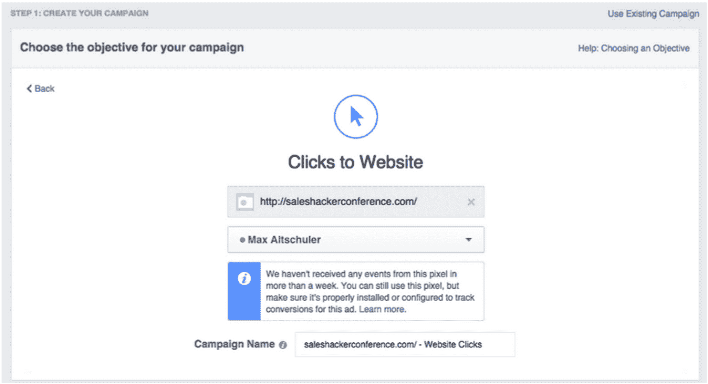
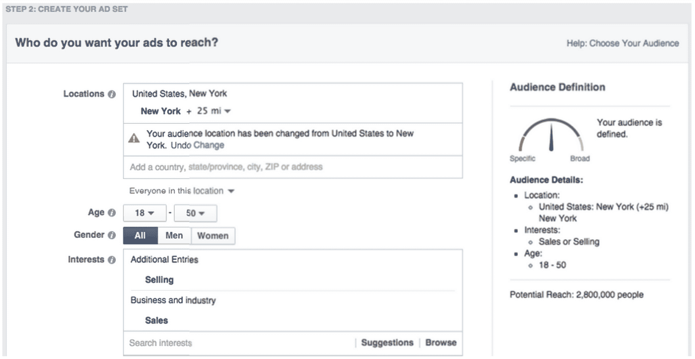
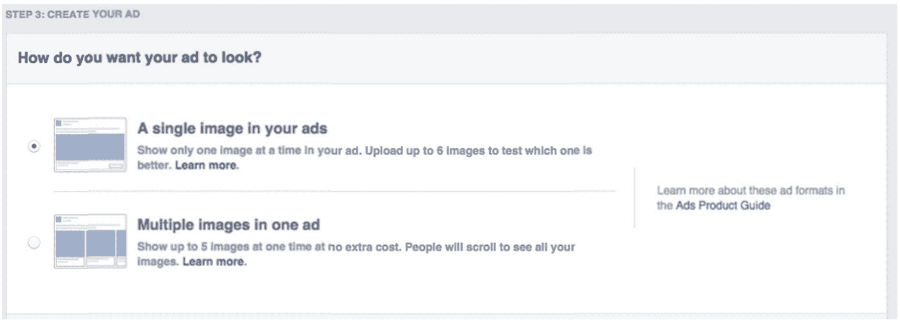
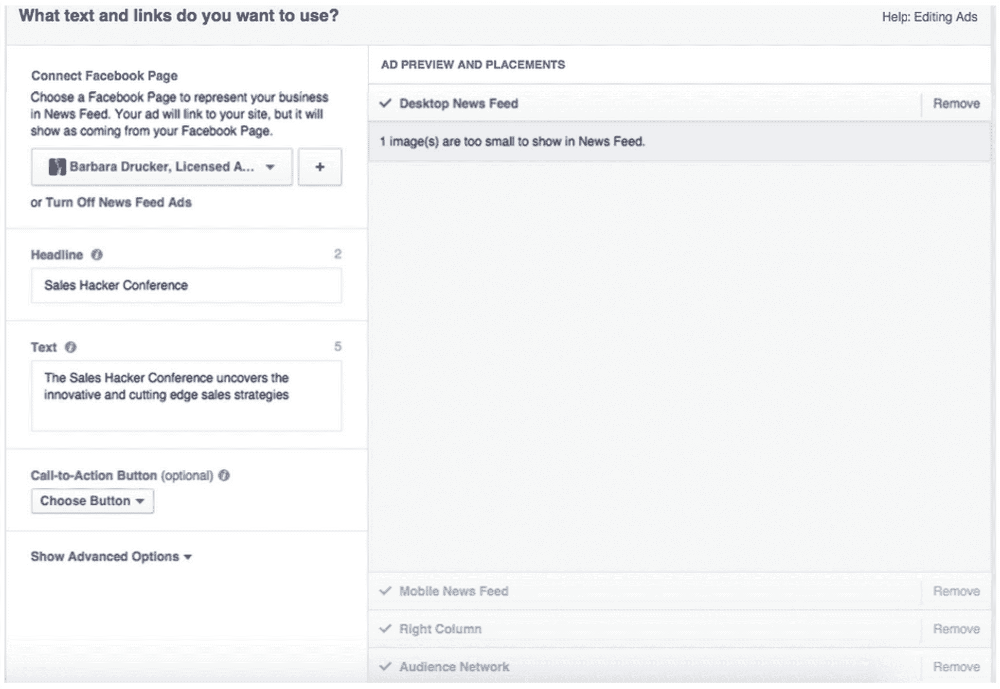
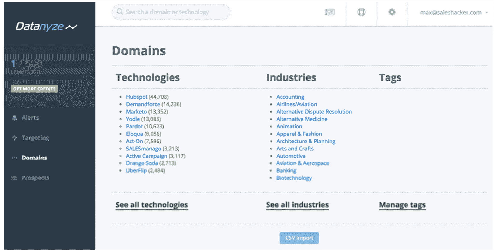
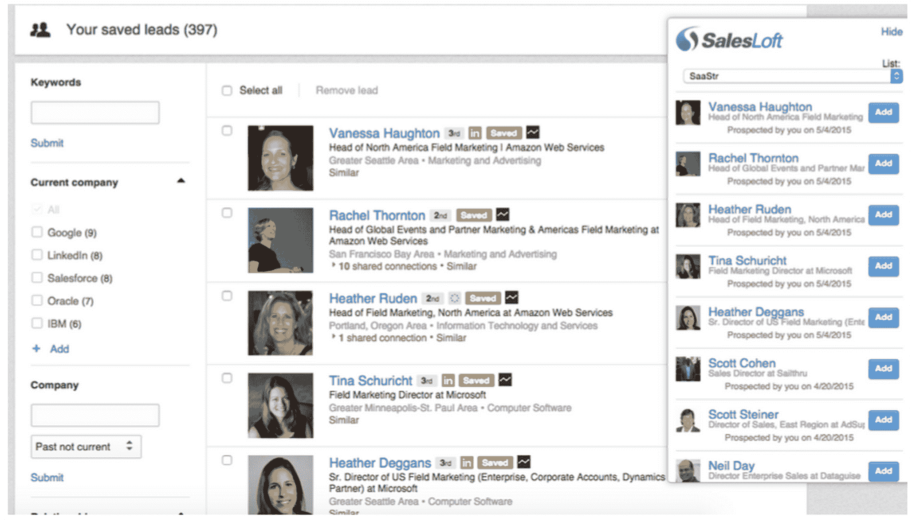

# 设计您的销售组合，让客户找到您|第一轮评审

> 原文：<https://review.firstround.com/designing-your-sales-stack-so-that-customers-come-to-you>

*回到 2011 年，****[Max Altschuler](https://www.linkedin.com/in/maxaltschuler "null")****加入了一个名为****[Udemy](http://www.udemy.com "null")****的早期教育科技市场，成为其第一个销售雇员。市场需要引入教师来创建在线课程，并且需要在预算非常紧张的情况下以每月 20%的速度增长。典型的集客营销没有足够高的接触度，不足以让人们愿意在前期投入如此多、没有财务保证的情况下做一些如此新的事情。Altschuler 必须找出不同的方法。*

*大约在 2011 年的同一时间，* ***[豪尔赫·索托](https://www.linkedin.com/profile/view?id=18279582&authType=OPENLINK&authToken=qWHp&locale=en_US&srchid=87031101434012273486&srchindex=1&srchtotal=1799&trk=vsrp_people_res_name&trkInfo=VSRPsearchId%3A87031101434012273486%2CVSRPtargetId%3A18279582%2CVSRPcmpt%3Aprimary%2CVSRPnm%3Atrue "null")*** *被 Mopub* *聘为* ***[的销售主管，也是该公司的第一个业务聘用。他的任务是为一个广告发布平台建立一个可扩展和可重复的销售流程，这是同类产品中的第一个。当 Jorge 开始在 MoPub 工作时，它有三个技术创始人，他们是 pre-revenue，在 Salesforce 中有大量非结构化的入站数据，并且没有销售流程。如果他们想扩大业务，就必须尽快想出办法。](http://www.mopub.com/ "null")***

这篇文章由 Altschuler 和 Soto 共同撰写，解释了他们如何应对各自的挑战，以及他们在这个过程中学到了什么，以便他们的智慧可以帮助他人。

如果你和我们一样，在创业公司建立销售流程的根本问题在于，你需要逐月创造更多的收入，而没有能力利用更多的资源。大多数公司需要依靠**外向**销售(潜在客户和拓展)来创造收入和完成交易。

对于正在阅读这篇文章的少数幸运儿来说，这对你有好处。但是你不够努力。你应该总是有人在外，即使这只是他们时间的一小部分，达到目标客户。想想财富 5000 强。

对外销售是一门艺术和科学。是的，技术和数据的可用性使它比以往任何时候都更容易和更有效。但你能做的最好的事情是将更多的外向销售转化为内向销售机会。这就是我们希望这篇文章能帮助您实现的目标。

请注意，没有灵丹妙药，每一个销售过程都是不同的，取决于大量的变量。我们将向您展示我们使用过的流程，以及我们一次又一次看到的工作。通过这里和那里的细微调整，几乎没有理由它对你不适用。

在我们开始做事之前，重要的是要知道现代销售人员有两条信条:

合适的人、合适的时间、合适的信息=成功

建造。测试。测量。优化。

我们走吧！

# 了解入站

“入站”是我们用来描述有组织地或通过营销活动(如广告、社交媒体、内容或其他东西)驱动到网站的流量的术语。这也被称为集客营销，也包括数字营销和内容营销。

我们将重点关注的集客部分是大多数初创公司花费大量营销预算的领域:**在线广告**。

作为有东西要卖的初创公司创始人或早期员工，我相信你对 AdWords、脸书广告、重定向或任何在线广告网络的运作方式都很熟悉。更有可能的是，这是你注册和潜在客户生成的依据。

你通过投放这些广告来吸引人们购买你的产品或服务，希望他们愿意继续你的下一步，不管是给你发邮件、打电话、要求演示，还是购买产品。

那么制作这个广告的过程是什么样的呢？我们将通过脸书过程作为一个例子。

**第一步——选择你活动的目标或目的。**

* *选择目的地。把 pixel 放在你的网站上，这样它就可以跟踪。* **第二步——选择你的目标受众。**

**通过选择特定的人口统计数据来挑选你的理想受众。这可以让你的广告更有针对性。*

**步骤 3 -找到合适的图片、描述和行动号召。**

这是你击中目标的信息。他们必须能够理解它。

让我们仔细看看这里发生了什么。脸书或任何其他广告网络允许您:

根据某些属性或变量锁定目标人群。

根据你的目标客户，设计一条信息向他们展示。

选择一个行动号召，让他们进入你选择的流程中的下一步。

这种类型的活动存在许多问题:

1.即使你可以选择你的受众，这也是你所能达到的目标。这可能对你的网站获得浏览量很有帮助，但对转化或让人们参与购买过程却没那么大帮助。

2.它可能非常昂贵，几乎没有真正的透明度，也没有什么可展示的。

3.因为 1 和 2，你几乎没有控制权。你很可能会把钱扔进风里。

4.你真的认为大公司的决策者会在这些网络上花费足够的时间来浏览脸书或谷歌的广告吗？任何曾经在大型组织中买卖过软件的人都会告诉你他们绝对没有。

现在，如果我说你可以针对更深层次和细分的列表，这样你制作的消息几乎总是 100%与收件人相关，会怎么样？哦，它会比你在广告网络上进行的活动花费更少。

# 以下是如何将外向营销转化为内向兴趣，从而更快、更频繁地达成更大的交易。

非常重要的是，如果你走上这条将外向转为内向的道路，你要按照步骤进行。如果你在漏斗顶端没有做功课就开展外向活动，你只是另一个垃圾邮件发送者。**就像广告活动一样，关键在于在正确的时间找到正确的信息和正确的人。**

你不会想把你的素食阿姨帕蒂作为你的牛排即服务活动的目标吧？

为了说明将外向转化为内向的过程，我们将使用一个类似于创建广告活动的逐步过程。在每一部分的结尾，我们将添加我们的**销售团队**服务，您可以使用这些服务来自动化或补充我们描述的流程。

# 第一步-找出你的目标受众或 ICP

在销售中，我们将这些目标受众称为我们的**理想客户群**。这类人和公司最有可能购买你的产品。ICP 分为两部分:公司和职位。随着公司规模或行业的发展，这种情况会进一步加剧。

例如，在一家 200 人的公司，你的目标买家是营销副总裁，但在一家 2000 人的公司，目标买家是数字营销经理。随着组织的成长，他们会雇佣更专注的角色。

您的目标越明确，对客户档案了解得越细致，您的外联活动就越成功。

在尝试确定理想的客户档案时，您可能需要问自己以下几个问题:

**我的客户正在使用哪些与我竞争、互补或可能转化为对我产品兴趣的产品？**

如果你有 Mailchimp 风格的服务，你想和 Mailchimp 的客户交流。

如果潜在客户正在运行脸书广告，他们可能也会对广告优化或分析软件感兴趣。

这些人在网络上生活在哪里？

对你的电子商务服务感兴趣的人可能在 [Shopify](http://www.shopify.com "null") 上有一个商店，或者用 [Magento](http://www.magento.com "null") 建立。

如果你想让人们在网上创建课程，去找那些已经以书的形式创建了相关内容并在亚马逊上出售的人。然后说服他们尝试视频内容。

**我如何看待我唾手可得的果实？**

这些人已经在做你想让他们做的事情，只是在别的地方。

在 Craigslist 上购买或销售贵公司提供的服务的人。让这个人在 Craigslist 上使用你比从头创建一个新的买家/卖家更容易。Pinterest 已经成为另一种寻找已经开始合作的潜在客户的方式。

你正在调查他们的广告支出预算，你看到一个潜在买家在竞争公司的网站上有推荐。你知道他们有预算，而且已经花在其他地方了。是时候去拿你的一片甚至整个馅饼了。

我能从以前达成的交易中解读出什么，以便在新的交易中使用？

你一直在与公司达成交易，所以花点时间问问自己，这些公司有什么共同点，我如何在与具有相同共同变量的公司交谈时应用这些共同点？

一旦你搞清楚了这一点，你会想要建立这些公司的庞大名单。以下是一些开始建立 ICP 列表的好地方:

LinkedIn 和脸书集团

[Meetup](http://www.meetup.com "null")

行业会议网站

贸易协会论坛和目录

像 LinkedIn 上的[和](http://www.indeed.com "null")这样的招聘网站。

公共法律文件

[嘎吱嘎吱](http://www.crunchbase.com "null")

[AngelList](http://www.angellist.co "null")

[玻璃门](http://www.glassdoor.com "null")

[Yelp](http://www.yelp.com "null")

购物化

[Etsy](http://www.etsy.com "null")

[Kickstarter](http://www.kickstarter.com "null")

任何公司数据库或市场

有大量的数据库可供你查询这些公司，找到更多的信息。要寻找的东西包括:

迄今筹集的资金数额

最后一轮加注的时间

员工人数

最近添加的新员工

添加的职位和新职位

公司总部位置

公关公告，如产品、资金、关键员工或合作伙伴

法律文件

考虑到这一点，你已经比在线广告更精细了，因为现在你可以通过最近的事件来锁定目标，而不仅仅是通过位置和年龄范围等静态属性。

# 以下是如何使用 [Datanyze](http://www.datanyze.com/ "null") 根据条件、行业和技术来确定目标。

Search by technology being used or industry.

Select from a host of other conditions to target your campaign.

例如，看看那些使用[轮毂的公司。如果你的产品与 HubSpot 有竞争力或互补，这是你感兴趣的。](http://www.hubspot.com "null")

**销售栈:**数据仓库，[内置](http://builtwith.com/ "null")， [iDatalabs](http://www.idatalabs.com/ "null")

# 第二步-获取正确的联系信息

到目前为止，你应该已经有了一些你知道会需要你的服务的公司的名单，并且知道在那家公司谁是合适的谈话对象。

如果你不知道确切的联系人，没关系。您可以尝试自上而下或自下而上的方法。你至少应该知道你要联系的人的职能(营销、销售、产品、财务、人力资源等)。

自上而下的方法以该职能部门的副总裁为目标，要求介绍给你应该与之交谈的合适的人。

自下而上的方法几乎是一种 B2B2C 模式，在这种模式下，你瞄准最终用户，让他们成为你的交易冠军。一旦他们尝试并喜欢你的服务，你就可以把他们作为内部销售人员来推销产品链。

下一步是为您刚刚建立的列表查找联系信息。为了将出站转换为入站，查找电子邮件是至关重要的任务。如果你想进入一个更高级的节奏，电话号码也是不错的选择，我们稍后会谈到。

这里列出的这些简单易用的工具将帮助你建立你全新的、新鲜的、准备好的清单。

**[领英销售导航](https://business.linkedin.com/sales-solutions/products/sales-navigator "null")**

将 LinkedIn 销售导航器与 SalesLoft 配对以获得最佳效果:

**销售栈:** [SalesLoft 勘探者](http://salesloft.com/products/prospector "null")， [Toofr](https://www.toofr.com/ "null") ， [DiscoverOrg](https://discoverorg.com/ "null") ，[捕捉！由 Ringlead](https://ringlead.com/capture/ "null") ，[领英销售导航](https://business.linkedin.com/sales-solutions/products/sales-navigator "null")

# 步骤 3 -研究、信息传递和行动号召

现在我们已经有了“合适的人”，是时候做“合适的时间”和“合适的信息”部分了。这就是所谓的领先研究，它是这个过程中非常重要的一部分。没有这个，你只是另一个垃圾邮件发送者。

为什么？因为你仍然需要了解你的潜在客户，这样你才能传递与他们相关的信息，并在销售过程中提供价值。

在接触重要的潜在客户之前，你需要尽可能多地了解公司和个人的信息。寻找触发因素或行动事件，作为此时联系他们的理由。

以下是触发事件的示例。

**在公司层面:**

筹资、流动性事件、收购或公司里程碑

新总部或扩建

关键管理人员招聘

良好的公关(公司在成长，产品发布，Ellen 上的 CEO 等。)

不错的博客帖子

竞争对手公关

奖励或认可

新合同或伙伴关系

**在员工个人层面:**

工作变动

奖励或表彰(成功举办 Dreamforce 活动后的现场营销经理)

不错的博客帖子

Twitter 或社交触发事件(你会从他们的 Twitter 上知道他们是否关心本地运动队赢得超级碗等。)

新人们购买新的产品和服务。当有人刚开始一份工作时，这是向他们表示祝贺和评估兴趣的最佳时机。

一旦你收集了你的信息，你需要将你的列表进行一点点的细分，以准备发送。当你对你的名单进行细分的时候，试着找到一个名单上的公司的共同点或变量。把它们放在一起，这样你就可以给它们发送一个看起来个性化但实际上不是的消息。

你的销售团队越小，你想要覆盖的范围就越广，所以试着找到一个更大的共同点。

在构思信息时，使用共同标准做一些事情:

打破僵局或建立融洽的关系。例如，如果你有一堆来自波士顿的线索，而爱国者队刚刚赢得了超级碗，你可以用“恭喜你赢了！在这个城市一定很开心。肯定是嗡嗡的！”你可以相当自信地说，它会与另一端的人产生共鸣，不会冒犯任何人。

**价值主张。他们都有相同的问题或痛点。**例如，共同点可能是行业。碰巧的是，几乎出租车和豪华轿车行业的每家公司都有同样的大问题(也许是喝醉的孩子搞乱了他们的车)。你的产品或服务恰好解决了这个问题。

老实说，这就是你在一封冷冰冰的邮件中真正需要的。所以基本上是这样的，“嘿，你很酷/我很酷。我想我可以这样帮你。我们聊聊天吧。”最多在智能手机上轻轻一按拇指就能采取行动。

利用你的研究来帮助你在同一时间向尽可能多的公司传达这两点。但是不要强求。使用共同点来划分你的列表，然后相应地设计信息。

最后，您的行动号召(CTA)应该是决定性的下一步。如果下一步是打电话，那就说出来，并指定一个时间。确保它清晰可追踪。

这些公司和个人的数据遍布互联网，但揭开它是困难的一部分。互联网可能是一个巨大的黑洞，所以你需要一个好方法来筛选噪音，找到有关你的潜在客户的公司的相关内容。许多解决这一问题的公司正在混合使用抓取、爬行、人工智能和大数据分析。

**销售栈:** [漏斗火](https://www.funnelfire.com/ "null")，[蜘蛛书](http://spiderbook.com/ "null")， [InsideView](http://www.insideview.com/ "null") ，LinkedIn 高级设置，[提提. io](https://mention.com/ "null")

# 步骤 4 - Cadence 和 BTMO

节奏指的是销售过程中电子邮件、信息、电话或任何接触点的数量，以及你这样做的频率。

典型的抑扬顿挫如下所示:

现在我们明白了这一点，你还记得本文开头的第二个咒语吗？建造。测量。测试。优化？我相信你已经从所有精益创业的东西中听说过了。这就是它真正发挥作用的地方。

此时，您已经具备了开始发送电子邮件所需的一切。你需要确保使用软件来跟踪你的活动，让测试和优化一切变得超级透明。

大多数软件允许你追踪打开率、点击率、浏览时间和回复率。

只跟踪你能从中衍生出动作的事物。打开率、点击率、正面回复率最重要。

打开率与主题行相关。如果打开率低，主题行可能是主要问题。

点击率是行动的号召。如果 CTR 很低，CTA 可能很弱，或者不是合适的下一步。

积极回应率与信息紧密相关。如果这是低的，你的信息或你的目标是关闭的。可能两者都有。

查看时间有助于了解某人查看电子邮件或附件的时间和次数。如果他们还没有回应，但这个数字正在上升，这仍然是一个好迹象。坚持传达类似的信息。

如果你没有得到回应，调整信息。

确保在足够大的列表上构建和测试，这样你就有足够的数据点。100 封邮件是一个测试的好起点。再少的话，样本量就太小了。此外，在多个列表源中测试它，因为这可能是一个不可预见的问题，不会在测试中显示出来。

**销售栈:** [ToutApp](http://www1.toutapp.com/ "null") ， [Cadence by SalesLoft](http://salesloft.com/products/cadence "null") ， [Outreach.io](https://www.outreach.io/ "null") ， [Yesware](http://www.yesware.com/ "null")

# 概括一下...

在第一步中，我们进行了高级定位，在公司和员工个人中寻找理想的客户资料。然后我们在第二步找到了他们的联系方式。第 3 步为我们提供了我们需要接触的环境，第 4 步则是传递信息和不断优化。

现在，任何回复给您的电子邮件都是您的潜在客户。使用我们提供的工具来设置这个过程可以很容易地实现自动化。整个过程也可以教给虚拟助手。因此，现在你有了一个外向引擎，它可以在花费你固定金额的同时，驱动有针对性的高质量的销售线索，而不是每个月都往风里扔钱并设置上限。

Udemy 和 Mopub 都能够有效地使用这些策略，让他们看到了前所未有的增长并击败了竞争对手。本文列出的步骤适用于几乎任何类型的 B2B 销售，无论是垂直销售还是其他类型的销售。

通过利用网络抓取器、新兴技术和外包帮助，Udemy 遵循这些步骤，将其讲师市场从 2011 年 5 月[的 1000 门质量低得多的课程](http://techcrunch.com/2010/08/31/udemy-funding/ "null")增长到 18 个月后[的 5000 多门高质量课程](http://techcrunch.com/2012/12/07/online-learning-marketplace-udemy-lands-12m-to-expand-its-course-catalog-go-cross-platform/ "null")，每月增加 400 多门。他们[最近的 D 轮融资公告](http://techcrunch.com/2015/06/02/udemy-raises-another-65-million-to-help-anyone-learn-anything/ "null")提到，他们现在有 80 种语言的 30，000 多个课程，估值估计在数亿美元。

在 Jorge 的指导下，Mopub 从零到数千个销售合格的销售线索。在 Jorge 的前四年，他建立了供应方面的内部销售流程，帮助推动了 1 亿美元的运营率和 3 . 5 亿美元的 Twitter 退出。在那里，Jorge 成为移动交换团队的内部销售主管。

马克斯现在经营[销售黑客公司](http://www.saleshacker.com "null")，帮助其他创业公司建立销售流程。他的许多关键发现，包括本文中讨论的许多发现，都在他的书《黑客销售》中。