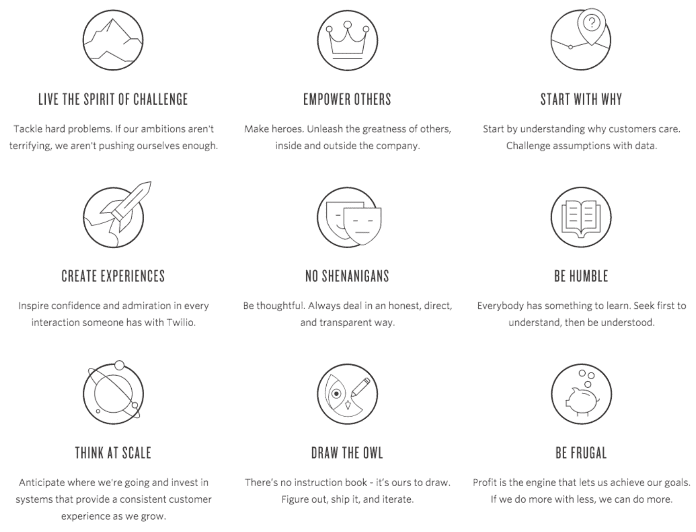
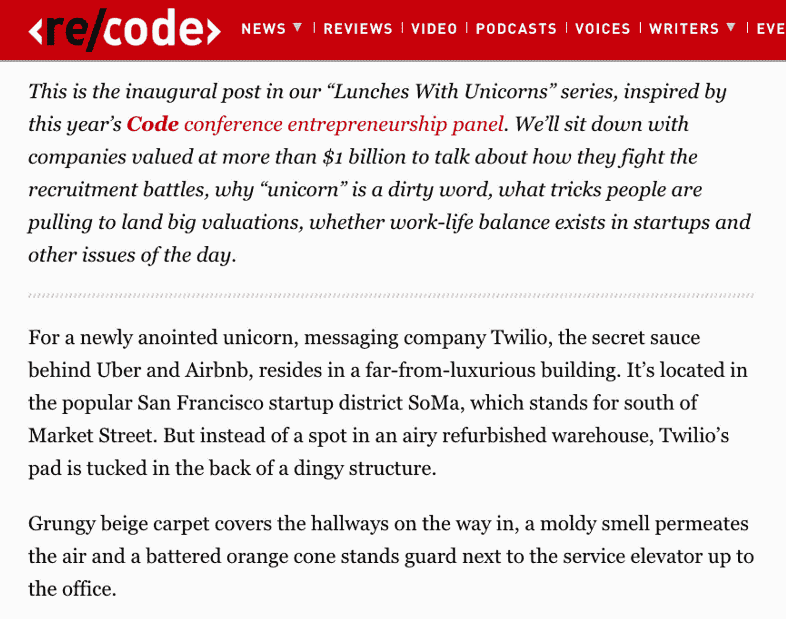

# 画出猫头鹰和其他你不知道应该有的公司价值观|第一轮评估

> 原文：<https://review.firstround.com/draw-the-owl-and-other-company-values-you-didnt-know-you-should-have>

这是关键时刻。 **[Twilio](https://www.twilio.com/ "null")** CEO 兼联合创始人 **[Jeff Lawson](https://www.linkedin.com/in/jeffiel "null")** 将公司所有员工召集到一条会议线路上的电话号码。然后他要求一名志愿者——他们谁也不知道他正和一群其他著名的首席执行官坐在一起。几分钟前，一位高管同事称赞了劳森在 Twilio 的价值观，但不知道他的员工是否知道并能说出他们的名字。一名志愿者站出来说:“简单，容易，强大。”劳森感谢她，她问他是否做得很好。“你做得太棒了，”他说。她完全错了也没关系。

这名员工的回答告诉劳森，他多年来对 Twilio 价值观的研究还有很长的路要走。她选择谈论 Twilio 产品的本质，而不是它的人民。那一刻揭示了价值观对不同员工的意义与表达价值观时考虑的因素之间的脱节。在亚马逊、StubHub 和 Twilio 的职业生涯中，劳森已经成为公司价值观的直言不讳的老师和学生。

在 First Round 最近的首席执行官峰会上，Lawson 分享了他在 Twilio 时成功和脆弱的例子，为公司价值观和文化带来了粒度。具体来说，他将自己的努力解构为三个部分:阐明、实践和改变公司价值观。任何一家被告知要做真实的自己，但遇到的无奈多于战术计划的初创公司，都会在劳森的书中找到安慰和指导。

# 从名词开始，而不是形容词

2010 年，当劳森用一只手就能数清他的员工时，他做了大多数初创公司认真对待时领导者会做的事情:他写下了公司的价值观。“我们的目标是把它们印出来——这样它们就在我们的控制之下，”劳森说。“我们召开了一次会议，提出了五个描述词:持续改进、注重细节、学习者、谦逊、渴望。我们在自己身上看到了这些特质，并认为它们会帮助我们吸引志同道合的人。所以我们向他们宣布了我们的价值观，并开始招聘。”

凭借这些价值观，Twilio 从 6 人发展到 70 人。但是在公众面前，前面提到的警钟，劳森改变了他的策略。他没有描述自己的价值观，而是更仔细地思考了他想要描述什么。“我意识到，无论我们想出什么，都可能必须说明 Twilio 背后的人是谁，我们的产品是什么，以及公司的各种流程，”Lawson 说。“对我们来说，如果我们要有一个价值体系，它必须包含人、产品和流程。”以下是更多内容:

**人**。在这一类中，你的价值观应该帮助你决定你应该雇用谁，应该解雇谁，以及你们在一起工作时如何对待彼此。创业公司在考虑价值观的时候，大多会考虑人。

**产品**。在大多数情况下，把你的产品和你的价值观联系起来是不太本能的。你的产品类型，它的特点，你如何对待你的客户，以及你如何应对围绕你的产品的威胁和机遇，这些都是你的价值体系的一部分。

**流程**。与流程相关的价值观与公司的决策方式有关。这包括你如何报告进展，让人们负起责任和相互信任。例如，大多数创业公司会说信任是至关重要的，但不会构建一个反映和保护这一优先事项的流程。

这些“3p”可能不是你选择定义和描述的实体，但在你支持你想要体现的形容词之前，选择你的名词是至关重要的。对劳森来说，这涉及到价值观和文化之间的区别。劳森说:“文化是硅谷和各地的初创公司一直在谈论的一个词。“它的真正含义是什么，它与价值观有什么关系？我的结论是，文化体现了你的价值观。”

价值观是文字，而你的文化就是你如何实际活出那些文字。

# 你的价值体系的三个阶段

那么，你实际上是如何实践你的价值观的呢？劳森的框架帮助他的团队阐明了 Twilio 的价值观，并帮助他们每天都遵守这些价值观。“正是在这一点上，大多数公司的价值观误入歧途。劳森说:“许多初创公司把它们归为海报和杯垫。我们的价值观是动态的，特别是通过三个阶段的生命周期，让我们进入下一个发展阶段。首先，我们阐明我们的价值观，然后实践它们，最后，检验它们。"

# 关节

首先，你的目标是阐明，而不是创造你的价值观。“这不是语义学。你不能创造你的价值。你不能坐下来说，“嘿，什么词听起来不错？“因为那只会让它们变得虚假，”劳森说。“这只会让它们成为空话。你不能创造你的价值。我有意使用‘清晰表达’这个词，因为我相信你所能做的就是通过内省确认你是谁，然后把你喜欢的东西拿出来清晰表达。”

有抱负，但要知道这些价值观的种子肯定已经播下。“这就是时机发挥作用的地方。劳森说:“你应该不早也不晚地阐明你的价值观。“不要在刚刚成立公司后就建立自己的价值观。你的公司还不够成熟；它的人、产品和过程都不是已知的实体。但也不要在公司的暮年去做。”

这和青少年时期没什么不同。来之不易的认识和性格定义的错误还没有发生。“人类需要经历青少年时期来发现自己，适应自己的皮肤。劳森说:“我相信更多的初创公司实际上也会经历这一过程。“你必须给它时间来烘烤，才能知道你是一家什么样的公司。但如果你等得太久，价值观可能会偏离自己的方向，当你找到它们时，你可能会不喜欢你找到的东西。”

当你在 20-40 名员工之间时，计划阐明你的价值观。不要在你三岁或五百岁的时候表达它们。不会太晚，也不会太早。

首先，阐明公司的价值观是首席执行官的工作——但不是一个人的工作。“事实上，如果你认为这只是首席执行官的工作，我怀疑公司会失败。劳森说:“要包容，因为这些价值观不仅仅是你的，创始人先生或首席执行官女士。”“它们是这个部落的价值观，而你正在做的是创造一个部落。人类是部落生物，因为需要群体和社区才能生存。所以，这个群体也必须被价值观所接受。”

以下是劳森如何带头阐明 Twilio 的公司价值观:

**召集各种各样的打**。一开始，劳森召集了全公司的 12 个人，在晚餐时讨论 Twilio 的公司价值观。这不是抽签——他选择了那些他认为能够深思熟虑地考虑公司长期成功的人。非正式地开始对话，但坚持认为这很重要:“我们一起努力阐明公司的价值观。让我们先来说说你认为你们之间的互动有什么价值，以及我们希望这里有什么样的人。”

记录想法，直到它们达到三位数。让你的小组即兴表演。有的会多产；其他人将需要一些时间来加速他们的引擎。但是每个人都需要先抛开那些显而易见或模糊不清的答案:诚实、努力工作、团队合作等等。这些可能是对的，但它们不应该是不受挑战的现任者。无条件收集所有想法。然后告诉十几个参与者谢谢你，并告诉他们你会跟进。

做总编辑。分组巩固思路。劳森做这个练习的时候，把 100+个想法组合成了大概 25 个价值观。一周后，召集小组，评估整合后的想法。问这个问题:这些想法中哪些能引起你的共鸣，哪些不能？

**让他们接受氧气测试。**第一轮反馈结束后，CEO 要再做一轮整合，直到剩下 10 个左右的值。最后一步是用一个问题来测试每一个价值:这些中哪一个是你不能没有的？目标是只保留那些自然的、不可或缺的东西，比如氧气。

在最后一次会议后，劳森和他的团队通过深思熟虑的包容性过程达成了九项公司价值观。“让你的部落认同价值观和价值观本身一样重要。劳森说:“当我们向公司推出这些产品时，有很多人因为参与了起草工作而投资于它们的成功。“事实上，当我们向所有人介绍这些价值观时，我让相关人员向公司介绍这些价值观。这个小组一起构思的，所以它必须来自我们所有人。这比摩西带着石板从山上下来要好得多，价值观的重要组成部分得到了认可。”

**以下是 Twilio 的九个价值观**:

Twilio's Nine Company Values

注意，所有的值都是戒律，而且几乎每一个都以动词开头。它们包含五个或更少的单词，其中没有一个是 10 美元的词汇。你在这里使用的语言很重要。使用人性化的、可操作的词汇，尤其是动词。这样，它们是面向行动的，更容易引起共鸣，也更容易实施。“这对我们来说是有意的，”劳森说。“我们之所以选择这些词，是因为我们觉得 Twilio 的员工和任何人都能理解*和*对他们的影响。这是他们生活的唯一方式。”

一个使用人类的、可操作的词语的强有力的例子是“画猫头鹰”这个 Twilio 价值观起源于一个互联网迷因，在公司早期像野火一样蔓延开来。“是的，这是一个迷因，但它是我们工作的一个很好的代表。没有说明书，也没有人会告诉我们如何工作，”劳森说。“现在，它已经融入了我们的文化，并被用来作为一种厚颜无耻但却令人鼓舞的回复，回复那些给 Twilio 的同事发电子邮件询问如何做某事的人。它提醒他们，他们已经——或者有能力找到——答案。另外，创业的部分机会和乐趣在于自己去发现它。”

现在，将这些与一个更具企业价值的例子并列:尊重、沟通、诚信和卓越。“如果你还没猜到，这些就是安然公司的企业价值观。劳森说:“这表明，在纸面上，所有的价值观都是好的。“这些价值观很容易让人选择，因为它们看起来非常合理。我相信你可以将它们应用到你所有的公司，并希望拥有这些品质，但要实现它们，首先要以一种可行的方式阐明它们。安然没有这么做。”

在某种程度上，劳森认为安然公司的价值观和 Twilio 公司的价值观有很多相似之处。“我能够将他们的价值观与我们的直接对应起来，但让我解释一下为什么我认为我们的更好。在安然，你得到了“尊重”听起来不错，对吧？“但尊重可能是一个如此模糊的词，很难知道一个人是否真正尊重，”劳森说。在 Twilio，我们有:保持谦逊。这是尊重的一个更具体的版本，也是可操作的。我们都知道什么是谦虚，我们都知道什么是不谦虚。我们对此有很好的感觉。"

现在来看看“诚信”的价值。“你们当中有多少人真正知道正直意味着什么？我不知道这是什么意思。劳森说:“我从概念上理解它，但我真的不知道此时此刻我所做的事情是否完整。“然而，在 Twilio，我们有一个叫做‘不耍花招’的概念。”人们知道他们是否在做恶作剧。当有恶作剧时，我们有一种直觉，也有权利叫别人出来。"

反思安然的“沟通”价值。“在 Twilio，我们从“为什么”开始，将其作为更具体的可操作的沟通原则。劳森说:“从‘为什么’入手表明，准确理解我们为什么要做某事至关重要。“在 Twilio，问为什么总是一个合理的问题。另一方面，‘交流’是如此模糊，以至于毫无意义。”

当你选择了你的指导原则，抵制称之为“核心价值观”的冲动“这个短语已经被毁了。劳森说:“没有人理解它的意思，因为他们大部分时间都在描述深奥的废话。“因此，在 Twilio，我们称之为‘9 件事’，因为我们希望将我们的价值观与大多数人认为的空洞价值观分离开来。‘东西’是任何人都能理解的东西。”

劳森承认，即使它们是具体的，九件事仍然很多。“研究人员说，人类可以记住 7 个正负 2 个东西。如果你问 Twilio 的普通员工是否能说出这九件事，答案可能是否定的。我可能会漏掉一件。劳森说:“但是，思考这个问题的方式是，人们会选择那些最能引起他们共鸣的东西——那些他们能过得最充实的东西。”。“三到五年对我们来说是行不通的。当你试图把它缩小到如此小的数量时，你最终所做的是把这小数量的东西变得更加抽象和包罗万象。不要用“画猫头鹰”来换取“正直”"

# 实践你的价值观

实践你的价值观没有诀窍——它不可避免地从领导者开始。“这是我的第一个基本信念。首席执行官和创始人必须成为价值观的典范。句号。大家看你做的每一件事。劳森说:“如果你不去实践它们，别人也不会。

你的目标不是雇佣那些展示你价值观的人，而是那些没有能力实践你价值观的人。

随着公司的发展和你的招聘，要考虑那些有能力实践你价值观的人，而不仅仅是那些展示出这些价值观的候选人。劳森说:“他们可能活不到今天，这没关系，因为我们是想要融入的部落生物。当他们来到你的公司，如果他们不是做不到，他们可能会非常努力地采纳你的文化价值观。对候选人来说，你是在确定公司价值观的方向和动力，而不是靶心。”

寻找一个能完全反映你公司价值观的候选人的挑战在于，你可能会雇佣那些看起来和听起来完全像你的人。“这不是建立公司的正确方式。劳森说:“你的工作是剔除那些与你的价值观不一致的人，并培养那些能融入你的文化的人。“最困难的事情之一是，有能力践行这些价值观的人却没有这样做。你让某人回归价值观的方法是，尽可能立即纠正他们。”

劳森最喜欢的例证来自一个超越技术和科技的世界:餐饮服务业。在 *[摆桌子](http://www.amazon.com/Setting-Table-Transforming-Hospitality-Business/dp/0060742763 "null")* 中，纽约餐馆老板丹尼·迈耶回忆了他第一次了解如何让服务行业运转的时候。当迈耶还年轻、相对不出名的时候，他曾经问一位经验更丰富的餐馆老板，他是如何学会让所有员工做正确的事情来热情招待客人的。那人收拾桌子，让迈耶把盐罐放在桌子中间。迈耶一把它放在中间，餐馆老板就把它从中间移开，并问他它在哪里。迈耶指着它，餐馆老板让他把它放在中间。这种模式重复五六次，直到迈耶准备认输。

餐馆老板停下摇动器，注意到了他的眼睛。“重点在这里。你的员工和你的客人总是把你的盐瓶从中心移开。这就是他们所做的。那是他们的工作。这是生活的工作。这是熵定律，”劳森解释道。“除非你明白这个道理，否则每当有人把盐瓶移离中心时，你都会很生气。生气不是你的工作，你只需要明白他们就是这样做的。你的工作就是每次把盐瓶移回来，让他们知道你到底代表什么，让他们知道优秀是什么样子。”

当涉及到用公司价值观引导你的团队的艰难工作时，不要生气。只要把盐瓶放回中间，人们就明白了。

对劳森来说，从迈耶的故事中可以吸取一个关键的教训。“如果有人无法实现你的价值观，这是一个很容易的决定。劳森说:“即使她表现很好，你也会离开他们。“然而，最困难的是，他们有能力实现你的价值观，但出于某种原因却没有这样做。然后你需要移动盐瓶，直到他们这样做。”

这是另一个让你的感官适应日常价值观的原因。“你知道，如果他们在一天中决定性的*和*无聊时刻被灌输，他们就会工作并有意义。你在走廊里、董事会议上和会议上听到过吗？劳森说:“这些都是它们正在发挥作用的信号。“我们听到人们在结束谈话或辩论时会说‘不要耍花招’但最令人鼓舞的信号之一是，当 Twilio 以外的人——他们不每天与我们一起工作——注意到我们的价值观时，我们的价值观正在发挥作用。"

例如，Twilio 的“节俭”价值观最近在科技媒体上引起了关注。“一名记者为一个名为‘与独角兽共进午餐’的系列采访了我她把我们的办公室描述为“一个藏在昏暗建筑后面的‘一点也不豪华’的建筑”。“她叫出了‘肮脏的米色地毯’和‘一个破旧的橙色圆锥体’站在电梯旁边，”劳森说。很多人会对他们公司的这种描述感到震惊，但实际上我很自豪。我们的“节俭”价值观正在被实践，并被那些观察者看到。"

也就是说，虽然人们诠释你的公司价值观是不可避免的，也是很重要的，但领导层应该始终权衡如何应用这些价值观。“关于节俭的价值，我看到它以完全错误的方式表现出来，”劳森说。“你们中有多少人家里有一堆 Hanes Beefy-T，是从一家公司得到的赠品？如果你公司的价值观是节俭，你可能会选择 5 美元的 Hanes Beefy-T，而不是更合身的 7 美元的美国服装衬衫。但正确的答案是，扔掉的 5 美元不是节俭，而是顾客真正欣赏的 7 美元是对你的钱更有价值的使用。”

思考你的价值观在各种情况下如何听起来最真实需要一些深谋远虑，但是明智地应用它们是必须的。“留意那些以你意想不到的方式诠释价值观的方式。劳森说:“这既有积极的一面，也有消极的一面，取决于具体情况。

Twilio 的“画猫头鹰”价值是一个完美的案例研究。“一些员工以一种象征性的、自我参照的方式，独自在我们的办公室里画了一幅猫头鹰壁画。我认为这真的很酷，是实践价值观的直接结果。劳森说:“当人们在没有提示的情况下自己唤起价值观时，你就知道事情进展顺利了。或者，几年前 Twilio 的软件有五个不同的构建和发布系统。事情是这样的，五个独立的团队想要一个稍微改进的系统版本，所以他们每个人都“画了一只猫头鹰”并构建了他们自己的系统。最终的结果是不同程度的质量，这些系统可用性的测试覆盖率。真是一团糟。当我听到风声时，我问为什么我们会有五个不同的构建系统。回答是:‘好吧，画猫头鹰。我们有一个问题。我们解决了这个问题。这是一个有趣且意想不到的应用。"

期望你的员工以你从未想过的方式建立你的价值观。但是他们的解释可能不是理想的应用。监控价值观如何体现。

底线:经常评估你的价值观如何在整个公司转化为现实。“我从来没有想到《画猫头鹰》会被以一种现在回想起来看起来很傻的方式来解读，”劳森说。“我们得出的结论是，画猫头鹰实际上是好的，但在某种程度上，看上下文中发生了什么是领导的工作。如果有一个问题需要解决，那就去以一种更全面、更彻底的方式解决它。”

# 改变价值观

如果公司如此努力地表达和实践他们的价值观，很容易看出他们如何抵制改变这些价值观。但事实是，一个公司的价值观，就像组织本身一样，遵循一个生命周期。“比方说，你已经阐明了自己的价值观，并在其中生活了几年，然后意识到它们可能并不完全合适。劳森说:“这是常有的事。“还记得对青少年时期的类比吗？你们中有多少人在 13 岁时就完美地阐明并确立了自己的人生指导原则？你不应该指望完美无缺地表达你的公司价值观，因为很多事情都在发生变化:员工人数、产品、作为领导者的创始人，等等。”

对改变你的价值观持开放态度，但不要太频繁。“如果你每季度改变一次，它们就不再是你的价值观，而是战略。为了使价值观有意义，你需要有连续性。你可以改变它们，只是不要太频繁。劳森说:“每隔几年，就进行调整。“我想改变 Twilio 的两个价值观:‘活出挑战精神’和‘规模化思考’。”我不认为第一个足够可行，第二个是一个非常复杂的信息。大规模思考的目的是激发人们想得更大，但这实际上是给了你一张免费的通行证，让你在创造出一个大的解决方案之前永远不要发货——而不是迭代发货。"

大约一年前，劳森召集了一群不同的人，讨论他不认同的两种价值观。他不知道最好的解决方案是什么，所以他采取了与帮助表达初始价值观的团队相同的方法。劳森问了一个简单的问题:如果我们要改变其中一些价值观，我们会把它们改变成什么？“总的来说，人们反对改变或交换价值观。我无法让他们让步，”劳森说。“但是记住。是部落的价值观，不是我的。我不能强迫这些改变。人们非常喜欢它们，因为他们每天都生活在其中。”

# 振作起来

Twilio 有每年拍摄公司照片的传统。从 2010 年团队中的六名成员到今天他的 400 人的强大公司，这些照片让他想起了吸引、留住和发展 Twilio 的价值观。在 Twilio 不断壮大的团队背后，是劳森制定的三阶段公司价值观体系。首先，它是用语言表达——而不是创造——你的员工、产品和流程代表了什么。当你的价值观在公司内外得到体现和诠释时，它们就会成为你的文化。最后，你的价值观不能过于神圣而不能被定期评估，即使公司最终保留了它们。

“领导一家公司意味着成为其价值观的自觉守护者。这是一个要求，而不是一个美好的拥有。因为，现实是:无论你是否用语言表达，每个公司都有文化和价值观，”劳森说。“你也可以清晰地表达它们，这样它们就在你的视线范围内，你可以引导它们。”