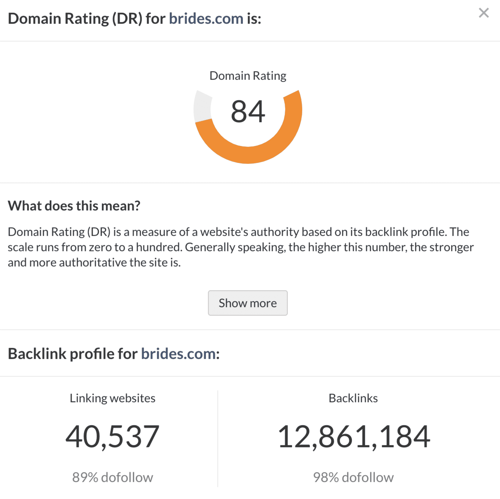
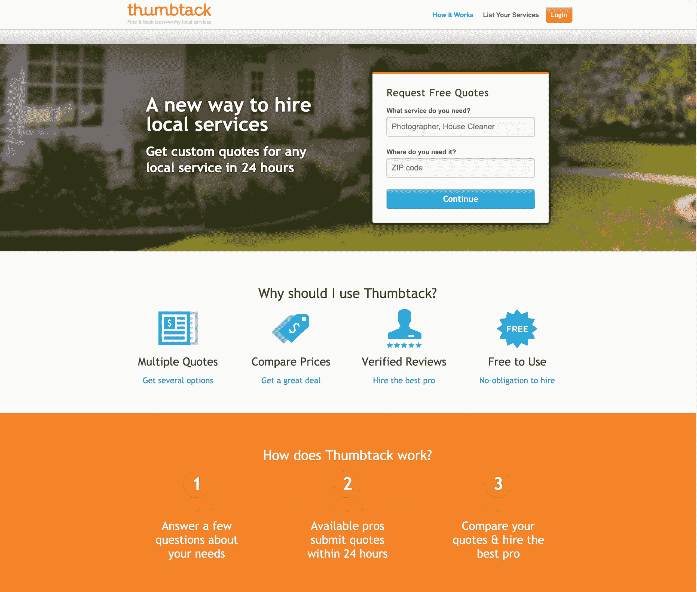
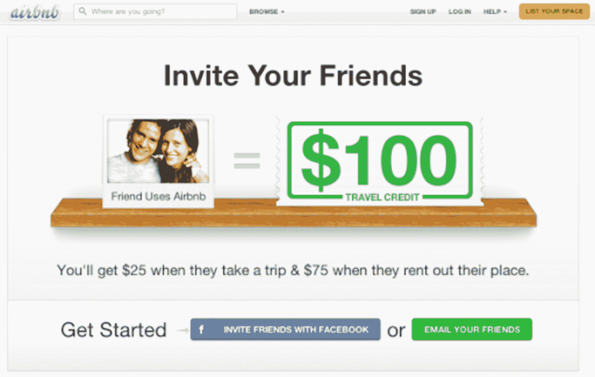
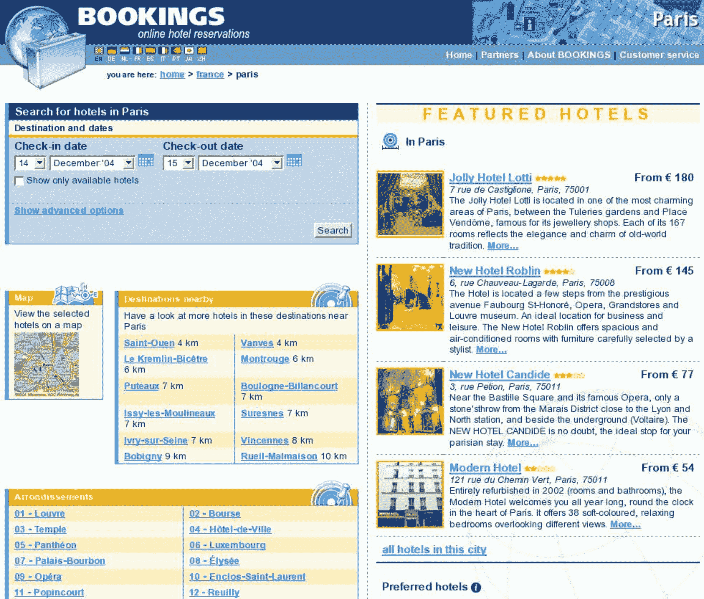
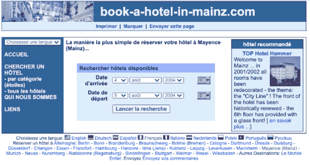
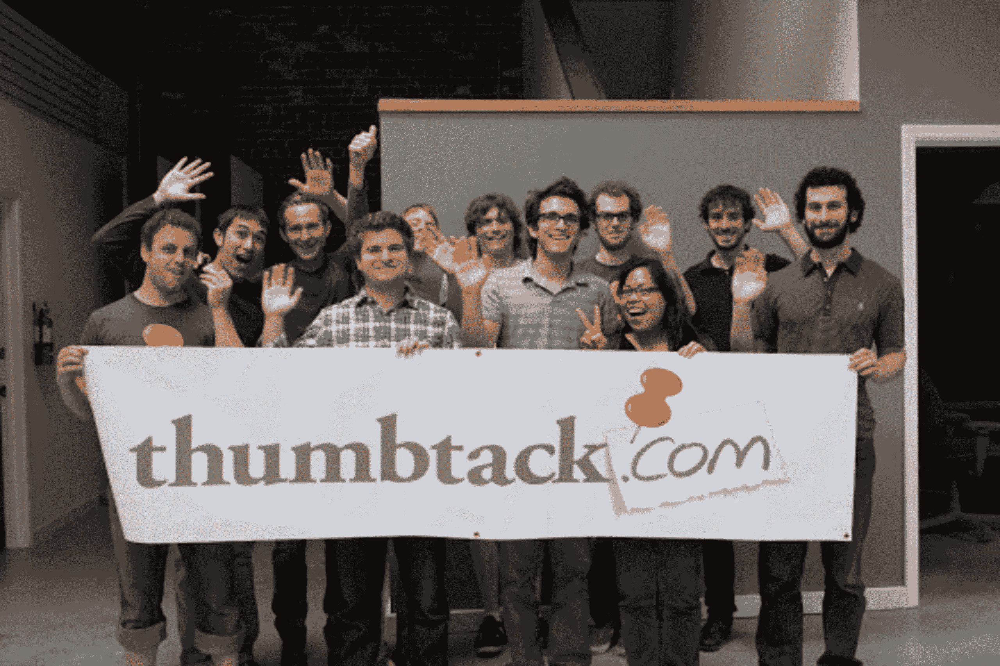
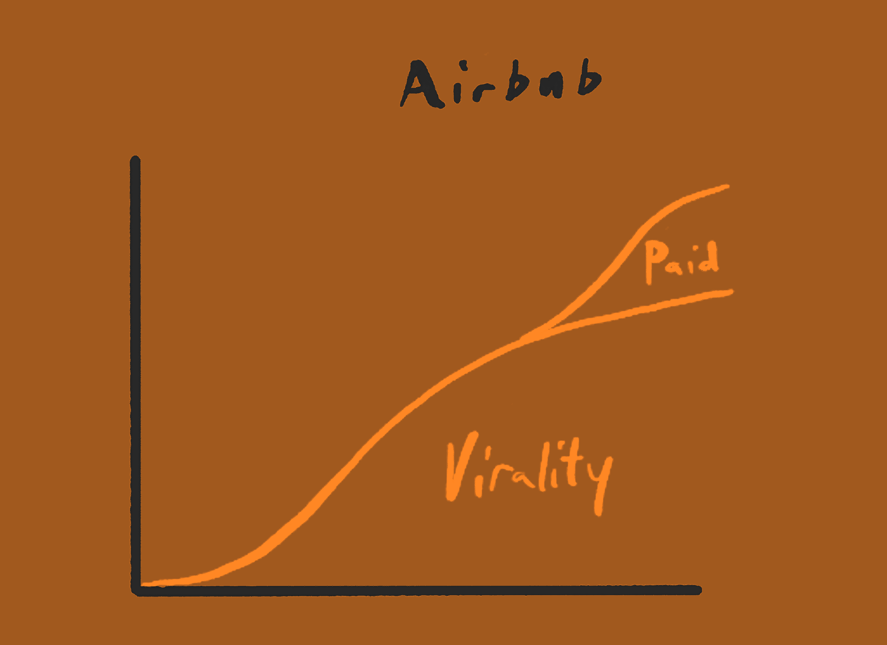
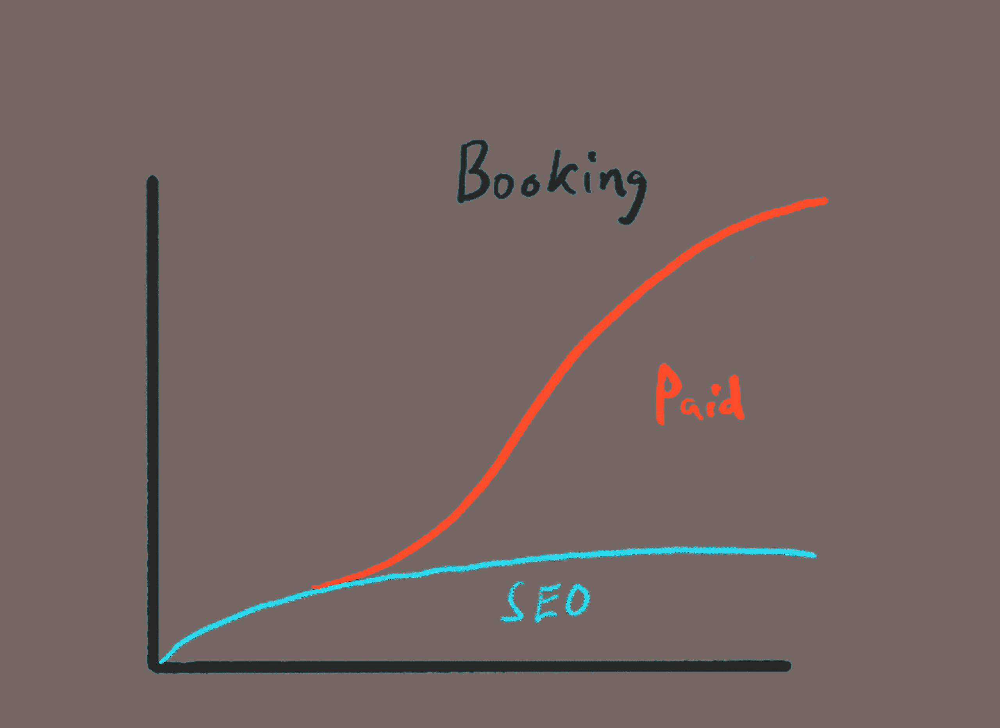
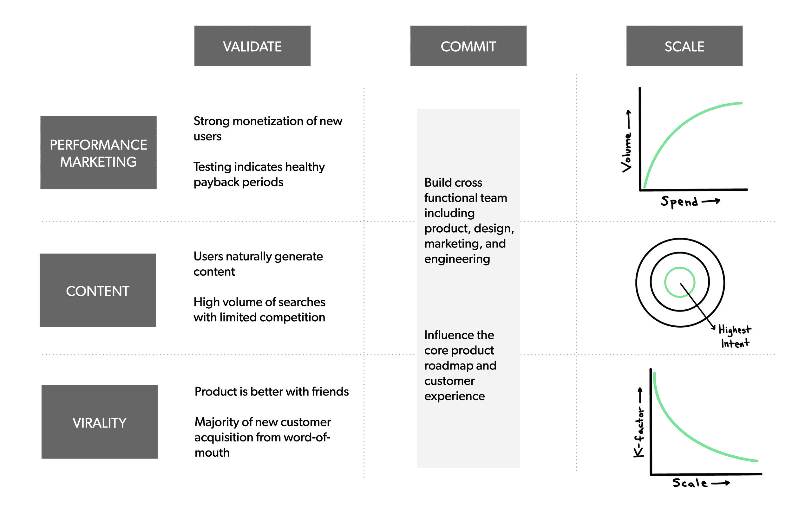

# 通过选择正确的路线推动增长——消费者创业公司的客户获取剧本|第一轮回顾

> 原文：<https://review.firstround.com/drive-growth-by-picking-the-right-lane-a-customer-acquisition-playbook-for-consumer-startups>

## 介绍

*本文由* *[丹·霍肯迈尔](https://twitter.com/danhockenmaier "null")* *(成长战略公司* *[创始人基础一](https://www.basisone.com/ "null")* *和图钉公司前成长营销总监* *[莱尼·拉奇斯基](https://twitter.com/lennysan "null")**(Airbnb 前产品负责人和消费者供应成长主管)。*

作为早期和成长期公司的顾问，我们花很多时间与创始人谈论增长。我们听到的一个更常见的问题，尤其是在早期，是关于寻找更多的成长方式。问题通常是这样的，“我们如何才能增加一些搜索引擎优化？”或者“我们怎样才能让我们的产品更具病毒效应？”

不幸的是，这往往导致创始人一头栽进最常见的创业失败模式之一:一次投资太多渠道，结果对任何一个渠道的投资都不够。举个例子，在搜索引擎优化和病毒传播上押大注*感觉*像是一个非常好的主意(“我们将以两倍的速度增长！”)，但实际上很少奏效。通常不清楚这些途径中的任何一个是否是你创业的正确渠道。我们发现自己一遍又一遍地重复着同样的建议，所以为了节省创业的时间和痛苦，我们决定把我们的想法写在纸上。

根据我们的经验，创始人通常会惊讶地发现，获得可扩展新客户的途径非常少。对于消费品公司来说，只有三条增长“通道”构成了大部分新客户的获取:

**1。绩效营销**(例如脸书和谷歌广告)

**2。病毒式传播**(如口碑、推荐、邀请)

**3。内容**(例如 SEO、YouTube)

还有两条额外的途径(销售和合作伙伴)我们不会在本文中涉及，因为它们在消费者业务中很少有效。还有其他策略来促进客户获取(如公关、品牌营销)，但上述路线是长期和可持续业务增长的唯一可靠途径。

为了证明这一点，让我们回顾一下过去 10 年中最成功的消费者业务——每家公司都是通过在以下三个领域中的一个领域表现出色而在市场上取得初步规模的:

好消息是，你通常只需要擅长一个领域就能建立一个成功的企业。坏消息是这并不容易。

一旦你达到中等规模，这些领域中的每一个都会变得非常有竞争力。在付费营销和搜索引擎优化的情况下，你是在争夺客户的注意力。付费营销成为一种商业模式竞争(谁能把这种客户注意力转化为足够的价值，使他们比任何人都更能为这种注意力出价)，而 SEO 成为一种排名算法竞争(谁能以这样一种方式利用他们的内容，即像谷歌这样的“决策者”希望继续为他们带来流量)。

在病毒式传播的情况下，你在竞争更珍贵的东西:顾客的社会地位。消费者只想推荐那些通过真心实意地帮助他人，或者只是让他们看起来很酷，从而改善他们关系的东西。你可以通过合适的 UX 和激励措施来增加推荐，但只能在一定程度上。

随着时间的推移，公司通常会在早期增长渠道上实现收益递减，从而增加额外的渠道(例如，图钉在 SEO 上增加绩效营销)，但几乎在所有情况下，公司都是从一个成功的渠道开始的。

你可能会奇怪——为什么公司成长的途径如此之少？嗯，这是因为人们了解新产品的途径很少。想一想——你是如何发现新产品的？你要么是从朋友那里听说的(即病毒式传播)，要么是在做一些不相关的事情时偶然遇到的(即内容或效果营销)，要么是公司直接联系你的(即销售、合作关系)。就是这样。这些实际上是公司寻找新客户的唯一渠道。因此，持续增长的“通道”非常少。

Dan Hockenmaier (founder of growth strategy firm Basis One and former director of growth marketing at Thumbtack)

下面，我们将分享我们的选择框架，带您浏览三个在某一领域成为世界级公司的案例研究，然后回答一些常见问题。为了编写这份剧本，我们采访了创始人，着手进行初步研究，并借鉴了我们自己在 Airbnb 和 Thumbtack 的经验。

在我们进一步探讨之前，有一点很重要:虽然消费者业务只有三条增长路线，但这并不意味着只有三个“剧本”来推动增长，或者永远不会有其他选择。

新车道偶尔开辟出来。车道只是决定了道路的规则——你仍然可以以独特和创造性的方式沿着每条车道行驶。

正如你将在下面的案例研究中看到的，一旦一家公司开始高度复杂地执行，他们通常会发现渠道、策略、UX 和信息的独特组合难以复制。

# 框架

Lenny Rachitsky (a former product lead and head of consumer supply growth at Airbnb).

好的，有三条车道，你需要赢得其中一条。你如何选择并赢得一条球道？创业公司经常以一种随意的方式追求这种选择，最终赌错了方向，或者试图一次赢太多。为了帮助您完成这一过程，我们开发了一个三步框架:

**1。** **[验证](https://editorial.proof.pub/firstround/entries/container_e10affc1cc254dcaa13d7b91d52af669/edit/#text_f193f53a47904c41bf80acbd5f7bab7b "text_f193f53a47904c41bf80acbd5f7bab7b")** 那一条车道适合你

**2。** **[提交](https://editorial.proof.pub/firstround/entries/container_e10affc1cc254dcaa13d7b91d52af669/edit/#text_832ab9075f77416b9610801f8fc9677b "text_832ab9075f77416b9610801f8fc9677b")** 必要的资源给莱恩一个实实在在的机会

**3。** **[规模](https://editorial.proof.pub/firstround/entries/container_e10affc1cc254dcaa13d7b91d52af669/edit/#text_e63d2fb4a25e466aa4355f7fba48661a "text_e63d2fb4a25e466aa4355f7fba48661a")** 投资成为世界级

下面，我们将带你了解每一个步骤，并分享三个世界级公司如何在各自领域实现每一步的真实例子(内容方面的[图钉](https://firstround.com/review/drive-growth-by-picking-the-right-lane-a-customer-acquisition-playbook-for-consumer-startups/#text_21ddb55873d842cda94a509283406324 "null")、传播方面的[Airbnb](https://firstround.com/review/drive-growth-by-picking-the-right-lane-a-customer-acquisition-playbook-for-consumer-startups/#text_e4bb71bae8314f2bb08d6bfc29985587 "null")和效果营销方面的[Booking.com](https://firstround.com/review/drive-growth-by-picking-the-right-lane-a-customer-acquisition-playbook-for-consumer-startups/#text_c185981fd7824397b3e796f3b89911ff "null"))。让我们开始吧。

*[跳转到帖子末尾](https://firstround.com/review/drive-growth-by-picking-the-right-lane-a-customer-acquisition-playbook-for-consumer-startups/#text_143559db9f4640e7b03cab250de83beb "null")* *查看框架全文。*

# 第一步:验证

第一步是(尽可能便宜地)验证给定的路线是否适合您的业务。有两种方法可以验证这一点，当这两种方法结合起来时，将有助于您建立信心，相信某条路线是值得投入的。

## 方法 1:确定哪条路线最适合你的商业模式

每个领域自然适合不同的商业模式。由于每个领域在规模上都极具竞争力，您将需要与您的业务相适应的内在优势。以下是我们所依赖的一些经验法则:

**绩效营销**非常适合以下情况:

您直接从新用户那里获得收入(例如购买产品、订阅服务)，然后您可以用这些收入来资助更多的营销活动

客户自然不会去寻找你的产品，因此你必须去找他们(例如一个新的 DTC 品牌)

**病毒式**是一种自然的契合，如果:

当你的朋友或同事在使用你的产品时，你的产品会更好(例如 Snapchat)

分享产品本身就很有趣(例如旅行照片、待售房屋)

**内容**是自然适合的如果:

您的用户在使用您的产品时自然会生成公共内容(例如评论或问题答案)，您可以用这些内容来吸引新用户

你有很多独特的数据(比如西雅图的餐馆，凤凰城的水管工)，你可以把这些数据转化成丰富的自动生成的页面

[Casey Winters 为第一轮评审撰写了关于该框架的权威文章](https://firstround.com/review/pinterest-and-grubhubs-former-growth-lead-on-building-content-loops/ "https://firstround.com/review/pinterest-and-grubhubs-former-growth-lead-on-building-content-loops/")，其中包括一个方便的指南:

一个有用的捷径:**向在不同市场使用相似商业模式的类似公司学习**。如果他们在某个特定领域非常成功，这可能意味着你也可以。例如， [Rich Barton](https://en.wikipedia.org/wiki/Rich_Barton "null") 创立了三家最终都掌握了内容领域的公司:Glassdoor、Expedia 和 Zillow。虽然这些公司在不同的行业竞争，但它们在客户搜索模式和内容生成方面有相似之处，他已经能够反复利用这种方法。

## 方法 2:查看您的数据

在理想情况下，您可以通过现场测试来验证通道，但是直接测试每条通道所花费的时间和精力是高度可变的。绩效营销可能只需要 2-4 周的时间来测试。病毒式传播(比如推出转诊计划)往往 1-2 个月就能检验出来。SEO 通常需要最大的投资，许多公司在 3 个月或更长的时间里没有任何结果。

出于这个原因，你会看到付费营销的验证通常是直接通过测试来完成的，搜索引擎优化通常完全通过第三方数据来验证(例如 Google Keyword Planner)，而病毒式营销则介于两者之间。以下是我们对通过数据验证车道时应寻找的信号的建议:

**付费营销:你的测试产生了付费客户，并有一个健康的回收期**

因为通过脸书或 AdWords 等渠道开展付费营销测试相对容易且便宜，所以简单地启动测试应该是你的验证策略的核心。

最重要的衡量标准是回收期:你赚回赢得一个客户所花费的时间。这是至关重要的，因为它决定了你能多快再投资更多的付费营销。对于大多数企业来说，随着规模的扩大，投资回收期只会越来越长，所以从一开始就要做得非常好。否则，你需要有一个清晰的视线来改善它，如通过转换率或货币化的改善。

对于低频交易业务(如购买汽车保险)，一个常见的目标基准是第一次购买的回报。对于高频交易业务或订阅业务(电子商务、媒体订阅)，6-12 个月内的投资回报通常被认为是健康的。

**病毒式传播:如今，超过 50%的新客户是通过口碑获得的，客户自然会向他们的朋友和家人介绍你的产品，你已经进行了一些成功的实验，增加了这种行为。**

如果你最满意的客户还没有谈论你的产品，或者自然地与他们的朋友分享，就很难让病毒式传播成为你获取客户战略的基石。

即使他们是，你也要了解你是否有能力影响这种行为，比如通过一个你鼓励顾客分享的实验。

**内容:有大量的关键词与你的产品相关，而且这些关键词不是由竞争对手主导的，很难被取代。**

通过像 [Keyword Planner](https://ads.google.com/home/tools/keyword-planner/ "null") 这样的工具进行关键字研究，可以帮助你了解与你的业务相关的查询的搜索量。你在寻找与你的产品直接相关的关键词。如果你在网上卖婚纱，像“网上买婚纱”这样的关键词比“婚纱的价格”更相关。根据 Keyword Planner 的数据，前者每月有 1 次 10K 搜索。

同样，你可以搜索这些关键词，看看谁在为他们排名，了解竞争有多激烈。“网上购买婚纱”的第一名是 brides.com。通过进入 *[Ahrefs](https://ahrefs.com/ "null")* 网站权限工具，我们可以看到他们的域名权限为 84。这是相当强大的，很难与之竞争。

## 案例研究#1:图钉如何验证 SEO

Thumbtack 是一个面向家庭服务、活动、课程、健康和许多其他类别的本地服务专业人员的市场。在公司早期的许多年里，团队都很精简，筹资也很困难。因此，当他们第一次将注意力转向加速市场的需求端时，他们知道他们必须集中精力。

Thumbtack’s homepage in 2012

图钉的联合创始人之一桑德·丹尼尔斯 深深地参与了这些努力。以下是他对早期战略的描述:

*资源是有限的，所以我们采取的方法是，我们需要仔细选择赌注，当我们做出选择时，基本上用我们 100%的资源全押。我们认为其他一切都是干扰。*

但是，哪里才是应该关注的领域呢？该团队集思广益，通过数百个想法来推动增长:电子邮件，博客，游击营销，合作伙伴关系，付费营销，等等。

然后有一天，另一个图钉创始人在卡斯特罗的一个酒吧里，和一个陌生人搭讪。当话题转到图钉时，陌生人打开他的手机，做了一些搜索，说，“你知道…你有一个巨大的搜索引擎优化机会。”这引发了连锁反应，最终帮助图钉达到突破规模。那个陌生人最终成为了天使投资人、导师和第一个外部董事会成员——但那是另一回事了。

Sander 描述了团队如何验证 SEO 是正确的方法:

“这不仅仅是一个随机的赌注，而是一个经过计算的赌注。我们通过三种主要方式对其进行了验证，这三种方式结合起来给了我们信心，如果我们执行得好，渠道将会有回报:

**关键词研究。** *“我们查看了谷歌关键词工具，发现有人在大量搜索与我们产品相匹配的关键词。人们在那里寻找“奥斯汀的搬运工”和“塔拉哈西的电工”。例如，他们没有搜索“与我的朋友交流的应用程序，在那里我的消息在被查看后消失”。所以对于 Snapchat 来说，SEO 毫无意义。”*

**竞争研究。** *“我们看了比赛，看到不是过饱和空间。搜索引擎优化领域的玩家很多是本地玩家，而不是国内玩家，所以我们认为我们可以产生影响。”*

**同类公司。“我们已经看到类似 Yelp 和猫途鹰这样的公司在 SEO 领域取得了成功。”**

## 案例研究# 2:Airbnb 如何验证病毒式传播

Airbnb 早期增长的大部分是由口碑推动的:旅行者告诉他们的朋友他们在 Airbnb 度过了美好的时光，主机告诉他们的朋友他们在 Airbnb 上托管的收入。

随着公司的成熟，加速增长成为一个话题。已经有一个小团队在做效果营销(约占预订量的 10%)，还有一个新生的 SEO 团队，但绝大多数增长仍然来自口碑(预订量的 50%以上)。在这一点上，Airbnb 有三个选择:在已经奏效的东西上加倍下注(口碑)，在这些潜在的未开发机会中进一步投资(付费或 SEO)，或者尝试一些全新的东西。该团队决定加倍投资，进一步提高口碑传播速度。这项投资导致了 Airbnb 历史上最大的增长加速之一。

团队是如何做出这个决定的？**首先，他们观察已经发生的自然行为——强烈的口碑**。他们有一个假设，即放大一个现有的行为会比试图创造一个新的行为有效得多，并注意到许多用户将 Airbnb 房源截图发送给朋友——这种行为可以通过产品来实现。

第二，有来自一个已经到位的新生推荐项目的**数据，该项目由联合创始人 [Nate Blecharczyk](https://www.linkedin.com/in/blecharczyk/ "null") 创建，尽管背后缺乏资源，但已经看到了一些用处。以下是 Gustaf alstr mer**的讲述:

*“Airbnb 实际上在 2011 年推出了一个推荐项目，但它有点被遗忘了。*

随着时间的推移，普遍的共识是推荐并没有真正起作用，不值得花时间。但幸运的是，我们存储了大量数据，当我们再次查看这些数据时，我们注意到我们从这个项目中获得了数百万美元的收入。此外，我们有一个很大的数据库，我们可以说有很大的扩展空间。”

Original Airbnb referrals program

## 案例研究# 3:Booking.com 如何验证绩效营销

Original Booking.com landing page for Paris.

与 Airbnb 不同，Booking.com 的早期增长来自于 SEO。但很快就慢了下来。亚瑟·科斯滕(2003 年至 2012 年 Booking.com 的 CMO)是这样讲述的:

“bookingsportal 背后的创始公司实际上是以元搜索业务起家的，搜索引擎优化是早期的增长动力。但最终，增长开始放缓，因为我们在做一些灰色帽子的事情，谷歌开始惩罚我们。

*所以我们开始探索新的种植方式。当时，谷歌像火箭一样起飞，用户在搜索时有如此多的购买意向。我们想，如果我们能擅长谷歌，我们会做得很好。我们想——如果我们尝试 AdWords 呢？*

因此，随着他们搜索引擎优化工作的自然延伸，**团队进行了一些早期付费广告测试**。科斯特恩继续说道:

*“我们碰巧从 SEO 实验中获得了一些简单的模板登陆页面(例如“巴黎的酒店”)，这些页面很容易用付费广告进行测试。所以我们做了一些测试。这些测试显示了很大的希望——第一笔交易就能立即获得回报。由于我们几乎完全依靠自己的力量，而且资金紧张，我们没有足够的资金为未来的增长投入营销预算。*

*人们谈论产品/市场契合度。我们意识到我们需要产品/渠道的契合。很明显，Google AdWords 就是为我们准备的。”*

有了这个早期的验证，Booking.com 将他们的登陆页面策略发挥到了极致——我们将在第二步中探讨。

# 第二步:提交

一旦您验证了渠道，下一步就是提交到通道。根据我们的经验，大多数公司都低估了将这些车道转变为超级高速公路需要付出多大的努力和多大的纪律。

致力于一个领域通常包括做两件事，这两件事都可能令人害怕，尤其是在公司生命的早期:

为此投入大量跨职能资源，包括产品、设计、营销和工程

影响核心产品路线图和客户体验，以优化所追求的路线

让我们看看我们的每个示例公司如何致力于各自的路线。

## 案例研究#1(续):图钉如何致力于 SEO

图钉团队确信 SEO 是值得押注的正确渠道，但也知道这仍然有风险。Sander Daniels 描述了团队面临的情况:

“SEO 是一个很大的赌注，因为它需要很长时间才能看到结果。通常你开始投资它，6 个月后你看到的第一个结果并不令人鼓舞。12、18、24 个月后，您才开始看到影响业务的结果。

*因此，我们特意选择将我们的全部工程、产品、设计、营销和运营资源(当时可能只有 12 个人)投入到这一渠道中，以对抗成功。这是一个公司打赌的决定。”*

Thumbtack team in 2011

第一波投资是在为 SEO 的“机制”打基础。这意味着投资于三个主要领域:

### **1。站点架构**

该团队构建了数千个针对高价值关键词的页面，并针对 SEO 优化了整个网站和 URL 结构。这意味着尽可能让谷歌机器人理解和抓取它。重要的是，在某些领域，这是以牺牲用户体验为代价的。这些都是很难权衡的，尤其是在 SEO 产生任何收益之前。

一个例子是图钉构建的基于地理的“目录”结构。当时这一领域的主导者是黄页这样的公司，它们本质上是把一个旧的纸质目录放到网上。图钉不认为这最终是正确的用户体验。然而，对于当时的 SEO 优化来说，这种目录结构是有益的，因为它可以让谷歌快速了解他们的网站架构，并对相关页面进行排名。

例如，Thumbtack 选择在其主页上包含所有 50 个州的链接，如下图所示。没有消费者会使用这个——他们只关心他们自己的城市——但这是 googlebot 想要的爬行方式。

### **2。页面内容**

为了支持新页面，团队需要大量高质量的独特内容。他们建立了一个致力于内容的团队，负责管理用户生成的内容，如评论和服务专业人员的个人资料页面，并根据不同类型页面的需求进行调整。起初，这是一项高度手工化的工作。在高峰期，多个办公室有数百人专门负责内容管理和生成。然而，一旦该公司有了有意义的工程资源，他们就开始投资这一过程的自动化，这一举措一直持续到今天。

### **3。链接建设**

为了让所有这些网页排名，重要的是向谷歌发出信号，thumbtack.com 是有信誉的。该团队这样做的主要方法是投资从许多声誉良好的外部来源获得链接，通常称为“反向链接”

为了说明这一努力的规模，最成功的举措之一被称为“小企业友好度调查”它包括每年调查大约 15，000 名服务专业人员，了解当地州政府和市政府支持小企业的程度。他们利用这些数据制作了许多针对当地的新闻稿。事实上，在早期，对于每一波浪潮，桑德都亲自撰写了 130 篇新闻稿。这些新闻稿被投放到一个数据库中，该数据库包含了所有地方报纸、广播电台、电视台、商会、州和国家参议员、州长和市长，总共有大约 30，000 个联系人。

所有这些工作都是为了创建能够吸引访问者的高质量页面，这只是难题的一步。一旦有了足够的流量，该团队就开始尝试提高转化率，最终进行了数百次实验，总转化率提高了 2 倍以上。例如，测试的一个常见领域是添加和重新排序客户在描述他们的项目时看到的问题。因为他们需要一个工具来快速启动和分析这些实验，他们还建立了一个内部系统，有效地集优化、混合和模式于一体。

那么，所有这些努力的结果是什么呢？前三个月，几乎什么都没有。然后是稀稀拉拉的车流。在 6 个月的时候，仍然没有太多的流量，但至少有足够的流量开始分析。在 18 个月的时候，它成为了网站有意义的消费者流量份额。在 36 个月的时候，这是获得客户的主要形式。这些前置时间并不罕见，并可能导致公司放弃对搜索引擎优化的希望。

## 案例研究#2(续):Airbnb 如何致力于病毒式传播

Airbnb 成长团队有了加倍推荐项目的明确授权，开始着手他们的第一个大实验。下面是 **[吉米唐](https://www.linkedin.com/in/jytang/ "null")** 的讲述:

*“我们招聘了一名产品经理、一名设计师和三名工程师。这是一支非常棒的队伍。我们实际上开始像创业公司一样思考自己。我们对我们正在做的事情充满激情，我们希望有自己的空间，在那里我们可以生活和呼吸推荐程序。幸运的是，我们知道一个网站，我们可以在那里预订一个家庭办公:)*

我们找到了一个地方，订了房间，然后进行了为期一周的异地工作，在那里我们密切合作。这一周为我们继续前进打下了非常坚实的基础。”

Early Airbnb growth team at an Airbnb listing working on Referrals

当团队从这个地方回来后，他们呆在一起，继续全职工作了大约三个月。随着时间的推移，他们从其他团队获得了帮助，增加了一名全职工程师，在编写了 30，000 多行代码后，在 Web、iOS 和 Android 上推出了该产品。

Airbnb referrals 2.0

影响很明显。又是古斯塔夫·阿尔斯特罗姆:

*“与其他渠道相比，今年的推荐计划表现出色，同比增长 900%。此外，推荐用户比普通用户更好——他们的转化率更高，也推荐了更多的用户。*

*这是一种复合效应，因为这些用户知道 Airbnb 是如何运作的，所以他们更成功。我们甚至还没有完成这个项目的所有迭代。”*

有了这个早期的成功，团队增加了这个团队的规模和范围——我们将在我们故事的第三部分中介绍。

## 案例研究#3(续):Booking.com 如何致力于绩效营销

随着早期 AdWords 实验的成功，Booking.com 的团队致力于登陆页面策略。Arthur Kosten 分享了:

*“我们发现一家公司在全世界有一个庞大的兴趣点列表，大约有 600 万个。我们意识到，如果我们能大规模地做到这一点，我们可以创建 600 万个页面来指向谷歌广告。但这是在谷歌地图或 iPhone 出现之前，地理编码很难。例如，我们不知道酒店的 GPS 坐标。所以这是一个巨大的工程。我们选定了一个地图界面，允许各个酒店在地图上选择它们的位置，给我们提供它们的准确位置。这使我们能够在登录页面上向用户展示哪些列表接近这些兴趣点。”*

随着这个 MVP 的建立并显示出早期的成功，Kosten 说团队开始在 AdWords 上加倍下注:

*“我们首先从限制市场开始。我们为每个位置创建了一个边界框(例如“Valencia 的酒店”)，并为每个位置创建了一个带有该区域地图、该区域所有酒店、兴趣点和搜索框的登录页面。我们受到语言的限制，将页面翻译成多种语言，一度有数百名翻译人员。因此，在我们可能无法在地理上竞争的地方，我们可以在日语、韩语、俄语、阿拉伯语等查询上竞争。*

*当时 Expedia 比我们大 100 倍，但通过这种方式，我们可以假装我们在这些特定的城市都是一家大公司，因为没有人知道我们在其他地方没有任何供应。当人们登陆登录页面时，他们会说哇，这个城市有这么多酒店！”*

与其他两种渠道不同，致力于绩效营销渠道的团队规模可以很小。以下是科斯登所说的工作原理:

*“实际上有一段时间只有两个人——一个银行家(Peter)和一个程序员。我一直相信我们成功的秘密是我们早期花费的大部分时间没有高度自动化。彼得(银行家)非常好胜。当他失去第一的位置时，他会大喊大叫。他有一个简单的成功标准:赢得所有重要词汇的拍卖，并从中赚钱。*

*即使花费超过 1 亿美元，这个小团队仍继续运行该项目。我们在 2004 年开始付费搜索，在 2008 年这是最大的增长来源。”*

在我们的第三步，也是最后一步，我们将探索这些公司如何在绩效营销、病毒式营销和搜索引擎优化方面进行投资。

# 第三步:缩放

一旦你致力于一个领域，并开始看到有意义的结果，下一阶段是成为世界级的。第三阶段的标志是克服收益递减。事实上，随着时间的推移，每个客户获取渠道都变得越来越难，因为你正在获取越来越低意向的客户。这通常被称为增长的 S 曲线。

对于付费营销，这通常意味着你的客户获取成本将随着时间的推移而增加。对于 SEO，你必须开始瞄准不太相关的关键词和低意向客户，这将导致较低的转化率。对于病毒式传播，还没有听说过你的产品并想要你的产品的潜在客户的百分比会随着时间的推移而减少，所以你会看到 K 系数(或每个新客户推荐的额外客户数量)随着时间的推移而下降。

扩大你的客户获取渠道需要摆脱收益递减的挑战。想打造世界一流的公司？你需要变得越来越擅长在自己的领域竞争。

让我们看看我们的案例研究公司是如何克服这些挑战的。

## 案例研究#1(续):图钉如何扩展 SEO

图钉面临许多障碍，以扩大搜索引擎优化。他们关注的一个关键领域是客户意图的相关性。搜索引擎优化的一个关键限制因素是执行与你的产品相关的搜索的人数。Thumbtack 最初的成功来自于表明雇佣专业人员的意向非常高的关键词，但最终，他们不得不扩展到意向较低的搜索，因为他们已经饱和了高意向的搜索。他们的目标不再仅仅是寻找“租用景观”的客户，而是扩展到那些寻找“景观设计师的成本”或“景观设计理念”的客户。要做到这一点，除了推出针对这些关键字的新页面，该团队还必须开发全新的用户体验和内容方法，以满足客户的需求。

随着团队应对这些规模挑战，他们将渠道扩大到每月数百万的独立访问者。但不管他们如何努力对抗收益递减，SEO 的年同比增长率开始放缓。该团队知道他们需要增加额外的增长途径。

多年来，Thumbtack 通过提高客户保留率增加了每个新注册用户的价值，这使他们能够显著扩大他们的付费营销工作。更重要的是，他们投资创造引人注目的客户体验，这增加了重复和直接流量，这在今天代表了最大和增长最快的业务份额。桑德·丹尼尔斯描述了这一弧线:

“搜索引擎优化的成功为我们赢得了投资的时间，我们最终认为这是业务中最重要的部分，即建立一个令人愉快的产品和值得信赖的品牌，从而推动重复使用。大约 4 年后，我们达到了足够的规模，我们知道搜索引擎优化不再是主要的镜头。

*我们开始通过产品和品牌来看待一切。我们很兴奋能达到这一点。我们创办公司不是为了成为 SEO 专家，我们创办公司是为了给专业人士创造经济机会，为客户创造值得信赖的品牌。”*

### **图钉的成长故事:**

## 案例研究#2(续):Airbnb 如何衡量病毒式传播

随着他们背后的第一个重大实验的成功(重新启动推荐计划)，Airbnb 团队加大了对增加病毒传播的投资。除了继续优化推荐计划，他们还投资于:

轻松地与朋友分享您最喜爱的列表(例如通过短信)

创建共享的“愿望清单”来帮助你和朋友一起计划旅行

鼓励您在预订后邀请您的朋友加入您的旅程

客人推荐计划最初几年最大的成功来自于:

使得在桌面和移动设备上查找推荐程序变得更加容易

发送端和接收端的转换漏斗改进

减少下线自相残杀

gustaf al strmer 分享更多信息:

最重要的胜利就是让程序更容易被发现。我们通过保持两个关键指标来衡量自己的成功:1)看到推荐入口点的 WAU 的百分比；2)参与推荐计划的 WAU 的百分比。

*因此，在美国，推荐率从首次预订/新用户的 1%增长到首次预订/新用户的 15%。我们使用不同的方法来跟踪这些预订中有多少百分比是增量的，如果没有推荐激励会发生什么，并且将蚕食率降低到大约 30%。几乎不可能将自相残杀降低到 0，这也不是一件容易追踪的事情，但在一定程度上，你可以告知你的财务模型。”*

在接下来五年的高峰期，团队成员增加到了七个人，包括四名工程师、一名设计师、一名数据科学家、一名产品经理和一名财务分析师。als trmer 继续说道:

*“这个团队的美妙之处在于，我们可以在不增加团队规模的情况下，将其影响力扩大 40 倍。”*

几年后，该团队一分为二——一个团队专注于来宾病毒，另一个团队专注于主机病毒——以便更深入地研究这些机会。只是东道主团队后来成长为七名全职团队成员，主要专注于推介产品，在许多领域取得了成功:

个性化推荐奖金

更聪明的朋友建议

使得找到推荐程序变得更加容易

虽然随着时间的推移，这一渠道的增量收益减少了(像任何增长渠道一样),但对病毒式传播的投资，特别是推荐，是 Airbnb 增长故事的关键组成部分。

### **Airbnb 的成长故事:**

## 案例研究#3(续):Booking.com 如何推广绩效营销

随着 SEM 战略显示出巨大的成功，Booking.com 的团队做了一些其他公司很少做的事情——他们使用 SEM 转换数据为公司的整体供应增长战略提供信息。阿瑟·科斯特恩解释道:

*“作为一个组织，我们的目标是找出我们在付费广告拍卖中失败的原因——竞争对手在哪些方面做得更好，以及我们如何获得获胜所需的供应。我们的流程是:* ***我们有需求吗？→我们有库存吗？- >是正确的库存吗？→我们有空房吗？- >我们有转换吗？***

*如果我们有足够多的高意向客户，我们会希望(最终)成为这些关键词的第一名。团队从来不愿意相信他们会因为我们的竞争对手失去理性而失去一个关键词。你不能不理智太久，因为这会让你失业。因此，如果其他人赢了，他们在其他方面做得更好——内容、可用性、转化、登陆页面、选择、排名、翻译、漏斗。没有什么是神圣的。*

作为一个组织，我们的目标是找出我们可以做些什么来更好地服务这些用户——不同的供应商？更便宜的供应？不同的排名顺序？更好的产品内容？其他日期的可用性？还有别的吗？"

为了做到这一点，该团队建立了在整个组织中分享绩效营销团队见解的流程。

*“我们对失败原因的大部分发现都源于团队的日常工作。我在这上面赔钱，为什么？Peter 总是从一个假设开始，运行 SQL 查询，并找出正在发生的事情。然后，这些 SQL 查询被转移到一个内部网站，团队用它来诊断问题。”*

在整个过程中，该团队在一段时间内保持小规模和精简，但随后扩大了规模。科斯特恩概述了其工作原理:

*“在很长一段时间里，可能从 2004 年到 2010 年，彼得一直在领导这一切，几乎一半的支出都是他个人完成的。*

*大约在 2006 年，一些新人加入了这个团队，他们构建了新的屏幕和仪表盘，为供应团队的工作提供信息。后来另一个程序员加入了这个团队。2012 年，这个团队大约有 20 人，在 EBITA 驾驶$1B。这个团队开始包括许多 DS/数学家，帮助本地化的活动经理，主要是帮助 Peter 更有效地利用时间。”*

*最终，这支队伍分裂成了两支队伍:*

*1。Peter 的团队专注于中高端市场* **2。追求长尾市场的高科技产品技术团队”**

*回顾过去，科斯特恩从中吸取了一些教训:*

**“我们保持竞争力如此之久，并不是因为我们做了一件了不起的事情，而是我们每次都将这些步骤提高 5-10%。此外，我们的效率极高——供应团队提供了实际上正在寻找的供应。我们还确保任何高价值的东西都由人来监管。当那里有人类的时候，如果有什么不对劲的话，他会尖叫大喊。**

**当付费营销只是一种功能，在一个小隔间里优化活动时，它不会通知业务的其他部分，漏斗也不起作用。你无法做太多事情来优化你的活动，这是行不通的。最后，考虑产品-渠道匹配。你如何创造一个产品/公司/组织，而这个组织的机器是为了满足顾客的需求而建造的。”**

### ***Booking.com 的成长故事:***

**

# *将所有这些整合在一起:*

*这是我们一路构建的框架的可视化展示，您可以在每一步做出决策时参考。*

*

Hockenmaier's and Rachitsky's three-step framework for consumer growth* 

*但是我们都知道这不是按照这个框架来做那么简单。运营一家初创公司是一件麻烦的事情:未来不确定，资源稀缺。为了帮助你找到答案，以下是我们从试图将它付诸实践的公司那里听到的一些最常见问题的答案:*

## *谁应该领导这些工作并做出关键决策？*

*在“验证”阶段，产品经理或营销人员通常拥有这个过程。承诺车道的决定是整个公司的决定，最终必须由首席执行官做出，因此该所有者的关键工作是提供正确的信息，以允许执行团队做出明智的决定。*

*在“提交”阶段，工作将很快变得更加复杂，并开始涉及多个团队。然而，有一个人最终对计划的成功负责，并在他们的头脑中掌握所有的活动部分，这仍然是有用的。这往往是一个资深的营销或者产品人。*

*在“扩展”阶段，最初的所有者可能能够通过努力扩展，或者可能需要由更高级的人拥有。*

## *我测试了一条车道，结果相当糟糕。我怎么知道这是否意味着一个车道不起作用，或者如果我的方法是不正确的？*

*这是获得客户时最难回答的问题之一。虽然没有固定的公式，但你可以问自己几个问题来确定你是否在正确的道路上。*

*我们离目标有多远？如果你偏离了一个数量级(例如，回收期太长，或者最初的关键词研究表明没有足够的相关搜索量来削弱你的业务)，你不太可能简单地执行自己的成功之路。但是如果你的误差可能是 2-3 倍，那么你就在很远的地方，可能需要做更多的工作来验证。*

**我们真的射门了吗？了解你的测试是否足够接近你的最终程序是很重要的。例如，你的广告文案、转化流程、推荐机制和支付流程是否大致类似于你一旦提交后的想法？如果没有，也许有必要回去了解如何运行一个更健壮的测试。**

**这条道路是否适合您的业务？*重温我们上面分享的建议，帮助你判断这条路线是否适合你。*

### *框架的每一步的时间安排如何与筹资相匹配？*

*没有两个故事是完全相同的，你显然必须做对你的业务和筹资需求正确的事情。但是这里有一些我们通常遵守的经验法则:*

*筹集 A 轮资金时，能够分享“验证”阶段的数据以及您在筹集资金后将如何投入一条或多条渠道的计划会非常有效。*

*到了 B-C 系列，大多数企业都进入了“规模化”阶段，并且至少在一个领域看到了有意义的结果。这表明你不仅有适合市场的产品，而且有可重复的客户获取引擎和商业模式来支持它。*

*围绕 C-D 系列，许多企业开始看到其核心收购渠道收益递减的影响。这通常意味着他们需要做以下一项或两项工作:( a)致力于开拓新市场或(b)拓展有意义的新市场或细分市场，在这些市场或细分市场中，您可以从现有的客户获取渠道中获得额外的优势。*

*投资者想知道你知道如何把他们的钱变成更多的钱。证明可扩展的客户获取渠道的有效性是证明您的案例的最重要的组成部分之一。*

*我们看到公司犯的最大的客户获取错误是低估了让一条路线真正发挥作用所需的时间和努力，结果导致他们的努力过于分散。*

*很容易理解为什么会发生这种情况。当资源有限且速度至关重要时，进行大规模投资是很可怕的。我们希望这个框架能帮助你有条理地评估你的选择，并在正确的方向下大赌注。*

*记住，只需要一条非常成功的车道就能赢得比赛。*

**非常感谢 Sander Daniels、Arthur Kosten、Gustaf als trmer、Dan Hill、Brain Balfour 和 Casey Winters 对本文的贡献。**

**盖蒂图片社/韩。**