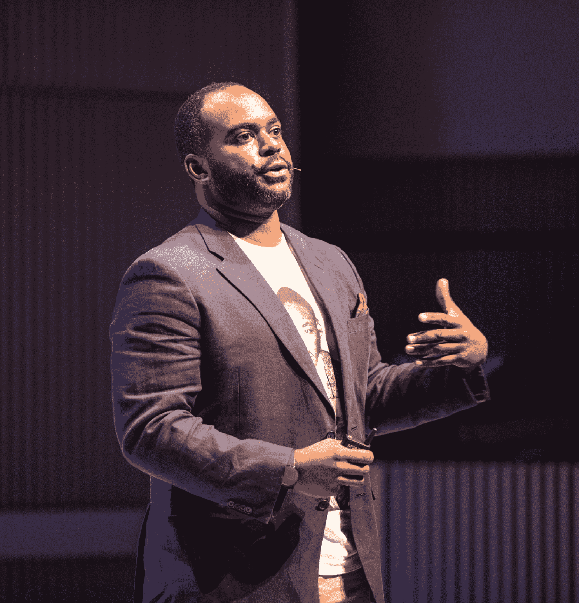
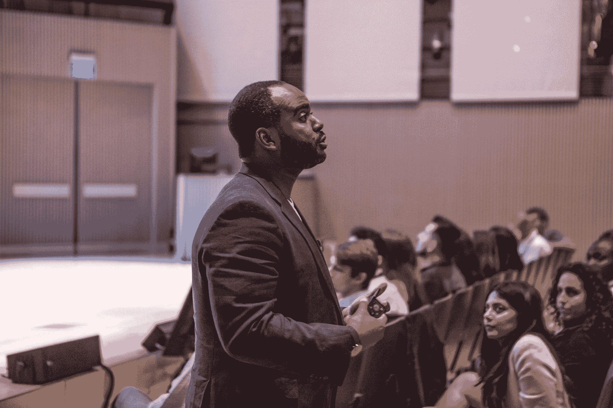

# 易贝首位首席多元化官，负责人性化多元化和包容性|第一轮评审

> 原文：<https://review.firstround.com/ebays-first-chief-diversity-officer-on-humanizing-diversity-and-inclusion>

“我不会给你解决技术多样性和包容性的方法。”

“我没有任何 D&I 的数据给你。”

“我要请你今天把你的‘代表’留下来。”

这些不是你可能会从易贝 的第一任首席多元化官那里期待的免责声明，他在谷歌担任多元化战略师，在优步担任多元化和包容性的第一任全球负责人。但是 **[达明·胡珀-坎贝尔](https://www.linkedin.com/in/dhoopercampbell/ "null")** 在多元化和包容性方面不是你传统的领导者。他生活和职业生涯的每一步——从哈莱姆区一家有机中餐馆的前台经理到哈佛商学院招生助理主任，再到高盛副总裁——都塑造了他对多样性和包容性的看法，无论是通过酒店、教育还是在一些最具影响力的行业中的表现。

Hooper-Campbell 从他的第一轮首席执行官峰会演讲(获得了起立鼓掌)和后续对话中，分享了他如何相信我们可以使一个越来越受欢迎的讨论人性化，否则这个讨论有可能成为科技领域的一个死记硬背的短语:多样性和包容性(D&I)。他分享了 D&I 在技术方面的现状，并建议如何以不同的方式进行更真实、有效和包容的对话。最后，他提供了一些练习和战术要点，每位领导者都可以在自己的组织中尝试。

# (字面上)寻找科技的多样性

在进入应该讨论的内容之前，让我们先快速、不科学地了解一下我是如何被报道的。如果你曾经在谷歌上搜索过“科技多样性”，你会得到一些标题，比如这些:

[技术有一个多样性的问题，这个问题就是文化](https://www.engadget.com/2015/11/14/tech-has-a-diversity-problem-and-that-problem-is-culture/ "null")

[比起文化问题，技术更有排斥问题](https://techcrunch.com/2016/05/09/tech-has-more-of-an-exclusion-problem-than-a-culture-problem/ "null")

*[如果科技最大的多元化问题是硅谷本身呢？](http://www.ibtimes.com/what-if-techs-biggest-diversity-problem-silicon-valley-itself-2281206 "null")*

**[惊喜！行业事件仍然没有解决技术的多样性问题](https://news.fastcompany.com/surprise-industry-events-still-havent-fixed-techs-diversity-problems-4019206 "null")**

***[谁在解决高科技的多样性问题？](http://crosscut.com/2016/07/the-tech-industry-sets-out-to-solve-its-diversity-problem/ "null")***

***想象一下，如果头条新闻中有这种程度的矛盾和质疑，这个问题会变得多么复杂。“只花了几分钟的搜索时间，就想出了这些标题和更多内容。这次谈话是怎么回事？它应该是关于人和一些好的事情。胡珀-坎贝尔说:“从很多方面来说，这已经变成了一种低劣的、难以启齿的对话。“再加上美国的背景，以及我们在所有城市看到的种族分化行为。再加上英国与英国退出欧盟发生的事情。再加上德国难民问题的背景。这还不是最有趣的讨论。这并不是因为没有尝试开始对话。”***

# ***当前的事态***

***围绕多元化和包容性的对话所涉及的问题的强度和复杂性已经将技术部门推向了许多不同的方向，以寻求有意义的变革。胡珀-坎贝尔注意到了一些常见的模式:***

*****D & I 领导角色。**“我们雇佣了一名首席多元化官。”***

*****以百分比表示的进度。**“我们在招聘上加倍努力，因为对进步有一个狭隘且近乎单一的定义，即女性、黑人和拉美裔的比例高于去年。”***

*****正式培训**。“我们中的许多人做 D & I 程序。通常是以培训的形式。例如，无意识偏见已经成为过去几年的流行语。一次又一次的训练。未被充分代表的少数群体的人感到被迫发言，代表的不仅仅是他们个人的感受，而那些可能不会自我认同为未被充分代表的少数群体的人有时会因为害怕说错话而不敢发言。”***

# ***先迈出不同的一步***

***这并不是说 Hooper-Campbell 认为金钱、资源和时间的投资是无效的——只是通常它们经常被应用于一个筒仓中，而没有考虑到作为这种对话基础的人的因素。“对一些人来说这似乎是陈词滥调，对另一些人来说太简单了，但第一步——也是最常被忽略的一步——是使这个问题人性化。这不仅仅是指标和百分比的问题。是的，归根结底，这些对于进步是绝对必要的。但是我要要求我们做的是把今天的训练放在一边。胡珀-坎贝尔说:“把钱也扔出去一会儿。“对于那些害怕与团队讨论这个问题的人，请完成以下步骤，这样你就可以鼓励他们也加入你的行列。这对早期创业公司的领导者尤其重要，因为你有最好的机会在这里做出改变。我要推动你进行对话，所以你可以推动他们进行对话。这不是火箭科学。让我们开始吧。”***

# ***重新划定信任圈***

***由于劳勃·狄·尼诺在《见家长》中扮演的角色，这个短语“信任圈”变得非常流行提醒一下，德尼罗扮演愤世嫉俗的父亲——前中情局特工——他认为没有人配得上他的女儿，尤其是她第一次见的现任男友。“男朋友，由本·斯蒂勒扮演，拼命想给人留下好印象，但他却处处碰壁。最臭名昭著的一幕是劳勃·狄·尼诺把他逼到墙角，引入了“信任圈”的概念。他谈到他的整个家庭是如何融入其中的，他如何知道本·斯蒂勒试图进入这个圈子，以及他正在关注着他，”胡珀-坎贝尔说。“提起这部电影有两个目的。首先，去看它——它很搞笑。但是第二，很多时候，我们并不了解对方。无论是在会议上，在一家从 20 人飙升至 2000 人的公司，还是在通勤列车上，我们经常处于我们看到但不认识对方的环境中。”***

***目标是更快地赢得更广泛的信任。“挑战在于，即使是那些我们每天都要见的人——一次见好几个小时——我们也没有超越那些表面层次的对话，”胡珀-坎贝尔说。“即使在我们认识的人当中，我们在工作时也选择不深入。我们大多数人加入公司时都会带上“我们的代表”。你知道我在说什么。我们需要做的是超越表层对话的界限。我们需要做我们第一次见面时很少做的事情。只要我们已经建立了一个善意的假设，我们就需要暂时接受政治上的不正确。这使我们能够获得真实的视图，并允许我们在看到时调用 BS。"***

***处在信任圈里就像在飞机上的出口排。在继续之前，你需要口头确认。***

# ***定义多样性和包容性——但首先要解析它们***

***信任圈的目的是快速创造一个有益的、安全的环境，进行关于多样性和包容性的公开对话。你要做的第一件事就是用你自己的术语定义题目:**多样性对** ***你*** **实际上意味着什么？*****

**它不必是完美的散文——分享定义的过程才是强大的。将您的团队分成两人一组来做这个定义练习。“我要找的不是字典里的定义，而是它是什么意思。或者你认为人们想听什么或者媒体说什么，这意味着什么，”胡珀-坎贝尔说。“在你的世界里，这到底意味着什么？这就是我想要你开始的地方。”**

**重新召集你的团队，请志愿者分享。如果需要的话，让我们有片刻的沉默。作为领导者，也要给出你的定义，但不要在你的少数人给出定义之前。答案会有所不同。以下是您的员工可以分享的一些回答示例:**

**“对我来说，这意味着人们来自广泛、多样的背景和地方。不同的背景意味着不同的经历，无论是生活经历、工作经历还是地区经历。”**

**“我们都有认知偏差。我们都有随身携带的东西。这是我们的行李。对我来说，多元化意味着我希望人们带着各种各样的行李。”**

**"这意味着不要让你的文化被一个或几个故事所定义."**

**来吧，乡亲们。让我们来定义“多样性”记住，我们说过信任圈。我们说过不要废话。我们说过不要表面的东西。**

**下面是我注意到的:从概念上讲，我们大多数人都明白多样性意味着什么。“这是一切，”胡珀-坎贝尔说。“通常，这种对话仅限于种族和性别。虽然，是的，种族和性别是非常重要的方面，但多样性远不止于此。它绝对应该包括它们，但还要深入到数百个属性。”**

**

Damien Hooper-Campbell** 

**接下来，定义另一个词:包容。“这个词实际上是什么意思？同样，我不希望你做我们通常会做的事情，那就是定义“包容”“忘掉韦氏词典吧，”胡珀-坎贝尔说再次，分成两人一组——确保人们与新的伴侣配对——并给他们这个提示，让他们互相询问:**回想一下你自己生活中感到被排斥时的个人事件——不管是什么时候或为什么。**”**

**现在，这些对话不一定是关于种族、性别、年龄或性取向，但它们绝对可以——这里没有评判。“这可能是你四岁时的照片，当时你没有被选进踢球队。这可能是今天早些时候，当你意识到你公司的人举行了一个会议，没有邀请你。它是什么并不重要，”胡珀-坎贝尔说。“我只是想让你开诚布公地和对面的人谈谈你生活中感到被排斥的一段时间。在你结束之前，想出几个形容词来描述你当时的感受。去吧！”**

**房间里会有嗡嗡声。你会发现大多数人会非常投入，以至于他们不会听到你说时间到了。但是，再次，作为一个团队重组，并要求一些勇敢的志愿者。这些答案不仅仅是回应——它们将是人类状况的故事。让他们展开，不要容忍打扰。以下是胡珀-坎贝尔听到的一些回答:**

**“我小时候很胖。我认为重要的事情，比如学校，并不是其他人认为重要的事情，比如运动。大多数人不关心我做了什么。每个人都认为重要的是人们如何判断受欢迎程度。对我来说，这是几十年来反复出现的主题。我的形容词是“失败者”和“孤独”"**

**“我们分享了非常相似的故事，这就是为什么我对分享感到自信或舒服。我们俩最近都有朋友——不是很亲近，但也不是熟人——他们最近举行了婚礼，但我们没有被邀请。我们俩都预料到我们可能会被邀请去参加他们的聚会。与之前所说的相比，这不一定是一种深度排斥，但仍会引发一些不安全感。这让我们怀疑，我们和那些人是不是像我们想象的那样是好朋友。我的形容词是‘没有安全感’和‘害怕不被错过’。"**

**“我的经历是在高中。我是我们足球队的。当某人的父母不在城里时，周末会有一些大型聚会。这真是太棒了，除了我总是在事情发生后的周一听到它。没人告诉我也没人邀请我。一直都是这样。我的形容词是“悲伤的”和“不想要的”"**

**“我在日本上的高中。我参加了数学日团队。我是唯一的女孩。我是唯一的非日本人。我的队友会在我面前说日语，就像我根本不存在一样。这次练习让我想起了这一点，以及那种甚至不在乎我在不在的感觉。”**

**“我的是关于年龄的。在我最初的几份实习中，我走进前门说，“我有一百万个想法可以让一切变得更好。”我立刻被关闭了。现在发生的少了一点，但我仍然记得。我是周围最年轻的人，被关闭。我的形容词是“残废的”和“没有动力的”"**

# **分享了什么，说了什么**

**通过这些练习分享的经验会很自然地把你的团队团结在一起——也许是以你无法立即诊断的方式。最后，问自己几个问题:**

****您如何描述共享的排斥类型？**“注意一下提到的经历。它们不一定只与种族和性别有关，”胡珀-坎贝尔说。“这些经历是关于人类的，无论其背景或属性如何——是关于那些感到被排斥的人的。”**

****你听到了什么话？**“没有安全感，恐惧，孤独，对吧？霍普-坎贝尔说:“残疾，缺乏动力。"这些形容词对任何一类人来说都不是相互排斥的。"**

**这些故事是从什么时候开始的？胡珀-坎贝尔说:“如果少数讲述的故事不是来自童年或青少年时期，我会感到惊讶。“在前面的例子中，有小学、高中和职业生涯早期的故事。这些显然是持久的、强烈的感情，给人留下了深刻的印象。”**

**这些练习的力量在于，突然之间，被发声的故事属于你经常见到的人。这是真正了解他们的一步，也是让他们感到受欢迎的一步。这也是让更多人参与到关于多元化和包容性的对话和承诺中的一步。虽然超重的经历可能永远不会与因为肤色或性别而被排斥的经历相同，但它应该有助于我们所有人更接近于让“包容”不再是一个流行语，而是一种人类体验。Hooper-Campbell 说:“**伙计们，关键是现在为你工作或试图为你的公司工作的人都有这种感觉。“如果你要求那些曾经感到被排斥的人举手，你会看到更多更多的人。几乎每个人一生中都至少有一次被排斥的感觉。现在问问你的团队:你们中有多少人曾经*有意或无意地*排斥其他人？如果人们真的在信任圈里，你会看到同样多的人举手。”****

# **举起手来**

**让你的团队再举几分钟手。“这就是您希望在您的组织中解决的问题。我不是让你从训练开始。我不是要你拿钱去解决问题。Hooper-Campbell 说:**我要求你只是从一次人际对话开始，并承诺利用你的领导地位，绝不故意——无论是直接还是间接——让你影响范围内的任何人感受到被排斥者的形容词。“如果你仍然不明白这种多样性和包容性的想法，考虑一下这个比喻——这不是我的，但我喜欢它，所以我继续使用它:多样性可以比作被邀请参加舞会。我们都打开短信或电子邮件，收到了参加派对的邀请。”****

**“这么快过去了，现在我们都站在派对上，房间里有很多不同的东西。太棒了。但这只是等式的一部分，”胡珀-坎贝尔说。“那么如果只有一定体重的人在跳舞呢？还是只有某些足够亲密的朋友才会被邀请去参加婚礼跳舞？还是只有一定年龄的人在跳舞？还是只有说某种语言的人在跳舞？还是只有足球队里够酷的人才会跳舞？包容是当你在舞会上被邀请跳舞。**

**民间，光靠多样性是不够的。如果多样性被邀请参加舞会，包容就是当你在舞会上的时候被邀请跳舞。**

**这里传达的信息是，仅有多样性是不够的。“作为领导者，如果你试图招募来自不同背景的人，这很好。但正如我的一位同事所说，那只是赌桌赌注，”胡珀-坎贝尔说。“我向你们所有人发出挑战，请你们不要把这场对话的焦点完全集中在招聘和统计数据上。那是它的主要部分。我们称之为劳动力。我们已经听过了。我们已经听过无数次了。多元化的员工队伍有助于利润和业务，因为我们的许多客户和最终用户反映了广泛的多元化。好吧。明白了。但是职场呢？当你身临其境时，你的真实感受是什么？你是只被邀请参加舞会，还是在工作的时候也被邀请跳舞？”**

**

Damien Hooper-Campbell at First Round's CEO Summit** 

# **对贵公司的挑战**

**如果你重视多样性和包容性，那么在你的初创公司进行这些练习——从这次谈话开始，获得重要的基础。“随着公司的发展，这种思维方式将会在整个公司开花结果。你可能会给那些你错过的员工一些发言权。或者你不欢迎的顾客进入你的平台，”胡珀-坎贝尔说。“因为你现在正在以一种更包容的方式思考。”**

**总的来说，这里有一些建议可以让你的员工立即尝试:**

**从对话开始。“你可以请专家来，整天谈论无意识偏见。你可以雇佣一名首席多元化官——我很感激。但你真的进行过真正的对话，了解多样性和包容性对你的员工和同事意味着什么吗？”胡珀-坎贝尔问道。“你知道吗？也许是关于外貌。或者关于语言。这可能还与种族和性别有关，但不要错过让人们参与对话的机会，因为你自己会狭隘地定义多样性和包容性。”**

****要求包容就包容。**“多元化和包容性很容易成为以美国为中心的话题。胡珀-坎贝尔说:“仅仅因为你开始理解多样性和包容性在美国意味着什么，并不意味着你已经认识到 D & I 在法国或加纳意味着什么。“通过对话和倾听，你会得到你所需要的信息，从而知道在对话中去哪里见人。”**

****保持光圈大以抵消偏振**。多元化和包容性是一套包罗万象的理念和参与者。Hooper-Campbell 说:“在围绕多样性和包容性的讨论中，我们已经取得了进展，我们有一些针对特定人群的令人敬畏的举措。“但是，如果大多数人在对话中感到不受欢迎，这些举措又有什么用呢？如果这只是你公司内部关注女性的一项举措，那就太棒了。但是包括并鼓励男性参与！否则，他们会说，‘我不会进那个房间的。’在这种类型的分裂下，指针会如何移动？"**

**在拥有指标之前，先拥有 D 语言。如果你想衡量这些对话的努力和效果，有一个很好的早期测试。胡珀-坎贝尔说:“如果你在公司里不知道应该称呼我为黑人还是非洲裔美国人，那就通过对话找到一个可以问这个问题的地方。”“同样，如果你不知道你应该说同性恋还是同性恋，去一个你可以问这个问题的地方。你能做的最糟糕的事情就是什么都不说。”**

****找到商业案例。**“我希望你能找到贵公司多元化和包容性的商业案例。我告诉你，它是存在的。多元化和包容性推动收入增长。暂时忘记任何调查研究。这应该是最基本的。胡珀-坎贝尔说:“在你的商业模式中寻找机会。”。“在易贝，多元化和包容性是我们商业模式的核心。我们为来自世界各地的卖家提供经济支持，同时提供超过 10 亿种选择，以满足极其多样化的买家的需求。如果我们不专注于此，我们的业务就不会增长。”**

**进步伴随着脆弱。"我多年来一直在指导领导者。胡珀-坎贝尔说:“我认为高层领导——那些拥有高薪和头衔的人——最大的致命弱点是不容易受到伤害，以及表现完美的压力。”“通过这些包容性对话，这种情况必须改变。伙计们，这是关于排斥的对话——这是真正的收获。在不到一个小时的时间里，你可以快进到过去的政治正确和表面层次的谈话。你可以和对方谈论我们所有人的共同点，并且可以立即与对方建立联系:感到被排斥。”**

**无论做什么，都包括在内。承诺永远不做任何事情——故意地——让你影响范围内的人感到被排斥。你们的人民、商业和工业的健康、幸福和长寿正处于紧要关头。**