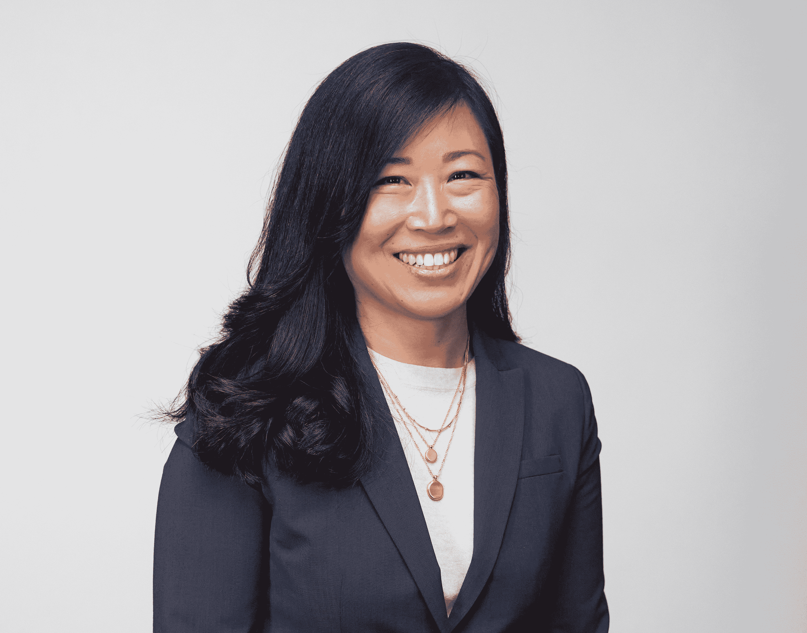

# 从高管角色到董事会席位——来自 Zendesk、Guru、易贝等公司的创业高管的经验教训|第一轮回顾

> 原文：<https://review.firstround.com/from-exec-roles-to-board-seats-lessons-for-the-startup-c-suite-from-zendesk-guru-ebay-and-more>

在安妮·莱蒙迪 令人印象深刻的科技职业生涯中，她曾去过一些最有趣的公司。在网络繁荣时期，她是蓝色尼罗河创始团队的一员。随后，她在快速发展的易贝公司从事产品营销工作。在 SurveyMonkey 只有 30 名员工时，她领导了该公司的产品营销，之后她创办了一家公司[被 TaskRabbit](https://techcrunch.com/2012/11/14/taskrabbit-one-jackson/ "https://techcrunch.com/2012/11/14/taskrabbit-one-jackson/") 收购，并担任首席收入官。在她的下一步行动中，她被调到 Zendesk 担任 SVP。现在，她是 Guru[Guru](https://www.getguru.com/ "https://www.getguru.com/")的首席客户官，同时也是 Gusto、Patreon 和 Asana 等公司的董事会成员，成绩斐然。作为斯坦福大学商学院的讲师，她甚至把自己的才华带到了课堂上

但在莱蒙迪堆积如山的简历中，突出的不仅仅是她参与发展的公司的质量，还有她一路走过的路。她见过各种高度的初创公司——从项目经理到副总裁，从创始人到董事会成员。她在创业成长旅程的每一步都应对了消费者和企业的挑战。就连她的职能专长也很难确定——她负责产品、营销、收入和运营。

她还深入思考了是什么让团队运转起来——看看她之前在评论页面上分享的[非常有用的“信任方程式”](https://firstround.com/review/use-this-equation-to-determine-diagnose-and-repair-trust/ "https://firstround.com/review/use-this-equation-to-determine-diagnose-and-repair-trust/")。那么，要深入了解如何让初创公司的高管层和董事会更加有效，还有谁比莱蒙迪更合适呢？从高效执行团队的关键要素，到让已经在公司中的人准备好在餐桌上就座，莱蒙迪清楚地总结了她职业生涯每一章的经验教训和失误——带着适度的谦虚。“伟大的领导者和高管有足够的谦逊来认识到，‘我曾在一艘火箭船上，这些是我在那艘火箭船上犯下的错误，我不会再犯了。’”她说。

在这次独家采访中，莱蒙迪为那些希望提升自己领导能力的创始人、高管和董事会成员，以及那些希望有一天也能成为这些人的人，提出了一些中肯的建议。对于高管，她概述了她如何实现职业转型，以及如何避开新高管通常会陷入的陷阱。对于创始人来说，莱蒙迪还打开了她的招聘手册，寻找下一个优秀的高管，并培养渴望聘用更多人的内部员工。对于董事会成员和首席执行官，她概述了最有效的董事会的测试策略。让我们开始吧。

# 对高管来说——投资于谦逊和好奇心。

在一个喜欢好的技巧、框架或宝贵的职业建议的行业，莱蒙迪建议抵制这种冲动。“最成功的高管适应性很强——这意味着他们在多个地方和多种环境下都是成功的，而不仅仅是在一家知名公司。她说:“他们保持好奇心，尽管他们可能有大量令人惊叹的实用经验，但他们不会陷入试图应用剧本的境地。

这意味着一次又一次地回归基本原则思维。“在很多情况下，这种谦逊始于我从事的最大的工作。或者我正在领导一个最大的团队，或者我正在做一些我以前从未做过的事情。我如何填补现有的空白？我该如何寻求外部帮助，或者从我的董事会和投资者那里寻求帮助？莱蒙迪说:“我如何重新想象我是如何管理某个团队的，从我如何进行一对一的交流到如何领导团队会议。

为了获得更多的策略，她恳求你积极寻求反馈——避免假装，直到你能做到。“这是谦逊的重要组成部分。我正在解决这个问题，所以我需要人们真正地批评我，并帮助我看到差距。她说:“这是我在最成功的高管身上看到的，他们能够真正扩大规模。

这种谦逊的特质延伸到了最有影响力的高管如何与整个高管团队互动。

他们真心实意地想让他们周围的团队成功，这意味着既有执行团队，也有他们自己的团队和职能。这就是那些真正具有团队精神的优秀高管的与众不同之处——他们关心整个企业，即使他们只负责营销、销售或产品。

“这也让他们不仅仅停留在那个领域，而是承担公司下一个重要的计划，”莱蒙迪说。

# 对于高管来说——以下是如何找到适合自己的方式。

当然，要成为一名有影响力的高管，首先要找到合适的公司。没有一个方形的钉子能装进一个圆孔里——不管这个方形的钉子有多壮观。当人们向她咨询如何缩小下一步职业发展时，她会给他们指出三个关键领域。

**公司使命:**“有时候我会和那些说‘这些是我目标名单上的公司’的人聊天。我会问，“告诉我为什么你对这些公司都感到兴奋。“很多时候，答案是，‘嗯，他们有一个很好的品牌，而且发展非常快，’”莱蒙迪说你不一定要成为产品的目标客户，但保持理智的兴趣是很重要的，早上醒来，对你一天中大部分时间都在做的问题集感到非常兴奋。"

**成长与影响:**“这并不是说你要拘泥于某个特定的头衔，而是这个角色会如何挑战你？这可能是一个特殊的角色，或者公司阶段与你以前工作过的不同。”

**团队:**“这绝对是最重要的一类。你身边的人是谁？你将和谁一起工作？坦率地说，我们周围的人改变了我们，不管是好是坏。我见过有人跳过这第三个类别，即使他们感觉团队配合不太好，但它检查了其他两个标准。不可避免地，他们最终会不开心。”

为了进一步了解适合度，尤其是对于那些正在面试首席执行官的高管来说，莱蒙迪列出了三个值得关注的方面。

“我确实认为他们应该能够公开谈论其他已经离职的领导人。如果这个人不能就领导层更替进行足够具体、深入和反思的诚实对话——特别是如果他们是 *[r](https://firstround.com/review/why-this-engineering-leader-thinks-you-shouldnt-aim-for-zero-regrettable-attrition/ "https://firstround.com/review/why-this-engineering-leader-thinks-you-shouldnt-aim-for-zero-regrettable-attrition/")* [超常流失](https://firstround.com/review/why-this-engineering-leader-thinks-you-shouldnt-aim-for-zero-regrettable-attrition/ "https://firstround.com/review/why-this-engineering-leader-thinks-you-shouldnt-aim-for-zero-regrettable-attrition/")——那肯定是首席执行官没有从过去的经验中吸取教训的信号。如果每种情况都是别人的错，那就是一面巨大的旗帜。”

**路线图:**“特别是[如果是第一次创业](https://firstround.com/review/nerdwallets-ceo-on-navigating-the-shift-from-first-time-founder-to-seasoned-exec/ "https://firstround.com/review/nerdwallets-ceo-on-navigating-the-shift-from-first-time-founder-to-seasoned-exec/")，他们可能会招聘一个别人没有过的角色，所以他们没有完美的工作描述或所有的目标。但不应该这么含糊——应该有观点。如果你感觉到他们没有真正停下来思考结果，或者花时间去研究那些结果会是什么样子，这就是一个信号。这标志着人们的期望将无处不在。”

**反馈:**“尤其是对于 CEO 来说，他们想要你的反馈吗？他们在面试过程中发现了吗？当我和去了一家初创公司并为此感到非常兴奋的朋友或同事交谈时，他们却没有成功，这是因为他们与首席执行官兼创始人的关系不是双向的。非常好，有经验的高管希望[能够给出并听取反馈](https://firstround.com/review/on-receiving-and-truly-hearing-radical-candor/ "https://firstround.com/review/on-receiving-and-truly-hearing-radical-candor/")。

# 对创始人而言——如何完成高管交接？

无论是接手现有的工作，还是开创一个全新的角色，新的创业领导者经常会面临一些质疑。“不管我们是否有意，很多人都持观望态度。我们对他们感到兴奋，但这能成功吗？莱蒙迪说:“人们通常会观望，而不是在帮助那个人成功方面有既得利益。

早在我还在易贝的时候，人们曾经用一个术语来形容新高管，这个术语就是“英雄归零”。一个新高管从英雄到零要多快？

为了给新领导人提供更坚实的基础，莱蒙迪把它带回了面试过程。我坚信任何人都不应该在上任的第一天去见他们的新老板。她说:“那真是一次可怕的经历。

可能没有时间与每个团队成员进行一对一的交流，但是参加小组演示甚至午餐学习对于建立信任和避免英雄到零的陷阱是至关重要的。“这并不意味着每个人都有否决权。但我绝对相信，任何直接下属都必须是面试过程的一部分，”她说。在这些论坛上，莱蒙迪喜欢询问人们对两个方面的反馈:他们会对新领导感到兴奋，以及他们关心什么。

接下来，将新员工和他们的团队联系起来。与你雇佣的人分享所有的反馈。这是团队真正兴奋的事情——你将把这些东西带给团队。她说:“这就是团队关心的问题。“可能只是，‘我们没有了解这个人的 X，或者在他们的最后一个角色中，他们没有对 y 负责。’然后你可以为这些领域制定风险缓解计划，”她说。

“提出意见，看到结果，了解他们的进展——然后就不再是观望，而是坐在一旁评估这个人是否会成功。她说:“如果我积极参与给他们提供反馈，识别潜在风险，以及识别他们带来的让我兴奋的东西，那感觉就会大不一样。

Anne Raimondi, Chief Customer Officer, Guru

# 对于高管来说——避免这些入职障碍。

莱蒙迪向即将上任的高管们提出了建议，她指出了三个让你陷入从英雄到零的动态中的常见陷阱。

## 陷阱 1:把你的前三个月打包，忽略快速成功。

在签约正式加入一家创业公司后，是时候开始动笔了。“我非常相信透明的 30 天、60 天、90 天计划。现在有很多很棒的模板，我相信人们已经修改了他们自己的模板，但我喜欢一个非常清晰的模板，“这些是我正在做的事情，这些是我要见的人，然后这些是我将要参与的项目或倡议，”莱蒙迪说。

在这里，人们常常有一种真正雄心勃勃并立即投入工作的冲动，但她见过太多的人将他们的 90 天计划打包，没有留下学习的空间。“谁是我应该花时间去了解和倾听的客户，他们喜欢什么，他们希望我们做什么不同？**她说:“这是为了了解团队的方方面面，而不仅仅是我作为高管直接负责的团队。**

接下来，戴上降噪耳机，深入分析仪表盘。“深刻理解这些指标对任何角色都至关重要。她说:“通常，人们进入一个角色后会只看他们职能的指标，但好的领导者会看整个企业所有最关键的指标，以了解哪里有最大的改进机会，以及那个特定企业的超能力是什么。

除了留出倾听和学习的空间，以及一头扎进数不清的电子表格之外，请密切关注一些快速取胜的机会——如果他们有足够多的协作接触点，这将是加分。“几乎所有这些都取决于个人的角色、团队和组织，但要确保你在 30 岁、60 岁、90 岁时都能立竿见影。什么是实际可行的，什么是可衡量的，然后——可能是最重要的——什么给了人们一个与你一起工作的真正机会？莱蒙迪说:“建立良好关系和降低风险的最佳方式是在一个重要的项目或倡议上与行动中的人合作。”。

以下是她的建议，帮助你发现这些推动行动的速效项目。“他们属于‘目前没有人拥有它，我们认为我们需要这样做’这一类。”她说:“有时候，只要抓住其中一个机会，向人们展示你的工作方式和工作质量，就能非常有力地建立信任关系，并产生影响。”

她最后的建议是什么？不要过于保护你的计划——你只有一个第一印象。“将它作为草稿发送出去，征求团队中每个人的意见——不仅仅是直接下属，也不仅仅是首席执行官。根据组织的规模，它可以向所有向你汇报的人开放。如果它是一个足够小的公司，它可能是每个员工。莱蒙迪说:“对我自己和我雇佣的人来说，这是消除前 90 天风险、确保领导者产生影响的好方法。

## 陷阱 2:坚持同样的剧本。

新上任的高管可能无法完全控制新团队对他们的接纳程度——尤其是当过去的错误聘用留下了伤疤的时候。但是在她的职业生涯中，莱蒙迪看到过许多好心人跌跌撞撞地离开。“我见过的一些高失败率的例子是，高管在他们的上一份工作中非常成功。他们构建了一些非常有效的东西，无论是需求挖掘还是企业销售活动，他们都希望应用这种剧本，进入一个新的局面。而他们没有做的是停下来真正理解，我身边的团队是谁？对于这些客户的情况，我还有哪些不了解的地方？”她说。

这是正确的剧本吗？所有的剧本都适用吗？

“他们经常是因为那个剧本而被招聘的——他们在一家知名公司做得非常好——他们进来时想，‘这就是我被雇来做的事情。’但创业公司内部有很多细微差别，这真的会影响到走向市场的领导者。这听起来可能很微妙，但如果他们已经建立了一个伟大的销售组织，向销售领导销售产品，现在他们必须向营销人员或客户支持领导销售产品，如果他们不停下来了解新的客户概况，他们就有麻烦了，”莱蒙迪说。

## 陷阱 3:忽略好的方面。

渴望产生影响的新高管的又一次失败？跳过所有好的东西，专注于需要改进的地方。“你正在加入一个现有的团队，每个团队都有自己的优势和机会——有些人会比其他人更健康。对于许多高管来说，你被请来是因为团队中有需要改进的地方。在下一段旅程中，有些动态需要改进。她说:“我们需要将标准设定在一个不同的水平上。

如果公司领导层运作一个透明的面试过程，这些挑战中的大部分将会浮出水面。“如果你是一名初来乍到的高管，你肯定已经和首席执行官以及董事会成员相处过了。在这个过程中，人们通常会非常坦率地分享面临的挑战。关键是继续保持清醒的头脑，并为自己看到一些。要避免的陷阱本质上是流言蜚语。她说，以‘嗯，我听说过这个关于某某人的事’——这没有帮助。

如果你忽略了所有的美好，你很快就会失去信任，或者被认为是一个只看到一切破碎的人。

# 创始人:如何发现最好的人才——外部的和内部的。

莱蒙迪已经经历了许多招聘公开高管职位的循环，当然，她自己也经历过几次。“伟大领导者的另一个关键特质是自信，我会和在我需要努力的事情上比我更优秀的人在一起。她说:“我不会只雇佣经验比我少的人。

但是受欢迎的人有很多选择。以下是莱蒙迪招募最佳员工的方法。“真正有才华的人有这么多选择。以前和他们一起工作过的人正试图招募他们，他们有机会开创自己的事业。她说:“关键是要了解什么是有趣的、令人兴奋的，对某人来说是一个增长机会，然后与公司能提供的东西相适应。“这个人可能在后期公司非常成功，但希望成为早期公司发展的一部分。对于功能专家来说也是如此，他们已经证明他们可以从头开始构建，现在他们真的对扩大规模的机会感兴趣。”

她在协调这些挑战和增长机会方面的目标是什么？没有惊喜。“每个公司都有自己的挑战。莱蒙迪说:“真正诚实地面对这些挑战，并确保这些挑战是人们乐于解决的，这为人们创造了最好的发展机会。”。

[在面试过程](https://firstround.com/review/40-favorite-interview-questions-from-some-of-the-sharpest-folks-we-know/ "https://firstround.com/review/40-favorite-interview-questions-from-some-of-the-sharpest-folks-we-know/")中，她在寻找三个关键因素:

**透视。"**我花了很多时间观察候选人如何应对公司面临的现实问题和挑战。他们开始描绘自己在公司中的形象和角色了吗？她说:“实际上，很多是看他们有什么问题，以及这些问题有多[周到。真正对这个角色感兴趣的人会问问题，就好像他们已经是团队的一员了。这是从金融投资者的角度询问更多表面问题(增长率、竞争威胁)与“帮助我了解一些最重要的客户，他们长什么样？”之间的区别"](https://firstround.com/review/the-40-best-questions-to-ask-in-an-interview-how-to-go-deeper-than-whats-the-culture-like/ "https://firstround.com/review/the-40-best-questions-to-ask-in-an-interview-how-to-go-deeper-than-whats-the-culture-like/")

**磕磕绊绊。"**当你面试高管时，如果他们不能诚实地谈论错误，这是他们可能不适合的另一个迹象。我不知道有哪一位伟大的高管或领导者没有犯过错误，他们乐于向你敞开心扉谈论这些错误。”

**谦逊。**“优秀的候选人会说，‘哦，我做的最好的事情就是让这个人加入进来，因为我从他们身上学到了很多东西。’他们谈论成功的方式往往比他们自己更宽泛。知识经济中的所有工作都是以团队为基础，以人为本的。我发现伟大的领导者会通过引入他们所在的团队来谈论他们的经验——*我们*学到了这一点，这些是我们尝试过的一些事情*与*我*做了这些事情*我*让这些事情发生了。*

如果你是一名首席执行官兼创始人，正在招聘一个全新的职位，是时候引入一些增援了。她说:“作为首席执行官，你仍然应该面试候选人的价值观和行为是否合适，你们能否很好地沟通和一起解决难题，以及他们对你正在创建的公司有多大热情。”“但是请一个伟大的 CMO 去面试 CMO 的候选人是没问题的。对候选人来说，这种做法传达了对该职能的严肃性和深思熟虑，即使你仍在作为一名创始人学习。

## 为你的下一代领导挖掘内部人才。

但是雇佣新人才并把他们带进公司只是难题的一部分。最好的领导者对那些有更多储备的内部人员有敏锐的嗅觉。“无论是从 D 轮融资到 E 轮融资，还是准备上市，我认为唯一的答案不是从外部引进人才。在我工作的一家公司，有一次关于高管的谈话，如果我们计划在未来成为一家上市公司，我们是否需要开始寻找一位曾经是上市公司一部分的高管？”莱蒙迪说。“但这不是一个非此即彼的问题。今天，团队中有一个非常有才华的人在扮演这个角色，他们举手表示他们想继续这个角色，但他们也非常清楚这是他们所扮演的最重要的角色。”

为了校准[员工是否准备好进入高管阶梯的下一步](https://firstround.com/review/three-powerful-conversations-managers-must-have-to-develop-their-people/ "https://firstround.com/review/three-powerful-conversations-managers-must-have-to-develop-their-people/")，该公司与一家外部公司合作进行了一次深入的领导力评估，其中包括该角色的外部基准评估、360°访谈以及与董事会就期望进行的对话。“它给我们的基本上是一个路线图，告诉我们如果这个人在未来几年继续在这个职位上发展，最大的发展领域在哪里？而对于那些开发区来说，动针有多容易或多难？”她说。

即使最后的评估是团队成员还没有准备好接替他们的位置，这也是一个有价值的练习，可以揭示一些关键的见解。“这让我们能够与对方进行坦诚的对话，他们可以获得发展路线图，这太棒了。这也为从外部雇佣一个完全不同的人提供了可能性。我们可以坦诚地说‘嘿，团队里已经有一个很棒的人了。他们有承担这个角色的雄心，并随着时间的推移成长为这个角色。我们希望找到对此超级兴奋的人。”她说也许这是他们最不想担任的高管职位，他们希望能够培养某个人——这种类型的候选人可能比让一个限制团队现有人员发展的人来担任更好。"

莱蒙迪对那些渴望走出舒适区的人有着强烈的热情，因为她在自己的职业生涯中也做过同样的事情。“当我在 Zendesk 负责人员操作时，我以前从未运行过这个功能。[首席执行官 Mikkel Svane](https://www.linkedin.com/in/mikkelsvane "https://www.linkedin.com/in/mikkelsvane") 非常慷慨，将我介绍给一位名叫 Nancy Connery 的女士，她经营着一家[人力资源和人才咨询机构](https://www.conneryconsulting.com/our-team/nancy-connery/ "https://www.conneryconsulting.com/our-team/nancy-connery/")。她是一个我以前从未运行过的功能的专家，她签约成为我整个旅程的资源。她说:“你可以做一些事情来帮助支持某人的成长，而不是告诉他们以前没有做过，或者他们还没有准备好。

对任何人来说，年复一年 100%地提高自己的技能和能力真的很难。我认为人类最快的增长速度是从零岁到一岁。

# 为了更有效的董事会:实施这些健康的习惯。

十年前，莱蒙迪担任了她的第一个董事职位。一路走来，她发现，作为董事会成员，陷入稳定的节奏需要抑制自己的一些基本本能。“作为一名经营者董事会成员，听听这条建议:**你不是来经营**的，”她说。

优秀的经营者往往会进入解决模式，但优秀的董事会成员往往沉默寡言。

“你实际上是在问关键问题。你代表股东，确保领导团队以可持续的方式建立一个持久的公司。她说:“你正在了解业务、关键问题是什么，以及团队中或董事会成员的不同观点。

正如她精心打磨自己向新高管角色过渡的过程一样，莱蒙迪也准备好了进入每个董事会职位，做一块海绵。"**我喜欢问现有的董事会成员，他们认为什么是真正有效的。成长的机会在哪里？他们希望看到的改变是什么？她说。“我喜欢问，尤其是随着董事会的发展，董事会会议的形式本身是怎样的？因为作为我工作过的许多公司的第一个独立董事，公司经常会发展成一个新的董事会。通常情况下，公司已经超越了他们召开董事会的方式，但他们还没有更新这种方式。”**

作为一名新的董事会成员，除了与首席执行官和其他董事会成员单独会面之外，她还有时间与各种各样的人会面。“我个人喜欢与首席执行官、其他领导以及不同部门的一线员工进行一对一的交流。它帮助我更好、更深入、更全面地了解业务。她说:“我掌握的背景越多，我能提出的关键问题就越相关、越好，这一切都有助于确保公司健康发展。”。

目前，莱蒙迪是 Gusto、Patreon 和 Asana 的董事会成员(她是这三家公司的首席独立董事)，之前是 ThredUp 和 SendGrid 的董事会成员——每家公司都有自己独特的障碍。但是在这些不同的挑战中，莱蒙迪看到了许多她[建议任何董事会或首席执行官实施的通用最佳实践。](https://firstround.com/review/The-Secret-to-Making-Board-Meetings-Suck-Less/ "https://firstround.com/review/The-Secret-to-Making-Board-Meetings-Suck-Less/")

## 习惯 1:停止客套，开始讨论真实的话题。

“从一家上市前公司的角度来看，如果你在董事会上花很多时间做更新和发布，你可能没有充分利用这段时间。莱蒙迪说:“你应该深入研究那些最混乱的决定。

我太经常看到那些有镜头的创始人进行下一轮筹款，所以他们想表现出一切都很顺利。但是，对于一家高速成长的初创公司来说，总会有一些困难。无论外表看起来多可爱，内心都是艰苦的工作。

莱蒙迪列出了几个障碍，值得你的董事会全力以赴。“这可能是战略路线图决策。您可能有多个客户群，有些客户群在某些指标上表现得比其他客户群更好。她说:“如果这一点没有在董事会上讨论，你就错过了一个让真正聪明的人加入进来的机会，这些人对你的企业的成功有既得利益。”

以下是如何打好基础，让面对面交流更有效果。“如果这不是一个重要的决定，或者如果事情没有明显偏离轨道，这些应该更像预读。你应该把时间花在有实质内容的话题上。通过要求你的董事会成员提前做一些关于该主题的预读和家庭作业来构建对话，以便获得信息并准备好进行对话。这是最有成效的，而不是他们可以异步读取的一系列功能更新，”她说。

## 习惯 2:为幕后的一瞥添加个人叙事。

当谈到精心制作一份推动价值、让人感觉不那么像家庭作业的预读材料时，莱蒙迪见过几位不同的首席执行官展现了个人风格。“我和许多首席执行官合作过，他们会在董事会前写一封董事会信，这只是从他们的角度来叙述。她说:“有些人比其他人长，但这几乎就像是甲板上的画外音——他们心里在想什么。”。

最好的董事会信函包括首席执行官在过去一个季度最自豪和兴奋的事情，但最重要的是，是什么让首席执行官夜不能寐。“董事会知道这一点尤其重要。阻碍他们睡好觉的最关键的问题是什么？她说。“然后，是的，你仍然得到甲板和预读，但它给你的上下文，我们真正需要花时间。在这些相对简洁的信件中开诚布公的首席执行官们改变了与董事会的对话。

当一个特别棘手的问题摆在议事日程上时，莱蒙迪建议首席执行官们抽出时间与每位董事会成员单独会面。“与我共事的许多首席执行官会做董事会汇报或董事会前对话，特别是如果他们正在处理一些重大或战略性的事情。她说:“他们会花 1:1 的时间，只是为了确保他们听到了每个人的观点，但之后他们会回头，确保这些 1:1 的内容与整个董事会共享，这样就不会感觉他们在与不同的人进行不同的对话。”

对于首席执行官来说，将董事会视为自己的高效团队是一项关键技能。

## 习惯 3:为了董事会的和谐，实施闭门会议和反馈循环。

为了不断微调董事会，她建议在日程表上安排一个董事会专用会议，每个人都可以坦率地发言。“我认为所有董事会都应该在没有首席执行官的情况下召开闭门会议。最重要的是，要有一个来自闭门会议的反馈循环，所有的事情都要反馈给首席执行官。莱蒙迪说:“这个习惯可能会改变每个人的生活，因为从每个人的角度来看，往往都有一些没说出口的事情。”。

她从桌子的两边铺出几条皱纹，这个过程会使它们变得平滑。“当董事会文件长达 70 页，而他们只得到三条评论时，首席执行官和他们的团队可能会感到沮丧。他们已经花了整整一周的时间来准备董事会议，并把这个漂亮的甲板放在一起，而不是经营业务。然后他们会说，‘好吧，我们得到了三条相当有用的评论，这些评论可能不用把 70-100 页放在一起就能得到。’她说。

但是摩擦不止于此。“从董事会的角度来看，有时会有挫折感，就像是，‘嘿，感觉我们没有谈论正确的事情，感觉我们没有在战略上花足够的时间。’但除非每个人都分享，否则它们不会得到修复，”她说。

“这是一个好习惯，可以极大地提高谈话的质量，进而增强人际关系，因为人际关系越牢固，就越容易进行艰难的对话。如果你没有这个基础，那么围绕着“嘿，这位高管真的有用吗？“他们提供了你所期望的东西吗？”往往被绕过，直到为时已晚。莱蒙迪说:“告诉首席执行官，‘你必须解雇那个人’，这不应该是你与领导就团队中的某个人进行的第一次对话。”。

它不仅将激光聚焦到最值得董事会花时间的主题上，还创造了建立反馈肌肉所需的重复。“每个人都越来越擅长直截了当——我喜欢这样，不喜欢那样。我们能尝试一些新的东西吗？我本质上是一名产品经理，所以我认为这是在你的董事会上应用 sprint 复古。什么有用，什么没用。我们想尝试什么？”她说。

*这篇文章是安妮·莱蒙迪在我们的新播客《深度》中的出场摘要如果你还没有听过我们的节目，请务必点击* *[查看这里的](https://review.firstround.com/podcast "https://review.firstround.com/podcast")* *。*

*盖蒂图片社/ HStocks 的封面照片。*