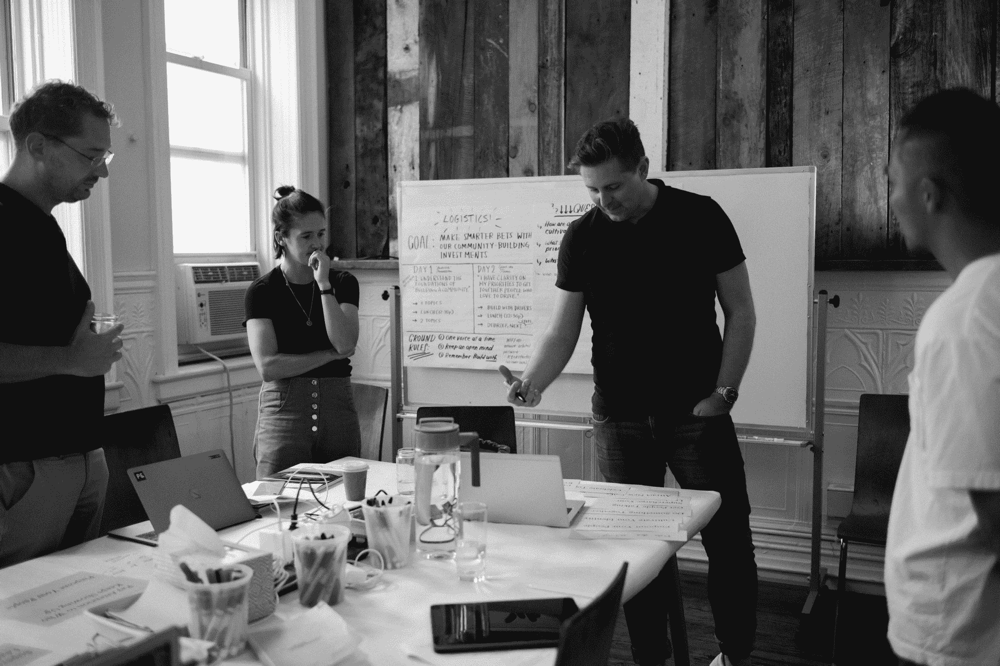
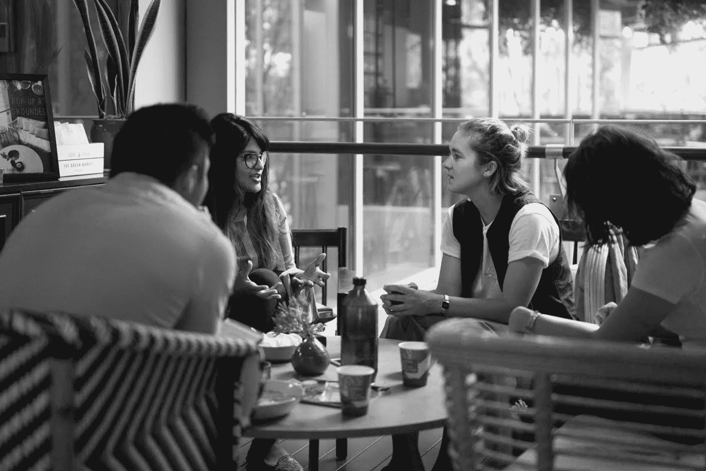

# 从即时锅到 Instagram:创业社区建设的关键课程|第一轮回顾

> 原文：<https://review.firstround.com/from-instant-pot-to-instagram-critical-lessons-in-startup-community-building>

几乎每个早期创始人的愿望清单上都有一个由热情用户组成的欣欣向荣、相互联系的社区。它可以作为一种速记，表明他们的初创公司有[产品/市场契合](https://firstround.com/review/how-superhuman-built-an-engine-to-find-product-market-fit/ "null")的迹象，产生口碑[病毒式增长循环](https://firstround.com/review/pinterest-and-grubhubs-former-growth-lead-on-building-content-loops/ "null")，并帮助创立一个以深厚关系和线下联系而闻名的[品牌](https://firstround.com/review/how-backcountrys-support-reps-go-the-extra-mile-and-get-invited-to-their-customers-weddings/ "null")。

无论整个产品本身是一个致力于将人们聚集在一起的平台(想想[新推出的 GirlBoss 网站](https://www.cnn.com/2019/07/01/tech/girlboss-professional-network-trnd/index.html "null"))还是社区努力为共同热爱某个产品的人提供了一个联系的渠道(例如[opinion 的超级用户聚会](https://www.notion.so/Notion-Community-04f306fbf59a413fae15f42e2a1ab029 "null"))，似乎越来越多的初创公司正在进入社区建设游戏。

但是“社群”本身还是一个比较模糊的概念。这是一个黑暗而近乎神秘的世界，在这里，联系是货币，真实性是至高无上的，但如何真正创造一个这样的世界却不太清楚。**真正茁壮成长的团体有一种特殊的品质，当人们聚在一起时，有一种难以用瓶子包装的魔力——也更难扩展。**

“社区感觉很神奇，但它们不会凭空出现。贝利·理查森说:“就像你生火一样，你需要收集某些材料，并遵循一定的操作顺序来产生火花，煽风点火，并让它继续燃烧。”。她是这方面的专家。

作为 Instagram 的早期雇员，理查森的任务是开发全球社区，运营博客(以及官方的@Instagram 句柄)，关注值得关注的用户，并组织 IRL“Insta-meet”会议。离开社交平台后，她与凯文·休恩(Kevin Huynh)和 T2(Kai Elmer Sotto)(分别是 T4【creative mornings】和易贝的社区大师)合作，成立了**[People&Company](https://www.people-and.com/ "null")**，这是一家专注于帮助组织创建和培养真实社区的机构。

经过三年与客户的合作，从耐克和保时捷到像 Edcamp 这样的非营利组织，这个团队意识到他们的“社区建设 101”研讨会和框架为许多组织努力掌握的问题带来了急需的清晰度。出于好奇，他们更深入地研究并拼凑了几个独特的社区案例研究，从中梳理出关键的经验教训并提供灵感。

"**我们想更多地了解创建非凡社区的普通人。理查森说:“虽然初创公司可能与 Twitch 的游戏玩家群体和 YouTube 的第一个社区经理有关，但我们认为他们可以从 20 世纪 60 年代成立的 Weight Watchers 和官方的星球大战粉丝俱乐部那里学到很多东西。**

A People & Company workshop.

在这次独家采访中，理查森利用这些故事深入探讨了初创公司应该如何进行社区建设的具体细节，强调了最佳社区如何开始、获得动力并随着规模的扩大而发展的八条宝贵经验。理查森从他们的新书 *[中摘录了一些极具战术性的内容:如何与你的人一起建立社区](https://www.amazon.com/Get-Together-Build-Community-People/dp/1732265194/ref=as_li_ss_tl?_encoding=UTF8&qid=&sr=&linkCode=ll1&tag=kiwimonk-20&linkId=ffa4b4d583668cf619a98eec28146b19&language=en_US "null")* *，*(今天发布)理查森提供了一些建议，从找到最初的几个成员到当你有数千个成员时放弃控制，使其成为早期创始人和经验丰富的社区经理不可或缺的指南。让我们开始建造吧。

你需要和人们一起建立你的社区，而不是为了他们或针对他们。这是确保社区建设努力成功的秘诀，而不是失败的倡议。

理查森自己发现“社区”这个词太抽象了——在创业领域经常被误用。“大约五年前,‘社区’这个词开始作为用户或受众的委婉语出现。她说:“我开始看到越来越多的人不加选择地使用这个词，却没有给它一个更合适的定义。

这项拨款对她不合适。"**社区是神圣的**。它们意味着出现的人有一定程度的联系、倡导和能量。如果你有一群充满激情、有主人翁意识的人，你会非常幸运。这不是一个可以随便乱说的词。她说:“选择真正的参与和被动、功利的使用或包容是有区别的。**在创业世界中，有抱负的社区建设者经常忘记代理的重要性。他们把不认识的人放在名单上，开始称他们为社区。**如果你试图同时描述普通用户[和铁杆粉丝](https://firstround.com/review/what-i-learned-from-developing-branding-for-airbnb-dropbox-and-thumbtack/ "null")，那就不要称之为社区了

以下是她推荐的定义:“真正的社区只是一群人，他们为了他们所关心的事情聚在一起。理查森说:“最有活力的俱乐部为会员们提供了一个机会，让他们可以一起发挥自己的热情，为正在创造的东西做出贡献。”。“如果你试图辨别你手中是否有一个社区或者仅仅是一个用户群，问问你自己:**这群人对于实现最终产品或者最终影响是不可或缺的吗？如果他们不是，那就不是一个社区。”**

一个充满活力的社区的标志是新成员的加入是因为他们想加入。在早期阶段，你在寻找一个热情的盟友团队，他们会在这个社区获得动力之前出现。

# 2.找到 100 个在乎的人，不要担心缩放。

一些创始人可能认为社区这种黏糊糊的东西并不适用于他们所创造的东西。但是理查森不同意。她说:“社区建设就是要找到并联系那些在早期关心你的人，这对任何一家初创公司的生存都至关重要。

“当保罗·格拉厄姆谈到[找到 100 个爱你的人](https://hbr.org/2018/05/what-airbnb-and-strava-know-about-building-emotional-connections-with-customers?utm_campaign=hbr&utm_medium=social&utm_source=facebook&fbclid=IwAR3aDy1u5NeMfWly99rS6zixb3CxU-9QU1QIG-JQGQRPsJwG67rliPQd2SM "null")和[做不像早期的](http://paulgraham.com/ds.html "null") [Airbnb 那样](https://firstround.com/review/How-design-thinking-transformed-Airbnb-from-failing-startup-to-billion-dollar-business/ "null")的事情时，这就是他的意思。理查森说:“当然，你可以从产品角度出发，加倍努力为你的忠实粉丝打造和改进功能。“但这也归结于真正爱你的人和与他们建立关系。你必须做一些在个人拓展和关系培养方面不成比例的事情，而不仅仅是在产品或销售方面。”

理查森指出，科特兰·艾伦创办的独立黑客公司是这一原则发挥作用的最好例子。“他花了很多时间研究第一批接触的企业家。他知道这些人会欣赏他建造的空间，并会为新的东西而出现。他给这些人发了 [150 封深思熟虑的私人电子邮件](https://research.people-and.com/courtland-allen-wrote-150-personalized-emails-to-entrepreneurs-he-admired-210c3b7e094b "null")，这不完全是“可扩展”的外联。但如今，他的社区已有 6 万多人，每月在世界各地举办 50 多场聚会，”她说。

根据理查森的经验，许多创始人觉得这条建议难以下咽。“他们不想优先考虑未来用户群中的一小部分，也不想投资于不可扩展的工作。她说:“很容易投入最少的资金，专注于打造产品，然后希望一切顺利。“但当你没有动力时，唯一会出现、下载或参与的人是那些已经在乎的人。你需要把重点放在你的产品和你的社区战略上。”

People & Company's Bailey Richardson

创始人还需要记住，早期的社区建设工作可能是痛苦的。“我举办过只有两个人出席的活动。你必须坚持下去。大事始于小事，但当你在一家成长中的公司面临所有这些压力和有限的资源时，很容易迅速抛弃任何不起作用的东西。她说:“尽管你可能很想，但你不能跳过难的部分。

找到关心你的人，给你工作的空间带来能量。花你宝贵的早期公司建设时间去了解他们，并弄清楚你如何为他们服务——他们是你所在社区的支柱。

*以下是理查森从她的书中摘录的找到最重要的前几条的建议:*

如果你想激发你自己的社区，你需要首先确定你的人。找到你的火种——那些早期的盟友，他们关心你所关心的，足以将你对社区的想法体现为人类的实际聚会。虽然他们可能不多，但你首先涉及的人是重要的。他们将为你的团队的未来定下基调和方向。

无论你是在 Twitch 这样的平台公司工作，还是在小型企业或非盈利组织工作，你都可能会感觉被潜在的 whos 包围。每个小群体都可以发展成一个社区。那么，你从谁开始？关注两个标准:

我想和谁在一起？谁带来了能量？已经参与、贡献或参加的人是谁？不要试图凭空变出动力。从热心的参与者开始。

**假设社区繁荣，你会支持谁？**培养一个社群是一个长期的游戏。您组织的未来依赖于谁(例如，超级用户、忠诚客户、关键捐赠者、热情的员工)？你想投资谁？

另一个常见的错误是，最初创建社区的动机往往是混乱的。理查森说:“我们的竞争对手在社区上投入了大量资金，或者‘我们的投资者认为我们应该建立一个社区’或者‘我想迅速走红’都不是足够好的理由。”。"**如果你正在创建一个社区来打勾，我可以保证它会落空**"

她还指出，早期创业者不应该试图复制粘贴对其他人有效的社区建设策略。“社区不是放之四海而皆准的。你需要弄清楚什么样的社区对你的组织有独特的意义。理查森说:“这也不意味着它必须很崇高，完全脱离商业价值。“问问你自己，‘是什么激励着我们的公司*和*我们最热情的用户？我们的激励机制在哪里？社区的价值就在这个答案中。例如，早期的、斗志昂扬的创业公司应该考虑他们可以利用哪些帮助，无论是客户支持、发布故事、引发讨论还是改进产品。"

这一点值得强调。"**社区工作的核心是与人们建立关系，让他们觉得自己是企业发展的一部分。她说:“对许多科技公司来说，尤其是基于平台或市场的公司，简单的事实是它们确实如此。“当你在开发一个产品时，你在写最基本的 1 和 0，构建这种外壳。没有人为它做贡献，没有为舞台添砖加瓦，它就平淡无奇，毫无生气。”**

要弄清楚社区如何融入你的整体战略，从它在不同公司扮演的不同角色中获取灵感。“例如，当 YouTube 开始时，假设网站是产品可能是合理的，但在许多方面，人们消费的产品是由社区创建的*内容。Instagram 和 Airbnb 也是如此，”理查森说。*

对于这种类型的初创公司，方正应该专注于推广高质量的内容。“这种角色为好的贡献树立了榜样，激励其他人也这样做。这意味着社区的努力应该集中在教育人们和创造一种创造性的文化上。理查森说:“在 Instagram 的早期，我们通过我们博客上的推荐用户列表和功能来做到这一点。“这些用户聚光灯让其他人了解 Instagram 是什么，并激发他们对照片的新创意，这使他们的体验与其他平台不同。”

但是在光谱的另一端是像 Instant Pot 这样的公司，它已经围绕一种厨房电器建立了一个狂热的追随者。理查森说:“当你停下来想一想的时候，你会发现这太不可思议了。”。“我们曾与一些拥有性感品牌的公司合作，这些公司对投入社区战略有点犹豫。我总是回应，‘如果渥太华的厨房电器公司能做到这一点，你肯定能做到。’"

Richardson 强调，Instant Pot 的早期方法植根于连接客户和扩大支持的愿望。“他们有很多业余爱好者。他们想最大限度地利用速溶咖啡，或者用它做一些有创意的事情。她说:“在一个脸书小组中，用户之间的直接联系使他们能够更快地获得基本问题的答案，这比他们当时扩大客户支持的速度要快得多。”。“然后它就像滚雪球一样变成了这种病毒式的口碑营销工具。突然，他们在亚马逊优惠日销售一空，人们为他们的速溶锅织毛衣，写他们自己的烹饪书。”

为了找出创业公司最适合走哪条社区建设道路，理查森鼓励创始人后退一步。"**在你的企业中，有没有一个地方是你没有帮助就无法建立的？有什么事情是你自己做不到的吗？**这就是你的社区策略可能适合的地方，”她说。“有些狂热的人可能愿意举手说，‘我喜欢这个。我很乐意帮忙。"

A glimpse from the pages of Get Together, from Stripe Press

*下面是理查森的建议，摘自她的书:*

你们为什么要聚在一起？ [WRU 剧组召集跑友互相激励](https://research.people-and.com/hector-espinal-started-wru-crew-a-run-club-for-washington-heights-b0bdb3b04972 "null")。Twitch 召集视频游戏玩家，这样他们就不用独自玩游戏了。确定你的员工将共同努力实现的共同目标。

欣欣向荣的社区需要一个共同的目标，一个“我们为什么走到一起”的问题的答案你的目标应该是你的员工愿意和你一起努力的事情，而不是某个领导者自私或片面的想法。

为了确保你的社区的目的是基于你的人民的需求，并且它表达了你能一起完成的事情，考虑:

我的人民还需要什么？

我们渴望的改变是什么？

有什么问题只有我们一起才能解决？

当你对*你想和谁*在一起以及*你为什么*在一起有了强烈的预感，你就能更好地决定*下一步做什么。*

新生社区中另一个常见的失误是未能将奉献和重复融入到凝聚的核心手段中。“有趣的是，科技公司痴迷于用户留存，但当涉及到社区战略时，他们往往会忘记这一指标。理查森说:“只有当新来者在第一次互动中发现价值，然后*回报*，一个社区才能可持续发展。“你不能仅仅停留在跟踪谁来了。你需要弄清楚是谁*一直让*出现，以及*为什么*。我们称这些人为“举手者”他们总是出现，带着其他人，并热切地做出贡献。"

这就是为什么你的社区活动需要聚焦于产生重复和奉献。“大型发布会的一次性营销活动符合公司的利益。但它不是社区——它不是用来将热情的人们相互联系起来的，它是关于交流新闻的，”理查森说。"**你需要给人们机会，让他们不断出现在彼此面前**。每月一次的聚会，比如[拉斐尔自行车俱乐部定期举办的当地骑行](https://research.people-and.com/why-rapha-is-the-new-harley-davidson-3981832d83b8 "null")，有助于建立这种神奇的关系。”

许多准社区缺少的成分是奉献。我们举办一次性活动或年度筹款活动，但我们不会给潜在的社区成员继续出现或举手承担责任的机会。

*以下是理查森对选择社区活动的战术建议，摘自她的书:*

社区是围绕共享活动形成的。有时候，一个人是不可能完成这项活动的。其他时候，一个人的活动很好，但是和其他人一起做要好得多。为了确定你的社区的核心共享活动，问问你自己:你的人渴望什么，作为一个团队会表现得更好或体验得更好？

无论你是决定为你的俱乐部举办首次跑步，还是为超级粉丝们建立一个网站，你要做的第一件事就是团结这个群体，这在很大程度上取决于你所在社区的目的。但是，为了让你的团队走上合作的道路，任何第一次社区活动都应该整合三个原则:

**使之有目的**。将活动与你的社区最初合作的原因联系起来。什么样的目标或结果只有在特定的人群聚集在一起时才成为可能？让参与者清楚这个目的，这样他们也可以拥有它。

**让它参与进来**。不要只是对人说话。你召集他们是因为他们充满激情，就像你一样！给他们机会为你们共同的目标做出贡献。

**使其可重复**。一次性产品是我们的敌人。关系需要时间来发展，一些人需要几个周期来热身并开始积极贡献。设计第一项活动时，要让你的员工一遍又一遍地重复。

一个不可回避的事实是，如果你想让人们出现并持续出现，你的核心活动必须超出预期。这并不意味着你需要在华而不实的体验上投入大量资金。相反，尽你所能创造一个无可否认的有价值的共享体验。

# 5.把聚光灯转向其他人——雇佣那些能在大海捞针的人。

专注于将社区作为获得自己的叙事、产品发布和营销计划的工具的初创公司往往会陷入另一个陷阱:忽视讲述他人的故事。

理查森说:“作为一个社区的领导者，你掌握着聚光灯——你需要成为运用聚光灯的专家。“有太多的例子表明，公司会关注杰出的用户或贡献。在 YouTube 的早期，他们的主页上有媒体工作人员的选择。Medium、Vimeo 和纽约时报在这方面也很棒。把你特殊的扩音器送给别人似乎违反直觉，但这正是你必须要做的。投入资源和时间从社区成员那里寻找和提升新的故事。”

这是理查森在 Instagram 中的核心角色。“无论是东京的一只上镜的刺猬，还是加利福尼亚的一名摄影师，我都喜欢搜寻出类拔萃的用户，”她说。“这种讲故事的努力有两方面的好处:第一，你会让这个社区对那些考虑加入的人更有吸引力。第二，你要强调顶尖的参与是什么样的，这可以激励现有成员想象他们如何做出贡献，并有望加深他们的参与。”

你不能成为你看不见的人。如果你想展示你的社区是充满活力的，你需要在你的故事中保持稳定的脉搏。太多创业公司让它走平了。

确保你的聚光灯有效移动的一个关键技巧是在招聘社区经理时寻找这种品质。“讲故事是我们在 Instagram 工作的一大部分。当我在全球范围内帮助扩展团队时，我总是在寻找一个人，他能在大海捞针中找到出色的用户，擅长直观地找出我们需要提升的人。理查森说:“不仅仅是他们的品味或他们看到值得讲述的事情的能力，还有他们实际撰写和讲述这个故事的能力。”。

“由于我们经常在其他国家雇佣社区成员，这意味着他们必须用英语和自己的语言写作。作为面试过程的一部分，我会要求人们从平台上挑选三到五个他们会强调的客户。然后我会请他们解释原因，并写一个适合我们博客的小故事。”

# 6.吸收用户反馈，但确保你是一个有洞察力的海绵。

“当 Instagram 还是一家初创公司时，我认为我们擅长倾听。Richardson 说:[创始人之外的第一个雇员是一名社区经理](https://tech.co/news/instagrams-first-hire-community-manager-2015-05 "null"),此后不久我就加入了，因为他们继续投资于社区团队。“我们会阅读每一条推文、评论和电子邮件，我认为我们真的是社区经理。”

但后来她听说了音乐剧《T3》(现在是抖音的[部分)的创始人](https://www.vox.com/culture/2018/12/10/18129126/tiktok-app-musically-meme-cringe "null")[。“真是不可思议。他和数百名青少年在微信上聊天。理查森说:“无论是向客户提问，还是向他们展示线框以获得反馈，他们都处于与客户沟通的持续状态。“我给涉足社区的早期创业者的最大建议是**保持好奇心**。**建立倾听的仪式和习惯，并对你的团队应该与客户互动的次数和频率设定极高的期望。”**](https://www.businessinsider.com/what-is-musically-2016-5 "null")

Bailey Richardson leading a community discussion.

不过，理查森很快给这个建议加上了一个推论:“你还需要有洞察力。许多产品人员对社区有一种健康的怀疑态度，因为他们已经看到了一小群人如何对路线图施加不适当的影响。她说:“我采访了第一位 SoundCloud 社区经理 David Noë，他说他觉得自己的工作就像一块海绵——他需要走进世界，吸收所有的水分，但只把他们真正需要知道的反馈挤回产品团队。

当领导者成长为一个充满活力的社区时，他们可能会陷入的危险之一就是倾听那 1%的声音。“这是顾全大局。你必须学会接受你得到的所有反馈，但是当涉及到你做出的影响更多受众的产品决策时，要仔细分析它。理查森说:“社区有助于增强和扩大你公司的努力，但在产品开发中，要小心不要过度强调他们对更大用户群的意见。”

作为一名社区管理者，你需要成为一块海绵。走进世界，吸收所有的水分，但只把最重要的东西挤出产品团队。

# 7.在你的组织结构图中以 Fingerspitzengefühl 为目标，雇佣创造性的系统思考者。

一旦一家初创公司的社区努力受到欢迎，工作就转变为保持火焰不灭和传播火焰——这意味着扩大规模和雇佣额外的社区经理，对于那些更适应科技世界说法的人来说。

“谈到社区，创始人和项目经理通常会承担早期的重担。理查森说:“除非一个产品至少有一定的吸引力和留存率，否则引入社区雇佣是没有意义的。“当你开始觉得作为一个产品团队，你无法再独自与客户建立关系时，就是时候雇佣一个能够从头开始考虑社区的人了。”

Instagram 就是这种情况。“反馈消防水管是开着的。Richardson 说:“Mike 和 Kevin 有太多的人联系他们，他们需要有人成为构建产品的人和使用产品的人之间的桥梁。“不管你进行第一次社区招聘的动机是什么，想想他们在你的组织中处于什么位置。我见过你能想到的所有组合——没有一种正确的方式。”

她是这样想的:“**无论你的社区战略的中心影响集中在哪里，你都会希望它存在于你的组织结构中**。理查森说:“很长一段时间，SoundCloud 的每个产品团队都有一个社区领导，以确保产品团队能够获得真知灼见。“但如果你的社区战略侧重于收购或教育活动，那似乎更接近营销团队。”

或者你可能想把社区分离出来，成为一个独立的部门。无论你把你的早期社区团队放在哪里，Richardson 建议确保他们永远不要离开产品人员太远。

有一个很棒的德语单词，Fingerspitzengefühl，意思是“指尖的感觉”这才是你在社群和产品的关系中应该努力的。与用户密切接触的人掌握着用户的脉搏，知道什么让他们开心，什么让他们恼火，什么在变老。她说:“对于团队来说，这是很有见地的信息，他们正在决定构建什么样的新功能以及它们会产生什么样的影响。”。

对于那些希望在扩大规模的同时保持这种影响力的初创公司，理查森建议保持一个固定的接触点。“我们过去在 Instagram 的做法是，每周 Android 社区团队成员都会与 Android 工程师会面，iOS 也是如此，”她说。

至于雇佣能够实现这种增长并与产品团队有效合作的人，理查森对寻找什么有一些想法。“我见过的出色的社区经理在创造力、同理心和系统思维之间取得了平衡。你需要一个几乎是使用你产品的人的人类学家。她说:“他们需要对建立人际关系充满热情。“但你也需要一个系统思考者，尤其是在你快速扩展的时候。你需要一个能够建立流程、资源和工具的人，这些流程、资源和工具能够与你一起成长，而不仅仅是对你目前能够整合的东西做出反应。”

理查森最喜欢的社区经理候选人之一是前记者。“作家必须好奇，但他们的思维也必须真正结构化，”她说。“我的背景是艺术和传播。但是还有其他途径。我的人与公司业务合作伙伴 Kevin 拥有机械工程硕士学位，他热爱人，因此他非常擅长将他的机器制造思想应用于培养大规模社区。也许你的团队中有一名负责招聘或销售的工程师可能非常适合。”

Bailey Richardson (left) and Kevin Huynh (right) at Stripe Press.

# 8.传递火炬，放弃控制(真的)。

“我们到处说你应该和人一起建造*,而不是为*人建造*,以至于我可能应该把它作为纹身，”理查森说。“这是我希望有人带走的一份外卖。”*

这一信息对创始人来说尤其重要。"**如此多的企业家专注于单干**。许多早期创始人的心态是‘我必须发布代码，我必须完成每一笔销售，我必须招募新人，我必须传播消息。’换成“我如何才能和关心这件事的人一起做这件事”会让你进入公司建设的新阶段。它将使您能够以更协作、更快速的方式进行设计和构建。"

她以 Duolingo 为例。“他们的社区活动是产品的自然延伸——他们每个月都有 500 多次聚会，人们与住在他们附近的人聚在一起，想练习他们的语言技能，”她说。“太不可思议了。但是关键的一课是，你必须放弃一些控制权，才能在社区善行中获得回报。如果 Duolingo 试图自己运营这些赛事，你能想象他们需要多少员工吗？T2 的 Duolingo 要有这样的增长和影响力，唯一的方法就是让社区成员自己经营。即使它并不总是‘品牌上的’或者与团队的设想一致，”她说。

为了帮助确保质量，您的工作是考虑社区成员需要什么样的结构才能有效地做出贡献。“我的商业伙伴凯文总是说，你需要为你的爱好者建立一个沙箱。理查森说:“你需要给人们足够的自由来制作他们自己的东西，但也要有一些基本的限制——这是一个沙箱，而不是海滩。”“所以，当你请某人主持一次聚会时，给他们所有的工具和资源，让聚会顺利进行，但要确保他们不会感到受到限制和控制。**你必须相信团队可以做得更多。如果你有成百上千的倡导者和组织者，你可以开始以一种强有力的方式扩大你的影响力。”**

*以下是理查森的临别感想，摘自她的书:*

正如我们的朋友周丽(Rei Chou)曾经告诉我们的那样，“一个社区不是一个社区，除非它自己组织起来”无论你是想在全球扩张，还是仅仅维持现有团队的魔力，你都必须传递火炬。共同成长意味着承担领导者的责任，创造更多的领导者。授权他人来塑造你的方向是可怕的，但这也是让社区强大的原因。通过鼓励举手者以大大小小的方式领导来传播所有权，增强他们的努力，最后但同样重要的是，庆祝他们的成就。

在我们研究的许多社区中，一个由极度热情的人组成的核心团队产生了巨大的影响。这些杰出的领导者充当催化剂，加速社区实现其目标的能力。催化剂既罕见又有效。你的工作是找出这些杰出的领导者，给他们所需要的结构和支持，然后让他们飞翔。

发现支持领导的机会，并产生如何提供帮助的新想法。例如:

领导者对于主持第一次会议有主要的恐惧吗？如果有正规的培训呢？

领导者会花费数小时来设计演示吗？如果有模板呢？

领导者会浪费时间搜索文件、笔记和其他社区资产吗？如果有一个连接所有东西的入口会怎么样？

发展一个社区与管理无关。这是关于培养领导者的。将你的心态从煽风点火转变为传递火炬。您的社区依赖于它。

*wave maker Partners 和 Kai Elmer Sotto 摄影。*