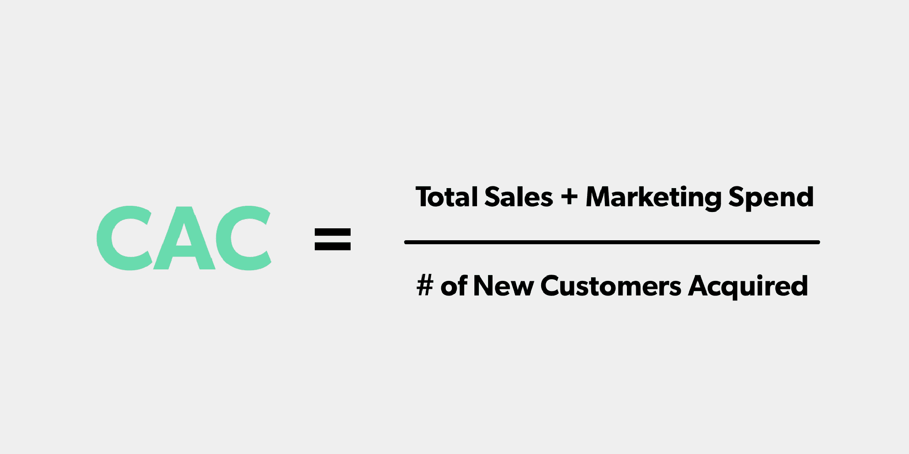
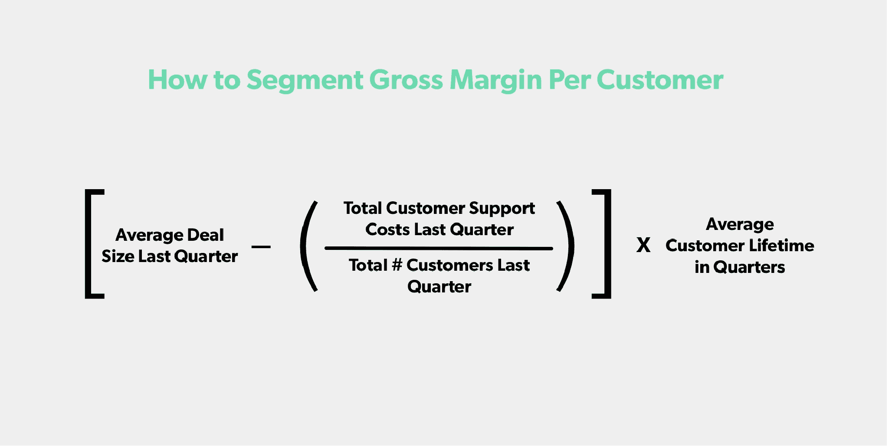
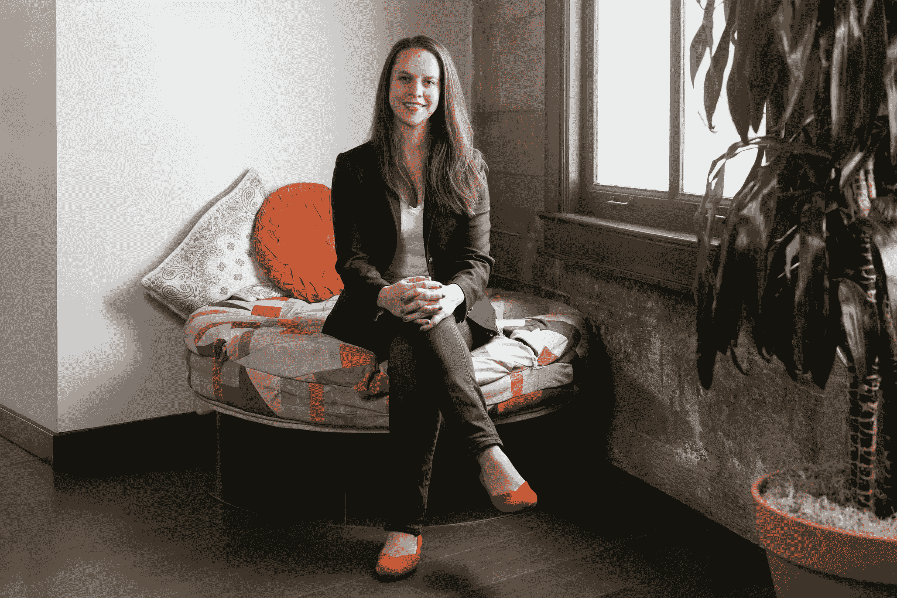

# 不惜一切代价的增长是危险的——这就是如何可持续地扩大销售|第一轮回顾

> 原文：<https://review.firstround.com/growth-at-all-costs-is-perilous-this-is-how-to-scale-sales-sustainably>

在她职业生涯的早期， **[凯伦·罗勒](https://www.linkedin.com/in/karenrhorer/ "null")** 在销售运营领导职位上步步高升，并与她的团队一起制定了一项雄心勃勃的招聘计划，试图对销售团队进行逆向工程，使其能够提供创业公司设定的同样雄心勃勃的预订量。

当时，这一举措似乎符合传统思维，传统思维沉浸在超增长和推动创业公司销售更多、更快的[三三双双咒语](https://techcrunch.com/2015/02/01/the-saas-travel-adventure/ "null")中。但是，达到这些顶线增长数字的压力造成了完全忽略等式的一边:可持续性。像许多其他公司一样，罗勒的初创公司没有足够早地意识到，数学并不支持他们为寻求增长而燃烧的大量现金。仅仅几年后，一切都得到了报应——近 40%的员工不得不被解雇。

罗勒从这个警示故事中吸取了教训，小心翼翼地避免在接下来的角色中犯类似的错误。她的职业生涯横跨咨询、财务和销售运营，她已经成为最具结构性和分析性的销售领导者之一，能够制定从宏观战略到执行非常战术性的实施细节的增长和绩效计划。她后来在 LinkedIn 成功管理销售战略和运营团队，整合了对 Lynda.com[的收购，并在 EMEA 扩展了学习解决方案，然后担任了 TalentBin](https://www.lynda.com/ "null") 联合创始人[的最新项目](http://firstround.com/review/To-Build-An-Amazing-Sales-Team-Start-Here-First/ "null")**[Atrium](https://www.atriumhq.com/auth/login "null")** 的客户成功和销售战略主管。

鉴于罗勒带来的经验，听从她的建议是值得的，尤其是当她提出警告的时候。因为最近，她注意到了同样的警告信号，即随着风险支票的膨胀和更多竞争对手的出现，不惜一切代价实现增长的销售心态正在硅谷卷土重来。在这次独家采访中，罗勒整理了她在职业生涯中关于扩大销售招聘的经验，希望能帮助其他公司避免她见过的太多创业公司犯的错误。她分享了领导者如何通过可持续员工规划的四个杠杆来克服快速提升销售额的压力，并详细介绍了避免烧钱的颠倒指标的痛苦未来的关键计算。

# 加油之前，要确保发动机在运转

这是一个古老的故事。创始人推动销售机构实现增长，以达到下一轮融资所需的数字。这一要求源于以收入形式展示产品/市场契合度的需要。随着大规模融资成为头条新闻，创始人觉得如果他们放松增长踏板，他们的竞争对手不会。最初的几个销售人员被雇佣了，这不但没有减轻压力，反而增加了压力。突然之间，计划将销售团队扩大一倍甚至三倍，作为对收入的一种紧急命令。

但根据罗勒的说法，这正是你需要暂停并处理数字的时候。“这种想法不会带来可持续、健康的创业。坦率地说，这是一个危险的简化标题，但最终却是一个简化的商业模式。它忽略了*所以*很多事情，”她说。“在你意识到这一点之前，你正在比你预期的消耗更多的现金，而预订量的增长比你预期的要慢，这是一场全面的危机。这就像组建一支军队，却忘记了所有的基础设施。你不想给系统施加太大的压力，而没有真正考虑清楚这看起来像什么。忽视现金消耗来实现短期增长可能会导致日后痛苦的裁员。”

不惜一切代价追求增长的心态是失控燃烧和颠倒的单位经济学的秘诀。

现在在 Atrium，Rhorer 正在寻求一种更有分寸的方法。“只是现在我们已经想出了销售行动，我们将在创始人之外雇佣一个人来专注于销售。她说:“这只是一次招聘，因为我们想在招聘一批客户经理之前，确保销售活动是真实的、可复制的。”。“在火上浇油之前，你需要了解基本原理，因为你想确保它进入一个正常运转的引擎，而不是一场将耗尽你的风险投资资金的大火。”

为了检查引擎灯，看看是否是时候扩大销售团队，创始人和销售人员需要清楚地看到推动可持续增长的齿轮。为此，罗勒制定了一个详细的流程，包括四个步骤，领导者可以利用这些步骤来确定扩大销售招聘的正确时间，并确保他们不会让未来的自己陷入代价高昂的下跌。

# 1)学习新数学:更好的(单元)经济学 101

创始人和销售主管首先需要扫清障碍，充分理解他们走向市场模型的单位经济学，计算最基本的要素。为了解决这项艰巨的任务，罗勒将其分解为四个子步骤，并提供了基本和更复杂的方法作为指导:

**提升您的客户获取成本计算。**

客户获取成本(CAC)是一个经常被引用的跟踪指标，但这个计算比看起来要复杂得多。根据罗勒的经验，人们通常会忽略抓住客户所需的销售和营销努力的全部成本。“你的销售人员不仅仅是他们的工资和佣金支出。除了营销方面的一切之外，还有与收益、管理开销和销售技术支出相关的成本。她说:“重要的是，要包括一个能充分消化所有真实成本的 G&A 分配。”

对于一个非常基本的估计，看看在销售和营销上花费的钱的总数，然后用它除以上个季度获得的新客户的数量。“当然，如果你的销售代表既赢得了新客户，又续订或追加销售了，我建议你算出他们在获取新客户上花费的大致时间，并利用这一分配来估计要包括的总销售成本的百分比，”罗勒说。

**如何更进一步**:通过按客户类型查看 CAC 的粒度细节，变得更加复杂。“如果你想更进一步，而不仅仅是分析你的整体 CAC，看看你支持的每个客户群，并按比例分配支出。如果你向真正独特的垂直市场销售，那么获得这些类型客户的成本将会不同，”罗勒说。“例如，营销部门可能会将不成比例的资源投入到中小企业客户身上，因为这一细分市场最适合通过营销活动实现规模化，而销售团队可能只关注企业客户。”

**计算你的客户终身价值(包括客户成功成本)。**

为了确保获取用户有利可图，初创公司需要计算这些新获得的用户的价值。许多人将客户终身价值(CLV)的力量吹捧为漏斗分析工具，罗勒认为这是在启动销售招聘之前要考虑的一个重要杠杆，前提是它包括对客户成功成本的全面考虑。

“在考虑了留住客户的成本后，你试图了解客户在成为客户的每一年里价值多少。人们经常忘记这一块。她表示:“他们很快就计算出了收入，但却忽略了随后的支出。”“作为一个基本的初始方法，**取您的平均交易规模，乘以您的净美元留存率，得到您的第二年预期值，然后在您期望您的客户保持客户的年数内一直这样做，以找到终身收入。然后乘以你的毛利润**,收回支持、保留和追加销售该客户的成本。这可能会变得有点复杂，因为你在功能上做的是[计算年金的现值](https://www.investopedia.com/retirement/calculating-present-and-future-value-of-annuities/ "null")，所以我构建了一个[简单指标计算器](https://docs.google.com/spreadsheets/d/1UFpU6xQ9dP66JJDZZ7kFL4KqyizKEX22a4ToFGeVCho/edit?ts=5b7ddb2e#gid=0 "null")来帮助简化这个过程。”

罗勒建议，在早期团队的平均客户生命周期仍然过早的情况下，可以依赖上面解释的流失率..“作为一个简化的数学假设，如果你知道你的客户群每年流失的百分比，你的平均客户寿命将与此相反。因此，如果你每年有 25%的客户流失，那么你的平均客户寿命是 4 年或 16 个季度，”她说。“不要硬数字，从合理的假设开始，持续监控以确保它们保持合理。如果你向中小企业销售，而且这是一种超级交易型销售，有很多竞争对手，转换成本很低，那么你的客户寿命可能会比做复杂企业销售的人短。”

**如何更进一步:**对于那些准备超越假设并更深入地研究 CLV 微积分的人，罗勒分享了超越初始方程的两个步骤:

**对成本采取更有针对性的方法。**“不要使用毛利润，而是要考虑支持客户的直接费用，如 AWS 服务器、满载客户管理和客户成功的人员和技术费用，”她说。“将这些相加，得出你的季度销货成本(COGS)，除以你当前的活跃客户数量，再乘以你的平均客户寿命中的季度数。然后，您可以从每位客户的总预订价值中减去支持客户的终生总成本。”

**按客户细分细分 CLV。**“在我第一次创业时，当我使用更基本的方法来看待整体 CAC 和 CLV 时，我们忽略了我们是在向三个不同的客户群销售，他们的经济状况差异很大，”她说。“我们发现，在这些细分市场中，获取客户的成本是不同的，但对于我们从每个细分市场获得的收入来说，差异并不明显。我们最终重新聚焦于企业细分市场，因为相对于客户获取成本，生命周期价值要高得多。”

**再次检查你的比例是否合理。**

计算完这些数字后，领导者应该评估一下他们是否在正确的轨道上。当谈到保持 LTV 和 CAC 一致时，罗勒遵循两条通用的行业经验法则:**瞄准至少是 CAC 三倍的 CLV**和**在不到 18 个月内偿还 CAC。**

“这些流行原则是有原因的，”罗勒说。“如果 CLV 只有 CAC 的 1 倍，那就意味着它只能覆盖你获得那个客户所花的钱。因此，根据定义，你的客户不会支付你的任何其他业务费用。这就没有留下任何钱来支付你的工程师建造和维护你卖给他们的产品，所以这显然是不可持续的。”

偿还 CAC 的书立同样植根于可持续性。罗勒说:“在一种情况下，获得客户的成本非常高，但客户会永远留在你身边，这种情况下，你有可能成为大规模盈利的企业，并有很长的回报期。”。“但通常投资回收期长意味着你要花费大量现金来扩大规模。”

如果偿还 CAC 花费了很长时间，这应该会触发一个警报，说明销售活动实际上并没有起作用。

对于那些努力达到这些关键比率的创业公司来说，根据罗勒的经验，这通常可以归结为他们走向市场的行动和他们所追求的客户之间的不匹配。“如果您有一个 SMB 内部销售活动，其中平均销售价格(ASPs)有点低，客户的续订率也不太好，如果您针对该客户配备整个团队，将很难实现单位经济效益。她说:“利润根本就不存在，你需要现实一点。”

# **为了让所有这些数据处理变得更容易，罗勒创造了一个** **[简单指标计算器](https://docs.google.com/spreadsheets/d/1UFpU6xQ9dP66JJDZZ7kFL4KqyizKEX22a4ToFGeVCho/edit?ts=5b7ddb2e#gid=0 "null")** **。插入您自己的数字来计算 CAC 和 CLV，并确认比率和回收期都在正轨上。**

**新员工的渐变因素。**

虽然人们很容易陷入增加销售人员会迅速促进增长的想法，但新员工显然不会在第一天就达成交易。每个新的 AE 在他或她加入公司的头几个月总是无利可图，但罗勒发现许多领导者未能将这种热情融入他们的财务模型。

“重要的是，你要知道新员工持续达到最高生产效率需要多长时间，这样你才能考虑到他们的负现金周期。他们的增长取决于你的平均销售周期，”罗勒说。“如果是四个月，那么一款新 AE 至少需要这么长时间才能上市。”

你不可能让一个客户经理在两个月内完全提高生产率。这是不可能的。

除了新手头几个月的生产力损失之外，罗勒还看到了其他人忽略的另一点。“许多人只是谈论人们能以多快的速度运转起来并带来现金。**但我认为没有提到的是如何有效地提升 AEs 来释放更多的管理带宽。**如果您计划缩短 AE 上升时间，您将能够更快地雇佣下一批 AE，或者专注于其他业务优先事项，因此加快入职真的可以增加您的企业价值。”

但是缓慢上升和不适合之间的界限是非常细微的——很难发现。罗勒为希望做出区分的团队提供了一些建议:

**对于第一个销售人员:**虽然将控制权移交给专门的销售人员可以让创始人松一口气，但这也可能是压力的来源。新员工可能很难找到他们的航海经验，所以领导者不确定如何衡量他们的表现是很常见的——并且怀疑他们是否做出了正确的决定，将销售工作推离了他们的盘子。“如果你让创始人做了足够长时间的销售，到了雇佣第一个销售代表的时候，你就已经知道成功是什么样子了，”罗勒说。“例如，在 Atrium，我知道我们的联合创始人[皮特·卡赞吉](http://firstround.com/review/Mine-Your-Network-for-Early-Stage-Hiring-Gold/ "null")一次处理多少个机会，以及他需要多长时间来关闭这些机会。我知道他的 ASP 是什么，也知道他每周参加多少次会议。因此，当我们有第一个 AE 加入时，我们已经知道了[入职计划](http://firstround.com/review/youre-losing-hundreds-of-thousands-of-dollars-because-of-poor-sales-onboarding/ "null")中的那些粗略基准。如果事情不尽如人意，我可以后退一两步，看看这是不是一次糟糕的招聘，或者联合创始人和 AE 的杠杆是否不同。”

**对于下一批 AE:**对于已经开始组建销售队伍的中后期团队来说，还有其他的标志需要寻找。“当您有一批新的 AE 时，将它们的斜坡与相同任期内的其他 AE 的斜坡进行比较。Rhorer 说:“建立一个成功 AE 的总体轮廓，并以安排的会议数量、推进的机会和建立的渠道为基准。“在整个销售周期结束之前，每月查看一名新员工的进展。随着时间的推移，您应该会看到机会的数量以及初次会议与后续会议的比率在上升。如果一切都如预期的那样，那么一切都正常了——你可以按照相同的训练或辅导计划坚持到底。如果这些方面有所欠缺，那么这就是你可以介入的地方。”

在招聘漏斗的另一端，关注流失率也很重要。罗勒说:“你不会希望到头来你雇佣的高级工程师永远不会真正为自己买单。”。“在增加任何额外员工之前，你必须解决培训、入职或留用问题；否则就是漏桶。”通过提前花时间确保这些角色中有合适的人来避免这种头痛。“确保你的雇员真的想做这份工作。我认识的一位销售主管让应聘者在正式被雇佣前先来试用一天，然后拿到报酬。罗勒说:“试用一天后，退出率相当高，但这是淘汰那些不认真的人的好方法。”

Karen Rhorer, Atrium's Customer Success & Sales Strategy Lead

# 2)填补交接中的空白

对于 Rhorer 来说，销售发展代表(SDR)和 AEs 之间的过渡是销售周期中特别重要的一部分，需要紧密且可重复的单位经济性。新的 AEs 需要可预测的流水线容量，因此将 SDR 生产率和保留率置于显微镜下非常重要。

“你总是会有随机的蓝鸟异常交易发生，但如果随着时间的推移，输入和输出非常相似，那么你就可以理解当你雇佣另一个 SDR 或 AE 时会发生什么，”罗勒说。以下是她在加速之前评估 SDR 性能的清单:

你知道一个新雇佣的 SDR 要多久才能达到全部生产力？

入站 SDR 是否以一致的速度将营销合格线索(mql)转化为商机？

出站 SDR 是否以一致的速度产生会议和销售接受的机会？

你知道 SDR 需要接触多少账户才能促成一次会议吗？

一旦系统正常运转，销售周期变得可预测，SDR 开始发挥作用，话题很快就会转向职业道路。这里有一种内在的紧张。成功的特别提款权通常渴望增长，尽管在上升期有大量投资，但他们并不渴望在自己的职位上呆超过 12 个月。似乎往往是一旦取得成功，特别提款权就得到提升，两端的上升周期又重新开始。

“我见过成功的一件事是**安排中间角色，以便在 SDR** 中有一个提升点。他们可以承担更多的责任或创造更多的收入，但你不会失去这种生产力，”罗勒说。“另一个策略是,[雇用一批具有超级增长意识的人，以及那些希望获得更多可预测性的人,](http://firstround.com/review/warning-this-is-not-your-grandfathers-talent-planning/ "null"),并乐于在特别提款权的角色中呆更长一段时间。这与许多公司对个人贡献者轨道和管理轨道的做法非常相似。”

回填时有远见也很重要。当人们在销售阶梯上获得晋升时，创始人应该提前计划一些事情。“我看到的一个常见陷阱是 SDR 表现非常好，并被提升为 AEs，但只有到那时，人们才开始考虑回填这些 SDR，”Rhorer 说。“如果你想确保新晋升的 AE 拥有自己的管道，**一旦你决定晋升，你就需要提出公开的 SDR 请求，试图雇用回填人员**。如果您有两个支持五个 AEs 的 SDR，并决定提升这两个 SDR 而不立即回填它们，那么它们之前生成的任何管道都将消失。这造成了一个缺口，需要通过 AE 自我发现来弥补，因为您现在有七个 AE 在一段时间内没有 SDR 支持。”

如果你只雇佣成长型特别提款权，你将面临巨大的管理挑战。但如果你不雇佣这些人，你就不会有内部人才管道。

# 3)培养你的客户经理

许多创业公司花时间了解他们的管道今天来自哪里，但在罗勒的经验中，没有足够的时间来研究它明天将来自哪里，以及如何为新的 AE 军团提供新的线索。

“人们认为雇佣销售人员会自动带来更多交易，但当你雇佣新的 AE 时，潜在客户数量不会随之增加。如果您目前有五个 AE，并且他们的渠道中有 50%来自入站渠道，那么再雇用五个 AE 意味着您将有 10 个 AE，其中 25%的渠道来自入站渠道，除非您让营销部门承诺提供更多线索。她说:“这几乎完全与你选择雇佣多少工程师无关。

为了长期满足新的 AE，Rhorer 提供了两种策略:

**按来源分解。**划分出您目前的预订来源。“了解今天市场营销和入站 SDR、出站 SDR 以及 AE 本身在总渠道中所占的比例非常重要，这样您就可以提前计划这些比例会如何变化。罗勒说:“这些比率实际上在很大程度上取决于你的上市策略以及你的销售对象是什么样的客户。“未来，营销将根据贵公司在 it 方面的投资而增长，而对外 SDR 销售线索应随着 SDR 数量的增加而线性增长。”

**将比率映射到销售周期。**当谈到 AE 和 SDR 之间的比率或后续会议与首次会议之间的比率时，Rhorer 建议瞄准与销售行动相匹配的目标。“如果您有一个大型企业销售周期，SDR 与 AE 的比率为 1:1 可能是合理的。Rhorer 说:“如果你做的是更多的中端市场销售周期，可能是每 SDR 两个 AEs。”“这也取决于你要求特别提款权做什么。一些组织只召开 SDRs set 会议，而其他组织则继续拥有机会，因此在将机会传递给 AE 之前，会对其进行进一步开发。她说:“说到跟进会面率，更多的是关于你的客户群。“在中小型企业或较低的中端市场销售周期中，我看到它仅低于或等于 1。因此，对于每个初次会议，你都有一个或更少的后续会议。对于中端市场销售活动，这个数字接近 2。对于一个企业销售周期来说，这一比例可能会非常高，具体取决于它的规模和复杂程度。”

# 4)在获得之前规划好关心

评估扩大销售招聘准备情况的最后一步包括查看在销售之后*到来的部分。*

“戴上销售帽子后，很容易忘记这是如何融入组织的其他部分的，但在你决定让更多销售人员加入之前，你真的需要诊断客户保留是如何进行的，”罗勒说。“客户经理(AMs)或客户成功经理(CSM)可能是您销售组织的一部分，但即使他们不是，他们也肯定是推动 LTV 发展的等式中的更新端的关键组件。”

无论是从零开始建立一个实践，还是评估当前的努力是否增加了价值，下面是罗勒关于思考扩大销售难题的客户成功部分的建议:

**创始人寻求如何构建客户成功的建议:**

“如果你没有客户管理或客户成功，我看到每年高达 50%的流失率，除非你已经建立了产品来为你做更新。但这并不是如今大多数初创公司的做法，”罗勒说。“我通常看到的结构是，AM 与业务决策者合作，负责续订和追加销售，而 CSM 则致力于最终用户的成功。我也见过这是一个组合角色。就这些角色的位置而言，两者都可以归入销售组织，但我也看到过他们成为首席客户官，这样一来，端到端的客户体验就归一个人所有了。”

当然，引入 AMs 和 CSM 通常会导致更低的客户流失率，但支持这一点需要大量成本。“这就是为什么所有的数学都在那里。罗勒说:“如果你的 LTV 有支持成本，你可以确保拥有它们的决定是值得的。

**对于试图评估当前留住人才努力的创始人:**

“当你考虑增加销售人员时，你需要考虑这会如何影响你当前的客户运营。您的每个 AMs 或 CSM 涵盖多少个帐户？他们满员了吗？”罗勒说。

她建议特别关注人员配置或每位经理账户数量的变化。“如果你一直在夸大客户成功，但知道这种模式从长远来看在财务上是不可持续的，你应该做好准备，随着客户成功模式从高接触转向低接触，”罗勒说。“同样，如果每个客户经理的客户数量或接触数量一直在变化，请注意这对产品使用和 NPS 等客户健康评分的影响，以便您可以预测未来对客户流失的影响，并相应调整您的 LTV/CAC 计算。但是，如果您对当前模型的工作方式感觉良好，唯一要做的就是确保您雇佣额外的 am 和 CSM 来配合额外的 AE。”

# 将这一切结合在一起

尽管点击销售驱动的增长按钮似乎是投资者寻求收入数字的一个有吸引力的捷径，但创始人应该在组建一支成熟的销售团队之前，花时间了解并微调他们的销售行动。通过[计算](https://docs.google.com/spreadsheets/d/1UFpU6xQ9dP66JJDZZ7kFL4KqyizKEX22a4ToFGeVCho/edit?ts=5b7ddb2e#gid=0 "null") CAC 和 LTV 来了解您的单位经济性，细分客户群并为更先进的方法定制更多成本。为了可持续发展，确保 LTV 是 CAC 的三倍，并在 18 个月内还清 CAC。在你的模型中为新员工建立斜坡时间，并设置检查点来评估他们的成功并确保一切都在正轨上。考虑为渴望 SDR 的人创建一个中间推广点，并雇用超级明星和摇滚明星的适当组合，以保持您的销售人才渠道稳定。通过回填获得晋升的 SDR，并使您的 SDR 与 AE 的比率与您的销售周期相匹配，来满足 AE。最后，不要忘记客户成功对 LTV 的影响。仔细考虑任何变化将如何影响客户流失，并确保根据 AEs 招聘 am 和 CSM。

“提前采取这些步骤将有助于确保你不会做出未来的自己负担不起的承诺。这是每个人都需要学习的一课。罗勒说:“我一直在与那些考虑招聘的首席执行官进行对话，因为他们被要求达到这个增长数字，但这里有太多事情需要考虑。“你必须考虑等式的所有其他部分，以了解是什么让增长变得可持续。当它工作的时候，你真的明白为什么吗？或者你知道如果不是该看什么吗？我亲眼目睹了当你在没有回答这些问题的情况下专注于增长，然后不得不解雇团队成员的后果。关注增长非常重要。但是，只关注增长而忽略其他事情可能是极其危险的——认真对待长期坚持的创始人需要在开始竞争之前记住这一点。”

*摄影由* *[邦妮雷伊米尔斯](http://www.bonnieraemillsphoto.com/ "null")* *。*