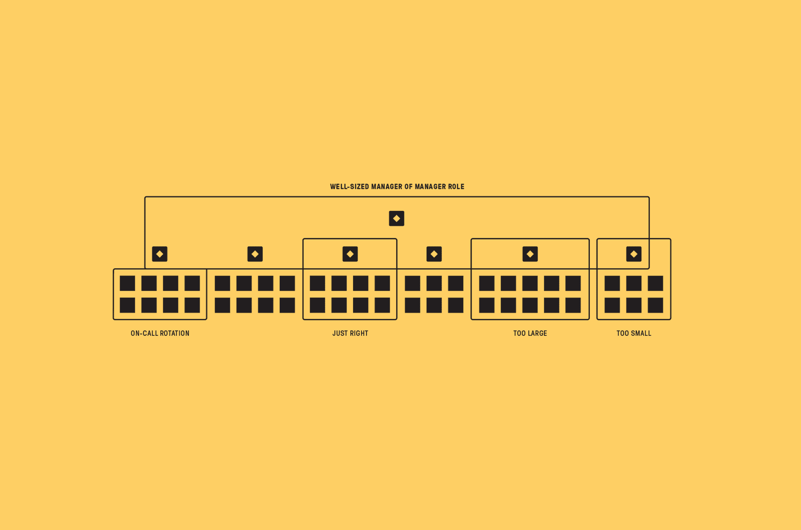

# 如何在 Stripe、优步和 Digg 评估 Eng 领导的团队|第一轮评估

> 原文：<https://review.firstround.com/how-to-size-and-assess-teams-from-an-eng-lead-at-stripe-uber-and-digg>

假设你的创业公司有一个随太阳运转的随叫随到的团队。有人总是开着。一天，您团队中的一名成员收到一条警告，称主 PostgreSQL 服务器上的磁盘空间将在两小时后耗尽。一小时后，他又收到一页。30 分钟后，磁盘空间耗尽，整个网站瘫痪。整整 18 个小时。幸运的是，你的双层架构可以让你的网站和应用保持在线，但你的业务后端已经停止了。你的 CTO 怒不可遏。他说你必须解雇那个随叫随到提出观点的工程师。

这是一个困难的情况，但它会变得更难。这不是你最好的人之一的失误，你可以责备他，但最终会用他们的记录捍卫他。您的报告在停机期间随叫随到，但表现不佳——总体而言，工作表现不佳。一蹴而就，你可以为停机制定纪律，触发可能注定的终止，并按照你的经理行事。但是那*对吗*？你对你的 CTO 说什么？

重点是少了最终的*结局*:那个 **[将拉森](https://twitter.com/lethain "null")** 承担责任并要求 CTO 解雇他。或者他和他的报告保住了他们的工作，那个工程师得到了更好的培训。这是为了展示管理可以变得多么复杂——以及为什么，如果做得好，这是一个非常道德的职业。以下是拉森对首席技术官的瞬间回应背后的一些计算:如果我解雇了工程师，给团队的信息是我们毫不含糊地惩罚错误。说工程师可能很快就会被解雇。如果是真的，现在解雇他将是出于错误的原因做了正确的事情。对于所有相关人员，我们将完全失去信息。如果是这样的话，对团队的损害将是如此之大，以至于我不会觉得领导它很舒服。

这种推理模式更可能出现在哲学著作中，而不是商业案例中。虽然他的管理方法在招聘和解雇时最受考验，但它是在十年的成长和领导快速增长的工程团队中形成的。一些亮点:在 Digg 时，他雇佣并领导了一个由 14 名基础设施和 UI/UX 工程师组成的团队，他们负责整个 Digg.com、API 和移动应用。在[优步](https://www.uber.com/ "null")，他带领 SRE 和平台工程团队从 5 人发展到 70 多人，优步的工程团队增长了 10 倍，超过 2000 人。现在在 **[Stripe](https://stripe.com/ "null")** ，Larson 领导基础工程，创建外部和内部开发工具、数据和基础设施。他的团队共有 170 名工程师，分布在都柏林、旧金山、西雅图和 18 个城市。

在这次独家采访中，拉森深入探讨了组织设计的两个关键组成部分。具体来说，他分享了他评估工程团队的规模和状态的系统——不仅是以一种高效和有效的方式，而且是以一种深切的同情和道德的方式。Larson 从他的书 *[中摘录了一个优雅的难题:工程管理系统](https://www.amazon.com/Elegant-Puzzle-Systems-Engineering-Management/dp/1732265186 "null")* (今天发布)的内容，为构建团队规模、组合和组建团队以及评估和加速团队进展带来了比率和框架。他为新的和经验丰富的经理提供精确和全面的团队设计思路。让我们开始吧。

为喜欢的人做正确的事很容易。便宜的时候容易做正确的事。只有困难的时候才是最重要的。

# 确定团队规模是组织设计的核心

当经理们钻研组织设计时，他们经常触及一些抽象的东西，比如一个任务，来创建和定位一个团队。“许多经理围绕一个有凝聚力的、统一的愿景组建团队。谁没有经历过团队或公司的使命陈述练习？拉森说:“首先，你要涵盖你想做什么，然后是你想怎么做。“不可避免地会有人提到安然的价值观，以及看起来像你自己的原则是如何被搁置的。然后你开始工作，很少再重温那些陈述和原则。”

经理们经常走的另一条路是根据他们面前的产品或技术来设计团队。“康威定律(T7)基本上说明了产品反映了组织。拉森说:“嗯，这种现象是双向的。“与此相反的是，组织的建立是为了反映产品。但是，如果你过多地围绕你当前的产品或技术进行设计，你就让自己处于反复变化的境地，尤其是当产品迭代、发展、衍生或衰落的时候。这可能会让团队陷入无休止的循环。”

相反，Larson 认为组织设计的基本挑战——和基石——是确定团队的规模。“最强大的工作单位是一个团结的团队。拉森说:“知道如何合作并善于合作的人能够完成真正非凡的事情。“当管理人员围绕当前的产品或架构进行设计时，他们会流失人员，并失去我认为世界上唯一真正可再生的能源:真正热爱——并知道如何——一起工作的人。”

有许多关于[招聘](https://firstround.com/review/hire-a-top-performer-every-time-with-these-interview-questions/ "null")和[招聘](https://stripe.com/atlas/guides/recruiting "null")的优秀指南，都提到了团队中人员的*素质*，但是 Larson 注意到团队中人员的*数量*对做好工作同样重要。当他从支持一个团队转向支持一个组织时，他充分认识到了调整团队规模的重要性。这时，一系列新的挑战和问题出现了:

我们应该有几个队？

我们应该为这个计划创建一个新的团队，还是让一个现有的团队来承担它？

这两个团队的界限是什么？

对于 Larson 来说，这些问题都导致了对团队规模的评估——不仅在组建团队时，而且在应对重组、招聘冻结或冲刺以及发布时。虽然他承认团队规模没有统一的法则，但 Larson 开发了一个框架，解决了他面临的大多数情况——以及当团队变得太大或太小时会发生什么。

*这是拉森自己的剧本，摘自他的书:*

# 经理应该支持六到八名工程师。

这给了他们足够的时间来积极地指导、协调和推进他们团队的任务，比如写策略、领导变革等等。

**技术主管经理**。支持少于四名工程师的经理倾向于充当 tlm，承担部分设计和实施工作。对于一些人来说，这个角色可以独特地发挥他们的优势，但这是一个职业机会有限的角色。要想成为一名经理，他们需要更多的时间来培养自己的管理技能。或者，为了向员工工程角色发展，他们会发现很难在技术细节上花费足够的时间。

**教练**。支持八到九名以上工程师的经理通常充当问题的教练和安全网。他们太忙了，没有时间积极投资于他们的团队或他们团队的责任领域。在向更稳定的配置过渡期间，要求经理支持更大的团队是合理的，但这是一个糟糕的现状。

# 经理的经理应该支持四至六名经理。

这给了他们足够的时间来指导，与利益相关者保持一致，并对他们的组织进行合理的投资。另一方面，这也会让他们足够忙碌，以至于他们不会被诱惑去为他们的团队创造工作。

**升速**。支持少于四名其他经理的经理应处于积极学习问题领域或从支持工程师过渡到支持经理的阶段。在稳定状态下，这可能会导致人们感到未被充分利用，或试图干涉日常运营。

**教练**。类似于支持一个大的工程师团队，支持一个大的经理团队让你纯粹作为一个解决问题的教练。

# 随叫随到需要八名工程师。

对于生产随叫随到的责任，我发现双层 24/7 支持需要八名工程师。随着拥有自己的寻呼机的团队变得越来越主流，这已经成为一个重要的规模限制，我试图确保每个工程团队的稳定状态是八个人。

**共享旋转**。有时有必要将多个团队聚集在一起，以达到 24/7 随叫随到轮换所需的八名工程师。这是团队拥有自己的随叫随到轮值的一个有效的中间步骤，但不是一个好的长期解决方案。大多数人发现，他们不熟悉的组件随叫随到会给他们带来极大的压力。

# 小团队(少于四个成员)不是团队。

我赞助过不少一两个人的团队，每次都很后悔。重复一遍:我每次都后悔。团队的一个重要属性是，他们抽象出组成团队的个人的复杂性。少于四个人的团队是一个有足够漏洞的抽象，他们的功能与个人没有区别。要对一个小团队的交付进行推理，您必须了解每个随叫随到的班次、假期和中断。

他们也很脆弱，一次离开就很容易让他们从创新退回到维持技术债务的苦役中。

# 将创新和维护放在一起。

一种常见的做法是，在现有团队陷入维护困境时，组建一个新团队进行创新。我自己也曾经这样做过，但是我在现有的团队中进行了创新。这需要深思熟虑的决策和一些勇气，但作为交换，你将获得更高的士气和学习文化，并将避免创建创新者和维护者的两级系统。

将这些指导原则结合在一起，我开发的剧本出奇的简单有效:

在稳定状态下，团队人数应为六到八人。

要创建一个新的团队，将一个现有的团队发展到八到十人，然后发展成两个四五人的团队。

永远不要创建空团队。

不要让经理支持超过八个人。

像所有准则一样，这是一个帮助思考规模问题的结构，而不是限制每个例外的紧身衣。任何情况的背景都值得仔细研究，但我越来越发现，异常的长期成本超过了我曾经认为的它们的优势。

我开始相信将组织分成八份可以让你看到他们的未来。了解经理们的负担，你就能充满信心地预测未来。

Sizing teams and groups of teams using sizing rules

Larson 关于团队规模的基本框架不仅导致了组织的健康，还导致了更有效的——和道德的——管理实践。以下是该系统可以提供的功能:

**清晰的职业轨迹。**

“组织中领导的主要目标是分配稀缺资源。时间和预算经常被提及，但同样稀缺的是管理机会——尤其是经理对经理的角色。假设经理与工程师的比例为 1:8，或者经理对经理的比例为 1:40。或者每个团队只有几个技术领导，或者每个组织只有几个工程师，”Larson 说。

“当团队的标准规模确定后，几乎每一个职业机会都会受到限制。将会有新的角色类型，但是团队将会成长，萌芽，并且那些团队规模比例将会重新设定。有鉴于此，经理们——以及他们的团队——清楚地知道如何以及何时在一个组织中出现管理机会。这种一致性和透明度有利于所有参与者。结合[职业对话](https://firstround.com/review/three-powerful-conversations-managers-must-have-to-develop-their-people/ "null")，这一系统为设定职业期望铺平了道路。

**每份报告中有意义的投资**。

“在一家快速发展的公司，团队比率会有波动。管理者可能会花更多的时间在新员工身上，而不是老员工身上。安迪·格罗夫的 *[高产出管理](https://www.amazon.com/High-Output-Management-Andrew-Grove/dp/0679762884 "null")* 中概述的经典方法是，管理者应该每周花大约半天时间在每份报告上。拉森说:“这不仅仅是你花在每个人身上的*时间，还包括经理审查、发展和反思这个人的工作领域的独立时间。”。“每周与团队中的每个人面对面交流的最少时间是一个小时，尤其是当你是直线经理的时候。然后，根据你的结构，你会有三四个真正重要的同事，比如项目经理合伙人。你将和这些人中的每一个人相处半个小时。”*

现在让我们来计算一下这对一个有八名工程师的经理意味着什么——以及她的日程表和其他任务是什么样子的。“八个工程师意味着八个小时的 1:1。假设你有四个同伴，你每周花半个小时和他们在一起。现在你已经 10 个小时了。然后是每周一次的团队会议，比如几个 sprint 签到和一个更大的团队会议。现在你一周工作 12 个小时。当然，你在面试，因为你成长很快。加上三个小时的面试，你就有 15 个小时了。然后会有一个全体会议和跨职能会议，所以让我们增加到 20 人，”拉森说。

“突然之间，你一周的一半时间都在开会。对于那些想思考和行动的人来说，这是一个很高的比例。他说:“如果你已经和一个团队一起工作了很长时间，你或许可以把 1:1 的时间压缩到 30 分钟，或者每隔一周换成 1:1 的时间。“但当业务快速增长时，总会有沟通和行动的背景，所以我还没有发现有人可以在不造成低效率和压力的情况下降低这一承诺。**这就是为什么这位经理将团队规模保持在八人不仅高效，而且合乎道德。**现在是通知、协调、指导和装备的关键时刻，以便准确、充分地指导和展示他们的工作。减少每份报告的投资或增加总报告的投资在短期内可能是可行的，但我发现从长期来看，这会侵蚀团队。”

**上移腾出空间**。

“我们大部分时间都在谈论经理下属的职业道路，但经理自己也必须抽出时间来发展和获得晋升。管理者通过在团队之外工作来做到这一点，而不仅仅是在团队内部和团队内部。拉森说:“道德经理只有在她的团队运作顺利的情况下才会这么做——这也是严格规模控制的另一个原因——但仍需要为整个公司的努力腾出时间。

“对于忙碌的经理来说，跨公司的工作往往在周末仍在清单上，但其实不应该。当然，这位经理希望像任何员工一样成长，但这位*道德型*经理认识到，她成长到一个新的职位，以便她的角色成为团队或组织中其他人的公开机会，这对她的员工和组织都是必要的。”

# 衡量和加速进展

标准的规模确定作为度量单位给团队带来了一致性，但是团队一起构建什么以及如何构建需要不同的系统和它自己的语言。在下面的框架中，Larson 提供了团队的四种不同状态——以及经理如何识别团队的当前状态，指导团队在状态之间转换，并为团队的新状态提供截然不同的支持。这是拉森的系统，摘自他的书:

# 团队的四种状态

该框架从描述团队及其在周围环境中的表现的词汇开始。

团队分为连续的四种状态:

**如果一个团队每周的待办事项都比前一周长，那么这个团队就落后了。通常情况下，人们工作非常努力，但没有取得多大进展，士气低落，你的用户不满意。**

**如果**团队能够完成他们的关键工作，但不能开始偿还技术债务或开始新的重大项目，那么他们就停滞不前了。士气有所提高，但人们仍在努力工作，你的用户可能会更高兴，因为他们知道寻求帮助不会有任何结果。

Four stages of a team’s progress, from falling behind to innovating.

**当**团队能够开始[偿还技术债务](https://firstround.com/review/forget-technical-debt-heres-how-to-build-technical-wealth/ "null")时，他们就在偿还债务，并开始从债务偿还雪球中受益:你偿还的每一笔债务都会导致更多的时间来偿还更多的债务。

**当团队的技术债务持续较低，士气高昂，并且大部分工作满足新用户需求时，团队就在创新。**

团队想要从落后的*爬到创新的*，而熵却拖着他们后退。每个国家都需要不同的策略。**

# *系统修复和战术支持*

*在这个框架中，团队通过为他们的当前状态采用适当的系统解决方案，专门过渡到一个新的状态。作为经理，你的职责是为给定的过渡确定正确的系统解决方案，启动该解决方案，然后尽你所能支持团队，为解决方案创造发挥其魔力的空间。如果你在启动正确的系统解决方案之前就跳到战术上支持团队，你将会耗尽自己的精力，而且没有得救的希望。*

*对于每个州，以下是我认为最有效的战略解决方案，以及在解决方案实现时如何支持团队的一些想法:*

***1。当团队落后于**时，系统修复是雇佣更多的人，直到团队进入停滞状态。通过与用户一起设定期望，围绕你能找到的容易的胜利进行宣传，并注入乐观情绪，来提供战术支持。作为一个警告，系统修复是雇用全新的人，增加公司的整体能力。有时候，人们反而试图从现有的公司获取更多的资源，我对此非常反对。人是不可替代的，通常人们最终会在有用的地方，所以我对重新分配现有的个人来推动优化持怀疑态度。从本质上来说，这种讨论也不可能不带有政治色彩，即使参与讨论的每个人都相互信任和尊重。*

***2。** **当团队停滞不前的时候，**系统修复是为了巩固团队的努力以完成更多的事情，并减少并发工作，直到他们能够开始偿还债务(例如，限制工作进展)。从战术上讲，这里的重点是帮助人们从个人的生产力观点转变为团队的观点。*

***3。团队在还债的时候，**系统修复是加时间。一切都已经在工作，你只需要找到空间，让偿还技术债务的复利价值增长。从战术上来说，设法在偿还债务的同时支持你的用户，避免从用户的角度消失在技术债务偿还中。特别是对于一个开始落后并正在偿还债务的团队，您的利益相关者可能会坐立不安地等待团队开始交付新的东西，而您的义务是防止这种不耐烦导致倒退！*

***4。** **创新**有点不同，因为你名义上已经到达了连续体的终点，但是仍然有一个系统修复！在这种情况下，在你的团队的时间表中保持足够的松弛，这样团队就可以将质量融入到他们的工作中，在创新中持续运作，并避免走回头路。从战术上来说，确保你的团队正在做的工作受到重视:创新的最快途径是被视为一个建立科学项目的团队，这不可避免地导致团队被取消资助。*

*我不能强调这些修复是缓慢的。这是因为系统积累了几个月或几年的静电，你必须把它们全部排掉。相反，使这些修复缓慢的相同属性使它们一旦生效就非常持久！*

*

Will Larson, Foundation Engineering Lead at Stripe* 

*困难的部分是保持对你的计划的信心——包括你的信心和更广泛的组织的信心。在某种程度上，你可能想通过重组来洗清责任，或者跳到一份新的工作，但是如果你这么做了，你也跳过了你需要学习的部分。沿着小路走。*

*管理最难的部分之一就是等待一个好的选择来导致改变。对于像人类和团队这样的复杂系统，有一个比我们预期的更长的滞后。在做决定后，给自己和做决定前一样多的耐心。*

# *超越四种状态*

*Larson 描述团队及其表现的系统可能需要实践，但他有一些技巧可以帮助经理们用他的框架加速他们的成功。*

***求引流率，不求拐点。***

*拉尔森承认，四个步骤中的每一个步骤之间的演变看起来更像是跳跃而不是步骤，但这是有原因的:管理者应该给每个过渡足够的时间。“是的，这些是国家之间的大跳跃。拉尔森说:“但这是考虑到团队在彼此之间移动时必须具备的耐心。“对于经理来说尤其如此，他们可能会做出决策并期望快速的结果。这就是管理团队的可怕之处:成功和失败的区别通常在于对你正在做的事情有信心，并稍微等待一下。也许这就是可怕之处:缺少的往往只是时间。”*

*为了说明这一点，拉森举了他职业生涯中的一个例子。“有一段时间，我们的数据基础架构团队经历了多次宕机，我们经常无法满足服务级别协议的要求。我们有一个很棒的团队，但是他们感觉真的超负荷了。感觉没有希望了。他们一直在半夜收到传呼。我们做了所有这些技术工作，为什么它不工作？”拉森说。“事实证明，我们只需再坚持做两个月，然后事情就发生了变化。回过头来看，我们没有考虑到技术债务的*流失*。在情况好转之前，需要对事件进行足够的补救。”*

*诱惑在于寻找拐点并确定因果关系。拉森再一次提起了这个故事。“作为管理者，我们总是想指出我们做过的这一件事。“我们推出了这次 Hadoop 升级，一切都得到了改善，”Larson 说。“但事实上，这是在一段时间内做几件事情的高潮，导致它突然翻转。”"*

*拐点只是持续实施的一件非常合理的事情。通常，伟大领袖的作用不是想出一个绝妙的策略，而是用一个非常基本的策略来说服人们坚持到底。*

*拐点向团队交付更好的叙述，并且更容易跟踪。但是 Larson 建议经理们帮助团队在状态之间导航，以跟踪“流失”的速度或状态之间的滞后时间，而不是局限于任何一个转折点。*

*“以从‘还债’到‘创新’的状态为例。”我在这里想了很多的是排水事件。“但是你不知道有多少没有发生的事件在那里，”拉森说。但是在宕机的情况下，您可以查看事件发生的根本原因的时间，以及找到事件根本原因的时间是否越来越短。你可以开始获得一个代理，看看你是否在排除这些潜在的事件。一旦你有信心坚持到底，你就可以把精力放在寻找代理人上，以验证和预测决策结果何时实现。当一个团队进入一个新的状态。"*

*工作士气和用户满意度不会同步发展。*

*在 Larson 的系统中，他注意到团队士气和用户满意度在不同的状态下是如何波动的。一个假设可能是团队和用户的满意度是一致的。“通常，当你开始做更多的技术工作时，团队会变得非常有动力，因为他们知道这是必须的，但你的用户往往会变得非常沮丧，因为你做得更少来帮助他们，”Larson 说。“早期状态尤其如此，比如当你的团队处于‘落后’或‘踩水’状态时。”假设你需要雇佣 10 个人来运送你的用户需要的东西。通常在这种情况下，你不得不暂时为你的用户做更少的工作，以达到你可以为他们做更多工作的目的。"*

*这可能是一个很难讨论的话题——无论是对你的团队还是用户。“如果到目前为止你已经为用户做了很多，那就很难解释为什么他们必须等待，尤其是当他们依赖你的时候。但如果你的团队处于‘落后’或‘停滞不前’的状态，无论如何也看不到前进的迹象，”拉森说。“在这种情况下，你必须做出艰难的取舍，不做某事。这是一个选择，让你今天继续失败，这样你明天就可以成功，而不是继续无限期地失败。这就是为什么一个经理必须知道如何引导团队经历这些状态。如果她这么做了，用户和她的团队都会信任取舍。”*

# *把这一切联系在一起*

*经理们专注于寻找和雇佣优秀人才是正确的，但他们应该同样关注他们管理的团队的规模。例如，工程经理应该支持六到八个开发人员，经理的领导应该支持四至六个经理。保持这种一致性不仅对经理和团队——职业道路、时间管理、技能发展——有影响，对整个组织也有影响。一旦确定了标准的团队规模，管理者必须评估并加速团队的进展。团队状态是连续的，从“落后”到“踩水”，“偿还债务”到“创新”。团队想从第一个状态爬到最后一个状态，但是熵把他们拉向后面。每种状态都需要一个管理者有不同的策略——以及耐心和信心。综上所述，规模框架和绩效评估系统不仅能带来更高效的管理实践，还能带来更道德的管理实践。*

*“有一次，我发现自己直接管理着 28 个人。没有办法在任何可预测的时间内看到所有这些人，更不用说完成我剩下的工作了。回顾过去，我奋力拼搏。我找了几个技术领导来承担一些管理工作，每周花一个小时和他们在一起。拉森说:“我和我的其他员工每月交谈一小时。*

*“对一些人来说，这可能不是明显的错误选择。但我看到与我的人的沟通和环境开始受到影响。我没有提供良好反馈的背景。在这种情况下，管理者要么给出不好的反馈，要么给出一般性的指令性建议。如果你有自知之明，你会退缩，但那样你就没用了。使用标准的团队规模和使用一个系统来发展团队不仅仅是工具，而且就像管理者的希波克拉底誓言。这是承诺不伤害，认真有效地建立一个团队*和**

**摘自* *[一个优雅的谜题:系统的工程管理](https://www.amazon.com/Elegant-Puzzle-Systems-Engineering-Management/dp/1732265186 "null")* *和礼貌的* *[将拉森](https://twitter.com/lethain "null")* *。摄影由* *[埃弗雷特](http://www.typochondriac.com/ "null")* *。**