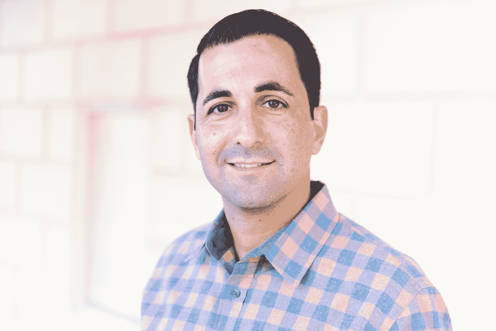

# 我问了 100 位创始人、首席执行官和风投关于职业转型的问题——以下是我学到的东西|第一轮回顾

> 原文：<https://review.firstround.com/i-asked-100-founders-ceos-and-vcs-about-career-transitions-heres-what-i-learned>

创始人的一生几乎没有停顿的时间。从[下一个大的创业想法出现的那一刻起](https://firstround.com/review/90-of-feedback-is-crap-how-to-find-the-next-big-startup-idea/ "null")，速度就由对规模的极度追求决定。总会有另一个漏洞需要修补，另一个融资，另一个紧迫的优先事项迫使创始人既成为时间管理的[大师](https://firstround.com/review/our-6-must-reads-for-honing-focus-and-managing-your-time/ "null")，又成为在高压锅环境中管理压力的[大师](https://firstround.com/review/make-friends-with-the-monster-chewing-on-your-leg-and-other-tips-for-surviving-startups/ "null")。给飞速发展的创业生活踩刹车似乎是不可想象的——如果你真的敢停下来，那感觉就像是在自由落体。

今年早些时候，萨莎·奥尔洛夫冒险一试。2019 年 1 月，奥尔洛夫发表了一篇简短的文章[，标题直接为“我的下一步”在信中，他宣布自己将辞去](https://www.linkedin.com/pulse/my-next-steps-sasha-orloff/ "null")**[LendUp](https://www.lendup.com/ "null")** 的首席执行官一职，这家公司是他共同创立的，并在七年间不断壮大。他指出，他没有另一个位置排队；相反，他计划休假(确切地说是 100 天)来重新设定、反思和评估他下一步的目标。在反思期间，他还致力于一项雄心勃勃的努力:与其他创始人、首席执行官和投资者进行 100 次咖啡聊天，以获取职业转型方面的智慧。

奥尔洛夫的《百杯咖啡的间隙》让我们看到了一个鲜为人知的创始人生活故事:创业后的故事***。奥尔洛夫说:“在创业生活的狂热中，创始人只是想跟上下一个迫切的需求。“但当你的初创公司已经成长为一家成熟的公司，你准备离开它时，你会面临一个新的、几乎是生死攸关的挑战:决定下一步做什么。”***

*创业者面前有许多道路。你会留下来学习管理大型企业的诀窍吗？作为一名连续创业者，你会再次陷入狂热吗？或者你会尝试一个全新的角色？*

*从如何思考你自己的个人和职业发展，到在不可避免的过渡时期应对不确定性，奥尔洛夫的经历对任何阶段的创始人都是有价值的，无论你是在成功收购后离职、[刚经历一次失败](https://firstround.com/review/founder-exposed-opening-up-about-startup-failures-and-vulnerability/ "null")还是需要休假来照顾自己。即使你不是创始人，我们认为你也会找到关于考虑职业转型、安排休假和计划下一步行动的宝贵建议。*

*在奥尔洛夫从创业生活中休假 203 天后发布的这次独家采访中，他公开了他从转型章节中获得的见解。首先，他讨论了导致他决定辞职的因素，为其他创始 CEO 提供了有用的框架来思考他们角色的双重性质。在他的 100 次咖啡聊天中，他分享了他的网络策略和他从科技领域的圣人运营商那里获得的智慧。最后，他向创始人提供了一种方法，让他们在决定继续前进后，思考如何培养自己的成长和目标。奥尔洛夫的教训提醒企业家们，如果需要的话，可以停下来，满怀信心地跃入未知领域。*

# *有时候，前进的唯一方式就是下台*

*创业成功故事中有一些我们已经烂熟于心的元素。故事从创始人卑微的出身开始，沿着他们英雄的旅程经历考验，最后以辉煌的退出结束，我们的主角仍然担任创始 CEO。*

*对观察者来说，奥尔洛夫似乎生活在创业童话中。作为 LendUp 的创始首席执行官，他小心翼翼地扩大了公司的规模，从两名联合创始人发展到两个办公室的 250 名员工，并筹集了 5000 万美元的 c 轮融资。他做了一切“应该”做的事情。即便如此，他也无法摆脱某种失衡的感觉。*

*当他第一次感受到不确定性的阴影时，他打消了自己的疑虑。奥尔洛夫说:“来自媒体、董事会和团队的压力如此之大，以至于创始人应该从一开始就把公司经营成价值数十亿美元的公司。”在一个美化巨大成功、戏剧化创始人失败的行业里，创始人常常觉得他们被期望在 IPO 之前一直担任首席执行官。*

*此外，奥尔洛夫观察到，在过去的 20 年里，风险资本融资的结构已经发生了变化。“当我进入硅谷时，人们普遍认为，创始人会在某个时候离职，任命一位更有经验的首席执行官。由于各种原因，这种情况已经发生了变化，包括资本的可用性更高，孵化想法的成本更低，以及投资者愿意让创始人掌舵，这意味着创始人通常有机会呆得更久。他说:“如果这是你作为一名创始人想要的，那很好，但你也应该认识到，你不会感到有压力，要比你想要的时间更长地呆在一个位置上。”*

*媒体和风险投资的结合似乎推动了这样一种说法，即继续担任创始 CEO 是创业成功的唯一 T2 定义。“虽然我们当然应该庆祝人们的成就，但贝佐斯和贝尼奥夫这两个世界名人获得了最大的关注。但对他们中的每一个人来说，还有雷德·霍夫曼或拉里·佩奇和谢尔盖·布林，当该继续前进的时候，他们把缰绳交给了别人。**现实中，成为创始人 CEO 并一直留任的人很少。不要觉得你必须把自己推进一个成功的模板**。*

*当他解决困扰他的疑虑时，问题变得清晰了:“**我的公司终于到了这样一个地步，它需要的东西和我擅长并有兴趣做的事情已经完全不同了，**”他说。*

*在这之前，奥尔洛夫从未质疑过自己作为创始人 CEO 的角色，因为他从来不需要这么做。“一开始，责任是一样的。但几年下来，‘创始人’和‘首席执行官’的角色变得越来越不一致，”他说。“作为创始人，我喜欢做的是将证据转化为概念，[寻找产品/市场契合度](https://firstround.com/review/how-superhuman-built-an-engine-to-find-product-market-fit/ "null")并扩大规模。现在我的公司已经达到了成熟的阶段，我被要求做一些完全不同的事情:LendUp 是一家金融科技公司，所以随着我们的成长，我们面临着更多的监管考虑，更复杂的问题，需要不同于我作为创始人所磨练的专业知识。尽管我对公司的热情丝毫没有改变，但我不确定这是否是我想继续从事的工作。”*

*一个创始人从无到有。首席执行官管理已经存在的东西。这是两种完全不同的工作，需要完全不同的技能。不是每个人都适合同时扮演这两个角色。*

*在这里，奥尔洛夫总结了创始人和首席执行官之间的两个主要差异，并解释了为什么“创始人首席执行官”可能不是每个人都适合的角色。*

***责任:**“作为一名创始人，你的动力完全来自试图解决一个问题，并找到产品/市场的契合点。你对公司拥有最大的控制权，”他说。“当你是一家成立 7 年、拥有 250 名员工的公司的首席执行官时，你会花更多时间考虑资本配置和公司资源。你的主要责任是对股东的信托。你可能正在管理一个日益活跃的董事会。这需要一套完全不同的技能，与你在公司成立最初几年磨练的创业工具不同。”*

***风险:**“创始人天生就有很大的风险偏好。你必须能够感到舒适，甚至兴奋，在一个可能不会成功的想法上下大赌注。另一方面，如果你是一家已经取得一定成功的公司的首席执行官，你就不能再进行如此大胆的赌博了。你需要多加小心，因为你*确实*会有所损失。”*

*奥尔洛夫说:“**人和公司** **[以不同的速度](https://firstround.com/review/the-science-of-speaking-is-the-art-of-being-heard/ "null")** ”。“在公司成长的某个阶段,‘创始人’的创新、冒险品质变得不那么有用，而首席执行官的专业、细心品质变得更加重要。如果你发现你喜欢的和你的公司需要的有分歧，那其实没关系。以我在金融服务等定义明确的行业领导一家公司为例，随着公司的成熟，经验比我更丰富的人会给股东带来更多价值。”*

*“创始人”的角色不是一成不变的。你在第 7 年的职责将会与第 1 天的职责有根本的不同。*

*也就是说，如果创始人开始感觉到他们作为创始人的工作和他们作为首席执行官的新职责之间的差异，有办法弥补这种差异。奥尔洛夫说:“对于那些想继续当 CEO 的创始人来说，我强烈建议找一位职业教练。“一开始，我没有意识到有多少人有一个。大约在我们开始扩大规模的时候，我和其他 24 位成长期的创始人参加了一个 Y Combinator 会议。[主持会议的阿里·罗加尼](https://www.linkedin.com/in/ali-rowghani-26996a1b/ "null")说，“如果有教练，请举手，”*除了我，所有人都举起了手。我心想，‘好吧，我一定是错过了创始人课的那一天。’第二周我开始采访教练。"**

*教练可以帮助你提高那些在大公司中至关重要的技能。“我必须学习的一项首席执行官技能，是如何管理职业高管，这是我作为创始人不一定具备的，”他说。“当你是一家初创公司时，你的领导团队可能看起来像一群才华横溢、与社会格格不入的乌合之众，他们和你一样，都是边走边即兴创作。但是，一旦你扩大规模并吸引了公认的人才，你的领导团队的构成就会发生变化。管理一位有 20 年经验的 C-Level 高管完全是另一回事。我非常依赖我的教练和年度 360 度训练来帮助我提高这项技能。”*

*CEO、创始人，还是两者兼而有之？创始人职业生涯的试金石。*

*尽管教练能帮助创始人更好地应对创始人和首席执行官的双重角色，但创始人仍需要积极评估自己对这份工作的感受。"**随着公司规模的扩大，在这位创始首席执行官职业生涯的各个转折点，你都应该审视一下自己。**随着首席执行官的角色开始围绕公司治理形成，你感觉如何？当你开始卸下责任和授权的时候？做那个工作你还兴奋吗？”*

*对奥尔洛夫来说，他开始反思自己在公司准备 d 轮融资过程中的角色。下面，他提出了创始人首席执行官应该[利用自己的情绪温度](https://firstround.com/review/these-seven-emotions-arent-deadly-theyre-your-secret-career-superpowers/ "null")来帮助决定是否是时候继续前进的转折点:*

*当你开始管理经理时。*

*当公司组建董事会时，通常是在首轮融资之后。*

*当你不再控制董事会的时候。*

*当你的现金流为正时。*

*当你积极筹划首次公开募股时。*

*“如果在这些里程碑中的一个，你意识到你不再快乐，这项工作对你个人不再有意义，是时候开始与董事会进行这些对话了，”奥尔洛夫说。*

*如果你对培养管理技能感到兴奋，那就想尽一切办法，继续担任创始 CEO。但是，如果你经常感到沮丧和不开心，让一个对工作充满热情的人来做对你的客户、股东和你自己都更好。*

***以不经意的同情管理过渡***

*奥尔洛夫承认，他离开的机会来得比他预期的要早:LendUp 拆分成两家公司，专注于贷款业务，同时剥离出 Mission Lane 来运营信用卡业务。这一战略转变为奥尔洛夫提供了一个难得的飞跃机会。*

*“无论你是辞职还是标志着公司方向的又一次转变，都要注意你的信息传递。奥尔洛夫说:“围绕过渡应该有过多的意向性。“任何一种过渡都必然会让人不安，因为变化是令人恐惧的。随着创始人的下台，员工和投资者有理由怀疑幕后是否有令人不安的动态或不祥的未来。*

*对于创始人领导的初创公司来说，风险更大。“与职业首席执行官来来去去的大型企业不同，创始人首席执行官的转变承载着更多的情感分量。最重要的是，一旦消息传出，这个故事可以在 Twitter 和其他网站上展现自己的生命。**你的内部沟通策略是你从一开始就控制叙述的机会**。*

*他分享了传递过渡信息的分步指南:*

*花时间计划你的首次展示。“你提前计划的时间越长，过渡就越平稳，你找到最佳替代者的可能性就越高。我先和我的联合创始人讨论了这个问题，然后提前六周和董事会以及公关主管私下计划了这个消息。我们反复讨论如何分享新闻，以正确的语气给出足够的背景。”*

***给反思和反应的机会。**“我们肯定是有意选择发布时间，以便给人们留出足够的空间来思考和提问。我不想说*大家享受周五下午，顺便说一句，我将辞去首席执行官的职务！*那太可怕了；你不想让你的员工处于那种境地。所以，我们在一个星期三宣布了这个消息，我花时间进行了问答。星期四，我们在午餐时间进行了问答，我回答了人们匿名提交的问题。周五，我们一起度过了一个欢乐时光，我向大家道别，并回答了一些挥之不去的问题。”*

*做一个人吧。“我最初起草了一封发送给整个公司的电子邮件，但是我最终在全体人员面前看了它。或者至少试着这么做。我想我说了几个句子后就开始哽咽，眼泪开始飞舞——而且我几乎从不表露情感。有人提醒我，“现在不是保持冷静的时候。”当你在转变的时候，[表现出你的情绪](https://firstround.com/review/these-seven-emotions-arent-deadly-theyre-your-secret-career-superpowers/ "null")和脆弱是可以的。对未来感到悲伤*和兴奋*是可以的。在那个周五的欢乐时光里，我确保自己穿着 LendUp 衬衫，以表明我将作为董事会成员参与其中，并且仍然非常关心公司。"*

*

Sasha Orloff, cofounder and former CEO of LendUp* 

# *转型中的创始人:如何在自由落体中滑行*

*休假的第一天，奥尔洛夫看了看日历，什么也没看到。自从他创办 LendUp 以来，他的日程实际上已经排得满满的，现在却是一张空白的画布。“情况的严重性刚刚打击了我，我刚刚离开了这些年紧张、固定的日程安排，没有另一个合乎逻辑的下一步。你不会谷歌‘离开我一手建立的公司后我该怎么办？’我感到困惑和迷失方向。真的很紧张。"*

*这么多创始人的身份都包裹在他们的公司里。当你倾其一生去建造一些东西，然后你改变了方向，你几乎要重新定义自己。这种内省的强度可能令人畏惧。*

*但是，尽管最初的困惑，暂停也是一个机会，奥尔洛夫恢复清晰。“扩大初创公司的规模留给我们的空闲时间很少。当我还是首席执行官的时候，我就在评估每 15 分钟的增量是否是对时间最有价值的利用。最坏的情况是，你会因为花时间在工作之外的事情上而感到内疚，比如人际关系或你自己的健康。**休息是一个机会，让你重新认识你是谁，你重视什么，公司** **之外的***。”**

**无论你是一位准备大转型的创始人，还是想要短暂休息一下，奥洛夫都提供了一些给留白空间赋予形状和色彩的建议。**

****首先，完全断开。把时间和距离从你的工作中抽离出来有助于你看到你周围世界之外的机会，也能让你正确看待自己的经历。我以 14 天的邮件和电话排毒开始了我的转变，但你不必休息 100 天来做到这一点:缩小排毒期以适应你的个人跑道，无论是周末还是下午的反思。”****

**给自己一个自由时间的框架。“对于职业*和*个人过渡，我强烈推荐威廉·布里奇斯的书 *[过渡:理解生活的变化](https://www.amazon.com/Transitions-Making-Changes-Revised-Anniversary/dp/073820904X "null")* 。这本书没有声称解决或加速你的转变，但它专注于学习理解导致转变的环境，并开辟一条思考接下来可能会发生什么的途径。我还发现，围绕休息时间建立结构是关键——相当多的人告诉我，他们的休假时间过得飞快，他们没有完成他们希望的那么多。另一方面，有一个结构帮助我更有意识地安排我的时间。否则，你会像我一样发现，很容易在早上打开网飞，过了好几个小时后突然意识到外面一片漆黑。"**

**关注你的健康和人际关系。“我怎么强调照顾好自己的重要性都不为过，无论是计划体育锻炼还是致力于你的心理健康。像[wake Up](https://wakingup.com/ "null")这样的冥想应用让全职创业者更容易融入一整天的冥想时刻。我还确保优先考虑乐趣。对我来说，这意味着花时间和朋友在一起，旅行，和家人一起计划活动，比如家庭聚餐和和我的孩子一起过‘科学星期六’。”**

****重新找回自己的初心。“我决定制定两个广泛的学习目标，专业的和个人的。对于我的职业目标，我反思了我希望自己作为首席执行官更强的领域，然后报名参加了企业融资、董事会治理和人才分析课程(我强烈推荐哈佛的[这门课程](https://online.hbs.edu/courses/leading-with-finance/ "null"))。为了我的个人目标，我开始上网球课。那部电影肯定还在制作中。”****

# **100 杯咖啡的智慧**

**100 天来，奥尔洛夫致力于充电和重新激活他的新秀心态。但是到了第一百天，他准备开始更认真地探索新的东西，这意味着激活他的网络来挖掘机会。**

**幸运的是，由于人们一直在回复他在 LinkedIn 上宣布离职的帖子，他有一大堆向内的线索。“如果你和你的社交网络分享你在继续前进，人们可能会自然而然地向你问好，或者提供帮助。所以当人们要求见面时，我开始对所有事情都说好。**

**奥尔洛夫慷慨地说“是”，这带来了更多的机会:*你应该和这个人*谈谈，或者*让我给你接……*这激发了我总结 100 次咖啡聊天的想法。在接下来的一百多天里，奥尔洛夫会见了创始人、首席执行官、企业家、投资者、教练、高管和其他商业领袖。**

**最终，他专注于优先安排那些可以帮助他思考下一步行动的会议。“我想问人们是如何处理从一份工作到下一份工作的过渡的，”奥尔洛夫说。“我还想专注于与那些能帮助我找到新想法和新问题灵感的人交谈。”**

**下面是奥尔洛夫如何战略性地缩小他的联系人名单:**

****入站联系人:**“在我在 LinkedIn 上宣布辞职后，一些人联系了我。这其中既有想叙叙旧、回忆我们在 LendUp 的时光的同事，也有朋友。”**

****曾经站在他的立场上的操作员:**“我在这里学到了更多的战术:我关注的是那些曾经和我处境相同的人，他们能够给我指导，告诉我如何完成自己的转变。我联系了首席执行官们，我至少和他们有着松散的联系。我优先考虑那些离开自己创办的公司的人，或者在最初的创始人之后接任首席执行官的人。”**

****投资者:**“虽然我近距离观察了自己的职业转变，但风投有着独特的视角。他们对这些情况有一个鸟瞰图，他们也看到并分析了很多。我认为他们会对市场和机会以及这可能意味着什么提供有益的视角。所以，我从 LendUp 的投资者开始。我还想问问他们对市场的看法，以及可能会有哪些新的机会。”**

**值得注意的是，对奥尔洛夫来说，喝咖啡聊天可能是用词不当。“我实际上不喝咖啡，”他笑着说。“我通常一天也要聊五六次，所以真正的咖啡聊天可能会很危险。我们*可以*称这个项目为‘100 杯无咖啡因摩卡咖啡和一些草药茶’，但我不确定这是否有同样的含义。”**

**从风投到经验丰富的创始人，奥尔洛夫接触的每一个人都有共同的智慧之言，可以分享给转型中的创始人。奥尔洛夫在这里揭示了它们:**

****新的前创始人 CEO？欢迎加入俱乐部。****

**与经历过类似考验的人会面，并完好无损地从另一面走出来，让奥尔洛夫的决定更加坚定。“人们向我保证，[将权力移交给另一位首席执行官](https://firstround.com/review/the-inside-story-of-how-this-startup-turned-a-216-word-pitch-email-into-a-2-6-billion-acquisition/ "null")不仅是一个明智的决定，而且是一个极其普遍的决定。很多人对我说了这句话，我才明白，但我很高兴他们做到了。他说: **[通过向他人敞开心扉来拥抱脆弱](https://firstround.com/review/founder-exposed-opening-up-about-startup-failures-and-vulnerability/ "null")** **是有启发性的，因为你意识到你对世界末日的担忧其实并不特别。****

**“他们指出的一件有趣的事情是，通过继续前进，我为别人和自己创造了新的机会，”他说。“通过创建 LendUp，在一家令人敬畏的公司的早期阶段扩大规模，然后退出它，我为职业 CEO 创造了空间，让他们抓住自己梦想的机会，在这个职位上创造尽可能多的价值，并因此使公司变得更好。反过来，我也有机会做一些令我兴奋的事情。”**

**对大学二年级下滑的担忧是真实的——但增长的可能性也是真实的。**

**谈到新项目和新开端，奥尔洛夫谈话中的另一个突出趋势是创始人特别容易陷入的一种恐惧:他们的下一个项目将永远无法与他们之前的成功相提并论。**

**“离开并创办另一家公司的创始人非常害怕‘大二滑坡’。我承认，无论人们告诉我多少次不要关注那些不合理的恐惧和不安全感，我也能感觉到。奥尔洛夫说:“对于我的下一次创业，我显然想创造比我的第一次创业更大、影响更大的东西——这很难大声说出来。”。**

**但创始人和风投都指出，经验丰富的创始人是从强势地位开始第二次行动的。“当你创办第一家公司并发现自己的潜力时，这是一件美好而令人兴奋的事情。当你寻找下一个机会的时候，你已经具备了再做一次所需的技能和性格。只是这一次，你有了更多的关系，更多的知识。**尽管你头脑中的那些声音告诉你，你无法复制成功，但事实上，客观上你更有可能获得更大的成功****

**把你的焦虑重新架构成激励的能量。如果你要创办另一家公司，你需要大胆创新，除非你放下恐惧，大胆创新，否则你不可能成功。**

# **思考未来的框架**

**在他思考和交谈的过程中，有一个问题一直困扰着奥尔洛夫:“够长”是多久？**

**“我不想太快回来，冒着再次筋疲力尽的风险，”他说。“话又说回来，人们往往会比他们想要的更快地重新投入进来，因为他们害怕失去自己的关系网，害怕错过其他机会，或者觉得自己在上一份工作后需要证明些什么。”**

**他试图询问其他休假的人是如何对待这个决定的。“我一直问他们，‘你们怎么知道什么时候回来？’每个人都说，‘你就是知道’，这是最令人沮丧的答案，”他说。**

**在中断了大约六个月之后，事实上，奥尔洛夫“就是知道”(碰巧的是，大多数其他前创始人告诉他，他们自己也休过 6 个月的假。)**

**“我感到非常荣幸能够在演出间隙抽出那么多时间，并有一个在整个旅程中支持我的家庭。你必须做出对你和你家人的财务健康最有利的决定，”奥尔洛夫说。但如果你足够幸运，有空闲的跑道，他建议进行一次快速的个人诊断，以确定何时结束休假，重返这个行业:“当你在转型后考虑重返某个行业时，问问自己，当你想到未来的机会时，感觉如何。**你兴奋吗，还是依然疲惫不堪？如果你醒来后对处理新的事情感到兴奋，这是一个很好的迹象，表明你已经准备好重新投入战斗了。****

**重新振作后，奥尔洛夫发现自己面对的是另一张空白的画布:不仅仅是一个新发布的日历，还有决定他职业生涯设计的机会。“即使你没有正式休过假，在你的职业生涯中，你也不可避免地会遇到一个十字路口，你必须决定下一步该做什么。有一个框架来思考(希望是很多！)摆在你面前的机会，”奥尔洛夫说。**

**他提供了四个框架，用来帮助抓住机会，为下一章做决定。**

****第一次启动后的五条路径****

**“列出一个听起来可能让你兴奋的途径。对每一个都进行深度评价。你能开始把它们一个一个划掉吗？”奥尔洛夫说。**

**奥尔洛夫的 100 次咖啡聊天采访有助于揭示创始人在离开第一家创业公司后经常打造的不同途径:**

****加入重复创业者的行列。**“当你成为一名创始人时，你已经证明了你有能力创造一些东西，这真的很令人兴奋。成为连续创业者是一种保持创造的方式。也就是说，已经没有多少人有这样的舒适水平了——你必须能够在一段时间内没有收入，建立网络来组建一个创始团队并吸引人才，本质上是从头再来。”**

****坐在推介的另一边。“成为一名投资者可能是一种令人兴奋的方式，可以将你的创始人经验用于支持其他创始人。但在我看来，你还必须投入 10 年时间进行投资，才能发现自己是否擅长挑选公司。在我人生的这个阶段，我还没准备好做出这样的承诺。”****

****蔻驰后起之秀，常驻专家。“与其全力以赴成为一名风险投资人，不如用你辛苦获得的知识和洞察力来帮助风险投资人孵化创意。作为一名 EIR，你可以帮助他人的想法，而不期望成为团队的永久成员。与此同时，你可以去投资委员会，鸟瞰所有这些不同的公司，研究市场，直到你感到有灵感开始你的下一个商业想法。”****

****在大公司上班。**“在优步或 Airbnb 工作的好处显然是薪水丰厚、稳定，而且能从事有趣的大规模项目。你必须问自己的问题是:我正在解决我真正想要解决的问题吗？或者，我能解决那些虽然重要，但其他人可能更热衷的问题吗？”**

**作为第二号人物，加入一家快速成长的初创公司。“创始人可能会考虑的另一条路是加入一家快速发展的初创公司，成为二把手。你仍然拥有扩大早期公司规模的工具和经验，作为首席运营官或一家快速增长的初创公司的总裁，你可以运用这些工具和经验。这里的挑战是从第一的心态向第二的心态转变。所以你要问自己:你能学会如何在身份之外看待创业公司吗？当你是一名创始人时，你的初创公司就是你的*宝宝——你能从父母变成保姆吗？你有机会成为一个更加客观、不那么感情用事的领导者，我个人认为这将是一个令人兴奋的、可以展示的新领域。”***

****评估新的商业理念****

**对于那些又想创业的创业者，奥尔洛夫建议通过问自己一系列简单的问题来寻找方向:**

**世界上最大的问题区域在哪里？**

**你有哪些个人技能、优势或见解可以帮助解决这个问题？**

**如何将这个想法变成一个可行的商业创意？**

**Orloff 举了一个例子来说明他是如何思考这个框架的:“当我在 LendUp 的时候，我发现自己想了解更多的一个问题是技术和美国工人阶级之间的关系。我越来越意识到主要城市地区之外的整个市场，他们欣赏技术，但不一定有专注于为他们建设的技术产业，”Orloff 说。**

**“在我休假期间，我在探索如何应用我在创业、技术方面的背景，以及与美国工人阶级打交道的经验，来使接触民主化，并改善他们的生活，”他说。“当然，我不确定这是否正是我下一步要解决的问题，但这是我已经思考了几个月的事情。**如果你对一个商业想法已经思考了很长时间，并且反复思考，这是一个很好的迹象，表明你对它充满热情，至少应该探索以某种能力向前发展**。**

****更广泛的思维和想象力框架****

**最后，对于更宏观的职业头脑风暴来说，拥有允许各种可能性的框架可能是有用的。奥尔洛夫分享了他使用的两种方法。**

**“我的一个咖啡联系人向我介绍了 ikigai，这是一种日本概念，专注于给你个人和职业成就感，”奥尔洛夫说。“本质上，你的 ikigai，你给你目的和兴奋的角色，位于四个优先领域的中心。”**

**

Image from Forbes.** 

**“我对这种模式的评价是，它将理论薪酬与个人薪酬和实际认可的薪酬结合在一起，”奥尔洛夫说。“然而，虽然我喜欢这个概念，但我发现将这个框架应用到现实中很有挑战性，因为它太开放了。”**

**他最终需要一种特定的方法来定义他的道路。“和我交谈过的大多数人都建议我在三个主要方面列出三个清单，”他说。**

**你想培养的技能**

**你想从事的行业或者你想拥有的经历**

**不可协商**

**“一旦你列出了这些，你应该能够用一句话清楚地表达你想要的东西:**一旦你可以告诉人们，‘我对探索** ***角色 X********行业 Y*** **，我的必备条件是** ***Z*** **，’那么这将使** **[你的人际网络变得更加容易](https://firstround.com/review/how-to-become-insanely-well-connected/ "null")******

****“起初，我害怕过窄或过早地定义我想从下一次职业变动中得到什么，”他说。“但事实证明，走更具体的路线帮助我找到了更多与我想要的一致的机会。这比我之前尝试使用的粗笔画要有用得多。人们想要帮助你，但是如果你自己都不知道你要去哪里，他们也只能帮你这么多。有了更明确的目标，你就能更有效地利用你的人际网络。****

# ****把这一切联系在一起****

****对于创始人来说，第一次创业之后的生活可能会令人望而生畏。“老实说，当你在这一刻，似乎没有第一次创业后的生活，”他说。“你只是如此专注和强烈地关注这家公司这么长时间，很难想到任何其他方式。”****

****在花了几年时间扩展他的公司后，奥尔洛夫有机会远离公司建设世界的动荡和无休止的紧张。他与 100 位经验丰富的经营者进行了 100 次咖啡聊天，从中发掘出了一些智慧，既有初创企业起步阶段的创业者，也有正在考虑自己转型的创业者。****

****奥尔洛夫提醒创始人，人和公司的扩张速度不同。在公司成熟的某个阶段，创始人和 CEO 会有根本不同的角色。奥尔洛夫建议所有创始人聘请一名教练，并尽快开始培养他们的 CEO 技能。也就是说，当一个角色已经超越了你的兴趣时，承认这一点是一种力量和自我意识的标志。如果你需要离开创业生活，要有目的地休息——尽管有恐惧和不确定性，要知道总会有前进的道路。****

****创始人:你不是你的创业公司。这可能很难相信，但在这之前有一个生活，无论你接下来会经历什么样的冒险，你都将继续过着丰富而充实的生活。****

*****摄影由* *[邦妮雷伊米尔斯](http://www.bonnieraemillsphoto.com/ "null")* *。*****