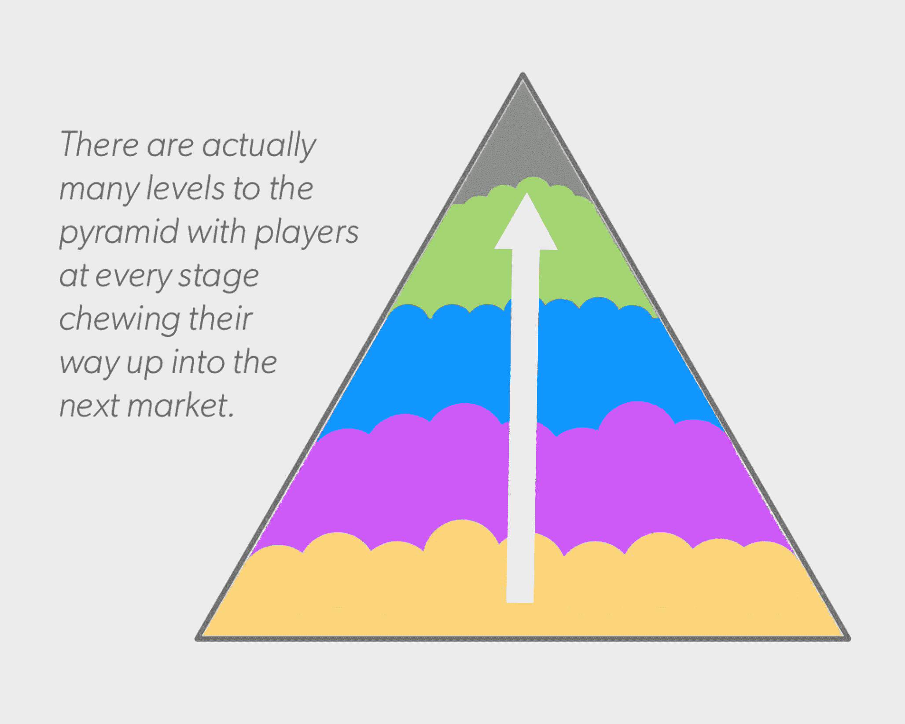

# 莱斯利定律:当小遇到大，小(几乎)总是赢|第一轮回顾

> 原文：<https://review.firstround.com/leslies-law-when-small-meets-large-small-almost-always-wins>

*本文由****[Mark les lie](http://www.gsb.stanford.edu/faculty-research/faculty/mark-leslie "null")****撰写，他是 VERITAS Software 的长期董事长兼首席执行官、顾问和投资人(也是关于创业* *[销售学习曲线](https://hbr.org/2006/07/the-sales-learning-curve "null")* *的基础性文章的作者)。*

几十年来，很难想象有人能与 IBM 在计算机行业的绝对优势相抗衡。它拥有 65%的市场份额，其余份额由当时被称为“群雄”的公司瓜分——巴勒斯(T18)、尤尼瓦克(T20)、NCR(T22)、控制数据(T24)和霍尼韦尔(T27)。他们每个人都有自己专有的硬件和软件栈，并且不与人接触。每个人都又胖又笨又快乐。

事实上，当 1959 年**数字设备**开发并交付 PDP-1——一种新型微型计算机，配有 4K 标准内存、18 位字和 200K 时钟速度时，他们高兴得连眼睛都没有眨一下。当时，与 IBM 大型机相比，这似乎微不足道。但是 30 年后，数字设备的年收入超过了 140 亿美元，并催生了一个新的行业，孕育了像惠普、通用数据、Prime 和瓦里安这样的公司。

与硬件的转变相一致，UNIX 操作系统——由& T 公司的**在 20 世纪 60 年代末和 70 年代初开发——进入了市场，蚕食了 IBM 的更多领域，并为基于微处理器的 UNIX 系统打开了大门，如 Sun Microsystems 的系统，它成为了 90 年代的主要计算平台**

到 20 世纪 90 年代末，这些公司打败了 IBM 国王，将其降级到不断萎缩但仍然盈利的大型机业务。20 世纪后半叶，几乎不可能找到任何一篇关于 it 行业的商业或行业文章不提到 IBM。现在你很难找到任何提及他们的文章——除了描述他们的血统。

莱斯利定律是关于技术的这种循环:小型、简单和廉价的解决方案取代大型、复杂和昂贵的解决方案。

最终，而且不可避免的是，这些“小”进入者在食物链上一路蚕食市场，获得越来越大的份额，直到该行业的巨头被迫退回到一个不断缩小的市场利基中。

从 1990 年到 2000 年，我担任 Veritas Software 的首席执行官，见证了 IBM 的灭亡和科技领域的许多其他重大变化。一次又一次，我看到较小的公司、想法和技术是如何蚕食它们上面那些看起来大到不能倒的自满的大玩家的。**这篇文章着眼于这对今天的创业团队意味着什么，以及他们应该如何利用他们的规模、速度和简单性赢得长期的胜利。**

# 莱斯利定律

当你开始通过这个镜头看世界时——当小的遇到大的，小的几乎总是赢——你会发现它无处不在，跨越所有的技术领域。事实上，这是如此普遍，以至于我认为这是一个行业法则，在这种情况下，**莱斯利法则**。接下来会有更多的例子，但首先，让我们仔细看看这是如何发生的。

当一个时髦的小公司进入市场时，它是通过创造一种低摩擦、高适配和完美的产品，以低价卖给大市场来实现的。这些新产品销售给由于进入成本(以美元和复杂性计)和拥有成本而无法接触更大产品的市场部分。更大的公司可能甚至没有注意到他们已经进入市场，因为没有一对一的客户对抗。

这使得小公司可以自由地向市场扩张。他们的前沿客户的需求正在扩大，他们自己对向上扩展市场的兴趣促使他们增加产品的特性和功能。从大型现有公司的角度来看，这种向上迁移是难以察觉的。他们不担心，所以他们不注意它。但它正在发生。

市场上现有“大”公司的典型反应是否认、创新者的困境和不屑一顾的傲慢。

不可避免的是，当威胁变得迫在眉睫时，已经太晚了。这家小公司已经扎根，用更简单、摩擦更小的产品开发低成本结构的优势。围绕其核心产品，一个新的生态系统已经出现。它将继续存在，并且无法阻止它侵入现任者的领地。

想想吧。大型机让位于被英特尔微处理器取代的微型计算机。大型机软件最初是基于每个公司内部定制开发的产品。这些被企业软件包产品所包含，然后被运行在基于 UNIX 的服务器上的“客户机-服务器”软件所包含，这些软件在 SaaS 和开源选项面前逐渐消失。20 世纪 80 年代的高性能工作站被个人电脑超越，现在正被平板电脑和智能手机超越。它看起来很像这样:

# 第一步:

# 第二步:

# 现实是:

随着我们进入一个非捆绑时代，这一过程在今天尤为重要。大公司产品中的一部分现在由一家独立的初创公司来完成，效率更高，质量更好。看看包装消费品，T2 P G T3 占主导地位。 **[哈利的](http://www.harrys.com "null")** 是只专注于高性价比的剃须刀而胜出， **[沃克&公司](http://walkerandcompany.com/ "null")** 是专注于使命驱动的化妆品。**[drop cam](https://www.dropcam.com/ "null")****[Ring](https://ring.com/ "null")****[Quirky](https://www.quirky.com/shop "null")**等等，都在撕扯着曾经被**霍尼韦尔**垄断的智能家居市场。众人趁着**[Shyp](http://www.shyp.com "null")****[Flexport](https://www.flexport.com/ "null")****[优步](http://www.uber.com "null")** 和**post mates**把 **FedEx 的**宇宙翻了个底朝天。

现在，我们看到小的、瘦的和吝啬的玩家的扩散，他们准备攻击在他们之上的大到中等规模的玩家。

应用莱斯利定律，在短短几年内，服务于我们大多数基本需求的公司的景观将会看起来非常不同。

# 历史是不断重复的记录

十多年来，sun 似乎不太可能迎来 SUN 和惠普基于 UNIX 系统的时代，或者是紧随其后的台式电脑帝国。但随着手机成为人们生活中“第一屏”的不可思议趋势继续下去，智能手机将很快赢得胜利，至少在其他东西出现之前是如此。

硬件是一个容易想象的例子，但是同样的趋势一次又一次地席卷了软件。数据库行业经历了几代人的转变——大部分是在甲骨文的关注下——但是现在更小的技术正在挑战它的相对霸权。

一个典型的例子是在 CRM 领域。从任何人记事起，这个市场就为西贝所拥有。它很大，提供了一个非常复杂的解决方案，必须为客户安装在他们的服务器上，批量许可，附带大量的培训和客户服务。听起来很笨拙，但这是标准，每个人都需要它。

后来出现了一家名为**Salesforce.com**的公司，它只提供 Siebel 已经提供的众多功能中的一种。只是他们提供的方式不同——客户公司可以使用**Salesforce.com**为每个员工付费，并在他们的网络浏览器中轻松使用，而不必购买数百个许可证。它们成了许多年轻公司的必然选择，这些公司除了从 SaaS 做起，什么都做不起。

即便如此，像 Siebel 这样的大型企业安慰自己说，企业客户永远不会将他们宝贵的数据和潜在客户名单委托给异地的基于云的系统。今天，Salesforce.com 完全主导了 CRM 市场，并拥有一个庞大的生态系统。就在他们面前吃过午餐的西贝，成了甲骨文的收购诱饵。

Salesforce.com 的崛起凸显了所有云解决方案的发展势头，这些解决方案由小型专业公司引领，为消费者和企业等提供简单易懂的好处。想一想 **[Dropbox](http://www.dropbox.com "null")** 和 **[Box](http://www.box.net "null")** 分别是什么。他们现在是人们听到“云”这个词时想到的，而不是过去的大型垂直集成存储解决方案。

另一个例子是 **[ZenPayroll](http://www.zenpayroll.com "null")** ，由我斯坦福大学商学院的一个学生创立。它专注于做一件简单的事情——发工资——并且尽可能简单容易地执行它。人们实际上喜欢使用这个工资系统。通过为客户消除这一任务的痛苦，他们提供了一个比之前任何解决方案都更优雅、更具情感吸引力的解决方案。

他们已经悄悄进入了 Intuit 的领地。为了适应这种情况，公司也必须向上扩张，向他们上面的人施压，就像**[P](http://www.paychex.com "null")****ay chex，**迫使他们进入金字塔的顶端，那是一个变得过时的更窄的位置。

如果你问 Paychex 的人对 ZenPayroll 有什么看法，他们可能会认为这是一个小型的夫妻店，或者可能会说他们从未听说过。这就是这家初创公司如此令人放下心来的原因。他们本身很小，这使他们成为小客户的完美选择——拥有 10 名员工的家族企业、面包店、书店——还有更多。赢得他们的忠诚将会给他们获得越来越多的市场份额所需要的稳固的立足点。

有人可能会说，莱斯利定律并不总是适用——有些东西你根本就不可能造得小。与之相反的是 **[火箭实验室](http://www.rocketlabusa.com/index.html "null")** 的例子，这是一家总部位于新西兰的小型火箭制造商，由小型、快速、灵活的发动机驱动，可以以前所未有的低价、前所未有的频率和可靠性运送小型卫星。

在这种情况下，**火箭实验室**只能运送 100 公斤的有效载荷。，一枚 **[SpaceX](http://www.spacex.com "null")** 火箭的一小部分容量。但他们认为，他们可以每周一次，每次 100 万美元，而不是相隔几个月才发布。这为 Rocket Lab 打开了一个全新的可能性领域，这将为他们提供所需的推动力，开始进入其他市场。

# 那么这对创业公司意味着什么呢？

这里的教训是什么？创业公司可以内化并付诸行动的实用外卖？

因为服务器空间很便宜，而且你有资金和人才去做，所以你的产品总有过度功能化和花里胡哨的诱惑。抵制这种冲动是你真正的竞争优势。

你的目标应该是为低端市场打造真正伟大的产品，用简单、低摩擦的产品解决现有公司服务不足的细分市场中的重要问题。一旦你在这个领域获得了出色的市场牵引力，你就可以一点一点地往上爬，直到你能与你所在行业的重量级企业竞争。

也就是说，你应该始终保持一只眼睛看着身后，这样你就可以看到下一个有朝一日想要吃掉你市场份额的年轻公司。

顺便提一句，[我最近写了一篇名为](http://firstround.com/review/The-Arc-of-Company-Life-and-How-to-Prolong-It/ "null") **[生命之弧](http://firstround.com/review/The-Arc-of-Company-Life-and-How-to-Prolong-It/ "null")** 的论文，对更大、更成熟的公司提出了指导性的建议，告诉他们如何才能不断转型，以避免失利和灭绝。开始思考下一步如何生存永远不会太早。

Mark Leslie *是斯坦福大学商学院的讲师，他在该学院教授创业、道德和销售组织方面的课程。他还是私人投资公司 Leslie Ventures 的董事总经理，并在两家上市公司、六家私营公司和三家非营利组织的董事会任职。此前，Leslie 是 Veritas Software 的创始董事长兼首席执行官。他在**[@ mles lie 45](https://twitter.com/mleslie45 "null")**发微博。*