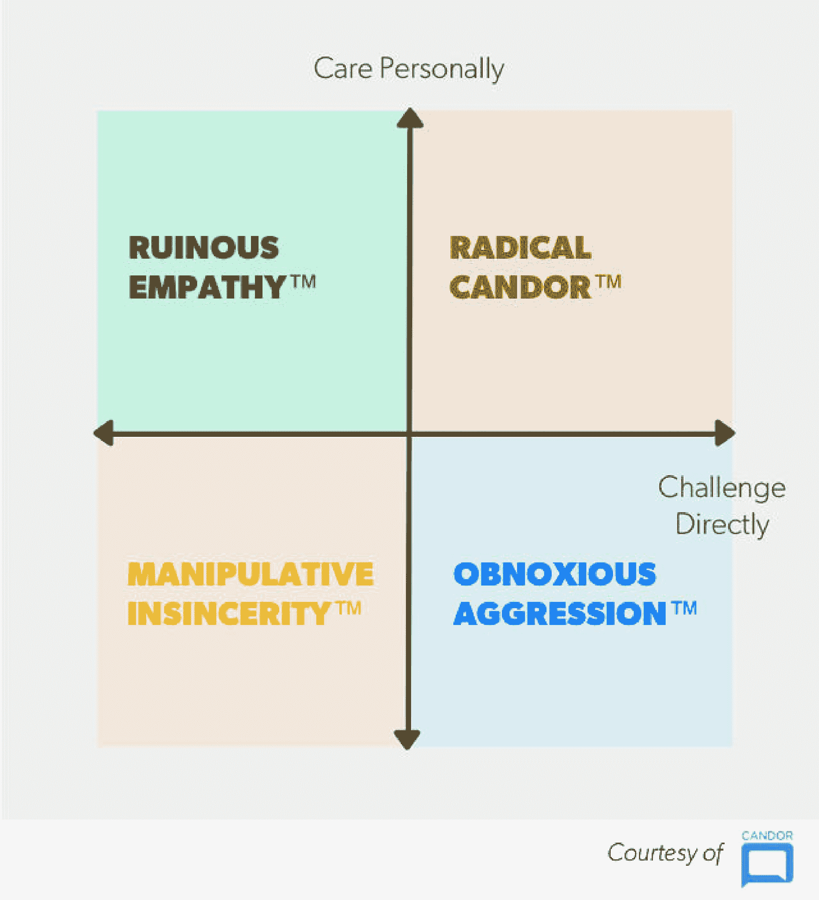

# 接受(并真正听到)彻底的坦诚|第一轮审核

> 原文：<https://review.firstround.com/on-receiving-and-truly-hearing-radical-candor>

金·斯科特 早上想呆在家里，和她年幼的双胞胎一起吃早餐。所以她做了一件合乎逻辑的事情——她给她的团队发了一封电子邮件，询问他们是否可以在一小时后开始他们的晨会。“我希望人们会称赞我是一个了不起的新妈妈，”她说。"相反，我受到了有史以来最痛苦的批评之一."

那时她正为谷歌领导 AdSense 在线销售和运营——一个庞大的全球团队。按下发送键后不久，她收到了来自都柏林团队的一名成员的回复，大意是:我们中的一些人也有孩子，现在我们吃饭要迟到了。斯科特没有意识到时间的变化，他不知道该如何回应。“不做出防御性反应是非常困难的。我能做的就是保持沉默，数到 6，然后道歉。”

获得有针对性的反馈对任何人来说都不容易。对于那些很少收到奖金的经理来说，一旦他们达到一定的级别，事情会变得更加困难。但是，不仅仅能够接受，而且能够真正听到和理解激进的坦率——斯科特现在对其进行了病毒式定义和[在她的新书](https://www.amazon.com/Radical-Candor-Kickass-Without-Humanity/dp/1250103509/ref=sr_1_1?ie=UTF8&qid=1473355777&sr=8-1&keywords=radical+candor "null")中进行了详细阐述——是你在职业生涯中可以学到的最重要的技能之一。

如今，斯科特与前谷歌同事拉斯·拉罗威(Russ Laraway)合作，共同创立了软件和内容公司 Candor Inc. ，帮助各种规模的公司将真实、建设性的反馈作为其文化的基石。斯科特和拉罗威经常就如何对同事坦诚相待发表文章和讲话。在这篇独家文章中，他们扭转了局面，专注于如何倾听。

回顾一下，斯科特在去年的首轮首席执行官峰会上谈到了彻底的坦诚:

# 你必须寻求批评

尤其是如果你是一名领导者，你不能指望其他人主动给你反馈。他们很忙。他们不想得罪。他们不想惹你生气。即使你是个人贡献者，你也可能会渴望得到指导。你的经理可能害怕打击士气，或者什么都不想，或者不把它放在首位。由你来获取你需要的信息。

作为经理，征求反馈是以身作则的好机会，会产生连锁反应。通过反复不断地征求批评，你看起来更容易接受，人们也更有可能说些什么。最重要的是，你让组织中的每个人都更乐于接受批评，并因此给予批评，因为这不会被认为是消极或有害的。

寻求批评可以以不同的方式表现出来——间接的或直接的。最好的办法是双管齐下。

***间接要求反馈***

斯科特说，可以营造一种氛围，把批评重新包装成你送给别人的礼物或为别人提供的服务。

寻求批评的最好方法之一就是分享你已经受到的批评。

例如，众所周知，米歇尔佩卢索和其他几位首席执行官会将自己的 360 度绩效评估通过电子邮件发送给整个公司。这实现了两件事:清楚地表明他们乐于接受并感谢反馈，没有理由隐藏甚至是最严重的错误。它让公司的每个人都有能力参与进来，并与领导层的工作方式息息相关。

在谷歌，斯科特曾经要求那些私下批评她的报告在公开会议上重申他们的想法。尤其是拉罗威在这方面做得非常好，给整个过程带来了某种戏剧性，真正引起了人们的注意。

“有一条我们都接受的规则，即你必须私下批评，但当你是老板时，你就是规则的例外，”她说。“你想让人们看到你的反应——你能接受并欣赏它。”

Kim Scott

她说，你要尽可能公开地接受自己的错误，以创造一种健康反馈的文化。有一次，她的团队成员给了她反馈，她反应很差，坚持自己的观点。当她意识到自己确实错了时，她从办公室里拿出一个大水晶雕像给了这位员工，并说:“这是我送给你的‘你是对的，我是错的’礼物。”每当有人问起这座雕像，他们总是会听到这个故事，斯科特对反馈的开放态度是其中的一部分。

“你必须非常努力、非常坚持不懈地工作，才能让批评在你的团队中自由地上下流动，”Laraway 说。“一旦你有一个愿意给你彻底坦白的皈依者，就像对待金子一样对待他们。创造一种网络效应，让你获得更多反馈。”

根据他的经验，你必须致力于让第一个人最终敞开心扉，在团队面前说出一些关于你(他们的经理)的令人惊讶的坦诚。你必须超越自我，让它被接受，甚至被拥护。因此，当这种情况发生时，你必须用令人难以置信的热情回应来奖励这种勇敢。

想想一个人向老板提出严厉的批评需要多少精力。如果你一次都没收到，那就完了。你可能在一段时间内不会再收到反馈。

最终，我们的目标是利用你在回应中产生的积极情绪，帮助团队中的每个人认识并自由承认自己的错误——毕竟，自我批评的社会化会让它变得更健康、更可行。做到这一点的最好方法之一是开始一个轻松而一致的仪式，人们经常因为这种强硬的诚实而得到奖励。

“在我们以前的 AdSense 全体会议上，我们会要求人们站起来谈论他们在上周犯下的一个错误——谁犯了最严重的错误，谁就会得到一个我们命名为呜呜猴子的毛绒动物，”Laraway 说。"呜呜组啦的获胜者可以在接下来的一周选择他们的继任者，以此类推."

这听起来像是一个游戏，但是这个小组一开始并不仅仅是怀疑。没有人愿意承认错误，更不用说就此大谈特谈了。“我们甚至告诉人们，如果你一起分享，你会立即得到原谅——并且你有动力帮助所有的队友避免同样的错误，”斯科特说。尽管如此，这就像拔牙一样——直到她把一张 20 美元的钞票放在呜呜的头上。“这就好像金钱给了人们可信的否认——他们可以说他们只是为了钱而分享，但事实并非如此。它只是打破了僵局。”

最终，呜呜仪式流行了起来。人们没有看到分享的负面后果，只有大量的支持和鼓励。很快，每当会议的这一部分出现时，就会有志愿者做好准备。因此，每个人都可以从彼此的陷阱中学习，这使得失败变得安全，从而培养了更多的创新，并且他们可以更加诚实和深入地对项目进行事后分析。最重要的是，它让人们更容易批评他们的同龄人——这可能是最难做到的事情——因为批评本身已经被诽谤了。

创造一种文化，让每个人都知道批评是为了帮助彼此把事业做到最好。

***直接要求反馈***

“在我过去的一个团队中，有一位女性总是得不到晋升。她知道这一点，但不知道为什么，”拉罗威说。"原因没有告诉她，但在她背后讨论过。"

这种行为会混淆文化，削弱团队间的信任。为了确保这种情况不会发生在你和你的同事身上，养成拉罗威所说的“去问问题”

你的提问旨在以一种更容易的方式了解正在发生的事情，因为它是非对抗性的、好奇的，并且将人们所说的重新构建为积极的。

拉罗威说:“[塔科马电力公司的比尔·贝里](https://www.linkedin.com/in/wtberry "null")是一位非常有思想的经理，他让人们告诉他他们真正在想什么。”。“他会对他们说，‘给我一些建议。’那他就等着。他会永远等下去。最终，他会听到各种令他惊讶的事情，让他和公司变得更好。"

通过把任何批评都变成建议，他让人们感到有帮助。这种沉默清楚地表明，他全神贯注于人们要说的话。“我从其他领导那里听到的另一种说法是，‘我能不能做些不同的事情，让我更容易与他们共事？’"

你要问的问题也可能是一个润滑轮子的假设。

“假设我有一种预感，我没有做好某件事，”拉罗威说。“当我在我的一份报告中陈述事实时，我给了他们一个机会。就像我可能会说的，“我想你不得不经常追着我看那些报告是令人沮丧的……”如果事实上令人沮丧，那个人现在有明确的表达方式。如果你的团队中有一些更胆小的人，这可能会很好。你在给他们提供一个稻草人，甚至是用来谈论它的语言。"

如果你很难得到反馈，从自我批评开始，给别人一个同意的机会。

作为一名领导者，你必须时刻保持警惕，以防出现鼓励批评你工作的机会。其中很大一部分是一遍又一遍地提醒自己这个反馈是多么有价值和必要。把过去收到反馈的例子变成一块试金石，让你保持这种想法。

对斯科特来说，是她的一个同事打电话给她，说她喜欢不考虑后果就发邮件。有一段时间，她会为了权宜之计匆匆写下简短的便条，却没有意识到这些便条给收件人带来了巨大的焦虑。直到有一天，她收到了一封回信:“你发送邮件的速度太快了，金。”

“这很伤人，但他完全正确，”她说。“我已经很多年没和他说过话了，但每周至少有一次，当我要按下发送键时，我会想起那句话，它让我摆脱了自我。这让我更加意识到我是多么真正需要这类评论。”

# 拥抱不适

借用英特尔首席执行官安迪·格罗夫的话，“拥抱不适”是任何希望同事彻底坦诚的人的至关重要的口头禅。

斯科特说:“有一种错误的假设，认为让人们感到舒服会让他们更容易批评你，但事实并非如此。”。“当你向与你一起工作或为你工作的人征求意见时，要承认你让他们处于一个极其不舒服的境地。”

努力让它变得更好对你们都没有好处。所以不要跳进去切断它们，或者以某种方式让它变得更容易。让他们明白你需要他们的想法来更好地完成你的工作，不要让尴尬成为障碍。

“当我在苹果大学教书时，我经常会问满屋子的人对我的看法，我会数到 6，然后开始说些别的。“我只是让这个问题悬在那里，”斯科特说。“你会惊讶那有多长。大多数人无法忍受沉默。总会有人说点什么的。”

早期，丰田汽车公司采取了更加严格的方法。他们在每条装配线的末端画了一个红色的大盒子，让新员工站在里面。他们不被允许离开包厢，直到他们对公司的运作说了一些批评的话。鉴于权威人士的标准待遇，这令人深感不安，因此必须采取极端措施。

哈里森金属公司(Harrison Metal)的创始人迈克尔·迪尔林(Michael Dearing)在易贝领导产品营销时采取了一种更温和的方式。他在办公室人流量大的地方放了一个橙色的盒子，告诉人们放下批评和问题，只要他们想到什么，就把评论放进去。然后，他会在不预习任何一个问题的情况下，把它们一股脑儿抽出来，然后即席作出真实的回答。他不得不接受自己的不适，并积极应对出现的任何情况。

很快，人们看到他接受坦率的简单方式，就会走上前来，亲自自愿说出他们的想法。行为得到的奖励越多，提供改进方法的人就越多。

Laraway 在他的团队的月度商业评论中观察到了类似的效果。他们第一次要求人们指出哪些地方做得不好，他们得到的只是旨在回避他人感受的肤浅评论。人们花了几个月的时间才开始探究到底发生了什么，为什么会这样。他们完全是通过坚持不懈才到达那里的。“我们只是不停地告诉人们，这次会议的任务是找到真正关键的问题所在，”他说。“作为一个团队，我们不得不反复在一起不舒服，并且不放弃。”

Russ Laraway

# 永远奖励坦诚

这又回到了 Laraway 的观点:你必须像对待金子一样对待第一个自由批评你的人。事实上，你必须永远款待每一个喜欢黄金的人——但是特别要奖励第一对夫妇。他们能够扭转局势，支持反馈。

不久前，在 Candor，他在一次会议上提出了一项产品变革，但没有遇到任何阻力。一个星期后，他们再次见面，改变没有发生。当他问为什么时，一名工程师最终承认，“我们认为这是一个可怕的想法。”是的，他等了一会儿才说，但他还是说了。

“我知道这个家伙喜欢咖啡，所以我给他买了一张星巴克礼品卡，并在上面写道，‘这是一个糟糕的主意，’”Laraway 说。“我接着发了一封电子邮件，感谢他说出了自己的真实想法。后来，他告诉我，他真的很感激有说出事情的余地，即使是冲动的事情。”

从不批评批评。说声谢谢就行了。

“你必须带着理解的意图去听，”斯科特说。“别插嘴。不要追问。”

阻碍管理者接受反馈的一个因素是他们给出反馈的方式。当人们提出批评时，经理们比任何人都觉得有责任给他们举例子。他们不想只是说，“嘿，你在会议上口齿不清，”他们被训练说，“你本可以在上周四说 x 的时候更清楚地表达自己。”

当有人向他们提供反馈，而他们下意识的反应是要求提供具体的例子时，这种培训就会碍事。“当有人告诉你做错了什么时，你很难不说‘那是什么时候的事？’或者“你为什么这么说？””斯科特说这让你听起来像是在为自己辩护，像是你不同意，像是你试图在他们的争论中找出漏洞。尤其是如果你的级别高于这个人，你基本上是在说，‘证据在哪里？’？"

事实是，当你处于困境时，很难举出确切的例子。人们通常很擅长指出他们对同事表现的感受，但却很难解释或记住是什么让他们得出这样的结论。如果你坚持这一点，你就不会对你的坦诚有所回报，而且你会剥夺自己未来的反馈。

相反，你可以说，“哦，我明白了。所以如果我把 X，Y，Z 做的不同，那会在 A，B，C 三个方面帮助你，我说的对吗？”你不仅证明了你听到并理解了他们，你还让他们同意你的观点，这开启了积极的对话。

斯科特避免这个陷阱的另一个方法是鼓励她的同事立即给她强硬、坦率的反馈——几乎是即时的。有一段时间，她甚至在手腕上戴了一个橡皮筋，当她打断同事时，任何同事都可以拉断橡皮筋。这帮助她改掉了这个习惯。

如果你把所有这些反馈都储存起来，用于一对一或绩效评估，你将陷入向人们询问他们无法给你的例子的境地。奇怪的是，你剥夺了他们可以用来改善的数据，直到日历上的任意日期。允许每个人提供即兴反馈，以显著增加交流的信息量。

# 想得到多少就给多少

接受有益的彻底坦诚只有在你也给予的情况下才会发生。作为一名领导者，你有责任通过自己提供有效的反馈来为此定下基调。通常这可以归结为思维方式的转变。

“真的问问你自己，为什么你在给出反馈时会手下留情。你的同理心真的有成效吗？还是你只是想不伤害别人的感情？”拉罗威说。“无论如何，你都无法控制别人的感受。你能做的就是告诉他们，你在努力帮助他们成长，并提醒他们，人类从批评中学到的要比表扬多得多。”

尽可能多地当面提出批评。不要吝啬这个。许多交流是非语言的。因此，如果你只是电话里一个无形的声音，告诉他们做错了 X 和 Y，你就错过了大部分的互动。如果他们受到伤害或困惑，你就没有办法真正理解他们是如何接受你所说的话的。你没有办法衡量你是否应该调高或调低你的评论。

你的反馈的清晰程度是在对方的耳朵边测量的，而不是你的嘴巴。

斯科特说:“人们太专注于他们如何说话，以至于他们没有时间去考虑别人到底在听他们说什么。”“当有人订婚时，他们会主动出击。当他们关闭时，他们交叉双臂，保持距离——我觉得我们非常适应个人生活中的这些基本信号，但却未能将它们运用到我们的工作中。如果你有所有这些关于你如何被倾听的数据，你可以变得敏捷，重新措辞，考虑分享其他东西。”总之，能帮就不要瞎飞。

最后，关于这一点，不要让赞美成为你破坏信誉的地方。斯科特和拉罗威都见过太多次这样的事情了。一个经理想要增加正面的激励，但是有太多的方式会出错。

“如果你是一个老板，你说了一件听起来有点不对劲的事情，或者表明你不知道到底发生了什么——你失去的比你一开始得到的要多，”Laraway 说。“就像我在博客上而不是在视频上称赞我的内容经理一样。或者在她周四发送的电子邮件宣传活动中，实际上是在周二。你侵蚀了对自己的信心。”

离一线工作越远，无论是表扬还是批评都要越注意细节。人们相信你熟悉他们的工作，你知道你在说什么，这就是一切。一个快速的解决方法是不仅仅表扬已经完成的工作，而是更进一步告诉这个人和团队这项工作将会产生什么样的影响。

# 依靠仪式

“今天很多人都在谈论建立‘学习文化’，人们可以公开谈论他们的错误和改进的方法，”Laraway 说。“没有实际的、日常的拦截和处理策略，什么都不会改变。你必须为你自己和你的团队建立触发器和仪式，将反馈带到表面上来。”

小的仪式分裂了虚无和复杂的系统和过程之间的区别。关键是要让这些仪式足够轻便，不会占用任何重要的时间，确保它们定期重复，并使它们具有噱头(或古怪，或难忘，随你喜欢)。哎呀，猴子就是一个最好的例子。你做的这些触发器越愚蠢或古怪，负面感觉的反馈就越抽象——也越难忘记。

“不要创造更多的过程。斯科特说:“创造一些与你每天已经做的事情天衣无缝的仪式。“让人们在每周一次的会议结束时传递毛绒玩具并没有占用我们的时间。但即使是现在，当我想起那只猴子时，我也记得征求反馈、对反馈做出良好反应、在场并意识到使用反馈的机会是多么重要。”

*照片由* *[Candor，Inc.](http://www.radicalcandor.com/ "null")* *提供，艺术由**[Vanessa brant ley Newton](http://oohlaladesignstudio.blogspot.com/ "null")**提供，感谢**[Rachel Awes](http://www.rachelawes.com/ "null")**。*