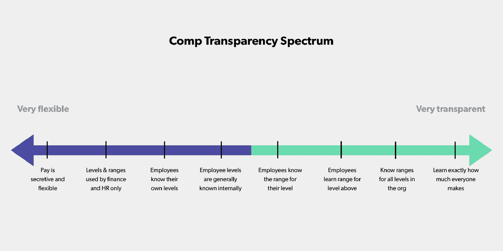

# 公开薪酬并不容易——以下是如何变得更加透明|第一轮评估

> 原文：<https://review.firstround.com/opening-up-about-comp-isnt-easy-heres-how-to-get-more-transparent>

无论是采取行动[提高员工满意度调查的分数](http://firstround.com/review/how-this-head-of-engineering-boosted-transparency-at-instagram/ "null")还是努力[建立更加坦诚的文化](http://firstround.com/review/the-case-for-startups-to-make-radical-transparency-the-top-priority/ "null")，大多数创始人都努力将透明度注入他们创业公司的 DNA。但是当薪酬透明度这个更具体的话题出现时，一些人开始不安地在座位上移动，也许是出于担心他们会被迫[在电子表格](http://firstround.com/review/how-chewse-operationalized-transparency-starting-with-salaries/ "null")中分享每个人的工资给所有人看。

但是对于**这些担忧都没有切中要害。“你可能不知道，但你实际上已经引入了一定程度的薪酬透明度。因为至少，如果你的工资单上有员工，他们至少知道自己赚了多少，”她说。“人们不明白的是，薪酬透明度是一个光谱——分享公司每个人的工资是了解员工薪酬的一种方式，但不是唯一的方式。”**

**作为两届创始人和经验丰富的工程领导者，她曾在脸书 Reddit、 [Linden Lab](https://www.lindenlab.com/ "null") 和 [EMI](https://en.wikipedia.org/wiki/EMI "null") 任职，布朗特一次又一次地看到围绕 comp 的这种误解。以她的经验来看，这种犹豫不决，不愿拉开薪酬帷幕，不愿更慎重地考虑薪酬哲学的做法，往往会在初创公司扩大规模的过程中引发问题。这就是为什么她的最新企业 **[Compaas](https://compa.as/ "null")** 专注于帮助公司量身定制他们的[薪酬策略](https://firstround.com/review/counterintuitive-comp-tips-for-the-unwary-and-uninitiated/ "null")，包括符合他们特定阶段和独特文化的薪酬透明度水平。**

**在这次独家采访中，布朗特解决了创业公司需要思考的棘手问题，以便将薪酬透明度校准到正确的设置。她提出了开放的理由，并给出了可供选择的透明度选项菜单，分享了创始人在与团队讨论这一主题时可以用来避免踩到地雷的脚本和策略。**

# **澄清事实:常见的公司透明度误解**

**为了消除恐惧和不确定性，布朗特通过揭穿围绕薪酬透明度的误解，开始了与创始人的对话。在这里，她对这个短语本身进行了水平设置，围绕实现它的道路提供了更多的细节，并深入探讨了为什么初创公司应该考虑引入它。**

****更微妙的定义和实现它的漫长旅程****

**“当你开始谈论薪酬透明度时，每个人首先想到的是‘我要知道每个人赚了多少钱。’布朗特说:“我认为更好的表述方式是‘我要理解*为什么*我得到了我现在的报酬，以及*我如何*提高我的报酬这是为了确保员工了解他们当前的现实，并看到摆在他们面前的职业发展道路。"**

**薪酬透明并不是在电子表格中分享每个人的工资。这是为了给人们一个清晰的视线，让他们明白为什么要制造他们所制造的东西。**

**“拥有与否也不是一个简单的决定。你不能只说‘我们将变得透明’。这不是一个可以开关的电灯开关。她说:“这是一个持续多年的旅程，它涉及一系列考虑因素，这些因素会随着公司所处的生命阶段而变化。还有很多其他问题:公司薪酬的基础是什么？它是如何进化的？作为一名员工，你需要做些什么来发展和增加你的工资？加薪是如何决定的？奖金和股权等薪酬的其他部分呢？本质上，你需要做一些跑腿的工作，弄清楚如何*支付多少*来获得透明度，然后确定一条到达那里的路径，同时确保这对你的团队来说不是一次糟糕的经历。"**

****引入薪酬透明的正确和错误理由****

**布朗特表示，创始人在思考为什么引入薪酬透明可能是个好主意时，也经常被误导。**

**“你必须深入挖掘，找出你为什么要这么做。实施新的薪酬实践是一项不小的壮举，你需要从清楚地了解为什么这对你的公司很重要开始。布朗特说:“这不仅仅是在其他地方成功或失败的事情，而是这些成功和失败如何应用到你的创业中。”“经常有人进来说，‘我读到另一家公司告诉员工每个人赚多少钱，我认为我们也应该这样做。’但这并不是一个足够好的理由。薪酬透明度需要服务于公司内部的另一个目标，而不是作为一个独立的计划。"**

**薪酬透明本身并不是目的——当然也不是因为其他公司在这么做就应该承担的事情。**

**对布朗特来说，引入公司透明度的举措通常源于建立对公司信任的愿望。“因为薪酬是非常基础的，所以它是初创公司帮助建立信任和与公司联系的最佳方式之一。但是你需要弄清楚你想和谁培养信任——你的目标是什么？”**

**根据她的经验，建立信任的策略通常都是基于相同的几个目标:**

****助推招兵**。创业公司可以依靠薪酬透明度作为杠杆，通过提高薪酬吸引力，在竞争激烈的人才市场中脱颖而出。布朗特说:“候选人[经常指出](https://worldatwork.org/workspan/articles/lack-of-pay-transparency-tops-applicants-list-of-frustrations "null")公司缺乏透明度，这是他们不愿接受聘用的标志之一。”。“薪资仍被视为一个如此模糊的黑箱，因此，非常清楚一份工作为什么是这样的，总是有竞争优势的。”**

****提高保持力**。当然，现有员工也有既得利益者了解自己的薪酬等级。布朗特说:“清楚、一致地告诉他们，他们的薪酬基础是什么，他们的职业阶梯是什么，这是培养坦诚和相互承诺文化的一个关键途径。”**

****打造品牌**。越来越多的初创公司也在寻求培养在流程或文化上异常创新的声誉，以此作为区别于更大竞争对手的优势。布朗特说:“拥有一个更积极的透明度模型可能符合你的品牌。”“我们看到，像[这样的公司可以缓冲](https://buffer.com/ "null")。他们生来如此——薪酬透明是他们精神的自然延伸。”**

****保持合规性**。“这是一个我们不太喜欢谈论的话题。布朗特说:“这有点吓人，一点也不性感。“但根据你所在的地区，必须有一个最低水平的薪酬透明度。例如，2018 年，加州开始[要求雇主根据要求分享空缺职位的薪酬等级](https://compa.as/blog/ca-ab-168-and-why-it-matters-to-your-company/ "null")。她说:“销售组织还可能需要特殊处理，以明确可变薪酬是如何实现的。**

**在陈述了考虑引入更高薪酬透明度的理由后，布朗特向创始人们介绍了识别适合他们创业的人的过程。“我总是把它与你的文化最有共鸣的东西联系起来，”她说。**因为补偿是文化，期。**这是你支付员工薪酬的方式，也是橡胶落地的地方。这是你不能欺骗的标准。”**

**虽然这看起来似乎对一个简单的数字很重要，但布朗特认为 comp 可以承受这种重量。“认为你只是给人们钱，而他们不会感受到与钱相关的一切，这种想法很天真。薪酬是极其个人化和情绪化的。它直接影响我们的生活方式和养家糊口的方式。不管我们愿不愿意承认，对员工来说，薪酬似乎反映了公司对他们的重视程度。”**

# **概要:公司透明度连续体的所有缺口**

**一旦一家初创公司决定拿出更多的薪酬卡，话题很快就会转向到底应该披露什么，以及多少才算太多。从黑盒到缓冲区，在比较透明光谱上有许多点。**

**“在一端，你可以超级透明和开放。另一方面，你非常灵活，以至于你可能非常武断和随意。布朗特说:“每种方法都有利弊。“非常开放可以让你对每一个变化更加自律和深思熟虑，因为每个人都在看着你。但是有些人想要试验的自由。他们希望能够灵活地追求自己真正喜欢的候选人，或者以一种特殊的方式奖励公司里的一个关键人物。”**

**根据布朗特的经验，大多数创始人都希望在这个区间的中间找到一个位置。为了帮助初创公司找到最佳切入点，她从最不透明到最透明，逐一考察了要考虑的薪酬透明度:**

****

****保持秘密和灵活(而且经常是武断的)****

**“这是大多数小公司的起点。薪酬决定是即兴的，薪酬完全笼罩在神秘之中。布朗特说:“这当然给了创始人很大的回旋余地，让他们可以聘用关键员工。“但它也能创造一种恐惧和缺乏信任的文化。你对创始人几乎有一种个人崇拜，候选人和员工被迫相信这个人会对他们好。所以我会仔细考虑你是否真的需要它，以及何时放弃它——从长远来看，这是不可持续的。”**

****幕后搭起脚手架****

**薪酬透明度的第一次上升是在早期的临时提议让位于更正式的提议时:薪酬水平得到认可，并与基于市场数据的薪资范围相关联。虽然这似乎是一个需要清除的主要障碍，但布朗特很快指出，几乎在公司发展超过创始团队后，就开始引入层级——不管创始人是否意识到这一点。**

**“我不想打断你，但如果你现在给两个人不同的报酬，你就已经有级别了。因此，这个阶段就是要拥有它，并在它背后多一点严谨，”她说。“在这个阶段，除了创始人、人力资源和财务部门之外，这些级别可能对团队的其他成员完全隐藏。布朗特说:“通常不告诉你的团队细节，而是让他们知道你试图用 comp 做什么，解释说你使用数据，通常试图以一定比例的市场价格为目标。”**

****揭开个别关卡的面纱****

**下一个飞跃是，员工了解自己目前的水平，而不是随之而来的薪资范围。虽然经理们知道每个人的水平，但其他人只能猜测或八卦每个人在阶梯上的位置。布朗特说:“大多数公司都发展到了这一阶段，但之后就会大幅下滑。”。“我主张采取下一步措施，将级别与范围联系起来，或者在整个组织范围内共享级别，但这不是每个人都能接受的。”**

****分享所有级别，在职业阶梯上形成阶梯****

**在薪酬透明之旅的下一站，员工会了解到其他人的水平。布朗特说:“这是一个很大的进步，因为即使你没有分享级别的现金数字，你仍然分享了人们所反对的相对资历类别。”“此时，你也应该有一个标题，清楚地解释期望以及如何从一个级别升到另一个级别——否则，这只是一个任意的数字，员工会疑惑‘为什么我是三级？’"**

****透露个人薪资范围****

**更进一步，不仅要告诉员工他们的收入和水平，还要告诉他们相应的工资范围。**

**“这是一件大事，因为它明确了资历和在工资级别中的位置。布朗特说:“即使我只知道自己处于前三分之一、中间三分之一或后三分之一，这也是职业道路上一个强有力的数据点。“例如，如果我处于最佳状态，我想赚更多的钱，我应该努力思考如何与我的经理合作以获得晋升。如果我在乐队中垫底，我面前会有一些空间来深化角色，或者开始考虑像绩效奖金这样的事情。这为我和我的经理建立了不同的、更有效的对话。”**

**但这一薪酬透明阶段远非常态。“在悬崖边缘，你会看到这样做的公司数量大幅下降，但我的预测是，由于加州法律的变化，这种方法将成为新的常态，”她说。“最终，出于合规原因和人们的谈论，一些人无论如何都会找到产品系列，所以控制叙述和公开产品系列是一种力量。”**

****描绘整个画面——并暗示接下来会发生什么****

**为了更深入地了解薪酬透明度，初创公司可以考虑汇总**总薪酬报表。布朗特说:“这些信息包括现金奖金、你股票的目标价值、公司为你的健康保险和健身会员支付多少钱，等等。”。“它们非常罕见，因为需要大量劳动力来生产，但这是一种非常透明的方式。”****

**对于那些希望更进一步的人，布朗特指出，一些公司通过告诉员工比他们高一级的工资范围，让他们更深入地了解自己的成长道路。“这非常具有实验性——可能只有不到 5%的科技公司在这么做，但我喜欢这一趋势的发展方向。她说:“你看到了摆在你面前的机会，这让你更有抱负。”。**

****分享(几乎)一切****

**在薪酬透明的深水区，每个人的薪酬水平以及每个薪酬水平的范围都是与所有员工共享的。“这很不寻常，根本不是主流做法，”布朗特说。“如果知道他们的头衔和工资范围之间的关系是一种优势，那么知道每个人的级别和范围就是一种优势。非常难得。”**

****把一切都摆到桌面上****

**薪酬透明度连续体的终点是了解组织中每个人的确切收入。布朗特说:“[Buffer](https://buffer.com/ "null")当然是这方面的经典例子，他们甚至更进一步，把每个人的工资电子表格放到他们的博客 T11 上，这当然很有趣，当你认为网上随便一个人都会知道你的工资时。”。“这似乎是私营科技公司的前沿，但它基本上永远存在于非营利组织和政府的一些部门，因为这一切都必须公开。”**

# **找到适合你的:设定薪酬透明目标的工具包**

**就像一系列细微不同的油漆样本一样，薪酬透明度的各种差异让一家初创公司难以做出正确的选择。这就是为什么布朗特的工作专注于引导创业公司在光谱上找到理想的位置。**

**“无论是只有你和一位联合创始人，还是你已经有了一个 30 人的团队，建议都是一样的:超越你现在所处的位置需要成熟、过程和努力，”她说。“这不是起点的问题，而是你要去哪里的问题。”**

**薪酬透明永远是一个令人向往的旅程。无论你在哪里，你都要开始，但随着时间的推移，你总是可以变得更加透明。**

**对于试图决定倾向于哪一端的早期团队，布朗特建议考虑以下因素:**

****记住使命只能到此为止。作为一个初创公司的创始人，你的早期雇员将只为这个使命而加入。但这不会永远有效。布朗特说:“随着团队的壮大，候选人将更加关注头衔和薪酬。“想想你未来的目标雇员，以及你需要多大的灵活性才能得到他们。例如，要让你的公司运转起来，你需要的人的级别有多高？不仅仅是这个月，在接下来的几个阶段也会如此。”****

**考虑功能多样性。考虑你正在组建的团队是功能异质的还是同质的。“如果你需要一个强大的内部和外部销售组织、一个工程团队和一个产品团队，要认识到这些是真正不同的组织。团队可能不会均匀填充，并且存在不同的激励机制；用你所拥有的资源很难做复杂而一致的比较。布朗特说:“也许现在还不是 T2 变得超级透明的时候。“另一方面，如果您正在构建更多的自助服务产品，并且您的团队将主要与少数客户服务代表一起进行工程设计，那么您可以更加公式化，并在早期增加透明度。”**

****为新兴角色创造灵活性。**对于处理前沿或多学科角色的初创公司，可能很难依赖市场数据。布朗特说:“我以前从我的人力资源合作伙伴那里得到过市场数据，这些数据并不能反映我所处的现实——我知道我不能以那个所谓的市场价格雇佣人。”。“这种情况在开发运营部门经常发生。比较新颖或小众角色的工资信息可能很难确定。因此，如果你正在构建一项变革性的技术，给自己多一点回旋的空间是有利的。”**

**明智地使用代币。除了招聘需求，布朗特建议创始人在开始创业时考虑将精力放在哪里。“公司只有这么多的‘创新令牌’——你可能不想把你的钱花在一个激进的新方法上，”她说。“也许你是第二次创业，想要挑战经营企业的机制，所以你尝试了一种非常透明的薪酬方式。但如果你在其他地方创新，比如你的销售模式或你如何打造你的产品，那么你可能不想在人力资源方面做太多实验。”**

**对于那些还没有准备好以这种或那种方式做出承诺的团队，布朗特提供了一些基本的实践来建立一个坚实的基础，可以作为以后增加透明度的跳板:**

****从数据开始。布朗特说:“最低门槛或基线——我认为每家初创公司都应该‘诞生’——是这样的:利用市场数据建立你的薪酬哲学。”。“每个好的实验都需要数据，你的早期薪酬实践也应该如此。我喜欢康纳利咨询公司和 Hiringplan 公司的合作关系[，但是还有很多其他的资源，比如](https://hiringplan.io/ "null") [AdvancedHR](https://www.advanced-hr.com/ "null") 、 [Payscale](https://www.payscale.com/ "null") 和[拉德福德](https://radford.aon.com/ "null")。从每一次招聘经历中学习也很重要——你必须做些什么才能接近某人？”****

**在你的日记中勾画出水平和范围。布朗特从一开始就热衷于捕捉级别和范围，即使它们只是为了创始人的眼睛。“阐明开始时的水平和目标。你不必与任何人分享它们，但这对你的战略有很大的帮助，”她说。“这也是与未来的自己交流并保持诚实的一种方式。它就像一个日记条目或面包屑的痕迹，捕捉你当时的想法。例如，如果你雇佣了一个自认为资历很高的人，但你快进了六个月，他仍然没有表现出来，那么你写下这一点的事实意味着‘未来的你’必须诚实面对这一点。”**

****设置薪酬审核检查点。**对于那些不愿意深究薪资范围或具体水平的早期团队来说，还有另一种策略可以展示对薪酬透明度的承诺。布朗特说:“每年对每个人进行一次薪酬审查，并查看市场数据的一致性，让员工有更可预测的依据。“这也激发了一些与薪酬相关的情绪，因为你知道你可以期待那场讨论，而不是不知道发生了什么。”**

****

# **改变它:薪酬透明行动指南**

**在确定了薪酬透明的目标后，下一步就是走出去，改变薪酬惯例。但对布朗特来说，这个话题的敏感性要求创始人小心行事，有目的地迈出每一步。**

**“在你能够证明之前，不要高调宣布你将对薪酬透明。布朗特说:“先衡量一下你在哪里。”“收集内部数据和市场目标是一项艰苦的工作；这最多会从电子表格的争论开始。大多数公司不会意识到他们的人力资源数据有多乱，直到他们真正进去尝试这样做。所以我的建议是悄悄地开始这个项目，然后埋头苦干——把房子收拾好比你想象的要花更多的时间。”**

**如果创业公司想要采取行动变得更加透明，他们需要做的第一件事就是振作起来。**

**在更好地了解目前的情况后，开始策划攻击计划，使用布朗特的指导方针作为垫脚石:**

**涨潮能托起所有的船——涨上来的东西不会落下来。**

**收集数据几乎肯定会发现员工薪酬方面的漏洞；下一步是修复任何损坏的东西。**

**“如果您发现合规性问题，首先解决这些问题。布朗特说:“如果你发现一批员工低于你的新市场目标，制定一个计划，以公平的方式将他们纳入你的预期范围，并代表他们的经验、资历和工作。”“看看股票分布情况，以及同一时间雇佣的不同人群之间是否存在较大差距。是否有个别异常者挣得少得多，但仍然表现出色？"**

**然而，一个不那么直截了当的领域是处理薪酬过高的人。布朗特说:“如果你发现你给某人的工资过高，不要试图反方向调整工资——那永远不会奏效。”“这从来都不容易，相反，进行一次坦诚的对话，这样你们都知道事情的现状。你可以说，“你实际上超出了我们的市场目标，所以如果你想要更多，我们来谈谈升职，以及我们如何合作，这样你就可以进入一个收入更高的新角色。”"**

**慢慢来，把数字留到以后。**

**即使通过数据分析发现许多人都在范围之内，创业公司可能没有办法或愿望一次让每个人都达到目标。“这可能是一个太多的创纪录的瞬间，”布朗特说。“只是制定一个如何到达那里的计划。你至少有一个周期来做这件事，或者你可以宣布你正在进行一场只会影响一些人的市场调整，从而脱离周期。”**

**布朗特指出，更广泛地说，刚刚涉足公司透明度的公司可能需要分阶段处理整个过程。**

**“特别是等级，唤起了地位和声望的想法——这就是为什么**我喜欢在每个人都知道自己的等级之前停留一段时间，然后转向对每个人透明的等级系统**。例如，如果你的团队甚至从来不知道他们的水平，直接谈论工资范围就太多太快了。她说:“把关于级别的对话从谈论硬性数字中分离出来。“公司透明度的每一次变化都是对系统的小小冲击，因此，当你向透明度的新高度推进时，永远记住，你的组织归根结底是一群人。”**

**第一次分享等级意味着与那些不知道自己之前立场的人交谈。这是一堆愤怒的人的食谱，100%的时间。**

# **传达变化及其背后的意义**

**当初创公司准备好谈论他们提升薪酬透明度的努力时，清晰而周到的沟通至关重要。**

**“我曾经在一家小型科技公司工作，在那里，你加薪的方式是由领导层决定，钱会有一天出现在你的银行账户上。布朗特说:“从来没有任何迹象表明它会到来。“如果公司经营良好，与其宣布奖金，每个人的工资都会被双倍存入银行。他们认为这是保持新鲜的非常有趣的方法。但是整个团队都在想，‘这是银行的失误吗？’？“我该不该花这笔钱，”这非常令人困惑，一点也不好玩。"**

**关于引入评估周期、调整或公布工资级别的公告是大公司的重要时刻，也应该如此对待。下面是布朗特在竞争沟通中实现这些变化的两个策略:**

**提前让经理们做好准备，并使用这份全员脚本。**

**“你的团队需要从你这里听到这个消息，而不是通过电子邮件。布朗特说:“你最好不要和其他人一样，同时把这件事告诉经理——那是愚蠢的举动。”。“许多经理对谈论薪酬感到不安。他们需要一些背景知识和培训，以便做好准备，在事后与他们的直接下属进行艰难的一对一对话。”**

**为了帮助创始人在与他们的团队讨论薪酬时做好准备，布朗特分享了一个可以定制的全员演示文稿样本:**

***我们一直在思考公司如何发展，以及如何更好地为员工提供支持。我们将继续为你提供福利，比如这间可爱的办公室和免费午餐，但对人们来说真正重要的事情——也是我们能做的最重要的事情之一——不仅仅是澄清你的薪水中有什么，而是澄清我们是如何得出这个数字的。我们如何决定新员工的收入？我们评估薪酬的常规周期是什么，对你来说是什么样的？***

***我们现在的情况是:作为一家公司，我们与外部供应商合作，并与我们的招聘人员交谈，以了解市场状况。一般来说，我们现在的目标是 70%的市场目标。这意味着我们为可比公司支付更高的价格——我们希望有竞争力，创造有竞争力的产品——但我们支付的价格并不是最高的。我们[做/不做]关于报价的谈判。***

**对你来说，这意味着几件不同的事情。首先，在我们的下一次薪酬评估期间，我们将于 3 月份开始(在绩效评估完成后)，因为我们(做/不做)将绩效作为加薪的一部分。每个人的薪水都会有变化。[其中一些将反映你的绩效加薪。如果你升职了，第一，你很棒，第二，会有相应的加薪。还会有一个市场调整，我们将确保每个人至少在我们的目标范围内，因为我们想确保你会长期留在这里。**

***我们想确保每个人都在一起，我们想对你公平。下面是你可以期待的进展:明年，我们将再次回顾这一点。我们将在 9 月份对总体市场趋势做一个回顾，如果我们看到有人真的不在状态，我们可能会在那时做出调整。这并不适合所有人。只是在市场变化很大的地方。[然后我们将在明年 3 月再次进行绩效驱动的加薪。]***

****保持一致，让你的团队保持更新。****

**公开讨论薪酬并不是一劳永逸的内部沟通，尤其是如果一家初创公司正在薪酬透明度连续体中缓慢前行，并希望公布薪酬水平或范围。**

**例如，一年后，领导者可以按照布朗特的另一个样本脚本，举行一次后续全体会议，向团队更新进度和后续步骤:**

***为了让我们的薪酬更加清晰，我们做了一些调整，让每个人都在我们的目标范围内。***

***我们认为，对你来说非常重要的是，不仅要了解你所处的市场范围，因为我们已经和你谈过了，还要了解这个范围实际上是什么。我们希望你至少知道你的范围是什么，最终的目标是让你知道你面前的职业道路的范围是什么。***

***作为帮助我们沟通的工具，我们将为你们每个人建立总薪酬报告。在[插入日期]，我们将发信告诉您在下一个工资周期您将挣多少钱。这些信件将包括关于你的福利和你的股票奖励的信息，除此之外还有关于你的范围和你在该范围内的位置的新信息。***

**这一点很重要，因为我们希望你明白，如果你接近自己的薪资范围上限，你会考虑加薪。这让你有足够的时间与你的经理讨论升职事宜。**

# **将这一切结合在一起**

**尽管谈论薪酬从来都不会让人感到舒服，但创业公司不应该在揭示这些数字是如何出现在薪水支票上的时候保持沉默。记住，这是给团队成员一个视线，让他们知道为什么他们要做他们所做的，而不是把每个人的工资贴在电子公告板上。虽然它可以成为一种在招聘中占据优势的工具，并将现有员工束缚在组织中，但薪酬透明本身并不是目的，也不是要追求的东西，因为它似乎很时髦——请注意调整薪酬透明设置，使其符合你现有的文化。做一些前瞻性的规划，为你实现更高的薪酬透明度的旅程指明方向，因为这不可能一蹴而就。深入研究数据，让掉队者达到你的目标范围，并慢慢剥离其他层，以揭示更多关于薪酬实践的信息，无论是通过分享水平、范围还是总薪酬报告。最后，在面对面、全公司范围的论坛上公开、一致地交流，始终为经理们提供应对艰难薪酬对话的工具。**

**布朗特说:“归根结底，不管你的薪酬政策具体是什么——不管你是选择可靠的还是开拓创新的——你能做的最重要的事情是抓住机会，让每个员工都清楚和放心地了解自己在组织中的位置。”“当公司透明度的努力执行得很好时，它会给员工一种感觉，‘这就是我所在的地方，这就是我如何达到现在的位置，这就是我下一步可以去的地方。’这是你在公司内部通过任何形式的透明度所能做的最好的事情。"**

***图片由 Avosb / Getty Images 提供。摄影由* *[邦妮雷伊米尔斯](http://www.bonnieraemillsphoto.com/ "null")* *。***