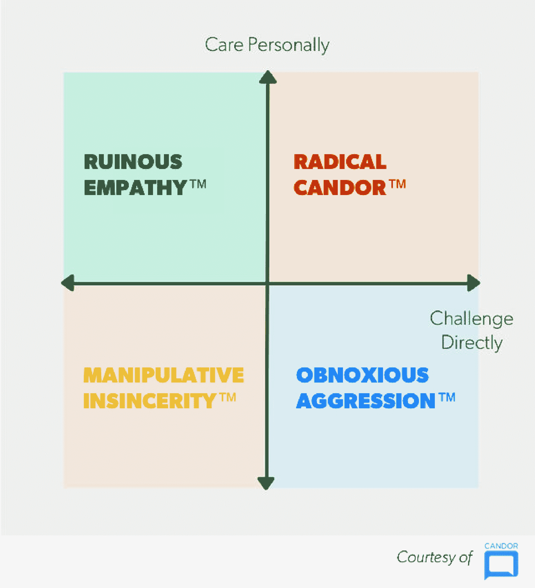

# 彻底的坦诚——成为一个好老板的惊人秘密|第一轮回顾

> 原文：<https://review.firstround.com/radical-candor-the-surprising-secret-to-being-a-good-boss>

**[Candor，Inc.](http://www.radicalcandor.com/ "null") 的联合创始人金·斯科特(Kim Scott)围绕着一个简单的目标建立了她的职业生涯:创造一个没有废话的区域，在那里人们热爱他们的工作并一起工作。她第一次尝试是在自己的软件初创公司。然后，作为谷歌的长期董事，她研究了公司领导人如何创造一种环境，让人们在工作中感受到几乎可以触摸到的快乐。作为苹果大学的一名教员，斯科特了解了苹果公司是如何走上一条不同的道路，但同样致力于创造条件，让人们能够做他们职业生涯中最好的工作，并热爱这样做。一路走来，她管理了许多处于兴奋和恐慌状态的团队。虽然她做了很多正确的事，但她会第一个承认自己做错的事。**

**好消息是，斯科特现在是 Twitter、Shyp、Rolltape 和 Qualtrics 等公司广受好评的顾问，她花了数年时间将自己的经验提炼为一些简单的想法，你可以用这些想法来帮助你的员工热爱他们的工作并做好工作。“在谷歌，我真的很好奇——创造这样一个伟大的工作环境需要拥有世界上最伟大的商业模式吗？答案是否定的。幸运的是，有些事情我们任何人都可以做，甚至在利润开始滚滚而来之前。”**

**斯科特知道，老板能做的最重要的一件事就是专注于指导:给予、接受和鼓励。指导，基本上只是表扬和批评，通常被称为“反馈”，但反馈是刺耳的，让我们想用手捂住耳朵。我们大多数人都渴望得到指导。**

**在 First Round 最近的 CEO 峰会上，Scott 分享了一个确保你的团队获得正确指导的简单工具——**[一个她称之为“激进坦诚](http://www.radicalcandor.com/ "null")** 的工具**

# **什么是彻底的坦白？**

**为了说明行动中的极端坦率，斯科特分享了一个她的老板批评她的故事。“我刚刚加入谷歌，向创始人和首席执行官介绍了 AdSense 业务的进展。我走进去，感到有点紧张，但幸运的是，生意兴隆。当我们告诉拉里、谢尔盖和埃里克我们在过去几个月增加了多少出版商时，埃里克差点从椅子上摔下来，问他们能给我们什么资源来帮助我们继续这一惊人的成功。因此...我觉得会议进行得还不错。”**

**但是会后，斯科特的老板雪莉·桑德伯格建议他们一起散步。她谈到了她喜欢演示文稿的地方，以及团队取得的成功给她留下了多么深刻的印象——但斯科特可以感觉到“但是”即将到来。“最后她说，‘但是你说了很多‘嗯’啊。我想，‘哦，没什么大不了的。我知道，我会的。但当我抓住老虎尾巴的时候，谁会在乎我说*嗯*"**

**桑德伯格上前询问斯科特的*嗯*是否是紧张的结果。她甚至建议谷歌可以聘请一名口语教练来帮忙。不过，斯科特没有理会这种担忧；这似乎不是一个重要的问题。“最后，谢丽尔说，‘你知道，金，我可以告诉你，我并没有真正让你明白。我必须在这里说得更清楚些。当你每三个字就说一次 *um* 的时候，你听起来很蠢。"**

**"现在，*那个*引起了我的注意！"斯科特说。**

**对于我们所有在宣扬“如果你不能说些好话……”的文化中长大的人来说，这种批评听起来可能不那么好听。但是斯科特现在知道这是桑德伯格能为她做的最仁慈的事了。“如果她没有那样说，我会一直拒绝她。我就不会解决这个问题。多么愚蠢的事情让你绊倒。”(顺便说一句，她确实和那个口语教练一起工作过，并且轻松地改掉了她的习惯。)从那以后的几年里，斯科特一直致力于将桑德伯格成为如此伟大的老板的原因付诸实践。**

**老板需要在员工犯错时告诉他们，这听起来很简单。但这很少发生。**

**为了帮助她自己的团队教授极端坦率——这是非常重要但往往被忽视的技能，斯科特将其归结为一个简单的框架:描绘一个分成四个象限的基本图表。如果纵轴是**关心个人**，横轴是**直接挑战**，您希望您的反馈落在右上象限。这就是彻底的坦诚所在。**

****

**“垂直轴就是我所说的‘关心’轴，”斯科特说。“谢丽尔能够如此直言不讳地对我说‘你听起来很蠢’的部分原因是，我知道她个人很在乎我。她做了一千件事情向我展示了这一点。”从邀请最近在纽约移植的斯科特加入她的图书小组，到鼓励她抽出时间照顾生病的亲戚，桑德伯格不仅在专业上投资于她，而且表明她真正关心她。她为她团队中的每个人做了这些。“作为一个好老板，关心个人会让你更容易做下一件事，那就是愿意激怒别人。”**

**没错，横轴就是斯科特所说的“愿意把人惹毛”轴。挑战别人对很多人来说很难；说任何不积极的话都让人觉得不礼貌。但是一旦你成为老板，你的工作就是同样清楚什么是错的，什么是对的。**

**我想说的是，当你的员工搞砸了的时候，批评他们不仅仅是你的工作，实际上也是你的道德义务。**

**”[约翰·斯图亚特·穆勒](https://en.wikipedia.org/wiki/John_Stuart_Mill "null")解释得很好。他说，“人的一切可敬之处，无论是作为一个知识分子还是作为一个有道德的人，都源于他的错误是可以纠正的。”人类判断的全部力量和价值取决于一个特性，即当它错了的时候可以被纠正。斯科特说:“当你认为人们错了或者他们的工作不够好时，你必须告诉他们。**

**因此，彻底的坦诚来自于个人关怀和直接挑战的结合。但是实际上是什么样的呢？斯科特创造了一个首字母缩略词来帮助人们记忆:**

**“彻底的坦诚是谦逊的、有益的、直接的，是面对面的——如果是批评就私下里说，如果是表扬就公开说——而且不带有个人色彩。”最后一个 P 做了一个关键的区分:“我的老板没有说，‘你很蠢。’她说，‘你说 u *m.* 的时候听起来很蠢’，这两者有很大的区别。"**

# **考虑你的选择，做出最好的选择**

**如果你认为这听起来工作量很大，那你就对了。彻底的坦诚要求你取消“如果你没有什么好的话要说，就不要说”的训练，这种训练自你学会如何说话以来就一直灌输在你的头脑中。这是*硬*。**

**但是如果你想知道它是否值得，你只需要考虑替代方案——图表的其他三个象限。**

****

**如果你不能提供彻底的坦诚，你能做的第二件事就是做个混蛋。**

**“现在，让我彻底说清楚。我讨厌和混蛋一起工作。斯科特说:“你不是在追求第二好的结果。但是当你直接挑战而不关心个人时，你就陷入了斯科特称之为**令人讨厌的攻击象限。**哪个不好，但总比不直接挑战好。**

**她清楚地记得自己职业生涯中最难忘的职场混蛋。他开始时咄咄逼人，令人讨厌——后来情况越来越糟。“他有一个试图帮助他提高声誉的顾问。不幸的是，这位顾问没有教他如何关心个人，只是建议他不要如此直接地挑战他人。”结果，这个混蛋滚进了图表中最糟糕的象限:**操纵虚伪**。**

**“当他挑战我们时，他没有开始关心个人，而是停止挑战我们。这更糟糕。她说:“他没有询问人们对事情的看法，当他不同意时，就对他们大喊大叫，而是开始偷偷摸摸地做事。“例如，他走进一个朋友的办公室，按下扬声器电话按钮，命令他给另一位同事打电话，问她对他的看法。“但不要告诉她我在房间里，”他命令道斯科特简直不敢相信。**

**“我们大多数人在中学时就已经忘记了这种行为。实际上非常罕见。她说:“绝大多数管理错误都发生在我称之为**毁灭性移情**的象限。**

**这是她在自己身上花了一些时间的象限，导致了她所描述的她职业生涯中最糟糕的时刻。**

**“有个家伙为我工作。我们就叫他鲍勃。我真的很喜欢鲍勃。她说:“问题是鲍勃的工作非常糟糕。每当鲍勃对自己的表现表示担忧时，斯科特都会尽力安抚他。但是近一年后，她意识到 Bob 的不佳表现影响了她的整个团队——结果她面临失去几名优秀员工的危险。为了对鲍勃“好”，她对那些工作出色的人不公平。鲍勃的情况也不太好。**

**“10 个月来，我从来没有批评过鲍勃，因为我不想伤害他的感情，现在我坐在鲍勃面前解雇了他。“毕竟不太好，”斯科特说。“当我告诉他时，鲍勃把椅子往后一推，看着我说，‘你为什么不告诉我？为什么没有人告诉我？"**

**

Kim Scott speaking at First Round's recent CEO Summit.** 

# **鼓励你的整个团队彻底坦诚**

**斯科特意识到她让鲍勃失望了，并鼓励团队中的其他人也让他失望。“我给他的那种赞扬是装出来的，是一堆虚假的保证。我从来没有问过鲍勃他是怎么想的，因为坦率地说，我已经不喜欢他了。最糟糕的是，我没能创造出一种文化，让公司里的每个人都能在 Bob 越轨时告诉他，”她说。“不是刻薄，而是帮助他。”**

**这是斯科特作为老板犯下的最大错误之一，她很快从中吸取了教训——这是为了她自己好，也是为了让未来的员工免于同样痛苦的处境。自那以后的几年里，她从自己丰富的管理经验中挖掘出了其他有价值的东西，并总结出了任何一位经理都可以做的四件关键事情，来创造一个有意义的指导环境:**

****寻找即兴反馈的机会。****

**同样，日常指导的目标是推动彻底的坦诚。斯科特敦促经理们将象限系统打印出来，贴在他们的办公桌旁，并解释这对他们的团队意味着什么。她说:“拿几张贴纸，一种颜色代表表扬，一种颜色代表批评，让人们把贴纸贴在他们认为你上次互动的地方。”“你会惊讶地发现，人们会非常清楚地告诉你，他们对你给他们的指导有什么反应。”**

**让暗箭伤人变得不可能。**

**“这是你能做的最重要的事情之一，在为你工作的人之间培养一种指导文化，”斯科特说。但这不仅仅意味着压制明显的政治或消极的攻击行为；老板们也需要避免扮演善意但最终有害的中间人。斯科特也是吃了苦头才知道这一点的，他试图为两个不能和睦相处的报告充当外交官。**

**通过试图玩穿梭外交，我创造了我试图避免的那种有毒的政治环境。**

**如果让她重新来过，她会坚持让这些同事先直接谈论他们的冲突——然后再让她介入。只有当这条路走不通时，她才会参与进来，而且只有在双方都在场的情况下。**

**“我读到过一个领导说，当两个人来找他无法解决分歧时，他总是试图为他们想出最糟糕的解决方案。因为他不想听，”斯科特说。然而，她鼓励相反的方法。“问题是，如果你不真心实意地想出对两个人都有用的东西，那么冲突就会变得很难在你的组织中解决，人们就会回避它们。他们不会直接挑战对方。相反，你会得到一种消极进取的文化。因此，努力真诚地帮助人们找到解决方案，并尽快找到。”**

****更容易对权力说真话。****

**“如果你是经理中的经理，你需要确保团队中的每个人都觉得他们可以批评自己的老板，”斯科特说。但她很快指出，这并不意味着鼓励你的团队成为老板杀手。相反，她建议通过一个简单的会议来实践这一建议——通常称为“越级会议”，尽管这听起来有等级之分，所以她更愿意称之为“**经理指导会议**”**

**过程很简单:首先，让你的经理知道你将和他们的直接下属安排一次会议。让他们对这个想法感到舒服，并明确表示这次会议对他们有帮助。然后向报告解释这一过程，再次明确会议的目标是帮助他们的老板成为更好的经理——会议不是为了归因。**

**“换句话说，我会告诉 T2，而不是谁说的。斯科特说:“不是因为我想保密，而是因为我想帮助把信息发布出去。”。“如果有太多事情团队不愿意直接向他们的老板说，如果随着时间的推移情况没有好转，这就成了我和经理一起努力改变的首要问题。”**

**谈到会议的具体细节，斯科特有两条重要建议:自己做笔记——不要把这项任务外包出去——会议一结束就把笔记发给相关经理。“自己做笔记是一种非常重要的方式，可以让人们知道你在听，并得到纠正。我会告诉人们，在这次会议结束时，我将分享这份文件。我们没有时间回去编辑，因为我们都太忙了。这是一种聚焦谈话的方式。”**

**为了防止会议演变成一场争吵，强迫团队对问题进行优先排序。“我会说，‘改变行为很难；你不能因为一次 45 分钟的会议就要求你的老板接受人格移植。你希望你的老板*在哪一两件事情上有所不同*”斯科特说。**

**然后，带着这份简短的愿望清单，和有问题的经理谈谈。现在轮到老板具体说明解决团队问题的具体方法了。确保老板不只是向团队传达行动计划，而是过度传达。然后，跟进以确保老板确实做到了他或她承诺的事情。**

**斯科特说:“这些会议是一种避免在你的组织中发生事情的方式，当事情曝光时，会让你起鸡皮疙瘩。”“你会奇怪，‘怎么会发生这种事？“为什么我不知道这件事，”你想以一种既支持为你工作的经理又支持为他们工作的人的方式来学习这些东西。"**

****先把自己的氧气面罩戴上。****

**你每次登机都会听到这句话，这是有原因的——这是个好建议。“如果你连自己都不在乎，就不可能在乎别人。有一次，当我在职业生涯中处于非常紧张的时期时，我意识到我能为我的团队做的最重要的事情不是雇佣优秀的人。不是为了筹集很多钱。实际上是每天早上跑步，”斯科特说。**

**她对此非常虔诚，每天早上绕着她纽约公寓附近的水库跑步。后来有一天，在工作特别困难的时候，有一场大风暴，闪电，冰雹等等。她想过要离开，但很快又重新考虑了一下，系好了鞋带。斯科特学会了像对待其他职业责任一样认真对待自己的责任。**

**“通常有数百人在水库周围奔跑，但那天早上只有一个人在那里。随着我越来越接近他，我意识到那是我的联合创始人，”她说。“很多事情都出错了，但我们做了一些正确的事情。”**