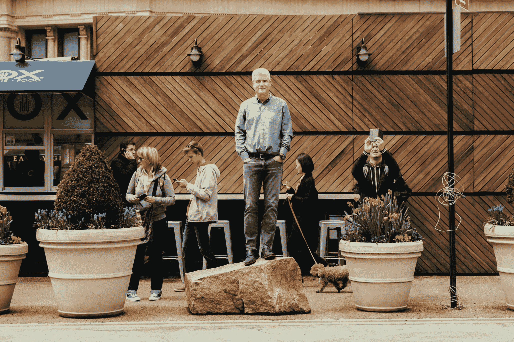
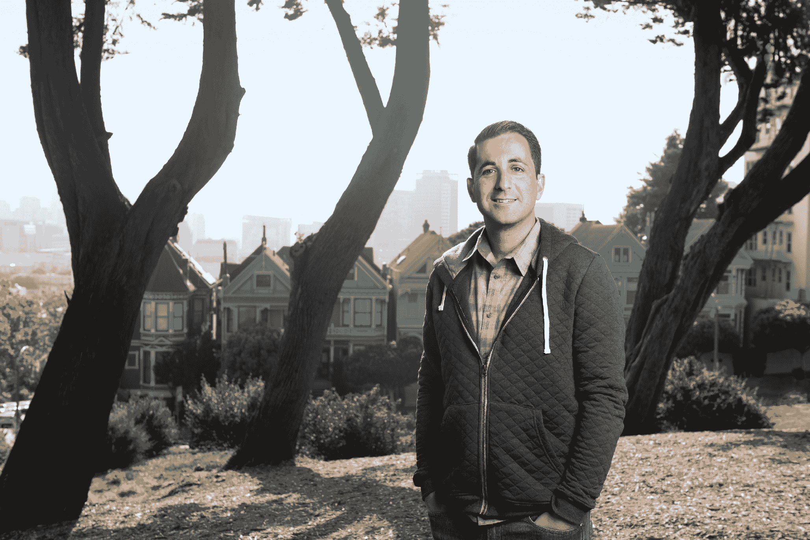

# 通过这条重要的社交建议|第一轮审核，拓展人脉，保持联系，加深联系

> 原文：<https://review.firstround.com/reach-out-stay-in-touch-and-deepen-your-connections-with-this-essential-networking-advice>

提到“网络”这个词，你可能会想起那些被压抑的记忆，比如尴尬的握手、不真诚的闲聊，以及打开一封陌生人想要“向你讨教”的电子邮件时的极度恐惧。然而，尽管名声不好，大多数人都明白社交网络很重要，甚至至关重要。人脉是推动科技世界的稳定暗流，为擅长培养人脉的创始人、经营者和投资者的职业生涯增光添彩。

当我们真正承担起将“网络”付诸实践的任务，将它融入到我们的日常生活中时，我们必须绕开社交地雷。我们想要真诚，而不是谄媚。我们需要有意识地伸出手，但要以真实的方式。我们应该创造繁荣的关系，而不仅仅是持久的关系。我们需要保持联系，但不能压制或超越我们的欢迎。

为了寻求洞察力和方向，我们从档案中挖掘了六位在业内人脉最广的人的智慧，其中两人自称内向。他们一致认为，直接围绕网络的对话需要重新构建。

这不是一场积累人脉的竞赛，也不是一张向听力范围内的每个人进行电梯推销的许可证。**把社交看作是随着时间的推移培养真实联系的实践**。带着感激和真诚的渴望去了解一个人——在你的口袋里带着一些方便的建议——你将准备好超越握手，建立终生的联系。

现在来看看这些提示。下面的六个策略对于建立健康的人际关系很有用。从 10 分钟的例行公事，你可以使用重燃联系，到你可以问的问题，让闲聊超越表面，这些提示揭示了如何给人留下深刻的第一印象，并获得更强的后续行动。它们包括有针对性的战术建议，以不同的方式建立关系网，分享他们如何赢得作为专业可信的连接器的声誉的内部技巧。

也没有时间可以浪费了。用第一轮董事会合伙人[克里斯·弗拉里奇](https://firstround.com/person/chris-fralic/ "null")的话说，他是“一个认识所有人的人”:

还有时间超越这个筹款甚至这个公司。关系需要多年来建立。现在开始。

为了打造真正真实的关系，你需要让人们从陌生人变成你的熟人，然后是朋友，然后是亲密的关系。

每个阶段都有自己的问题。从陌生人到熟人的旅程经常充满尴尬、冷场和不舒服的环境。但是熟人区的危险是另一种类型的:相互寒暄，坚持肤浅的谈话，试图摆脱“我们应该找个时间聚一聚”的无尽循环。

简而言之，认识一个人和*认识*一个人是有区别的——大多数网络建议都失败了，因为它没有做出这种区分。

但对 **[迈克·斯泰伯](https://www.linkedin.com/in/msteib/ "null")** 就不能这么说了。他的社交方式与众不同——这也是为什么[他关于建立一个有意义的社交网络的想法](https://firstround.com/review/dont-just-network-build-your-meaningful-network-to-maximize-your-impact/ "null")是我们去年的评论中的一些[最佳建议的关键原因。为了克服我们许多人在社交时经历的焦虑，Artsy Artsy 的现任首席执行官和 XO 集团的前任领导人开发了一种有针对性的方法，将我们生活中的陌生人转化为有价值和珍贵的联系。Steib 喜欢把人想象成通过四个嵌套的同心网络向上移动:**不熟悉→熟悉→亲密→有意义**。](https://firstround.com/review/the-30-best-pieces-of-advice-for-entrepreneurs-in-2018/ "null")

你的陌生和熟悉的网络足够直接——分别是你完全不认识的人和你略知一二的熟人。但这就是划分的界限，你需要从轻度的人际关系网和“了解”人们转向真正的联系和深入。对于我们这些希望从闲聊跳到有意义的谈话的人来说，Steib 的轻量级但极具战术性的建议对于真正了解一部分你想与之建立更密切联系的人来说是完美的。

这是他自己的话:

你把你熟悉的网络中的人带入你的亲密网络，通过了解他们，理解你们的共同点，找到你可以帮助他们的方法。几乎每个人都会弄错下一部分。当在我们熟悉的网络中面对一个有趣的新人时，我们往往会犯两个基本错误之一:**谈论自己**和**犯会话怯懦**。

错误 1:谈论我们自己。

我们竭尽全力让他们相信我们也很有趣，很可爱。我们中的大多数人已经发展出将任何对话转回到自己身上的能力。经过 5-10 分钟的交谈，我们对我们的新朋友知之甚少。

我们犯这个错误是因为感觉很好。人类天生渴望被欣赏。当我们一直在说的时候，我们就剥夺了我们的新朋友执行这一重要行为的机会。上一次刚认识的人不停地说他有多棒多成功，你是什么感受？你很可能对这个人产生了一种低度的嫉妒和厌恶。多么可悲的错失良机。我们花费所有精力试图让某人喜欢我们，而她真正想要的是让我们喜欢她的机会。

所以不要说自己。从现在开始，通过调查他人的工作和兴趣，把每一次互动都当作欣赏他人的机会。“你做 CrossFit 多久了？结果如何？作为一个素食者，很难获得足够的蛋白质来支持所有的举重运动吗？”

以击球手的心态在你新朋友的本垒打比赛中谈论个人的伟大。

通过把他们关于你的问题转回到他们身上来避免谈论你自己的诱惑。观察这个人多么渴望抓住机会告诉你更多关于他或她的激情。正如著名广告人大卫·奥格威所说:“如果你想变得有趣，就要对自己感兴趣。”

**错误 2:对话怯懦**

我们也倾向于保持讨论的安全性，并且仅限于表面。闲聊是打破你不熟悉的人际关系网僵局的好方法，但是除非你进入实质性的对话，否则你永远不会了解一个人。考虑与同一个人的这两种互动的区别:

附件 A

“你喜欢这个活动吗？”“哦，是的，很好看。”“你参加很多活动吗，玛格丽特？”“一年三四个。”“真好。”“是的，很好看。”

附件 B

"那么你在活动中听到了什么与你的工作相关的事情吗，玛格丽特？"“关于消费无人机技术的那篇文章很有趣。”“我没记错的话，你为一家国防承包商工作？小型无人机如何融入更广泛的国家安全图景？”“哦，这是件大事。想象一个联网无人机网络……”

通过第一种方法，我们了解到我们都认为这个活动很好；在第二阶段，我们学习了所有前沿的新技术。我们经常害怕进行更深入的对话，因为我们不想对我们不知道的事情显得无知。

“托德，你说过你在一家瑞士银行工作——你在那里做什么工作？”"债务资本市场."“哦，酷。”

然后你下半辈子都不知道什么是债务资本市场，也不知道你的新朋友是干什么的，因为你不敢问。但如果托德值得去了解，他不会在意你不熟悉他的作品。他可能会认为你的沉默意味着你对他不感兴趣。所以他为什么要费心去了解你呢？将自己从这种恐惧中解放出来，将会打开成千上万次迷人对话的大门。

这里有一组问题总是适用于某人的工作，这将鼓励他们更加开放:

告诉我商业模式——谁付钱给谁，谁给谁提供价值？

与竞争对手相比，你有什么优势能让客户选择你？

是什么吸引你在这个特殊的行业工作？

你的部门在整体业务中占多大份额？

有新技术影响您的业务吗？

听起来你很成功？是什么让一个人在这个角色上不成功？

你工作中最喜欢的部分是什么，为什么？

既然你们已经进入了相互满足的对话，那么接下来的每一次联系都会产生飞轮效应。你可以获得更多的细节，提出更有见地的问题:“托德，你过得怎么样？我刚刚在英国《金融时报》上看到，债券价格一直不稳定，这对你有什么影响吗？”

这种方法还有另一个隐藏的好处:基于你从新朋友那里学到的所有有趣的东西，你变得更有知识，对其他人更有兴趣，而且你永远不知道你收集的知识在哪里会派上用场。

你建立人际网络的成功建立在一个非常重要的心态上:你这样做是基于你想了解、欣赏和帮助他人的愿望。

在这里阅读 Steib 关于如何把人们带到你熟悉的、亲密的和有意义的网络的建议。

一旦你给人留下了深刻的第一印象，就要靠你来把这个接触点变成一个有共同目的和积极影响的联系。克里斯·弗拉里奇发现这是很多人摸索的地方:他们太忙、没有条理、紧张或悲观，以至于无法以正确的方式跟进。结果是:太多高潜力的关系无缘无故地失败了。

Fralic 负责**对 [Warby Parker](https://www.warbyparker.com/ "null") 、 [Roblox](https://www.roblox.com/ "null") 和[hotel night](https://www.hoteltonight.com/ "null")(现在[被 Airbnb](https://techcrunch.com/2019/04/15/airbnb-officially-owns-hoteltonight/ "null") 收购)等公司的首轮**投资，他还撰写了[一篇具有里程碑意义的福布斯关于钉钉电子邮件介绍的文章](https://www.forbes.com/sites/bruceupbin/2013/03/27/the-art-of-the-email-introduction-10-rules-for-emailing-busy-people/#6260bb567f7b "null")。他将自己的职业成功归功于年轻时销售甲骨文软件时形成的网络理论:

要成为极具影响力的人，最好的方法就是对你遇到的每个人都像人一样。

牢记这句箴言，他分享了两个简单的技巧来维护和保持职业关系。

**做:跟进并坚持到底**

这听起来很简单——只要在会议后跟进，完成你承诺的任何交付。但是 Fralic 说，有相当多的人不知道。

实际上，做你说要做的事会让你进入前四分之一。

“我见过肯尼·赫尔曼，他曾在一家首轮公司工作，是那里最好的业务开发人员之一。弗拉里克说:“在一次会议上，他不断想办法让人们把我介绍给他们，并说他会发一份名单给我，我可以从中选择。

“后来，他真的给我发了一封电子邮件，里面有他集思广益的所有人的 LinkedIn 链接，以及他们是谁的一行细节。随信而来的是一张简短的便条，主动提出做介绍。这是完美的后续。十个人中有九个不会那样做。相反，大多数人只是睡着了或者忘记了。不仅关系到此为止，而且我永远不会用可靠这个词来形容他们。

这些天，有很多关于建立个人品牌的话题。弗拉里克说，具有讽刺意味的是，你的品牌实际上来自于你坚持不懈地按时完成出色的工作，而不是投资于社交媒体或网站或营销你的工作。你有让自己惊喜和愉悦的工具:速度和修饰。如果你能快速跟进，那会让你被注意到——如果你的内容被完美地校对和详细，那就更好了。

不要:只在你需要的时候伸出手

此外，确保你的跟进是有价值的，而不仅仅是一系列的请求。这可能是偶然发生的，或者你觉得没有其他选择。

“检查你的‘已发送’文件夹，看看你最后一次联系某人是什么时候，是在什么情况下，然后再发出请求帮助的短信，”弗拉里克说。“当有人只想利用你时，这一点很快就会变得很明显。不要成为那种人。这是一种遭受个位数回复率的快速方式。如果你只是问别人要东西，而不考虑你最近为他们做了什么，或者不知道你为什么要问，人们会觉得被利用了。他们不会回应。你的声誉会受到打击，所有人都会损失。”

Christ Fralic, board partner at First Round

在这里阅读更多关于如何变得人脉广泛的弗拉里奇宣言。

当你寻找新的机会时，一个强大的关系网可以成为你在这个领域的耳目。[早期 LinkedIn](https://www.linkedin.com/in/patrick/ "null") 董事兼[关系建立专家](https://mindmaven.com "null")Patrick Ewers，对机会进行了剖析:“机会来到你身边，是因为有人在他们遇到与你相关的事情时想到了你——无论是一份工作，还是一笔交易，或者是一个介绍，或者是一项可以帮助你做生意的技术。”

当人们看到巨大的机会时，你无法控制。但你可以确保他们首先想到你。

“我称之为**精神份额**的概念——在任何给定的时刻，你对某人来说有多重要，”尤尔斯说。“你和某人的想法越一致，他们就越有可能说，‘我知道这个机会的最佳人选。’当人们遇到你能满足的需求时，你想让他们想到你。"

这并不意味着强迫*频繁*互动，而是关注高质量、相关和有价值的互动。“如果你能做到这一点，你就会一直赢下去，”尤尔斯说。

这也比你想象的容易。“你不需要投入大量时间来决定如何对人们有价值。没人预料到这一点。我们都有白天的工作，”尤尔斯说。“这是人们最纠结的地方，他们不知道如何把事情分解成轻量级的行动。”

你有可能以极低的成本向人们提供令人惊叹的高价值。

这通常只是在面对面互动中改变你的行为(即更多地关注他人的需求)，并增加一个简单的习惯:**低提升价值有效载荷。**

“我喜欢‘价值有效载荷’这个术语，因为它听起来很实在，”Ewers 说。“价值负载是你提供给人们的任何可以帮助他们的东西——即使它不成功，90%的感知价值是意图。它们可以是对他们想见的人的介绍，关于他们正在试图解决的问题的文章，一张说明你看到了他们的作品并发给了其他人的便条。大多数时候，它需要发送一封电子邮件，这很容易成为一种习惯。”

每当你采取这种行动时，你就是在告诉别人，“我想到了一些对你来说非常特别的事情，并为此做了些什么。”很难想象不被欣赏。

Ewers 说:“最简单的价值有效载荷——它实际上不花你一分钱——是基于情绪的价值有效载荷。“它需要的只是在那一刻给人们积极的反馈。许多人都有这种奇怪的倾向，在给予赞美或积极反馈时会过于小心。有多少次有人在会议上发言，你会想，哇，这真的很聪明，但你从来没有大声说出来？或者甚至会后给他们？”

为了改变这种心态，他有一个简单的规则，人们可以应用它来全面提升他们的价值:

如果你认为并且相信，就说出来。

“如果你真的相信别人积极的一面，你也不会失去什么。你可以袖手旁观，这会让他们感觉很好，尤其是在他们的同龄人面前。就像给某人发电子邮件一样，如果你尝试，这很容易成为习惯。”

尽管这些任务都很细致，但尤尔斯说他很少看到人们利用它们。“这是人类的一种功能。我们并非天生就喜欢冒险。我们对消极的反应是积极的 5 倍，所以我们不想冒被拒绝的风险，即使我们试图帮助别人。”

他和许多人谈过，他们说自己工作非常紧张，甚至没有时间或意识去提供积极的反馈。但是，正如尤尔斯所说，这使它成为一个更成熟的机会。想想看，如果你说了一些关于他们的好话，那些和你一样焦虑的人会感到多么安慰和高兴。它有可能极大地改善他们的工作环境。

其他人无法交付价值负载，因为不管他们是否知道，他们都把成功视为零和游戏。如果别人成功了，他们会觉得不那么成功。要成为一个有效的社交者，你必须对自己诚实，并立即抛弃这种信念。取而代之的是，让别人成功也会让你成功。它不仅更积极，而且更准确。

除此之外，你还可以做两件事来加强联系，提升你的价值:

**建立共识:**这听起来像是常识，但背后有强大的科学依据。每个人都有成为一个部落的一部分的本能冲动，由此产生了“我们”和“他们”的二分法。“每当你与某人互动时，你都希望最终成为他们的‘我们’。你想成为他们部落的一员，”尤尔斯说。幸运的是，今天，这就像说你喜欢同一个应用程序或阅读同一个博客一样无关紧要。“当有人听到这些时，他们的爬行动物大脑会进行计算，认为这个人像我。研究表明,“我像你”的想法会立即转化为“我喜欢你”这是我们处理可爱的方式。“你最喜欢工作的哪一部分，为什么？

**要真实:**用另一句口头禅代替“假装直到你成功”。“与其假装自信，不如真诚地好奇，”尤尔斯说。“当你好奇的时候，你会问别人关于他们自己的事情。你会发现他们想要什么，以及你如何满足他们的需求。人们喜欢谈论自己，他们喜欢爱学习的人。这样更诚实，你会留下更好的印象。”

幸运的是，创造“低升力值有效载荷”并不一定是一项艰巨的任务。而且根据 **[凯伦·维克瑞](https://www.linkedin.com/in/karenwickre/ "null")** 的说法，打理你的网络一天不超过 10 分钟。她认为，建立有意义的联系的关键不是去参加马拉松式的鸡尾酒会。它停留在“**松散接触**”——她定义为“随着时间的推移，对你的人际网络的照顾和滋养。”

作为 Twitter 的前编辑总监， [Wickre](https://www.linkedin.com/in/karenwickre/ "null") 不仅有着令人难以置信的人脉*，而且*自称是一个内向的人。她甚至为她的安静的、躲避聚光灯的观察者同伴写了一本书。在 *[把工作从人际关系网中抽离出来:一个内向的人建立重要关系的指南](https://www.simonandschuster.com/books/Taking-the-Work-Out-of-Networking/Karen-Wickre/9781501199271 "null")* 中，Wickre 分享了一个保持松散联系的 10 分钟诀窍，以及你可以发送的 5 个参考信息来保持你的关系蓬勃发展。

Karen Wickre, author and former Editorial Director at Twitter

她用自己的话说:

没有人喜欢被重复利用的感觉，尤其是在单方面的时候。你能建立的最好的联系是那些你们有共同之处的联系:有时你们中的一个人需要一些东西，有时你们都不需要，不管怎样，你都继续付出你的时间和注意力。

这是我对无压力人际关系网的指导原则:在你需要它之前培养它。

从每天花 10 分钟培养你的放松习惯开始。对于潜在的大量回报来说，这是很小的努力，即使没有直接的结果，也有很好的感觉。无论你是需要的给予者还是接受者，你都会获得满足感。以下是我如何适应我的一天:

把它作为早晨的热身。我早上查看电子邮件和新闻的习惯是为工作日做准备的一种方式。当我浏览标题时，我会分享一两个故事，我知道那些我没有联系过的人会感兴趣，并附上一个简短的说明:“这让我想起了你。你有什么看法？你好吗？”

保持一个连续的待办事项清单。保持联系的一部分就是跟踪你遇到的人。在你的谈话或会议之后，想想你想传递什么，以及你想联系谁。把它们加到你的清单上，然后获得完成任务的满足感。

**带着感激结束一天。**给你喜欢的人或你想结识的人发几张“想念你”的便条，或者甚至和你刚认识的人开始一段新的对话。这是播下联系种子的好方法，也许第二天就能得到回应。

**用这五个信息打招呼。**

“仅供参考”信息的好处是，任何一方都没有真正的义务，你是收件人的首选(这有助于巩固你们正在进行的关系)。

除了链接或附件，你的信息基本上是这样的:这证实了我们所谈论的；我想知道你的反应是什么；读到这里让我想起了你。以下是五种“仅供参考”的笔记，可添加到您的轮值表中:

**1。给面试你的人发一篇相关的文章，因为你没有得到那份工作。即使没有成功，你也喜欢你遇到的那个人，并想保持联系。显示出你是一个优秀的运动员，仍然关注公司和行业。(不要重温求职面试就好。)**

**2。向你在去年的一次会议上遇到的人打招呼**，询问他们是否会出席今年的会议议程。

**3。和以前的同事分享你以前公司的趣闻。**以前的同事有时是最好的弱关系——你可能不太了解他们，但有一种血缘关系的感觉。一张简单的纸条，询问他们在做什么，并附上一个故事，可以保持联系，甚至加强联系。

**4。向他们发送与他们兴趣相关的信息(新闻、事件、评论),以显示你对他们薄弱关系的关注。对于你不太了解的人来说，这会给你一个快乐和感激的时刻。你发送的是基于你所知道的:他们是在会议上发言，做研究，对一个项目充满热情，关注一个新兴趋势？**

**5。通过跟进相关信息来巩固你刚刚建立的联系。**如果你刚刚遇到某人，并谈论了手机的使用，发送你在上面发现的新闻故事，并附上简短的说明(“这让我想起了我们的对话”)。

这里有一个例子，是我最近发给自动驾驶汽车领域一位友好的专业联系人的一封无义务的“仅供参考”的短信。我在看到一条关于即将举行的关于这个主题的研讨会的推文后想到了他。

主题:你知道这个会议吗？(主题行应该挑逗你发送的信息，而不是泛泛的“嗨”。)

*嗨，吉米，我希望你在这些有趣的时光里一切都好。只是偶然看到这个【链接】就想到了你。*

*周一快乐，*

凯伦

即使这封短信也能完成很多任务:

“欢乐时光”是指关于自动驾驶汽车的新闻激增，有时是古怪的，消极的，或不准确的。这一提及传达了对吉米所处理的事情的一点同情。

如果你包含一个信息链接，你就不必解释太多。在这种情况下，这是一个即将举行的研讨会的主页，该研讨会是为研究自动驾驶汽车相关问题的政策制定者举办的。请注意，它是活动本身的网站，而不是关于活动的新闻报道——前者更有用、更直接。

就连结束语“周一快乐”也是这样说的:“我不想从你那里得到任何东西。用这些信息做你喜欢的事情。”

从一个硅谷老手和内向的人那里，阅读更多凯伦关于如何建立有价值的关系的极具战术性的建议。

当谈到冷淡的接触时，通常困扰抵制社交的人的焦虑是害怕被拒绝。热情的推销邮件被起草，光标停留在“发送”按钮上...却在最后一刻退缩了。

作为一个过去从事过创造性工作的人，利兹·佛斯莱恩对恐惧和怀疑的感觉并不陌生，这种感觉经常阻碍人们点击“发送”2014 年， **[Humu](https://humu.com/ "null")** 的现任内容负责人开始兼职工作:她的一些草图和收集的职业智慧最终变成了她的畅销书， *[没有痛苦的感觉:工作中拥抱情绪的秘密力量](https://www.lizandmollie.com/book "null")* [。](https://www.lizandmollie.com/book "null")

她提供了拒绝的另一面:“当你做出这个跳跃时，你会有一种强烈的情绪。福斯林说:“不要让拒绝的恐惧阻碍你，而是让可能性激励你。”她提供了两种策略来摆脱恐惧的羁绊，拥抱让自己脱颖而出的承诺。

**把自己定位成一个人**

作为一种开始建立联系和宣传自己工作的低风险方式，佛斯林给三位她钦佩的经济学博主发了电子邮件。“我以关注他们工作并对经济学感兴趣的人的身份接近他们。他们最终转发了我的插图，”她说。最终，她的一个项目， *[一个经济学家说我爱你的 14 种方式](http://fosslien.com/heart/ "null")* ，在包括*金融时报*和*经济学家*在内的出版物中传播。

“不要害怕通过电子邮件坦诚表达你的爱慕之情，”她说。“打开话题，说‘我出于 X、Y 和 Z 的原因喜欢你的工作。我做了一件你可能会喜欢的事。“如果你喜欢它或者想转发它，我会很高兴的，”福斯林说。“就是这样。以人性化的方式推销自己，你会发现人们通常会对这种真实性做出回应。”

我给自己的建议是:发邮件就好。不要想多了。最好的情况是它为你打开了一扇神奇的门。可能发生的最糟糕的事情就是什么都没发生。

**分享你正在进行的作品**

如果你在做一个个人项目，你不需要独自辛苦工作，几年后带着你的杰作出现。分享你的草图和涂鸦。

Fosslien 说:“无论你是在做兼职还是组装投资组合，都要把最小的部分放到网上的某个地方。”“甚至用博客或照片以低调的方式记录这个过程。”

留下你的创造性工作的工件的好处是双重的:“首先，你得到了你自己头脑之外的项目，所以你可以更客观地处理它。第二，你有可以与他人分享的物证，”福斯林说。“当我在写这本书的时候，我有时会给我的搭档看一些未完成的插图，这既是为了得到他的反馈，也是为了在图画让他发笑时增加一点动力。”

*[查看更多关于我们在工作中遇到的七种致命情绪的 Fosslien 建议(以及如何让它们成为你的秘密职业超能力)](https://firstround.com/review/these-seven-emotions-arent-deadly-theyre-your-secret-career-superpowers/ "null")*

咖啡聊天，或信息采访，是网络工具包中最著名的工具之一。但是大多数人低估了为成功所做的精心准备。即使你*真的*在新联系人的日历上找到了位置，也很容易让聊天漫无目的地进行——实际上浪费了你和你的联系人的宝贵时间。

你可能会说萨沙·奥尔洛夫对咖啡聊天的艺术有一些专业知识。在几个月的时间里，***[lend up](https://www.lendup.com/ "null")***的创始人和前 CEO 与创始人、CEO、企业家、投资者、教练、高管和其他商业领袖进行了 100 次咖啡聊天。

Sasha Orloff, founder and former CEO of LendUp

事情是这样开始的:当奥尔洛夫决定辞去 LendUp 首席执行官的职务时，他休息了 100 天来重新调整和反思。到了第一百天，他准备开始更认真地探索新的东西，这意味着激活他的网络来挖掘机会。

帮助奥尔洛夫获得潜在客户的一个策略是在 LinkedIn 上发布一条简短的帖子宣布他的离职。他的帖子最初只是一个简单的更新，但却引发了大量的回复和联系请求。他说:**如果你与你的社交网络分享你正在前进，人们可能会自然而然地向你问好，或者提供帮助。奥尔洛夫的脆弱最终导致了更大的机会。**

起初，奥尔洛夫对一切都说“是”。不久之后，他开始关注会议的优先级，这些会议可以帮助他思考接下来的步骤。所以，他为他的咖啡聊天设定了一个目标。**“我想问人们如何管理从一份工作到下一份工作的过渡，”奥尔洛夫说。“我还想专注于与那些能帮助我找到新想法和新问题灵感的人交谈。”**

下面是奥尔洛夫如何战略性地缩小他的联系人名单:

**入站联系人:**“在我在 LinkedIn 上宣布辞职后，一些人联系了我。这其中既有想叙叙旧、回忆我们在 LendUp 的时光的同事，也有朋友。”

**曾经站在他的立场上的操作员:**“我在这里学到了更多的战术:我关注的是那些曾经和我处境相同的人，他们能够给我指导，告诉我如何完成自己的转变。我联系了那些至少和我有松散联系的首席执行官们。我优先考虑那些离开自己创办的公司的人，或者在最初的创始人之后接任首席执行官的人。”

**投资者:**“虽然我近距离观察了自己的职业转变，但风投有着独特的视角。他们对这些情况有一个鸟瞰图，他们也看到并分析了很多。我认为他们会对市场和机会以及这可能意味着什么提供有益的视角。所以，我从 LendUp 的投资者开始。我还想问问他们对市场的看法，以及可能会有哪些新的机会。”

随着奥尔洛夫获得了更多的视角，他对下一步的设想变得更加清晰。在这一点上，他意识到，在他能够利用他的网络之前，他必须能够简洁地表达他想要什么。

人们想帮助你，但如果你自己都不知道自己要去哪里，他们也只能帮你这么多。他说:“有了更具体的目标，你就能更有效地最大化你的人际网络。”。

为了进一步实现自己的目标，奥尔洛夫列出了三个清单，分为三大类:

你想培养的技能

你想从事的行业或者你想拥有的经历

不可协商

奥尔洛夫说:“一旦你列出了这些，你应该能够用一句话清楚地表达你想要什么:**一旦你可以告诉人们，‘我对探索 Y 行业中的角色 X 感兴趣，我的必备条件是 Z’，那么你的关系网就会更容易帮助你到达你想去的地方**。

*[阅读奥尔洛夫在 100 多次咖啡聊天中学到的关于职业转型的智慧。](https://firstround.com/review/i-asked-100-founders-ceos-and-vcs-about-career-transitions-heres-what-i-learned/ "null")*

*摄影来自盖蒂图片社，* *[迈克尔乔治](https://www.michaelgeorgephoto.com/ "null")***[海伦娜普莱斯](http://www.helenaprice.com/ "null")* *和* *[邦妮雷伊米尔斯](http://www.bonnieraemillsphoto.com/ "null")* *。**