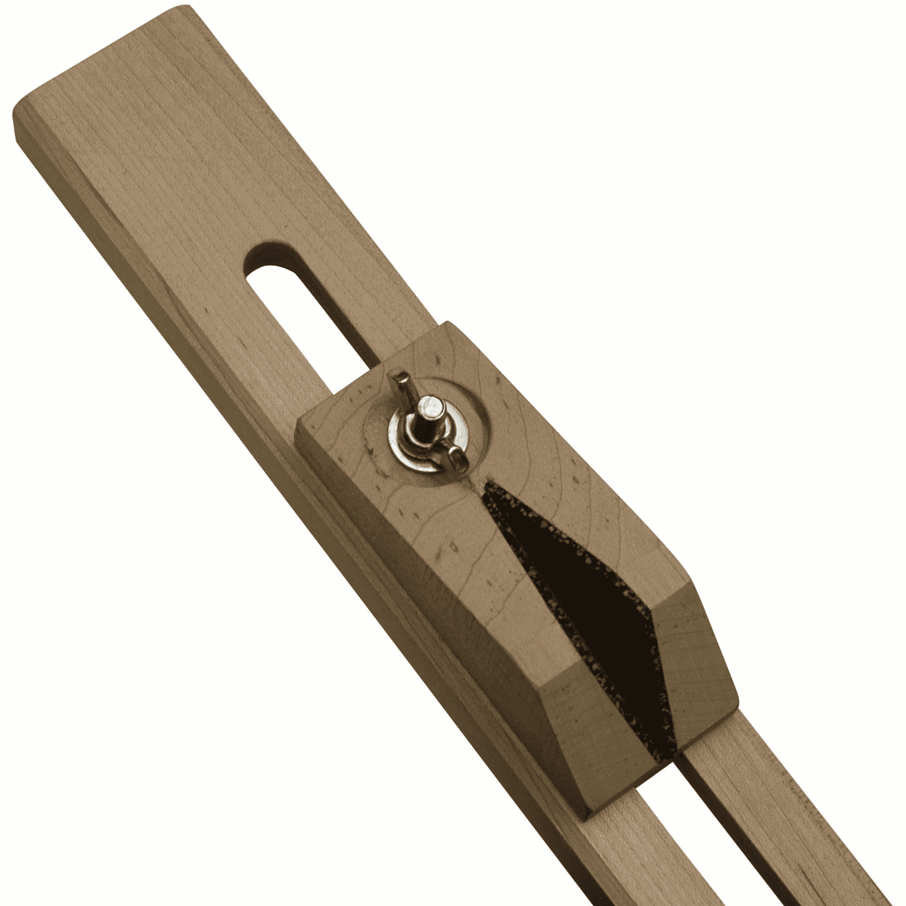

# 垫片，夹具和其他木工概念征服技术债务|第一轮审查

> 原文：<https://review.firstround.com/shims-jigs-and-other-woodworking-concepts-to-conquer-technical-debt>

在 90 年代早期，著名的计算机程序员和维基发明者沃德·坎宁安[首先综合了复杂技术开发和债务](http://c2.com/doc/oopsla92.html "null")的概念。这个新创造的术语给困扰全球开发团队的下沉感起了一个名字。他警告说，工程组织在交付的每一行有效但不完美的代码中都积累了越来越多的债务。如果通过重写迅速得到回报，一切都好。但如果不是这样，债务的利息会在拥有它的工程团队身上复合并崩溃。

进入**[One Medical Group](http://www.onemedical.com/ "null")**CTO**[Kimber Lockhart](https://www.linkedin.com/in/kimberlockhart "null")**，这个工程相当于你精明的财务规划师。洛克哈特信奉一种受木工启发的哲学，帮助初创公司明智地控制技术债务的产生和积累。在担任目前的职位之前，她在 Box 的四年任期内晋升很快，在那里她从一名软件工程师开始，并逐渐成为整个应用程序堆栈团队的领导者。在 Box 收购了云存储和文档共享初创公司[incero](https://www.crunchbase.com/organization/increo-solutions#/entity "null")后，她加入了 Box[，后者是她联合创立并领导的。](https://www.box.com/ "null")

在这个独家采访中，洛克哈特解构了技术债务，并提供了木工技术，将更好地帮助你管理它。像其他精明的权衡技术头脑一样，她分享了如何敏锐地接近捷径，尤其是在速度和完整性都非常重要的工程环境中。

技术债不是红字。这发生在最好的团队中。我认为一家初创公司没有任何技术债务实际上是不负责任的。

# 如何在技术债务变成坏代码之前处理它

债务的耻辱——无论是技术上的还是其他方面的——在于它是虚弱的标志，或者导致过度依赖，而事实上它仅仅代表一种交换，以成本付出更多的时间或资源。“即使是表现最好的团队也会产生技术债务。不同的是，他们这样做是为了走捷径。捷径通常是不好的，但有时可以在成长中的企业做出深思熟虑的选择。当太多的快捷方式被用来节省时间和技术债务时，糟糕的代码就会产生。洛克哈特说:“关键是要敏锐地理解企业成长过程中捷径的权衡。

例如，如果你的目标是实现适合企业的产品市场，你的首要任务是快速迭代，以确定你是否在以企业可行的速度为正确的受众构建正确的产品。“在这种情况下，通过走捷径来承担技术债务可能是值得的，即使这会引入糟糕的代码，”Lockhart 说。“这不是一张针对糟糕代码的空白支票，但它有一种微妙的用途，可以在短期内获得成功，以确保长期成功。这就是技术债务的双刃性。”

简而言之，技术债务本质上并不坏，但如何管理它决定了对业务的积极或消极影响。以下是洛克哈特关于如何谨慎使用技术债务的建议:

**混入木匠师傅**。洛克哈特说:“年轻的创始人——实际上是所有的团队领导——在经验谱的早期雇佣过多的工程师是很常见的。”“防止技术债务产生坏代码的一个简单方法是让退伍军人组成绿色技术团队，他们可以利用过去的经验更加熟练地做出困难的决策。”

在 One Medical 和 Box，洛克哈特都认识到了依靠经验丰富的工程师的价值，这些工程师已经经历了足够多的技术*和*业务成果，能够围绕积累和解决技术债务做出合理的判断。“他们需要看到自己亲手打造的东西推动企业向前发展，他们需要为自己选择的捷径感到后悔。这是一个时间密集的周期，但没有什么可以替代个人经验。

所以，创业者们，在你的社交圈之外招聘。寻找那些已经在公司呆了足够长时间的工程师，来体验他们的决定的长期影响。年轻的开发人员，找几双有经验的眼睛。老兵们，带些绿色工程师到你们的羽翼下。“拥有更多视角是利用人们积累和解决技术债务的经验的关键，”Lockhart 说。

**量两次，切一次**。在任何人编码**之前开始代码评审*。最好的技术团队一起设想——而不仅仅是审查——代码。“不言而喻，某种形式的代码审查在任何类型的工程组织中都是必不可少的，”Lockhart 说。“在早期，两人一组开发或者坐在一起通读代码是可行的。随着团队的成长，从不同的个人或团队那里获得更正式的代码评审可能很重要。”***

Lockhart 说:“对于许多公司来说，过程不断发展，因此这种代码审查是工程师们获得对代码的反馈并不断改进代码的唯一机会。”“不幸的是，事后发现问题迫使我们在花时间重写代码和忍受糟糕的代码之间做出艰难的决定。”

前期投入更多的讨论并不意味着自动运行一个艰巨的规划过程。“一开始，让所有人围着一块白板，拍张照片并分享。洛克哈特说:“事情可以很随意。“重要的是让多个人参与讨论并写下结果。你想要的不是一份冗长、正式的设计文件，而是挖掘团队的智慧，采取最务实的行动。”

One Medical CTO Kimber Lockhart

收集并整理你的标准。起初，木工技术很大程度上是在人与人之间传递的。随着贸易专业化和创作变得更加复杂，木工制作了指南和图案书。罗马建筑师兼作家 Marcus Vitruvius Pollio 在他的论文*[De Architectura](https://en.wikipedia.org/wiki/De_architectura "null")*中，提出了规划和设计的最重要、最原始的来源之一，即如何标准化小型测量设备的导水管。

“这么简单，那么多团队都不做。洛克哈特说:“在编程中，做任何事情都有多种有效的方法，最糟糕的选择是与你的选择不一致。”。“更好的是，将你的标准编码到一个[棉绒](https://en.wikipedia.org/wiki/Lint_(software) "null")或其他[静态分析器](https://en.wikipedia.org/wiki/Static_program_analysis "null")中。从一套几乎是空白的规则开始，然后慢慢地加入你同意的代码标准。是的，要让你的代码符合每一条新规则需要一些时间，但是一致性对于防止糟糕的代码有很大的帮助。”

**摒弃那些不节省时间的捷径。**木工知道什么时候可以使用捷径，什么时候不可以。要修整木材，必须完全剥离木材上的现有涂层——没有擦拭型聚氨酯就足够了。走不去除现有涂层的捷径最终需要的时间和正确的方法一样长，特别是一旦新涂层覆盖在旧涂层上，干燥后，你必须修复潜在的缺陷。

类似地，Lockhart 发现捷径可能是一种错觉——通常编写干净的代码所花的时间与产生引入技术债务的代码所花的时间相同。“问题是，糟糕的代码通常让人感觉更快，就像匆匆忙忙让人感觉更快一样，”Lockhart 说，“几乎没有时间浪费在计划上，代码本身写得更疯狂。”

“选择无效的捷径通常不是因为手头的任务，而是任务周围的环境。她说:“如果你的团队缺乏经验，或者承受着很多不必要的压力，你经常会让人们选择不太理想的方式来构建一些既不节省时间、精力也不节省资源的东西。“我在 Box 的第一个项目是将我的第一家公司 Increo 的文档预览技术集成到 Box 产品中。我给自己施加了很大的压力来快速完成集成，并在适当的位置重用了一些代码模式，而不是用新鲜的眼光思考问题。虽然我的方法确实感觉像是一条捷径，但事后看来，更简单的方法会带来更直观的实现，实际上完成起来会更快。”

“领导者可以通过雇佣有经验的人、实施早期设计和代码审查以及避免不必要的时间压力来抵消这种趋势，”Lockhart 建议道。

**模块化建造。**对于快速建造、拆卸和重建的家具，木匠使用[可拆卸紧固件](https://en.wikipedia.org/wiki/Butt_joint#Knock-down_fasteners "null")，这是一种允许快速拆卸和组装模块化部件的接头。它们促进了灵活性和容易完成，即使对新手来说也是如此。类似地，模块化代码也很灵活，在模块内实现复杂的变化比在大型代码库中实现更容易。

对于工程团队来说，未完成一半的框架转移是混淆技术债务的最常见原因之一。随着今天前端 web 框架的激增和开源工具的快速版本化，使用最新最好的工具的诱惑很大。在转换之前，Lockhart 建议考虑:“从新框架中获得的功能上的轻微增加是否值得重写代码的成本？”

“通过尽可能模块化地构建代码，你可以让这个等式看起来更好，”Lockhart 说，“在特性和功能之间的分隔线上分割那些模块。那么，应用新框架的成本只是重写一部分代码的成本。”

“在 One Medical，我们有一个中央 API 和数据存储，但不同的应用程序将数据呈现给不同的受众。这些小应用程序中的每一个都可以运行我们的核心框架的稍微不同的版本。这样，当你想只为一个受众做出改变时，你不必改变整个组织。”

# 当你面对糟糕的代码时该怎么做

技术债应该是一个有控制的走捷径的决定。当太多不协调的捷径出现，技术债被“透支”时，坏代码就发生了。以下是如何对持续的技术债务导致的不良代码进行优先排序、标记和导航。

**为不良代码创建一个评级系统。**“许多工程团队哀叹他们的组织未能充分解决由技术债务导致的糟糕代码，但当被问及如何解决它时，他们却不知所措，”Lockhart 评论道。"工程团队应该对他们的组织进行仔细的优先级排序，就像其他人提出请求一样."

在 Box 的团队中，Lockhart 设计并使用了一个系统来对这种类型的坏代码进行评级和优先级排序。为了获得评级，该团队将考察三个不同的因素:

**安全**。这种糟糕的代码有安全隐患吗？

**患病率**。坏代码有多普遍？它与代码库的不同部分交织在一起的程度如何？

**频率**。你多久会接触到那些糟糕的代码？当用户与产品交互时，它多久运行一次？

“在对这三个因素进行评级后，一个粗略的项目排名就出现了，”洛克哈特说。但是，没有一个评级系统是万无一失的，没有人扫描，以确保优先顺序是合理的。一个自动化的记分卡不能捕捉一切。“仔细地对项目进行优先级排序以解决不良代码就像先还清高利息的信用卡——它阻止债务复利。

技术债就像毒橡木。这是很自然的，但是不需要被撕掉来避免。警告标志有很大的作用。

**封装并标记你的坏代码。工程团队可能会感到压力，要么推进糟糕的代码，要么立即找到并删除它。然而，在这两者之间有一个阶段是有用的，不那么激进，也不那么耗时。“如果你知道你的代码中有一部分是不好的，并且不希望人们重复它，那么就给它贴上标签。洛克哈特说:“这样做，你就明确指出了哪些代码不应该再被遵循，即使这些代码目前对功能来说是必要的。它可以简单到放弃一个函数，或者插入一个注释，表明代码不再符合您的开发团队的现代风格。这将大大有助于防止不良代码的传播。”**

“下一步是遏制不良代码，使其不扩散，”Lockhart 说。一个简单的例子可能是隔离一个对象上的坏代码，并用整洁、干净的新功能扩展该对象

“你会在树林里发现比书本上更多的东西。树木和石头会教你从大师那里学不到的东西。”圣圣伯尔纳铎

**构造工具对抗不良代码**。为了处理和消除负面技术债务，洛克哈特借鉴了木工领域的两种工具和技术:垫片[和夹具](https://en.wikipedia.org/wiki/Shim_(spacer) "null")。垫片是一个薄的锥形楔，用于填充物体之间的小间隙，而夹具是一个辅助工具，用于控制另一个工具的位置或移动。下面是 Lockhart 如何将这些工具应用于软件开发:

# 垫片

在木工中，垫片的目的是更好地对齐。“垫片通常是一小片木头，当两个零件不能很好地装配在一起时就插入其中。有时它会留在最终产品中，以确保更好的结构，但它也可以在发挥作用后被移除，”洛克哈特说。“填补代码的概念是放入一些代码，使两个否则可能无法协同工作的部分协同工作。因此，如果你的代码的一部分没有公开正确的接口，你可以添加一个层，让它做你想让它做的事情。”

A shim

在 One Medical，Lockhart 和她的团队试图扩展其消息服务的功能。“我们计划构建这个模块，使医生和患者之间的信息传递变得更加容易。洛克哈特说:“问题在于，我们最初构建代码是为了发送不同类型的信息。“我们担心我们需要从头开始，重写整个系统以接受新类型的信息。相反，我们编写并插入了一个填充程序，以便旧系统可以接受新类型的消息。我们避免了花费大量时间重写旧代码。”

shim 的一个常见例子是[软件开发工具包](https://en.wikipedia.org/wiki/Software_development_kit "null") (SDK)，开发人员可能会制作它，以便更容易地使用来自客户使用的语言的 API。“这是一个垫片，因为它是一层薄薄的代码，消除了脱节，”洛克哈特说。

“我最喜欢的填充代码用例是 [API 版本](http://broadcast.oreilly.com/2011/10/api-versioning.html "null")。随着公司的成长和迭代，API 发生变化是很常见的。为了保持旧的集成工作，公司通常选择对他们的 API 进行版本化。不可避免的，API 实现的 v1 有很多技术债，代码很烂。这里的机会是构建 API 的 v2，然后使用 v1 接口的垫片来实现 v2，删除旧代码并允许 API 协调工作。

Lockhart 认识到，大多数工程师可能不认为这项技术是一个垫脚石。“优秀的工程师总是这样做。但通过给这个工具命名，我们注意到我们认为它更像是一个可以接受的选择，”她说。“不用完全重写，我们现在可以在内部说:‘嘿，你确定我们不能用一个垫片来做吗？’它得到了认可，人们更频繁地承认它是他们工具集中的一个工具。"

Lockhart 对垫片提出了警告，“像任何捷径一样，过度依赖垫片会导致技术债务和糟糕的代码。确保你使用垫片来完成最后一英里，而不是做繁重的工作或大规模的修补工作。”

你需要立即解决技术债务的想法在公司的所有阶段都不是有用的心态。

# 吉格舞

“比垫片更复杂的是，夹具是木工制造的一种工具，它有助于——但并不影响——最终产品。例如，它可以是一个引导锯子实现复杂切割的装置，”洛克哈特说。“夹具通常不会很快生产出来——夹具和最终产品一样需要大量的工艺。通过避免在夹具上走捷径，你最终会得到更好的最终产品。我曾经讨厌在非最终产品上如此努力工作的想法。但在跳汰机上的投资可能是完全值得的。”

A jig

应用到技术上，jig 是任何以实现更好的代码为主要目的的代码，而不是用于生产和使用。在清理不良代码的过程中，夹具尤其有助于提供支持。

“在这种意义上，测试自动化是夹具最明显的例子。编写测试代码来测试应用程序，以确保它按预期工作。测试代码不是最终产品的一部分，但它使最终产品更好。测试是避免不良代码的最重要的工具，每个新特性都应该测试，每个 bug 修复都应该包括一个新的测试来防止问题。甚至编写您打算扔掉的测试代码也是有价值的——有时，安全修改旧代码的唯一方法是就地为它编写测试，重写代码，然后删除初步测试，以便对新代码进行更可靠的测试。

夹具也存在于测试之外。“假设我正在编写一个 API，通过 web 应用程序向某人发送文本消息。为了彻底测试该 API，我可能会决定制作一个非常简单的客户端来测试我编写的 API。最终我会扔掉那些代码——它的存在只是为了我能构建一个更好的 API。”

组件库或生活方式指南是 jig 的另一个例子，它帮助测试和维护前端组件。“在编写面向客户端的代码时，用组件编程比从头开始更好。开发人员不是一次又一次地构建一个按钮，而是构建一个按钮并在任何地方重复使用。洛克哈特说:“这是现代开发人员考虑编写用户界面代码的一个重要部分。“Twitter 的 Bootstrap 库就是一个很好的例子。你可以看到每个组件，所以如果有人试图修改一个组件，很容易看到意想不到的副作用，转到库页面，一个你的用户永远不会看到的页面。好处是您可以隔离组件，对它们进行更改并评估影响。这些都是昂贵的构建夹具，但通过投资这些时间，您可以为用户节省数小时的错误修复和错误部署时间。”

# 垫片和夹具的选择

和大多数工匠一样，开发者也有自己喜欢的工具。“当公司减少生产并开始更多迭代以满足产品市场需求时，加倍投资垫片是明智之举。洛克哈特说:“有了它们，你可以快速前进，而不会产生大量的技术债务。”。“早期的夹具更难——很难考虑构建您将丢弃的代码。但是如果你的目标是创造高质量的东西，这是一个强大的概念。

几乎你产品的每一个元素都需要在未来的某个时刻重新审视。由于技术债务而无法做到这一点可能会让人瘫痪。

技术债务可能是快速增长公司的信号，也可能是它们的压力。目标是监控和管理技术债务，采用的策略包括给债务贴标签、创建评级系统以及以模块化的方式构建代码。使用木工技术，如垫片和夹具，不仅可以减少技术债务，还可以帮助你的工程组织更快、更智能、更协作地移动。最后，当你培训你的工程团队时，让他们和经历过整个技术债务周期的老手们一起，这样你就可以奖励他们采取细致入微的方法进行深思熟虑的权衡的集体能力。

以下是洛克哈特对未来技术债务观察的概要:

“技术债影响你的整个开发过程。句号。它可以用来在企业中做出深思熟虑的选择，如果被忽视，它也会成为一种破坏性的力量。”

“聘用经验丰富的工程师，他们对技术债务有一定的承受力，在权衡取舍时有天生的直觉。寻找考虑利弊而非绝对的开发人员。”

“如果代码对业务至关重要或者会影响客户，那么立即解决技术债务。但如果债务没有造成任何迫在眉睫的问题，那就监控它，让它去吧。”

“解决技术债务并不会神奇地让所有代码变得更容易编写。这是一把双刃剑，既可以成为快速部署的杠杆，也可以成为不良代码的沃土。”

“引导你内心的木工。垫片和夹具可以帮助将技术债务从对技术团队的威胁转化为帮助构建和支持代码库的工具。”