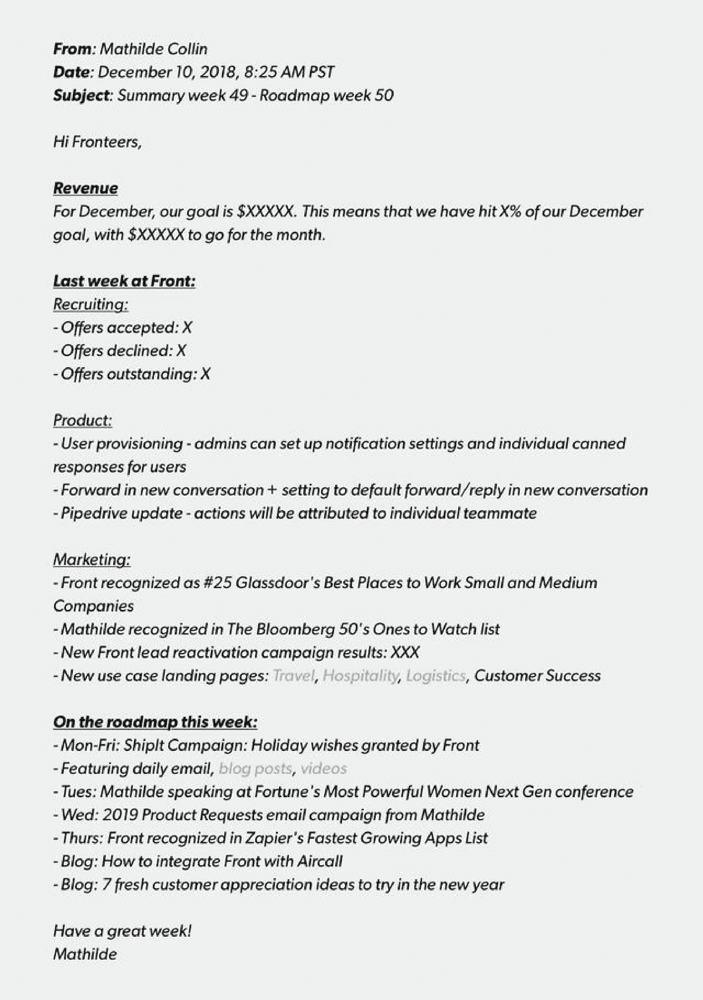

# 保持联系是你的创业公司生存的关键——以下是如何搞定内部沟通|第一轮评估

> 原文：<https://review.firstround.com/staying-connected-is-key-to-your-startups-survival-heres-how-to-nail-internal-comms>

当谈到沟通时，创始人往往专注于表面上的胜利，比如获得一个引人注目的播客节目或获得令人垂涎的封面故事。虽然[赢得外部压力](https://firstround.com/review/why-most-startups-dont-get-press/ "null")有助于[为你的品牌](https://firstround.com/review/three-moves-every-startup-founder-must-make-to-build-a-brand-that-matters/ "null")增添一层亮色，但保持引擎运转的是*内部*沟通的日常工作。

当团队步调一致时，它强化了公司和产品建设的各个方面。确保每个人都了解正在发生的事情、他们所扮演的角色以及如何确定优先级，有助于你的公司加速实现目标。这也是员工参与度的秘密:当员工感觉被收买、被告知并被倾听时，你更有可能留住你最优秀的人才。另一方面，当内部通信线路出现故障时，不稳定会威胁到整个公司。忽视寻求观点或消除误解会[煽起冲突的火焰](https://firstround.com/review/our-6-must-reads-for-cutting-through-conflict-and-tough-conversations/ "null")，[助长反叛派系](https://firstround.com/review/fighting-factions-how-startups-can-scale-without-mutiny/ "null")，[引发产品危机，](https://firstround.com/review/Crisis-Management-From-the-Man-Who-Helped-Save-eBay/ "null")以及其他常见的扼杀公司的弊病。

虽然将意图和专注投入到与员工的沟通中似乎是一项“大公司”的任务，但对于初创公司来说，拥有强大的内部沟通策略的好处(以及忽视它的危险)更加明显。虽然在一个小型创始团队之间可以很容易地沟通巨大的变化，但当一个团队扩大到 5 人、6 人或 70 人时，领导者需要更加注意确保每个人都朝着同一个方向前进，否则随着越来越多的人上船，就有翻船的风险。

那么，初创企业的领导者应该如何着手实施一项深思熟虑的内部沟通实践呢？(提示:现在是*所以*比偶尔的、草率的全体举手要多得多)。当我们从创始人、首席执行官和沟通专家的评论中筛选建议时，我们发现，在最有效的公司中，**内部沟通是一条双行道**:一方面，你需要传递自上而下的信息，非常清晰，并能引起员工的共鸣。另一方面——也许是最关键也是最常被忽视的——你可以让员工有机会从第一线给你提供有价值的反馈。

他们分享的六个实践和原则旨在帮助内部沟通双向流动。它们可以适应任何规模，无论你的公司是精简的还是有活力的，是大型的还是成熟的，甚至是跨时区分布的。从传达敏感的高管交接信息到在公关野火开始前就扑灭它们，我们希望它们能帮助[在你最重要的受众中建立信任和参与度](https://firstround.com/review/our-6-must-reads-for-creating-and-accelerating-trust-on-teams/ "null"):即已经在你团队中的受众。

虽然 Terra Carmichael 在寻找和推荐记者方面有丰富的专业知识，但她强调，创始人最好不要忽视内部沟通。"**员工真的应该是你的头号受众，尤其是在你扩大规模的时候**。这位曾在 Eventbrite担任全球公关副总裁的人说:“与他们进行真实、经常的沟通绝对至关重要。

还有一个额外的好处是，投资内部沟通实际上可以支持你的外部公关工作。“挖掘员工在公司的既得利益，帮助你更好地讲述自己的故事，”卡迈克尔说。

你的员工往往是你最严厉的批评者。他们会比任何人都更快地骂你。所以，如果你的故事没有引起他们的共鸣，它很可能不会在外面引起共鸣。

但是车间信息并不是公司应该向内看的唯一原因。这个行业充斥着关于[员工参与的重要性](https://hbr.org/resources/pdfs/comm/achievers/hbr_achievers_report_sep13.pdf "null")的研究和数据，强调津贴和福利不一定意味着你的员工参与或相信你的使命。相反，建立在责任性、真实性、明确的目标和强大的双向沟通基础上的文化才能让你的团队保持参与。

以下是卡迈克尔在内部沟通中使用的三种策略:

把它留给专业人士。“在 Eventbrite 工作了五年后，我终于雇佣了一个比我懂得更多、擅长内部和员工沟通的人，”Carmichael 说。“我们已经看到了很大的不同，特别是在领导者和中层管理者中，他们欣赏帮助整个组织进行级联沟通的努力。”

阅读所有相关信息。“我非常相信授人以渔。这就是为什么我们为 Eventbrite 的领导者推出了一封每周电子邮件，总结了他们在管理和向团队传达信息方面需要考虑的所有事情。我们把它分成几个部分:要知道的事情，要做的事情，要分享的事情，”卡迈克尔说。“这听起来很简单，但让我们现实一点，领导是一项重要而昂贵的投资，所以你要明智地利用他们的时间。向他们提供悬崖笔记和重要事项摘要等工具，不仅有助于他们成为更好的沟通者，还能在整个组织中实现及时的沟通。”

**寻找微时刻，建立联系。**除了公司范围内的接触点，在小组中创造交流机会也很重要。卡迈克尔说:“我们和首席执行官朱莉娅·哈茨开始了每周一次的咖啡休息时间，有六个人可以报名和她非正式地讨论一个特定的话题。“这不仅为员工提供了宝贵的面对面交流时间，而且对 Julia 来说也是一件好事，因为这是她与团队中更广泛的人交流的一种新方式，可以获得他们对她最关心的话题的想法。她还能够了解公司各级人员的感受，以及他们自己提出的任何担忧或问题。”

仅仅一个月开一次全体会议或市政厅会议已经不够了。员工需要感受到你和企业之间更深层次的联系。

点击这里，阅读更多关于创业公司最常犯的沟通错误以及如何避免它们。

玛蒂尔德·科林 作为创始人的角色，她的每个方面都被灌输了纪律的精神，她的内部沟通实践也不例外。自从 **[Front](https://frontapp.com/ "null")** 早期以来，这位创始人兼首席执行官每周都会发送同样的两封精心设计的电子邮件。一个是对整个公司的更新，另一个是对她直接下属的注释。

乍一看，这些邮件可能看起来像是肤浅的更新。关键的区别在于，科林以一种几乎令人恐惧的规律发送邮件。这种节奏传达了一个更加强烈的信息:通过坚持不懈地确定公司的成功指标，并明确列出她采取的行动步骤，科林树立了一个强大的问责制和指标驱动型领导的榜样，从首席执行官到公司的其他每个人。

为你的团队接触点带来规律性，确保它们不是人力资源部门的一次性举措或逐渐消失的传统——创造一些员工可以依赖的东西。

请继续阅读，深入了解她如何撰写每周电子邮件，以及为什么它们对 Front 的结果至关重要。

Mathilde Collin at Front's office

**收件人:所有用户主题:收入更新**

与大多数创业公司一样，Front 的早期特点是对收入的痴迷。“如果这些数字没有上升趋势，我们就没有借口。因此，我开始每天给团队发电子邮件，把这个指标放在前面和中心。它解释了我们昨天增加了多少收入，哪些做得好，哪些做得不好，”Collin 说。

“我很快就把它改成了每周一封电子邮件，因为这是一种更好的节奏，但从那以后，我每周都给整个公司发这封电子邮件。它总是具有相同的结构，并且在大约相同的时间发送。她说:“在过去的四年里，我一次也没有错过。

“在最初的几年里，我完全是自己写的，大概花了我一个小时，”科林说。“对于一个早期创始人来说，每周花在内部报告上的时间似乎很多，但这是至关重要的。在所有成长的痛苦中，人们确切地知道成功意味着什么，并通过“我们如何才能让这个数字上升？”的镜头来评估他们所做的一切"

**发送文件夹:**下面你会发现科林每周发送给前台团队的电子邮件的早期示例。

**已发送文件夹:**这是一个更近的、真实的(略加修改的)例子，说明了随着 Front 的扩大，Collin 的每周电子邮件模板是如何随着时间的推移而发展的。

对于科林来说，这种透明带来了力量和压力。“分享好的、坏的和丑陋的提供了责任和强制功能。她说:“如果你看到不太好的数字，你会忍不住找个借口，指出另一个亮点，或者推迟分享，直到情况有所改善。”“或者你可能会转移注意力，去做另一个项目。但你不能这样做。”

**至:直接下属主题:本周目标**

作为问责制的另一项练习，每周一上午 10 点整，科林的收件箱里会发出一封不同的电子邮件:一封写给她直接下属的便条。

“我很快就完成了本周的所有目标。这不是告诉你的报告你要做的每一件事。相反，这是一个分享你最关心的事情的机会，当然也应该是他们最关心的事情。更一般地说，了解经理们如何花费时间是有帮助的——通常这更像是一个黑箱。她说:“这也是为什么我把我的[日历公之于众](https://www.fastcompany.com/90212792/why-this-ceo-makes-everything-she-does-transparent-to-all-employees "null")和[分享了一套](https://medium.com/@collinmathilde/breaking-down-my-job-as-ceo-of-front-8d884cca172a "null")日历，解释了我作为 Front 首席执行官一整天都在做些什么。这个邮件习惯也树立了一个榜样。科林说:“如果我开始下滑，或者如果我的周数没有达到我们关注的大目标，那就传达了错误的信息。”

**已发送文件夹:**下面是 Collin 的直接下属电子邮件的一个实例。

*[在这里阅读更多关于 Front 创始人和 CEO 的创始人纪律指南。](https://firstround.com/review/the-founders-guide-to-discipline-lessons-from-fronts-mathilde-collin/ "null")*

作为**[SoundCloud](https://soundcloud.com/ "null")****[的前内部沟通负责人，David nol](https://www.linkedin.com/in/davidnoel/ "null")**被赋予了一项艰巨的任务:促进位于四个不同时区的四个办公室(柏林、伦敦、纽约和旧金山)的 300 多名员工进行无缝协作。

其结果是围绕文化和交流产生了一些突破性的想法。几年前，他分享了一种非常规的会议形式，这种形式帮助他建立了一个世界级的内部沟通项目:它被称为开放门户，它也可以成功地适用于单个时区的创业公司。

虽然全体会议对于在全公司范围内实现大项目的透明度至关重要，但诺尔开始观察到在全体会议之后出现的一种趋势:一些员工会在午餐时谈论一个只与特定员工群体相关的问题。他注意到，有很多利基或较小的主题值得关注，但不需要召开全体团队会议。

开放门户:小型的非正式会议，任何人都可以通过公司的内部信息平台宣布和安排。“SoundCloud 发生了太多的事情。诺尔说:“电子邮件和文档并不总是围绕一个动态的、激动人心的话题的最佳方式。当一家公司很小的时候，很容易非正式地获得信息，在吃饭的时候或者在走廊聊天的时候。但是随着团队的成长，这些沟通渠道可能会中断。开放参观为人们提供了一种了解他们所关心的所有事情的方式。

重要的是:开放参观的形式是灵活的。有些人直接进行问答，而有些人使用幻灯片为讨论提供背景。在开放日工作良好的材料类型的几个例子包括:

洞察和数据团队展示了关于一个有趣的用户群的发现。

设计团队热衷的早期原型或线框。

数据团队收集的近期用户调查，这些调查很有说服力或令人惊讶。

产品团队以叙述形式告知的大规模发布的进展。

开放日也被用来强调全体会议中最重要的主题。例如，每个季度的第一次全体会议专门讨论未来 3 个月的高级目标、计划和目的。随后，如果有人想更深入地研究这些话题，通常会有一个开放日。

“当我们发出邀请时，我们非常清楚每个开放日是关于什么的，”诺尔说，“这是更多地针对工程师还是营销人员？目标是什么？我们希望让每个人都能很快决定是否参加。”他指出了开放房屋已经帮助 SoundCloud 团队增加参与度的两种具体方式:

**1。在多个办公室之间建立联系。**“开放参观是人们从一个团队中了解一些他们通常不会看到的事情的一种简单方式。当我在旧金山办公室的时候，我总是在那里举办一个关于我在做什么的公开招待会。问题总是和我在柏林得到的不一样。对我来说，这是一个很好的方式，可以帮助我将这些点连接起来，并挖掘办公室里最重要的话题。它经常带来我没有考虑过但我应该考虑的想法和问题。”

总的来说，SoundCloud 的员工(尤其是高级管理人员)被高度鼓励去其他办公室，以促进面对面的交流、背景设置，并帮助更多的人将整个公司联系起来。事实上，该公司提供了一项全球交换计划，如果能为他们的发展或产出增加价值，员工可以申请在另一个办公室工作一个季度。它已经变成了一个非常受欢迎的项目，员工们称之为一项重要的额外津贴。

**2。让更多的人有一席之地。**例如，SoundCloud 最近围绕多元化和包容性制定了内部行动计划。“在制定这个计划的过程中，我们在每个办公室至少有一个开放日，让人们就我们作为一个公司应该关注的问题提供意见，”诺尔说。主持开放日的人通常是该主题或领域的常驻专家，但他们被鼓励吸引任何只想了解更多信息的人，然后他们可能被邀请提出或询问具体问题，以便每个人都能从共享的信息中受益。

开放式会议在 SoundCloud 迅速流行起来，证明了它们在保持知识流动、最新和灵活方面的价值。“每个办公室都组织了大量的开放日活动，这表明人们觉得这些活动非常有用。如果我们看到一个话题冒出来，似乎证明开放门户是合理的，往往会有一个挤满人的房间。”如果多个开放日围绕一个特定主题组织起来，诺尔的团队就会振作起来，考虑把它添加到下一个所有人的日程表中。它们不仅有利于分享信息，还能帮助公司把握住激励人们的脉搏，以及他们所关心的事情。

从诺尔的综合文章中了解更多关于 SoundCloud 如何在四个时区的四个办公室之间保持沟通的信息。

科技行业充斥着阻碍有希望的开端的沟通障碍的例子。突然，问题变得太难处理了，人们不知道发生了什么，产品也受到了影响。当约翰·米利诺维奇还是 URX[的首席执行官时，他决心通过建立一个防破碎的内部沟通策略来躲避这颗子弹。](https://www.linkedin.com/in/jmilinovich/ "null")

他的呼吁得到了回报:2016 年， [URX 被 Pinterest](https://www.wsj.com/articles/pinterest-acquires-mobile-ad-firm-urx-1462294801 "null") 收购。米利诺维奇从[加入了重复创始人](https://firstround.com/review/i-asked-100-founders-ceos-and-vcs-about-career-transitions-heres-what-i-learned/ "null")的行列，现在是 [Plato](https://www.useplato.com "null") 的首席执行官。

下面，他分享了一个他在攀登 URX 时部署的内部沟通策略，以提高透明度和接受反馈——好的，坏的，尤其是丑陋的。

这叫逆势办公时间。它的出现是因为约翰和他的联合创始人决定，他们需要一个论坛，让员工不仅与团队成员，而且为整个公司分享建设性的批评。每周五下午，整个团队会聚在一起，邀请每个人分享想法，诉说不满，提出问题，并坦率地说出他们认为事情应该以不同的方式来做。选择“反向投资者”这个词是为了引出争论和热点话题。用米利诺维奇的话来说，“它创造了一个安全的空间，在这里人们不仅可以把事情搞混，还可以明确地说出事情的真相。这也让人们不要把事情看得太重。”

从 URX 是否应该与某个特定客户合作，到股票组合和休假政策，反向操作的办公时间已经被用于解决各种问题。允许人们公开谈论他们的感受，这既有助于他们团结起来，也有助于他们接受对公司的所有权。

最好的组织是那些不仅征求建设性反馈，而且实际上用它做一些事情的组织。

“我们告诉我们的员工在门口检查他们的自我，所以作为一个公司，我们需要做同样的事情，”米利诺维奇说。协议的一部分是，URX 的领导层将接受任何抛给他们的东西，并做出有意义的回应(即使这需要额外的研究或产品变革)。

“我们希望人们知道，当他们在办公时间进入那个房间时，他们可以表达他们的感受，但没有人受到人身攻击。他说:“这一切都是为了尽可能打造最好的公司。”。“例如，我们有一个人说他们觉得休假很尴尬，因为创始团队从来不休假，我们没有明确的要求。接下来，我们询问了其他有同样想法的人，并与他们一起制定了具体的政策。这让我们有了对问题最有热情的人来提出解决方案。”

**会议时间限制在一个小时内，因此鼓励有问题或意见的人提前分享**，有答案的人受到激励，如果可以的话，可以迅速解决问题，或者离线解决更复杂的问题。

领导团队实际上提前收集了问题和话题，以便他们能够准备真实、全面的答案，并对如何利用时间做出预算。“如果我们知道我们有 10 个问题，我们会注意在 5 到 6 分钟内回答每个问题，”米利诺维奇说。

在反向操作办公时间提出的每一个问题都会被记录在 URX 的内部维基上——这是一个寻找答案、采取行动并让人们对做出改变负责的强制功能。随着事情的完成，它们的状态被更新，并最终被标记为完成。这是公司内部每个人都能看到的。无论您是谁，您都可以看到谁被分配到特定的行动项目，以及他们是否做了他们应该做的事情

逆向办公时间也在促使新员工接受 URX 反馈驱动型风格方面发挥了重要作用。新招募的员工在第一周必须参加，米利诺维奇说他知道这已经达到了预期的效果。“刚加入的人马上开始参与。令人难以置信的是，看到一个有着新鲜眼光的人走进来，并坦然地问为什么事情会是现在这个样子。当这一切开始发生时，我们知道这将成为并保持我们文化的基石。”

同样重要的是:逆势交易会以庆祝大大小小的胜利而告终。米利诺维奇很快意识到以一种积极、振奋人心的方式结束一周是多么必要。不管前一个小时有多糟糕，这给了人们一个分享个人成就、祝贺同事和认可优秀工作的机会。他表示，批评和表扬如此紧密地叠加在一起，产生了复合效应:它让透明度变得有益。

*[阅读更多关于内部沟通策略的信息，创业公司应该在内部沟通中断前使用这些策略来修复内部沟通。](https://firstround.com/review/How-Fast-Growing-Startups-Can-Fix-Internal-Communication-Before-It-Breaks/ "null")*

说到处理通信火灾，克里斯塔·柏林考特是一名经验丰富的消防员。她的简历涵盖了为微软 Windows Phone 驱动开发人员和应用程序沟通的工作，在金融科技初创公司 **[Simple](https://simplestartup.com/ "null")** 领导沟通工作，最近，她开始了作为创始人的新旅程。

根据柏林考特的经验，应对灾难的关键是在任何事情着火之前为危机管理打好基础。她分享了她在 Simple 用于培养准备文化的内部沟通实践——灵感不仅来自她的经历，还来自国家森林服务局处理现实生活中火灾的方法。

如果说运气是机遇遇上准备，危机就是困难遇上准备不足。你不能避开每一座冰山，但你可以多加几艘安全艇。

**旗早，旗勤。**

只有你能防止森林火灾。品牌也是如此。建立一种文化，在这种文化中，每个贡献者不仅被赋予权力，而且被鼓励在似乎有问题时举手。“如果闻到烟味，就说点什么。Berlincourt 说:“我们要求简单团队的每个成员标记事件，并描述它们，而不是分析它们。“例如，最好的结果是他们举手说，‘嘿，我注意到了这个客户问题’，或者‘我们似乎超出了预测的入职数量，申请需要更长的时间来处理。’我们在一个专用的空闲信道中做这件事。然后，团队的一个部分将在技术团队的支持下，根据需要对每个问题进行实地调查、分类和分类。通常情况下，烟雾在着火之前就被消除了。"

Simple 的工程师引入了美国林务局的事故分类模型。“它的国家火险等级系统简单易懂。警报以绿色开始，但任何超出绿色的颜色都是一个事件。如果护林员或公众有一点暗示，说有什么事情正在发生，它就会发出警报，即使没有立即采取行动。她说:“信息是一个敏感的触发因素，但行动是一个更为深思熟虑的因素。”。

“这种颜色警告图的妙处在于，它的基本类别是众所周知的，而且已经确立，但针对特定地区进行了改进。例如，林务局与南加州的一家当地机构合作，开发了一种额外的颜色警告，以更好地评估该地区特有的风险。同样，考虑到公司所处的阶段、行业和客户基础等因素，公司应该调整评级体系，以最大限度地适应自己的风险承受能力。对于处理银行和个人身份信息的 Simple 来说，早做标记，勤做标记。

旗早，旗常。否则，昨天一桶水浇灭的东西今天需要 100 名消防队员来修理。

感谢是唯一的答案，也是最后一句话。

大多数危机沟通系统忽略的是，像对待客户一样，小心翼翼地结束与同事的沟通。“要建立一种支持有效危机沟通系统的文化，你需要感谢每一个提出问题的人，”Berlincourt 说。“即使这是一个错误的警报或信号，带着同情去面对他们也是非常重要的，并说，‘嘿，非常感谢你标记这个，我想我们会没事的，但我们会继续关注它’，而不是‘你为什么会认为这是一个问题？’"

这一原则建立在一种文化之上，那就是宁愿回应喊狼来了的男孩的每一声呼喊，也不愿在毫无察觉的情况下被吞噬。“这是一个文化问题。如果在你所处的环境中，你甚至含蓄地要求 100%的成功，那么举手就成了高风险。在这种情况下，你会在看到火之前就感觉到火焰，因为没有人会告诉你，”克里斯塔说。“前线的人看得最多，对吧？对于消费科技公司来说，前线是由可能是业务新手的客户服务代表推动的。如果他们不愿意举手，因为官僚主义会把他们打倒，那么如果在你意识到之前就发生了事故，不要感到惊讶。”

*[在这里阅读更多柏林考特的智慧，如何从沟通危机中拯救你的创业公司。](https://firstround.com/review/how-the-u-s-forest-service-can-save-your-company-from-a-crisis/ "null")*

在某些时候，每个初创公司都必须经历重大转变，无论是涉及新的战略路线还是高管团队的变动。当萨沙·奥尔洛夫决定辞去的首席执行官一职时，他知道他必须在向公司其他人宣布之前完善内部信息传递。

“无论你是辞职还是标志着公司方向的又一次转变，都要注意你的信息传递。奥尔洛夫说:“围绕过渡应该有过多的意向性。”**任何一种过渡都必然会让人不安，因为变化是令人恐惧的。随着创始人的下台，员工和投资者有理由怀疑幕后是否有令人不安的动态或不祥的未来。**

作为 LendUp 的首席执行官和创始人，Orloff 的风险加大了。“与职业首席执行官来来去去的大型企业不同，创始人首席执行官的转变承载着更多的情感分量。最重要的是，一旦消息传出，这个故事可以在 Twitter 和其他网站上展现自己的生命。从一开始，你的内部沟通策略就是你掌控叙述的机会。

他用自己的亲身经历分享了一步一步传达自上而下重大转变的指南:

花时间计划你的首次展示。“你提前计划的时间越长，过渡就越平稳，你找到最佳替代者的可能性就越高。我先和我的联合创始人讨论了这个问题，然后提前六周和董事会以及公关主管私下计划了这个消息。我们反复讨论如何分享新闻，以正确的语气给出足够的背景。”

**给反思和反应的机会。**“我们肯定是有意选择发布时间，以便给人们留出足够的空间来思考和提问。我不想说*大家享受周五下午，顺便说一句，我将辞去首席执行官的职务！*那太可怕了；你不想让你的员工处于那种境地。所以，我们在一个星期三宣布了这个消息，我花时间进行了问答。星期四，我们在午餐时间进行了问答，我回答了人们匿名提交的问题。周五，我们一起度过了一个欢乐时光，我向大家道别，并回答了一些挥之不去的问题。”

做一个人吧。“我最初起草了一封发送给整个公司的电子邮件，但是我最终在全体人员面前看了它。或者至少试着这么做。我想我说了几个句子就开始哽咽，眼泪开始飞舞——我几乎从不表露情感。有人提醒我，“现在不是保持冷静的时候。”当你在转变的时候，[表现出你的情绪](https://firstround.com/review/these-seven-emotions-arent-deadly-theyre-your-secret-career-superpowers/ "null")和脆弱是可以的。对未来感到悲伤和兴奋是正常的。在那个周五的欢乐时光里，我确保自己穿着 LendUp 衬衫，以表明我将作为董事会成员参与其中，并且仍然非常关心公司。"

阅读更多奥尔洛夫关于职业转变的智慧——在 100 次咖啡聊天中积累的。