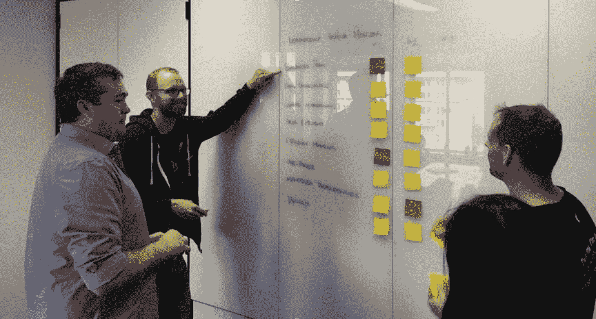
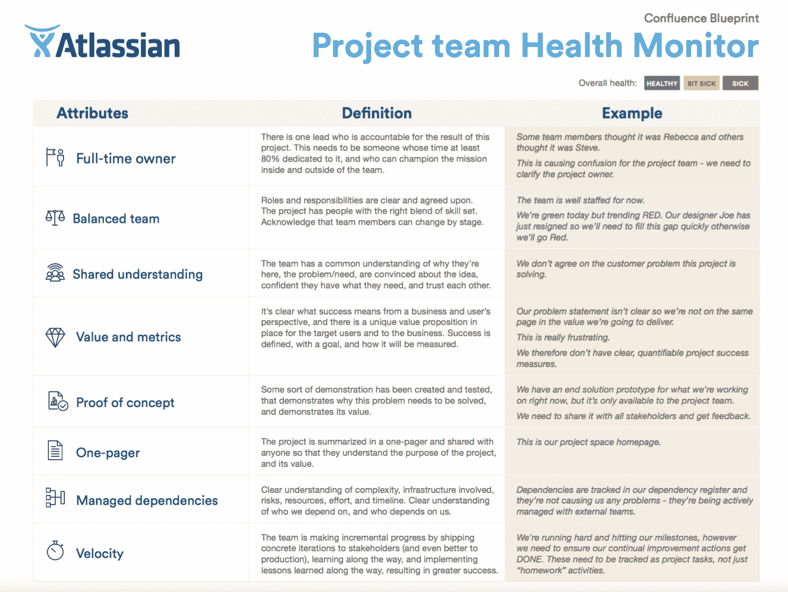

# 团队健康监控和为什么你的创业需要检查|第一轮审查

> 原文：<https://review.firstround.com/team-health-monitors-and-why-your-startup-needs-a-check-up>

在体育界，球衣背面的名字比正面的名字更能吸引眼球。是勒布朗詹姆斯，不是骑士，或者是 J.J .瓦特，不是德州人。这些明星被放在基座上，预示着他们难以置信的技能和成就。尽管如此，企业软件公司 **[Atlassian](https://www.atlassian.com/ "null")** 总裁杰伊·西蒙斯 认为，他们有一个共同的成功关键:他们属于伟大的团队。西蒙斯认为，当涉及到体育和商业时，团队的力量才是最重要的。团队是组织成功的真正原因——而不仅仅是少数杰出个人的超级明星力量。西蒙斯并不是唯一有这种想法的人。包括耐克和维珍在内的 400 多家组织邀请西蒙斯和他的团队教授 Atlassian 评估、监控和改善团队健康的方法。Atlassian 已经开放了其团队剧本，其中包括团队特定的健康评估以及解决共同痛点的策略，如领导力不足或冲突的优先事项。西蒙斯和他的同事们对这个话题如此热情，以至于该公司的纳斯达克股票代码是 TEAM。在加入 Atlassian 之前，Simons 是软件制造商 BEA Systems 的营销副总裁，该公司已被甲骨文收购。

根据他在第一轮 CEO 峰会上的讲话，Simons 概述了成功团队的八个特征，这些特征是在研究了跨部门的数百个 Atlassian 团队后确定的。他列出了六个步骤，可以帮助任何类型、任何规模的团队了解他们可能需要改进的地方。最后，Simons 分享了 Atlassian 团队在健康监控器的帮助下评估其绩效后如何调整其流程的例子。

# 你如何衡量绩效是不够的

在 Atlassian 的早期，Simons 和他的同事定期评估个人表现，就像大多数公司一样。这些绩效评估将有助于确定总体员工中表现不佳的大约 5%。他们研究了这个群体，注意到在绝大多数情况下，他们是由以前表现优秀的人组成的，他们的表现低于平均水平。这时，他们发现了一个不幸的趋势:明星个人——那些在连续绩效评估中被评为高的人——被转移到苦苦挣扎的团队，然后自己变成了表现不佳者。西蒙斯和其他经理开始询问他们如何确定丢失和损坏了什么。这时他们意识到团队健康对于任何成长中的组织都是至关重要的。

Atlassian 在该公司发生了几起因团队合作不力而引发的痛苦事件后，开始专注于这个问题。该公司在五大洲开展业务，拥有 1600 多名员工。西蒙斯和他的团队观察了成功的团队和项目——那些已经成为公司传说、被微笑着提及或产生了自己的 t 恤的团队和项目——并将它们与糟糕的项目进行了对比——那些被小声或沉默提及的项目。定性数据给了 Atlassian 足够的假设来快速确定和测试属性，而不是陷入复杂的初始方法中。比较和对比成功和失败团队的情绪有助于推动这个过程。

考察这两类团队的最终目标是，找出是什么让成功的团队变得伟大，并找出表现不佳的团队的不足，尤其是那些摇滚明星表现不佳的团队。在他们的工作过程中，西蒙斯和他的同事们确定了成功团队的八个要素——也就是说，持续胜过他人的团队的关键属性和工具特征——并在 40 个团队中进行了测试。该标准是为工程和营销等职能团队制定的；公司还为[领导团队](https://www.atlassian.com/team-playbook/health-monitor/leadership-teams "null")和[服务团队](https://www.atlassian.com/team-playbook/health-monitor/service-teams "null")创建了健康监测器。

# 健康团队的八大要素

**概念证明。**事实上，这不仅仅是一个概念证明，更是一个继续努力的理由和清晰的道路。至关重要的是，人们不仅要理解为什么一个项目存在，还要理解为什么他们必须以一种特殊的方式来完成它。“我们发现成功的产品团队有某种端到端的走查，证明为什么问题需要解决，最佳前进路径以及为什么它会工作，”Simons 说。“团队通常对项目的最终目标达成一致，但每个人可能有不同的实现方式。我们有一个工程团队创建了一个文档，展示了解决问题的三种方法，并展示了为什么一种方法最有意义。”

一页纸。成功的团队都有一份[自述](https://en.wikipedia.org/wiki/README "null")，解释他们试图做什么以及他们如何衡量成功。它的设计和总结使得任何同事——无论是项目中的还是项目外的——都可以快速上手。“它简单地描述了项目的元素和参数，以一种团队成员可以消化的方式，并且它可以用于其他人，”Simons 说。例如，一份有用的单页报告至少包含以下内容:一份阐明团队使命的章程，以及一份团队正在实现的目标的列表，以便其他人能够快速理解成功的步骤

**速度。**速度定义为向前的动量。在初创企业的背景下，这是推动始终是航运。“成功的团队有两个速度的关键组成部分:一个跟踪和与公司分享进展的方法，以及一个以增量方式向利益相关者交付具体工作的时间表，”Simons 说。“成功的团队将他们的工作分成可管理的两周冲刺阶段，之后他们交付工作，反思自己的表现，并与组织分享结果。”

**全职车主。成功的团队可以确定一个单独的人或领导来负责项目的每个组成部分。“在你所在的团队中，有多少次感觉每个人都需要进来做决定？西蒙斯说:“拥有项目某个方面的全职所有者是一种失败。“这一特征往往是关键，并与其他七种属性的健康相关。我们在团队中发现的个人责任感越强，团队在其他成功特质上的表现就越好。”**

询问团队谁负责项目的各个部分。不成功的团队也要说说。成功的团队可以指向业主。

**价值和指标。团队成员需要理解并同意成功的衡量标准。“成功的团队知道他们试图传递的价值；衡量标准是他们知道自己成功的方式。有没有这样的经历:在一次会议上，所有人都达成了一致，但在会议结束后，大家的方向却略有不同？”西蒙斯问道。“有一次，我们有一个团队准备取消某个功能，但是他们被卡住了。我们发现项目经理和工程负责人在该项目的价值和衡量标准上存在分歧。工程主管希望为一类客户节省时间，而项目经理则希望提高多类用户的使用率。一旦我们认识到并解决了这种偏差，团队就可以发货了。”**

**共同理解。**西蒙斯发现，顶级团队相互信任，并完全认同他们的集体目标。“成功的团队对他们所做的事情的原因有着共同的信念。仅仅理解什么或如何是不够的。西蒙斯说:“他们需要确信他们的项目为什么重要。“我们有一个团队，它的领导者推动快速决策，却不解释他的理由。人们不清楚他们的责任，相反，他们只是跑来跑去扑灭由他引起的火灾。该团队努力达成共识，实施了单页和端到端的概念证明文档。印象深刻的是，这位领导承诺了一条新规则:他做出的每一个决定都要有一个简短的三行解释。几周之内，他们的团队合作显著提高。”

**平衡的团队。**成功的团队还拥有各种各样的技能、才能、工作经验和解决问题的风格，这些对他们正在从事的项目都有意义。“所有这些属性的组合并不能保证成功，就像一个同质的团队不能保证一样。西蒙斯说:“前者如果随意进行，会让人感觉像是一种税收，而后者会导致集体思维。“关键是有一个有共同理解的团队，全职老板*，还有来自不同专业和个人背景的人*。在同样的规则下，他们的不同导致了不同的和更有创造性的思想。这是伟大的事情发生的时候。”

**托管属地。**明星团队还管理他们对其他个人、团队和项目的依赖。“有时候，一个项目的停滞是由于你无法控制的情况。成功的团队记录了这些依赖性，并理解了相关的风险。西蒙斯说:“他们制定了清晰的计划，并通过这些计划进行检查。“我们观察到，最好的团队都有管理他们最重要的两到三个依赖项的计划。他们在手机上互相联系——而不仅仅是在有什么东西即将来袭的时候。表现不佳的团队知道他们处在一个复杂的环境中，但他们会努力工作，并希望有最好的结果。团队必须承认外部性会影响他们的工作，并计划减轻它们。

Jay Simons at the First Round CEO Summit.

# 评估团队健康的六个步骤

经过研究，西蒙斯和他的团队缩小了团队的成功特质。他们决心让他们工作。“在一个项目或一个新团队成立之初，我们希望能够使用这个框架来帮助推动一个团队朝着正确的方向前进。我们创建了一个团队健康监测器，以帮助他们更好地理解成功团队的一些要素。这也是一种诊断弱点的工具，”西蒙斯说。“这不是绩效评估，它主要反映你过去的所作所为，迫使人们提高警惕。我们希望放下盾牌，让团队守在门口——这两者往往会在关键的审查中表现活跃。”

在 Atlassian，团队健康监控会议提高了团队士气:人们报告说他们更快乐、更有效率。团队更有可能达成目标。也许对健康监测器最有说服力的认可是它们的使用增加了——它们不是团队的要求，但它们是他们自己自愿使用的。

# 搭建舞台

以下是团队健康监视器的工作方式，包括您需要什么和谁。让我们从基本规则开始:

**随意启动健康监测器。任何队友都可以触发团队健康监控器。**

**创建** **[双披萨团队](http://blog.jasoncrawford.org/two-pizza-teams "null")** **。”**正如杰夫·贝索斯所创造的，这是 6-10 人一组的团队，基本上是两个披萨就能喂饱的团队。

**定期做健康监测。这个因人而异，但关键是要形成一种节奏。在 Atlassian，一个团队每天早上进行五分钟的回顾，而更稳定的团队每两到四周进行一次。“不要经常运行它，因为你不能对发现采取行动而感到沮丧，但也不要太频繁，以至于你发现你可以避免的事情，”西蒙斯说。**

每个健康监视器需要一个小时。会议是这样进行的:

20 分钟用于设置和基本规则

20 分钟时间讨论评估

20 分钟思考结果并就补救达成一致

每个健康监视器都需要以下工具和参与者:

便利贴(红色、黄色和绿色)

白色书写板

列出明星团队的八种工具和特征的表格

6-10 名参与者

领导会议的团队主持人。

A team health monitor in action.

辅导员是任何健康监测的关键职能。在 Atlassian，公司研发主管多米尼克·普莱斯(Dominic Price)是他们的主要推动者。西蒙斯说:“当我们很早就推广团队健康检查的概念时，我们给多姆穿上医生服，到处张贴有趣的小传单，只是为了让人们好奇这是什么，只是为了让它轻松有趣。”“Dom 为会议定下了基调:我们不试图认同个人或个人面临的挑战。这意味着这是一次建设性的、公开的对话，只是关于事情是如何运作的。这里没有评判。主要是试图让团队照照镜子，弄清楚他们在哪里，他们站在哪里。”

主持人为会议定下基调，并给出基本的参与规则:

答案没有对错之分。

每个人的意见都是平等的。

听着。仔细听。

不要妥协，或者说一切都好，继续前进。

这不是关于领导者或个人，而是关于更好合作的建设性和开放的对话。

不到最后不要一头扎进解决问题。

# 评估生命体征

布置好房间并制定好基本规则后，将 6-10 人的团队分成两到三个小组。“我们将最初的团队分成更小的团队的原因是为了在每个人都能发表意见的环境中平衡观点的多样性。西蒙斯说:“然后，各小组再次开会，试图就现状达成一致。

这些小组应该通过在每个特质旁边贴上红色、黄色或绿色的便利贴来决定团队对成功团队的八个属性的评价。红色代表不好，黄色代表一般，绿色代表好。对于每个等级，小组写下一个——且只有一个——引导他们选择该颜色的要点或观察。**抵制在现阶段解决问题的诱惑**——相反，现在只需专注于观察，并在董事会上获得小团队的原始评级。

“这可能就像是说，由于与您共享管理依赖关系的另一个团队，您遇到了阻碍，也可能是因为您觉得您的团队在统一价值观方面很糟糕，因为每个人似乎总是重视不同的东西，可能一组人重视速度，而另一组人重视质量。这自然会产生摩擦，”西蒙斯说。“但关键是要把每一个评价归结为一个要点，这样你就可以用一句话准确地指出你为什么会有这种感觉。说明每个人的观点都是可以接受的，让人们在发言前给出他们的评级。它给了每个人平等的地位，让内向的人参与进来，增加了坦诚交谈的机会。”

The framework for a team health monitor.

# 讨论评级

然后，你的主持人——在 Atlassian 的例子中是 Dom——会帮助整个团队就他们的评级达成共识。较小的团队回到一起，作为一个整体进行讨论。每个小组讨论为什么他们给一个属性的颜色打分。Dom 提问寻找共性。作为一名辅导员，他的目标是在 6-10 人的整个团队中对每个属性进行单一评级。“这里的规则是，如果有不一致或意见分歧，我们总是降级。我们试图寻找共识或一致的声音，而不是只有一个强有力的声音。在有分歧的地方，我们总是降级为黄色或红色，并说我们可以努力让大家达成一致。”

此时，你可能在黑板上有很多红色和黄色的便利贴。不要惊慌。“记住，这里没有判断。这是我们团队将共同完成的一系列常规检查点中的第一个。你可以每季度或每隔一个月甚至每月做一次。西蒙斯说:“这只是一个你可以用来改进的标准。“这部分流程的关键是不断问‘为什么’和‘如何’的问题——为什么这个团队会有这样的感觉？事情怎么会变成这样？继续深入，更加具体。最终你会找到问题的根源，并能够将其归结为一个明确的问题。”

# 就重点领域达成一致

现在是时候花大约 20 分钟挑选两三个标有红色或黄色的东西来做了。你的辅导员应该提出不同的方法，让团队朝着积极的方向发展。将对话引向可操作、具体和可衡量的项目，并为这些项目创建明确的截止日期和任务。

“现在我们有了一条底线。我们选择了两件事，我们将在一段时间内继续努力。这已经足够好了。西蒙斯说:“我们可以从那里继续前进。"一旦你同意了这些重点领域，你就可以进入下一步:寻找补救措施."

# 寻找补救措施

健康检查的作用是突出团队可以努力的领域，以及他们应该如何计划去实现它。现在是时候深入研究并获得解决这些问题的更具体的补救措施了。“在许多情况下，我们已经有了帮助团队走向绿色的框架:一个决策框架，一页自述文件的模板或项目指南和概念或指标证明的清单，”Simons 说。“它们没有被使用，因为人们没有意识到这种需求。这就是健康检查所做的——它突出了一个缺陷或痛点，并为团队指明了通常已经到位的解决方案。它非常强大。”

在一个场景中，一个团队对他们的**速度不满意。**他们没有明确的使命，也没有在截止日期前交付。“在这种情况下，他们的解决办法是抱怨资源或团队人数，这很常见。他们说他们需要更多的帮助。如果他们在团队中增加更多的人，他们可以提高速度。当我们运行我们的健康监视器时，它显示了团队中缺乏激情。西蒙斯说:“在这种环境中增加更多的人实际上使问题更加复杂。“团队增加的人越多，他们似乎变得越慢。认识到这一点后，他们不再只是向团队中添加人员，而是专注于改善现有团队的合作基础。”

在另一个案例中，Simons 监督了一个执行健康监视器的营销团队。很快就清楚了，完全缺乏**的共同理解。“场外走过场变成了一场非常真实、富有成效、围绕团队成员之间信任的具体讨论。西蒙斯说:“他们为每个人留出一对一的时间，比如每两周喝一次咖啡，以建立更多的信任和理解。“现在，健康监测是该团队每周例会的一个重复部分，这是他们为之腾出空间并不断强化的内容。这一切都是从那个红色的便利贴开始的。”**

# 安排一次体检

一旦你对问题领域和需要做的事情达成共识，一个月或一个季度后再回到健康监视器。“你需要能够跟踪你把那些红色和黄色变成绿色的过程。如果你没有在你挑选的两个焦点区域上移动指针，那么是时候再次坐下来，谈谈哪里出了问题。西蒙斯说:“你甚至可以在另一次会议中，用同样的基本规则来鼓励开放和解决问题。“团队健康监控的全部意义在于创造改进。知道自己是否在做这件事的唯一方法就是定期检查事情进展如何。”

An example of team health monitor scores over time.

“我来分享一个成功的故事:我们有一个聪明但相对缺乏经验的临时工程领导，他认为他的团队缺乏紧迫感。没有人站出来打电话，所以人们一遍又一遍地重温决策，没有任何前进。他运行了一个团队健康监视器，显示他们在共同理解上是红色的。西蒙斯说:“他立即制定了一个[亚特兰蒂斯式的练习](https://www.atlassian.com/team-playbook/plays/daci "null")，强迫团队成员委派谁对某些决策负责。“几乎立刻，团队终于明白了谁扮演什么角色，谁在什么时间做决策。不确定性减少，信任增加。我们看到他开始从一个缺乏经验的领导者转变为团队转型的关键人物。他的晋升速度快于平均水平，更重要的是，他所在团队的发展势头明显增强。”

就像一次体检一样，团队健康监测本来就是预防性的。我们在这里发放维生素，不是止痛药。

# 将健康监测器投入使用

当涉及到监控您的组织的健康状况时，团队应该优先考虑，而不是个人绩效评估，这可能会被过分强调和过度利用。记住成功团队的八个特征:个人责任、多样性、共同的信念、一致的价值观和衡量标准、概念证明、自述文件、可管理的依赖性和速度。创建一个团队健康监控会议，并让小组根据每个特征对他们的团队进行评估。从那里，选择最多三个问题来解决。通过查看现有框架或使用数据来理解为什么以前的方法失败了，从而解决出现的问题。

“超级巨星赢得比赛，但球队赢得冠军。做生意也是如此。很多时候，我们把失败归咎于管理不善或运气不好，而真正的问题是团队合作不好。团队合作真的真的很难。很乱。重要的是不要把这些失败归咎于任何一个人。相反，通过定期整合这些团队体检和相关检查来挖掘问题的实质，”西蒙斯说。“我们发现，通过这样做，从长远来看，你最终会节省大量时间，并减少令人头疼的问题。现在，很多管理焦点都集中在个人和个人表现上。通过将精力转移到改善和加强团队上，你会看到指数级的改善。”