# 2020 年给创业者的 30 条最佳建议|第一轮回顾

> 原文：<https://review.firstround.com/the-30-best-pieces-of-advice-for-entrepreneurs-in-2020>

在回顾中，我们有一个每年一月都期待的传统。我们按下暂停键，给自己倒上一大杯咖啡，仔细阅读前一年发表的每篇文章，着眼于一年后我们仍在思考的最佳建议。

自 2013 年《评论》创刊以来，我们已经采访了数百名在他们的工作中名列前茅的人，2020 年也不例外。我们珍惜这个机会，仔细分析评论数字页面上的专家建议——从[重复成功创始人](https://firstround.com/review/this-founder-built-startups-in-2008-2016-and-2018-heres-what-hes-learned-about-resiliency/ "https://firstround.com/review/this-founder-built-startups-in-2008-2016-and-2018-heres-what-hes-learned-about-resiliency/")，到[活动大师](https://firstround.com/review/dont-just-throw-together-a-webinar-the-virtual-events-crash-course-you-need/ "https://firstround.com/review/dont-just-throw-together-a-webinar-the-virtual-events-crash-course-you-need/")，到[顶级心理学家](https://firstround.com/review/hit-the-emotional-gym-the-founders-framework-for-emotional-fitness/ "https://firstround.com/review/hit-the-emotional-gym-the-founders-framework-for-emotional-fitness/")。(如果你很好奇这个系列是如何随着时间的推移而演变的，请查看从 [2019](https://firstround.com/review/the-30-best-pieces-of-advice-for-entrepreneurs-in-2019/ "https://firstround.com/review/the-30-best-pieces-of-advice-for-entrepreneurs-in-2019/") 、 [2018](https://firstround.com/review/the-30-best-pieces-of-advice-for-entrepreneurs-in-2018/ "https://firstround.com/review/the-30-best-pieces-of-advice-for-entrepreneurs-in-2018/") 、 [2017](https://firstround.com/review/the-30-best-pieces-of-advice-for-entrepreneurs-in-2017/ "https://firstround.com/review/the-30-best-pieces-of-advice-for-entrepreneurs-in-2017/") 、 [2016](https://firstround.com/review/the-30-best-pieces-of-advice-for-entrepreneurs-in-2016/ "https://firstround.com/review/the-30-best-pieces-of-advice-for-entrepreneurs-in-2016/") 、 [2015](https://firstround.com/review/the-30-best-pieces-of-advice-for-entrepreneurs-in-2015/ "https://firstround.com/review/the-30-best-pieces-of-advice-for-entrepreneurs-in-2015/") 、 [2014](https://firstround.com/review/The-30-Best-Pieces-of-Advice-for-Entrepreneurs-in-2014/ "https://firstround.com/review/The-30-Best-Pieces-of-Advice-for-Entrepreneurs-in-2014/") 和 [2013](https://firstround.com/review/30-Best-Pieces/ "https://firstround.com/review/30-Best-Pieces/") 的之前版本。)

当我们翻阅我们在 2020 年发表的文章时，有几个主题引起了我们的注意。没有对“这些前所未有的时代”的认可，2020 年的回顾是不完整的(我们已经放弃了在词库中寻找任何语言来代替这种死记硬背的措辞)。尽管自 2013 年以来，内容发生了旋风般的变化和爆炸——从 Substack 简讯的兴起，到充满企业家建议的无尽 Twitter 帖子——我们的目标多年来一直保持不变。我们寻求的不是追逐趋势或解决特定的行业垂直问题，而是发布持久的、常青的公司建设建议，这些建议既能脱颖而出，又能立即投入使用。

但在过去的一年里，人们迫切需要报道一些意想不到的、及时的话题，而这些话题是人们迫切需要指导的。随着我们的编辑计划被打乱，我们迅速改变了策略。更重要的是，创始人、领导者和专家挺身而出，慷慨地打开他们的剧本，提供切合时宜的智慧，从驾驭[闪电般的转变到虚拟工作](https://firstround.com/review/struggling-to-thrive-as-a-large-team-working-remotely-this-exec-has-the-field-guide-you-need/ "https://firstround.com/review/struggling-to-thrive-as-a-large-team-working-remotely-this-exec-has-the-field-guide-you-need/")，[在混乱中管理](https://firstround.com/review/weathering-the-emotional-storms-of-a-crisis-a-tactical-guide-for-individual-contributors-and-managers/ "https://firstround.com/review/weathering-the-emotional-storms-of-a-crisis-a-tactical-guide-for-individual-contributors-and-managers/")，以及[当你感觉自己筋疲力尽时调整你的领导心态](https://firstround.com/review/when-grin-and-bear-it-isnt-the-right-answer-this-behavioral-scientist-shares-what-to-do-instead/ "https://firstround.com/review/when-grin-and-bear-it-isnt-the-right-answer-this-behavioral-scientist-shares-what-to-do-instead/")。你可能已经在互联网上看到了很多关于这些特定主题的文章，但正如我们一直以来的目标，我们希望这篇评论能提供一些不同的东西。

2020 年也使集中智慧和依靠社区的力量成为焦点。没有一个人能回答所有的问题，汇集大量不同的观点是有力量的——有些你可能同意，有些你可能不太同意。今年，我们比以往任何时候都更好地利用了这种冲动，无论是呼吁[一系列衰退时期的投资者和首席执行官](https://firstround.com/review/the-founders-field-guide-for-navigating-this-crisis-advice-from-recession-era-leaders-investors-and-ceos-currently-at-the-helm/ "https://firstround.com/review/the-founders-field-guide-for-navigating-this-crisis-advice-from-recession-era-leaders-investors-and-ceos-currently-at-the-helm/")在危机早期发挥他们来之不易的智慧，借鉴[十几位设计领袖](https://firstround.com/review/the-ultimate-guide-to-the-founding-designer-role/ "https://firstround.com/review/the-ultimate-guide-to-the-founding-designer-role/")的经验，还是众包关于[管理](https://firstround.com/review/a-tactical-guide-to-managing-up-30-tips-from-the-smartest-people-we-know/ "https://firstround.com/review/a-tactical-guide-to-managing-up-30-tips-from-the-smartest-people-we-know/")和[候选人必问的面试问题](https://firstround.com/review/the-40-best-questions-to-ask-in-an-interview-how-to-go-deeper-than-whats-the-culture-like/ "https://firstround.com/review/the-40-best-questions-to-ask-in-an-interview-how-to-go-deeper-than-whats-the-culture-like/")。

我们甚至将自己推出了一个全新的播客，名为 [In Depth](https://review.firstround.com/podcast "https://review.firstround.com/podcast") ，在这个播客中，我们将我们在评论中培养的标志性采访风格直接传递到你的耳机中。

我们可能不知道 2021 年将会发生什么，但当我们反思过去的一年和未来的一年时，我们真诚地希望您继续找到一剂灵感，一个可行的新策略，或者一个令人信服的故事，每当您将注意力转向评论时。我们知道你花在钻研一篇文章或戴耳机上的时间比以往任何时候都更宝贵，我们继续真诚地感谢你们所有人与我们共度的时光。以下是我们去年文章中的 30 条最佳建议——在我们展望更光明的未来时，把它们带在身边。

说到面试建议，招聘经理有很多可以参考的。但是对于候选人来说，当局面不可避免地逆转，面试官问:“你有什么问题要问我吗？”重要的是不仅要从人群中脱颖而出，还要挖掘出一些有价值的信息，来判断这家未来的公司是否合适。

这就是为什么我们发表了我们最受欢迎的评论文章之一[的后续文章，从我们能找到的一些最敏锐的人那里寻找候选人应该问的](https://firstround.com/review/40-favorite-interview-questions-from-some-of-the-sharpest-folks-we-know/ "https://firstround.com/review/40-favorite-interview-questions-from-some-of-the-sharpest-folks-we-know/")[问题的想法](https://firstround.com/review/the-40-best-questions-to-ask-in-an-interview-how-to-go-deeper-than-whats-the-culture-like/ "https://firstround.com/review/the-40-best-questions-to-ask-in-an-interview-how-to-go-deeper-than-whats-the-culture-like/")。我们的目标？一系列比“文化是什么样的？”更深入的问题

下面我们将重点介绍几个我们最喜欢的。我们的建议？把重点放在你的交易破坏者上，缩小你必须问招聘小组的问题清单——什么会让你离开？

**你赢得的前三名客户是什么，你失去的前三名客户是什么？****[Max Branzburg](https://www.linkedin.com/in/mbranzburg/ "https://www.linkedin.com/in/mbranzburg/")****[比特币基地](https://www.coinbase.com/ "https://www.coinbase.com/")** 的产品副总裁说:“你会对公司在市场上的表现有一个真实的感觉。

**有哪些事情只会在这里发生，而不会在其他组织发生？“工作场所的文化——一个组织的价值观、规范和实践——对我们的幸福和成功有着巨大的影响，”亚当·格兰特** 说。

鉴于其所处的阶段，你认为这家公司在业务的哪个领域落后了？**[概念](https://www.notion.so/ "https://www.notion.so/")** 平台和合作伙伴负责人 **[克里斯蒂娜·科尔多瓦](https://www.linkedin.com/in/cristinajcordova/ "https://www.linkedin.com/in/cristinajcordova/")** 说:“这个问题通常可以突出尚未建立的职能，以及你必须填写的跨职能领域，这可能会让你感到惊讶。

**你能告诉我你的创始团队的背景以及你为什么要解决这个特殊的问题吗？“更多的求职者应该像投资者一样思考。毕竟，加入一家公司是一个人可以进行的最大投资之一，”产品搜寻公司的创始人瑞安·胡佛说。**

你的团队会如何形容你？“你的管理风格是什么？”是一个太常见的问题，更可能引出老生常谈，而不是智慧的金块。“从报告的角度出发，促使经理超越他们的意图，转而考虑他们与团队的实际工作关系，”Zainab Ghadiyali(Airbnb 和脸书的校友)说。

我能看看你这星期的日历吗？“我相信日历里有真理。如果有人在面试中告诉你，他们真的关心员工的学习、发展和指导，他们的日历应该反映出这一点。

新贵的首席执行官 **[戴夫·吉鲁阿德](https://www.linkedin.com/in/davegirouard/ "https://www.linkedin.com/in/davegirouard/")** 之前写了该评论最受欢迎的一条命令，“ **[速度是一种习惯](https://firstround.com/review/speed-as-a-habit/ "https://firstround.com/review/speed-as-a-habit/")** ，”在过去的一年里，他回到了我们的数字页面，为你的创始人工具箱中一个未得到充分利用的机制:有效写作提供了光亮。

言事。至少，它们塑造了你给别人的印象——通常是第一印象。

他有很多改善你写作的策略，包括一个特别简单的——删除所有不必要的单词。“文字为你的读者稀缺的注意力而战。因此，每一个不必要的单词都会分散重要单词的注意力。作为第一步，考虑一下这些关于充满冲击力的信息的提示:

非常，相当，很少，确实，有点，真的，有点。头脑中这些无营养的卡路里要么缓冲你脆弱的信念，要么假装量化你未能量化的东西。

**一般来说，如果你不能确定一个单词是什么词性，最好不要使用它。**

你可以省去“我认为”——你的读者会感激你在打字前必然想到这个宝石。

A sample slide from Dave Girouard's presentation on writing to the Upstart team.

新贵团队成立于 2012 年，由三名几乎互不相识的联合创始人组成，被迫在早期做出拯救公司的转变，过去 8 年基本上在硅谷的雷达下飞行——但在 2020 年底，这家曾经斗志昂扬的初创公司实现了令人垂涎的 IPO 里程碑。对于我们今年的最后一个故事，我们很幸运地邀请到了首席执行官兼联合创始人**戴夫·吉鲁阿德**再次来到我们的虚拟审查办公室——这一次是为了勾勒 Upstart 如何建立的故事，详细描述上市过程中的坎坷起步、幸运转折和教训。我们涵盖了一切，从创始理念和快速支点，到他为什么“不擅长筹款”，以及他是如何建立自己的高管团队的。然而，一个突出的地方是 Girouard 对管理和提升领导地位的思考。

Upstart co-founders Paul Gu, Anna Counselman, and Dave Girouard

创办新贵公司时，Girouard 从谷歌的高管一跃成为创始人兼首席执行官。多年来，他开始依靠一系列内部练习来推动自己的思维，并成长为一名领导者。“有时候，你只需要在头脑中建立一些心理模型，就能像 CEO 一样管理自己的心理，”他说。

以下是他的一个诀窍:“我投资的一个心理练习是**思考如果明天我的董事会聚在一起解雇我**会发生什么，”Girouard 说。“如果他们说，‘戴夫，谢谢你的参与。你完了。我们正在为 Upstart 招聘一名新的首席执行官。他们出去找了世界上最好的 CEO，一个只会让我看起来像个傻瓜的人。如果他们把她带进来，让她从 Upstart 开始——她会做什么与我不同的事情？我想了一会儿，然后告诉自己，'【T6]你为什么不去做那些事情呢？“这只是我玩的一个奇怪的游戏，让我自己认识到，当我做一些事情的时候，我可能会被哄骗到一个自我感觉良好的地方，而我可能在其他事情上做得不是很好。"

我认为每一个有思想的领导者都可以先尽力管理好自己。如果你真的试着发挥自己最好的一面，你会意识到任何情况下都有另一种方法。

**[莱尼·拉奇斯基](https://twitter.com/lennysan "https://twitter.com/lennysan")** 应该是熟悉的面孔。除了撰写令人难以置信的[时事通讯](https://www.lennyrachitsky.com/ "https://www.lennyrachitsky.com/")，这位 Airbnb 前产品主管和消费者供应增长主管近年来还在[绩效评估](https://firstround.com/review/the-power-of-performance-reviews-use-this-system-to-become-a-better-manager/ "https://firstround.com/review/the-power-of-performance-reviews-use-this-system-to-become-a-better-manager/")和[年度规划](https://firstround.com/review/the-secret-to-a-great-planning-process-lessons-from-airbnb-and-eventbrite/ "https://firstround.com/review/the-secret-to-a-great-planning-process-lessons-from-airbnb-and-eventbrite/")中贡献了智慧。今年，他与 Dan Hockenmaier(增长战略公司 Basis One 的创始人，图钉公司的前增长营销总监)合作，为消费者创始人制定了一个非常详细的增长框架。

他们的建议一言以蔽之？这不仅仅是“增加一些搜索引擎优化”或“让你的产品更具病毒式传播”那么简单事实上，获得可扩展的新客户的途径非常少，初创公司经常一次尝试太多的渠道，因此，对任何一个渠道的投资都不够。相反，关注这些增长通道中的一个:**内容、病毒式传播或绩效营销**。Hockenmaier 和 Rachitsky 建议遵循以下三个步骤:验证、提交和衡量。

下面这个他们框架的可视化表示派上了用场——正如他们关于图钉、Airbnb 和 Booking.com 在早期如何利用这些渠道获得客户的案例研究一样。

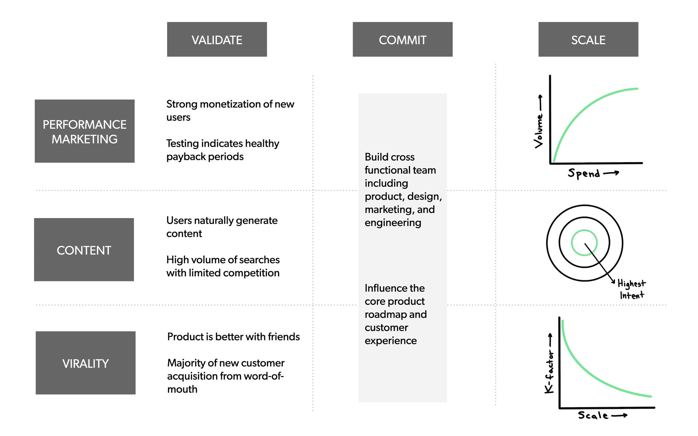

“一般来说，高绩效团队由能够独立实现目标的人组成。试图用人类创造机器人只是浪费了大量的能量，” **[莫莉·格拉汉姆](https://www.linkedin.com/in/mograham/ "https://www.linkedin.com/in/mograham/")** (因“[放弃你的乐高](https://firstround.com/review/give-away-your-legos-and-other-commandments-for-scaling-startups/ "https://firstround.com/review/give-away-your-legos-and-other-commandments-for-scaling-startups/")”和“[与啃你腿的怪物交朋友](https://firstround.com/review/make-friends-with-the-monster-chewing-on-your-leg-and-other-tips-for-surviving-startups/ "https://firstround.com/review/make-friends-with-the-monster-chewing-on-your-leg-and-other-tips-for-surviving-startups/")”而出名)。

Molly Graham, COO of Lambda School

撇开智能机器的类比不谈，Lambda School的首席运营官通常是这样看待这种动态在组织中的表现的:“你经常会看到人们试图按照他们本来会怎么做来指导他们的团队。我看到很多经理真的陷入了字面上的过程中，有人为了实现一个目标正在经历。但最终，只有一件事是重要的:他们实现目标了吗？”她说。

“为了摆脱这种心态，我鼓励人们关注‘这个人负责什么？’而不是，“他们是怎么做到的？”作为公司领导，你可以就“如何做”给出反馈，特别是如果这对周围的人有潜在的破坏性，或者在消耗太多资源方面有问题。但目标和期望必须围绕“是什么”来设定，”格雷厄姆说。

最好的管理者把期望设定在“什么”的层面，而不是“如何”的层面。

你是否发现你的团队在你刚开始的时候无法就产品最重要的部分达成一致？或者你很努力地想把一些东西推向市场，但是你没有得到用户的支持？作为脸书新产品实验团队 的产品负责人， **[Sunita Mohanty](https://www.linkedin.com/in/sunita-mohanty/ "https://www.linkedin.com/in/sunita-mohanty/")** 的创业顾问和天使投资人，她目睹了许多创始人、早期团队甚至后期产品组织一次又一次地遇到这些问题。“直觉和信念在构建早期产品时极其重要，但将它与倾听用户的意见结合起来，可以增加你正确的几率，”她说。

任何人都可以制造产品。不是每个人都能制造出解决实际问题的产品，并使产品符合市场需求。

为了避免这个陷阱，莫汉蒂依赖于 **JTBD(待完成工作)**框架。根据克莱顿·克里斯滕森的方法，其背后的理念是:“(T9)人们不只是简单地购买产品或服务，他们‘雇佣’他们在特定的环境中取得进步。”

从起草一份清晰、突出的 JTBD 声明开始。莫汉蒂说:“如果精心制作，这些陈述可以清楚地说明今天不存在的东西，以及产品制造商可以专注于创新的东西。”为了将它付诸实践，这里有一个她在产品团队中常用的 JBTD 声明模板:

当我……..(上下文)

**但是** …..(屏障)

帮我一下..(目标)

所以我……..(结果)

为了了解 JTBD 的实际情况，莫汉蒂分享了一个例子，这个例子来自于一种在 2020 年成为许多人必备的产品。

**Peloton JTBD:** *当我需要一个锻炼的选项，但我不能去我最喜欢的工作室时，请帮助我获得一个方便和鼓舞人心的室内锻炼，这样我可以为自己和家人感受到最好的自己。*

当提到优先考虑你的产品可以解决的客户“工作”的时候，Mohanty 依靠这个框架来发现需要填补的最大差距:

在脸书和 Stripe 担任顶级工程领导者期间，瑞琳恩·容 发现许多公司创始人陷入的一个成长陷阱是过度依赖团队扩张。她说:“**人们很容易踏上跑步机，只考虑增长和员工数量。“虽然增加更多的人可能会给你带来进步的错觉，但这可能会掩盖真正的问题，使问题更难解决。”**

增加人手并不总是解决问题的办法。它制造的问题往往比解决的问题还多。

除了增加员工数量，Yung 还建议问一些问题，让你的团队发挥更大的作用:

**为什么我的团队存在，为什么我们的工作很重要？**“谈论你的长期目标和目的，而不仅仅是今天你手头上的项目。帮助你的团队想得更远，邀请他们为你的目标提出不同的建议，或者讨论他们是否是正确的，”容说。“如果你不能解释为什么你的目标和项目很重要，也许你在做错误的事情。”

**我如何帮助我的队友成长，跨越所有的经验水平和场景？**缺乏经验的经理的一个明显标志是，他们很适合新毕业生，但很少有最资深的成员在他们的团队中——通常是因为双方都不愿意管理他们或被他们管理。容的建议？不要试图回避这个问题，而是正面解决它。“我的第一批团队成员中有一个比我多工作了 12 年——我被吓到了，但还是决定试着从这次经历中学习，”她说。“我分享了我认为可以帮助他的领域(例如产品领域知识、公司背景)，并在其他方面寻求他的帮助(例如管理高级工程师、扩展复杂系统)。在接下来的几年里，我们建立了牢固的工作关系，并从彼此身上学到了很多东西。”

去年，第一轮团队迎来了 **[托德杰克逊](https://firstround.com/person/todd-jackson/#mystory "https://firstround.com/person/todd-jackson/#mystory")** 作为我们[的最新合作伙伴](https://firstround.medium.com/adding-a-product-powerhouse-to-the-first-round-partnership-welcome-to-todd-jackson-7e0d5301a7ea "https://firstround.medium.com/adding-a-product-powerhouse-to-the-first-round-partnership-welcome-to-todd-jackson-7e0d5301a7ea")。从那以后，他成功地完成了从经营者到投资者的转变，与像斯特诺这样令人难以置信的公司建立了伙伴关系。杰克逊在公司建设的早期阶段辅导创始人时，有着丰富的近期经验，从塑造 Gmail 的用户界面和修补脸书的新闻推送，到建立 Dropbox 自下而上的收入引擎，以及创办一家被 Twitter 收购的成功创业公司。

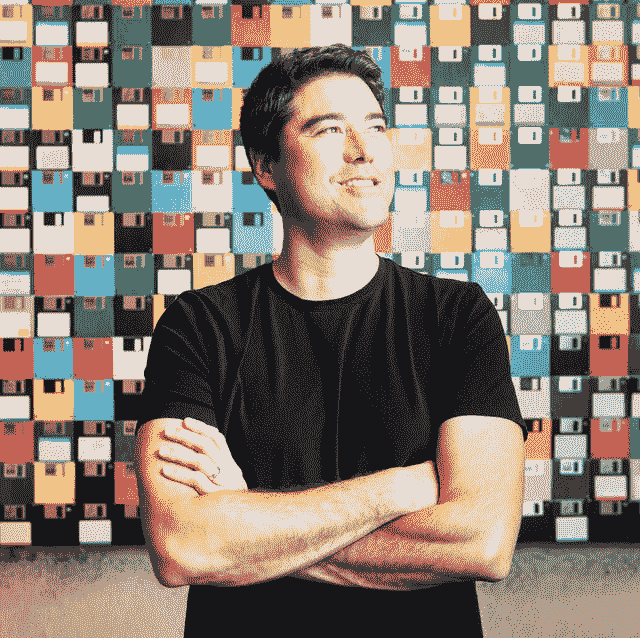

Todd Jackson, Partner at First Round

以下是他最常与有抱负的创始人分享的一条建议:“除了选择你的联合创始人之外，**确定追随**的正确市场是一个创始人做出的最重要的决定，这是一个太容易出错的决定，”杰克森说。“如果你不进行练习，你就有可能开发出一个不错的产品，而不是一个必须的产品——这将使产品/市场更加遥不可及。”

以下是他在创办公司时所依赖的框架，现在他与他遇到的每一位未来的创始人分享这个框架。杰克森还分享了一些来自 Instagram、 [Glide](https://www.glideapps.com/ "https://www.glideapps.com/") (它允许你在几分钟内从谷歌表单创建一个应用程序)和他自己的初创公司[Cover](https://www.wired.com/2014/04/twitter-cover-buy/ "https://www.wired.com/2014/04/twitter-cover-buy/")(Android 锁屏替代品)的例子，以充实他的框架。

**功能需求** : *它是否解决了用户明确的功能需求？这通常是他们尝试的原因。“对于 Glide 来说，它有更容易地创建优秀应用和移动体验的功能需求。从功能上来说，我们为 Android 用户提供了一种简单的方式来组织他们的应用程序，并取代了笨重的姜饼用户界面，使他们的锁屏更时尚、更智能。”*

**情感需求** : *它是否解决了用户的情感需求？这通常是他们会告诉别人这件事的原因，这开启了至关重要的病毒式口碑增长循环。“这可能会很棘手，”杰克逊说。“你的客户一般不会或者不会自己命名。你必须探究他们的感受，并将他们所说的转化为产品。”对于他自己的初创公司 Cover 来说，这是关键:“我听到的很多情况是，他们希望自己的手机能升级到更好的东西——而不用花更多钱买新手机。通过专门为 Android 用户打造，我们挖掘了他们的情感需求。他们常常觉得自己是二等公民，”他说。*

**十几亿美元的市场** : *这是一个巨大的、服务不足的市场吗？还是在一个可以变大的市场？这影响到方方面面，从你的融资能力到谁有兴趣收购你。*“在我自己的初创公司 Cover 中，Android 是一个巨大的市场，但它也严重缺乏服务，”杰克逊说。“至于 Glide，我们已经从像 [Webflow](https://webflow.com/ "https://webflow.com/") 这样的例子中看到，无代码产品背后有着潜在的巨大市场。”

**突破 UX** : *用户体验有什么新奇或独特之处吗？用的时候是不是感觉有点像魔法？最后一个不是绝对必要的，但它非常有用，许多成功的产品在发布时都有它。*“insta gram 的一键式滤镜用户界面让 Photoshop 风格的编辑变得简单易用。对于 Glide 来说，突破性的 UX 是从电子表格到应用程序的过程——这真的感觉像是魔法在起作用。”

如果你认为坐在一个大市场中，利用突破性的用户界面，同时满足人们的功能需求和情感需求，这就是一家真正优秀公司的秘诀。

在会议中为每个人创造分享想法的空间对于建立一个包容的团队环境至关重要——这不是偶然发生的。LifeLabs Learning 的团队有很多建议供领导们参考。

“外向的人，那些在团队中呆的时间最长的人，以及主导身份群体的成员，他们的观点通常比其他人更容易被听到。领导需要关注这些动态，”瓦内塔·桑德胡博士说(自从我们在 LifeLabs 发表这篇文章后，她已经加入了在 T4 农业科学院的团队)。

为了获得更多的战术，桑德胡提供了一些有用的工具:

**创造思考时间。“那可以简单到说，‘在我们回答之前，让我们都记下我们的想法。’这对那些用非母语工作的人，内向的人，或者神经有分歧的人来说很好。"**

**循环赛。“另一个有效的工具是强制轮流机制，你可以说，‘我们都要去，每人花两分钟分享一个问题或答案。请随意说“通过”例如，在外科领域有很多研究表明，如果外科团队以循环赛开始，护士更有可能在手术过程中直言不讳，并有可能提供挽救生命的关键反馈。"**

**礼题**。“养成一个习惯，在会议结束时问一些问题，比如‘我们还没有收到谁的来信？’以及‘我们没有考虑的另外两个观点是什么？'

**圈回来。**虽然防止交谈中被打断——尤其是虚拟交谈——可能会适得其反，但领导者可以做的一件事是跟踪完成情况。“如果有人被说服了，回去对他们说，‘嘿，你想结束你的想法吗？’或者“在我们继续之前，我想听听他们的其他观点。"

确保每个人都有一席之地是不够的——包容性的领导人要确保每个人都有发言时间。

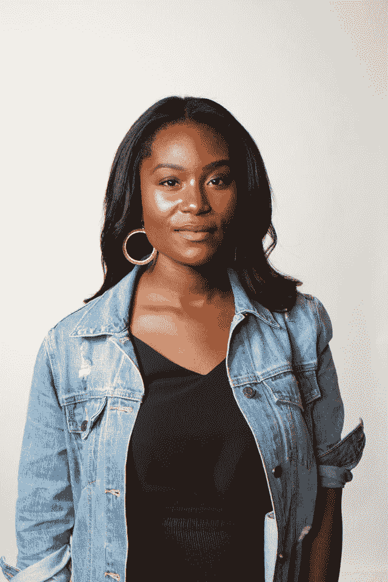

Massella Dukuly, Learning and Development Lead, LifeLabs Learning

LifeLabs 工作人员的另一个建议，因为他们有太多的实践智慧来分享如何成为更具包容性的领导者——这是 2020 年的首要话题。“作为领导者，我们倾向于问一些非常宽泛的反馈问题，比如‘事情怎么样？’你需要非常非常具体地跟进这件事。生活实验室学习的 **[Massella Dukuly](https://www.linkedin.com/in/masselladukuly/ "https://www.linkedin.com/in/masselladukuly/")** 说:“特异性将使我们能够准确定位排斥问题可能在哪里，并了解我们如何补救。

“我喜欢 LifeLabs 的一个战术练习，我们称之为**扩展问题**。一个简单的例子是:从 1 到 10，你认为我在促成这次会面方面做得如何？杜库里说:“大多数时候，你通常会听到七八个，因为他们不愿意说任何超出这个范围的话。

这就是为什么第二个问题很神奇:**怎样才能让分数增加一分？**然后，也许我会听到类似这样的话，“你本可以更多地呼吁人们接纳其他声音。”这很重要，原因有二。第一，给人们更大的安全感，让他们能够表达自己，增加参与度和承诺。第二，它还为我们提供了微观步骤，我们可以据此建立信任并提高包容性。"

比例问题能够将抽象的想法转化为可衡量的、可操作的反馈。影响是通过第二个问题的微小而发生的。

随着日历被 Zoom 会议挤得满满当当——不再有在办公室厨房泡咖啡时的随意聊天——过去一年，定期 1:1 检查您的报告变得更加重要。不仅仅是分析快速变化的优先事项和废弃的计划，而是一个接触人们情绪的机会，以及他们可能需要你支持的地方。做得好的话，1:1 不会成为你交流状态更新、涉水闲聊和坚持安全谈话的例行公事，这样你就可以继续你的一天。

为了确保这次常务会议每次都有冲击力，我们梳理了回顾档案，以寻找最佳战术想法，将您的一对一会议提升到一个新的水平。许多针对具体问题的建议是经理应该思考或询问他们的报告的——其理念是，最优秀的经理会考虑他们希望带到一对一会议中的心态，包括要提出的深思熟虑的问题、与每个直接报告培养的动力，以及如何根据他们的独特需求定制这些会议。

这里有几个亮点。要查看我们收集的全部问题，[请查看题库。](https://www.notion.so/firstround/Question-Bank-for-Better-1-1s-6134003d72b54f56b8d11a5134a263cf "https://www.notion.so/firstround/Question-Bank-for-Better-1-1s-6134003d72b54f56b8d11a5134a263cf")

**自我反省:**

在过去的一周里，我的报告做得好的是什么？他们需要做些什么？(保留一份运行列表，以便在绩效评估期间派上用场)。

我的报告是否会定期提醒我他们面临的最大挑战？

**确定一些话题:**

我们今天最好的时间利用是什么？

上次我们谈话时，你说 X 对你来说很有挑战性，现在怎么样了？

**了解问题:**

你理想的结果是什么样的？

你担心的最坏情况是什么？

**制定长期目标:**

如果你做出改进，哪个领域会给你带来最大的回报？

公司里谁是你最想效仿/学习的人？

**提供更好的支持:**

从现在到下次见面，我能帮上什么忙？

你对收到的反馈数量有什么看法？

无论是寻找有创意的方式来面对客户，还是仅仅试图举办虚拟团队欢乐时光，领导者们今年都必须尽快弄清楚在线活动——社区专家 **[大卫·斯宾克斯](https://twitter.com/DavidSpinks "https://twitter.com/DavidSpinks")** 是咨询的最佳人选。作为 [CMX](https://cmxhub.com/ "https://cmxhub.com/") 的创始人和 [Bevy](https://www.bevy.com/ "https://www.bevy.com") 的社区副总裁，他花了十多年的时间来加深社区[的护城河，他充满了智慧来建立能够产生魔力但仍然对底线产生影响的社区。(我们迫不及待地想要得到一本他即将出版的书。)](https://stateofstartups2019.firstround.com/#10-community-moat "https://stateofstartups2019.firstround.com/#10-community-moat")

在我们今年早些时候的采访中，斯宾克斯分享了一大堆策略，以帮助初创企业领导人努力完善他们的虚拟活动和社区建设战略。他的主要指令？不要试图亲自复制。不能。“相反，回到你组织面对面活动的首要原则。问问你自己:你在解决什么问题？虚拟工具如何独一无二地提供这种价值？斯平克斯说:“想想你可以在网上大规模做的事情，这些事情是你在网下活动中做不到的。

Spinks 提供了大量让虚拟讨论更有价值的建议，我们将在这里重点介绍几个:

10 岁以下，30 岁以上。在小组讨论中保持“小”。坚持 8 个人或更少，将谈话延长到 60-90 分钟，这样你就有空间深入挖掘。

轰轰烈烈地开始。从简短的 1:1 视频聊天开始，这样与会者可以事先见面，使用诸如[破冰者.视频](http://icebreaker.video/ "http://icebreaker.video/")这样的工具。以围绕一个问题的一轮自我介绍开始小组会议，以引发对话并让每个人都参与进来。斯宾克斯说:“你可以从瑞秋·本·哈穆那里找到大量关于选择正确问题的[例子和建议](https://medium.com/peoplestorming/crushing-loneliness-through-virtual-connection-bbc68dac9700 "https://medium.com/peoplestorming/crushing-loneliness-through-virtual-connection-bbc68dac9700")。Range 的破冰工具也提供了大量选项。

**以承诺和后续步骤**结束:要求每位参与者分享一项承诺或他们将根据讨论结果采取的下一步行动。

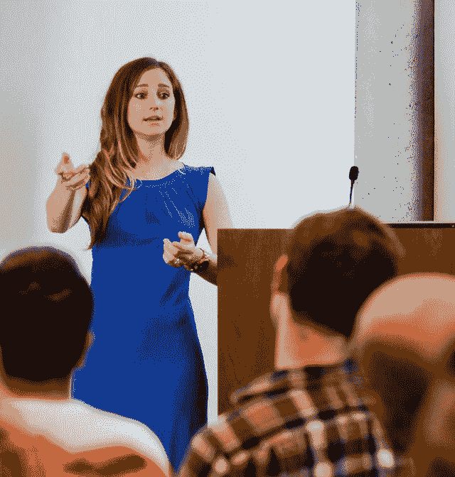

Dr. Emily Anhalt, Psy.D

艾米丽·安哈尔特博士说，当情绪健康的创始人坐在最高层时，强大的公司就会形成。她应该知道——安哈尔特是一名心理学家，在硅谷与创始人共事了十多年，她自己也是一名公司创始人，是 **[Coa](https://www.joincoa.com/classes "https://www.joincoa.com/classes")** 的联合创始人兼首席临床官，这是一个心理健康社区，提供治疗师主导的小组课程和治疗师配对服务。

在我们今年的采访中，安哈尔特将她标志性的情绪健康概念分解为七个特征，并在每个方面提供了锻炼肌肉的实用技巧。虽然每个特质都很重要，但自我意识总是最重要的。“作为一名创始人，照顾好自己，处理好焦虑、沮丧和其他情绪，使它们不会泄露到企业和员工身上，这一点尤为重要，”她说。

下面是安哈特的一个策略:在你的日历上划出一个“焦虑时间”。安哈尔特说:“这听起来有点老生常谈，但它让你在一天的剩余时间里更加专注，而不是不断被焦虑的浪潮所淹没，焦虑的浪潮会影响你与他人的互动。”这种技巧有助于管理她所谓的“预期创伤”——她在这动荡的一年中见过很多。“焦虑让我们觉得，如果事情发生了，我们能够处理好。但是当有如此多的不确定性时，我们没有能力知道会发生什么。安哈尔特说:“它让人们陷入一种没有实际用处的混乱状态。"**处理当下真实的情绪是你的工作**。相信未来的你——比现在的你更有能力、更有经验和智慧解决问题的你。我喜欢的一句抓住了这个想法的名言是，“你只能看到你的车灯那么远，但你仍然可以这样走完全程。”"

你经常犯这样的错误，让自己陷入明天的担忧，而不是处理好当下的挑战。你不必要地承受未来的痛苦。

在过去的一年里，我们举办了首届[创始设计师追踪](https://designertrack.firstround.com/ "https://designertrack.firstround.com/")，脸书、Asana、Dropbox、Lattice 和其他初创公司的最早设计师作为专家和导师，为那些考虑作为第一批设计雇员加入初创公司的人服务。随着这个节目的结束，我们[从这些经验丰富的设计领导者](https://firstround.com/review/the-ultimate-guide-to-the-founding-designer-role/ "https://firstround.com/review/the-ultimate-guide-to-the-founding-designer-role/")那里收集了自下而上的建筑设计的所有高峰和低谷的最佳见解。

其中一颗宝石来自 **[凯蒂·威特科普](https://www.linkedin.com/in/katie-witkop-a8018633/ "https://www.linkedin.com/in/katie-witkop-a8018633/")****[Faire](https://www.faire.com/ "https://www.faire.com/")**的创始设计师。当她的首席执行官提到他们需要一个设计主管来组建一个 100 人的团队时，维特科普面临着一个选择:要么努力适应这个角色，要么开始招聘一个比她级别更高的领导。她选择了后者。

大多数创始设计师都梦想拥有自己的组织，通过头衔和管理来领导——最初我也不例外。但最终找到并招募到我的老板是我最自豪的事情之一，因为我设计了一个可以超越创始成员的企业。

即使你不在设计部门，当你发现自己坐在未来老板的招聘小组中时，你也可以借用并调整维特科普面试手册中的这些问题:

你在设计领导力的最后一个角色中最享受的是什么？

你如何看待我们公司设计主管的角色？你最感兴趣的领域是什么？你认为哪些领域有成长或改进的机会？

你(受访者)认为我(面试官)的角色在未来六个月到一年内会发生什么变化？

你在团队成员身上寻找什么品质？

你经历过不良报道吗？你是如何处理这种情况的？

在你过去的领导岗位上，你会有什么不同的做法吗？如果有，是什么？

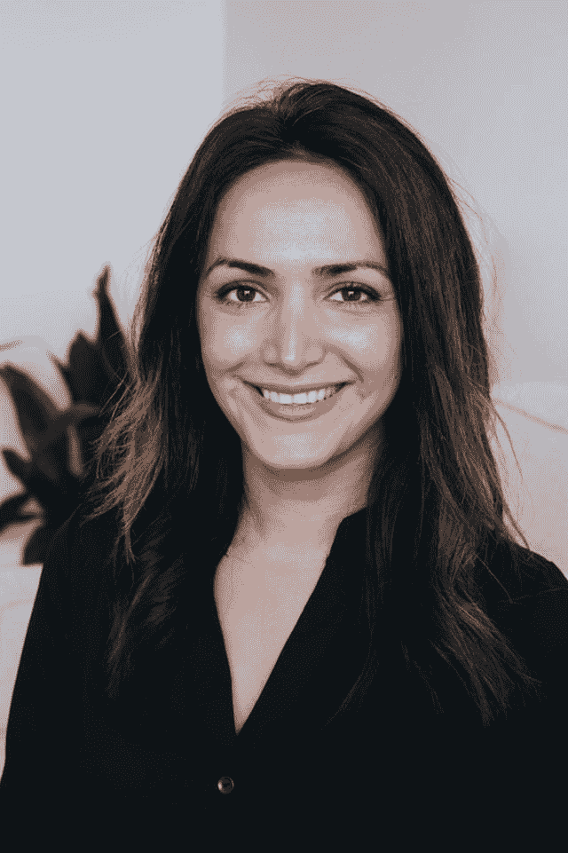

Jaleh Rezaei, Co-Founder and CEO, Mutiny

在创办 **[兵变](https://www.mutinyhq.com/ "https://www.mutinyhq.com/")** 、 **[之前，Jaleh Rezaei](https://www.linkedin.com/in/jalehr/ "https://www.linkedin.com/in/jalehr/")** 担任 Gusto 的第一个营销雇佣，后来担任营销负责人。根据她的经验，她发现营销人员经常沉迷于最新的策略或必须使用的渠道，而忽略了她认为最关键的因素:速度。“一些营销策略在理论上听起来很棒，但当你开始执行时，你会发现许多假设是不正确的。雷扎伊说:“把你团队的精力集中在培育最有前途的种子上，并迅速从那些没有前途的种子中抽离出来。”

今年，她为此提出了自己的六步框架。第一步是在这些假设中戳洞，找出会减慢程序速度的漏洞。“当我需要终止一个项目时，通常会归结为对客户的需求和能力有错误的假设，”Rezaei 说。“我们希望他们是一种方式，如果他们擅长 X，这对我们来说真的很方便，但他们不是。也许他们的时间比我们想象的要少，或者我们对他们来说没有我们想象的那么重要。”

为了在早期标记这些失败点，Rezaei 使用了所谓的“黑帽”技术，该技术围绕着问一个问题:**让我们假设一年后，我们没有实现我们的目标。哪里出了问题？在收集了 5 到 10 个主要可能性的列表后，将这些消极的陈述转换成积极的陈述，并将它们重新组织成关键的杠杆，这些事情*必须*是正确的，程序才能运行。请看下面她的例子:**

科技领域有一些成功的故事没有得到足够的关注。Square 的 Cash 应用程序就是其中之一，这就是为什么我们今年有机会与 **[Ayo Omojola](https://www.linkedin.com/in/omojola/ "https://www.linkedin.com/in/omojola/")** 聊天。在担任 **[Carbon Health](https://carbonhealth.com/ "https://carbonhealth.com/")** 的产品副总裁之前，Omojola 是 Cash App 银行团队的创始项目经理，也是广受欢迎的[现金卡](https://cash.app/help/us/en-us/1108-cash-card "https://cash.app/help/us/en-us/1108-cash-card")的联合创始人。在我们的采访中，我们深入探讨了这种方法为什么有效，以及他对在监管严格的行业制造产品的建议。

Omojola 说:“重要的是，不要害怕深入到任何必要的深度，以获得你真正理解的答案。这里有一个例子:“我们花费了大量的时间和精力来优化卡片的外观。我在工厂总共呆了大概几个星期。我们实际上尝试了 200 种不同的厚度、功率设置等组合，以达到我们最终发货的目的。最简单的方法是给某人发一封电子邮件，说:“把卡片做成这样。”最难的事情是真正理解所有的开关。"

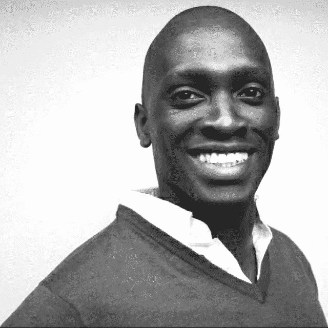

Ayo Omojola, VP of Product at Carbon Health

这就是为什么这是一个优势:“当我们第一次在现金卡上工作时，市场上的艺术水平并没有给人留下深刻的印象。实体牌已经很久没人玩了。这留下了一个机会，”他说。“我们的根本目标是创造一种个性化的实体卡片，人们可以自豪地从钱包中拿出来展示给朋友看。他说:“我们想把客户的品牌放在第一位，作为现成预付卡的替代品，因为品牌已经在预付卡上贴满了他们的标志。”。你怎样才能做出比最先进的技术更有用的东西，这样它就能穿过杂乱的东西，让你想为之制作东西的人真正注意到你？

坚持不懈的努力得到了回报。“我们最终推出了一款现金卡产品，成千上万的人兴奋地在 Twitter 上分享。他说:“这些是免费的展示，我们不必为推动病毒式增长而付费。

总是在容易停下来的地方，在变得乏味的地方寻找那些机会。这通常是一个信号，表明某人或一群人以前没有深入过。

创业的糖衣故事很多。史蒂夫埃尔-哈格 不在其中。他很快告诉你 **[Drop](https://drop.com/ "https://drop.com/")** 如何在第三周获得 50K 美元的收入，但在结束种子轮后连续八年降至零。或者他如何忽视了一个严重的职业倦怠问题，以及他最大的问题是，当他 22 岁辍学创办公司时，他“什么都不知道”。

艾尔-哈格坦率地分享了他作为第一次创始人的最大经验，他的招聘方式给我们留下了深刻印象。首先，他和他的联合创始人在刚起步时，每天接受 80-90 次采访。但他最大的挑战来自高管招聘方面。

“我只是在评估总体能力和总体经验。他说:“我过多地批评候选人在我认为的高级领导者核心能力方面表现不佳，而不是从技能和领导力的角度关注团队到底需要什么，然后针对这些方面进行面试。”。作为一个例子，艾尔哈格提到了他在招聘财务主管时遇到的困难。他的第一份工作更侧重于流程和控制，这让一个习惯于快速前进的团队慢了下来。在分道扬镳并在此期间亲自管理财务团队后，埃尔-哈格明确表示，他想要一位专注于增长的首席财务官，他擅长财务规划与分析、建模和运营——即使他们在会计方面较弱。

通过集中精力检查所有的框，你可能会雇用你公司最急需的框中最弱的人。

这里有两个额外的策略帮助他提升了招聘高管的水平:

合并面试和工作:艾尔哈格开始将面试作为工作会议。“我们会开一个小时的会，花 10 分钟让他们大肆宣传公司，然后迅速切入我们面临的最大问题，以及他们将如何解决这些问题，”他说。这使他能够看到高管候选人如何在实际环境中解决问题，同时众包想法和观点。

**坚持一个数字:**在一次失误之后，艾尔-哈格不会再给出另一份工作，直到他见到了 30 多个优秀的人——而要找到这么多 C 级候选人是一项艰巨的任务。埃尔-哈格说:“对于第 10 或 12 个人来说，你对好答案的模式识别能力比好答案的模式识别能力更强。”。“到了 20 岁，你可能已经看到了一些让你大吃一惊的答案，而这些答案是你从未想过的。”

正如 **[大卫取消](https://twitter.com/dcancel "https://twitter.com/dcancel")** 所说，他们在 **[漂流](https://www.drift.com/ "https://www.drift.com/")** 时“沉迷于故事内部”。从他们从剧本写作世界获得的灵感，到讲故事培训是他们入职的一部分，Cancel 向我们介绍了他作为首席执行官用来创造这种文化的策略。

其中一种讲故事的技巧出人意料地产生了一个新的产品线。“在建漂初期，我一直在用 WhatsApp。很容易快速录制和发送视频。因此，我开始主要通过视频和音频消息与我的高级领导团队进行异步交流，”Cancel 说。“如果我们遇到了问题，我们会制作一个简短的视频，介绍我们在哪些方面做得不好，我们是如何解决的，结果是什么，以及我们学到了什么。如今，高管团队一直在使用它，但可能使用最多的团队之一是产品和工程团队。他们有关于他们所做的一切的视频，从新发布的内容、他们正在解决的问题，到他们所有的会议。”

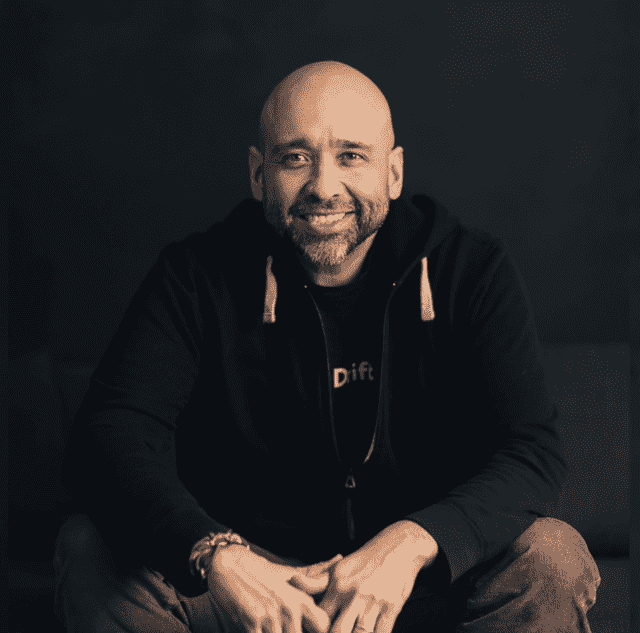

David Cancel, CEO and Co-Founder of Drift

这种内部讲故事的形式导致 Drift 团队创建了一个视频平台，然后最终[将其作为产品](https://www.drift.com/platform/video/ "https://www.drift.com/platform/video/")提供，因为他们经常使用它。但 Cancel 也注意到了其他好处。“这让我能够真正思考我在说什么，而不是和某人呆在一个房间里，或者来回发短信或打电话，”他说。“真正让它成为我们有效工具的是分享方面——突然之间，我们有了不同主题的旧视频，可以与那些在入职过程中开始漂移之旅的人分享。拥抱交流的异步本质，并拥有我们可以随时间推移与其他人存储和共享的工件，这确实有助于入职，让每个人都集中注意力，并帮助人们理解我们为什么要做出决策，让我们能够以一种前所未有的方式保持透明。”

我会说我们内部的异步通信 80%是视频，20%是音频——这对我们来说是巨大的。对我个人来说，这大大减少了我开会的次数，提高了我反馈的质量。

这可能看起来有点像一个元话题，但在混乱的一年颠覆了最好的计划后，创始人和初创企业领导人比以往任何时候都更依赖他们的导师和顾问。无论是评估不同的观点，还是最大限度地发挥顾问的效力，以及作为学员履行自己的承诺，收集和分析顾问意见的能力都是一项需要不断提高的技能。

在这种时候，大量的支持和高质量的建议可以带来很大的不同，这意味着充分利用你现有的顾问、导师和投资者网络变得前所未有的重要。

为了创建这个关于获取建议的资源，我们回顾了我们的档案，找出了最佳策略。以下是一些突出的例子:

第一轮董事会合伙人 **[Phin Barnes](https://firstround.com/person/phin-barnes/#mystory "https://firstround.com/person/phin-barnes/#mystory")** 说把你自己作为一个受指导者，让你的指导者最大化。“一位创始人曾经问我:‘在所有和你一起工作的人中，我从你那里得到的帮助是高于平均水平还是低于平均水平？’当我说他们一般时，他们的下一个问题是，“我怎样才能得到更多？”“巴恩斯对这种战术印象深刻。他不知道这位特别的创始人有多想接触更有规律的节奏，但一旦他知道，他很乐意提供更多。

把焦点放在你身上。当向别人寻求建议时，从分享*你的*情况开始，而不是问*他们*过去做了什么，重复创始人 **[Hiten Shah](https://www.linkedin.com/in/hnshah/ "https://www.linkedin.com/in/hnshah/")** 说。例如，不要问“当你雇佣第一个销售人员时，你是在哪里找到他们的？”更好的选择是“我正在组建一个销售团队，并试图雇佣第一个人。我应该如何接近它？”甚至更好？“我正在组建一个销售团队，并试图雇佣第一个人。这是我们的目标客户，我们每个客户的平均收入以及我们的销售流程。接下来我该怎么接近它？”通过这种方式提出问题，你可以避免完全谈论什么对其他公司有效，什么最适合你的特殊情况。

**更善于跟进。**通过与你的顾问一起结束循环来将建议与影响联系起来是一个经常被引用的技巧，但在实践中很难保持足够的组织性来实现它。思科 **[的 Amy Chang](https://www.linkedin.com/in/changamy/ "https://www.linkedin.com/in/changamy/")** 说，将顾问提出的一句话想法保存一份运行文档，并设置一个日历提醒来重温它，这样你就可以跟进他们的想法是如何产生影响的。

建立更好的团队和公司要从自己做起。但是为个人发展留出时间通常是最后一项。在 2020 年，这种紧张感比以往任何时候都更加强烈和压倒性——追求学习的持续工作经常被推到一边。想重新投入这项工作吗？我们整理了一份指南，里面充满了战术指针和将个人发展领域融入日常生活的最佳低层次想法——我们保证，不会出现 LinkedIn 上的“broetry”帖子或 Instagram 上的励志名言。

这里有一个难题:高管教练 **[克里斯·霍姆伯格](https://www.linkedin.com/in/chris-holmberg-a9042b/ "https://www.linkedin.com/in/chris-holmberg-a9042b/")** 推荐一个简单的日常习惯，以确定你如何以及何时阻碍自己。他说:“每天花 15 分钟反思——真正的反思，在一个安静的空间，关闭收件箱——回顾前一天的事情，并为即将到来的一天制定计划。”“无论是看看日历为即将到来的事情做准备，还是记下一些笔记，都要让自己习惯于留意成功、失误和成长机会。”

在压力下，我们都会还原到我们所知道的、感觉舒适的事物。这些反思的时刻是你回顾并逐渐将你的思维模式转变为领导，而不仅仅是执行的机会。

要真正让这些分分秒秒变得有价值，依靠“它”、“我们”和“我”的[积分理论](https://en.wikipedia.org/wiki/Integral_theory_(Ken_Wilber) "https://en.wikipedia.org/wiki/Integral_theory_(Ken_Wilber)")。“它指的是你的任务和你在工作中的角色:你的目标、成就和你正在完成的事情。你完成了待办事项清单上的工作了吗——你想写的电子邮件，你欠老板的战略文件？霍尔姆伯格说:“确立你第二天打算完成的任务，以及实现这些目标的日程。

“我们是关于你的人际关系，你互动的质量——很少有人想到这一点。你给你交往过的人的生活增加价值了吗？他们带走了更多的知识、精力、善意还是更好的理解？他说:“预测任何即将到来的挑战性互动，并考虑你想如何在对话中表现出来。“最后，我是关于你每天亲自带到餐桌上的态度。你是如何管理自己的精力和情绪的？如果你耗尽了自己，你就无法帮助别人，”他说。“考虑如何让自己在一天中做出正确的选择，并确定什么可能会让你偏离轨道。**初创公司的高管通常会过度关注“It”，以牺牲“我们”和“我”为代价向前发展"**

Bob Moore, CEO and Co-Founder, Crossbeam

三次创始人 **[鲍勃·摩尔](https://www.linkedin.com/in/robertjmoore/ "https://www.linkedin.com/in/robertjmoore/")** 作为一名企业家已经经历了许多高峰和低谷——从平淡无奇的公司退出和联合创始人动荡到创办他目前的创业公司、 **[横梁](https://www.crossbeam.com/ "https://www.crossbeam.com/")** **、**受到行业顺风和 [a 轮和 B 轮巨额融资的推动](https://techcrunch.com/2020/08/06/crossbeam-announces-25m-series-b-to-keep-growing-partnerships-platform/ "https://techcrunch.com/2020/08/06/crossbeam-announces-25m-series-b-to-keep-growing-partnerships-platform/")。虽然他有磨砺出它的嗜好，并有他的战斗演习的公平份额，回头看，摩尔强调，没有多少敏捷性可以取代一个独特的公司愿景。“好的愿景意味着你有很强的首要原则。产品可以进化。团队可以改变。市场可能会跌入市中心。但如果你坚持不懈地追求一个完美的愿景，你就能经受住大多数风暴，”他说。

他的第一家公司 RJMetrics 就深受后者的困扰。“当我们开始时，我们可以看到一个充满机会的领域，但我们实际上并没有清晰的愿景，不知道我们要构建什么以及为什么会成功。他说:“我们只有一个词——数据，而我们‘愿景’的其余部分可能会根据我们最近从销售线索或客户那里听到的信息而发生扭曲。”。但摩尔通过他的第二家公司 Stitch 纠正了方向，并获得了更好的退出机会。“简单明了，这是你需要确定的公式:**这是我们在这里要做的事情，这是为什么我们在做这件非常具体的事情时会是最好的，这是顺风，现在是做这件事的正确时间，**”他说。

我们该怎么办？背后有什么我们独特的眼光？这是建立一家有弹性的风险投资公司的先决条件。即使在最好的市场有最好的团队，如果没有这些因素，你也会遇到瓶颈。

我们从摩尔那里又抽出了一个，因为他的分享是如此的准确。当回顾他的第一次创业时，这位重复创始人兼**横梁**现任首席执行官后悔陷入了一个常见的创业神话。“这是一个创始人的比喻，他说，‘我们创建这家公司不仅仅是为了出售它’——我们过去经常这么说，”摩尔说。“但我们喝了太多的可乐，以至于当出售成为我们的最佳选择时，我们发现自己手忙脚乱。我们从第一天起就没能培养与潜在买家的关系，所以当一个高压报价到来时，我们没有时间或网络来足够快地启动竞争过程。结果，我们可能会留下一些重要的价值，”他说。

“我的联合创始人杰克·斯坦恩在我们的下一家公司 Stitch 中发现了这一点。从第一天起，他就与我们所有目标收购方的首席执行官和企业发展主管建立了关系。当我们发现自己的公司也处于类似的情况时，他提出了一个快速高效的流程，让我们确信我们为我们的公司和团队选择了正确的交易，”Moore 说。

他的建议？“不要一开始就说，‘嘿，有一天你可能会买下我的。’通过真诚地寻找你所做的和其他公司所做的之间的协同来培养他们。这可能是产品集成，也可能是走向市场的合作伙伴关系。可能只是信息共享。但是这些关系需要一个真正的——而不是虚假的——动机来维系。他们不会在一夜之间走到一起，”他说。

Maggie Leung, VP of Content, NerdWallet

虽然许多领导人今年首次尝试远程管理，但 **[NerdWallet](https://www.nerdwallet.com/ "https://www.nerdwallet.com/")** 的内容副总裁 **[Maggie Leung](https://www.linkedin.com/in/maggieleung1/ "https://www.linkedin.com/in/maggieleung1/")** 已经驾驭了远程管理的许多细微差别。Leung 从一开始就远程领导她的大型团队——多年来，这是公司唯一一个完全分散的团队。她已经收集了很多(在家)让它工作的技巧。

“谈到远程工作，传达对交付成果的期望很重要，但这只是等式的一半。她说:“始终如一地传达和强化工作规范——你们如何对待彼此——同样重要。“在远程团队中，你无法亲自观察信号，与办公室相比，你的互动也更少。**没有文化北极星，团队中的每个人最终都会对自己设定各种期望。不仅其中一些会相互冲突，你也不太可能最终得到你想要的领导文化。**“在 NerdWallet 的内容团队中，北极星价值观的删节版与最终入围的求职者分享。“在他们加入我们之前，我们就开始传达我们的期望，”Leung 说。

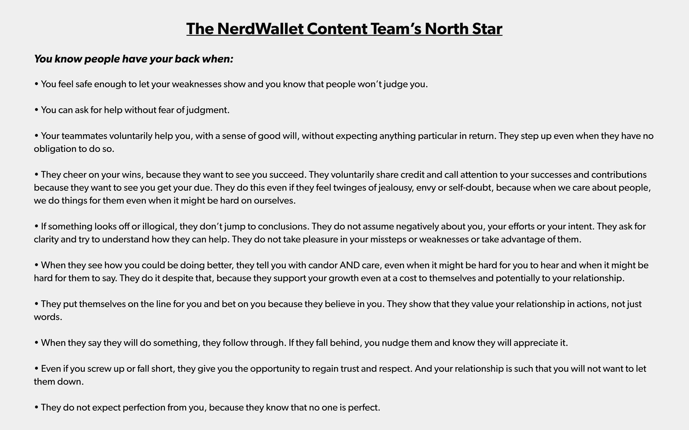

丽兹·佛斯莲 是我们最喜欢的评论之一，因为她能够更好地诠释我们带到办公室的[的混乱情绪](https://firstround.com/review/these-seven-emotions-arent-deadly-theyre-your-secret-career-superpowers/ "https://firstround.com/review/these-seven-emotions-arent-deadly-theyre-your-secret-career-superpowers/")(当然，她的诙谐漫画在社交媒体上聚集了[一群狂热的追随者](https://www.instagram.com/lizandmollie/ "https://www.instagram.com/lizandmollie/"))。当我们展望未来一年远程工作的默认设置时， **[Humu](https://humu.com/ "https://humu.com/")** 的内容主管将这些管理技巧带到了 2021 年:

**给人们一个退出的机会。**“比任何时候都更重要的是，一种尺寸绝对不能放之四海而皆准。一些人渴望互动，另一些人没有或不能适应他们忙碌的日子。如果人们没有出现在虚拟活动中，就假定他们是无辜的——并确保他们知道他们拥有虚拟活动。你不想在他们的压力源列表中增加社会压力或对他们被如何看待的担忧。在你的团队会议上明确提出这一点，让他们知道任何人选择退出都完全没问题，如果他们有困难，他们可以随时与你一对一地交谈。”

**增加一些官方休假。**回顾过去的一年，你(和你的团队)分配的大部分假期可能都没有改变。但是，即使你不能飞到热带地区，为人们创造减压的空间对于团队的长期健康也是至关重要的。“从长远来看，给人们放一天假并不重要——它可以走得很远，”她说。

**非结构化时间抽查。**检查以确保您的直接下属的日历不会太满。“非会议区至关重要。“我们在办公室的日常工作中有很多休息时间，从喝咖啡、吃午饭到通勤，”Fosslien 说。“积极主动地在自己的日程表上安排大量时间，并鼓励你的直接下属也这样做，从而树立良好的行为榜样。”

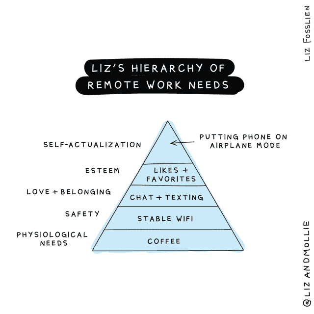

去年 4 月，我们发布了迄今为止最大的努力之一——一个详细的资源，利用第一轮合作伙伴、衰退时期的创始人和我们的首席执行官社区，创建了关于如何在 2020 年经济危机期间领导创业公司的最全面的指南。我们利用原始采访、之前未发表的第一轮社区指南和创始人调查，从延长跑道和减少烧伤，到支持团队和寻找亮点，众包建议。

当然，这很大程度上是为一个独特的时刻量身定制的——2020 年 4 月初，当时尘埃尚未落定，理论层出不穷，经济和创业生态系统的前进道路尚不明朗。(例如，我们肯定没有预料到近九个月后，封锁令仍然有效，初创公司仍然可以远程运营。)因此，尽管有些章节可能与当前形势不太相关，但请将这份资源视为一份手册，供你在面对未来危机时参考，或者是一系列经验教训，供你在规划公司 2021 年的发展方向时参考。

当我们重新审视这一资源时，一个关键主题凸显出来:**为不确定性做计划是创始人需要不断提高的技能**。“作为一名领导者，你的工作是想象你的公司需要如何与众不同。对国家、经济和你的公司来说，未来会有什么不同的情景？在这段时间里，你的公司如何生存和发展？”先发制人的 **[约什·科佩尔曼](https://firstround.com/person/josh-kopelman/#mystory "https://firstround.com/person/josh-kopelman/#mystory")** 说道。

无为是一种决定。和主动选择留在同一条路上是一样的。大多数创始人都没有意识到这一点。如果风向改变，聪明的水手会调整船帆。

以下是我们推荐的框架:当危机逼近时(或者当你重温你的[季度和年度计划](https://firstround.com/review/the-secret-to-a-great-planning-process-lessons-from-airbnb-and-eventbrite/ "https://firstround.com/review/the-secret-to-a-great-planning-process-lessons-from-airbnb-and-eventbrite/")，将观察和假设转化为可能的情景。然后，概述当前的运营计划调整，使您能够应对这些情况。下面，你会发现我们将这一点付诸实践的五步框架。要亲自尝试，复制我们的[情景响应计划模板](https://www.notion.so/First-Round-s-Scenario-Response-Planner-3505ee49d6d8445da642eba041e74762 "https://www.notion.so/First-Round-s-Scenario-Response-Planner-3505ee49d6d8445da642eba041e74762")。(这个概念文档包括一个虚构的公司餐饮服务的示例响应。)

**第一步:确定 6-10 个关键不确定因素。**专注于你认为会对公司前景和战略产生最深远影响的事情。包括一个范围，从宏观经济的不确定性到那些关于你的市场，客户和其他利益相关者。

**第二步:将它们分成不同的场景。创造三个(或更多)场景:最好的情况，最坏的情况，以及一个能消除差异的场景。给每一个都起一个名字和叙述，这样它们就不那么抽象，更适合你公司的具体情况。**

第三步:对每个问题做出回应。如果你的情景描述了世界可能的发展方向，你的回答就是“现在怎么办？”使用类似下表的东西来思考你的整体商业游戏计划将如何随着场景的变化而变化。

**第四步:寻找触发点。**监控具体的内部和宏触发器，这将帮助您决定选择哪条道路。这里有一些要考虑的样本指标:公共卫生政策的变化、失业趋势、小企业关闭率、客户流失稳定或下降、入境销售线索的增加(或减少)等等。

**第五步:重温、修改、重复。**按照一定的节奏(取决于你所面临的危机的紧急程度),将你以前的不确定性、情景和应对措施存档，并将构建模板复制/粘贴到一个新版本中，以更新你的想法。

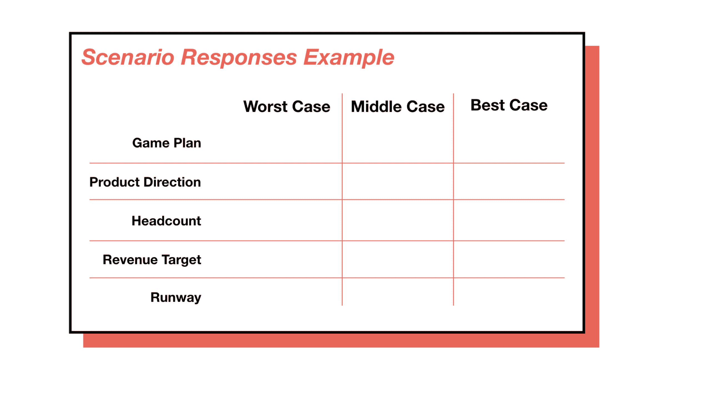

**[马特·沃勒特](https://twitter.com/mattwallaert "https://twitter.com/mattwallaert")** **(** 最近在 [Clover Health](https://www.cloverhealth.com/en/ "https://www.cloverhealth.com/en/") 担任首席行为科学家)已经做了超过 15 年的行为科学家。因此，当谈到管理压力的建议时，他自然会求助于科学。“在一项特别的研究中，人们被迫随身携带一盒巧克力几天，然后测量他们吃了多少巧克力。在一种情况下，我们没有给他们如何处理渴望的指示。在另一项研究中，我们教他们基于控制的技术来避免巧克力，比如分心——如果你发现自己在想它，就把这些想法从脑海中清除，专注于其他事情。第三，我们教他们基于接受的技巧，比如体验接受——识别并确认渴望，但不要付诸行动，”他说。

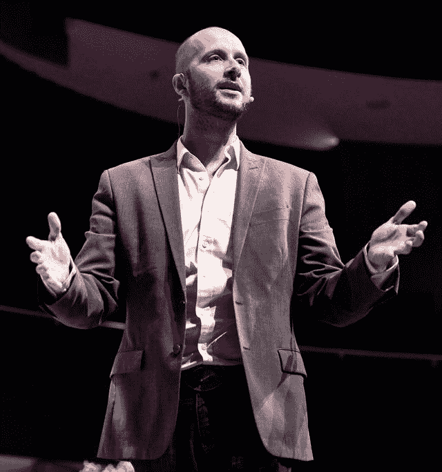

Matt Wallaert, former Chief Behavior Officer at Clover Health

调查结果？沃勒特说:“与什么都不做相比，分散注意力和接受都能有效地帮助人们抵制巧克力。

那么，啃巧克力和领导一家公司有什么关系呢？接受帮助我们吃掉一块巧克力，而不是整袋巧克力，因为它承认了我们的感受，并给了它们一个出口。一块巧克力和整袋巧克力的区别很重要；严重的挫折仍然不同于灾难，现在比以往任何时候都不同，”他说。这是一个规模很重要的领域。休息几个小时来应对和一次检查几个星期是不同的。错过一笔交易并不等同于放弃你的整个渠道。”

接受我们没有达到 100%的状态，会让我们有能力继续保持 80%的状态，而不是崩溃到 0%。

****[div vy](https://getdivvy.com/ "https://getdivvy.com/")**的产品和风险 SVP，已经看到产品界的许多人声称项目经理是他们产品的首席执行官，但没有内部基础设施来支持。“产品世界已经让‘项目经理是首席执行官’成为一种口号，而没有真正将这种精神融入到他们的日常运营中。经前综合症通常没有权力这样做。霍格说:**如果你的项目经理不负责实现收入目标和他们自己的损益，称他们为产品的首席执行官只不过是保险杠贴纸上的标语而已。**“**在 Divvy，我们的项目经理销售——这真的是整个系统的关键。”****

**交付里程碑对于任何公司的项目经理来说都是至关重要的。项目经理们应该关注的真正问题是:这个软件在取悦客户的同时，是否为企业创造了你想要的结果？**

**说到雇佣以结果为导向的项目经理，下面是霍格放在口袋里的三个问题和后续问题:**

****问题**:作为产品经理，你最自豪的成就是什么？“这表明它们是否是结果驱动的。如果他们只是谈论运输，而没有任何明确的可衡量的结果，他们就不是我们需要的心态。”**

****追问**:那个成绩带来了什么？“有些项目经理可以采取下一步措施，说，‘嗯，它带来了 X 倍的收入。’这比一些答案要好，但是你必须更深入一层。"**

**额外跟进:结果和你说的相比如何？“这是大多数项目经理努力的地方，因为他们通常不预先定义清晰和可衡量的结果，所以他们不确定它与预期相比如何。一个很好的答案可能是，“我们希望在年底达到 50%的采用率，而我们实际上达到了 65%。”成功和取得的成就有明确的背景。"**

**霍格说:“如果你不得不不断敦促候选人考虑业务成果，而不仅仅是坚持交付成果的时间表，那么他们可能很难满足你所寻找的产品经理类型的需求。”**

**

Kelsey Mellard, CEO, Sitka** 

**异地和团队静修通常处于两个极端中的一个:[以牺牲关系为代价专注于战略](https://firstround.com/review/what-i-learned-about-management-and-culture-from-growing-ubers-asia-business-from-zero-to-billions/ "https://firstround.com/review/what-i-learned-about-management-and-culture-from-growing-ubers-asia-business-from-zero-to-billions/")，或者充斥着近乎俗气的强制结合活动。虚拟越位也是如此，再加上马拉松式的额外缺点——所有人都粘在显示器上的全天变焦会议。**

**在创建她的团队的第一个虚拟异地时， **[西特卡](https://www.trustsitka.com/ "https://www.trustsitka.com/")** 首席执行官 **[凯尔西·梅拉德](https://www.linkedin.com/in/kelsey-mellard/ "https://www.linkedin.com/in/kelsey-mellard/")** 与经验设计师 **[王建亚](https://www.intentdesign.org/ "https://www.intentdesign.org/")** 合作，从头开始重新设计整个异地。他们有很多建议来确保你的下一次异地旅行是有目的和有影响的——而不仅仅是在你的年度清单上打勾。**

**首先，王提醒大家不要直奔主题:哪一次会议将在哪里举行。“在你开始钻研整合实际时间表的细节之前，先浏览一个列出你的目标和结果、设计原则和项目主题的框架，”他说。**

**虽然这看起来像是一笔大的前期投资，过程繁重，但这是值得做的。“这是‘我们希望这一点被理解，这就是我们将如何实现它’和‘让我们在这里做一个小组’之间的区别。”**异地和静修通常最终会让内容掌控并推动议程**，”王说。**

**如果你的异地团队由几天的时间组成，只是演示幻灯片，中间穿插一些休息时间，那么一定是出了什么问题。**

**“虽然我们大多数人倾向于关注静修的内容，但同时定义你的方法——设计原则——也很重要。他说:“这些将告知你如何构建体验的决策过程，为你可能会说不的事情、你可能会做出的权衡以及要坚持的优先事项设置护栏。”**

**查看以下 Sitka 场外设计原则的完整列表:**

**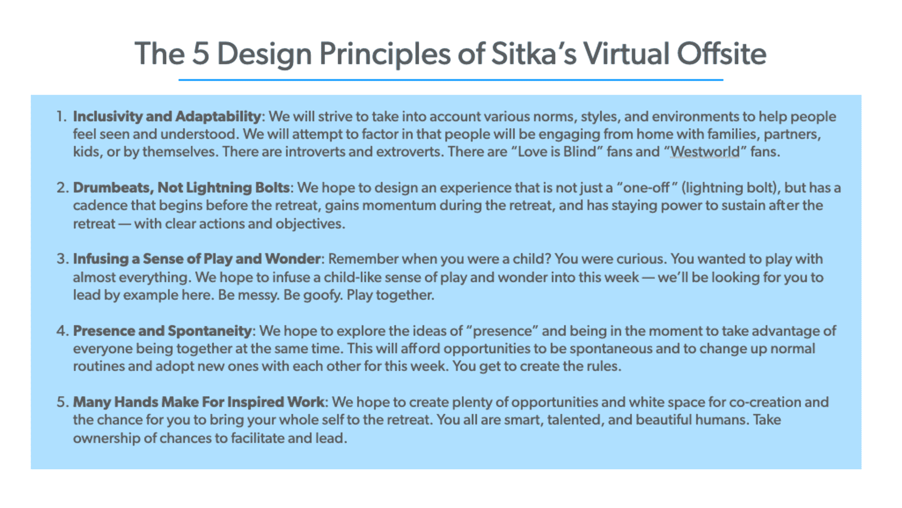**

**去年，我们采访了的高级设计运营总监 **[艾莉森·兰德](https://www.linkedin.com/in/alisonrand/ "https://www.linkedin.com/in/alisonrand/")** ，向她请教在成长旅程的每个阶段都有更多公司关注的一个角色:设计运营。她给那些对这门新兴学科感兴趣的初创公司提供了大量的建议——以及它是否能在他们的组织内部推动变革。但是有一个特别的金块引起了我们的注意，超越设计界限的人们应该把它记下来。**

**

Alison Rand, Head of Design Operations, InVision** 

**“在任何领域，作为第一个雇员加入一家公司都是一件非常令人激动的事情。这就像是给了你你想去的最终目的地——没有任何方向或交通工具带你去那里，”当谈到在空白的画布上画一幅杰作时，兰德在华特·迪士尼的创造性领导三人组模型中找到了安慰和清晰:梦想家、现实主义者和批评家。**

****梦想家**展示了未来的愿景，并超越了其他人可能看到的界限。他们关注的是**什么**。**

**现实主义者在逻辑规划风格内考虑做梦者的愿景。他们关注行动计划和**如何**的想法。**

**评论家探讨了将想法变为现实的障碍。他们找出弱点和远景背后的逻辑，并最终考虑**为什么**。**

**当谈到你自己的领导名单时，考虑一下人们是如何落入这三块拼图中的——以及你是否过于看重其中一面而忽略了另一面。**

**我们给第一轮社区中一些最精明的人打了个电话，征求他们管理的最佳建议。虽然目标是为寻求有效管理的报告提供一个剧本，但对于不断全方位管理的公司建设者来说，还有很多智慧。**

****1。在这两个关键问题上保持一致。****

**“确保你和你的报告对这两个关键问题有相同的答案:1)对我个人来说，成功是什么？2)什么是团队的成功？” **[朱莉卓](https://www.linkedin.com/in/julie-zhuo/ "https://www.linkedin.com/in/julie-zhuo/")**,**[Inspirit](https://www.inspiritvr.com/ "https://www.inspiritvr.com/")**的联合创始人。**

**你的成功和你的报告的成功的交汇点是奇迹发生的地方，也是实现影响力的机会所在。**

****2。开始留下痕迹。****

**当提出一个大的要求时，在你精心设计出一个完美的计划来呈现之前，你可能会倾向于隐藏细节。这是一个错误， **[拉尔夫·娄艺潇](https://www.linkedin.com/in/ralphloura/ "https://www.linkedin.com/in/ralphloura/")** ，**[【lumen tum】](https://www.lumentum.com/en "https://www.lumentum.com/en")**的 SVP 首席信息官和拉顿+菲尔兹的前首席技术官说。“不要把一个大话题留到你觉得已经有了所有答案的时候——任何有价值的事情都需要时间去构建。他说:**我的一位老经理有一个‘七次尝试法则’，本质上就是说，任何足够复杂或抽象的东西都需要多次尝试(在他的例子中是七次)，才能让某人将这个概念内在化。****

****3。对问题达成共识。****

****[InVision](https://www.invisionapp.com/ "https://www.invisionapp.com/")** 产品管理高级总监 **[贝蒂·廖](https://www.linkedin.com/in/bettyliao/ "https://www.linkedin.com/in/bettyliao/")** 说:“向上管理就是与下属和经理建立关系，让他们成为解决问题的伙伴。在处理棘手的问题之前，将这些问题与你的报告联系起来:**

**你有哪些你的报告还不知道的信息？**

**你在什么样的约束下运营？**

**你现在的未知是什么？你打算如何获得更大的清晰度？**

**接下来，一起考虑可能的策略:**

**你认为应该挑战哪些限制？**

**你考虑过哪些可供选择的道路？有哪些权衡？**

**经理如何最好地支持报告？**