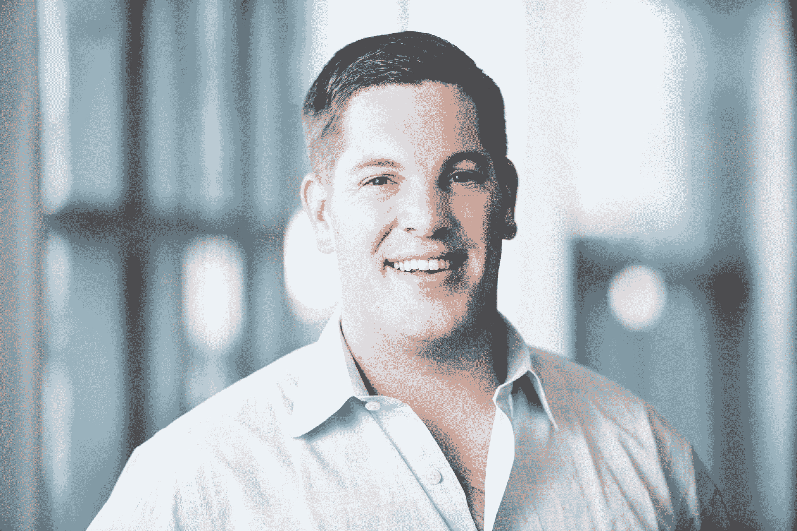
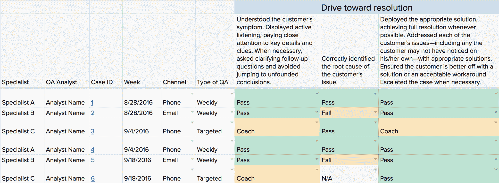

# 创业公司将 CX 放在核心位置的案例|第一轮回顾

> 原文：<https://review.firstround.com/the-case-for-startups-to-put-cx-at-their-core>

客户经常想辱骂支持代表，而不是直呼其名。WiFi 系统初创公司 **[eero](https://eero.com/ "null")** 并非如此，这要归功于其首席执行官兼联合创始人 **[尼克·韦弗](https://www.linkedin.com/in/nsweaver "null")** 和客户体验负责人【CX】**[达纳·林赛](https://www.linkedin.com/in/dana-lindsay-04051461 "null")** 。虽然大多数创始人把客户支持作为事后的想法，但 Weaver 从一开始就有意识地创建并整合了它。这意味着建立一个专门的团队来收集测试版的反馈，并在大多数初创公司只专注于工程的阶段雇佣 eero 的第一个 CX 员工。Weaver 明白，要到达它需要去的地方，eero 需要能与它的产品相媲美的优质服务。

在传统上令人困惑和恼火的 WiFi 网络领域取悦顾客，说起来容易做起来难。幸运的是，韦弗背景下的每个组织都强调服务就是产品。在创办和领导 eero 之前，Weaver 共同创立了孵化器 [StartX](http://startx.com/ "null") ，在[麦肯锡](http://www.mckinsey.com/ "null")担任分析师，并在 [Menlo Ventures](https://www.menlovc.com/ "null") 与初创公司共事。在加入 eero 之前，Lindsay 培训并扩展了数字出版平台的远程团队。她还让客户和新员工加入该平台，这些技能提高了她定义和部署 eero 客户体验运营的能力。

在这次独家采访中，Weaver 和 Lindsay 分享了使 CX 团队成为 eero 的“真相小组”的选择和实践从“客户体验”这个名字背后的基本原理到建立 CX 团队背后的时间安排，他们给出了关于开始和扩展一个经常被忽视的学科的深思熟虑的提示。他们提供的策略和规则将帮助任何年轻的公司提升其 CX 团队，并为技术支持带来一个更好的名字。让我们开始吧。

# 是客户体验，不是客户支持

不仅仅是语义。客户体验是人们与品牌的互动和关系。客户支持以解决具体的客户问题为中心。“我们不想等到有问题时才联系我们。我们喜欢尽早与客户建立关系。对我们来说，最可衡量的里程碑是客户购买 eero 的那一刻，”Weaver 说。“我从高中就开始修路由器，所以我知道人们往往在开口之前就需要帮助。如果你能在客户提出要求之前为他们提供所需，你不仅为你的支持团队赢得了胜利，也为你的品牌赢得了胜利。这就是为什么我们有一个客户体验团队，而不是支持团队。”

这一理念融入了 eero 如何帮助客户设置、使用和维修产品。“从开始到结束，eero 被设计为在几分钟内建立。eero 应用程序中的说明不是以 eero 开头，而是以它所替代的产品开头。它指导客户在连接第一个 eero 之前断开旧路由器。它建议如何找到后续 eeros 的最佳位置，以获得最佳性能，”Weaver 说。“该应用程序允许客户轻松地与客人共享 WiFi 密码，并管理儿童的屏幕时间。该系统可以自动更新，以确保网络以最佳状态运行，无需任何客户努力。客户体验是关于服务和预期客户的*整个*体验，而不仅仅是解决痛点。目标是关系——问题的解决只是加强关系的一个机会。”

小票是第一张支持票。客户可能还没有寻求帮助，但是关系已经开始了。

# 在你有顾客之前为 CX 雇用

大多数初创公司都在创始团队中预先雇佣工程师。当他们构建将导致产品/市场匹配的“产品”部分时，他们通常让创始人专注于“市场”部分。“这不是 *[梦境的领域](https://en.wikipedia.org/wiki/Field_of_Dreams "null")* 。建造它并不意味着他们会来。客户必须被铭刻在团队的集体意识中——这是一项全职工作。韦弗说:“这就是为什么埃罗第二次聘用了我们的营销主管[肖恩](https://www.linkedin.com/in/mrseanharris "null")【哈里斯】。“在拥有客户之前建立一个客户基础功能似乎有悖常理，但为了做好第一天的准备，需要有人在办公室就推出所需的工具、基础设施和招聘做出决定。”

从一开始，第一个 CX 员工应该问并遵循五个主要问题:

人们应该如何第一次体验我们的产品？

他们将如何购买？

他们将如何打开产品包装并加入产品？

他们将如何获得支持？

在这一过程中，他们会获得哪些接触点？

创业公司常犯的一个错误是雇佣一个 CX 人，然后就收工了。"**事实是，客户体验不仅反映了您的客户如何体验您的产品，还反映了您的公司如何体验您的客户**。他们都是 CX 的利益相关者，”Lindsay 说。“因此，当肖恩专注于接触和沟通未来客户的最佳策略时，尼克开始建立一个 CX 团队，专注于在现有用户和公司之间建立反馈回路。”

拥有一个主顾越早越好。

# 客户体验始于家庭

渴望确定客户的脉搏，很容易通过调查进入这个领域。然而，根据 eero 的经验，基础工作是关键，从让你的房子井然有序开始。以下是 eero 为实现这一目标而优先考虑的事项:

**使用全公司的里程碑来展示 CX 的能力。当 Lindsay 在公司成立前几个月加入 eero 时，她知道她有一个独特的机会来提升 CX 作为 eero 最重要的职能之一。“我们的目标是成为您的客户和内部每个人的真理之源。林赛说:“这不会在一夜之间发生，但公司范围内的转折点——比如测试版——可以成为展示 CX 如何为更广泛的团队做出巨大贡献的机会。”“在测试期间，我们致力于为客户树立良好形象。我们通过在谷歌电子表格中手动跟踪客户联系和调查反馈来收集、分析和汇总反馈。”**

CX 团队专注于寻找简单问题的答案，如:

人们在问我们什么？

他们何时以及如何联系我们？

他们看起来有多开心或不开心？

CX 团队根据趋势对反馈进行了分类，并根据紧迫的主题为公司提出了建议。“开始时，这是一种混乱、耗时的做法。但这至关重要。林赛说:“自动化工具和数字调查可能会忽略传达客户真实感受的语言中的细微差别。“但这是你需要的洞察力，让你的早期用户知道你在倾听，并向团队的其他成员证明你与他们站在同一战线。没过多久，我们的工程、产品和营销同事就会问我们，“现在的脉搏是什么？”“地里发生了什么事？”"

如果你打算征求反馈，自己读一读，然后利用它。尊重客户分享的时间。

**在地面上获得更多的耳朵和头脑。**除了领导旧金山的业务，Lindsay 还通过位于德克萨斯州奥斯汀的呼叫中心帮助 eero 扩大了团队。“外包受到了不好的指责。林赛说:“这是因为大多数公司认为这是一个授权的机会，而不是增加人手的机会。“与经验丰富的呼叫中心合作有很多好处。他们以前做过，可以根据需求快速增加或减少员工，即使在客户群增长的情况下，也可以帮助您保持个性化。”

关键是保持参与。这听起来很简单，但你们的 CX 领导人需要从一开始就花时间建立积极的伙伴关系。“去年，我在奥斯汀待了近两个月，办理入住手续，开展培训项目，跟踪我们的 25 人团队，”Lindsay 说。“副产品是，我们共同工作的特点是相互尊重和伙伴关系，而不是命令和控制。如果我提出的建议在我旧金山的座位上听起来不错，但实际上没有意义，团队知道他们可以——也应该——予以反击。”

例如，当 Lindsay 开始与团队合作时，她将每个成员视为一把瑞士军刀:多才多艺的代表，他们可以解决任何问题，而无需将客户重定向到另一位专家。“奥斯汀的团队通过他们的经验和指标证明，虽然单点联系看起来很有吸引力，但它需要专家掌握太多的工具和解决方案才能高效。他们指出，随着 eero 产品和服务的成熟，这只会变得更加紧张，”Lindsay 说。“因此，我们在订单管理和技术支持之间建立了不同的职能角色。这使得团队成员能够接受有针对性的培训并建立领域专业知识。”

Dana Lindsay

这种类型的协作让 Lindsay 减少了耗时的步骤，并相信她的团队能够执行。“这些呼叫中心旨在根据您的需求快速壮大您的团队。鉴于我们已经建立的关系，我们的远程团队将招聘、审查和面试新的团队成员，”Lindsay 说。“这使我能够在有希望的候选人得到奥斯汀经理的批准后，对他们进行最后的电话面试。这大大节省了时间。”

除了现场参观和培训之外，还要注意更小的事情。“我们在德克萨斯州的团队就像一个远程 eero 团队一样运作，所以让他们有这种感觉很重要。Lindsay 说:“从公司范围的 CX 概览到每周例会，我们旧金山的 CX 领导都认可并庆祝奥斯汀团队成员的贡献。“每当一个新的奥斯汀团队成员问‘你们在 eero 是怎么做到的？’我纠正他们说‘你是说我们在 eero 是怎么做的？’我不希望出现外包鸿沟。我们是一个 CX 团队。这就是它的设计，我们努力让这一点变得清晰。"

在 eero 公开发布的前几周，Lindsay 亲自在奥斯汀为整个团队开展了一个培训项目。以下是有效的 CX 培训的几个关键属性:

**彻底，但灵活。**“我们最初的培训计划在发布前进行了两周。虽然那段时间对 eero 来说很忙，但却是扩大 CX 团队的最佳时机，我们的培训材料也是最有意义的。考虑课堂、练习和知识检查的组合。我们在一天中分散各种学习形式，以保持事情的趣味性和参与性。我们向团队介绍 eero 的价值观和 CX 方法，深入研究我们的硬件和应用程序，听取支持电话，并查看与客户的电子邮件往来样本。”

**直奔主题**。“在创建任何培训材料之前，起草一份大纲，列出团队成员需要了解的关于你的产品的一切——从技术规格到团队程序，再到软技能。在每个主题下，包含一段描述:“在本课中，您将学习 _____。我们提供这些信息的目的是 _____。”这个概述会让你集中注意力。这让我们的培训项目感觉更有凝聚力和思想性。"

**15-20 人一组**。“我们发现这个尺寸是最佳选择。这些小组足够大，可以提高效率，但也足够小，学员可以放心提问。”

**测试学员** ***和*** **培训师。以知识检查结束每一天的培训:在这项调查中，团队成员被要求分享诸如“今天怎么会更好？”等问题的书面答案“什么信息让你困惑，”询问学员当天应该掌握的话题。例如，我们会问:“eero 支持什么无线网络标准？”这些类型的问题有助于培训师识别问题领域，以便他们第二天可以回头更彻底地复习令人困惑的材料。"**

**重新联系和召集整个团队。**“在我们的一张介绍幻灯片中，我们展示了旧金山的一个公告牌，上面有奥斯汀呼叫中心每个团队成员的照片。我们希望新的专家从第一天起就知道我们重视他们作为个体的价值。在培训期间，所有学员都要制作简短的演示文稿，向团队介绍自己。这给了我们一个互相了解的机会，并促使人们去发现隐藏的才能或爱好。在这个过程中，我们了解到我们的团队中有一位技术娴熟的摄影师和音乐家。碰巧的是，这位音乐家最终创作了呼叫中心的保留音乐，而摄影师则为 eero 的博客拍照。

如果你的客户没有受到善待，你的 CX 团队也不会善待他们。

Nick Weaver

# 不要只是另一个支持团队

当 eero 启动其 CX 团队时，它牢记一个问题:**技术支持是每个人最糟糕的噩梦。我们如何以不同的方式重新设定期望？**以下是一些关键策略、流程和成功定义，可帮助指导 CX 团队与客户互动:

**先掌握几个渠道，再进行更广泛的拓展**。在发布之前，eero 选择电子邮件和电话作为其支持渠道。“不要急于通过世界上所有的沟通和社交媒体渠道与客户见面。Lindsay 说:“从你能成功管理的渠道数量开始，这样每位顾客都能获得积极的体验。”“拥有两个渠道并没有限制我们的客户，也没有限制我们。从一开始，我们就将我们的支持电子邮件地址和电话号码放在尽可能多的地方，以便于客户找到。我们现在有了一个 Twitter 账号@eerosupport，一个[客户社区](https://community.eero.com/ "null")，在这里客户可以互相提问和回答问题，我们还通过我们的[帮助中心](https://support.eero.com/hc/en-us "null")提供聊天支持。尽管有了新的补充，电话和电子邮件仍然是我们今天最受欢迎的支持渠道。”

**不要害怕补充和切换频道。** eero 通过接收客户信息的相同渠道做出响应，但有两个例外。“首先，当挑战太难通过电子邮件解决时，建议打电话。如果我们的专家认为通过电话进行故障诊断可能更容易，他们会询问客户是否可以打电话。每次通话后，我们都会跟进一封简短的电子邮件，详细介绍所涉及的主题，并鼓励客户在需要更多帮助时直接联系我们。Lindsay 说:“这为客户提供了一条回到曾经合作过的人身边的途径。“其次，如果我们需要收集更多信息或提供额外帮助，我们会在审查客户的调查反馈后向客户发送电子邮件。这些后续信息重申了我们在倾听，我们在这里提供帮助。”

考虑安全网，而不是过滤器。许多 CX 或支持团队将解决问题的速度提升为他们的关键指标，因此他们专注于如何更好地确认和分类问题。对 eero 来说，每一次支持互动都是一次机会，让客户感觉被倾听，并加强团队的使命，即乐于助人、聪明和平易近人。“在传达这些价值观的同时，发布快速解决方案需要打破一些常见的 CX 习惯，比如惩罚长时间通话的代表，拒绝道歉或承认公司错误，以及当客户的问题与你的产品没有直接关系时退缩，”Lindsay 说。相反，我们应该将 CX 的功能视为一个安全网。你的工作是抓住这些没有完美经历的人，让他们走上正确的道路，并确保他们对自己的处境感到乐观。怎么会？自然地和他们说话。认真对待它们。提供解决方案。并进行彻底的故障排除，以确保他们将来不会面临类似的挑战。”

与客户的每一次互动都是你价值观的延伸。

**废弃脚本。**如果你决定让真人——而不是机器人——成为你的客户体验团队，给他们指导，然后让他们成为创造性的问题解决者。“我们不提供脚本，因为我们希望我们的专家是人类。这就是给真人配备人员的目的。林赛说:“他们能够迅速做出反应，并运用自己的判断来决定处理问题的最佳方式。“尤其是当个人有过去在 CX 的经历时，你必须强调，你真心希望他们有发言权。因此，我们的专家经常发现并实施改善公司工作流程的解决方案。例如，该团队根据他们与真实客户的互动，添加了许多关于高级网络故障排除的新培训材料。”

确定对您重要的指标。eero 的主要 CX 指标分为两类:运营效率和支持质量。这是细目分类:

**运营效率**包括呼叫长度、第 90 百分位等待时间和放弃百分比(因长时间等待而挂断的人数)等指标。

**质量指标**包括客户满意度得分(CSAT)和净推广者得分(NPS)。虽然很难将两者分离，但 eero 使用 CSAT 来反映人们对其支持体验的感受，使用 NPS 来全面反映客户对产品的看法。最后，它还包括 eero 自己的内部质量保证(QA)计划。

eero 的 CX 团队创建了一个自定义的标准，作为成功的客户互动的指南。在谷歌电子表格中重现这种工具很简单；它包括:

四个高级目标和相关描述。eero 是:“朝着解决方案前进”，“有效地代表 eero”，“展示技术专长”，以及“为我们的团队未来的成功做好准备。”

描述一个成功的 eero 专家品质的关键词，如**投入、好奇、本能、真正感同身受**和**授权。**这些指南为团队在与客户合作时提供了渠道属性。

每个主题有三个子桶，具体要求将在 QA 审查期间进行评估。例如:“了解客户的症状。积极倾听，密切关注关键细节和线索。必要时，询问澄清性的后续问题，避免妄下毫无根据的结论。”这些是衡量个人表现的具体标准。

这里有一个 eero 规则的例子:

An example of eero's rubric

eero 在奥斯汀有一名分析师，他的全职工作是审查团队成员(尤其是新员工)每周的 CX 电话和电子邮件往来样本。“这些信息同样存储在谷歌的电子表格中。所有团队成员在每个子部分都有一个通过、失败、指导或不适用等级。我们的分析师会记录每一次客户互动，并就我们本可以做得更好的地方提出见解，”Lindsay 说。“经理审查这些信息，并一对一地与他们的直接下属分享。”

# CX 和该组织其他成员之间的相互让步

结账流程的变化。运输电子邮件的调整。营销语言的更新。公司的每一项决策都会改变客户联系的频率和方式。“客户体验团队站在第一线，收集与初创公司变革相关的少量数据和对话，”Weaver 说。“这个团队必须知道公司正在发生什么，公司的其他人应该知道 CX 测量顾客的脉搏和健康状况。”

下面是埃罗如何将 CX 与组织中的其他学科结合起来:

**CX 与产品和工程**之间的滚动发布过程。eero 已经形成了一种文化，在这种文化中，CX 与产品和工程部门密切合作，密切关注客户对新版本和新功能的早期反应。“这也许是 CX 团队能够在他们的组织内部形成的最强大的联盟之一。林赛说:“这不会在一夜之间发生，但当它发生时，你会知道的。”“你需要一种文化，让团队运行 CX 的新想法、新功能和更新。当产品或工程人员问他们自己— *和我们*:**‘当我做出这个调整时，它会对客户产生什么影响？’时，我知道我们成功了。一开始会不会造成混乱？**’”

这个联盟是如何形成的？“大多数初创公司会慢慢向特定的客户群推出新功能。Lindsay 说:“事实证明，如果客户体验团队准备好监控来自该团队的反馈，它将提供一个额外的洞察力来源，用于在版本到达更多客户之前捕捉 bug 并消除问题。“虽然从少量早期报告中得出结论似乎有些草率，但即使是最初的数据样本也可以揭示出值得在更广泛的发布之前解决的模式或障碍。”

CX 继承了公司每个团队做出的每个决定。

**召开“现场报告”会议**。每两周，CX 团队会与公司的高层领导以及产品、工程、营销和销售部门的负责人召开一次会议，传达并解决主要的客户问题和要求。“我们计划议程，并提供我们认为团队领导应该考虑的高级客户见解。Lindsay 说:“话题可以从新兴趋势(如新的支持模式)到更紧迫的问题(如新版本中某个错误的影响)。“我们唯一的目标是通过数据准确反映客户的需求。没有其他议程。在会议期间，我们会覆盖顶部的所有气泡。"

CX 小组一完成现场报告，就开始下一个。正是这种准备水平使 CX 成为 eero 内部客户洞察的主要资源。“我们的团队在会议前花了两周时间分析数据、组装幻灯片，并为可能的后续问题做准备，”Lindsay 说。“一张典型的幻灯片可能会重点介绍一个新功能版本，概述收到的支持联系和早期采用者的使用统计。我们建议将所有分散的信息汇集到一个像 [Looker](https://looker.com/ "null") 这样的平台上，这样你就可以形成有针对性的建议，比如:‘根据我们的测试周期，我们需要在更广泛的发布之前为 X、Y 和 Z 做好准备。“eero 在旧金山 CX 团队中有一名全职数据分析师，他帮助公司监控客户趋势，理解可用数据，并将团队注意力集中在正确的优先事项上。

有一次，Lindsay 的团队注意到与设置相关的问题激增。“发布六周后，我们审查了客户提出的每一个安装问题。Lindsay 说:“我们确定了我们的专家解决设置问题的模式，然后分享了我们的发现，这样就可以修复错误并调整内部流程。“结果是客户没有完全重启他们的调制解调器，尽管我们在说明中要求他们这么做。我们发现，如果我们将分散的指令分散到单独的应用程序屏幕上，将应用程序中的缓冲时间延长 15-30 秒，并在我们的帮助中心加强故障排除建议，客户会更成功。”

**CX 渠道策划公司。**在产品迭代和现场报告之间，建立更多的特别途径来将信息分发给团队。“除非能传达给合适的人，否则你收集和分析客户反馈的工作是徒劳的。Lindsay 说:“将 CX 数据存储在一个没有人参考的通用文档中，对于改进您的产品没有任何价值。“eero 使用一系列 Looker 仪表盘和 Slack 频道——每一个都有自己的定义和参与预期——来发布 CX 信息。例如，每个 NPS 回复都发布到一个空闲频道，这样任何人都可以选择查看它们。添加到 eero 支持社区的每条评论都会发布到一个频道上，CX 团队成员可以在这个频道上积极地监督和参与讨论。所有感兴趣的员工都可以使用 Looker 仪表盘，查看 CX 团队在关键指标和趋势客户问题方面的表现。”

成功是以客户是否满意来衡量的，而不是产品发布。

# 把这一切联系在一起

从人们购买产品的那一刻起，他们就已经开始与你的公司建立关系，并且可能会为他们还没有问过的问题寻找答案。可能不会立即请求支持，但这是客户体验的起点。CX 不仅关乎人们如何体验你的产品，也关乎你的公司如何体验你的客户。这是必须在早期建立的关键桥梁，所以在你有客户之前，雇佣专注于客户体验的人。外包团队是无价的，但前提是你要像远程团队一样训练和对待他们。不要只是另一个技术支持团队。跟踪，但不强调传统的 CX 指标，如通话时间。在您解决客户问题的同时，使用定制的标准来传达您公司的价值观。当公司将信息技术整合到产品开发中时，CX 就赢了，因为这对客户来说是真理的源泉。

“我们身处一个对人工智能、机器人和自助服务模式越来越感兴趣的世界。林赛说:“人类之间的支持互动将变得越来越少——对于那些深入了解并关心他们所代表的产品的人来说，这种互动就更不典型了。韦弗补充道，“但当你通过真诚、友好、人性化的互动解决你的问题时，这是令人惊讶和愉快的。还记得苹果天才吧的早期。当他们问，“我现在能帮你吗？”这是一个神奇的时刻。当他们说那六个字的时候，他们在场。当我听到这六个字，我知道这是一个品牌，将袖手旁观其产品。那是强大的。"

*摄影由* *[邦妮雷伊米尔斯](http://www.bonnieraemillsphoto.com/ "null")* *。*