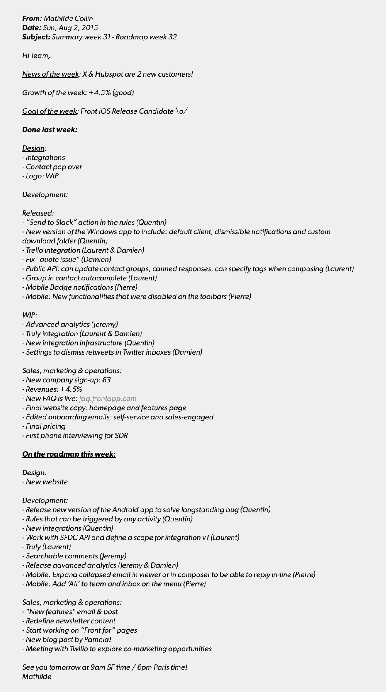
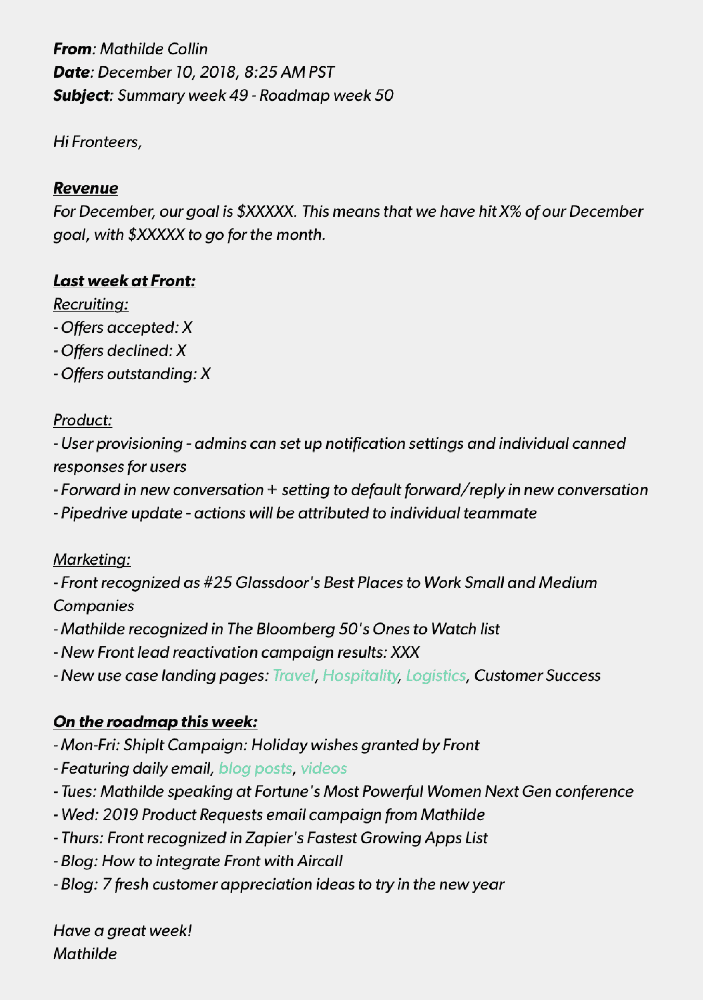
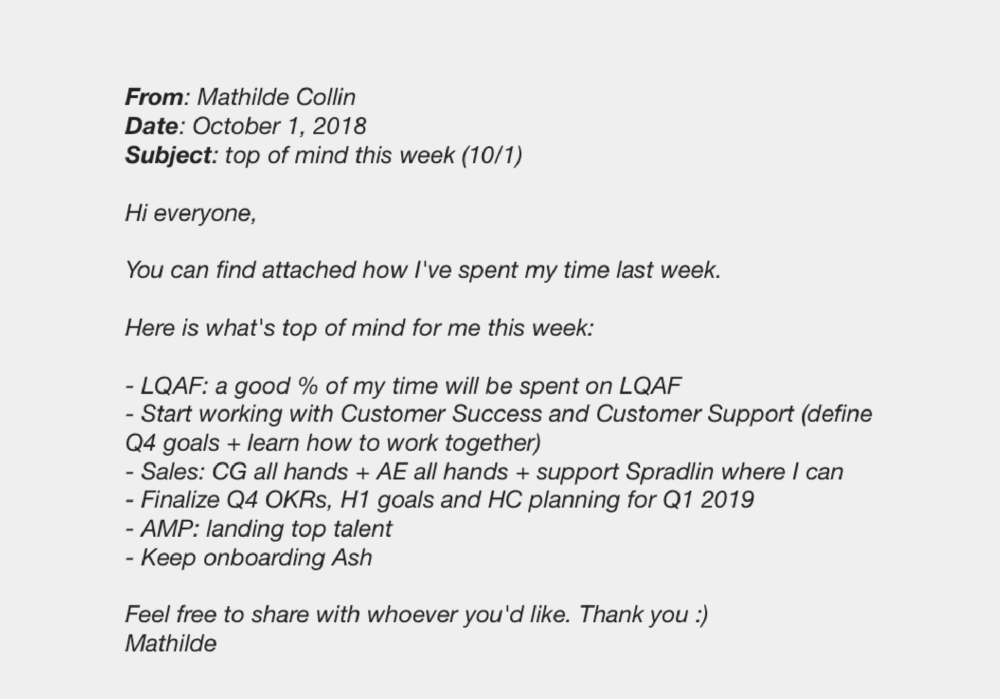
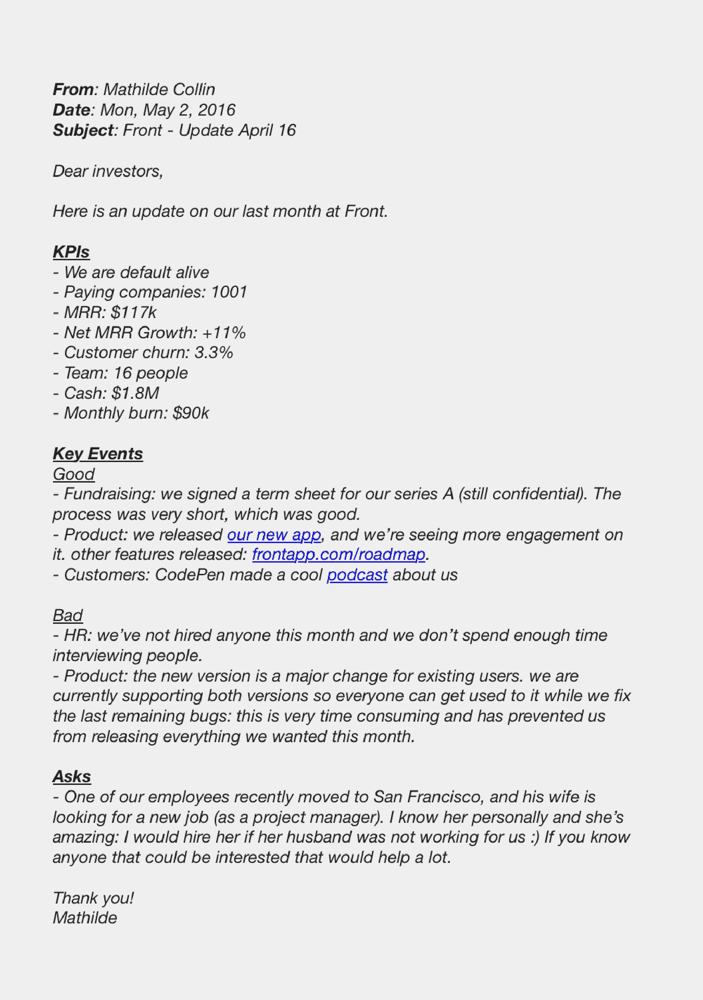
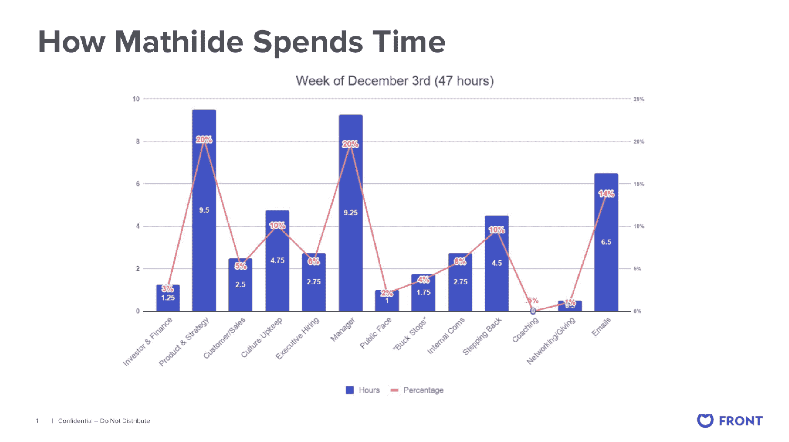
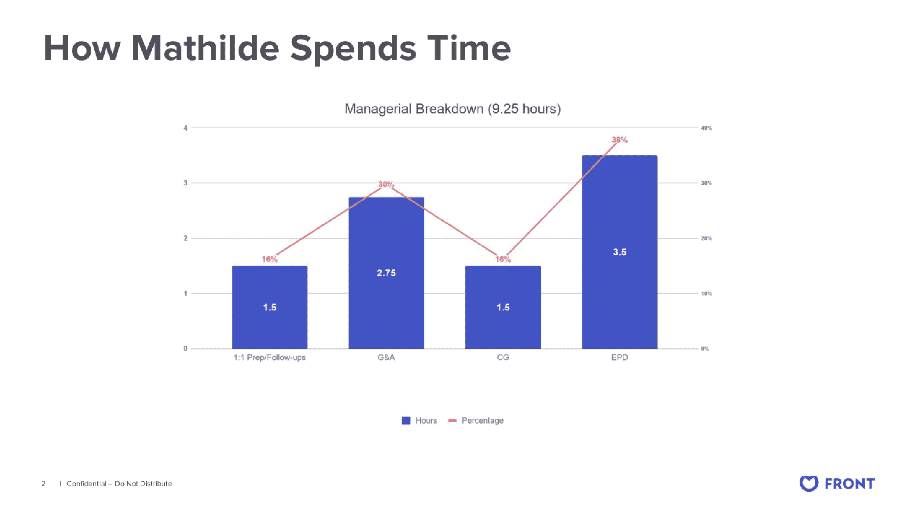

# 创始人纪律指南:Front 的玛蒂尔德·科林的经验教训|第一轮回顾

> 原文：<https://review.firstround.com/the-founders-guide-to-discipline-lessons-from-fronts-mathilde-collin>

## 介绍

**[前方](https://frontapp.com/ "null")** 有一个任何萌芽中的创业公司都会羡慕的故事。

过去四年的亮点包括扩大到 100 名员工，收购了 4000 多名客户，筹集了近 8000 万美元的资金，并完成了第一笔[收购](https://medium.com/@collinmathilde/front-acquires-meetingbird-bringing-email-and-calendar-together-in-the-inbox-15b7f4d74d55 "null")。

但是，正如联合创始人兼首席执行官 **[玛蒂尔德·科林](https://www.linkedin.com/in/mathilde-collin-bb59492a/ "null")** 所说，工作场所交流工具的迅速崛起不能追溯到他们早期 [Y Combinator](https://www.ycombinator.com/ "null") 的一个令人难以置信的创始愿景。事实上，科林当时并不确定该产品的发展方向，并对该公司是否会腾飞产生了严重的怀疑。

根据科林的说法，这家初创公司的成功反而植根于一个单一的特质:**纪律。**

这是一个我们以前听过的答案——毕竟，大多数领导者都用一层厚厚的勇气和决心来掩饰他们的职业生涯。无论是引人注目的股票照片上的励志名言，还是关于创业过程的令人鼓舞的博客文章，当企业家谈论成功时，纪律总是被视为一个反复出现的角色。

但是，尽管围绕这种品质的讨论充斥着各种各样的指令，但也往往缺乏细节和深度。很少有人超越关于努力工作的老生常谈，转而采用更本质的策略，将严格的纪律引入公司建设过程的各个方面。然而，科林是一个罕见的例外。

她对效率的专注和痴迷是表面下的推进器，有助于推动 Front 令人印象深刻的轨迹。从她质朴的电子邮件模板和精确的沟通习惯，到她疯狂快速的筹资过程和精心制作的日历，纪律是贯穿这位创始人生活各个方面的潮流。

在这次独家采访中，科林深入探讨了企业家比喻的战术要点，分享了为什么创始人的纪律比愿景更重要。她描述了她在沟通、时间管理、筹款和团队建设方面的方法，揭示了有效的做法，并分享了她赖以保持正轨的实际电子邮件。

# 为什么纪律——而不是远见——能走得更远

许多早期团队投入数百小时来确保产品路线图和公司使命尽可能清晰。描绘一幅潜力的图画是一种在地上立桩的方式——它通常是掩盖最初缺点的有用策略。但这并不是 Front 走向世界的方式。

“起初，Front 并没有给人留下深刻印象，甚至没有那么好。科林说:“我记得在 Y Combinator，有人告诉我，我们是这一批公司中最好的，我确信他说错了，他把我们和另一家初创公司搞混了。“四年前，我不知道我们今天会有多大，也不知道实现目标的计划——这更像是一场进化。”

作为一名创始人，一周中的任何一天，我都会选择纪律，而不是宏大的愿景。

“我肯定很多人会不同意我的观点。但是 Front 成功背后的驱动力是我们在旅程中的每一点都非常自律。科林说:“这并不是说我们缺乏雄心壮志。“这是要指出，创始人给自己施加压力，让自己制定一个影响深远的计划，并不总是有益或现实的——这当然也不是未来成功的预测。我在 B 轮融资中提出的愿景与我们在演示日展示的完全不同。更重要的是，我们决心通过纯粹的意愿，将这一理念的核心变成一家真正的公司，”她说。

科林说:“你可以有一个非常雄心勃勃、严密的计划，确切地知道你想去哪里，但有可能你会掉一些球或专注于错误的事情。”“致力于公司的愿景是必要的，但这是许多早期团队花费太多时间的事情；这项运动有一种自我关注的成分。底线更简单:**你是否有足够的纪律性去实现它？**”

为了解开这个基本问题，科林进一步剖析了这一本质属性:“在高层次上，纪律只关注少数几件事情，这是非常具有挑战性的，因为你有这么多事情要做，而且你被拉向这么多方向——每件事情看起来都很重要。但是纪律归结为关注*正确*的事情，这意味着你需要非常清楚成功是什么样子，以及如何衡量它，”她说。

科林通过提出一系列问题来进行重点评估，从而分解了创始人纪律中最重要的元素:

**取得进展:**你用什么标准来衡量公司是否成功？你如何围绕他们来引导你的整个团队？您交流更新的频率和持续时间如何？

管理时间:你的日历真的反映了每周的优先事项吗？有没有一项活动你没有花足够的时间去做？你是否有断开连接并离开的纪律？

筹资:你是如何管理你的投资者的？你是否经常更新你的进展，加强你的推销并主动建立关系？

**团队建设:**为了持续创造良好的工作环境，你在做什么？你如何确保每个雇员都符合你的标准？

这四个桶中的每一个都可以优化并注入额外的严格性。但是根据科林的经验，很少有人来做这种额外的脑力劳动。“许多创始人陷入了经营一家初创公司的日复一日的混乱之中，”她说。“对你做的每一件事都运用自律的心态，无论是给团队发电子邮件、给投资者做演示，还是在公司外，看似简单，但却非常有影响力。”

如果你不自律地管理自己的时间，不虔诚地跟踪公司的进展，你将很难成功。

# 自律沟通:每位创始人都应该发送的三封电子邮件

当羽翼未丰的初创公司努力寻找自己的立足点时，解决高可见性指标成为主要关注点。但是根据科林的经验，仅仅追求进步是不够的——围绕沟通的额外纪律提供了使这些目标更有可能实现的责任。

对科林来说，这种纪律存在于她自 Front 成立之初就以几乎令人恐惧的频率发送的三封精心设计的电子邮件中:每周向整个公司更新一次，向她的直接下属说明一次，每月向她的投资者更新一次。请继续阅读，深入了解她是如何制作它们的，以及为什么它们对 Front 的结果至关重要。

### 收件人:所有用户主题:收入更新

与大多数创业公司一样，Front 的早期特点是对收入的痴迷。“如果这些数字没有上升趋势，我们就没有借口。因此，我开始每天给团队发电子邮件，把这个指标放在前面和中心。它解释了我们昨天增加了多少收入，哪些做得好，哪些做得不好，”Collin 说。

“我很快就把它改成了每周一封电子邮件，因为这是一种更好的节奏，但从那以后，我每周都给整个公司发这封电子邮件。它总是具有相同的结构，并且在大约相同的时间发送。她说:“在过去的四年里，我一次也没有错过。

“在最初的几年里，我完全是自己写的，大概花了我一个小时，”科林说。“对于一个早期创始人来说，每周花在内部报告上的时间似乎很多，但这是至关重要的。在所有成长的痛苦中，人们确切地知道成功意味着什么，并通过“我们如何才能让这个数字上升？”的镜头来评估他们所做的一切"

**发送文件夹:**下面是 Collin 每周发送给前台团队的电子邮件的早期示例。

**已发送文件夹:**这是一个更近的、真实的(略加修改的)例子，说明随着 Front 的扩大，Collin 的每周电子邮件模板是如何随着时间的推移而发展的。

对于科林来说，这种透明带来了力量和压力。“分享好的、坏的和丑陋的提供了责任和强制功能。她说:“如果你看到不太好的数字，你会忍不住找个借口，指出另一个亮点，或者推迟分享，直到情况有所改善。”“或者你可能会转移注意力，去做另一个项目。但你不能这样做。”

专心于单一的度量。如果没有改善，抵制放松和专注于其他事情的轻松舒适。坚持到底。

### 收件人:直接下属主题:本周目标

作为问责制的另一项练习，每周一上午 10 点整，科林的收件箱里会发出一封不同的电子邮件:一封写给她直接下属的便条。

“我很快就完成了本周的所有目标。这不是告诉你的报告你要做的每一件事。相反，这是一个分享你最关心的事情的机会，当然也应该是他们最关心的事情。更一般地说，了解经理们如何支配时间是有帮助的——相反，这更像是一个黑箱。她说:“这也是为什么我把我的[日历公之于众](https://www.fastcompany.com/90212792/why-this-ceo-makes-everything-she-does-transparent-to-all-employees "null")和[分享一副牌](https://medium.com/@collinmathilde/breaking-down-my-job-as-ceo-of-front-8d884cca172a "null")，解释我作为 Front 首席执行官一整天都在做什么。这个邮件习惯也树立了一个榜样。科林说:“如果我开始下滑，或者如果我的周数没有达到我们关注的大目标，那就传达了错误的信息。”

**已发送文件夹:**下面是 Collin 的直接下属电子邮件的一个实例。

### 致:投资者主题:每月更新

科林最喜欢用的另一个技巧是给 Front 的投资者发送更新邮件。“多年来，我每个月都发同样的短信，只是在我们的 B 系列之后，才改为每季度一次，”她说。

**已发送文件夹:**下面你会看到一个例子，说明科林给投资者的说明实际上是什么样子的。

Collin 对向投资者展示你的关注的力量的信心增加了，因为她现在在桌子的另一边。

“自从我开始天使投资以来，我对这种做法的感受更加强烈。她说:“在一位创始人给我发了两三封更新邮件后，我马上就能感觉到这家公司是否会成功。“有些人发了一封电子邮件，然后你就四个月没有他们的消息了。其他人每次都使用不同的格式或指标。或者，他们在一次会议上说收入是重中之重，然后在下一次会议上说他们专注于参与度并重新设计应用程序。那不是更新，那是借口。她说:“如果收入没有达到需要的水平，承认你对投资者、你的团队，尤其是你自己有问题，这样你就可以开始回到正轨。”

常规的交流是不可思议的强大。如果你不能给你的投资者发送集中一致的更新，你可能会成为那些失败的创业公司之一。

# 在日历中寻找焦点:时间管理技巧

当问及科林如何管理时间时，她坦率地承认:“当谈到我的日程表时，我真的疯了。她说:“我非常警惕地确保自己把时间花在正确的事情上。

这一论断得到了快速浏览她的日程表的支持——每个时间段都被占满，每一分钟都被占满。科林说:“如果我不总是知道自己在做什么，那么我就会沉迷于查看电子邮件或回答问题，而不是专注于我在一周开始时说过的最重要的事情。”但这并不意味着她的日程表上排满了会议。在一个[制造商和经理的时间表](http://www.paulgraham.com/makersschedule.html "null")之间的辩论中，科林站在中间。

“当我在日历上添加事情时，它们并不总是会议。我给自己安排了很多约会来完成特定的项目。她说:“这可能意味着取消一些更大的活动，比如‘T7’文化时间‘T8’会议，专门用来思考公司里的每个人，评估是否有人看起来不开心。“但我也会预定几项 15 分钟的任务，比如给我的直接下属写电子邮件，或者阅读最近的一项见解调查。”

为了更深入地了解她是如何度过时间的，科林分享了五个给拥挤的日程表带来纪律的小贴士:

### 拦截和处理:创建一个邮件窗口，选择退出通知。

科林说:“在我的日历上，每天有两个 30 分钟的专门时间来查看我的收件箱，我尽最大努力不在这些时间之外看它。”为了有助于保持进度，除了日历提醒之外，她完全放弃了通知。

“我已经禁用了手机和台式机上的电子邮件、聊天和其他工具。她说:“我的日程表是开着的，所以我不会错过任何事情，但是抛开其他事情提高了我的效率，也大大减轻了压力。”。“我发现它非常有用，于是我要求整个前台团队也停止发送通知一周。现在，在周末，我甚至会注销所有的应用程序，这样就不会有诱惑了。”

### 退后一步，理清思绪。

在科林所有的日历优化实验中，“T2”将时间倒推“T3”是最有价值的。“每周有半天时间，我只允许自己用笔记本——而不是电脑——来真正专注于一个关键问题，”她说。“我对此做了不少修改，比如一周几次把它分成一个小时，但我发现这让我更难集中注意力。”

科林还留出 10 分钟的晨间冥想时间来进行反思。“我每天在家冥想，我们每周为前队举行一次冥想。这真的改变了我的生活。没有立竿见影的效果——这完全取决于你的训练，因为这是你正在训练的肌肉。但当我的[联合创始人生病](https://www.fastcompany.com/90248033/what-i-learned-about-resilience-when-my-co-founder-got-sick "null")时，这真的改变了我的看法，”她说。“创建一家公司压力大得令人难以置信，但还有更重要的事情，这个日常习惯提醒了我这一点。”

### 周五和自己定一个日期来组织下一周。

科林说:“我需要确切地知道我想要实现什么，这需要额外的准备，这通常是许多人在事情变得紧张时首先要做的事情。”下面是她的过程:

“每周五下午，我都有 15 分钟的‘查看日历’时间。我回顾了我们的季度目标和一些首要话题。科林说:“然后，我会查看自己下周的日程表，以确保时间吻合。“例如，招聘现在对我来说是一个巨大的推动力，所以我需要花大约三分之一的时间面试高管。当我看我的日历时，它排满了产品会议，或者我只安排了一次面试，那么我知道我做得不够，无法取得进展，所以我会增加一个采购会议。”

科林发现这个练习是另一个安全措施，可以确保她分配足够的时间做正确的事情。“这也与我每周发送给直接下属的电子邮件相吻合。她说:“如果我告诉他们，我这一周的目标是决定新的销售组织会是什么样子，那么我最好就此召开一些个人工作会议和重要会议。

### 分析你的时间，将意图与现实相匹配。

在她的推特粉丝中，科林因偶尔[分享她如何度过时间的图表](https://twitter.com/collinmathilde/status/1029030092045832194 "null")而闻名。

下面是一个更近的例子，说明她每周都会进行的精确分析:

“在每个周末，我都让我的 EA 给我发一份日历分析，”Collin 说。“它是按活动类型划分的，如面试、销售、管理等。这就是我如何表明我需要加大招聘力度的原因。我也会在团队层面上审视这个问题，看看我是否花了太多时间在某个团队上，而忽略了另一个团队。”

### **花点时间把它写下来。**

除了分享她每天是如何度过的，Collin 还慷慨地分享了她作为创始人的一个窗口，她通过[写文章](https://medium.com/@collinmathilde "null")为创始人提供非常有策略的细节。毫不奇怪，制作这些作品所需的写作时间是精心安排的。

Collin 每周有两个 30 分钟的时间在她的日历上写作，她的目标是大约每两个月在她的媒体页面上发表一篇文章。“老实说，我只在大约 75%的时间里保留这些写作时段，”她说。“纪律更多的是围绕实现每隔一个月发表一次的结果，所以如果有必要，我会强迫自己找一个话题。”

Front CEO and co-founder Mathilde Collin

# 聚焦筹款:闪电回合的秘密

虽然她的电子邮件习惯和时间管理策略令人印象深刻，但科林在科技界最出名的可能是她的筹款能力。

她在短短 10 天内就为首轮融资拿到了三份投资意向书，并将 B 轮融资过程的时间限制在仅仅一周(T1)，带走了 10 份投资意向书。更令人印象深刻的是她慷慨地承诺与他人分享她的最佳实践。科林将她的[系列 A](https://medium.com/@collinmathilde/front-series-a-deck-f2e2775a419b "null") 和[系列 B](https://medium.com/@collinmathilde/front-series-b-deck-6dc686267a24 "null") 卡牌放在网上让全世界看到，突出了她收到的强有力的幻灯片和反馈。

为了延续这种分享的精神，科林揭开了帷幕，讲述了她是如何锻炼出完成这些筹款壮举所需的肌肉的:

### 在你需要之前发展关系，但是不要害怕退缩。

虽然这些快速的融资周期似乎是初创公司 kismet 的东西，但科林很快指出，她之所以能够这么快筹集到资金，是因为她提前做了跑腿工作。在她看来，这些回合并不是 5 到 10 天投球的总和，而是四年仔细下棋的高潮。

这是因为在 nabbing Front 的第一轮种子期之后，Collin 一直保持着筹款的心态。“我开始主动与我喜欢的公司的合作伙伴建立关系，每三到六个月与他们会面一次。她说:“一旦我们开始筹集资金，我就可以依靠这些关系马上与合伙人见面。“但更重要的是，我知道无论谁投资了我们的首轮融资，都会获得一个董事会席位，所以尽早了解合作伙伴意味着我在决定与谁合作时处于更有利的位置。”

希望复制这种策略的早期创业者应该注意，这是质量问题，而不是数量问题。“我关注了大约五个合作伙伴。科林说:“只和一个投资者深谈是孤注一掷，但培养 20 个关系会分散你的注意力。”

这些与投资者正在进行的对话应该超越商店谈话。“一旦你进入筹资过程，这一切都发生在一瞬间。因此，对我来说，这些会议不仅仅是关于 Front 如何运作的报告，而是一个了解合作伙伴的机会。我问他们喜欢和不喜欢投资的什么，或者他们在工作之外做什么，”她说。

如果你在需要投资者之前就专注于与他们建立关系，融资的飞轮会转得更快。

科林提醒说，创始人在进行这些对话时需要深思熟虑。“投资者总是在寻找关于你公司的信号，但请记住，你可以控制谈话的方向，以及他们能够发现什么，”她说。“每当我被问及我们的收入或客户数量时，我总是分享一些比我们实际数字稍低的东西。我希望有一些灵活性，以防事情不如预期，但这也使我能够将好的金块留到我们实际加注时使用。”

### **2)养还是不养——不要让它拖。**

就像大多数事情一样，在筹集资金的时候，时机就是一切。但是决定什么时候扣动扳机需要在艺术和科学之间的微妙空间里航行。

在科林看来，当创始人让他们的筹资努力拖延下去时，他们就会动摇。“我一直对整个过程不耐烦。当你决定加注时，你必须全押；她说:“这种抚养方式是在浪费你的时间。“在我花在首轮融资上的整整 10 天里，我没有在前线做任何其他事情。我们只有不到 20 名员工，所以我离开去管理融资对我们的生产力产生了巨大的影响。我想回去工作，所以我把我的一切都投入进去——并且学会了什么时候停止“购物”"

科林还依靠与投资者的开放式沟通来加快她的 B 轮融资。“一个和我聊天的合伙人偶然提到他会投资我们的下一轮。我很认真地对待他——我用那份投资意向书作为杠杆，压缩了其他所有人的时间表。她说:“花时间在这段关系上，然后全身心地投入到抚养孩子的过程中，这种训练让我能够设定条件，迅速行动。

把速度放在一边，大多数创始人都在努力解决一个更大的问题，即确定何时筹集资金。Collin 确定了她考虑的三个因素:对业务感觉良好，达到上一轮设定的指标，以及需要额外的资源来实现新的宏伟目标。

“对业务感觉良好是非常主观的。这并不是说你达到了某个标准就万事大吉了。科林说:“我一直听说年化收入达到 100 万美元是首轮融资的基准，但当我们达到这个水平时，我仍然感觉不太好，所以我没有加注。“**如果你因为你的一个客户刚刚翻脸、一笔交易告吹或一名员工引发问题而感到不自信，那将渗透到整个过程中。**作为一个创始人，再小的事情也能占这么大的顶空。你必须有正确的心态去抚养。”

为了说明“感觉良好”是什么样子，科林分享了两个例子:

**追求新的宏伟目标。**“就在我们进行首轮融资之前，我们连续三个季度表现出色。大约在同一时间，我和一家品牌代理公司谈过，但价格相当昂贵。她说:“这让我想到，如果我有更多的钱，我可以进行更多的长期投资。

对未来充满信心。“我们的 B 系列完全不同。我们还有很多跑道。但我和几名员工共进晚餐，他们告诉我，我们的使命宣言并不那么鼓舞人心，”科林说。“因此，当我们在开发一个新的产品并讨论 Front 的未来时，我对这个巨大的机会越来越有信心，我决定提高我们的下一轮融资。”

你的指标不会在下一轮比赛前突然到位——即使它们到位了，也可能不够。你的精神状态非常重要，所以寻找让你兴奋的时刻，并充分利用它们。

### 记住无论如何都会有压力——做好被刺痛的准备。

尽管 Front 有一个传奇的 B 轮融资，但 Collin 很快指出这远非没有痛苦。

“我总是收到人们的评论，说他们是多么羡慕我们的快速回合，这肯定是多么容易。但是每一个想要成为创始人的人都需要知道，这总是会有压力的。她说:“尽管我们进行了能想象到的最顺利的融资，但仍然非常艰难。

科林将这种压力归因于被拒绝的痛苦——这种痛苦永远不会变得容易。“当人们告诉你他们不想投资你的公司时，这是作为创始人你能听到的最难的事情之一，”她说。“当客户不想买你的产品，或者一个伟大的领导者拒绝了一个提议时，你总是可以指出其他事情，比如价格或工资。但当一个投资者经过时，他们会告诉你‘我认为你的公司不可能比现在更大了’，这总是令人伤心。”

### 专注于故事，让你的甲板纪律严明。

至于赢得所有这些条款清单(后来在互联网上积累了数百万次浏览)的推介资料，科林分享了它们是如何走到一起的——以及为什么纪律是必不可少的。

“人们很容易把你能找到的所有指标都塞进去。但为了增加胜算，你在向投资者陈述时必须非常自律。把推销想象成一个等待被讲述的故事，而不是一组被串在一起的幻灯片。她说:“我来这里不是为了报告 Front 在过去四年里做了什么，我来这里是为了描绘一幅图画。”。

开始绘画时，科林总是从在文档中打出一个真实的故事开始。“我甚至不考虑幻灯片，”她说。这个故事基本上遵循着同样的公式:这是我们创立这家公司的原因，这是它成功的原因，这也是它可以扩大一百倍的原因。只有到那时，我才开始查看数据，考虑包括哪些指标，只要它们符合其中一个类别。指标对于回答投资者的问题很重要，但它们不是卖点。他们需要一个故事来支持。"

想出你想在推介中讲述的故事，并写下来——无需打开 Keynote。然后选择有助于你完成更大故事弧线的数据。

### 对你的投资者进行尽职调查。

对于希望追随她筹资脚步的创业者，科林给出了最后一个建议。“风投在投资之前会深入了解你和你的公司，但要记住，勤奋是双向的。你可以随时解雇员工，但你的投资者会留下来。她说:“这就是为什么当我们考虑让红杉的布莱恩·施莱尔(Bryan Schreier)参与我们的 B 轮融资时，我和他所在的几乎所有公司的创始人都进行了交谈。

“在那些谈话中，我在寻找两样东西:**我希望加入我们董事会的人既有爱心又有挑战性**，这是一个很难找到的组合。你不想要啦啦队员，但你也不需要太多的额外压力。”为了深入了解潜在投资者的背景，科林使用了这些定制的问题:

分享一些他们关心他人的例子。

他们通常会在哪些方面挑战你？有帮助吗？

告诉我他们让你失望的一次经历。你觉得你可以进行公开讨论并给出反馈吗？

回顾你们工作关系的早期，知道你现在所知道的，你会如何以不同的方式管理他们或与他们互动？

# 纪律严明的团队建设:突出影响力(上演一出办公室音乐剧)

Collin 将同样的规律和意图带到了她的内部团队建设工作中——并且有结果可以证明这一点。Front 拥有 5 星[玻璃门评级](https://www.glassdoor.com/Overview/Working-at-Front-EI_IE1356926.11,16.htm "null")，内部 NPS 为 87，而在过去 4 年中只有少数人自愿离开公司。

“如此高的员工参与度是我们培养透明度的结果，也是我们致力于让人们感觉他们有影响力的结果，”Collin 说。除了每周的电子邮件将每个人与他们正在努力实现的主要指标联系起来，Front 还有一些更小的举措来突出影响，例如使用“本周 Fronteer”和“本周 Stumble”作为分享胜利和学习的机会(并颁发用乐高积木制作的奖杯)。

The Lego trophies awarded to a member of the Front team each week.

这家初创公司还接受有趣的(定期安排的)活动，比如每月的棋盘游戏之夜，或者整个前台团队每年上演一次的音乐剧。最近的作品包括《悲惨世界》的舞台表演(科林当然扮演了珂赛特)和一首迪斯尼歌曲。

“这是一种程序化的方式，让人们有机会变得非常脆弱。科林说:“无论他们是跳舞、唱歌、叙事还是演奏乐器，这都能让团队团结起来。“总的来说，我们非常守纪律，每周、每月或每年都有相同的节目。**给你的团队接触点带来规律性，确保它们不是人力资源部门的一次性举措，也不是逐渐消失的传统——创造一些员工可以依赖的东西**，”她说。

然而，科林并没有把太多的重量放在前面的文化活动的方法。她说:“许多初创公司把太多的团队建设精力放在活动或异地，开始忽视他们文化的核心:雇佣与你的价值观一致的人。”。

Collin 将她标志性的纪律应用于扩大 Front 的团队——以至于经过六个月的寻找，她仍在寻找财务主管。“我们有 100 多人，我们已经筹集了 8000 万美元，我在 it 方面没有任何经验，但我仍然没有找到拥有合适技能并符合我们价值观的人——所以如果你知道我应该和谁谈谈，让他们来找我，”她说。“但是严肃地说，**你必须非常自律，表现出克制，不要雇用，即使你迫切需要填补一个角色**，”

为了进一步巩固这一原则，科林重温了她从 [Stripe](https://stripe.com/ "null") 的[帕特里克·科利森](https://twitter.com/patrickc "null")那里得到的[建议](https://medium.com/@collinmathilde/9-most-useful-piece-of-advice-ive-received-15ebb7a47008 "null"):“他告诉我，在雇佣某人之前，考虑一下你是否希望你的公司里有十倍于他们的人。因为他们会按照自己的模式雇佣员工，这是每个人都需要清除的障碍。”

事件不是文化。它们是你为了建立它而做的事情，但它们本身并不是目的。在你雇佣谁和你如何实践你的价值观方面要有纪律——这就是文化。

# 概括起来

当开始创业时，时间是最宝贵的资源，动力是目标。这就是为什么创始人的自律和深入钻研的意愿，可能比为公司规划一个宏大愿景的能力更具决定性。

为了给你的日常生活带来更多的纪律，应用科林的个人习惯中的以下几点:

**通过更加一致的沟通来实现目标:**通过定期与您的团队、直接下属和投资者沟通，专注于移动单一指标。为了提供一个额外的责任层，模板化你最重要的信息，永远不要错过更新。

**管理你的时间以找到重点:**通过每周五回顾你下周的时间表，并分析你实际上是如何度过时间的，来制定日程表，使工作与规定的优先事项相匹配。通过关闭查看邮件、写作和冥想的专用窗口，创造出后退和反思的空间。

**更快地筹集资金:**通过主动与投资者建立关系并对投资者进行仔细调查，缩短你的筹资时间表。通过考虑你的精神状态和展望你想要达到的里程碑来评估这是否是“正确的”提高时间。确保你的推销是一个故事，而不是一组数据点。

**建立更好的团队:**通过定期开展文化项目来提高员工的忠诚度和参与度。但是请记住，事件不是文化，而是人。如果你不想团队里有 10 倍于他们的人，就不要雇佣他们。

*电子邮件和时间分析示例由玛蒂尔德·科林提供。摄影由**。*