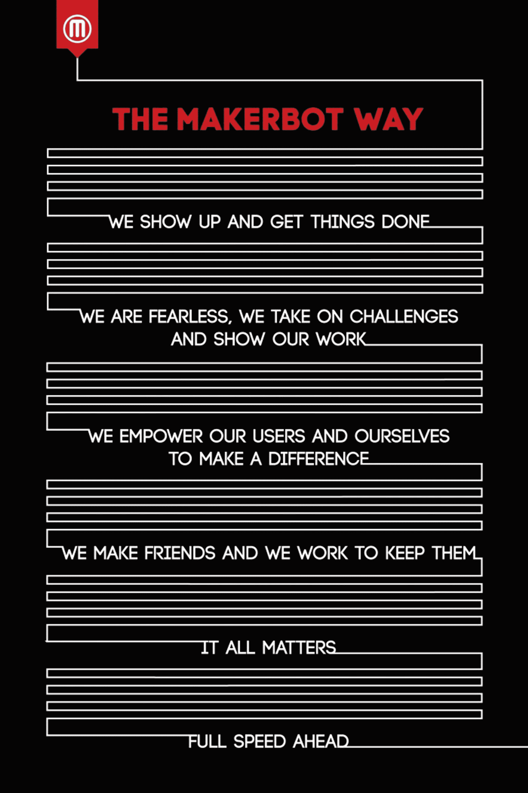
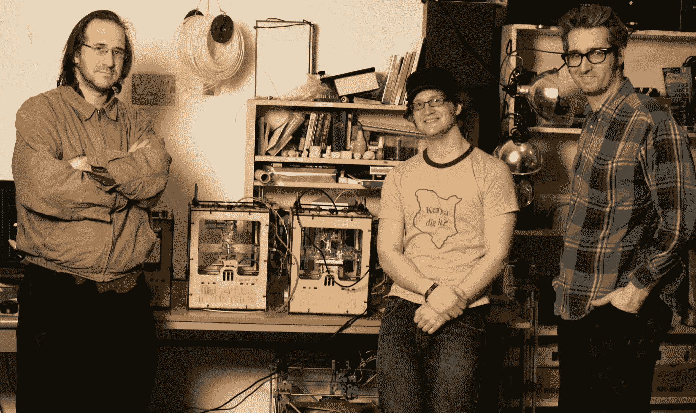
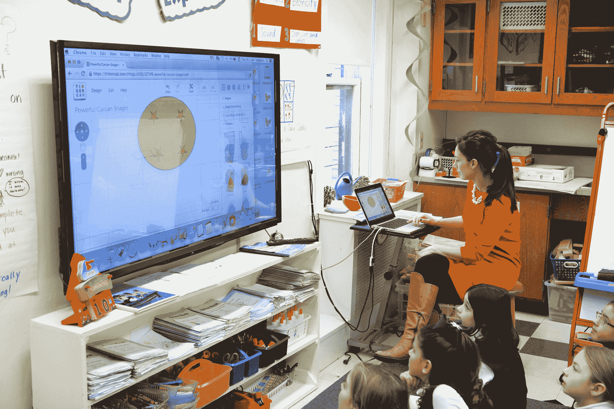

# MakerBot 背后的人寻找建立你的品牌的故事|第一轮评论

> 原文：<https://review.firstround.com/the-man-behind-makerbot-on-finding-the-stories-that-build-your-brand>

当创始人 **[Bre Pettis](http://www.brepettis.com/ "null")** 在 2009 年创办 **[MakerBot](http://www.makerbot.com/ "null")** 时，他遇到了许多精明的人，他们根本不相信桌面 3D 打印会有市场。公平地说，这个术语实际上是他自己发明的。但是仅仅六年后，MarkerBots 已经进入了成千上万的家庭、学校、创业公司甚至财富 50 强企业。

是什么触动了开关？佩蒂斯曾是一名美术老师，他指出自己花了多少时间讲述 MakerBots 和喜爱它们的人们的故事。他向客户、投资者、潜在员工和许多其他受众讲述故事——所有这些都只有一个目的:突出他所知道的产品对真实人物的影响。他谈到一家医院在一个季度内节省了 6 万美元用于打印自己的耗材；初创公司创始人在他们自己的空间里以思维的速度自由迭代；一名小学生强占了老师的打印机为自己做了一只假手。

一个好故事中有力量。这是任何创始人都可以也应该掌握的权力。在这次独家采访中，佩蒂斯分享了他从多年的创业故事讲述中学到的经验——如何精心制作一个基础故事，什么使得内容本质上是可分享的，以及为什么传统媒体报道比你想象的更容易获得。

# 找到你的宣言

创业公司的故事需要变形。你需要一个能说服人们给你钱的版本，一个能说服明星人才加入你的团队的版本，一个能让第一批顾客抓住你的机会的版本。这些故事生活在不同的地方，有不同的目的。一个可能永远不会被写下来，一个可能只会通过电子邮件发给特定的人，一个可能会以视频的形式出现在你网站的顶部。但它们应该都源于同一个核心。

佩蒂斯说，为了正确理解这些版本，你需要从识别这个中心叙事开始。你为什么做你的工作？为什么它解决了一个重要的问题？它会带来什么变化？为什么你的产品值得关注？

你需要真正有意识地树立你在这个世界上将要成为的样子。

这并不意味着把自己锁在一个远离世界的房间里，直到你有了防弹的东西。“你可以通过网络非常擅长讲述你的故事，”他说。在 MakerBot 的早期，他几乎每天晚上都出去参加活动，与人们谈论公司在做什么以及为什么做——一遍又一遍。他也不只是背诵同样的东西。他密切关注似乎最能引起共鸣的几点。最终，它们成了他叙述的骨架。

佩蒂斯大力提倡从一开始就建立他所谓的“规则”。你也可以称它们为价值观或信条，但它们本质上是你所信仰和关心的东西的陈述。你应该把它们写在纸上。

“就在我开始制作 MaketBot 的时候，我和 [Kio Stark](http://www.kiostark.com/ "null") 共同创建了“[完成宣言邪教](http://www.brepettis.com/blog/2009/3/3/the-cult-of-done-manifesto.html "null")”。后来，当我们准备出售公司时，我们创造了“[MakerBot 方式](http://www.makerbot.com/blog/2013/06/14/the-makerbot-way/ "null")”，真正提炼出公司是什么，以及如何保持这一点，”他说。你的品牌词汇可能会随着你的成长而演变，而产品描述几乎肯定会改变。但是，这些提醒你早期信念和意图的试金石将帮助你塑造始终反映你的品牌最好的故事。

对《完成宣言》的崇拜引起了如此大的共鸣，以至于 MakerBot 的粉丝们实际上制作了艺术品和海报来传达其观点。这里有一个:

MakerBot 方式继续以其简单易懂的信息图表的形式出现在公司网站上:

对于一名前艺术教师来说，佩蒂斯将这种设定规则的练习比作从调色盘中绘画可能并不奇怪。“当你只用五种颜色而不是一千种颜色时，你可以混合这些颜色并做出惊人的事情，”他说。“给自己设限会让你专注于重要的事情，让你在那里做的每件事都有联系和连贯性。”谈到你的创业，确定你最珍视的原则会让你讲的故事更真实。

写一份宣言，抓住你在世界上踢屁股的方法。

这是发展真正打动人的品牌的关键一步。佩蒂斯说:“品牌实际上是将你所做的事情浓缩成核心信息，然后以非常真实和直接的方式重复这些信息的结果。”你的品牌应该反映在你分享的每个故事中，通过视频，新闻稿，甚至推特。

在 MarketBot 的例子中，每件产品在上市前都会经历一两年严格的品牌化过程。最后，公司里的每个人都知道用来描述它的准确短语，这些短语不仅突出了它的优势，还说明了它如何融入公司更广泛的 3D 打印运动。“每个产品简介都为我们提供了讲述故事的语言。我们对自己和顾客一遍又一遍地使用相同的短语。从更大的意义上来说，我们是谁，我们在努力做什么。”

例如，公司[在其网站上展示了“世代”的产品](http://store.makerbot.com/ "null")，指出随着团队对 3D 打印机以及人们如何使用它们有了更多的了解，该技术一直在不断修订和改进。这是他们谈论 [MakerBot 复制器](http://store.makerbot.com/replicator "null")(及其[迷你版](http://store.makerbot.com/replicator-mini "null"))的基础。这不仅关乎产品特性，也关乎公司对迭代的历史承诺。

**我们的目标是让您和您的客户对您的公司有相同的理解。对于大多数品牌来说，这是一个罕见的成就，即使是大品牌。佩蒂斯说:“好的品牌创造了一个与你的顾客融为一体的心智，这样你就给了他们他们真正想要的东西，他们也清楚地知道从你这里能期待什么。”**

它也在你的组织内创造了相同的思维——这是一个非常重要的副产品。佩蒂斯发现，MakerBot 的沉浸式品牌研讨会是让每个人在内部保持一致和兴奋的非常有价值的工具。在这些研讨会上，公司里每个接触或可能谈论产品的人都聚在一起，积极地集思广益，确定将被重复使用和回收的词语和短语，以推广、销售和描述该产品。为了呈现一个统一战线，你需要你团队的每个成员都了解你的品牌，就像他们能记住产品规格一样。考虑到这一点，初创公司可以将产品发布等关键里程碑转变为机会，让每个人都在使命、愿景和公开分享的内容上达成共识。

“你所说的很重要，”佩蒂斯说。“同样重要的是，你的团队在说同样的事情，你们都同意什么是特别的，值得分享。”让很多人参与这个过程肯定会让事情慢下来，但它也会过滤掉那些不具备影响市场所需的强大情感吸引力的故事。

# 不要为了讲故事而讲故事

一旦你确定了你的元叙事，它为你的工作提供了动力，并说服了合适的人，是时候开始享受乐趣了。你可以讲一些改变人们看待事物方式的故事。这就是一个好故事所做的——它改变了人们。他们开始以一种方式阅读或观看一些东西，在一分钟或更短的时间内，他们自己就变得不同了。佩蒂斯说，把这作为你做任何事情的目标。他有几年来积累的一些要点，让这一切成为可能:

将你的热情投入到工作中去

“这是人的天性:当你听到有人对某事感到兴奋时，你也想为此感到兴奋，”佩蒂斯说。最重要的是，你的故事需要反映你对解决手头问题的极度热情和你产品的优点。人们必须知道你在其中，因为你有绝对的信心，你正在做一些伟大的事情。能够不仅仅用语言，而是用你的整体语气和性格来表达这一点，是一种不可思议的财富。断然不要耍酷。

这种热情的一个巨大来源是创始人的个人故事。这是每一个创业故事的关键元素，但你可以把它定位成让你为公司做的事情更有分量。创始人不仅仅是想出一个主意，找到一个市场，他们还为组织建立文化和性格。不管是好是坏，[它成为了他们是谁以及他们看重什么的延伸](http://firstround.com/review/80-of-Your-Culture-is-Your-Founder/ "null")。

例如，MakerBot 的宗旨就是激发和帮助人们释放他们的创造力。早些时候，这反映在佩蒂斯公开分享的一个非常私人的故事中。“我做过木偶师、艺术家、摄像师、设计极客，”他说。“所以一开始，这个故事实际上只是关于我、我的联合创始人、一台激光切割机和一个愿景。现在，这个故事要大得多，也不那么个人化了。它随着我们的成长而改变，现在它是关于在美国制造，加速创新等等。但无论规模大小，我们仍会讲述大量帮助个人做好事的故事。”

MakerBot's original founding team (from left) Adam Mayer, Zach Smith and Pettis with their first prototypes.

在全新市场开拓创新的创始人将面临额外的挑战和好处，他们不仅要撰写关于自己公司的故事，还要撰写一个展现在他们面前的整个领域的故事。

当你在开创一件事的时候，没有预测模型。

如果你必须解释什么是激进的新产品，复述传达愿景和真实体验的故事往往比事实和数字更有意义。这是初创公司在试图获得第一轮融资或初始人才时应该记住的事情。佩蒂斯说:“没有多少创业公司有机会主导行业对话。"如果你是他们中的一员，充分利用它."

*先取悦自己*

“每次我们展示这项技术的用途时，我们总是试图从我们发布的品牌资产和故事中获得乐趣。我以前每周都会自己做一个视频，只有在我们做一些新颖独特、积极创新的事情时，这才是有趣的。”

就佩蒂斯而言，如果能让人们观看，猫追逐激光的视频不会被取消。你的第一个观众是你自己和你的直属团队。如果你正在创造的东西在你制作的时候没有给你带来娱乐，那么你可能走错了路。这可能看起来很主观，但是你需要从中获得乐趣，以此来吸引、愉悦和惊喜你的观众。这种情绪要么表现出来，要么彻底消失。相信你的品味。

请记住，你并不局限于博客文章、视频和社交媒体。这些格式很棒，它们可能会为你的品牌做大量的叙事工作，但对什么是讲故事没有任何硬性限制。

“在我们的筹款活动中，我们会去参加会议，然后把一大包 3D 打印零件扔在桌子上。这是一个丰富的东西，我们可以通过我们面前的物品来讲述 MakerBot 的历史和能力，”佩蒂斯说。对 MakerBot 来说，它的产品是一个激动人心的、有触觉的证明，证明了他们的潜力。它们引人注目，但也触及了公司宗旨的核心。只要你的信息清晰有力，不要害怕尝试不同的媒介。

*把好斗变成你的优势*

创业公司最大限度地利用极其稀缺的资源有着悠久的传统(和行业价值)。说到讲述真实的故事，这实际上可以成为一种优势，而不是一种约束。“我带着对 MakerBot 特殊美学的真正承诺来到这里，”佩蒂斯说。“我个人痴迷于拍摄照片和视频，我们最终在面向客户的材料中使用了所有这些东西。”

你肯定想让你制作的每样东西都尽可能的好——但是这是你自己做出来的，体现了你的风格。当你出于需要用内部人才开发和执行一种美学时，你就有更好的机会找到真正展示你的公司和喜欢它的人的特点的东西。在 MakerBot 的案例中，Pettis 创造的营销资产确实对粉丝和买家起了作用。

**寓意:**如果你或你早期团队中的某个人可以提供一项技能，即使是业余水平，也要好好利用。给他们需要的东西，让他们变得更好，特别是如果他们喜欢做的事情会让他们与品牌联系得更紧密。在这种情况下，人们的工作描述是什么并不重要。不要拒绝帮助。看它去哪里。

*明智地分享*

佩蒂斯看到了分享的两面性。一方面，回过头来看，他希望 MakerBot 早一点让用户看到他们的开发管道。“我们开发了一些非常酷的东西，但没有告诉任何人，因为我们放弃了它，”他说。“我希望，只是为了炫耀，我们已经分享了一些中间的东西，以及我们如何做出那些决定，以及它如何帮助我们走到现在的位置。”

另一方面，他也看到了激进的透明度会如何向相反的方向发展。“有一段时间，我们试图拥有这种超级乌托邦式的商业模式，这种模式可能更适合非营利组织，在这种模式下，我们只是分享我们所做的一切。”其中之一是第二个 3D 打印机模型的草图。好消息是什么？消息在 MakerBot 粉丝中不胫而走，他们立即被卖掉了。坏消息呢？每个人都停止购买第一代打印机，以等待最新和最棒的——这仍然是一年后的事情。

“我们以某种方式度过了难关，但那一次我们无疑是搬起石头砸了自己的脚，”佩蒂斯说。“在你不能走路之前，你只能在自己的脚上拍那么多次。”

那么，他今天在分享什么呢？如果能加强你与顾客的对话，不要犹豫，透露你决策过程的内部运作。然而，当涉及到商业计划和未发布的产品时，要考虑(然后再考虑)潜在的后果。一旦一个故事被公之于众，就无法挽回了。

*留意闪耀的光芒*

大约在公司成立一年后，佩蒂斯说发生了一些不寻常的事情。“事情发生了。我们一直在等待这一时刻的到来:有人用一个 MakerBot 制作了另一个 MakerBot。”当然，这是一个令人难以置信的令人信服的故事，讲述了这项技术的力量以及它将如何彻底改变未来的生产方式。但是没有办法让它看起来不做作。它必须有机地发生并引起注意。

通常，最伟大的故事之所以会发生，是因为你一直在留意“酷”的有机瞬间。这需要复杂的倾听机制和渠道，让你的客户与你沟通。除此之外，一旦它们被发现，你需要工具和程序去捕捉它们。这可能包括准备好随时采访用户的人，或者向你的观众推出东西的协议。

当人们用你的产品做一些全新的事情时——这就是你需要发现和扩大的。

对于 MakerBot 来说，展现用户正在做的令人惊叹的事情是一项关键的业务重点。一个创始人充满激情的声音是一种强大的资产，当你加入越来越多的信徒的声音时，你会变得更加强大。你必须让他们为自己说话。

这就是为什么该公司在 MakerBot Stories 中投入了如此多的资金，这是一系列展示其打印机最具创新性和最有趣的现实应用的视频。“这是我们 MakerBot 工作中非常重要的一部分，”Pettis 说。“我们真的想帮助我们的客户脱颖而出，成为世界巨星。当我们展示他们在做令人惊叹的事情时，我们会顺其自然地强调他们有多了不起。”

Third-graders at the all-girls Marymount School design gold coins for their annual Christmas pageant to be printed by their MakerBot.

该系列还有第二个好处:它也让公司解释其产品的各种用例。“很多人认为，‘哦，3D 打印，这很酷，但我能用它做什么？’当像这样的人看到其他像他们一样的人在用这些工具做什么时，这是一种激励。突然，他们会想，‘哇，那家我一直想创办却认为不可能的公司？我需要停止找借口。我可以自己做。"

MakerBot 团队中的每个人都有根除这类机会的指令。有时候，鼓舞人心的创意故事源自预期的渠道，比如该公司的 [Thingiverse](http://www.thingiverse.com/ "null") 网站，用户可以在那里分享可下载的 3D 模型和设计。但更常见的是，佩蒂斯说，他们从销售打印机的销售人员开始，听取客户的反馈；或者是支持团队中的某个人——在解决用户的问题时——意识到事情并不简单。

“我们的支持部门充满了这些超人专家，”他说。“人们会打电话提出问题，当销售代表深入了解他们正在努力做的事情和正在发生的事情时，他们会发现这个令人惊叹的突破界限的项目，我们应该与整个社区分享这个项目。”

# 开始吧

现在，企业讲故事更多的是一个已知的数量——随着更多的公司推出博客和社交媒体战略，已经到位——有很多空间让事情变得过于复杂，并威胁自己不要做对。佩蒂斯说，不要让这种情况发生。

我们发现，与真实的故事相比，传统的讲故事方式根本做不好。不要等着自己看这个。只是尝试一下。

对于初学者来说，有一个不断发展的免费、易于使用的营销工具供他们使用。从哪里开始？佩蒂斯说把它们都用上。“真的，你必须无处不在(尤其是当你面对消费者的时候)，”他说。“在许多不同的地方讲述同一个故事，看看人们从哪里了解你，从哪里来。”他建议用脸书、推特、Pinterest、YouTube 和 Vimeo 来覆盖你的基地。即使你只是锁住把手。你不会后悔的。

你可能不会一直在所有这些渠道上非常活跃，但是你收集的关于人们的兴趣和他们在互联网上“住”在哪里的客户数据将是无价的。这是足够的理由去尝试一切。这将让你有机会分析最吸引人的故事类型。“继续盯着你发布的每一个新视频的观看计数器，”佩蒂斯说——这是过程的一部分。

你要看到什么作品就痴迷什么。从你做的每一件事情中学习。

谈到传统媒体——被博客、报纸和杂志覆盖——佩蒂斯的建议甚至更简单:“不要害羞。当我们刚起步的时候，不难找到媒体人，对他们说，‘我有一个故事，我想你的读者或观众会从中得到乐趣。我可以和你分享吗？当你这样做的时候，你实际上是在帮助他们做他们的工作。他们必须一直寻找伟大的故事。成为那种资源。"

就像创始人的许多角色一样，成功的媒体报道确实与建立关系有关。“MakerBot 方式的原则之一是‘我们交朋友并努力保持友谊’”，佩蒂斯说。你可以看到他对此有多认真，因为很多人仍然会参加他的派对。当 MakerBot Replicator 2 发布时，该团队邀请了 60 名记者参加活动，有 70 人到场。“我们甚至不知道其他 10 个人是怎么发现的。通常这种类型的邀请会有 15%到 20%的命中率。我认为我们做得很好，因为我们清楚地表明，我们理解记者的工作就是讲述伟大的故事，我们想做的就是让他们更容易做到这一点。”

当然，像任何良好的关系一样，所有这些联系都需要持续的努力和关心。在你联系记者之前做好你的调查。通过对他们过去的工作做一个全面的调查来熟悉他们正在寻找的故事类型。“试着找出他们对什么有热情，然后当你有了与这种热情相关的东西时，立即分享它，”佩蒂斯说。

“所有这些讲故事的机会也是如此——当你与投资者、你的员工、客户交谈时——不要让传统或千篇一律的策略阻止你。如果你非常关心某件事，想开一家公司，你会惊讶于你所创造的一切。当这种情况发生时，在屋顶上大声喊出来。”