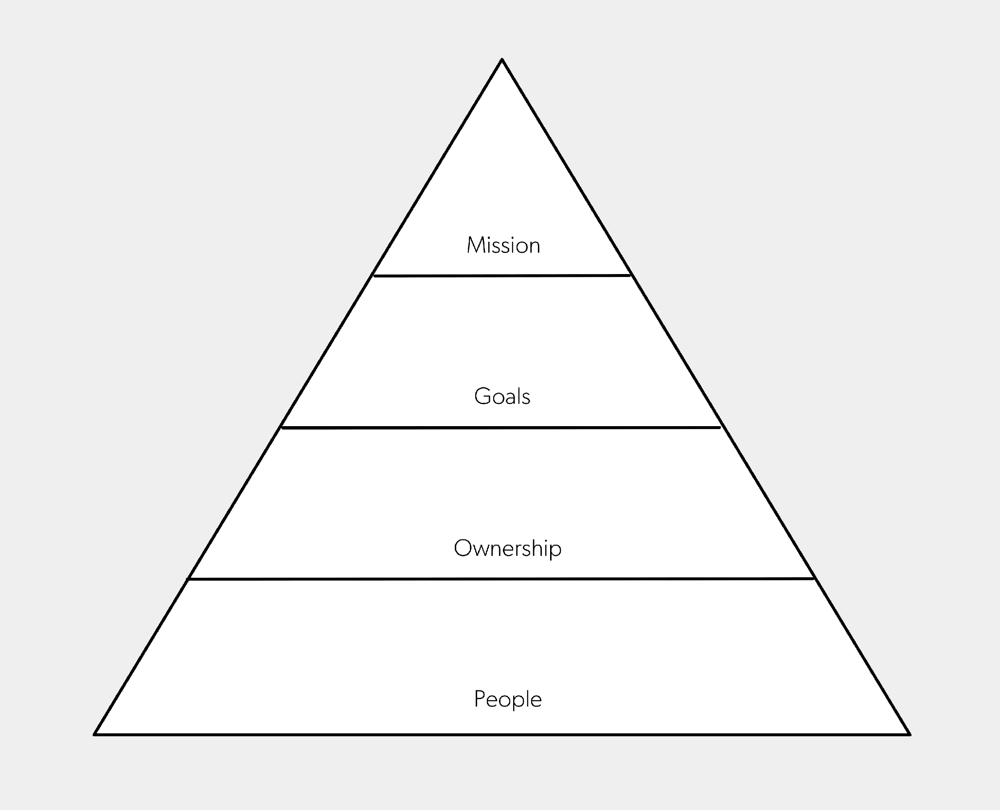

# 激发员工积极性的简单工具|第一轮评估

> 原文：<https://review.firstround.com/the-simple-tool-that-revives-employee-motivation>

当快速增长来袭时，这种期待已久的成功会让许多创始人怀念他们仅仅为产品/市场契合度而奋斗的日子。有新的投资者和董事会成员需要考虑，还有 rsu、mau 和 CPU 需要考虑。在紧迫需求的冲击下，人们很容易希望员工的积极性只受到公司成功的影响。

**[周杰克](https://www.linkedin.com/in/jackwchou "null")** 在这里用 PSA:别这样。

他是凭经验说的。作为 LinkedIn 的早期产品负责人， [Pinterest](https://www.pinterest.com/ "null") 的产品负责人，以及现在 **[Affirm](https://www.affirm.com/business/ "null")** 的产品负责人，周润发一直是一个成功的创业公司。他在 18 个月内将团队扩大了 7 倍，帮助塑造了全新的技术，并将业务线从 0 美元发展到主要的赚钱公司。他理解混乱。但他也知道，没有时间去学习是什么让人们滴答作响(并保持滴答作响)可能意味着繁荣和失败的区别。

在这次独家采访中，周分享了他开发的金字塔，以解释如何建立和保持动力——一种新的需求层次，每个创业公司的创始人和高管都应该内在化。他描述了领导者如何在日常互动中发现萎靡不振的动力，并提供了从今天开始扭转局面的策略。

# 动机的要素

周确定了工作场所激励的四个关键组成部分，他将其形象化为一个金字塔。每一级都为下一级提供了必要的基础；试图建立在不稳固的基础上，你的金字塔将永远不会牢固。当动机崩溃时，你总能从以下四个因素中的一个(或多个)找到原因:

# 人

激励的第一个组成部分是一个人日复一日与之共事的团队。根据 Chou 的说法，当团队动态不稳定时，通常有两个原因。

“首先是**人手不足**，或者一群根本合不来的人。没有什么比感觉自己面临一项不可能完成的任务更能削弱动力了。因此，当一个团队没有资源——特别是人力资源——来实现其目标时，保持乐观和专注是一场艰苦的战斗，”周说。“当我们在 LinkedIn 明确试图解决这个问题时，我们过去常说的一句话是'**现在唯一重要的事情是获得专门资源的小团队。就是这样。其他的一切都会随之而来。"**

团队不稳定的第二个原因是人际摩擦，这是一个更加紧迫且通常难以解决的问题。“如果人们不喜欢和不信任与他们一起工作的人，其余的一切都不重要，”周说。“如果他们这样做了，或者至少尊重其他人的技能，并能够与他们合作，那么我们就有了可以依靠的东西。”

周建议，在合作关系或团队动态的早期，如果双方意见相左，要耐心等待。很多情况下，人们只是需要找到自己的节奏。“也许你应该在一个房间里呆上两个小时，把这些东西用白板演示一下，这样你就可以建立融洽的关系。人们需要时间来通过手续，”周说。

当然，在快速增长的环境中，时间是短缺的。“如果有人是大楼的新员工，你会想，‘哦，谢天谢地，那个人来了，他可以担任我们一直期待的角色。“我们已经有了人才，现在他们就要走了，”周说。“但在可能的范围内，领导者应该将建立信任视为与招聘同等重要的任务。将人们置于这样的情境中，他们*必须*走到一起，一起思考问题，设计解决方案。例如，管理者花大量时间为个人设计初始项目。但他们很少花时间与同事一起设计“跨团队的起步项目”挑战你的经理，让他们创建一个困难但有时限的项目，跨越多个学科，比如设计和销售。这可能是一个简单的新功能，也可能是一个复杂的实验。"

其他时候，你可能会遇到真正不可调和的分歧。在领导者职业生涯的早期，可能会有让事情持续太久的诱惑，相信自己最终会解决问题。周在担任 Pinterest 产品主管期间，与世界上最大的公司之一的产品负责人坐在一起，纠正了他的这种想法。

“我问，‘你看到的最常见的团队关系问题是什么？’我还没来得及回答完这个问题，他就说，“项目经理和设计师。”当时，我也一直面临这个问题。我问他是怎么解决的，他说，‘我只是把他们分开。在我的职业生涯中，有一次我能够让一个项目经理和一个设计师合不来，最终一起很好地工作。但是我已经尝试了上百次了。"

这位经验丰富的产品领导者确实有一个提前解决问题的惯用伎俩:**定期举行团队黑客马拉松，看看哪些团队自然而然地选择了合作。**

当构建项目团队时，人际关系动态是一个重要的考虑因素，产品和设计领导者在做出人员配置决定时，应该毫不犹豫地坦率讨论这些因素。有意关注这些动态是对那些队友的尊重。“我刚刚与我们的设计负责人进行了一对一的沟通，”Chou 说。“我们在谈论一个即将到来的项目。已经给它分配了一个项目经理。现在谁是合适的设计师？我们讨论了与项目经理相处的人，以及在这个团队中，谁最适合这个项目。这种契合一半是功能性的，一半是考虑团队是否会运转起来。”

# 所有权

一旦你建立了一个有足够人员并喜欢一起工作的团队，他们就有能力承担自己工作的所有权，这是激励的第二个组成部分。

随着公司规模的扩大，员工不可避免地会感觉离公司的关键决策越来越远——无论是字面上还是象征性的。“如果我们是一家 10 人的公司，我就坐在做出决策的地方。CEO 可能就坐在离我不到 10 英尺的地方，”周说。“一旦出现快速增长，你不可能让每个人都参与到每次对话中。但是每个人都可以为自己的大局负责。”

为了实现这一目标，领导者需要强调一种所有权文化，推动团队成员在责任没有自然发生的情况下承担起自己的责任。在 LinkedIn 的一次特别难忘的会议上，周就是这样一个推动的对象。首席执行官杰夫·韦纳最近加入公司，周发现自己在向领导团队和他描述一个问题。“我们有大量的广告预算，营销人员想花在我们刚刚起步的营销解决方案业务上，但他们做不到。这是一个很大的机会，我想我真的很聪明，解释了我们面前的这条尚未开发的跑道。我甚至从来没有想到，我的工作就是去追求那种紧迫感，”周说。“我对此漠不关心。是的，事情发生了，作为一家公司，我们必须解决这个问题。"

韦纳拦住了他。“他说，‘你是什么意思？’所以我又说了一遍，“我们作为一家公司将会解决这个问题。”他只是怀疑地问，“杰克，你认为你现在表现出了适当的紧迫感吗？”当我告诉他是的时候，他转身问房间里的每个人是否都认为我表现出了适当的紧迫感。他们中的大多数人说不。那真的会深深印在你的脑海里。"

它也起作用了。周非但没有沮丧，反而兴致勃勃地离开了会场。”我想，“这是我的问题。我必须马上想出如何改变它。“我去跟我的队友说，‘我们需要马上解决这个问题，’”周说。这不是一个重大危机；所有权文化不应该只关注重大时刻。这只是一个专业人士对其商业计划的下一步承担全部责任。"

作为一名领导者，你的工作是为人们提供正确的决策环境，然后帮助他们建立果断行动的信心。例如，在 Affirm，周每周都要举行几次产品评论会。“我总是敦促人们不要给第二组提出两个选项，然后寻求一个决定。“进来说，‘这是我想做的，也是我想做这件事的原因，’”周说。“我建议用类似的方法处理团队间的分歧。只要有可能，确保团队自己找到解决方案。如果你想让人们表现得像主人一样，就不要从外部强加一个。”

领导力意味着为决策扫清道路，而大多数人认为这意味着做出决策。“最近，一些人找到我和我们的首席风险官 Sandeep Bhandari，单独地说，‘X 人，Y 人和我在这个问题上意见不一致。我们无法做出裁决。你们能对此做出决定吗？"

周和班达里短暂地讨论了一下，但没有得出答案——他们迅速打了个电话，要求团队继续自己解决问题。一旦团队习惯于放弃所有艰难决策的所有权，他们就很难保持动力。所以我们告诉他们，‘是的，我们明白了。但是再试一次，”周说。“他们又试了一次，达成了一个非常聪明的协议，比我和 Sandeep 在五分钟内达成的协议还要聪明。他们对此感觉良好。”

然而，放弃所有权并不总是意味着找另一个人来做决定。有时这意味着寻找其他工具来代替他们自己的判断。对考试的过度依赖是周寻找的另一个拐杖。当然，这些数据是有位置的，也是进行实验和 A/B 测试的时候了。但是周鼓励他的团队使用测试来确认赌注——而不是作为另一种推迟决策的方式。

“我总是问，‘如果结果平平会怎么样？“你打算怎么办，”“你不会总是从测试中得到清晰的信号；“其他时候，它不会告诉整个故事，需要权衡利弊，”周说。推动你的团队采取一种立场——一种真实的假设，而不是一种冷漠的假设——并尝试真正地确认或否认它。实验不应该成为消除人类判断和推卸责任的工具。"

在你的团队中培养直觉和自给自足需要耐心；通常情况下，自己打个电话继续前进会更快更容易。忍住那种冲动。你在教他们说，‘这是我想做的事情的计划。这是基本原理。你对此有反馈吗？"

教导你的团队不要总是指望你做决定。这种情况很少通过明确的对话发生，而更多的是通过许多小行为来抵制为它们打电话的冲动。

# 目标

一旦人们内化了对工作的主人翁意识，他们将需要明确的目标来磨练他们的直觉和保持动力。最好的目标是可衡量的，难以实现的，并且对业务有影响的。快速设定这些目标的一个方法是同意[一组目标度量](http://firstround.com/review/im-sorry-but-those-are-vanity-metrics/ "null"):项目、团队或公司进展的度量。但是要小心。如果度量标准没有根据产品的生命周期进行调整，那么它们很快就会从激励变成沮丧。

周确定了产品开发的三个关键阶段:**发明、规模化和优化**。“随着一家公司的成熟，你不仅仅是在试图打造一个你已经打造好的东西。你在试图建造下一个东西。但是你也在努力让你已经建立起来的东西变得更有价值。在每一个阶段，你设定的目标和跟踪的指标都会有很大不同。”

在**产品开发的最早阶段**，度量标准通常还没有发挥作用。“我们这里有一个团队正在研究世界上还没有的东西，”周说。“我们无法真正对照进度指标和目标来审视我们取得的进展。因此，我们需要一定程度的信念和偏好，才能自信地分批出货。如果没有明确的度量目标，处于发明阶段的团队将需要严重依赖金字塔的第四个元素，即使命。

当你有一些在非常小的范围内起作用的东西，但是产生你想要看到的影响的倍数 X，你就在**扩大**一个产品。在这里，度量标准是最重要的，但是 Chou 经常看到团队远远落后。“你会感到震惊的。即使是经验丰富的产品人员在扩展模式下有时也会说，“好吧，如果这个大型复杂的新东西是一个全垒打，我们将获得 5%的提升。”如果是这样的话，你就错过了一些东西。在这个阶段，考虑如果非常成功将会产生更大影响的变化。"

另一方面，在**优化**阶段，小的收益可以以有意义的方式累积起来。“这就是我们认为可能有数百个 1%的机会的地方，如果你把所有这些加起来，就会有很大的不同，”Chou 说。

一旦你理解了你在产品生命周期中的位置，度量就是激励和聚焦团队的一个有价值的工具。Chou 经常发现团队钻研度量标准，却不清楚他们的目标应该是什么。帮助他们设定正确的目标，你也将引导他们如何思考关键的商业决策。

“例如，以一个团队为例。如果他们从未致力于改进产品的某个方面，你可以告诉他们，“我认为年底前这个特定指标的合理目标是 5X”。这不是一个激进的延伸目标。“我认为，如果它不是这个大小的五倍，你可能不应该关心，”周说。然后团队可以说，‘好吧，我们需要在年底前 5X 这个狭窄的数字，而不是我们的目标是 50%的提升。这是一个很大的区别。我们需要改变策略。唯一的办法就是考虑更大的变化。"

“几乎没有什么比告诉一个团队‘嘿，就是这样’更能说明问题了。这是目标。你说得对。“去打这个，”周说。“当你围绕一个目标时，你也可以庆祝正确的胜利，这是保持团队一致和热情的另一个重要方式。你想庆祝你的影响。而不是“嘿，这东西是我们运来的。”"

然后，目标成为一种强大的方式来提供指导，而不损害团队的主人翁意识。

# 代表团

当你到达动机金字塔的顶端时，如果一切顺利，你应该有一个由化学和对他们工作的所有权锻造的团队，这也是由明确的目标和指标驱动的。现在，为了获得持久的激励，你需要确保他们也理解这项工作如何让公司整体受益。

就像所有权因快速增长而变得复杂一样，向 300 个人传达使命比向围坐在一张桌子旁的 5 个人传达更具挑战性。“随着组织的成长，交流变得越来越困难，”周说。“随着员工背景和关注领域的多样化，让每个人都参与进来可能会越来越困难。*如何适应变得非常重要。"*

Chou 推荐了两个策略:**给团队机会与组织的其他人分享他们正在做的事情**,**经常重复你的任务**(并且在许多不同的媒介中)。

“当公司只有 30 人时，你可能不需要建立正式的沟通结构。你可能不需要创造机会让人们把想法带到更广泛的群体中。随着你的成长，你必须做到这一切，”周说。“人们学习的方式也不同，对吗？所以，你必须一遍又一遍地陈述你的使命、你的目的，但也要从不同的声音中以不同的方式陈述[。我见过的最好的领导团队专注于通过各种媒介传达使命。电子邮件。奖励。全体人员发言。目标。所有这些都与任务有明确的联系。我们花很多时间不仅设计产品，还设计我们的团队如何听到使命。盘点一下你的人通过哪些论坛和渠道听到了你的使命。应该是*至少每周*一次邮件，每周一次当面。”](http://firstround.com/review/the-type-of-team-diversity-youre-probably-not-paying-attention-to/ "null")

尽管这可能很耗时，但不要简化这一部分。最终，使命赋予你的金字塔高度，让它成为公司内外其他人的灯塔。强烈的使命感强化了动机的其他组成部分:“你团队中的每个人都是为此而来的吗？人们都在朝着同一个目标努力吗？他们拥有产品决策权吗？作为一家公司，你了解你正在努力做的事情的大背景吗？你能看看你的指标，看看它们如何转化为改善人们的生活吗？”周说。“因为在一天结束时，感觉自己是更大的事情的一部分，这是人们每天去办公室的原因。”

人们希望他们的工作不仅仅是为特拉华州的公司赚钱。

# 如何发现萎靡不振的动机

快速增长令人兴奋。公司会改变和破产。保持金字塔的所有四个层次都是一个不小的壮举，不可避免地，你需要不时地加强它们。当一个团队开始失去动力时，你通常会通过以下两种渠道注意到它:

**输出。**“您看到的输出速度是否符合您的预期？”周说。“如果不是，问问自己为什么。周说:“如果你在涵盖所有职能的小型专门团队中有擅长自己工作的人，如果他们感觉自己是所有者，了解自己的目标以及如何融入公司的使命，他们会行动得相当快。”。如果一个团队落后了，那么，其中一个必要的组成部分可能会丢失。“我曾经观察到一个团队移动得非常慢。在和团队一起深入研究之后，我发现其成员认为他们被迫从事创始人最喜欢的项目。这是最糟糕的，因为他们不仅看不到它如何融入公司的使命，而且他们感觉不到它的所有权。我们一起花了三个小时追溯创始人试图解决的原始问题——并询问他们如何解决这个问题。该团队最终提出了一个不同的解决方案，但同样有效，他们感觉就像所有者一样在努力。”

**交谈。**其他时候，人们可能会告诉你他们正在失去动力。但是不要等待明确的声明——你需要理解言外之意。“成为一名经理是一项非常艰难的工作，这是有原因的:这完全是关于人的。因此，在一本管理书中，事情听起来非常简单，但实际上是一个复杂的难题，”周说。“每个人都是不同的，你真的需要倾听他们的心声。倾听简单的警告短语:“我不知道某某人为什么这么做。”我们在这件事上意见不一致。\ ' \ '我们需要一些时间来决定。又一面红旗？一个不再问问题的团队成员，不再试图找出他们的工作在大局中的位置。在所有这些情况下，重要的是坐下来，想出如何打开它，一直打开。"

那么，诊断萎靡不振的动机的最简单的方法就是创造更多的机会让人们和你交谈。即使是对你团队常规的简单改变也能[打开坦诚之门](http://firstround.com/review/radical-candor-the-surprising-secret-to-being-a-good-boss/ "null")。“我想是安迪·格罗夫说的**一对一应该是 45 分钟而不是 30 分钟，因为所有有趣的事情都发生在 25 或 30 分钟**。你需要问自己的问题是“这个人想告诉我什么，而他们没有告诉我？”找到答案的方法通常是坐在房间里足够长的时间，只是聊天。"

记住，坦诚是双向的。如果你想和你的团队进行最真实的对话，你也需要给他们一些东西。“我尽力做最真实的自己，”周说。“这是我生活中正在发生的事情，这是我关心的事情，这是让我兴奋的事情，这是我不喜欢的事情。”然后当我和人们交谈时，我希望我从他们那里得到很好的信号，而不仅仅是听到他们认为我想听到的。"

# 扭转局势

当你确实发现了动力下降的迹象时，迅速诊断出原因并采取行动。周分享了他在各种角色和公司中看到的一些常见的失败模式，以及对领导者如何扭转激励的建议。

**1。工程感觉是为产品团队工作，而不是和他们一起工作。周已经看过很多次了。虽然工程师可能对构建跨平台的产品负有巨大的责任，但他们并不总是觉得自己拥有产品和正在做出的产品决策。“产品说，‘构建 X，因为我们在构建 Y’，但没有太多的上下文。工程师们感觉不到自己拥有任何东西。”**

**修复** ***:*** 创造那种拥有感。优秀的产品人员会确保他们的同事，包括工程师，是理解问题和制定解决方案的真正伙伴。当一家公司变得足够大时，Chou 已经取得了巨大的成功[将大型技术团队分解成较小的团队](http://firstround.com/review/the-power-of-the-elastic-product-team-airbnbs-first-pm-on-how-to-build-your-own/ "null")并让较小的团队负责一个明确的范围和目标。这不仅让他们更接近关键决策，还消除了谁负责完成最终产品的困惑。“你可以试着告诉 20 个人，他们都应该觉得自己是某样东西的主人，但他们不会这么做。他们在房间里四处张望。”

**2。你的产品经理处于执行模式，但没有人觉得他们与决策有利害关系。**有时，项目经理或团队可能非常接近他们的指标——非常了解他们需要达到的目标和原因——但仍然感觉产品决策不可避免地来自上面。他们很快就陷入了困境，要么为自己感到难过，要么就养成了放弃产品计划责任的习惯。

解决方法:强迫那些领导者做决定。明确一点。“你可以说，‘在任何一家公司，作为产品经理，你都有权利站出来，说出你认为我们应该做什么以及为什么这样做。’”周说。明确分配关键决策的责任。今天早上，我们团队的一位项目经理说，“天哪，我不知道这是谁的电话。”我也不确定。但每当我听到这句话，我就说，‘你会打什么电话？’？你为什么不设法让它开始。那就说说吧。"

将责任推给明显没有动机的人会带来一些好处。首先，对于一个需要解决的问题，你可能会得到一个好的解决方案。然而，也许更重要的是，你让那个人回到游戏中，亲自投入到事情的进展中，以及团队如何到达那里。

**3。领导层已经开始设定和追求大目标——但是团队的人际关系仍然不稳定。“我认为每一个领导者都被这个问题所困扰，”周说。该公司发展迅速，您渴望开始深入研究这些指标和产品路线图。但是“人”在金字塔的底部是有原因的。除非你解决了他们的基本挑战，否则你不太可能真正实现自己的目标。**

对于天生善于解决问题的创始人和早期高管来说，弄清一个受挫团队的真相通常很棘手。“创始人可能会想，‘问题来找我，我想出答案，然后答案就出来了。但是团队的问题不是靠努力思考和想出解决方案就能解决的。其实完全相反。"

解决办法:如果一个团队不能很好地合作，不要因为剥夺他们的主人翁意识而使问题恶化。“停下来，听听人们从哪里来，”周说。“你明白为什么这些人觉得团队没有得到他们信任的人的适当支持，或者他们没有足够的时间来建立融洽的关系？”

很容易假设是什么困扰着一个人。但是除非你问，否则你不太可能准确地诊断出人们真正需要什么。所以，抑制你自己的观点，问一些开放式的问题，然后坐下来消化你得到的任何东西。

**4。你已经关注一个特定的度量标准有一段时间了，但是它不再是你想要完成的正确的度量标准。**产品不断发展，对一次迭代有意义的指标可能对下一次迭代没有价值。例如，Affirm 最近重新评估了他们的关键指标。“我们已经开始把目光转向真正改善人们的生活。“如果一小部分人通过 Affirm 支付他们的大量支出，这很好，但我们正试图影响大量客户，”Chou 说。“所以我们问自己:我们在衡量吗？我们是否专注于此？”

**解决方案** ***:*** 作为一家公司和一个领导团队，不断谈论你的目标和衡量标准。继续询问你所追踪的是否仍然最好地代表了你正在构建的产品。有时候答案是肯定的，你会从再次承诺中受益。其他时候，你会决定重新校准，并在这个过程中明确你的方向。团队可以通过设置默认节奏来评审度量标准和目标，从而实现这一点。在 Affirm，我们每季度进行一次，主要在年中和年末，在 Q2 和第四季度开始时进行。每个团队每次都从基本原则出发分享他们的度量标准和目标，以确保他们每次都在思考这个问题。我们最近改变了主要用户指标，以更好地适应我们业务的变化。"

请记住，指标不仅仅是页面上的数字。它们引领你走向目标。一旦目标变得模糊不清，过不了多久，团队也会失去焦点和动力。“一家健康的公司会在组织的许多不同层面使用指标。他们需要在一起解释时保持一致，”周说。“但最重要的是，它们应该反映出你想要实现的目标。当你试图实现一些哪怕是稍微不同的东西时，衡量标准也可能会改变。”

# 将这一切结合在一起

激励的要素——人、所有权、指标、使命和目的——不仅是激励团队的单个驱动因素，而且当它们按顺序排列并叠加在一起时会更加强大。这就是为什么 Chou 将这些组件可视化为一个金字塔，其中人与人之间的化学反应是主人翁感的前兆，这是有效测量和度量的先决条件。为了激励员工长寿，团队必须达到坚定不移的使命和目标。随着公司规模的扩大，所有这些驱动因素都变得更加难以触及和维系。这就是为什么周指出了两个动机可能下滑的地方，以及如何在常见的紧张情况下纠正错误。

“一旦一个团队可以说，‘是的，我喜欢和这些人一起工作。“我可以做出与我正在做的事情相关的决定，我们正在达到我们的数字，我知道为什么这些数字会转化为我们公司在 5 到 10 年内试图做的事情，”Chou 说。**他们什么时候做的？你很快也会发现这一点。输出会流动。甚至可能超额完成目标。而且，也许与直觉相反，你可能会开始听到更多的争论和激烈的讨论。通常，如果人们正在进行一场健康的辩论，你就处于有利地位。因为如果他们没有参与或积极性，他们一开始就不会关心这些对话。”**

***约翰·费德勒摄影/混合图像/盖蒂图像。***