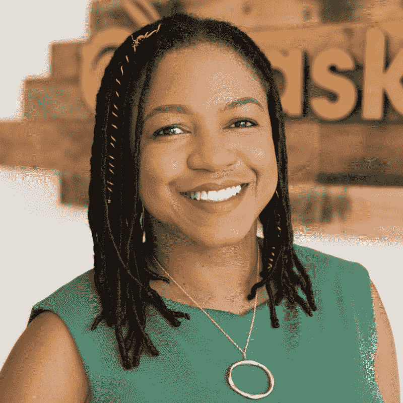

# 管理高管会议的终极指南——来自初创公司高层领导的 25 条建议|第一轮回顾

> 原文：<https://review.firstround.com/the-ultimate-guide-to-running-executive-meetings-25-tips-from-top-startup-leaders>

## 介绍

伟大的会议不是偶然发生的，而是精心策划的。在最好的情况下，高管会议可以加强你的领导团队的纽带，暴露企业面临的关键问题，并为未来制定计划。但当你涉入高管会议的水域时，会有波浪将你抛来抛去。由于时间有限，无法涵盖业务各个方面的紧迫主题，日程安排得满满当当。当应对棘手的挑战时，激烈的辩论可能会很快使对话脱轨，而没有一个解决方案。年度计划是精心制定的，但没有严格的重点，企业可能会失去动力。

高管团队的时间价值不菲，浪费了就可惜了。绘制一条不那么波涛汹涌的航线需要仔细规划，大量的准备工作往往被忽视。看似无穷无尽的微观决策和行动决定了一次振奋人心的会议和一次让你的高管团队感到泄气的会议。

即使你找到了一种足够好的高管会议形式，也很容易打开自动导航——一周又一周地查看相同的指标，遵循相同的议程结构，并且随着你的规模和领导团队的壮大，不改变房间里的人。

但是，调整你的视角，意识到你在这个周会上花了多少时间——并把它重新塑造成团队建设练习——是很重要的。我们遇到的最优秀的高管们，比如 Codecademy 的联合创始人兼首席执行官 **[扎克·西姆斯](https://www.linkedin.com/in/zacharysims/ "null")** ，都在不断修改他们的公式，以便从这段时间里获得越来越多的收益。

在 Codecademy 开始的时候，我假设我会以同样的方式运行管理团队会议，不管我们是 10 人、200 人还是 2000 人。但是，关于会议，要记住的重要一点是，你的工作永远不会结束，总有需要改进的地方。

在这次评估中，我们分享了之前关于充分利用会议的建议，从[团队同步](https://review.firstround.com/better-meetings-make-for-better-days-20-tactical-ideas-to-try-out-with-your-team "null")到[与直接下属 1:1](https://review.firstround.com/managers-take-your-1-1s-to-the-next-level-with-these-6-must-reads "null")到[团队务虚会](https://review.firstround.com/use-this-startups-playbook-for-running-impactful-virtual-offsites "null")到[董事会](https://review.firstround.com/The-Secret-to-Making-Board-Meetings-Suck-Less "null")。我们还分享了关于[组建高管团队的建议](https://review.firstround.com/assembling-an-executive-leadership-team-is-daunting-let-thumbtacks-ceo-help "null")。但我们并没有专门关注让高管团队会议更有意义的艺术。考虑到这一点，在过去的几周里，我们联系了一些我们所知道的最敏锐的创业领导者，询问他们对这个问题的看法:

## **关于管理高管会议，你的最佳建议是什么？**

接下来是一份不容错过的框架、技巧和战术想法的清单，来自 Superhuman、Asana、Lattice 等顶级初创公司的高管们。总体而言，这些领导人拥有数十年的管理高管会议的经验，并渴望分享他们来之不易的经验。

正如你在回复中注意到的，其中一些建议可能会相互矛盾。一些人主张从整个组织中引入特邀演讲者，另一些人总是坚持只邀请执行团队。一些领导更喜欢抽出时间来查看 KPI 仪表板，其他人则更喜欢关注无法异步覆盖的主题。这些矛盾是有意造成的。

这并不是将所有 25 个技巧复制/粘贴到你自己的高管会议行动手册中的权威指南。我们的目标是让你在读完这篇文章后，至少有一些新的想法，你很乐意尝试与你的业务和管理团队风格最匹配的想法。为了使列表更容易理解，我们将它分成了五个类别，从开始与执行团队合作到制定议程和跟踪成功——使用左侧的大纲导航到每个部分。

如果你是一个从未坐过首席执行官位子的第一次创始人，有大量的战术建议可以绕过常见的高管会议坑坑洼洼——从你第一次设计会议时问自己的问题，决定会议议程的具体框架，到在整个组织内分享调查结果的技巧。即使你是一位经验丰富的高管，多年来一直参加这种类型的会议，这本书也有望激发一些新的想法，带给你的同事。我们希望下面的列表能为构建你自己的鼓舞人心的、有效的高管会议提供详细的指导。让我们开始吧。

# **打好基础**

## **1。戴上你的名牌帽子。**

在发出一系列日历邀请之前， **Asana** 首席运营官**安妮莱蒙迪** 敦促人们休息一下，记下他们的想法。“你需要带着考虑你想要创造的体验的心态去做这件事。伟大是什么样子的？”她说。(这个建议让我们想起了 Sitka 如何采用类似的方法来设计其第一个虚拟异地[。)](https://review.firstround.com/use-this-startups-playbook-for-running-impactful-virtual-offsites "null")

首先要回答几个关键问题。“你必须后退一步，决定会议的目的是什么。观众是谁？你想从会议中得到什么？你在做决定吗？确保你们在优先级上保持一致？提供更新？解决冲突或分歧？无论目标是什么，你如何设计这种体验来达到你想要的结果？”莱蒙迪说。

把自己当成设计师，把会议出席者当成你的客户。你如何为他们设计最好的体验？

## **2。不要即兴发挥。**

Jack Groetzinger, Founder & CEO of SeatGeek

回顾他十多年来作为首席执行官和 **SeatGeek** 、**[Jack](https://www.linkedin.com/in/jackgroetzinger/ "null")****[Groetzinger](https://www.linkedin.com/in/jackgroetzinger/ "null")****的创始人，指出了他陷入的一个陷阱，这在早期创业公司中是司空见惯的。“我们等了太久才正式组建我们的高管团队，并开始定期开会。**很长一段时间以来，我们不喜欢创建一个分层系统的想法，在这个系统中，有人在里面，有人在外面。但事实是，不管怎样，这个团体还是有效地存在了。****

**他指出了这种早期方法的几个缺陷。格罗青格说:“小组之间的交流感觉太集中了——一小部分人都在进行类似的对话，这显然是一种低效的讨论方式，而不是把所有人都聚集在一个房间里。”**

**他还强调了一项容易被忽视的福利。“领导大型组织的人有时会觉得他们没有同事，就像你在一个特定的职能团队中担任 ic 一样，”他说。“当我们最终将高管团队正规化，并开始举行团队会议和活动时，这帮助我们的高管意识到，他们在 SeatGeek 有一个同龄人群体，而不是独自一人。”**

## ****3。考虑引入增援。****

**虽然主持高管会议的主要负担通常落在首席执行官的肩上，但安妮·莱蒙迪鼓励首席执行官们诚实地说出他们对工作的热情程度。“诚实和有自知之明很重要。你真的喜欢制定议程、思考流程、让人们走上正轨的过程吗？还是有感觉不自然的过敏反应？”她说。**

**她的建议？不要咬紧牙关，因为你认为这是你*应该*做的。她说:“如果你觉得不自然，那就和团队中能帮助你的人合作，或者接管会议的主导权。”**

**早些时候，Zach Sims 意识到他在 Codecademy 陷入了同样的陷阱。**

**我发现很多 CEO 都不擅长开高管团队会议。有一段时间，我主持会议，因为我认为这是我必须做的，尽管我不擅长。我很快意识到这是错误的方法。**

**相反，他尝试每周在管理团队之间轮换职责，但这并没有完全解决问题。“我们认为这将有助于每个人在会议中感受到主人翁感，但这变成了一场噩梦，因为你在每周的会议之间没有连续性，”西姆斯说。最终，他把所有权交给了他的幕僚长，并发现所有的部分都到位了。**

****[艾利森·皮肯斯](https://www.linkedin.com/in/allison-pickens/ "null")** **，**gain sight 的前首席运营官和**新常态基金的现任创始人，**也指出[幕僚长是 CEO 工具箱中未被充分利用的工具](https://review.firstround.com/why-you-need-two-chiefs-in-the-executive-office "null")。“我认为，创始人聘用幕僚长的时间比他们应该聘用的时间要晚，而高管会议只是幕僚长能够产生巨大影响的一个领域。她说:“提前发送内容，让人们为他们应该思考的话题做好准备——对于一位首席执行官来说，大量的准备工作对于一场成功的会议非常重要。**

**如果你还没准备好任命一个幕僚长，试试这个来自首席执行官的想法。“**我们亲切地称之为“轮值参谋长”——一个主管级别的人组织一个季度的每周高管会议，然后在下一个季度将任务移交给下一个人。Mickos 说:**这增加了会议的有序性和趣味性，并为该季度的轮值参谋长提供了对公司运营方式的独特见解。请注意，该角色仅每季度轮换一次，避免了 Zach Sims 提到的每周轮换所有权可能带来的混乱影响。**

## ****4。对它在日历上的位置要有策略。****

**

Edith Harbaugh, Co-Founder & CEO of LaunchDarkly** 

****launch blackly 的联合创始人兼首席执行官伊迪丝·哈博**,鼓励其他首席执行官在日程排得满满当当时，不要急于改变例会。“当会议日期和时间总是在变的时候，我发现它的效果会差很多。她说:“时间表并不总是一致的，人们找不出新的时间，或者你最终没有太多的话题可聊，因为你们只是几天前才认识的。”“我尽量保持日期和时间完全一致——即使这意味着我在东京是早上 5 点打电话，在葡萄牙是晚上 10 点。”**

**扎克·西姆斯还发现，日期和时间对会议成果有着巨大的影响。“我们过去常常从周一上午的高管团队会议开始，认为这将为一周的剩余时间定下基调。他说:“这听起来是件小事，但将它们改到周二午餐时间，产生了巨大的影响。”。原因如下:**

****"** 当你在周一上午 9 点开会时，你可能要到周日晚上 9 点才能最终确定议程。我们一直在举行这样的会议，人们没有完全准备好或者没有阅读议程。通过在周二做，人们可以利用周一做预读，为讨论做好充分准备。”**

**“我发现，在午餐时召开会议，让所有人一起吃饭，可以在团队中创造一个更具社交性、更融洽的环境。”**

**“特别是在 COVID 期间，人们分散在地图各处，在中午举行会议有助于跨越时区。”**

# ****为成功创造条件。****

## ****5。提前交作业。****

**任何读过 **Superhuman** 创始人兼首席执行官**[Rahul Vohra](https://www.linkedin.com/in/rahulvohra/ "null")****关于[寻找产品/市场契合度](https://review.firstround.com/how-superhuman-built-an-engine-to-find-product-market-fit "null")的评论文章的人都知道，他是框架和文档的忠实粉丝(如果你还没有，把它添加到你的书签列表中)。当谈到管理他的高管会议时，几乎议程上的任何事情都有书面记录，分为三类。****

******参考消息:**“这是一种你并不期待投入或对话的事情，你只是让其他人知道你组织中的一些变化。”****

******问题:**“这不到半页，包括 1-2 句对问题的描述，最重要的是，1-2 句对您的预期解决方案的描述。员工会议的理想流程是，提出问题和解决方案的人会问:“有人不同意我的解决方案吗？”如果没有人回答，我们可以继续，这是一个 30 秒的讨论。有了更多的初级员工团队，他们会带来问题，但他们不会限制自己带来解决方案——这部分真的很重要。"****

******快速:**“对于更棘手的决策，我们遵循传统的[快速框架](https://www.bain.com/insights/rapid-tool-to-clarify-decision-accountability/ "null")——列出我们试图解决的问题、建议的解决方案、负责人、其他人的意见以及最终决策。”****

****如果你发现你的会议开得太长，他建议你试试这种方法。“这极大地减少了会议时间，因为会议中的大部分时间都花在了交流你的想法上。他说:“这应该异步进行，留出更多时间进行讨论。”。****

****虽然沃赫拉带头召开会议，但制定议程是一项集体工作。“我倾向于通过说‘看起来我们本周有 5-6 个讨论点，我们只有 4 个讨论点的时间’来获得群体的脉搏。我认为这是前四名，大家怎么看？他说:“在 20 秒钟内，你就能感觉到这些是不是最重要的东西。”。****

****作为首席执行官，你试图将决策推给组织，除非这确实是一个不可逆转的决策。但是大多数决定不是不可逆转的。****

## ******6。强制预读。******

****

Rahul Vohra, Founder & CEO of Superhuman**** 

****很多人使用预读来简化会议主题。但是日历填满了，在你知道它之前，那些预读变得更少需要*和更多*如果我到达它们*。沃拉用严格的规则来强制执行这种行为。他说:“如果你事先没有阅读并评论这份文件，你就不能在会议上谈论这个话题。”。*****

****他称这种策略是他的高管会议中最大的游戏规则改变者。“我的员工会议过去常常要开两个甚至三个小时，我们会遇到各种各样的问题。有些人会做作业，有些人不会。沃赫拉说:“大量时间被浪费在交流想法或问题上，而不是讨论想法或解决方案。****

****现在，所有文件都至少提前 24 小时提交，让人们有时间阅读和评论。“很容易落后，人们会说他们没有时间。但是，如果你强化他们没有时间就不能讨论这个话题的规则，人们往往只会犯一次这样的错误，”他说。****

## ******7。具体到特邀演讲人。******

****扎克·西姆斯(Zach Sims)喜欢让公司的其他人出席他的高管团队会议，但有一点要注意。“对于人们来说，从高管那里获得实时反馈非常有用，但我总是发现，对于刚进来的人们来说，最难的事情是理解海拔高度。他说:“如果一位项目经理加入讨论他们正在开发的产品，他们并不总是清楚高管团队在会议中有多少背景知识。****

****任何前来演讲的嘉宾都需要提前 24 小时提交一份预读材料，明确概述他们希望从会议中获得什么。“你想调整团队吗？您是否希望在管理层提供背景信息？还是你想做出决定？提前列出这些目标意味着每个人都带着相同的期望而来，我们不仅仅是在做仓促的决定，”西姆斯说。****

## ******8。避免意外。******

****对于任何特别棘手的讨论点，新常态基金的艾利森·皮肯斯建议采取更长的时间跨度和个人接触点。“一个很好的经验法则是，如果你[预见到冲突](https://review.firstround.com/our-6-must-reads-for-cutting-through-conflict-and-tough-conversations "null")，给人们一个提前思考这个话题的机会，”她说。****

****不要让人们惊讶于他们应该马上讨论的有争议的话题——坏消息在群体环境中会被放大。****

****“有些人是内部处理器，他们需要时间独立思考。皮肯斯说:“试着提前与高管团队的不同成员联系，了解他们的反馈，并预测人们可能会提出的问题或异议。****

# ******决定世卫组织的房间。******

## ******9。从一开始就要有选择性。******

****

Zach Sims, Co-Founder & CEO of Codecademy**** 

****早些时候，扎克·西姆斯向 Codecademy 的任何管理部门的人开放了他的行政会议。“随着公司的发展，我们建立了中层经理层，这意味着首席营销官和负责客户支持的高级经理在同一个房间里。这极大地改变了谈话的高度，”他说。“我需要让每个人都明白，随着公司的发展，我作为首席执行官的目标是减少我的直接下属数量。”****

****为了改变路线，他减少了会议室中专注于副总裁及以上级别人员的人数，并为董事及以上级别人员建立了月度会议，另外还为 Codecademy 的所有管理人员建立了季度会议。****

****当你的公司和领导团队很小的时候，在你的会议上采取“越多越好”的方式似乎没什么大不了。但是**task rabbit**的前 CEO 和软银机会基金**的创始成员 Stacy Brown-Philpot 对这种方式提出了警告。******

******从一开始就限制房间里的人数——以后你可以随时增加。但是，如果有一天你决定要从八人会议变成五人会议，那就很难追溯了，因为人们不喜欢感觉有什么东西被夺走了。******

## ********10。试着坚持核心小组。********

****虽然**Lattice**的首席执行官兼联合创始人杰克·奥特曼(Jack Altman)经常从高管团队之外请来演讲嘉宾，但他发现在有限的情况下效果最好。“我们曾有过非执行董事占会议发言时间比例过高的情况，但我们最终还是将这一比例拉了回来。他说:“让团队中的其他人参加会议来介绍某个主题当然很有价值，但这不应该成为会议的默认内容。”。****

****他列举了几个理由，说明为什么应该采取有限的方式邀请非执行董事:****

******锻造债券。**“高管会议是高管团队真正成为一个团队的宝贵时间。该组织的会议以及我们共度时光的方式应该有一定程度的神圣性。”****

******拥抱粗糙的边缘。**“当其他人进来向高管团队介绍时，你通常会进行非常有准备和干净利落的谈话，而不是在人们没有过度准备的情况下进行更原始的讨论。”****

******看时钟。**“从会议长度的角度来看，外部发言人往往会主导会议。没有特邀演讲者，我们可以讨论更多的话题。”****

****

Jack Altman, Co-Founder & CEO of Lattice**** 

****这是奥特曼*为其他人开辟空间的时候。他表示:“对于涉及大量细节的重大、长期、复杂的决策来说，让某人来介绍这些细节，并告知执行团队，可能真的很有价值。”。“一个例子可能是，如果你正在考虑国际扩张——这是一个长期的话题，将对公司产生多年的影响，而且有许多令人毛骨悚然的细节。引入能够教育高管团队的人是值得的，高管团队最终将做出重大决策。”*****

****杰克·格罗青格(Jack Groetzinger)发现，当他过于倾向于让非执行董事发言时，他的意图被误解了。“人们觉得被邀请在高管会议上发言成了一种身份象征，或是对他们职业生涯至关重要的关键绩效指标。因此，我们制定了一个严格的规则，只让高管团队在场，”他说。****

## ******11。清楚你为什么缩减规模。******

****虽然我们采访的人对谁应该在房间里以及什么时候在房间里持有不同的意见，但普遍的共识是坚持一位数的与会者人数——或者像伊迪丝·哈博如此恰当地说的那样，“试着把你的缩放比例保持在 9 的布雷迪·邦奇广场”****

****让人们离开会议，即使是出于好意，也会引起恼怒。拉胡尔·沃赫拉建议承认房间里的大象。“实施任何变革的最佳方式是承认变革是艰难的。他说:“这是关于承认总有改进的空间，特别是在像 Superhuman 这样的公司，我们存在的全部理由就是尽我们所能做到最好，并实现我们的全部潜力。”。他的变革管理建议？让它试运行。”沃拉说:“只要得到团队的同意，让你试用一两个月。****

****安妮·莱蒙迪建议从房间里的其他人那里获得反馈。“良好的变革管理意味着交流原因。嘿，我们这么做是为了更有效。她说:“人们告诉我们，这个会议很笨拙，我们都感觉到了，所以我们要做出一些调整。”。****

## ******12。在整个组织内分享议程。******

****虽然议程列表上可能会有一些仅供高管耳目的话题，但默认情况下不应该将所有讨论都锁起来。“很长一段时间以来，高管会议是了解企业运营状况的最佳方式。**但你必须建立比高管会议更好的机制来发布业务信息。这是你能够将这种环境扩展到更广泛的组织**的唯一方式，**[eero](https://www.linkedin.com/in/nsweaver/ "null")**的首席执行官兼联合创始人尼克·韦弗 说。****

****首先，安妮·莱蒙迪建议在整个组织内分享议程，除了高度机密的话题(比如人们的讨论)。“有一个正在运行的谷歌文档或 Asana 项目，列出要讨论的主题，然后在会后填写做出的任何决定或后续步骤，”她说。“我已经看到，这一小步对消除参加高管会议就等于获得信息和影响力的观念大有帮助。”****

****如果你对会议没有兴趣，甚至对你的文化没有兴趣，你可能会陷入这样一种境地:某些会议被视为一种途径、一种权力、一个席位。****

# ****充分利用你们在一起的时间。****

## ****13。从入住开始。****

****

Stacy Brown-Philpot, founding member of SoftBank’s Opportunity Fund**** 

****斯泰西·布朗-菲尔波特和扎克·西姆斯都相信从快速(或不那么快速)的签到开始。布朗-菲尔波特说:“我们会在房间里四处走动，检查你做得怎么样，你如何出现在会议上——这可能会延伸到工作之外的事情。”“这让每个人都有机会看到人们带进房间的东西，因为当你有其他事情分散你的注意力时，你很难完全在场。我的管理团队会议通常持续两个小时，我们有时会花 30 分钟进行签到，因为我们发现这些会议非常有价值。”****

****我们都参加过那些有人看起来有点紧张的会议——西姆斯同意，把这一点说出来是很重要的。“我们从你在职业和个人方面的感受开始。你可能会听到有人说，“我昨晚睡了四个小时，所以我有点不高兴来参加这个会议。”他说:“当你不能 100%参与谈判时，坦诚有助于带来必要的背景。****

## ******14。轮换您的指标花名册&探究原因******

****艾莉森·皮肯斯养成了在高管会议上审核 KPI 的习惯——做一些关键的调整。“一旦你到了某个阶段，重要的是不要在每次会议上都回顾相同的指标，因为这些指标不会每周都有意义地变化。她说:“当你浏览仪表盘时，人们会自动驾驶。”****

****相反，她建议每周轮流阅读哪本 OKR，作为深入思考的一种强迫功能。“通常，我发现人们分享相对于目标的当前指标、预测以及我们预测高于或低于目标的任何差异背后的‘原因’是有帮助的，”她说。“为什么变得比实际数字更重要。我们应该能够解释‘这些是起作用的因素，以及为了恢复这一指标正在采取什么措施。’"****

## ****15。挑起健康的冲突。****

****当杰克·奥特曼(Jack Altman)回顾他担任 Lattice 首席执行官期间最具影响力的高管会议时，有一条共同的主线。“最好的会议是进行实质性辩论的时候，不同的想法既合理又充分。这是真正取得进步的地方，”他说。“在这些时刻，你意识到你看到了以前看不到的问题的角度，或者你学到了新的权衡。“与‘我们都同意，只是转移到下一个话题’相反，我们学到的东西要少得多。”****

****为了激起积极的、建设性的辩论，奥尔特曼试图创造一种文化，让人们对不同意见感到舒服。“首先要在团队中营造一种文化，并在一定程度上保证对话的安全性。他说:“这并不意味着允许事情突然爆发，变得紧张，但也要确保事情不会被过度消毒，人们不会一直感到有压力。”。****

****当你看到健康冲突的开端时，你应该投身其中。说，“这很有趣，感觉很有成效。大家说说吧。”这表明你在有意培养不同的想法。****

****当你邀请一位明星嘉宾参加高管会议时，这个想法也适用。“当有人进来展示他们过去六个月一直在做的东西时，很难做出批评。杰克·格罗青格说:“但接下来的会议中，你只是在拉拉队，没有富有成效的反馈或决定。“在每次会议之前，我都想提醒每一位与会者，我们正在将批评文化常态化——这不是人们应该针对个人的事情，而是因为这是我们获得最佳结果的方式。”****

****一定要留意谁在发言，谁保持沉默，尤其是在棘手的讨论中。“如果每个与会者的发言时间都差不多，这就是一次好的会议。通常，会议主持人会提醒还没有发言的人——“嘿，蒂姆，你对此有什么看法？””马腾·米科斯说道。****

## ****16。关注正确的时间范围。****

****

Marten Mickos, CEO of HackerOne**** 

****米科斯指出了一个没有足够多的人考虑的特殊会议挑战。“对于议程上的每个项目，重要的是与会者都知道正在讨论的时间范围。这个话题应该每周、每季度还是每年看一次？”他说。“每周的话题都很繁忙，需要迅速做出决定。季度或年度主题是战略性的，这允许更多的思考。会议负责人应该通过让每个人都有正确的时间视野思维来开始每个主题，否则，一个参与者可能会因为没有做出决定而感到沮丧，另一个参与者可能会因为没有详细讨论策略而感到沮丧。”****

## ******17。拿起你的秒表。******

****管理议程看起来很简单，但实际上很难做好。在高管会议上，你可能最终只是围绕主题打转。扎克·西姆斯说:“举个例子，我们最近谈论了我们今年剩余时间的[财务规划流程](https://review.firstround.com/the-secret-to-a-great-planning-process-lessons-from-airbnb-and-eventbrite "null")，这本来可以是一次两小时的谈话。****

****为了避免议程脱轨，正常拉动开伞索。“我的幕僚长恰好特别擅长这个。我们在做绩效评估，并围绕着我们已经谈过很多次的同类话题。你应该在曲线上评分吗？应该不会吧？”他说。“在我们开始两分钟后，他说，‘看，如果你有反馈，把它和好的建议一起用电子邮件发给我。我们将进入议事日程上的下一个议题。"****

****杰克·奥特曼和拉胡尔·沃赫拉都试验过特定的参数来强化这种行为。“我记得有一个季度我们把它发挥到了极致，我们规定在高管会议上，我们只谈论 4-5 个与公司目标密切相关的特定话题。奥尔特曼说:“任何时候，如果有不在清单上的东西被提出来，就需要把它推广到更小的群体中。“**我们没有严格遵守规则，但这有助于我们作为一个团队进行再培训，并为需要我们所有人参与对话的最关键话题节省高管会议空间**。”****

****在 Superhuman，Rahul Vohra 坚持一个严格的时间表和快速的框架来保证他的会议按计划进行。“如果在五分钟内没有达成[决定或共识](https://review.firstround.com/the-6-decision-making-frameworks-that-help-startup-leaders-tackle-tough-calls "null")，我们会严格要求确定一位决策者来采取下一步措施，然后停止对话，”他说。“如果没有决策框架，有争议的话题可能会周而复始，即使决策者在房间里试图推动达成共识。”****

****没有时间限制，热点问题可以被讨论得令人生厌，而其他同样重要的话题则乏善可陈。****

****他承认，五分钟的时间限制是特别雄心勃勃的，并鼓励人们从 10 分钟开始，建立他们快速讨论的肌肉。****

## ******18。扔掉滑梯。******

****以效率的名义，杰克·格罗青格(Jack Groetzinger)在 SeatGeek 的高管会议上宣布幻灯片为非法——取而代之的是，[借鉴亚马逊(Amazon)的方法](https://review.firstround.com/how-to-build-an-invention-machine-6-lessons-that-powered-amazons-success "null"),即写一份简报，让每个人花几分钟时间给自己朗读。原因如下:“演示本质上是一种效率较低的信息交流方式——确切地说，每分钟你能读到的单词比你能说的还要多，”他说。****

****当人们读完简报后，小组立即开始讨论。否则，主导简报的人往往会试图发表更多意见或补充更多想法。但如果分享真的那么重要，你应该在一开始就在简报中写出来，”他说。****

****Groetzinger 还发现，这种不利于下滑的方法使得竞争更加公平。“对一些人来说,[发言是骄傲的源泉，他们可能会说得太久，因为他们喜欢听自己说话。对其他人来说，说话是焦虑的来源。取缔幻灯片让我们专注于内容和数据，”他说。](https://review.firstround.com/the-engineering-leader's-guide-to-crafting-a-personal-brand-that-stands-out-from-the-crowd "null")****

## ******19。收拾残局。******

****“在高管会议期间，可能会出现新的话题，人们可能会对你没有考虑过的问题提出新的解决方案，或者你可能无法触及议程上的每个项目。Marten Mickos 说:“这些都是需要记录在案的零星问题。他建议使用包含会议议程和会议记录的谷歌文档，会议中的每个人都有编辑权限。当出现一个松散的结尾时，在文档中添加一个关于后续步骤的注释——它会被推到下周的讨论中吗？更小的群体会聚在一起达成共识吗？文档是确保没有任何漏洞的关键。****

## ****20。依靠你的异步工具。****

****

Nick Weaver, Co-Founder & CEO of eero**** 

****随着人们现在跨越时区，“异步”已经成为去年的热门词汇之一。这就引出了一个问题——什么在会议中得到覆盖，什么留给异步渠道？****

****“我认为两者兼得很重要。你应该有很多仪表板，公司的很多人都可以访问。但最重要的部分是对这些仪表板的检查和对这些数字的辩论，这真的很难异步完成，”尼克·韦弗说。****

****一些最好的会议是那些没有太多内容要讨论的会议，因为这些内容已经在其他沟通机制中涉及到了。这给了你宝贵的非结构化的时间，让你作为一个团队去挖掘一个你没有预料到的问题。****

****以下是他在 eero 的做法。“我们关注每个部门业务的逆风和顺风——如仪表盘所示。他说:“高管会议不是决策会议，而是分流会议。“这意味着要想出更深入地解决问题的下一步措施，以及从整个组织中寻找哪些人。随着公司规模的扩大，这有助于公司更多的人了解决策过程，而不是感觉这是一个黑匣子。”****

****杰克·格罗青格也避免在仪表板上读出数字。“我们对高管会议所做的最大改变是，将注意力完全集中在不明显的重要决策上。他说:“我们不是每周报告关键绩效指标，而是专门关注那些悬而未决、我们希望得到反馈的话题。****

****当 Groetzinger 和他的幕僚长一起策划议程时，他会就清单上的每个主题提出一个问题:“**‘这里需要决定的是什么？“如果没有任何进展，我们就异步更新每个人。”******

# ******继续进化******

## ******21。做个脉搏检查。******

****“高管会议占用了房间里每个人的大量时间和精力。安妮·莱蒙迪说:“在经营和发展企业面临的所有其他挑战中，你最不需要的就是让那次会议成为一次糟糕的重复经历。”。****

****她的推荐？创建一个简短的调查，分发给管理团队的成员。以下是一些需要考虑的问题，包括:****

****你最喜欢会议的哪一部分？****

****你觉得什么最有帮助？****

****你觉得最没帮助或最没效率的是什么？****

****如果你能改变一件事，你会改变什么？****

****感觉就像是首席执行官独自掌控着会议——议程、流程、整个体验。但是，房间里的每个人都应该感到有责任尽可能把会议开得最好。****

****伊迪丝·哈博建议一对一地把每个人拉到一边，问一个特别的问题:“**当你离开我们的高管会议时，你是感到精力充沛还是感到疲惫？”******

## ******22。给改变时间。******

****

Anne Raimondi, COO of Asana**** 

****收集调查反馈只是第一步，为值得考虑的改变勾勒出路线图。莱蒙迪说:“当你有调查反馈可以依靠时，根据这些反馈进行改变就变得容易多了。”。****

****她概述了几个例子。“有时变化更为显著，比如削减与会者名单，因为它变得太笨拙了。但有时变化会更小。她说:“当一切都转向 Zoom 时，我们意识到我们错过了开始时那种无组织的时间，你可以在那里闲聊你的周末。”“相反，事情变得如此严重，我们直接进入了议程。我们从一开始就开始实施 7 分钟的自由流动时间，这真的改变了整个会议的基调。”****

****但她见过一些不同的首席执行官掉进了一个陷阱。“我曾为一位首席执行官提供建议，他知道自己在努力组织高管会议。莱蒙迪说:“我与他的领导团队的每个成员都进行了单独交谈，从这些讨论中得出的一个关键见解是，他们改变事情太频繁了。****

****相反，无论何时你实施改变(或大或小)，试着坚持至少三个月。“在你评估这个习惯是否与你期望的结果背道而驰之前，先让它养成。否则，如果你总是跳到下一个看起来不错的想法，人们就会受到打击，”她说。****

## ******23。写下你的会议规范，并经常重温。******

****拉胡尔·沃赫拉建议具体说明你希望在房间里看到的会议行为。“我们将员工规范写在所有会议文件的顶部，所以我们会不断提醒大家我们希望大家拿出什么成果，”他说。****

****但是这并不是一个一劳永逸的活动——这些规范每年至少会在超人的场地上修订两次。“我们会问，‘这些还是我们想要强化或改进的行为吗？’”他说。****

****以下是超人员工规范的最新列表，供你在制定自己的规范时参考:****

******认可努力、成功并展示认同:**在审核文档时，加 1 分、优点等。当你看到某人在他们关注的领域取得进步时，告诉他。****

******没有神圣不可侵犯的目标:**对改变我们今天所做的事情持开放态度。说“过去行之有效的一件事是”与“这是我们做事的方式。”****

******努力协作:**抽出时间进行一对一交流，并在员工之间建立关系。问“我能帮什么忙？”****

******向未知敞开心扉，拥抱模糊:**说“让我们试试吧”，倾向于“是的，还有…”****

******理解你自己的意图，拥有你的选择权:**说“这是我的观点。”在有分歧或紧张的地方，适当地反映和使用“我觉得”的陈述。例子:“我对这一变化感到沮丧，因为它对我和我的团队很重要。我想知道是否有办法保持这种*或*我们是否考虑过这种影响*或*我们如何可能仍然能够做 X？”****

******积极主动:**带着乐观的态度。寻找让看似不可能的事情成为可能的方法。****

## ******24。发展一种共同的语言。******

****

Allison Pickens, Founder of The New Normal Fund**** 

****为了让你的高管团队和谐工作(或者如果你偏离了方向，让船回到正确的方向),艾莉森·皮肯斯建议了一些不同的练习。“当然，像[九型人格图](https://www.enneagraminstitute.com/ "null")这样的人格测试并不完美，但它有助于人们开发一种语言来阐明是什么导致他们以特定方式做出反应，并根据他们的人格类型建立与他人互动的新方法，”她说。****

****考虑把这些加入你的阅读清单:****

********[自我破坏评估](https://www.positiveintelligence.com/assessments/ "null")** **:** “破坏者”是指那些妨碍你与他人交往的人。根据我们在 Gainsight 的经验，该框架帮助人们发展更高的自我意识，这是建立情商的第一步。如果你了解自己，你就可以开始改变自己对某些触发因素的反应。”******

********[“团队的五大功能障碍](https://www.amazon.com/Five-Dysfunctions-Team-Leadership-Fable/dp/0787960756 "null")****”:**“这是一本你可以在几个小时内看完的快速读物，讲述了团队动力退化的经典方式。当一个团队功能失调时，它会让人感觉非常私人化，所以这有助于人们理解，许多团队都经历过可以克服的类似模式。”******

****["](https://www.amazon.com/Nonviolent-Communication-Language-Life-Changing-Relationships/dp/189200528X/ref=sr_1_3?dchild=1&keywords=nonviolent+communication&qid=1628205650&s=books&sr=1-3 "null") **["非暴力沟通"](https://www.amazon.com/Nonviolent-Communication-Language-Life-Changing-Relationships/dp/189200528X/ref=sr_1_3?dchild=1&keywords=nonviolent+communication&qid=1628205650&s=books&sr=1-3 "null")** **:** "这是一个很受欢迎的选择，理由很充分——有很多关于用同理心领导的重要见解，尤其是在有分歧的时候。"****

## ****25。寻找会议纪要。****

****如果你读到了这篇文章的结尾，我们可以有把握地假设你对提升你的高管会议游戏是认真的。记住这一点，这是安妮·莱蒙迪给你的最后一个建议。“我们假设人们知道一个好的会议是什么样的，或者会议中应该发生什么。但事实证明，很多人害怕开会——因为世界上有很多管理不善、耗费精力的会议，”她说。****

****她的建议？依靠其他创业领导者的支持网络。“开始询问你信任的人，‘告诉我你参加过的最好和最差的高管会议。什么使它成为最好的？是什么让它变得最糟糕？”她说。****

****如果你发现有人因为主持顶级会议而特别受人钦佩，不要害怕要求加入。“如果你没有经历过一个运行良好的会议，很难知道其中的区别。莱蒙迪说:“你参加超高效会议的次数越多，你就越能体会到什么是伟大。”。****

*****盖蒂图片社封面图片/柳德米拉·亚列门科*****